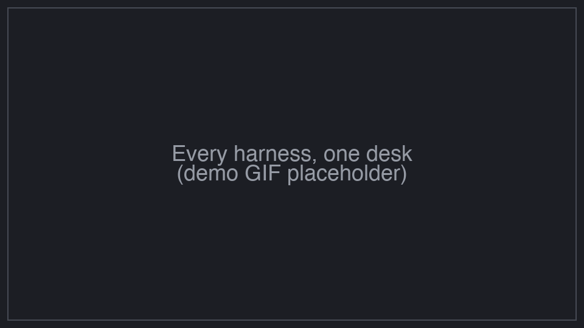
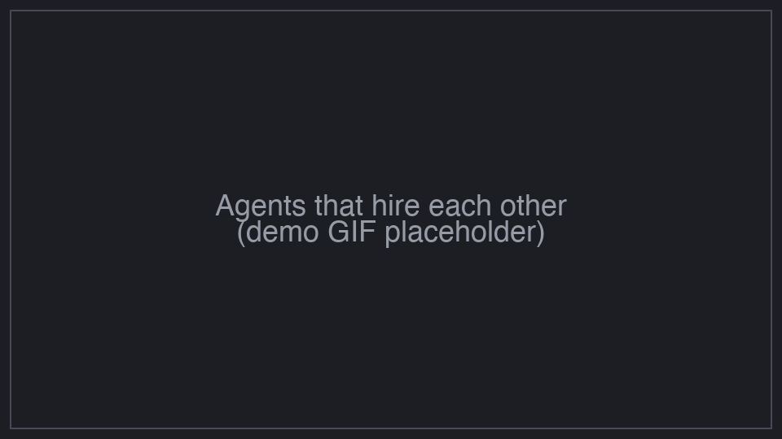
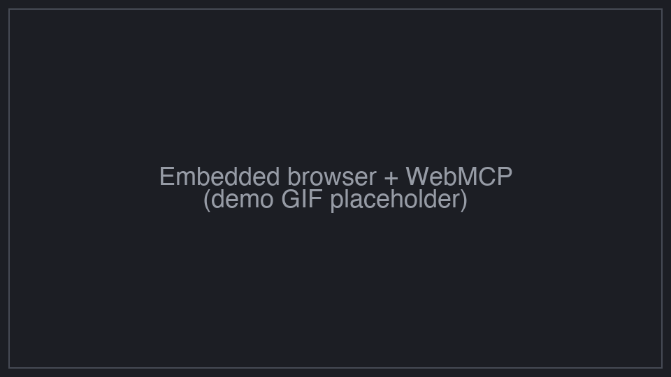
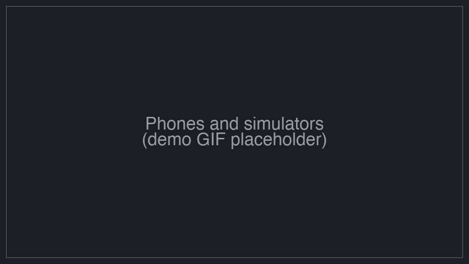
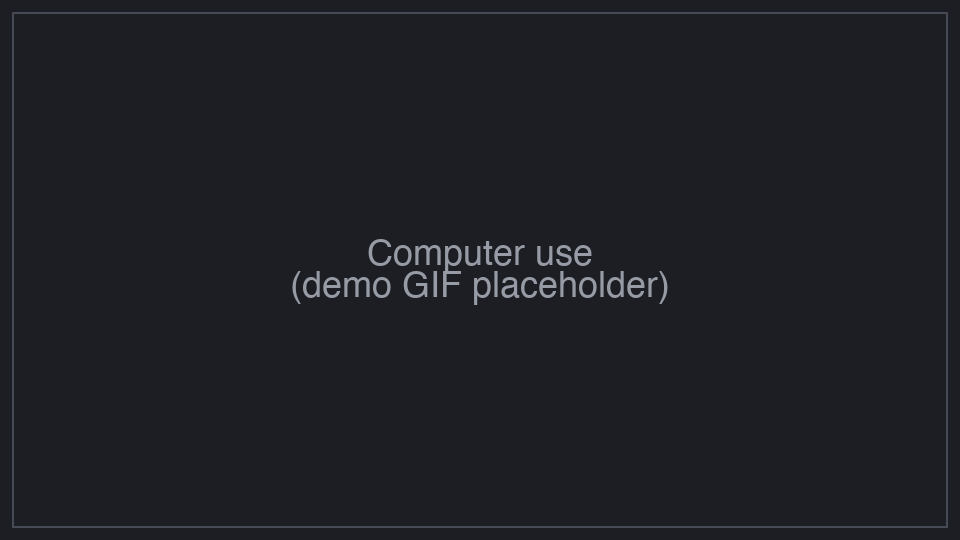
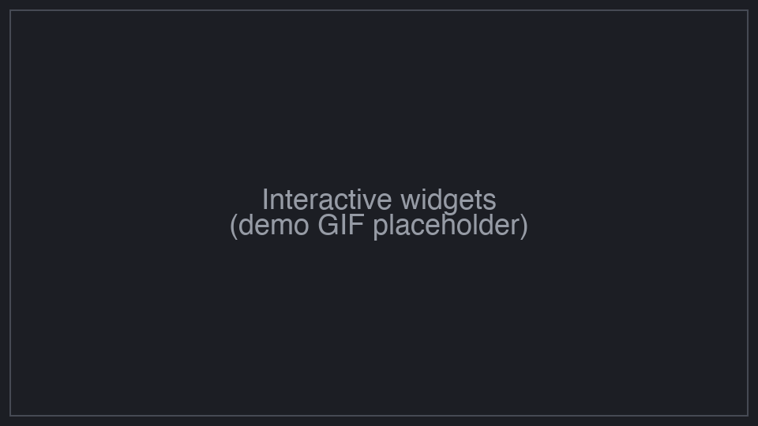
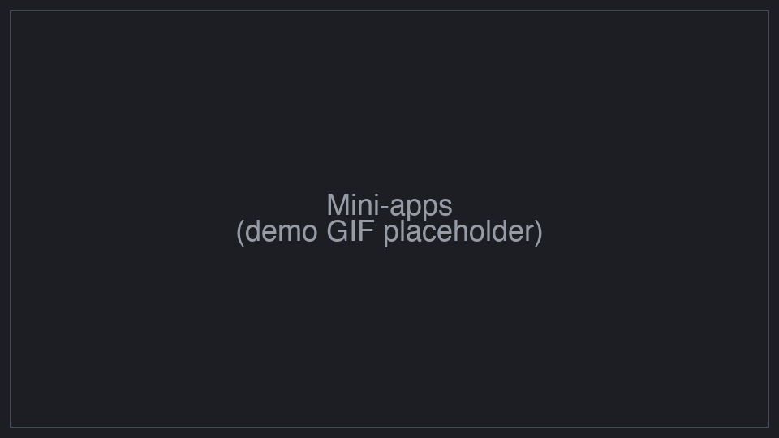
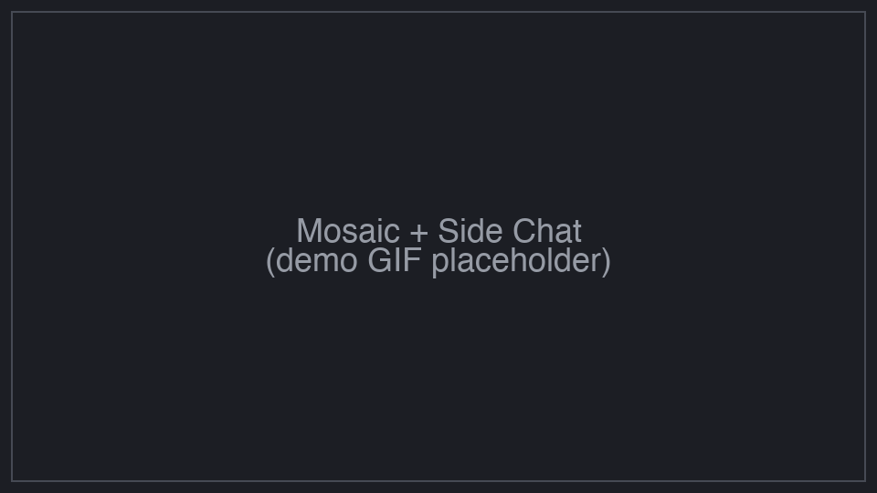
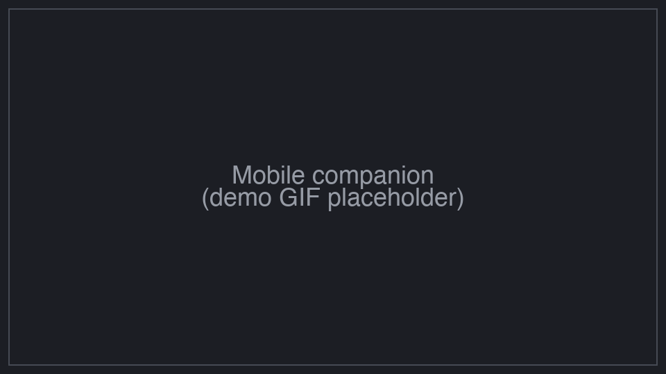

<p align="center">
  <a href="https://super-one.dev"></a>
</p>

<p align="center">
  <a href="CHANGELOG.md"></a>
  
  <a href="LICENSE"></a>
</p>

<p align="center">
  <sub><a href="README.md">English</a> · <a href="README.zh-CN.md">简体中文</a></sub>
</p>

<p align="center">
  <strong>Every powerful harness, one app. A Codex-app-level experience for all of them.</strong><br/>
  SuperOne brings Claude Code, Codex, Cursor, OpenCode, DeepSeek and Grok into one desktop app, extends each with a browser, a computer, a phone and each other, and gives every one of them the polish of a first-party app.
</p>

## Features

<table>
<tr>
<td width="50%" valign="middle">

### Every harness, one desk

Claude Code, Codex, Cursor, OpenCode, DeepSeek and Grok share one project list, one session history, one credential store and one set of MCP servers and skills. Switching harness mid-project is a dropdown, and the app re-tints to the harness's brand when you do.

</td>
<td width="50%">
  
</td>
</tr>
<tr>
<td width="50%" valign="middle">

### Agents that hire each other

A Claude session spawns a Codex reviewer. Codex hands the migration to DeepSeek. Cursor opens a mailbox with a session that has been running for an hour. `spawn`, `handoff` and `link` work across harness lines, with your approval, over durable Markdown, optionally in an isolated git worktree.

</td>
<td width="50%">
  
</td>
</tr>
<tr>
<td width="50%" valign="middle">

### A real browser, next to the chat

The agent opens tabs, reads the accessibility tree, clicks, types, records network traffic and profiles the page in an embedded Chromium you can watch and take over. Tools a page publishes through WebMCP become callable once you trust the origin.

</td>
<td width="50%">
  
</td>
</tr>
<tr>
<td width="50%" valign="middle">

### Phones and simulators

Boot an iOS Simulator or pick up an Android device. The screen mirrors into the dock with picture-in-picture; the agent snapshots, taps and types, and you can swipe yourself at any moment. Control is granted by you, never assumed.

</td>
<td width="50%">
  
</td>
</tr>
<tr>
<td width="50%" valign="middle">

### Computer use

Enumerate apps, snapshot the accessibility outline, zoom, click, type, wait for the screen to settle. Runs through a separate signed helper with per-app grants and a floating stop button. macOS today.

</td>
<td width="50%">
  
</td>
</tr>
<tr>
<td width="50%" valign="middle">

### Show, don't tell

Instead of a paragraph, the agent renders a chart, a diagram, a mockup or a small interactive tool right in the chat. Save it as a template and it becomes a widget the agent reuses with new data.

</td>
<td width="50%">
  
</td>
</tr>
<tr>
<td width="50%" valign="middle">

### Mini-apps the agent can call

Write a `.s1app` with a Node host and a WebView, drag it onto the sidebar, and its tools appear for every harness. The agent can scaffold, pack and register mini-apps for you.

</td>
<td width="50%">
  
</td>
</tr>
<tr>
<td width="50%" valign="middle">

### Mosaic and Side Chat

Tile sessions side by side, two agents on two worktrees of the same repo. Select any text in a transcript and open a forked Side Chat beside it with full context and a warm prompt cache; close it and the parent never knew.

</td>
<td width="50%">
  
</td>
</tr>
<tr>
<td width="50%" valign="middle">

### Mobile companion

Sessions block on you, you get a notification. Answer from your phone over LAN or a relay you can self-host, and the notification is withdrawn the moment anyone answers.

</td>
<td width="50%">
  
</td>
</tr>
</table>

**Also in the box:**

- **Workflows** — multi-agent orchestration scripts rendered as a live DAG in the chat.
- **Worktrees end to end** — start, fork, name the branch, merge back with a diff preview.
- **Rewind with a dry run** — roll back code, conversation or both, and preview it first.
- **Scheduled sends and automations** — messages that wait out a rate-limit window; cron automations.
- **Queued steer** — promote a queued message to a live steer mid-turn on Claude and Codex.
- **Image and video generation** — Google, OpenAI, OpenAI-compatible relays, ByteDance Ark, NewAPI.
- **Cross-harness usage and cost** — one page, every harness.
- **And the rest** — plan review, readable permission prompts, todos, subagents, MCP / skills / hooks / plugins, light and dark, English and 简体中文. The [changelog](CHANGELOG.md) is the real feature list.

---

## Supported Agents

<p>
  <a href="https://docs.anthropic.com/claude/docs/claude-code"><kbd>Claude Code</kbd></a> &nbsp;
  <a href="https://github.com/openai/codex"><kbd>Codex</kbd></a> &nbsp;
  <a href="https://cursor.com/cli"><kbd>Cursor</kbd></a> &nbsp;
  <a href="https://opencode.ai"><kbd>OpenCode</kbd></a> &nbsp;
  <a href="https://www.deepseek.com"><kbd>DeepSeek</kbd></a> &nbsp;
  <a href="https://x.ai/cli"><kbd>Grok</kbd></a> &nbsp;
  <kbd>+ more coming</kbd>
</p>

---

## Install

[macOS Apple Silicon](https://dl.super-one.dev/alpha/latest/SuperOne-arm64.dmg) · [macOS Intel](https://dl.super-one.dev/alpha/latest/SuperOne.dmg) · [Windows (.exe)](https://dl.super-one.dev/alpha/latest/SuperOne%20Setup.exe) · [Linux AppImage](https://dl.super-one.dev/alpha/latest/SuperOne.AppImage)

SuperOne is in alpha and auto-updates from `dl.super-one.dev`.

---

## Development

**Prerequisites:** [Bun](https://bun.sh) 1.3.9+ and Node.js 20+. This is a bun workspaces monorepo; npm and pnpm are not supported.

```bash
git clone https://github.com/WHQ25/super-one.git
cd super-one
bun install            # postinstall rebuilds native modules for Electron

bun run dev            # desktop app with hot reload
bun run dev:cli        # headless node CLI
bun run dev:web        # marketing site on :3000
bun run dev:relay      # wrangler dev for the relay Worker
bun run typecheck      # type check every workspace
bun run build:mac      # or build:win / build:linux
```

Package map:

- `apps/desktop` — Electron app (main / preload / renderer)
- `apps/cli` — headless node, published as `@super-one/cli`
- `apps/relay` — Cloudflare Workers relay for the mobile app, self-hostable
- `apps/web` — marketing and docs site
- `packages/runtime` — session / fs / git / spawn-env shared by desktop and CLI
- `packages/claude`, `codex`, `cursor`, `deepseek`, `opencode`, `acp` — one package per harness
- `packages/shared`, `packages/ui` — neutral types, harness capabilities, i18n, shadcn primitives

Architecture lives in [`CLAUDE.md`](CLAUDE.md), [`apps/desktop/CLAUDE.md`](apps/desktop/CLAUDE.md) and [`apps/cli/CLAUDE.md`](apps/cli/CLAUDE.md). They are written for coding agents and are the most accurate docs in the repo. Commit conventions are in [`AGENTS.md`](AGENTS.md).

## License

[Business Source License 1.1](LICENSE) — source-available. Free for personal, educational and other non-commercial production use; commercial production use needs a separate license. Each version converts to Apache 2.0 two years after publication.
