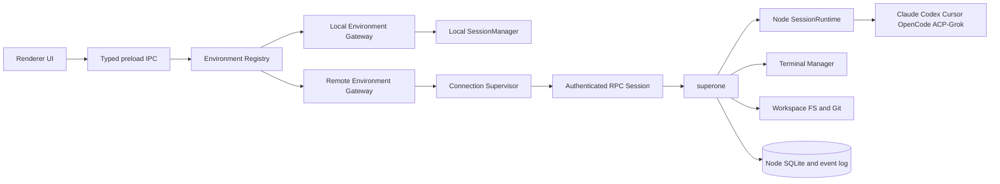

# SuperOne Persistent Remote Node Service

The headless `superone` node: what it owns, how clients reach and trust it, how
it persists and recovers, how harness runtimes are owned on it, and how it is
installed and published. Section numbers are cited from code; keep them stable.

## 1. Decision Summary

SuperOne models each local or remote node runtime instance as an execution
environment: a persistent `superone` service instance, its fixed per-user data
directory, and the Unix principal it runs as. It is not a physical machine: one
Linux host may run several isolated environments for different Unix users, and
one Unix user owns one node environment per release channel (§8). A remote
environment owns:

- projects and workspace paths
- Sessions and provider runtimes
- terminals and child processes
- filesystem and Git operations
- MCP processes and tools
- provider configuration and credentials
- durable event and message state

The remote boundary sits above `SessionManager`. A desktop must not create a
local `Session` whose `SessionBackend` happens to run remotely, because that
would split Session ownership, permissions, lifecycle, and persistence across
two processes.

SSH is a bootstrap, repair, and optional tunneling mechanism. It is not the
application protocol and does not own the node lifecycle. Product traffic uses
the same authenticated RPC protocol whether the access endpoint is direct WSS,
Tailscale, an SSH local forward, or a relay.

The production deployment target is a Linux `systemd` user service. Closing
SuperOne, dropping the network, or closing an SSH tunnel must not stop the node
or its active Agent turns.

## 2. Goals

- Operate Linux projects from the SuperOne desktop as first-class projects.
- Keep active Agent turns running while every client is disconnected.
- Reconnect and reconstruct authoritative state without relying on an in-memory
  desktop transcript.
- Support more than one client and more than one access route to a node.
- Preserve the existing Session/Harness behavior and provider identities.
- **Reuse harness implementations across local and remote.** Node harnesses
  share the same Electron-free provider core as the desktop path (`@superone/claude`,
  `@superone/codex`, …) rather than a CLI-only side track (print mode, custom
  protocol parsers). Thin host adapters (permission UI, MCP registration, spawn)
  may differ; the agent protocol and turn semantics must not.
- Keep local execution working while the two paths converge.
- Reuse the same RPC contracts for desktop, mobile, and future web clients.
- Make remote access authenticated, revocable, observable, and upgradeable.
- Isolate environments on the same host by Unix principal and stable runtime
  identity, with one fixed node data directory per principal and channel.

## 3. Non-goals

- Treating SSHFS or a mounted network filesystem as remote execution.
- Sending individual shell commands over SSH as the normal Agent runtime.
- Automatically copying provider credentials from the desktop to a node.
- Reusing the mobile remote-control room protocol as the node protocol.
- Supporting arbitrary third-party node implementations.
- High availability or automatic failover between nodes.

## 4. Prior Art

The environment model follows T3Code: one server instance is one stable
environment whose identity is independent of hostname, address and endpoint; a
known environment is client-local metadata; launch method and access method are
separate; SSH only launches the server and forwards a port; pairing credentials
differ from steady-state sessions; and a connection supervisor owns retries.
SuperOne differs in two ways: the node is supervised by `systemd` and outlives
every client and tunnel, and the desktop keeps node credentials and sockets in
Electron Main behind typed IPC instead of letting the renderer connect directly.

## 5. Architecture



### 5.1 Process boundaries

`superone` is a Node.js process with no Electron dependency. It hosts the domain
services that must run where the project lives. Electron-only functions
(windows, dialogs, desktop keychain, native menus, renderer event transport)
remain in `apps/desktop`. The renderer never holds node sockets or credentials.

```text
packages/shared      @superone/shared    wire contracts: environment, auth, RPC, events, harness catalog
packages/runtime     @superone/runtime   node server core, session runtime, lease, collaboration,
                                         fs, git, workspace, harness kernel, db schema, automations, drafts
packages/claude      @superone/claude    Claude Agent SDK turn core
packages/codex       @superone/codex     Codex App Server client
packages/acp         @superone/acp       ACP client (Grok)
packages/opencode    @superone/opencode  OpenCode server + SDK client
packages/cursor      @superone/cursor    Cursor SDK turn core
packages/deepseek    @superone/deepseek  in-process dsh runtime
apps/cli             @superone/cli       node entry, RPC handlers, host adapters, systemd, CLI
apps/desktop                             Electron shell, local gateway, remote client gateway
apps/relay                               mobile remote-control relay
```

Dependency rules:

- `@superone/runtime`, harness packages and `apps/cli` never import Electron.
  Protocol, auth-client, connection-supervisor and RPC-client cores are
  platform-neutral; Electron Main and mobile supply socket and secure-store
  adapters around them.
- Cross-harness infrastructure (session, git, fs) never lives in a harness
  package; harness packages depend on `@superone/shared` and their vendor SDK.
- Hosts (`apps/cli`, desktop main) depend on cores; cores never depend on hosts.
- One package per deployable concern; no single `@superone/core`.

`apps/cli` depends on every harness package; the published `@super-one/cli`
bundles all adapters, and only the vendor native runtimes are external (§15.4,
[runtime-delivery.md](../harness/runtime-delivery.md)).

Harness reuse rule: when a harness exists on desktop, the node runs the same
provider integration through the shared core, with host concerns in thin
adapters. Node Claude turns use `ClaudeLiveSession` from `@superone/claude`
(`apps/cli/src/session/claude-turn-runner.ts`); the desktop still drives the SDK
through its own `apps/desktop/src/main/agent/claude-query.ts` and imports only
helpers from the core. `apps/cli/src/session/claude-print-client.ts` (print-mode
stream-json) is a test reference, not a product path.

### 5.2 Gateway boundary

Desktop features route through an environment-scoped gateway
(`packages/shared/src/environment/`, `apps/desktop/src/main/environment/`):

```ts
interface EnvironmentGateway {
  getDescriptor(): Promise<ExecutionEnvironmentDescriptor>
  listProjects(): Promise<ProjectSnapshot[]>
  getProject(projectId: string): Promise<ProjectSnapshot>
  subscribeEvents(input: SubscribeEventsInput): AsyncIterable<EnvironmentEvent>
  sessions: SessionGateway
  interactions: InteractionGateway
  terminals: TerminalGateway
  workspace: WorkspaceGateway
}
```

The typed sub-gateways cover complete operation families: Session
create/send/interrupt/close, permission/question/plan response, terminal
attach/input/resize/kill, file watch cancellation, and transfer cancellation.
Features must not bypass the gateway with environment-specific raw IPC.

`RemoteEnvironmentGateway` delegates to an authenticated node RPC session.
`LocalEnvironmentGateway` delegates to in-process services; its Session port
wires only `list`, and local Session create/send use the agent IPC: a local
session lives in the desktop's own process, where its `Session` is the read
model. The renderer reads both kinds on one path (events into the chat
reducer); a remote session opens at a node snapshot (§9.2), and its writes
settle on the session's stream like local ones.

UI stores use scoped references and never route by a bare project or Session ID:

```ts
type EnvironmentRef = { environmentId: string }
type ProjectRef = { environmentId: string; projectId: string }
type SessionRef = { environmentId: string; sessionId: string }
type TerminalRef = { environmentId: string; terminalId: string }
```

## 6. Domain Model

### 6.1 ExecutionEnvironment

An `ExecutionEnvironment` is one node runtime instance with a stable random
`environmentId` persisted in `<node dir>/environment-id`. The local desktop
runtime is also an environment, and has one id: its node identity's
(`<userData>/node-host/environment-id`), which its window, phones and
controllers all use (`local-identity.ts`). A desktop that had a separate local
id (`<userData>/environment-id`) before keeps it as an alias: descriptors report
it in `environmentAliases`, controllers store it with the known environment,
and lookups by environment id (`isEnvironment`, the gateway registry, the RPC
envelope check) accept it, so earlier session links keep resolving.

`ExecutionEnvironmentDescriptor` (`packages/shared/src/environment/descriptor.ts`)
carries `environmentId`, `label`, `platform { os, arch }`, `nodeVersion`,
`protocolVersion`, `capabilities`, and optionally `cliVersion`, `generations`,
`nodePublicKeyFingerprint` and `syncRoot`.

Capabilities are reported, not inferred from version strings.
`EnvironmentCapabilities` (`capabilities.ts`) lists `methods` — every RPC method
the environment serves — plus `harnessIds` and the behaviour flags that no
method names: `coldSessionResume`, `turnReattach`, `hostActionV1`. The runtime
derives `methods` from its handler table (`SHARED_RPC_METHODS`, filtered by the
ports the host supplies) and the methods a host adds (`extensionMethods`, e.g.
the CLI's drafts, artifacts, automations and archive), so the list cannot drift
from what the dispatcher answers. Clients gate a feature on `servesMethod`
(main: gateway and agent tools; renderer: `useEnvironmentServes`); an unknown
or older descriptor serves nothing.

The node persists an Ed25519 instance key (`secrets/instance.key`) and a binding
hash of hostname, Unix UID and node directory (`secrets/binding-hash`,
`packages/runtime/src/server/identity.ts`). A binding change puts the node in
`identity_conflict`: the server rejects clients with that code and the
supervisor blocks. Clients bind a known environment to both `environmentId` and
the key fingerprint, and block any endpoint that answers with a different
fingerprint. A copied node directory on another host trips the binding check.

Two isolated clones that never share a client cannot be detected, so backup/VM
restore instructions require `superone identity regenerate` before network
access. It creates a new `environmentId`, key pair, binding and pairing state
without rewriting project or Session data.

### 6.2 KnownEnvironment

A connection starts as a client-local pending profile, because a manually
entered WSS or SSH endpoint does not know its identity before the first
authenticated descriptor exchange:

```ts
interface PendingConnectionProfile {
  connectionId: string
  label: string
  endpointProfiles: EndpointProfile[]
}
```

After authentication it is atomically bound to a node identity and becomes a
`KnownEnvironment` (`known-environment.ts`) holding presentation and access
metadata, not authoritative state:

```ts
interface KnownEnvironment {
  connectionId: string
  environmentId: string
  nodePublicKeyFingerprint: string
  label: string
  endpointProfiles: EndpointProfile[]
  preferredEndpointId?: string
}
```

Binding deduplicates entries by verified identity. Every later endpoint change
or failover must return the same environment ID and fingerprint or the
connection is blocked.

Secrets are stored separately in a fail-closed platform credential store keyed
by `connectionId`, never in an ordinary SQLite row or renderer storage. The
desktop's plaintext-SQLite secret fallback is not acceptable for node
credentials; without secure storage the client keeps an explicitly temporary
in-memory session or refuses to save.

### 6.3 EndpointProfile

`EndpointKind`: `direct-wss`, `tailscale`, `ssh-forward`, `relay`, `local`.
Endpoint profiles describe access only; they never create a second environment
or duplicate its projects and Sessions. A `relay` profile carries the node's
relay room (`relay.roomId`, routing only; §11.4).

### 6.4 InstallationProfile

`InstallationProfile`: `systemd-user`, `systemd-system`, `container`, `manual`,
`nohup`, `local-electron`. Only `systemd-user` has an installer
(`apps/cli/src/systemd/install.ts`). SuperOne records how it installed a node for
diagnostics and upgrades; the node stays usable if one client forgets that
profile.

## 7. Runtime Ownership

The node is authoritative for all state whose meaning depends on the remote
filesystem or process runtime:

| State | Authority |
|---|---|
| Node identity and capabilities | node |
| Remote projects and paths | node |
| Session metadata and transcript | node |
| Active turns and permission requests | node |
| Provider resume IDs and runtime payloads | node |
| Terminal processes and snapshots | node |
| Git status, branches, worktrees | node |
| MCP server lifecycle | node |
| UI layout, selected environment, endpoint preference | client |
| Cached remote snapshots | client, disposable |

Desktop caches accelerate rendering but are never the recovery source. A
reconnect hydrates from the node snapshot, then resumes its event cursor.

## 8. Node Persistence

The node directory is `<personal root>/node` (`resolveNodeHome` in
`apps/cli/src/config.ts`): `~/.superone/node` for stable and
`~/.superone/alpha/node` for alpha, where the personal root comes from
`SUPERONE_HOME` or the `SUPERONE_VARIANT` baked into the published bundle
(`packages/runtime/src/fs/superone-home.ts`). Stable and alpha nodes coexist per
user with separate directories, ports (7788 / 7790), systemd units
(`superone.service` / `superone-alpha.service`) and binaries
(`superone` / `superone-alpha`). SSH bootstrap, the systemd unit, diagnostics,
harness state and identity commands all resolve the same directory for a
channel.

`SUPERONE_NODE_HOME` is an internal override for automated tests and the dev
labs, not a production multi-instance feature. Real multi-instance support would
need its own identity, service-unit, port and upgrade design; a path flag alone
is insufficient.

```text
<node dir>/
  environment-id
  state.sqlite
  config.json            node agent settings
  secrets/               instance.key, provider-secrets.key, binding-hash
  logs/
  runtime.json
  sync/                  session sync zone
  codex-accounts/
```

Harness runtime binaries live in the shared harness root, not here
([runtime-delivery.md](../harness/runtime-delivery.md) §5).

The schema is in `packages/runtime/src/db/schema.ts` and `database.ts`: pairing
tokens, client sessions, refresh reuse log, WebSocket tickets, idempotency
receipts, `environment_events`, terminals, projects, sessions (metadata,
`transcript_json`, pending interaction, provider resume, controller, settings),
host actions, control leases, collaboration grants/messages/cursors, harness
installations, provider credentials/bindings, automations and session providers.
SQLite runs in WAL mode with foreign keys on. Secret material lives in
owner-only files, not ordinary rows.

Durability rules:

- A durable event and the read-model change it causes commit in one SQLite
  transaction before any subscriber sees it (`EventLog.append` runs the read
  model's applier inside the transaction). The target invariant also puts the
  mutating command's idempotency receipt and the session row in that
  transaction, so a crash can never leave state without its event or a mutation
  without its receipt. The code does not meet that part yet: `SessionRuntime`
  writes the session row synchronously before appending its event, and
  `apps/cli/src/auth/idempotency.ts` runs the command under an in-memory
  in-flight lock and stores the receipt afterwards.
- Receipts are keyed `(client_identity, operation, idempotency_key)` and store a
  request-payload hash; reusing a key with a different payload returns
  `idempotency_conflict`.
- `SessionRuntime` projects every turn into the session log
  (`SESSION_DURABLE_EVENT` in `packages/shared/src/environment/session-events.ts`):
  user message, turn start/completion/interruption/error, assistant blocks,
  tool start/input/result, permission/question/plan requests and responses,
  and status changes. Durability is decided by payload (`streamingEventKey`):
  text and thinking deltas, tool input deltas, Codex item updates and tool
  progress go to an in-memory streaming ring (`streaming-ring.ts`, 16 MiB cap)
  and are retired when their message commits (`committedStreamingMessage`);
  everything else is a durable `environment_events` row. Rows written before
  this split, one per delta, stay.
- Every session event carries a per-session `session_version`, contiguous
  across both tiers within the node process `epoch`; a version identifies an
  event for resume (§9.2). Rows from before versions read as their sequence.
- The read model (`packages/runtime/src/session/read-model.ts`) reduces each
  session's events with the shared chat reducer and checkpoints its messages
  and state (`session_messages`, `session_read_models`) in the committing
  transaction. After a restart it replays durable events above the
  checkpoint; a session logged before it bootstraps once from the stored
  transcript and log. `session.load`, `session.messages.list` and MCP App
  lookups read it. The session row's `transcript_json` stays the plain-text
  transcript. A disconnect loses no acknowledged semantic transition.
- Old events may be deleted only after a snapshot at or beyond their sequence
  is durable, and a cursor older than retained history receives `cursor_too_old`
  rather than a partial stream. `environment_events` is currently append-only
  and never pruned, so `cursor_too_old` (defined in `packages/shared/src/environment/rpc.ts`)
  is not emitted.

The desktop's in-memory `apps/desktop/src/main/session/event-seq.ts` process
epoch is not a durable cursor and is not used by this protocol.

## 9. Commands, Events, and Reconnect

### 9.1 RPC model

RPC uses schema-validated envelopes (`packages/shared/src/environment/rpc.ts`).
Mutating operations carry a client-generated idempotency key:

```ts
interface RpcCommandEnvelope<T> {
  protocolVersion: number
  requestId: string
  idempotencyKey?: string
  environmentId: string
  method: string
  payload: T
}
```

A retry with the same authenticated client and key returns the prior receipt
instead of repeating the mutation.

The client half of a connection is shared and Metro-safe
(`packages/shared/src/environment/rpc-connection.ts`): request envelopes and
their receipts, deadlines, pushed stream frames and detail packets, and
sharing of identical in-flight reads (`request-coalescer.ts`). Each client
keeps its own socket adapter for dialing, the channel and heartbeats, and
starts a new connection with each socket (the desktop's
`node-rpc-client.ts`).

The descriptor advertises protocol and database-schema generations as
`{ current, min, max }` (`PROTOCOL_GENERATION`, `DATABASE_SCHEMA_GENERATION` in
`protocol.ts`); `negotiateHandshake` blocks the connection before mutable RPC
when the ranges do not overlap. Generation 3 is the current and oldest
accepted generation; a generation 2 peer is refused, and the desktop offers
the node upgrade from the refusal's range.

#### Wire framing

On the encrypted channel, messages up to and including the generation
handshake are sealed JSON, so a peer of another generation can still read the
refusal. After it, each sealed frame carries a wire frame
(`packages/shared/src/environment/wire.ts`): the remote payload header (flag,
u32 size) with the JSON raw, or DEFLATE-compressed when it is over 512 bytes.
Pushed messages (`stream` and `detail`) instead always deflate against the
last 32 KiB of the pushes before them (flag 3, the same header), which both
ends keep: the keys and ids every event repeats cost a back-reference, so a
recorded turn costs about half what the phone link did. Pushes travel in one
lane and are encoded in send order, which the shared history relies on. A
frame over 256 KiB is split into fragments (flag 2, u32 message id, u16
index, u16 total); fragments of one message arrive in order but may
interleave with other messages. Plain ticketed sockets carry JSON text.
Compression is injected: Node uses zlib, Expo a pure-JS inflater.

Each connection sends through an outbox (`connection-wire.ts`,
`wire-outbox.ts` in `packages/runtime/src/server`): RPC replies and control
go before stream frames, frames are sealed as they leave so channel sequence
numbers follow socket order, and the socket buffer is kept under 1 MiB. While
the link is behind, `openEventStream` holds new events; past 4 MiB held, a
session's streaming events are dropped and the session goes to `resnapshot`.
Durable events are never dropped.

### 9.2 Event log

Every durable environment event has a stable `eventId`, a monotonically
increasing environment `sequence` (decimal string on the wire, SQLite integer
internally), timestamp, aggregate type and ID, event type and version, payload,
and optional causation request ID. There is one sequence per environment.

On connect:

1. Authenticate and verify the expected `environmentId`.
2. Negotiate protocol and capabilities.
3. Open a session with `session.load`: its read-model state and newest
   messages, with the cursor `{ sequence, epoch, version }` they reflect.
4. `topic.subscribe` from that cursor with the topics to receive (scoped
   refs from `@superone/shared/environment/topics`; a `*` session id covers
   every session, and `sessionList` carries the session events that change
   the list). The node pushes frames over the WebSocket: durable events after
   the sequence merged with the ring's events after each session's version,
   then live events as they are appended. `topic.update` changes an open
   stream's topics in place; an added topic gets live events from then on, so
   a client reads its snapshot after the update is acknowledged.
5. A frame names in `resnapshot` the sessions whose missed events are gone
   (retired on commit, evicted from the ring, or lost with a node restart's
   epoch), and the same sessions as scoped topics in `recover`. The client
   reads those sessions again instead of continuing.

Every topic kind recovers its own way: a session by this cursor and
`resnapshot`; the session list, projects and drafts by snapshot plus versioned
change events (`VersionedTopicLog`, `@superone/runtime/stream`); a terminal by
output sequence plus the attach snapshot.

The desktop keeps one subscription per node (`remote-session-feed.ts`), shared
by the chat, routed phones and the collaboration watcher. It carries the union
of their interests, counted per follower: `sessionList` while the session list
is watched, and each followed session. A follower joins once the node applied
its topic, reads its snapshot, and gets the session's events above that
version; it resumes by version across reconnects. No session reads poll.

Each node connection has a delivery policy (`ConnectionDelivery`,
`@superone/runtime/stream/delivery`) from the socket it came in on: a relay
slot is the `relay` tier, any socket the node accepted (a loopback forward
included) is `lan`. Over the relay, `session.load` returns the session
summarized (`summarized: true`, bulky bodies behind `remoteDetail`) and the
stream's events for it are projected the same way (`session-delivery.ts`);
a tool's streamed input is its body and is left out. Off the local link the
stream lets deltas and bookkeeping (usage, progress, stream markers,
checkpoints) wait up to one batch window (33 ms) for the next event that
cannot wait, folds adjacent deltas of a session into one envelope, and sends
no frame that the policy emptied without moving the cursor. The step 0
recordings followed over the relay stay within the phone link's frames and
bytes (`node-host-protocol.integration.test.ts`).
`session.subscribeDetail { sessionId, detailRef, subscriptionId }` answers a
row's revision-0 detail, and `detail` messages carry its later packets on the
same connection until `session.unsubscribeDetail` or the socket ends. The
event log and persisted transcripts stay complete. When the desktop's stream
comes back on a link of another tier, every follower reads its snapshot again
(`onRealign`), so rows are never half summarized.

Client acknowledgement is a delivery cursor, not a shared `read` flag.

### 9.3 Recovery guarantees

| Failure | Agent turn | PTY | Pending interaction | Recovery result |
|---|---|---|---|---|
| Client/network/SSH tunnel disconnect | continues | continues | remains pending | reconnect snapshot plus cursor resumes the same live runtime |
| Graceful node restart or upgrade | interrupted | closes | persisted | Session remains usable; later turns resume from provider metadata (`coldSessionResume`) |
| Node or systemd crash | dies with the node cgroup | dies | persisted | startup reconciliation marks running work interrupted, keeps committed output, permits a later turn from durable resume state |
| Provider subprocess crash | current turn ends in error/interrupted | unaffected | reconciled | provider restarts for a later turn |

The node advertises `coldSessionResume: true` and `turnReattach: false`; no
harness reattaches an in-flight turn across a node restart.

A disconnected client never causes permission escalation: a turn needing
approval waits for an authorized client or follows an explicit node-side timeout
that records a denial. Idle provider processes are released by the runtime
reaper while their resume metadata stays durable.

### 9.4 Fenced control leases

Interactive Session and writable terminal control use server-issued leases
(`packages/shared/src/environment/lease.ts`, `packages/runtime/src/lease/control-lease.ts`):

```ts
interface ControlLease {
  leaseId: string
  resource: SessionRef | TerminalRef
  holderClientId: string
  delegate?: string
  generation: string
  expiresAt: string
}
```

- One live control lease per resource; observers never acquire one and never
  block the holder.
- A client that relays devices acquires for each as a `delegate` (a desktop
  for each phone it routes, by device ID). Delegates of one client hold a
  resource one at a time, like separate clients, except that the client's own
  window acquires with `yields`: a phone opening the session takes the
  window's lease over, as it does a local session, and the window is refused
  until the phone leaves. Renew, release and commands check the client; the
  lease ID and generation fence its delegates.
- The holder renews before expiry. Disconnect does not transfer control
  instantly; the short TTL bounds takeover delay. Explicit release permits
  immediate acquisition.
- Every mutating control command carries `leaseId` and `generation`; the node
  rejects expired, superseded or late commands even if their socket survives an
  endpoint failover.
- Permission, question and plan responses require scope plus the current
  Session lease.
- The lease epoch is random per node process, so a restart invalidates every
  prior lease; clients reacquire after synchronization.
- Whichever side cannot drive a session its controller started on a desktop
  node shows "<computer> is controlling" in place of the composer, like a
  phone-driven session: the node offers Disconnect, the controller Reconnect. Disconnect takes the session back:
  the node expires the lease, refuses `failed_precondition` with
  `details.reason: 'control_released'` to the controller's commands and
  ordinary acquires, and emits `remote_control_changed` on the session (its
  own UI and the controller's event log both see it). The controller watches
  until its user picks Reconnect, which acquires with `reclaim: true`; this can
  repeat. The controller's automatic acquire before a send never reclaims.
- Every collaboration child's launch task renders as "Task from <sender>". A
  child on another machine gets it with the display field
  `collaboration: { kind: 'initial_task' }`; the node (desktop or CLI) names
  the sender itself from the controller's pairing label, ignoring any name the
  controller sends, and records it on the user message, its durable event and
  `session.messages.list` metadata. A child started by an agent on the same
  machine is named after its parent session instead.

## 10. Connection Supervision

Electron Main owns one supervisor per desired environment, built on the
platform-neutral `ConnectionSupervisorCore`
(`packages/shared/src/environment/connection-supervisor-core.ts`):

```text
available -> connecting -> synchronizing -> connected
                    |             |
                    v             v
                 backoff <----- disconnected
                    |
                 blocked            (plus offline)
```

Transient failures retry with capped exponential backoff and jitter. `auth`,
`protocol_incompatible`, `revoked`, `invalid_config`, `identity_conflict` and
`user` enter `blocked` and require user action. Resume and network-online events
trigger an immediate probe.

Every dial picks its route through `NodeRouteResolver`
(`apps/desktop/src/main/environment/node-route-resolver.ts`) over the order of
`orderNodeRoutes` (`packages/shared/src/environment/node-route.ts`): LAN
addresses mDNS reports for the node, the saved preference, then the other
profiles by path (LAN, Tailscale, direct), relay last. An SSH forward is opened
only when it is the preferred profile. With more than one candidate, each but
the last must pass a 2.5 s `/health` identity probe; the relay is not probed.
A lone candidate (most CLI nodes) is used as before. Only desktop nodes, paired
with a LAN hint, are looked up over mDNS.

Desktop nodes follow the phone link: LAN on the same network, otherwise
Tailscale, otherwise the relay. `/health` is unauthenticated, so it only
nominates a route; the encrypted channel proves it. When the channel, attach or
descriptor check fails on a route for a reason another route could fix, the
route is passed over for two minutes (`markFailed`) and the same dial moves on,
so a LAN that answers `/health` but not the channel (or a spoofed answer) falls
through to the relay. A lost LAN socket is a normal disconnect, so the next
dial falls through as well.

While connected off the LAN, the 30 s health check asks for a route ahead of
the current one (`betterRoute`) and upgrades make-before-break: a throwaway
connection over it must complete the channel, attach and the descriptor
identity check before the supervisor re-dials onto it. A route that fails this
is passed over and the working connection is left alone. Sessions carry over:
leases belong to the client session, and event readers resume with
`afterSequence`. The
environments list shows the live path (`EnvironmentListItem.activePath`).

Failover to another endpoint (`endpoint-failover.ts`) proceeds only after the
resolved descriptor carries the same `environmentId` and key fingerprint.

## 11. Access Methods

### 11.1 SSH bootstrap and forward

Desktop uses the system OpenSSH client to inherit `~/.ssh/config`, ssh-agent,
ProxyJump, host key verification and platform security updates
(`apps/desktop/src/main/environment/ssh-tunnel-manager.ts`, `ssh-forward.ts`,
`remote-install.ts`). SSH is used for host probe, preflight, node install or
upload, systemd install and status, one-time pairing-token creation, log
retrieval and `-L localPort:127.0.0.1:nodePort` forwarding.

The node binds loopback (`127.0.0.1`) by default. Closing the forward
disconnects this desktop but never stops the service. Passwords stay in memory
only; key and agent auth are preferred; host key errors are never auto-accepted.

### 11.2 Tailscale

Tailscale is the preferred direct route for personal deployments. Tailscale
identity supplements but never replaces SuperOne application auth. A `tailscale`
endpoint is an HTTP(S) base URL probed at `/health`; the desktop can suggest a
host from `tailscale status --json` (`endpoint-probes.ts`) but never uses its own
Tailscale self IP or its local `tailscaleServeEnabled` state for a remote node.
Each node is responsible for its own Tailscale endpoint. A desktop node puts its
own Tailscale IPv4 address, when it has one, in its pairing code.

### 11.3 Direct WSS and the encrypted channel

The channel to a node must be encrypted, either by the transport (loopback,
SSH forward, Tailscale, a TLS reverse proxy) or by the node's encrypted channel.
Forwarded headers are not trusted by default.

A desktop's environment backend (`DesktopDomain`, `node-host/desktop-domain.ts`:
identity, the node database with auth, leases, idempotency, the event log and
Host Actions, and the session host) opens with the app and stays open until
quit. The controller listener (`DesktopNodeHost`) runs over it only while
controllers need it; stopping the listener cancels the Host Actions waiting on
a controller and leaves the domain up.

A desktop node listens on every interface while it serves (§11.5), but accepts
TCP peers only from private networks: loopback, RFC 1918, link-local
(169.254/16, fe80::/10), IPv6 unique-local (fc00::/7) and the Tailscale ranges
(100.64/10, fd7a:115c:a1e0::/48), IPv4-mapped forms included
(`packages/shared/src/private-network-address.ts`). Other peers are dropped on
`connection` (`startNodeServer({ allowRemoteAddress })`), before any HTTP or
channel work. The phone LAN server applies the same filter. The node also advertises
itself over mDNS as `_superone-node._tcp` with TXT `env=<environmentId>` and
`variant`; a paired desktop matches `env` to the pairing (`lan-browser.ts`).

The encrypted channel lets a node serve plain `ws://` on a LAN. It is enabled by
`startNodeServer({ secureChannel })` (`packages/runtime/src/server/node-server.ts`);
without the option nothing changes. With it, only `GET /health` stays plain:
`/v1/pair`, `/v1/token` and `/v1/ws-ticket` answer `403 channel_required`, and a
ticketed `/ws` upgrade is refused. On `/ws` the client completes the channel
handshake ([relay-crypto.md](relay-crypto.md#node-encrypted-channel)), then sends
sealed frames:

- `{ type: 'auth', requestId, path, body, accessToken? }` → `auth_result
  { requestId, status, body }`: the same pairing, refresh and ticket exchanges as
  the HTTP endpoints, with the same status codes and bodies.
- `{ type: 'attach', requestId, ticket, proof, sig }` → `attach_ok`: the WS
  ticket and device proof that a plain socket sends as upgrade headers. Before
  attach, RPC is answered with `unauthorized`; handshake plus attach must finish
  within 30 s.
- After attach, the usual `handshake` / `rpc` / `ping` messages; after the
  generation handshake they travel as wire frames ([Wire framing](#wire-framing)).

Node auth (§12) runs unchanged inside the channel. The desktop client
(`node-auth-client.ts`, `node-rpc-client.ts`) uses short-lived sockets for the
auth exchanges and opens the RPC socket the same way. A wrong channel secret
blocks as `unauthorized`.

Channel secrets never cross the network. The node keeps one root secret
(`secrets/channel-root.key`, `loadOrCreateChannelRoot`) and derives a secret per
pairing from the pairing token id (`issueChannelCredential`). The pairing code
or QR carries the token and `{ keyId, secretHex }` out of band. The desktop
stores the credential with the device key in the safeStorage-encrypted secrets
blob (`node-credential-store.ts`). Revoking a client session does not revoke its
channel secret, but that secret only opens the channel; node auth still rejects
the revoked client. Regenerating the node identity replaces the root, so every
client must pair again.

### 11.4 Relay

The relay (`apps/relay`, the phone link's broker) carries the node encrypted
channel when two devices are on different networks. It forwards opaque frames
and never holds provider credentials or plaintext workspace data; its routing
and framing are in [relay-crypto.md](relay-crypto.md#node-channel-over-the-relay).

- The node keeps the `desktop` socket of its room open while node access is on
  (`RelayNodeHost`, `packages/runtime/src/server/relay-node-link.ts`). The room
  id is derived from the channel root (`nodeRelayRoomId`) and is not secret.
- Each client connection (an auth exchange or the RPC socket) takes a fresh
  `mobile` slot in that room (`createRelayNodeDialer`). The node hands each slot
  to `NodeServerHandle.acceptChannelSocket`, so the handshake, `auth`, `attach`
  and RPC run exactly as on a direct `/ws` socket.
- A slot closes when the node leaves or rejoins the relay (its channels are
  gone), or when the node closes the connection (`kicked` with its close code).
  The client then reconnects through the supervisor; the node's event log stays
  the recovery authority.
- The relay has no `/health` for the node; identity rests on the channel proof
  and the descriptor's environment id and key fingerprint.
- Before dialing the relay, the client asks the relay's `/status` whether the
  node holds its room (the phone link's presence check,
  `@superone/relay-client/presence`), so an offline node fails in seconds
  rather than at the channel handshake timeout.
- Explicit failover (`connectWithFailover`) and re-pairing from a fresh code
  (`repairPairing` without a base URL) choose their route the same way, so a
  node reachable only through the relay recovers there.

Pairing works over the relay alone: the node pairing code (`superone-node:2:`,
`node-pairing-code.ts`) carries the node's environment id, LAN hint
(host name and port), optional Tailscale address, relay URL and room, the
single-use token and the channel credential. The desktop pairs over whichever
route resolves first. The code travels only through a phone (§11.5).

Known gap: the relay does not authenticate room members. Anyone who knows a room
id (any device that ever paired, including a revoked one) can take the room's
`desktop` socket or a slot and disrupt connections. It cannot read or forge
channel frames, so this is denial of service only.

### 11.5 Desktop pairing through a phone

A controller desktop (C) runs sessions on a controlled desktop (N). They pair
through a phone already paired with one of them; there is no code to copy and
no switch to turn on. The controlled side always confirms with six digits.

| Shown on | Settings entry | Phone is paired with | Code shown on → typed on |
|---|---|---|---|
| N | Control This Computer → Desktop → Pair New Desktop | C | phone → N |
| C | Control Other Devices → Add Desktop | N | C → phone |

Both QRs open a relay pairing room (`/pair?channel=…`) with a temporary key, like
phone pairing ([relay-crypto.md](relay-crypto.md#pairing)), and name the desktop
that shows them: `superone://pair-controller?channel&key&relay&name` on N,
`superone://pair-node?…` on C. Room frames are sealed under the temporary key;
`packages/relay-client/src/desktop-pair.ts` defines them and the phone side.

- Controller QR (`controller-pairing.ts`): N starts its node host and joins the
  room. The phone picks C, shows a code and sends `controller_request { code,
  controllerName, phoneName }`. When the person types the code on N, N mints a
  node pairing code and answers `controller_grant { nodeCode }`. The phone sends
  `node_pair { nodeCode, nodeName }` to C over its own link, and C pairs.
- Node QR (`environment/node-pairing.ts`): the phone picks N and sends
  `node_offer { nodeName, phoneName }`; C answers `node_challenge { code }` and
  shows the code. The phone compares the typed code itself, because it confirms
  on N's behalf: C only says which code it shows. On a match the phone sends
  `node_mint { controllerName }` to N over its own link (N starts its host,
  mints, and notifies its user), then `node_grant { nodeCode }` to C; C pairs and
  answers `node_result { ok, error? }`.
- Either side may send `desktop_pair_rejected` to end the room.

A phone paired with a desktop can already run anything there, so it may grant
control of that desktop. C pairs a node it knows (same environment id) again in
place, keeping its connection and projects (`pairNodeFromCode`). Both commands
and both QRs need the experimental remote-nodes setting on that desktop.

N's node host has no switch. It runs while N has a controller (an unrevoked
client session), a controller QR is open, or a minted code can still be
redeemed, and stops otherwise (`reconcileNodeHost`); `remoteNodeAccessEnabled`
persists that state across restarts, and `remoteNodeAccessPort` overrides the
per-variant port without UI. N lists its controllers under Control This
Computer → Desktop; removing one revokes its client session and closes its
sockets. Its switch suspends the session instead (`client_sessions.suspended_at`):
the sockets close and refresh, access tokens and tickets fail as non-terminal
`unauthorized` (`client session suspended`), so C keeps its credential, backs
off, and reconnects once the switch is back on. Allow Control (the phone
link's switch) is the master switch over both: off pauses every session the
same way (`AuthService.setAccessPaused`) and stops the phone link; each device's
own switch applies again once it is on. A phone's switch (`paired_devices.disabled`)
refuses its channel without `kicked`, which would make the phone forget the
pairing. Pairing again with the same device key replaces that device's earlier
session, and C reports its OS at pairing (`client_sessions.device_platform`) so
N can show what kind of computer it is. Development builds expose the two halves without a phone
(`nodeHost:devMintCode`, `environment:devPairNodeCode`) for
`scripts/desktop-node-lab.ts` and the e2e suite.

## 12. Authentication and Authorization

### 12.1 Pairing

1. An administrator creates a single-use pairing token on the node
   (`superone pair-create`), normally through SSH bootstrap.
2. The client generates a device key pair and exchanges the token while
   registering its public key and presentation metadata.
3. The node creates a revocable client session and returns a rotating refresh
   credential bound to the device key.
4. Refresh produces a scoped access token. Refresh requires a device proof over
   `refresh:<clientSessionId>:<unixMs>` within a 120 s window; credentials rotate
   on use, and reuse outside a 60 s grace revokes the session.
5. A WebSocket upgrade on `/ws` consumes a single-use ticket bound to the
   client session, scopes and device-key thumbprint.

Lifetimes are `AUTH_CREDENTIAL_LIFETIMES` in `packages/shared/src/environment/auth.ts`:

| Credential | Lifetime | Stored by node | Terminal transitions |
|---|---|---|---|
| pairing token | 10 minutes, one exchange | keyed hash, scopes, issuer, expiry | consumed, expired, revoked |
| client refresh family | 90 days since last use, rotates | keyed hash, device public key, scopes | rotated, reuse-revoked, admin-revoked, expired |
| access token | 15 minutes | session/revocation metadata only | expired or session-revoked |
| WebSocket ticket | 30 seconds, one `/ws` upgrade | keyed hash, proof thumbprint | consumed, expired, session-revoked |

Pairing tokens and tickets are consumed atomically; consumption and rotation use
compare-and-update so concurrent attempts have one winner. The node stores only
keyed hashes. Access tokens are signed by the node instance key and validated
for issuer, audience (`superone`), expiry, scope, session status and proof key.

Revoking a client session invalidates its refresh family, access tokens and
unused tickets and closes its sockets; scope changes force reconnect.
Proof-of-possession is required on every remote path so a forwarding layer
cannot replay a stolen bearer credential.

Pairing material is redacted from logs, errors, argv, shell history, SSH
diagnostics and support bundles. The SSH flow parses credentials in memory and
never embeds them in a saved command. The endpoint profile needed to rebuild a
tunnel is stored with the known environment; the credential is not.

### 12.2 Scopes

`AUTH_SCOPES`: `environment:read`, `project:read`, `project:manage`,
`session:read`, `session:operate`, `terminal:operate`, `workspace:read`,
`workspace:write`, `access:manage`, `node:admin`.

Administrative pairing grants all scopes. Later pairing flows may issue
read-only or task-limited clients without changing RPC contracts.

### 12.3 Session control

Authenticated client identity propagates to Session operations:

- observation does not imply control
- one client holds the interactive control lease for a Session (§9.4)
- background host work is a distinct trusted origin
- an Agent collaboration credential is never a node client credential

Each node Session records a controller (`controller_client_session_id`, the
pairing-level client session). Permission responses require `session:operate`,
a matching pending interaction and the current lease; they cannot be fabricated
by supplying another Session ID.

GUI-bound tools of a node Session (browser, computer use, device control) run on
the controlling desktop through the Host Action channel: a durable node-side
queue (`host_actions`) that the controller polls, claims and answers
(`session.hostActionsPoll` / `claimHostAction` / `renewHostActionClaim` /
`respondHostAction`,
`apps/desktop/src/main/environment/remote-host-action-consumer.ts`), exposed to
the node agent through a loopback MCP server
(`apps/cli/src/session/host-action-mcp-server.ts`). The channel itself
(`packages/runtime/src/session/host-action-channel.ts`) is shared by every
host that serves `session.*`; a desktop serving other devices uses it for the
mailbox tools of collaboration children whose parent is the controller. How files those tools
produce are shared between desktop and node is
[session-sync-zone.md](session-sync-zone.md).

### 12.4 Provider credentials

Provider authentication belongs to the execution environment. A node uses its
own Claude, Codex, Cursor, OpenCode and Grok configuration; desktop credentials
are never copied implicitly. Provider API secrets are encrypted at rest with
`secrets/provider-secrets.key` (`apps/cli/src/provider/`).

Codex login runs node-side, either through its CLI/device flow or an RPC that
returns an external-browser authorization URL; the desktop opens the URL, never
the node. An API-key form holds the secret briefly in renderer memory, never
persists or redisplays it, clears it after submission, and sends it through a
dedicated typed IPC path to Electron Main and then the node. Export/import of
provider configuration is a separate feature requiring explicit authorization.

## 13. Session and Harness Runtime

Remote support is an execution location, not another harness. The node catalog
(`NODE_HARNESS_DEFINITIONS` in `packages/shared/src/environment/harness-installation.ts`):

| Catalog ID | Session `HarnessId` | Runtime | Runtime source | Node turn runner |
|---|---|---|---|---|
| `claude` | `claude` | Claude Agent SDK + platform binary | `managed` | `@superone/claude` |
| `codex` | `codex` | Codex App Server platform package | `managed` | App Server over stdio |
| `cursor` | `cursor` | `@cursor/sdk`, in-process | `managed` (ships with the CLI) | `@superone/cursor` |
| `dsh` | `dsh` | `@deepseek-ai/dsh-*`, in-process | `managed` (ships with the CLI) | none |
| `opencode` | `opencode` | native OpenCode server + SDK client | `external` | `@superone/opencode` |
| `acp-grok` | `acp` | ACP client to Grok Build | `external` | `@superone/acp` |

Production turns go through `createProductionTurnRunner`
(`apps/cli/src/session/codex-turn-runner.ts`); a harness without a runner fails
closed. `simulatedHarness` is an in-memory readiness overlay for tests
(`apps/cli/src/runtime.ts`) and is never persisted.

`opencode` is an independent harness, never an ACP agent or an
`acpAgentId: opencode` shortcut. `acp-grok` is the concrete Grok catalog
identity; sessions, `capabilities.harnessIds` and the desktop `HarnessId` still
use the legacy wire id `acp` (`normalizeSessionHarnessId` in `packages/runtime/src/server/rpc-dispatch.ts`,
`HarnessManager.isSessionHarnessRunnable`). A migration to `acp-grok` must not
rewrite an arbitrary custom ACP profile to Grok without evidence that it uses
the Grok definition.

### 13.1 Runtime boundary

The node runtime (`packages/runtime/src/session/`, `apps/cli/src/session/`)
includes:

- `SessionRuntime` with SQLite persistence, control leases, queueing, idle reaper
- harness catalog, turn runners and provider runtime adapters
- permission, plan and question interactions
- collaboration grants and mailbox delivery (`packages/runtime/src/collaboration/`)
- skills and MCP resource RPC (`skills.*`, `mcp.*` in `apps/cli/src/rpc/resource-handlers.ts`);
  Claude turns merge project/user MCP config with the Host Action MCP server
- automations and drafts
- persistence ports and event publication

Electron callbacks become injected ports: renderer delivery becomes an event
publisher, desktop dialogs become durable interactions answered through RPC.

RPC dispatch for the shared method families (`environment`, `settings`,
`harness`, `project`, `fs`/`workspace`, `git`, `terminal`, `session`,
`collaboration`, `provider`) lives in `packages/runtime/src/server/rpc-dispatch.ts`
and runs against optional host ports (`rpc-context.ts`; `session.*` goes through
`SessionHostPort`). A host serves the families whose ports it provides, the
descriptor capabilities advertise exactly those, and any other family answers
`not_found` with `details.unsupported: true`. A git port may serve part of its
family (`WorkspaceGitPort.servedMethods`); the desktop serves only
`git.worktreeActivate`. Host-only families (the CLI's
archive, MCP Apps, resources, automations, drafts, artifacts, Codex admin) plug
in through `RpcContext.extensions`.

Agent collaboration runs within one environment, except that a desktop may
spawn a child on a node it controls (desktop or CLI). The mailbox stays with
the parent's desktop: the child is created with `externalParent` and the
collaboration prompt (`session.create`), its `session_collab_send/retrieve` go
to the controller as Host Actions in the `superone` group, it may not launch
children itself, and the parent reaches it with `session.send` under the
control lease. A child's retrieve is at least once: its messages are marked
read only after the node accepted the Host Action response, so a lost
response returns them again. The parent's desktop follows the child's runs
from the node event log with a cursor and the open run's state persisted per
child, across its own restarts and reconnects and the node's
(`collaboration-remote-watch.ts`; a node restart that ends a run logs
`session.reconciled`). They drive the same stop-wake and stall notice as a
local child (`apps/desktop/src/main/session/collaboration-lifecycle.ts`). A
stop wake stays recorded on the grant until the parent observes the stop (a
retrieve that reports the child idle or in error) or the child runs again, and
is sent again while the parent sits idle: it may repeat, it is not lost.
Before cutting the child's worktree the node fetches `origin` (`git.fetch`);
an existing checkout is fetched too.

Recovery guarantees are advertised per environment (`coldSessionResume`,
`turnReattach`, §9.3). Parity means equivalent supported behavior, not identical
recovery guarantees for every harness.

### 13.2 Harness installation ownership

Adapters and protocol clients are part of the node. Runtime installation
ownership is narrower:

- SuperOne downloads only the Claude and Codex native runtimes.
- Cursor and dsh runtimes ship inside the CLI package.
- Users install and upgrade the `opencode` and `grok` executables.
- Detecting an external executable never grants permission to install, upgrade
  or delete it.
- ACP being a protocol does not make its agent executable dependency-free; one
  ACP adapter is reused while the concrete command stays user-managed.

Managed runtimes are fetched from R2 with npm fallback, verified against the
pin's SHA-256, unpacked into an immutable version directory and activated
atomically; SuperOne never mutates a globally installed CLI or runs an unpinned
global `npm install`. The mechanism is shared with the desktop:
[runtime-delivery.md](../harness/runtime-delivery.md).

For external harnesses, SuperOne resolves the configured command to an absolute
path, probes it, and persists the resolved configuration; a later probe detects
a path that disappeared or became incompatible.

### 13.3 Managed Harness release coupling

Managed runtimes follow the CLI release. They have no independent product
upgrade channel, and their upstream versions need not equal the CLI version.

- Each CLI release pins its managed runtime versions in source
  (`OFFICIAL_CLAUDE_SDK_VERSION`, `OFFICIAL_CODEX_NPM_VERSION` in
  `packages/runtime/src/harness/managed-official.ts`); `apps/cli/scripts/build-dist.ts`
  injects the release version used for pin lookup.
- `harness enable claude|codex` installs the pin of the running CLI. It never
  resolves an upstream `latest`.
- Offline installs use a `release-manifest.json` (or `SUPERONE_HARNESS_MANIFEST`)
  pin and land under `<harness root>/releases/<cliVersion>/harnesses/<id>/`
  (`managed-release.ts`).
- External harnesses are never upgraded by the CLI, only re-probed.

Decided but not yet implemented on the node (the desktop does the equivalent
with its update pre-fetch and startup alignment gate, runtime-delivery.md §7):
upgrading the CLI moves every enabled managed harness to the new CLI's pins
without downloading disabled ones, and CLI and managed-runtime activation
succeed or roll back together, so an old CLI is never left paired with a newer,
unverified runtime.

### 13.4 Harness state and advertised capabilities

Installation, administrator intent, authentication and readiness are separate
facts:

```text
disabled -> missing -> installing -> needs_auth -> ready
                            |              |
                            v              v
                          error       incompatible
```

Transitions may skip states; an installed external binary can move from
`disabled` to `ready` after one probe.

`capabilities.harnessIds` lists only enabled and `ready` harnesses
(`readySessionHarnessIds`); the production default is empty. The administrative
catalog (`harness.list` / `harness.show`, `node:admin`) exposes
`HarnessInstallationStatus`: `id`, `runtimeSource`, `enabled`, `state`,
`runtimeVersion`, `command`, `requiresAuth`, redacted `diagnostic`.

Secrets, raw environment values, tokens and passwords never appear in the
descriptor, CLI JSON output, logs or diagnostics.

### 13.5 Harness CLI surface

`superone harness` (`apps/cli/src/session/harness-cli.ts`; `superone harness --help`
is the reference) operates on the channel's node directory and harness root; all
subcommands accept `--json`:

```bash
superone harness list | show <ID>
superone harness enable claude|codex [--artifact <FILE>]
superone harness enable cursor
superone harness enable opencode [--command <ABSOLUTE_PATH> | --server-url <URL>]
superone harness enable acp-grok [--command <ABSOLUTE_PATH>] [--arg <VALUE>]...
superone harness configure opencode|acp-grok ...   # acp-grok also --default-args
superone harness disable <ID> [--drain wait|cancel] [--timeout <DURATION>]
superone harness doctor [<ID>] | probe <ID>
superone harness repair claude|codex --artifact <FILE>
```

- `enable claude|codex` without `--artifact` reuses a runtime already on the
  host, else downloads the CLI pin (§13.3). `--artifact` is the offline path and
  must match the manifest pin's platform, architecture and digest.
- A runtime that installs but lacks provider auth is enabled with state
  `needs_auth` and is not advertised until a readiness probe succeeds.
- `enable acp-grok` defaults to `grok agent stdio`; any `--arg` replaces the
  whole default argument list. OpenCode may take `--command` or `--server-url`
  (accepted only under the node's transport-security policy).
- `configure` is transactional: the proposed configuration is probed before it
  replaces the working one. `claude` and `codex` have no `configure`.
- `disable` defaults to `--drain wait --timeout 60s`; timeout fails rather than
  killing a provider. It never deletes a managed artifact or a user-owned
  executable.
- `--env-file`, `--server-password-stdin`, `--clear-server-password`,
  `--clear-env`, `--startup-timeout` and `--initialize-timeout` are reserved and
  rejected if passed.
- There is intentionally no `harness install`, `upgrade`, `remove`, `login` or
  `add`: `enable` installs, CLI upgrade owns managed updates, provider login
  belongs to each harness integration, and third-party harness installation is
  out of scope. Models, effort, permission presets and API providers belong to
  provider or Session configuration.

### 13.6 Persistence and security requirements

Non-secret harness intent and diagnostics persist in node SQLite
(`harness_installations`). Secret environment values and server passwords belong
in the node secret store with owner-only permissions. Managed artifacts become
executable only after verification and are never selected by an untrusted
filename, unresolved environment variable or mutable upstream tag.

Harness mutations require `node:admin`. Read-only catalog status also requires
`node:admin` until a dedicated read scope exists; ordinary Session clients cannot
enable, reconfigure, repair or disable a harness. Every mutation must record the
authenticated client, previous and new state, artifact identity or executable
fingerprint, and result, without secrets.

After a successful configuration change the node reloads harness availability
for new Sessions. Existing Sessions keep their bound runtime until drain,
disable or release; a change never silently swaps the executable under an
active Session.

## 14. Terminal, Filesystem, and Git

### 14.1 Terminal

PTYs are created on the node. Terminal references are environment-scoped with
authenticated ownership; output events carry a monotonic sequence, and the node
keeps a bounded snapshot so a reconnect does not replay unlimited output.
`terminal.list` lists the host's terminals; `terminal.attach` answers the
screen and the output sequence it covers. A host whose terminal port has
`onEvent` (the desktop) pushes the terminal topics on `topic.subscribe`
streams as `terminal` messages (`terminal-stream.ts`): every event of a
followed `terminal`, and row changes (created, exited, title, agent control)
for `terminalList`; a reader applies output above its attach sequence. Hosts
without it (the CLI node today) serve output by `terminal.read` polling.

### 14.2 Filesystem

Remote paths are opaque node paths. Desktop code never calls `existsSync`,
`realpath` or file watchers on them. Workspace RPC provides stat, list, read,
atomic write, search and watch, with a 10 MiB per-file cap on read/write.

The node enforces allowed project roots, normalizes real paths, rejects
traversal and symlink escapes, and applies payload and transfer limits.

### 14.3 Git and worktrees

Git commands and worktree creation execute on the node. A local and a remote
clone are distinct projects even when repository identity groups them in the UI.
Worktree paths never cross environments. `git.clone` without a parent directory
clones into the node's `agent.projectsDir` setting (default
`~/SuperOne/Projects`), which is where a remote collaboration launch puts a
repository the node lacks; matching uses the normalized origin URL of
`ProjectSnapshot.repoIdentity`.

### 14.4 Session artifacts

Each Session has a sync zone mirrored between the controlling desktop and the
node (`<node dir>/sync/<sessionId>/`) so Host Action outputs and agent-written
files are readable on both sides; see [session-sync-zone.md](session-sync-zone.md).

## 15. Installation, Service Lifecycle, and Upgrade

The Linux installation provides:

- versioned `superone` artifacts with checksum verification
- atomic version switch on upload installs (`versions/<stage>` + `current` symlink)
- a `systemd` user unit (`apps/cli/src/systemd/unit.ts`)
- linger detection
- explicit Unix-account binding, data and log paths
- preflight checks for runtime and native dependencies
- `start`, `status`, `version`, `install-systemd`, `uninstall-systemd`,
  `systemd-status`

### 15.1 Public packages and binary name

Runtime packages publish to the public npm organization `super-one`
(`PUBLIC_CLI_PACKAGE`, `PUBLIC_CLI_BIN` in `packages/shared/src/environment/publish.ts`
and `apps/cli/scripts/pack-npm.ts`).

| Role | Name |
|---|---|
| Headless node CLI | `@super-one/cli` (public) |
| Monorepo workspace | `@superone/cli` (private) |
| Global binary | `superone` (`superone-alpha` for alpha installs by the desktop) |

Only the CLI is published; workspace packages such as `@superone/shared` are
bundled into it. User-facing docs, install commands and desktop remote install
always use the public names.

```bash
npm install -g @super-one/cli
superone start
superone pair-create
```

Publish policy:

- the package is public (`--access public`)
- the CLI uses semver in lockstep with the desktop version
- the desktop pins an exact CLI version when installing remotely and never
  installs a bare `latest` or channel tag (§15.4)
- the CLI never imports Electron

### 15.2 Dual install paths (registry default, upload for dev)

SSH is only a bootstrap channel. Getting `superone` onto a host has two paths
(`apps/desktop/src/main/environment/remote-install.ts`, `DEFAULT_REMOTE_INSTALL_SOURCE = 'registry'`):

| Path | When | Mechanism |
|---|---|---|
| `registry` (default) | Product Settings UI | Over SSH, `npm install -g --prefix <remote root>/npm @super-one/cli@<exact>` without root, linked into `~/.local/bin/<superone\|superone-alpha>` |
| `upload` (dev/debug) | Local builds, unreleased commits, offline hosts | Desktop uploads `superone-<version>-<target>.tar.gz`, verifies SHA-256 remotely, extracts to `<remote root>/versions/<stage>` and switches `current` with `ln -sfn` in one SSH session |

Rules:

1. Discovery looks only at the channel's own install paths
   (`<remote root>/npm/bin/superone`, `<remote root>/current/bin/superone`,
   `~/.local/bin/<bin>`). An install at the desktop's version is reused; an older
   or unreadable one is upgraded; a newer one asks the user to update the desktop
   (`decideRemoteCliAction` in `packages/shared/src/environment/cli-version.ts`).
2. Registry is the product default; the destination field alone suffices when
   SSH key auth works. Advanced options pin a version or force upload.
3. Upload is opt-in and needs a matching local artifact
   (`apps/desktop/src/main/environment/dist-locator.ts`: `apps/cli/dist/` in dev,
   `resources/superone-dist/` when packaged).
4. Both paths share the post-install bootstrap: start the node on loopback, mint
   a pairing token in memory, open the local forward, pair.
5. Preflight requires Node ≥ 20 (`MIN_REMOTE_NODE_MAJOR`), npm for the registry
   path, and a supported target for upload; a missing systemd is a warning.

### 15.3 Distribution artifact (upload path and runtime bundle)

`apps/cli/scripts/build-dist.ts` produces a per-OS/arch tarball (`linux`,
`linuxmusl`, `darwin` × `x64`, `arm64`) with the JS bundle, native
`better-sqlite3` and `node-pty` beside it, a launcher, a `.sha256` sidecar and
`MANIFEST.json`. `--with-node` embeds a Node runtime (`bundlesNodeRuntime`);
otherwise the launcher uses `node` on PATH and checks major ≥ 20. The npm
package likewise relies on host Node ≥ 20.

The target for clean hosts is a complete artifact with an embedded runtime that
does not depend on the host's Node.js, covered by checksum and signature.

### 15.4 Release channels, npm dist-tags, and CI publish

SuperOne ships two channels, alpha and stable (`apps/desktop/variants.json`
also has `dev`, which never publishes). npm expresses channels with semver
pre-release identifiers and dist-tags; it has no pointer files like the desktop
updater.

| Channel | Example version | npm dist-tag | Default `npm i -g @super-one/cli` |
|---|---|---|---|
| alpha | `0.49.4-alpha.3` | `alpha` | no |
| stable | `0.49.4` | `latest` | yes |

Publish rules:

1. Never publish a pre-release with dist-tag `latest`; `pack-npm.ts`
   (`assertSafePublishVersion`) refuses it.
2. Pre-releases use an explicit tag (`--tag alpha`).
3. Publish the exact version of the matching desktop release (lockstep) so
   protocol and schema compatibility is obvious.
4. npm does not cascade tags: a stable publish moves `latest` only.
5. The published bundle bakes `SUPERONE_VARIANT` from the version, so an alpha
   CLI uses the alpha node directory, port and unit name (§8).

Desktop remote install pins an exact CLI version from the running app version
(or an explicit override; `resolveRegistryVersion` in `environment-host.ts`):

```text
Desktop app version 0.49.4-alpha.3
  → remote: npm install -g --prefix <remote root>/npm @super-one/cli@0.49.4-alpha.3
```

So each desktop release offering registry install needs the same version on npm,
or the user must use upload. Alpha desktops never default to a stable CLI or the
reverse.

Operators:

```bash
npm install -g @super-one/cli                  # stable (latest)
npm install -g @super-one/cli@alpha            # alpha tip
npm install -g @super-one/cli@0.49.4-alpha.3   # pin (preferred for automation)
```

CI publish is `.github/workflows/publish-cli.yml` (`workflow_dispatch` and
`workflow_call`; inputs `version`, `tag`, `dry_run`, `ref`), never on every PR or
merge. It runs `bun install --frozen-lockfile` → resolve version and tag (empty
tag derives from the version) → `bun run test:cli` → `pack:npm` → smoke
(`npm install --omit=dev`, check usage, run `identity`) → optional
`npm pack --dry-run` → `npm publish --access public --tag <tag>` with `NPM_TOKEN`
or npm Trusted Publishing (`id-token: write`, `--provenance`). npm rejects
re-publishing an existing version. The desktop release skill dispatches it at
the same version as the desktop build. Desktop artifact channels (R2) and npm
dist-tags are aligned by convention; neither system moves the other's pointer.

`pack-npm.ts` esbuild-bundles monorepo sources with no `workspace:*`
dependencies. Externals: `better-sqlite3`, `node-pty`,
`@anthropic-ai/claude-agent-sdk` and `@cursor/sdk` with their platform packages,
pinned exactly from `packages/claude` and `packages/cursor`.

Local:

```bash
bun run pack:cli                               # → apps/cli/dist/npm
bun run pack:cli -- --version 0.49.5-alpha.1 --dry-run
bun run publish:cli -- --tag alpha             # requires npm auth
```

### 15.5 Service lifecycle

A `systemd-user` installation counts as persistent only with user lingering.
`install-systemd` checks `loginctl show-user <user> -p Linger`; without linger
it refuses to write the unit and exits with code 2 rather than claim
persistence. Enabling linger or installing a system service is an explicit
administrator action.

A node is bound to one Unix account: workspace access, Git/SSH configuration,
provider CLIs and credentials, and `HOME` belong to that principal. A future
system service must configure allowed roots, ownership, `HOME` and provider
credentials explicitly and never borrow another user's `HOME`.

The unit sets `WorkingDirectory`, `HOME`, `SUPERONE_HOME`, `SUPERONE_NODE_HOME`,
`UMask=0077`, `KillMode=control-group`, `TimeoutStopSec=30`, `Restart=on-failure`
with `RestartSec=3` and a start limit, `MemoryMax=2G` and `TasksMax=4096`, and
runs `superone start --foreground`. A controlled stop therefore takes provider
and PTY children with it rather than orphaning them. Journal output follows the
same redaction policy as application logs.

Upgrades are initiated by an authorized user. Today the desktop's
`upgradeRemoteNode()` (`environment-host.ts`) probes, preflights, disconnects,
reinstalls the pinned version from the registry, restarts the node and
reconnects. The target upgrade model:

- Release trust is rooted in public keys embedded in the installer and node
  launcher. A signed manifest binds version, protocol/schema compatibility,
  artifact digest, OS, architecture and signing-key ID; key rotation requires a
  manifest signed by an already trusted key.
- An external launcher verifies the new version, checks the
  protocol/schema compatibility matrix, takes a verified SQLite backup, applies
  a drain policy (`wait`, `cancel`, `force`, each with a timeout), switches
  atomically, and health-checks the new node. Startup or migration failure
  restores the previous binary and, when needed, the backup, without relying on
  the failed node to report itself. Irreversible migrations block binary
  rollback unless the backup is restored.
- Compatibility is defined by protocol and schema generations, not desktop
  release numbers.

Uninstall is destructive and separate from disconnect. Disconnecting removes or
disables a client connection only. `uninstall-systemd` disables and removes the
unit and never deletes node data.

## 16. Observability

Structured logs and traces include environment ID, connection ID, Session ID,
request ID, event sequence, endpoint kind and connection generation. By default
they never include pairing credentials, bearer tokens, provider keys, prompt
content, terminal output or file contents.

Node diagnostics expose service and protocol version, uptime and restart reason,
database health and migration version, active/idle Session and terminal counts,
endpoint state, bounded recent errors, and provider availability without
secrets.

## 17. Principal Risks and Mitigations

| Risk | Mitigation |
|---|---|
| Split local and remote authorities | Remote boundary above `SessionManager` |
| Desktop path APIs touch remote paths | Environment-scoped workspace gateway |
| Active turns disappear on disconnect | Node-owned runtime plus durable events |
| Duplicate mutations after retry | Client idempotency keys and durable receipts |
| Public remote-code-execution surface | Loopback default, application auth, scopes, revocation |
| Relay semantics contaminate mobile control | Separate environment relay protocol |
| Provider secrets leak to clients | Node-local provider auth and redacted diagnostics |
| Upgrade strands an incompatible node | Generation negotiation, compatibility window, rollback |
| Extraction becomes a broad rewrite | Vertical slices and a preserved local gateway |

## 18. Confirmed Architecture Decisions

1. The first supported node OS is Linux with systemd.
2. The first managed service mode is `systemd-user`.
3. The first access path is SSH loopback forwarding.
4. Tailscale is the first non-SSH endpoint provider.
5. Electron Main owns credentials and node sockets.
6. The node owns authoritative Session and workspace state.
7. The first remote harness was Codex; Claude, Cursor, OpenCode and Grok follow
   through shared cores.
8. Provider credentials remain node-local.
9. The event stream uses one environment-wide sequence.
10. Relay and cross-environment Agent collaboration are separate protocols.
11. One Unix user owns one node environment per channel at `<personal root>/node`.
12. `SUPERONE_NODE_HOME` is an internal test and lab override, not a supported
    production multi-instance feature, and the public CLI does not expose a
    data-directory override.
13. SuperOne downloads runtimes only for Claude and Codex; OpenCode and Grok
    executables remain user-managed.
14. Managed runtimes are pinned by and upgraded with the CLI release; they have
    no independent upgrade channel.
15. The concrete Grok catalog ID is `acp-grok`. OpenCode is a distinct harness,
    not an ACP agent configuration.
