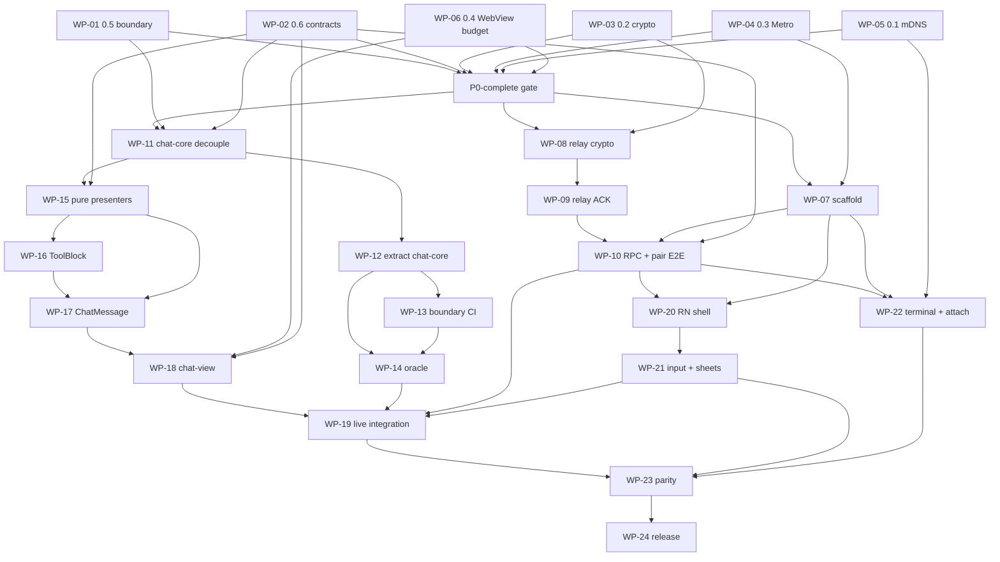

# Flutter → Expo Mobile Migration Plan

Status: **executable plan** — supersedes `docs/draft/flutter-to-expo-migration.md` for scheduling and gates  
Last updated: 2026-08-21  
Sources: draft migration, monorepo inventory, validation, work-package catalog, adversarial review (ordering / extraction / protocol / delivery), v0.55.2 remote-parity freeze  
Related: `apps/desktop/CLAUDE.md` (Remote Control), `apps/relay/`, `packages/shared`, external repo `super-one-flutter`, `docs/design/chat-core-contracts.md`

---

## 1. Status & decision

**Decision:** Replace the Flutter mobile client (`super-one-flutter`, ~25.5k LOC Dart) with an Expo/React Native app at `apps/mobile` (`@superone/mobile`) in this monorepo.

- **Chat** renders in a **single persistent WebView** driven by a React DOM bundle (`@superone/chat-view`).
- **Shell** (navigation, pairing, sheets, input, camera, file pickers, settings) is native React Native — full rewrite, no Flutter widget reuse.
- **Reduction** lives in pure TS (`@superone/chat-core`), extracted from desktop `applyEventToSession`.
- **Wire** lives in pure TS (`@superone/relay-client`): crypto, relay/LAN transport, remote RPC.
- **No production users** — no data migration, staged rollout, or rollback obligation.
- **Product scope:** Remote Control parity with desktop **v0.55.2-alpha** (chat / composer / pairing / terminal / permission sheets). Not a desktop IDE clone — see `docs/design/chat-core-contracts.md` §1.

### Why (priority order)

1. **Eliminate schema double-writing.** Flutter `agent_event.dart` + `session_state.dart` mirror `packages/shared` + desktop reducers; drift is runtime-only today.
2. **Decouple mobile from App Store latency** for protocol fixes (EAS Update for JS layer).
3. **Web-shaped content** (markdown, LaTeX, mermaid, widgets) belongs in a DOM renderer. Flutter already leaks into WebViews for mermaid/widgets.

> “More components can be reused” is **not** a load-bearing reason. React DOM does not run in RN; reuse only via WebView.

### Effort (staffed vs sequential)

| Mode | Calendar | Person-weeks |
|------|----------|--------------|
| **2-FTE** (relay/shell ∥ chat-core/presenters after P0) | **11–13 weeks** | ~18–22 |
| **1-FTE** (sequential critical path only) | **~18–22 weeks** | ~18–22 |

Draft §7 “9–12 weeks single-implementer” is **rejected** as under-scoped. Calendar below assumes optional 2-FTE; single-FTE use the longer range.

### Branch base

`feat/migrate-to-expo` — merged tag `v0.55.2-alpha` (2026-08-21). All package work lands here; desktop adapterization may use short-lived sub-branches (esp. ToolBlock, R8). Extract chat-core / chat-view from this snapshot so v0.55.2 transcript chrome (sandbox chip, error badge, Task diagnostic, `@native/*` galleries) comes along for free.

---

## 2. Target architecture

### 2.1 Package layout

```
apps/
  mobile/                  @superone/mobile — Expo dev-client app (RN shell)
  desktop/                 imports presenters back from packages/chat-view (adapter shells stay at existing paths)
packages/
  relay-client/            crypto, relay/LAN transport, remote RPC (pure TS; no node:crypto)
  chat-core/               applyEventToSession + contracts (pure TS)
  chat-view/               React DOM chat renderer + WebView host protocol (Vite asset)
  shared/                  unchanged (agent-types, event-seq-utils, agent-event-batcher, content-delta, tool-ui)
```

**Not created for this cycle:** extraction of `ChatInput` / composer stack into chat-view.

### 2.2 State ownership (single SOT)

| Owner | Owns | Does not own |
|-------|------|----------------|
| **RN shell** | Full session state via chat-core; `ChatInteractionState` sheets; `SessionUiState`; pairings; viewState persistence; applyEvents **batching**; transport | Transcript paint |
| **WebView (chat-view)** | View state only: scroll anchor, expand/collapse, selection; DOM window | Independent transcript reduction |
| **chat-core** | Pure reduce: `ChatCoreSession` → `ChatCorePatch` | Zustand, window, IPC, RN |

**One owner of chat state:** RN runs `@superone/chat-core` and pushes **reduction patches** into the WebView. The WebView **never** re-runs the reducer.

### 2.3 Three state contracts + patch model

Contracts are **projections** of the full reducer write-set, not the 34 statically-read `session.*` fields alone.

#### `ChatCoreSession` / `ChatCorePatch` (WP-02 freeze)

- **`ChatCoreSession`**: union of all fields family reducers **read** on `PerSessionState` (see `apps/desktop/src/renderer/src/stores/chat-store/types.ts`).
- **`ChatCorePatch`**: exhaustive key set of all fields family reducers **write** (Partial merge target). Generated from family write-points in:
  - `event-reducer/lifecycle.ts`, `content.ts`, `tool.ts`, `permission.ts`, `question-plan.ts`, `slash.ts`, `codex.ts`, `usage.ts`, `message-complete.ts`, `todos.ts`, ACP inline cases in `event-reducer/index.ts`.
- **Signature (post-extract):**  
  `applyEventToSession(session: ChatCoreSession, event: AgentEvent, ports?: ChatCorePorts) → ChatCorePatch`
- Desktop `event-slice` continues to merge patches structurally; production cutover to package only when **remote-relevant families are complete** (see §6 WP-12 narrow rule).

#### Projections (consumer split)

| Contract | Keys (minimum; expand to full write-set in WP-02) | Consumer |
|----------|-----------------------------------------------------|----------|
| **ChatReductionState** | `messages`, `queuedMessages`, `status`, `awaitingAssistantReply`, `lastEventAt`, `streamingTokens`, context/cost, `taskProgress`/`subagentTokens`, todos + bookkeeping, `_streamingToolInputPreviews` (nullable on remote), `browserDownloads`, `videoGenStatuses`, compact/slash bookkeeping, `promptSuggestion`, `session` (as needed for labels), `apiRetry`/`isCompacting`/… from write-set | **WebView** (plus derived labels from SessionUi) |
| **ChatInteractionState** | `pendingPermissions`, `pendingQuestion`, `pendingPlanApproval`, `planApprovalOutcome`, related permissionMode clears on resolve | **RN native sheets** |
| **SessionUiState** | `sessionProvider`, `preferredProvider`, `acpAgentId`, `acpModels`, `acpModes`, `*Status`, `selected*`, `modelUserChosen`, provider/model catalog | **RN shell**; WebView gets **derived labels only** |

**key → owner table (mandatory WP-02 deliverable):** every `ChatCorePatch` key maps to RN full-state apply vs WebView projection. RN always applies the full patch; WebView receives only Reduction + labels.

**Remote-omitted families:** desktop `SKIPPED_EVENTS` in `remote-control-service.ts` (e.g. `tool_input_delta`, `subagent_usage`, hook events) never appear on mobile remote path. `_streamingToolInputPreviews` may be empty on mobile; desktop oracle covers Maps/preview separately.

#### Ports vs pure moves (corrected)

| Symbol | Classification | Action |
|--------|----------------|--------|
| `persistStreamingToolInput`, `markMessageEventApplied` | **Pure transformers** | **Move** into chat-core (not “side-effect ports”) |
| `DEFAULT_PROVIDER` | Constant | Move into chat-core types/constants |
| `extractPartialToolInput` / media tool predicates | Pure helpers (today under `@/components`) | Relocate out of components; chat-core depends on pure modules |
| `window.app.trace`, `Date.now` id/time stamps | Real impurity | **Injected ports** (trace, clock) |
| Module-level streaming Maps (`event-reducer/shared.ts`) | Impure global | Port-owned session-scoped side state **or** fold into state **with** stable test API (prefer port/testable API over silent fold) |

### 2.4 Host protocol (RN ↔ WebView)

Naming rule: WebView never re-reduces. Prefer **`applyReductionPatch`** (or document `applyEvents` as “pre-reduced patches only”).

**Inbound (RN → WebView):**

| Message | Role |
|---------|------|
| `initialize` / `hydrate` / `reset` / `prependHistory` | Lifecycle |
| **`applyReductionPatch(batch)`** | RN-owned batching: ≤1 envelope per ~33 ms; payload is reduction patches, not raw AgentEvents for dual SOT |
| `setConnection({ state, epoch })` | Degrade stream; **epoch bumps at buffer release** after reconnect |
| `setTheme` / `setViewport({ safeArea, fontScale, locale })` | No independent derivation in WebView (R11) |
| `setWindow(range)` | Mandatory DOM windowing (R2) |
| `scrollToTurn` | Jump |
| `nativeActionResult` / `nativeActionProgress` | Async host replies |

**Outbound (WebView → RN):**

| Message | Role |
|---------|------|
| `requestNative` | openFile, showInFolder, openLink, sheets, share, progressive bash read, … |
| `viewState(patch)` | Scroll anchor + expand keys — **persisted on RN** (R10) |
| `ready` / `error(fatal)` | White-screen recovery: reload + hydrate (R2) |

**UI chrome:** WebView owns full-screen scroll; header + input are **RN overlays**. Never nest WebView inside RN ScrollView. Input is **native `TextInput` only** (no `<textarea>` in WebView).

**Terminal:** separate channel + **separate WebView** (memory isolation; terminal frames never enter event ACK/dedup).

### 2.5 Reconnect & dual-transport (protocol freeze)

#### Buffer-first session restore (open **and** reconnect)

Single RN order (do **not** copy Flutter open-path race at `chat_page.dart:2278+`):

```
startBuffering
  → (on transport reconnect / type=reset: clear local seq as required)
  → subscribe_session
  → load_session_messages (history)
  → get_session_state (snapshot)
  → ordered release of buffered type=event frames (live + replayed)
  → bump setConnection.epoch at release boundary
```

All `type=event` frames (including relay **replay** forwards) enqueue until history+snapshot complete. Desktop exposes separate RPCs only — **client-owned** composition.

#### Dual transport

Desktop may dual-broadcast ciphertext on open LAN + relay (`remote-control-service.ts` send path) with **independent** LAN seq vs relay seq.

**Client rules (hard):**

1. Exactly **one active event transport** at a time (race-winner or prefer-LAN).
2. Isolate `_processedSeqs` / `lastAckedSeq` **per transport**.
3. Never send a **relay** ACK with a **LAN** seq (and vice versa).
4. LAN has **no** DO-style replay/forcedDrop/ACK GC — LAN reconnect = full session rehydrate, not `fromSeq` replay.
5. Regression test: dual-socket delivery of same ciphertext must **not** double-apply into reduction.

#### Relay client ACK invariants (port from Flutter `relay_client.dart`)

- `_processedSeqs.add(seq)` **before** decrypt.
- ACK even when decrypt fails.
- `_processedSeqs` bounded (trim ~2048).
- Cumulative ACK of max contiguous seq.
- Envelope `seq` is ACK/replay only — **never** write onto `AgentEvent.seq`.
- Server `forcedDropSeq`: client reacts to frame `type: 'reset'` only (do not invent client-side forcedDropSeq).
- Offline devices stay pending never ACKed — **server oracle** (`apps/relay`); client must still ACK when online after process.
- `desktop_shutdown` clears local seq; does not invent forcedDropSeq.
- Terminal frames: **no** seq ACK path.

### 2.6 Extraction rule (chat-view)

1. **Adapterize in place** (pure presenter + host port with desktop default adapter).
2. Desktop keeps **adapter shells** at existing import paths (`ToolBlock`, `ChatMessage`, …) so suite stays green.
3. Move pure presenters into `packages/chat-view` only after ports exist.
4. **Out of scope for chat-view:** `ChatInput`, `ChatPanel`, `MentionPopup`, model-selector, `ChatStatusBar`, permission/question/plan composer stack (RN reimplements).

### 2.7 Adapterize priority (evidence-based)

1. Pure helpers: `tool-display`, `tool-block-utils`, `media-generation`, `compact-chat-mode`, `getAssistantCopyText`, `groupContent`
2. Thin presenters: `ReasoningBlock`, `TerminalCommandOutput`, `CollapsibleOutput`, `ToolGroup`
3. `CopyableMarkdown` + `CodeBlock` (setTimeout 33ms throttle; `useIsCodeFenceIncomplete`) + markdown host ports
4. **ToolBlock** family-by-family (R8 critical path)
5. `ChatMessage` + DurationFooter ports
6. `CodexTurnView` / codex-item-renderer
7. Defer mini-app iframe tools (`StandaloneToolBlock` / `WidgetBlock` / `ToolRendererFrame`) or `requestNative` no-op (R6)

---

## 3. Evidence snapshot

Inventory + validation outcomes (code paths preferred over draft-only numbers).

| ID | Verdict | Finding |
|----|---------|---------|
| **C0.1** | **fallback_accepted** (2026-08-21) | Relay + manual host:port. Plist keys stamped on `apps/mobile` for a later WP-22 retry. Notes: `docs/design/expo-p0-spikes.md`. **Do not block P2 pairing on mDNS.** |
| **C0.2** | **spike_done** (2026-08-21) | Vectors in `docs/design/relay-crypto-golden/`. Unmodified desktop ciphertext decrypts on Flutter 1.0.0+19 and `@noble/ciphers@2.3.0`. Library for WP-08: noble (not quick-crypto). Zero edits under frozen crypto trees. |
| **C0.5** | **spike_done** (2026-08-14) | `../index` inverted: three symbols live in `event-reducer/transformers.ts` (barrel re-exports). Lifecycle family has no `@/components` / `window` / Maps. Remaining: component predicates, `window.app.trace`, module Maps, `Date.now`, `defaults`↔`index` cycle. Notes: `docs/design/chat-core-extraction-spike.md`. No package cutover. |
| **C0.6** | **freeze_done** (2026-08-21) | Exhaustive `ChatCorePatch` + key→owner + `SKIPPED_EVENTS` + host table + dual-transport in `docs/design/chat-core-contracts.md`. Baseline v0.55.2 (`messages_retracted`; `model_fallback` is a transcript row, not a patch key). |
| **C-seq** | confirmed | Never conflate relay envelope seq with `AgentEvent.seq` (relay-session enqueue; session `nextEventSeq`; Flutter never stamps seq on events). |
| **C-reconnect** | partial | Flutter reconnect buffer-first at `chat_page.dart:485-513`; open path races — **normalize buffer-first**. |
| **C-batch** | confirmed | Desktop paragraph-coalesces mobile text (`\n\n` or ≥1000 chars). RN→WebView ≤1/33ms is **new** host design. Shared `AGENT_EVENT_BATCH_MS = 33`. |
| **C-adapter** | partial | ToolBlock multi-store + IPC (`showInFolder`, bash read, `findLineNumber`); no host-port layer yet. Expand is local `useState` only (R10). |
| **C-oracle** | confirmed | Flutter `recorded_catalog_test` has **zero `expect()`**; incomplete barrel. Not a reduction oracle. |
| **C-packages** | **partial** (2026-08-21) | `apps/mobile` + `packages/relay-client` exist. `packages/{chat-core,chat-view}` still missing. |
| **C-non-goals** | confirmed | Phase 2 zero-diff under `apps/desktop/src/main/remote/` and `apps/relay/`. |
| **C-isComposing** | **refuted** | No `isComposing` in Flutter. Implement RN IME guard from **desktop** product requirements (`ChatInput` semantics), not Flutter port. |
| **C-forcedDrop** | confirmed | Server reset when `fromSeq <= forcedDropSeq`; offline pending never ACKed; client handles `type: reset`. |
| **C-purity-ports** | partial | Pure transformers ≠ ports; only trace/clock (and real I/O) are ports. |

### Must-do-before-code (P0 gates)

- **0.5** chat-core boundary proof + compile-time boundary sketch — **done** (`docs/design/chat-core-extraction-spike.md`)
- **0.6** freeze contracts + host protocol + dual-transport + buffer-first — **done** (`docs/design/chat-core-contracts.md`)
- **0.2** golden AES-GCM/HKDF (+ chunked file) vectors — **done** (`docs/design/relay-crypto-golden/`)
- **0.3** Metro `@superone/shared` under bun hoisted workspaces — **done** (`apps/mobile/metro.config.js` + `scripts/assert-shared-resolution.ts`)  
- **0.1** mDNS attempt or formal fallback accept (non-blocking for P2) — **fallback accepted** (`docs/design/expo-p0-spikes.md`)  
- **0.4** WebView RSS/frame + stress corpus owner — **done** (fail-closed window in `apps/mobile/src/chat-window.ts`; RSS on device at WP-18)  

Keep `super-one-flutter` readable through P7 as behavioural reference (ACK path, attachment transports, visual catalog).

---

## 4. Hard constraints & non-goals

### Hard constraints

1. Input stays **native RN TextInput** with IME composition guard from **desktop** product requirements (not Flutter).
2. WebView owns full-screen scroll; header/input RN overlays; **never** nest WebView in RN ScrollView.
3. **DOM windowing mandatory** from day one (R2), not an optimisation.
4. **Never** write relay envelope seq into individual events; envelope seq = ACK/replay; `AgentEvent.seq` separate.
5. RN owns patch batching: **≤1 envelope per ~33 ms** into WebView.
6. Reconnect/open: **buffer-first** subscribe → history → snapshot → release; epoch at release.
7. **No forked reducer.** Narrow family allowed only for spike/decouple proof; production desktop reimport + mobile cutover require **single** full remote-relevant `applyEventToSession`.
8. **Adapterize before move.** No package move until store/IPC behind ports; desktop adapter shells remain at existing paths.
9. `chat-core` must not import `../index`, Zustand, `@/components`, or `window` (compile-time boundary test).
10. Contracts include full **write-set**, not read-set-only; exhaustive `ChatCorePatch` + key→owner.
11. relay-client: processedSeqs before decrypt; ACK on decrypt fail; bound set; exclusive transport; reset on server `reset` only.
12. **Phase 2 zero changes** under `apps/desktop/src/main/remote/` and `apps/relay/` — failing this is a design error, not a licence to edit.
13. chat-view streaming paint: **setTimeout**, never rAF; stamp `--brand-hue` at bundle entry.
14. View state (scroll, expand) persists on **RN** across DOM-window unmount.
15. Pure transformers = **move**; only real I/O/impurities = **ports**.
16. Dual-transport: single active event transport; per-transport seq/ACK namespaces.

### Non-goals

- Desktop renderer changes beyond adapterization with green tests (path shims allowed).
- `apps/cli` or `apps/relay` changes for mobile Phase 2 (relay freeze).
- Expo Go compatibility (dev client required).
- Android foldables/tablets this cycle.
- Extraction of ChatInput / interactive composer containers into chat-view.
- Forked reducer; half-package production cutover.
- Data migration / staged rollout / rollback plans.
- Finer-grained streaming vs paragraph-chunked text (desktop already coalesces; § out of scope).
- Replacing desktop-side relay host code with relay-client this cycle (package is standalone for either later).
- Desktop-only surfaces as of v0.55.2: DeepSeek in-process runtime / trajectory / plugin host, Computer Use workspace, agent-browser PiP, CDP perf, Liquid Glass, `.ipynb` preview, custom-provider settings UI. Expo renders remote `AgentEvent`s from those harnesses; it does not host them.

---

## 5. Phase-0 de-risk checklist

| Spike | Unknown | Verification | Fallback | Verdict now |
|-------|---------|--------------|----------|-------------|
| **0.1** | mDNS (`nsd` → `react-native-zeroconf`) | Discover `dev:cli:lab` / desktop `_superone._tcp` on iOS+Android hardware; config plugin + `NSBonjourServices` | Relay-only + manual host:port | **fallback_accepted** — P2 is QR/relay |
| **0.2** | AES-256-GCM + HKDF wire parity | Golden vectors desktop↔Dart; `@noble/ciphers` (+ hashes) decode unmodified desktop frames | `react-native-quick-crypto` | **spike_done** — noble 2.3.0; fallback unused |
| **0.3** | Metro + bun hoisted workspaces | `resolver.unstable_enableSymlinks` + `watchFolders`; import `@superone/shared` leaf | Explicit per-package alias map | **spike_done** — `apps/mobile/metro.config.js`; leaf-only rule |
| **0.4** | WebView streaming perf + RSS | Stress corpus (≥200 turns code+mermaid) + longest recording; sample paint intervals; RSS | Coarser DOM window; tighter RN envelope | **spike_done** — fail-closed window locked; device RSS at WP-18 |
| **0.5** | chat-core cut | Invert `../index` + relocate component predicates + ports for clock/trace/Maps; no slice drag | Narrow **first family for proof only**; never fork production | **spike_done** — `../index` gone; remaining impurities in spike notes (WP-11) |
| **0.6** | Host protocol + contracts | Freeze ChatCoreSession/Patch, three projections, dual-transport, buffer-first, `applyReductionPatch` | — | **freeze_done** — `docs/design/chat-core-contracts.md` |

**P0 exit:** **complete 2026-08-21.** 0.1 fallback; 0.2 golden+noble; 0.3 Metro config + shared leaf proof; 0.4 fail-closed window; 0.5/0.6 chat-core freeze. Companion: `docs/design/expo-p0-spikes.md`.  
**Gate:** WP-07 / WP-08 / WP-11 / WP-15 may start. Device RSS remains a WP-18 measurement against the locked window.

---

## 6. Work package catalog

**Package count: 24** (WP-01 … WP-24)

Gate wording: **zero test path edits** — allow shim re-exports and import path updates; forbid empty assertions or behavior-changing rewrites to force green.

### Wave 0 — P0 de-risk

#### WP-01 — Spike 0.5: chat-core extraction boundary

| | |
|--|--|
| **Phase / risk / estimate** | P0 / high / 2–3 days |
| **depends_on** | — |
| **parallel_ok_with** | WP-02, WP-03, WP-04, WP-05, WP-06 |
| **Goal** | Prove `applyEventToSession` (~1.9k LOC event-reducer) can drop `../index`, `@/components`, `window`, and module-level streaming Maps without dragging slices/Zustand. |
| **Exit** | **done 2026-08-14** — port map in `docs/design/chat-core-extraction-spike.md`; lifecycle family clean of `../index` / `@/components` / `window` / Maps; no narrow fallback; no production cutover |
| **Tests** | Ad-hoc compile of inverted family; no production cutover |
| **Scope** | `apps/desktop/.../chat-store/event-reducer/`, `index.ts`, `helpers/codex-helpers.ts`, `components/chat/tool-display.ts`, `media-generation.ts` |

**Narrow fallback rule:** Full family set remains owned by a **single** `applyEventToSession`. Spike/WP-11 may decouple a subset; **desktop reimport + WP-19 mobile production path wait until remote-relevant families are complete.** Spike proof ≠ half-package ship.

#### WP-02 — Spike 0.6: freeze host protocol + contracts

| | |
|--|--|
| **Phase / risk / estimate** | P0 / medium / 2 days |
| **depends_on** | — |
| **parallel_ok_with** | WP-01, WP-03–06 |
| **Goal** | Freeze `ChatCoreSession` / exhaustive `ChatCorePatch` / three projections / key→owner; host table; dual-transport; buffer-first open+reconnect; `applyReductionPatch` naming. |
| **Exit** | **done 2026-08-21** — `docs/design/chat-core-contracts.md`: exhaustive patch keys from all families on v0.55.2; read union; key→owner; `SKIPPED_EVENTS`; dual-transport + reconnect; host table; Remote Control vs desktop-only split |
| **Tests** | Contract fixtures as markdown/TS types sketch (implementation later) |
| **Scope** | `chat-store/types.ts`, event-reducer, `remote-control-service.ts` (read-only), `packages/shared/src/agent-types.ts` |

#### WP-03 — Spike 0.2: AES-256-GCM + HKDF golden vectors

| | |
|--|--|
| **Phase / risk / estimate** | P0 / high / 2–3 days |
| **depends_on** | — |
| **parallel_ok_with** | WP-01–02, WP-04–06 |
| **Goal** | Capture desktop↔Dart golden vectors for payload + chunked file envelopes; prove @noble (or quick-crypto) decode with **zero** edits under frozen trees. |
| **Exit** | **done 2026-08-21** — `docs/design/relay-crypto-golden/`; desktop golden test; Flutter + `@noble/ciphers@2.3.0` decrypt unmodified frames; WP-08 library = noble |
| **Tests** | `remote-control-crypto.golden.test.ts` |
| **Scope** | `remote-control-crypto.ts` (read-only), Flutter `crypto.dart` (read-only), tests |

#### WP-04 — Spike 0.3: Metro resolves `@superone/shared`

| | |
|--|--|
| **Phase / risk / estimate** | P0 / medium / 1–2 days |
| **depends_on** | — |
| **parallel_ok_with** | WP-01–03, WP-05–06 |
| **Goal** | Metro under bun hoisted workspaces resolves shared source exports. |
| **Exit** | **done 2026-08-21** — `apps/mobile` imports `@superone/shared/agent-event-batcher` + `agent-types`; Metro enables package exports + blocks Node leaves; alias fallback in `docs/design/expo-p0-spikes.md` |
| **Tests** | `apps/mobile/scripts/assert-shared-resolution.ts` |
| **Scope** | `apps/mobile/metro.config.js`, `packages/shared/package.json` (read-only) |

#### WP-05 — Spike 0.1: mDNS on device

| | |
|--|--|
| **Phase / risk / estimate** | P0 / medium / 1–2 days |
| **depends_on** | — |
| **parallel_ok_with** | WP-01–04, WP-06 |
| **Goal** | Attempt zeroconf discovery of `_superone._tcp`; or accept relay-only fallback. |
| **Exit** | **done 2026-08-21** — formal fallback accept (QR/relay + optional host:port). `NSBonjourServices` / local-network strings stamped on `app.json` for WP-22. |
| **Tests** | n/a (no hardware this spike) |
| **Scope** | `lan-advertiser.ts` (read-only), Flutter `lan_discovery.dart` (read-only), `apps/mobile/app.json` |

#### WP-06 — Spike 0.4: WebView streaming + RSS budget

| | |
|--|--|
| **Phase / risk / estimate** | P0 / high / 2 days |
| **depends_on** | — |
| **parallel_ok_with** | WP-01–05 |
| **Goal** | Stress corpus + longest recording; measure frame p95 + peak RSS with mandatory windowing; fail-closed gates. |
| **Exit** | **done 2026-08-21** — corpus owned (`show-widget` / `claude-todos` / `mermaid-latex`); window 24/8/40; `error(fatal)` reload+hydrate. Device RSS/p95 measured at WP-18 against these sizes (fail-closed, do not relax). |
| **Tests** | `apps/mobile/src/chat-window.test.ts` |
| **Scope** | recordings, `CopyableMarkdown.tsx` (read-only), `apps/mobile/src/chat-window.ts` |

---

### Wave 1 — Scaffold

#### WP-07 — Scaffold `apps/mobile` + Expo tooling

| | |
|--|--|
| **Phase / risk / estimate** | P1 / medium / 3 days |
| **depends_on** | WP-04; **P0-complete** for 0.1–0.6 recorded (0.1 may be fallback) |
| **parallel_ok_with** | — (after P0) |
| **Goal** | Expo dev-client boots iOS+Android; imports `@superone/shared`; root scripts; `packages/tsconfig/react-native.json`; `apps/mobile/CLAUDE.md` runtime map (RN / chat WebView / terminal WebView). Enable `ios.supportsTablet: true`, `requireFullScreen: false` early. |
| **Exit** | **scaffold 2026-08-21** — Expo SDK 54 dev-client app at `apps/mobile`; `dev:mobile`; iPad flags; CLAUDE.md runtime map. First hardware `expo run:ios/android` is remaining (CNG, ios/android gitignored). |
| **Tests** | `assert-shared-resolution.ts`; `tsc` path |
| **Scope** | `apps/mobile/`, `packages/tsconfig/react-native.json`, root `package.json`, root `CLAUDE.md` |

---

### Wave 2 — Relay crypto + chat-core decouple (+ presenters after WP-11)

#### WP-08 — packages/relay-client: crypto + golden tests

| | |
|--|--|
| **Phase / risk / estimate** | P2 / high / 2–3 days |
| **depends_on** | WP-03; P0-complete |
| **parallel_ok_with** | WP-11 (after both free of shared files) |
| **Goal** | Pure-TS crypto: HKDF + AES-GCM + chunked file; no `@superone/runtime` crypto; zero-diff frozen trees. |
| **Exit** | **done 2026-08-21** — `@superone/relay-client` decrypts WP-03 golden frames with `@noble/ciphers@2.3.0`; no `@superone/runtime`; frozen trees untouched. ACK/RPC is WP-09/10. |
| **Tests** | `bun --filter @superone/relay-client test` |
| **Scope** | `packages/relay-client/` |

#### WP-11 — P3a: chat-core decoupling inside desktop

| | |
|--|--|
| **Phase / risk / estimate** | P3a / high / 1–1.5 weeks |
| **depends_on** | WP-01, WP-02; P0-complete |
| **parallel_ok_with** | WP-08 |
| **Goal** | Invert 3 `../index` imports; **WP-11 sole writer** for reducer-used `tool-display` / `media-generation` predicates; inject clock/trace; streaming Maps via ports; break `defaults.ts`↔`index` cycle; extract provider/model/ACP settings reducer; define contracts per WP-02; split pure codex helpers (`upsertCodexItem`, token helpers, …) from store-bound helpers. |
| **Exit** | event-reducer free of `../index`, `@/components`, `window`; contracts typed; pure codex file only in reducer graph; desktop suite green |
| **Tests** | Existing event-reducer `*.test.ts`; zero test path edits target |
| **Scope** | event-reducer, types, defaults, index, codex-helpers, tool-display, media-generation |

#### WP-15 — P4a-1: pure presenters adapterize in place

| | |
|--|--|
| **Phase / risk / estimate** | P4a / medium / 3–4 days |
| **depends_on** | **WP-11**, WP-02 |
| **parallel_ok_with** | WP-09, WP-12 (after those start) — **not** WP-11 |
| **Goal** | Adapterize pure presenters **without** re-homing WP-11-owned predicate exports: tool-block-utils, compact-chat-mode, getAssistantCopyText, groupContent extract, ReasoningBlock, TerminalCommandOutput, CollapsibleOutput, ToolGroup. Consume ports from WP-11. |
| **Exit** | No package leave until ports ready; stable exports; suite green |
| **Tests** | Existing unit tests for tool-block-utils etc. |
| **Scope** | listed pure chat components (not parallel-edit of tool-display/media-generation exports) |

**Single-writer:** `tool-display.ts` + `media-generation.ts` predicate relocation = **WP-11 only**. WP-15 consumes.

---

### Wave 3 — Transport invariants + package extract + ToolBlock

#### WP-09 — packages/relay-client: ACK/replay/reset

| | |
|--|--|
| **Phase / risk / estimate** | P2 / high / 3–4 days |
| **depends_on** | WP-08 |
| **parallel_ok_with** | WP-12, WP-13, WP-15, WP-16 (true peers only) |
| **Goal** | WS frame handling + invariants; normalize decrypt payload array|object; ignore terminal for ACK; desktop_shutdown clears local seq. |
| **Exit** | Flutter-semantic ACK/dedup; tests listed below; zero-diff `apps/relay` + `apps/desktop/src/main/remote/` |
| **Tests** | cumulative ACK; ACK-on-decrypt-fail; bounded `_processedSeqs`; reset→clearSeq+resubscribe signal; multi-event envelopes; mixed with/without `AgentEvent.seq`; decrypt Map|List; terminal ignored for ACK; no client forcedDropSeq invent |
| **Scope** | `packages/relay-client/` (read `relay-session.ts` / Flutter as oracle only) |

#### WP-12 — P3b: extract `@superone/chat-core` + desktop reimport

| | |
|--|--|
| **Phase / risk / estimate** | P3b / high / 3–4 days |
| **depends_on** | WP-11 |
| **parallel_ok_with** | WP-09, WP-16 (not WP-13) |
| **Goal** | Create package; move pure applyEventToSession + families + contracts; desktop re-exports so production path identical **only when remote-relevant families complete** (no half-package mobile cutover). |
| **Exit** | Desktop imports package; suite green with **zero test path edits** (shims OK); re-export surface: `applyEventToSession`, pure helpers (`mapMessagesStructural` if needed), family test relative path shims; depends only on `@superone/shared` pure modules; no Zustand/window/@/components |
| **Tests** | Full desktop suite `bun run test` (or targeted event-reducer + integration) |
| **Scope** | `packages/chat-core/`, chat-store re-exports |

#### WP-13 — chat-core compile-time boundary gate

| | |
|--|--|
| **Phase / risk / estimate** | P3b / low / 1 day |
| **depends_on** | WP-12 |
| **parallel_ok_with** | WP-09, WP-16 |
| **Goal** | Permanent boundary test: no Zustand, `@/components`, `window`, Electron, `../index`. |
| **Exit** | CI-green boundary; `test:chat-core` / typecheck includes package |
| **Tests** | eslint/import restriction or vitest filesystem scan |
| **Scope** | `packages/chat-core/`, root scripts |

#### WP-16 — P4a-2: ToolBlock family adapterize

| | |
|--|--|
| **Phase / risk / estimate** | P4a / high / 1–1.5 weeks |
| **depends_on** | WP-15 |
| **parallel_ok_with** | WP-09, WP-12, WP-13 |
| **Goal** | ToolBlock (~2142 LOC) family-by-family pure presenter + host adapter; ports for bash I/O, FileChip, EditDiff, showInFolder, findLineNumber; desktop **adapter shell stays** at existing path; defer miniapp iframes. |
| **Exit** | Stable external API; controlled expand props prepared (R10); suite green; prefer dedicated sub-branch (R8) |
| **Tests** | ToolBlock unit/integration; PermissionPrompt still imports EditDiff/WriteDiff |
| **Scope** | `ToolBlock.tsx` + specializations, markdown host edges as needed |

---

### Wave 4a — P2 E2E + oracle + ChatMessage presenters (anti-chain)

#### WP-10 — packages/relay-client: RPC, pairing, buffer-first + mobile log E2E

| | |
|--|--|
| **Phase / risk / estimate** | P2 / high / 3–4 days |
| **depends_on** | WP-09, WP-07, **WP-02** |
| **parallel_ok_with** | WP-14, WP-17 **only** (not WP-20/WP-22) |
| **Goal** | RemoteCommand RPC typed from shared; QR pairing; **exclusive** dual-path transport; buffer-first open+reconnect; reset→rehydrate; mobile logs decrypted AgentEvents. |
| **Exit** | QR pair → decrypt → log on device; buffer-first + exclusive transport documented; dual-delivery regression; zero-diff frozen trees; mDNS optional |
| **Tests** | Device E2E log; unit dual-transport isolation; reconnect buffer unit |
| **Scope** | `packages/relay-client/`, `apps/mobile/` |

#### WP-14 — P3c: chat-core parity oracle (TS snapshots)

| | |
|--|--|
| **Phase / risk / estimate** | P3c / medium / 3–4 days |
| **depends_on** | WP-12, WP-13 (**and** full remote-relevant families if narrow fallback was used) |
| **parallel_ok_with** | WP-10, WP-17 |
| **Goal** | Real snapshot `expect()`; retarget export to TS; wire or drop bg-agent-history; clock fields excluded or ported; remote path notes no `tool_input_delta`. |
| **Exit** | TS oracle green; required cases: mixed seq batches; multi-event envelopes; desktop-rebuilt text/thinking field contract |
| **Tests** | `packages/chat-core` snapshot suite |
| **Scope** | chat-core, desktop fixtures, export scripts, Flutter recorded (oracle input only) |

#### WP-17 — P4a-3: ChatMessage + Codex + markdown ports

| | |
|--|--|
| **Phase / risk / estimate** | P4a / high / 4–5 days |
| **depends_on** | WP-16, WP-15 |
| **parallel_ok_with** | WP-10, WP-14 |
| **Goal** | ChatMessage, CopyableMarkdown (setTimeout 33ms), CodeBlock, CodexTurnView, Subagent/Workflow, Mermaid theme props; desktop adapter shells retained. |
| **Exit** | Suite green; ready for package move; plan approval stays host interaction |
| **Tests** | ChatMessage tests via default adapters |
| **Scope** | listed chat components |

---

### Wave 4b — chat-view bundle (after WP-17)

#### WP-18 — P4b: packages/chat-view WebView bundle + Playwright

| | |
|--|--|
| **Phase / risk / estimate** | P4b / high / 1–1.5 weeks (or prioritize subset if slip: tools + permission visual + mermaid/latex + scroll; residual → WP-23) |
| **depends_on** | WP-17, WP-06, WP-02 |
| **parallel_ok_with** | WP-20, WP-22 (after WP-10; no depends edge) |
| **Goal** | Package + Vite self-contained asset; stamp `--brand-hue`; mandatory DOM windowing (WP-06 sizes); Playwright ~26 scenarios (or prioritized subset); desktop imports presenters via adapter shells; **no ChatInput**. |
| **Exit** | Offline asset; Playwright green; no Zustand/window in package |
| **Tests** | Playwright against fixtures; stress corpus RSS/frame from WP-06 |
| **Scope** | `packages/chat-view/`, theme.css, desktop re-exports |

---

### Wave 4c — shell + terminal (after WP-10)

#### WP-20 — P5a: RN shell pairing, nav, lists, storage

| | |
|--|--|
| **Phase / risk / estimate** | P5 / medium / 1–1.5 weeks |
| **depends_on** | WP-07, **WP-10** |
| **parallel_ok_with** | WP-22, WP-18 (if WP-10/17 done) |
| **Goal** | QR pairing, navigation, project/session lists, connection status, MMKV (pairings + viewState); file browser / git indicators / settings **mapped into exit** (or explicit cycle non-goals if cut). |
| **Exit** | Lists via RPC; MMKV; CLAUDE.md runtime map (R6) |
| **Tests** | Manual device; unit stores where cheap |
| **Scope** | `apps/mobile/` |

#### WP-22 — P6: Terminal WebView + attachments + LAN

| | |
|--|--|
| **Phase / risk / estimate** | P6 / medium / 1 week |
| **depends_on** | WP-07, **WP-10**, WP-05 |
| **parallel_ok_with** | WP-20, WP-18 |
| **Goal** | Separate terminal WebView (xterm.js; re-verify webgl patch); terminal **non-ACK** / isolated channel; attachment transports inline / LAN-PUT / relay-R2; PDF via images; LAN per 0.1; assert terminal flood does not block event ACK. |
| **Exit** | Three transports; PDF path; terminal isolation tests |
| **Tests** | Transport matrix unit; terminal non-ACK unit |
| **Scope** | mobile, relay-client, xterm patch |

---

### Wave 5 — Composer then live integration

#### WP-21 — P5b: RN input, IME, slash/mentions, sheets

| | |
|--|--|
| **Phase / risk / estimate** | P5 / medium / 1–1.5 weeks |
| **depends_on** | WP-20 |
| **parallel_ok_with** | — |
| **Goal** | Native composer; IME composition guard from **desktop** ChatInput semantics; slash, @mentions, attachments; sheets for permission/plan/question/worktree/add-dir/provider; **iPad anchors continuously** (R4), not only P7. |
| **Exit** | No WebView textarea; sheets driven by ChatInteractionState; iPad presentation safe |
| **Tests** | IME composition unit where possible; sheet presentation smoke |
| **Scope** | `apps/mobile/` |

#### WP-19 — P4c: live RN↔WebView chat integration

| | |
|--|--|
| **Phase / risk / estimate** | P4c / high / 1 week |
| **depends_on** | WP-18, WP-14, WP-10, **WP-21** (hard — no stub-sheet path) |
| **parallel_ok_with** | — |
| **Goal** | chat-core on RN; `applyReductionPatch` ≤1/33ms (optional shared batcher); interaction sheets live; viewState on RN; `error(fatal)`→reload+hydrate; never nest WebView in ScrollView. |
| **Exit** | Live session green; reconnect **mid-stream flap E2E** + epoch-gated apply; multi-event envelopes; oracle WP-14 green; full remote-relevant families only |
| **Tests** | Device flap; white-screen recovery; batching unit |
| **Scope** | mobile, chat-view, chat-core, relay-client, shared batcher |

---

### Wave 6 — Parity

#### WP-23 — P7: device parity + iPad multi-pane

| | |
|--|--|
| **Phase / risk / estimate** | P7 / medium / 1 week |
| **depends_on** | WP-19, WP-21, WP-22 |
| **parallel_ok_with** | — |
| **Goal** | Recorded visual catalog vs Flutter screenshots; re-derive `stripContentBlock` exemptions; iPad multi-pane ≥md; performance budgets with WP-06 stress corpus. |
| **Exit** | Checklist signed; budgets met or window tightened before ship |
| **Tests** | Device catalog; RSS/frame on stress corpus |
| **Scope** | mobile, chat-view |

---

### Wave 7 — Release

#### WP-24 — P8: EAS release, dogfood, Flutter archive

| | |
|--|--|
| **Phase / risk / estimate** | P8 / low / 1 week |
| **depends_on** | WP-23 |
| **Goal** | EAS → TestFlight + internal APK; one week dogfood; archive Flutter read-only. |
| **Exit** | Builds shipped; dogfood notes; Flutter archived; freeze protocol complete |
| **Tests** | Internal dogfood checklist |
| **Scope** | mobile, docs |

**R7 freeze protocol:** feature freeze Flutter at **WP-10 exit**; bug-fix SLA only; max dual-maintenance window = through WP-24 dogfood; go/no-go before archive.

---

## 7. Wave / critical-path schedule

### Dependency DAG (mermaid-friendly)



### Waves (each `package_ids` is a depends_on anti-chain)

| Wave | Package IDs | Notes |
|------|-------------|-------|
| **0** | WP-01, WP-02, WP-03, WP-04, WP-05, WP-06 | Parallel spikes; P0-complete gate |
| **1** | WP-07 | Scaffold |
| **2a** | WP-08, WP-11 | Relay crypto ∥ chat-core decouple |
| **2b** | WP-15 | After WP-11 (shared-file ownership) |
| **3** | WP-09, WP-12, WP-16 | ACK ∥ extract ∥ ToolBlock; then WP-13 after WP-12 |
| **3′** | WP-13 | Boundary CI (serial after WP-12) |
| **4a** | WP-10, WP-14, WP-17 | True peers |
| **4b** | WP-18 | After WP-17 |
| **4c** | WP-20, WP-22 | After WP-10; ∥ each other and WP-18 if ready |
| **5a** | WP-21 | After WP-20 |
| **5b** | WP-19 | Merge node — after WP-18, WP-14, WP-10, WP-21 |
| **6** | WP-23 | Parity |
| **7** | WP-24 | Release |

### Critical path tracks (not a false serial bag)

**Track A — chat-core / presenters (longest when ToolBlock dominates):**  
WP-01 → WP-11 → WP-15 → WP-16 → WP-17 → WP-18 → **WP-19** → WP-23 → WP-24

**Track B — relay / shell:**  
WP-03 → WP-08 → WP-09 → WP-10 → WP-20 → WP-21 → **WP-19** → WP-23 → WP-24

**Track C — oracle:**  
WP-11 → WP-12 → WP-13 → WP-14 → **WP-19**

**Merge node:** **WP-19** (requires A+B+C+WP-18+WP-21).

**Primary critical_path array (Track A + merge + ship), 2-FTE calendar driver when ToolBlock is slowest:**

```
WP-01 → WP-11 → WP-15 → WP-16 → WP-17 → WP-18 → WP-21 → WP-19 → WP-23 → WP-24
```

(WP-21 is on Track B; with 2 FTE it completes in parallel with late WP-18. Single-FTE must serialize Track B before merge.)

**Calendar alignment:** P5a/P5b start **after WP-10**, not after scaffold alone. P6 (WP-22) parallel with P5 **only after WP-10**.

---

## 8. Risk register

| ID | Severity | Title | Mitigation |
|----|----------|-------|------------|
| **R1** | Medium | mDNS has no first-party RN solution | 0.1 fallback: relay + manual address; do not block P2 |
| **R2** | High | WebView memory / iOS jetsam white screen | DOM windowing day one; WP-06 stress corpus; `error(fatal)` → reload+hydrate; tighten window before WP-19 sign-off if RSS over |
| **R4** | Medium | iPad sheets/popovers misplace | iPad anchors from WP-21; supportsTablet early in WP-07 |
| **R5** | Medium | RN IME regressions | Native TextInput; implement composition guard from **desktop** semantics (not Flutter) |
| **R6** | Medium | Three runtimes (RN / chat WebView / terminal WebView / optional mini-app) | One documented protocol map in `apps/mobile/CLAUDE.md`; defer nested mini-app iframes |
| **R7** | Medium | Dual maintenance Flutter + Expo | Freeze Flutter features at WP-10; bug fixes only; max overlap through WP-24; dogfood go/no-go |
| **R8** | High | ToolBlock adapterization destabilises busiest UI | Family-by-family; desktop adapter shells; zero test path edits; dedicated branch |
| **R9** | High | Reconnect mid-stream corrupts transcript | Buffer-first + epoch; exclusive transport; flap E2E at WP-19 |
| **R10** | Medium | View state lost on DOM-window unmount | viewState on RN; controlled expand props |
| **R11** | Medium | Theme/safe-area/font/locale drift | setTheme/setViewport only; no independent WebView derivation |
| **R12** | Medium | Attachment transport regression | Port source.transport matrix; cover all three in WP-22 |
| **R13** | High | chat-core extraction balloons | 0.5 first; boundary CI; narrow **proof only**; no production fork |
| **R14** | High | Dual LAN+relay double-apply | Exclusive active transport + per-transport seq; dual-delivery test |
| **R15** | Medium | Half-package chat-core cutover | Explicit remaining-families work before WP-14/WP-19 if narrow used |
| **R16** | Medium | Schedule under-staffed as 1 FTE | Publish 18–22w single-FTE; 11–13w needs ~2 FTE on critical tracks |

### Residual concerns (non-blocking but tracked)

- Wave 3 lists WP-12 then WP-13 as separate anti-chain steps (3 / 3′).
- `codex-helpers` purity split is load-bearing for WP-12 boundary CI.
- Desktop oracle vs remote-empty previews must not false-green mobile.
- Lifecycle/question-plan unit coverage thinner than visual catalog — add during WP-11/14.
- Playwright full 26-scenario port may slip; prioritize then residual WP-23.
- Performance budgets need harness ownership beyond packed WP-23 (reuse WP-06 artifact).

---

## 9. Performance budgets & required tests

### Budgets

| Metric | Target |
|--------|--------|
| Streaming frame interval inside WebView | p95 **&lt; 20 ms** |
| Peak RSS after 200 turns (code + mermaid) | **&lt; 250 MB** |
| Cold start → first chat frame | **&lt; 500 ms** |
| RN → WebView envelopes | **≤ 1 per 33 ms** |
| Tool block expand/collapse | **0 bridge hops** |

If RSS exceeded: **tighten DOM window first** (R2) before shipping WP-19/WP-23.

**Upstream (not mobile budget):** desktop coalesces mobile text on paragraph (`\n\n`) or ≥1000 chars; mobile receives paragraph-level chunks.

### Required tests (cross-package)

| Area | Tests |
|------|-------|
| Seq | Mixed batches with/without `AgentEvent.seq`; one relay envelope with multiple events; never stamp envelope seq onto events |
| Field contract | Desktop-rebuilt text/thinking deltas after coalesce |
| Relay | Cumulative ACK; ACK-on-decrypt-fail; bounded processedSeqs; reset→rehydrate; array|object decrypt; terminal non-ACK; dual-delivery isolation |
| Reconnect | Mid-stream flap E2E; epoch-gated apply after release |
| Oracle | TS snapshots with real `expect()`; remote matrix without tool_input_delta |
| Boundary | chat-core import restriction CI |
| Perf | Stress corpus RSS + frame p95 (WP-06 → WP-18 → WP-23) |
| Desktop gate | Suite green with zero **test path** edits after extract/adapter |

### Known test commands (as packages land)

```bash
# Desktop (event-reducer / integration)
bunx vitest run apps/desktop/src/renderer/src/stores/chat-store/event-reducer
bun run test

# Future packages
bun --filter @superone/relay-client test
bun --filter @superone/chat-core test
bun run test:relay   # server invariants; do not edit for mobile P2

# Mobile (after scaffold)
bun run dev:mobile
```

---

## 10. Cutover & release

1. **WP-10:** Flutter feature freeze (bug fixes only); Expo pairs and logs events.
2. **WP-19:** Live chat on Expo is daily driver for internal testers.
3. **WP-23:** Visual + perf parity checklist vs Flutter screenshots.
4. **WP-24:** EAS production → TestFlight + APK; **≥1 week dogfood**; go/no-go.
5. **Archive** `super-one-flutter` read-only (retain as historical protocol/visual reference).
6. No data migration / staged % rollout / formal rollback (no production users). Internal testers reinstall Expo build.

---

## 11. Open questions

1. Does chat-view eventually become desktop’s sole chat renderer, or does desktop keep native rendering and only share presenters? **Plan assumes the latter**; revisit after iPad.
2. Does relay-client replace desktop-side relay host code later? Built standalone so either is possible.
3. Should Phase 4 introduce finer-grained streaming (vs paragraph-chunked)? **Currently out of scope.**
4. Mini-app iframe-in-WebView policy for mobile (R6): defer, native host, or limited allowlist?
5. Exact remote-relevant family set for first production chat-core cutover (if 0.5 narrows) — **closed in WP-02**: all families in `applyEventToSession` except skipped-event no-ops. Includes ACP inline cases and `messages_retracted`.
6. Staffing: confirm 1 vs 2 FTE for calendar commitment.

---

## 12. First three PRs (actionable next steps)

| PR | WP | Action |
|----|-----|--------|
| **PR1** | **WP-01** | **done 2026-08-14** — inverted three `../index` symbols into `event-reducer/transformers.ts`; impurity map + boundary test recorded. |
| **PR2** | **WP-02** | **done 2026-08-21** — `docs/design/chat-core-contracts.md` freeze on v0.55.2 (keys, owner, skipped events, host protocol, Remote Control scope). |
| **PR3** | **WP-03** | **done 2026-08-21** — golden vectors + desktop decrypt harness; noble 2.3.0 chosen for WP-08. |

After PR1–3 green, run WP-04/05/06 in parallel, then **WP-07 scaffold** once Metro (WP-04) and P0-complete are recorded.

**2026-08-21:** P0 complete; WP-04–08 scaffold/crypto landed. Next: WP-11 (chat-core decouple) ∥ WP-09 (ACK). Hardware `expo run:*` when a device is available.

---

## Appendix A — LOC / baseline (orientation)

| Layer | Flutter (approx) | Target |
|-------|------------------|--------|
| Event model + reduction | ~2.5k Dart | `@superone/shared` + `@superone/chat-core` (desktop TS ~1.9k event-reducer + shared) |
| Transport / crypto / RPC | ~2k Dart | `@superone/relay-client` |
| Chat rendering | ~12k | `@superone/chat-view` |
| Native shell | ~8k | **RN rewrite** |

Flutter has **zero** custom MethodChannels — plugin capability only (camera, files, WebView, mDNS, storage).

## Appendix B — Phase map (draft P0–P8 ↔ WP)

| Phase | Title | WPs | Estimate |
|-------|-------|-----|----------|
| P0 | De-risk | 01–06 | ~1.5w parallel / ~10–14 eng-days sequential |
| P1 | Scaffolding | 07 | 3 days |
| P2 | relay-client | 08–10 | 1–1.5w |
| P3 | chat-core | 11–14 | 2–3w |
| P4 | chat-view | 15–19 | 2.5–3w |
| P5 | RN shell | 20–21 | 2.5–3w after WP-10 |
| P6 | Terminal + transports | 22 | 1w ∥ P5 after WP-10 |
| P7 | Parity + iPad | 23 | 1w |
| P8 | Release | 24 | 1w |

## Appendix C — Inventory blockers (execution reminders)

- `apps/mobile` + `packages/relay-client` exist. Still missing `packages/{chat-core,chat-view}`.
- event-reducer impurities: `@/components`, `window`, Maps, Date.now (`../index` inverted in WP-01).
- defaults↔index cycle; codex-helpers mixed purity.
- ToolBlock multi-store + IPC; expand local-only.
- Client ACK/processedSeqs only in external Flutter.
- export_fixtures still Flutter/Dart-oriented; recorded catalog not oracle.
- Phase 2 freeze: `apps/desktop/src/main/remote/` + `apps/relay/` zero-diff.

---

## Appendix D — v0.55.2 Remote Control parity (Expo must / must not)

Frozen with WP-02. Source of truth: `docs/design/chat-core-contracts.md` §1.

**Must (transcript comes with chat-view extract from this baseline):** sandbox chip; model-fallback notice row; structured error badge; grouped / background task notifications; unified tool status; `@native/*` galleries; DeepSeek Task + `diagnostic`; Cursor nested subagents; Codex Fast / Approve for Me; `messages_retracted`.

**Must (RN shell / composer, WP-20–21):** `@widget` `@debug`; `@codex`/`@claude`/`@grok` mentions; collab `handoff`; additional-dirs `provider` field; IME from desktop ChatInput; `setTheme` from inverted light chrome.

**Must not:** dsh runtime, trajectory panel, Computer Use workspace, browser PiP, Liquid Glass, notebook preview, custom-provider settings.

---

*End of plan. Execute remaining Wave 0 (0.2 / 0.3 / 0.1 / 0.4) before any production package cutover. 0.5 and 0.6 are recorded.*
