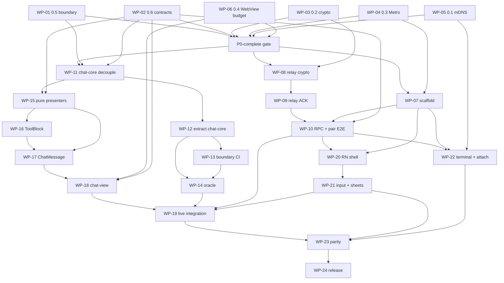

# Flutter → Expo Mobile Migration Plan

Status: **executable plan — re-scoped 2026-09-04 (evening)**. Supersedes `docs/draft/flutter-to-expo-migration.md`. WP-01–22 are software-complete; WP-23/24 are **superseded** by Wave 8 (WP-25–29): land on `main` first, bring the RN shell to product quality, widen chat-view tool coverage, then ship through a lean release. **Executing agents: read §1a, then Wave 8, then start WP-25.**
Last updated: 2026-09-04 (Wave 8 execution)
Sources: draft migration, monorepo inventory, validation, work-package catalog, adversarial review (ordering / extraction / protocol / delivery), v0.55.2 remote-parity freeze
Related: `apps/desktop/CLAUDE.md` (Remote Control), `apps/relay/`, `packages/shared`, external repo `super-one-flutter`, `docs/design/chat-core-contracts.md`, `docs/design/expo-release-runbook.md`

---

## 1. Status & decision

**Decision:** Replace the Flutter mobile client (`super-one-flutter`, ~25.5k LOC Dart) with an Expo/React Native app at `apps/mobile` (`@superone/mobile`) in this monorepo.

- **Chat** renders in a **single persistent WebView** driven by a React DOM bundle (`@superone/chat-view`).
- **Shell** (navigation, pairing, sheets, input, camera, file pickers, settings) is native React Native — full rewrite, no Flutter widget reuse.
- **Reduction** lives in pure TS (`@superone/chat-core`), extracted from desktop `applyEventToSession`.
- **Wire** lives in pure TS (`@superone/relay-client`): crypto, relay/LAN transport, remote RPC.
- **No production users** — no data migration, staged rollout, or rollback obligation.
- **Product scope:** Remote Control parity with **current desktop `main`** (0.61.0 at re-scope time; originally frozen at v0.55.2-alpha). The transcript follows `main` automatically because chat-core/chat-view *are* the desktop reducer and presenters; the RN shell must track `main` explicitly (all `PermissionRequest.requestKind` values, all `HarnessId`s for create/send). Not a desktop IDE clone — see `docs/design/chat-core-contracts.md` §1.

**Execution update (2026-09-04):** branch rebased onto `main`; WP-09 and WP-11–22 are software-complete, and WP-23's software preflight is complete. `@superone/chat-core` owns the full reducer graph and a generated six-scenario `remote.out` TS snapshot oracle; `@superone/chat-view` owns the shared presenters plus self-contained chat and xterm documents; relay-client's ACK/replay/reset, terminal isolation, inline/LAN/R2 upload, and authenticated download invariants are green. WP-19 covers buffer-first reconnect rehydrate, stale-epoch rejection, 33 ms paint batching, live interaction sheets, and bounded WebView crash recovery. The RN shell includes camera QR, encrypted MMKV, lists/settings/files, native composer, IME guard, mentions, attachments, received-file preview/share, editable new-session worktree selection, structured collaboration handoff confirmation, and an iPad master/detail layout at 768 px. Native widget media uses result-owned gallery cards and host-backed file retrieval; nested code-widget iframes remain deliberately deferred under R6. Signed iPhone/iPad simulator and Android 16 emulator Release builds launch with dark SystemUI/Safe Area handling, and the Android QR camera flow opens and closes cleanly. WP-24 now has repository-owned EAS profiles, remote build-number policy, app-version runtime compatibility, credential guards, and a release runbook; Expo project binding, physical acceptance, shipped builds, dogfood, and Flutter archive remain gated.

**Wave 8 execution update (2026-09-04):** WP-25 hygiene, logical commits, rebase, package tests, changed-Desktop verification, and workspace typecheck are complete on `feat/migrate-to-expo`; the final merge to `main` remains. WP-28 now shares the active Codex collaboration card, Claude/Codex plan rows, insight markdown rows, image/video generation rows, the Browser/WebMCP/download family, and the Device/Computer Use/screenshot family between Desktop and Expo. Desktop keeps only host actions and live-store adapters at the old paths. Browser and interactive-tool routing metadata is privacy-projected through the remote transcript; typed text, selectors, coordinates, refs, URLs, page-tool arguments, and app identifiers remain stripped. Sanitized offline recordings cover these families, and chat-view has 37 passing Playwright scenarios. Session/automation/config tool families remain next; mini-app iframes remain deferred.

### 1a. Re-scope decision (2026-09-04, evening)

**Decision reaffirmed: continue Expo. Do not resume Flutter.** Re-evaluated after a Flutter-vs-desktop gap audit (desktop `main` @ `24778af6`, Flutter @ 2026-06-20 + 13 uncommitted files):

| Layer | Desktop | Flutter | Coverage |
|---|---|---|---|
| `RemoteCommand` RPC methods | 49 | 49 (47 committed) | 100% |
| `TerminalEvent` | 7 | 7 | 100% |
| Mobile-bound `AgentEvent` types (73 total − 11 `SKIPPED_EVENTS`) | 62 | 28 | 45% |
| `AgentEvent` types added since 2026-06-20 | 21 | 0 | 0% |
| `HarnessId` drivable from mobile | 6 | 2 (`claude`, `codex`) | 33% |
| `PermissionRequest.requestKind` | 8 | 5 | 63% |
| Chat tool renderer families | ~28 | ~13 | ~46% |

The request path never drifted; the event and renderer paths drifted to under half in 2.5 months while `agent-types.ts` changed 206 times and the desktop chat renderer + reducer averaged 40–70 commits/week. That is reason 1 below, measured. In Expo the same 21 new event types are already handled because `@superone/chat-core` **is** the desktop reducer; the remaining gap is the RN shell and the specialised tool presenters, not the protocol.

**What "the migration looks unfinished" actually is:** the RN shell (`apps/mobile`, ~1.6k LOC of TSX inside ~3.1k LOC total) against Flutter's ~8k LOC of polished native shell. Raw session ids as titles, a raw permission-mode chip row and a hard-coded hex `StyleSheet` are the visible symptoms. The transcript inside the WebView is desktop's Tailwind + `@superone/ui` theme and is not the problem. This plan always said the shell is "rewrite, no reuse"; it has simply not been built to product quality yet.

**Cost acknowledged:** 81 desktop files changed (ToolBlock 1846→250 lines, ChatMessage 1156→137, reducer families moved to chat-core). Every future desktop chat change goes through the presenter/port boundary. That is a permanent but far smaller tax than Dart double-writing, and it means **the branch must land on `main` now**: it is rebased to `753264f3` with zero conflicts today, and that window closes within days at current churn.

**Re-scope summary**

| Track | WPs | What changes vs the previous plan |
|---|---|---|
| **T1 Land on `main`** | WP-25 | New. Blocks everything. Commit the 212 uncommitted files, keep binaries/generated bundles out of git, rebase, verify, merge. |
| **T2 Shell to product quality** | WP-26, WP-27 | Replaces the "device gate" framing of WP-20/21/23. Flutter `lib/*.dart` is the visual and behavioural reference. |
| **T3 chat-view tool coverage** | WP-28 | New. Port the specialised tool presenters mobile still lacks; mini-app iframes stay deferred. |
| **T4 Lean release** | WP-29 | Replaces WP-23/24 gates. No evidence manifest, no three-run perf gates, no 7-day dogfood. One physical smoke per platform, then TestFlight + APK. |

Estimate, single implementer: T1 2–3 days → T2 ~3 weeks ∥ T3 ~1 week → T4 3–4 days. **≈ 4.5–5 weeks total.**

### Why (priority order)

1. **Eliminate schema double-writing.** Flutter `agent_event.dart` + `session_state.dart` mirror `packages/shared` + desktop reducers; drift is runtime-only today.
2. **Decouple mobile from App Store latency** for protocol fixes (EAS Update for JS layer).
3. **Web-shaped content** (markdown, LaTeX, mermaid, widgets) belongs in a DOM renderer. Flutter already leaks into WebViews for mermaid/widgets.

> “More components can be reused” is **not** a load-bearing reason. React DOM does not run in RN; reuse only via WebView.

### Effort (staffed vs sequential)

| Mode | Calendar | Person-weeks |
|------|----------|--------------|
| **2-FTE** (relay/shell ∥ chat-core/presenters after P0) | **11–13 weeks** | ~18–22 |
| **1-FTE** (sequential critical path only) | **~18–22 weeks** | ~18–22 |

Draft §7 “9–12 weeks single-implementer” is **rejected** as under-scoped. Calendar below assumes optional 2-FTE; single-FTE use the longer range.

**Remaining after the 2026-09-04 evening re-scope:** ~4.5–5 weeks single-FTE — see §1a and Wave 8. The 18–22 week figure above is history, not a forecast.

### Branch base

`feat/migrate-to-expo` — merged tag `v0.55.2-alpha` (2026-08-21). All package work lands here; desktop adapterization may use short-lived sub-branches (esp. ToolBlock, R8). Extract chat-core / chat-view from this snapshot so v0.55.2 transcript chrome (sandbox chip, error badge, Task diagnostic, `@native/*` galleries) comes along for free.

---

## 2. Target architecture

### 2.1 Package layout

```
apps/
  mobile/                  @superone/mobile — Expo dev-client app (RN shell)
  desktop/                 imports presenters back from packages/chat-view (adapter shells stay at existing paths)
packages/
  relay-client/            crypto, relay/LAN transport, remote RPC (pure TS; no node:crypto)
  chat-core/               applyEventToSession + contracts (pure TS)
  chat-view/               React DOM chat renderer + WebView host protocol (Vite asset)
  shared/                  unchanged (agent-types, event-seq-utils, agent-event-batcher, content-delta, tool-ui)
```

**Not created for this cycle:** extraction of `ChatInput` / composer stack into chat-view.

### 2.2 State ownership (single SOT)

| Owner | Owns | Does not own |
|-------|------|----------------|
| **RN shell** | Full session state via chat-core; `ChatInteractionState` sheets; `SessionUiState`; pairings; viewState persistence; applyEvents **batching**; transport | Transcript paint |
| **WebView (chat-view)** | View state only: scroll anchor, expand/collapse, selection; DOM window | Independent transcript reduction |
| **chat-core** | Pure reduce: `ChatCoreSession` → `ChatCorePatch` | Zustand, window, IPC, RN |

**One owner of chat state:** RN runs `@superone/chat-core` and pushes **reduction patches** into the WebView. The WebView **never** re-runs the reducer.

### 2.3 Three state contracts + patch model

Contracts are **projections** of the full reducer write-set, not the 34 statically-read `session.*` fields alone.

#### `ChatCoreSession` / `ChatCorePatch` (WP-02 freeze)

- **`ChatCoreSession`**: union of all fields family reducers **read** on `PerSessionState` (see `apps/desktop/src/renderer/src/stores/chat-store/types.ts`).
- **`ChatCorePatch`**: exhaustive key set of all fields family reducers **write** (Partial merge target). Generated from family write-points in:
  - `event-reducer/lifecycle.ts`, `content.ts`, `tool.ts`, `permission.ts`, `question-plan.ts`, `slash.ts`, `codex.ts`, `usage.ts`, `message-complete.ts`, `todos.ts`, ACP inline cases in `event-reducer/index.ts`.
- **Signature (post-extract):**
  `applyEventToSession(session: ChatCoreSession, event: AgentEvent, ports?: ChatCorePorts) → ChatCorePatch`
- Desktop `event-slice` continues to merge patches structurally; production cutover to package only when **remote-relevant families are complete** (see §6 WP-12 narrow rule).

#### Projections (consumer split)

| Contract | Keys (minimum; expand to full write-set in WP-02) | Consumer |
|----------|-----------------------------------------------------|----------|
| **ChatReductionState** | `messages`, `queuedMessages`, `status`, `awaitingAssistantReply`, `lastEventAt`, `streamingTokens`, context/cost, `taskProgress`/`subagentTokens`, todos + bookkeeping, `_streamingToolInputPreviews` (nullable on remote), `browserDownloads`, `videoGenStatuses`, compact/slash bookkeeping, `promptSuggestion`, `session` (as needed for labels), `apiRetry`/`isCompacting`/… from write-set | **WebView** (plus derived labels from SessionUi) |
| **ChatInteractionState** | `pendingPermissions`, `pendingQuestion`, `pendingPlanApproval`, `planApprovalOutcome`, related permissionMode clears on resolve | **RN native sheets** |
| **SessionUiState** | `sessionProvider`, `preferredProvider`, `acpAgentId`, `acpModels`, `acpModes`, `*Status`, `selected*`, `modelUserChosen`, provider/model catalog | **RN shell**; WebView gets **derived labels only** |

**key → owner table (mandatory WP-02 deliverable):** every `ChatCorePatch` key maps to RN full-state apply vs WebView projection. RN always applies the full patch; WebView receives only Reduction + labels.

**Remote-omitted families:** desktop `SKIPPED_EVENTS` in `remote-control-service.ts` (e.g. `tool_input_delta`, `subagent_usage`, hook events) never appear on mobile remote path. `_streamingToolInputPreviews` may be empty on mobile; desktop oracle covers Maps/preview separately.

#### Ports vs pure moves (corrected)

| Symbol | Classification | Action |
|--------|----------------|--------|
| `persistStreamingToolInput`, `markMessageEventApplied` | **Pure transformers** | **Move** into chat-core (not “side-effect ports”) |
| `DEFAULT_PROVIDER` | Constant | Move into chat-core types/constants |
| `extractPartialToolInput` / media tool predicates | Pure helpers (today under `@/components`) | Relocate out of components; chat-core depends on pure modules |
| `window.app.trace`, `Date.now` id/time stamps | Real impurity | **Injected ports** (trace, clock) |
| Module-level streaming Maps (`event-reducer/shared.ts`) | Impure global | Port-owned session-scoped side state **or** fold into state **with** stable test API (prefer port/testable API over silent fold) |

### 2.4 Host protocol (RN ↔ WebView)

Naming rule: WebView never re-reduces. Prefer **`applyReductionPatch`** (or document `applyEvents` as “pre-reduced patches only”).

**Inbound (RN → WebView):**

| Message | Role |
|---------|------|
| `initialize` / `hydrate` / `reset` / `prependHistory` | Lifecycle |
| **`applyReductionPatch(batch)`** | RN-owned batching: ≤1 envelope per ~33 ms; payload is reduction patches, not raw AgentEvents for dual SOT |
| `setConnection({ state, epoch })` | Degrade stream; **epoch bumps at buffer release** after reconnect |
| `setTheme` / `setViewport({ safeArea, fontScale, locale })` | No independent derivation in WebView (R11) |
| `setWindow(range)` | Mandatory DOM windowing (R2) |
| `scrollToTurn` | Jump |
| `nativeActionResult` / `nativeActionProgress` | Async host replies |

**Outbound (WebView → RN):**

| Message | Role |
|---------|------|
| `requestNative` | openFile, showInFolder, openLink, sheets, share, progressive bash read, … |
| `viewState(patch)` | Scroll anchor + expand keys — **persisted on RN** (R10) |
| `ready` / `error(fatal)` | White-screen recovery: reload + hydrate (R2) |

**UI chrome:** WebView owns full-screen scroll; header + input are **RN overlays**. Never nest WebView inside RN ScrollView. Input is **native `TextInput` only** (no `<textarea>` in WebView).

**Terminal:** separate channel + **separate WebView** (memory isolation; terminal frames never enter event ACK/dedup).

### 2.5 Reconnect & dual-transport (protocol freeze)

#### Buffer-first session restore (open **and** reconnect)

Single RN order (do **not** copy Flutter open-path race at `chat_page.dart:2278+`):

```
startBuffering
  → (on transport reconnect / type=reset: clear local seq as required)
  → subscribe_session
  → load_session_messages (history)
  → get_session_state (snapshot)
  → ordered release of buffered type=event frames (live + replayed)
  → bump setConnection.epoch at release boundary
```

All `type=event` frames (including relay **replay** forwards) enqueue until history+snapshot complete. Desktop exposes separate RPCs only — **client-owned** composition.

#### Dual transport

Desktop may dual-broadcast ciphertext on open LAN + relay (`remote-control-service.ts` send path) with **independent** LAN seq vs relay seq.

**Client rules (hard):**

1. Exactly **one active event transport** at a time (race-winner or prefer-LAN).
2. Isolate `_processedSeqs` / `lastAckedSeq` **per transport**.
3. Never send a **relay** ACK with a **LAN** seq (and vice versa).
4. LAN has **no** DO-style replay/forcedDrop/ACK GC — LAN reconnect = full session rehydrate, not `fromSeq` replay.
5. Regression test: dual-socket delivery of same ciphertext must **not** double-apply into reduction.

#### Relay client ACK invariants (port from Flutter `relay_client.dart`)

- `_processedSeqs.add(seq)` **before** decrypt.
- ACK even when decrypt fails.
- `_processedSeqs` bounded (trim ~2048).
- Cumulative ACK of max contiguous seq.
- Envelope `seq` is ACK/replay only — **never** write onto `AgentEvent.seq`.
- Server `forcedDropSeq`: client reacts to frame `type: 'reset'` only (do not invent client-side forcedDropSeq).
- Offline devices stay pending never ACKed — **server oracle** (`apps/relay`); client must still ACK when online after process.
- `desktop_shutdown` clears local seq; does not invent forcedDropSeq.
- Terminal frames: **no** seq ACK path.

### 2.6 Extraction rule (chat-view)

1. **Adapterize in place** (pure presenter + host port with desktop default adapter).
2. Desktop keeps **adapter shells** at existing import paths (`ToolBlock`, `ChatMessage`, …) so suite stays green.
3. Move pure presenters into `packages/chat-view` only after ports exist.
4. **Out of scope for chat-view:** `ChatInput`, `ChatPanel`, `MentionPopup`, model-selector, `ChatStatusBar`, permission/question/plan composer stack (RN reimplements).

### 2.7 Adapterize priority (evidence-based)

1. Pure helpers: `tool-display`, `tool-block-utils`, `media-generation`, `compact-chat-mode`, `getAssistantCopyText`, `groupContent`
2. Thin presenters: `ReasoningBlock`, `TerminalCommandOutput`, `CollapsibleOutput`, `ToolGroup`
3. `CopyableMarkdown` + `CodeBlock` (setTimeout 33ms throttle; `useIsCodeFenceIncomplete`) + markdown host ports
4. **ToolBlock** family-by-family (R8 critical path)
5. `ChatMessage` + DurationFooter ports
6. `CodexTurnView` / codex-item-renderer
7. Defer mini-app iframe tools (`StandaloneToolBlock` / `WidgetBlock` / `ToolRendererFrame`) or `requestNative` no-op (R6)

---

## 3. Evidence snapshot

Inventory + validation outcomes (code paths preferred over draft-only numbers).

| ID | Verdict | Finding |
|----|---------|---------|
| **C0.1** | **fallback_accepted** (2026-08-21) | Relay + manual host:port. Plist keys stamped on `apps/mobile` for a later WP-22 retry. Notes: `docs/design/expo-p0-spikes.md`. **Do not block P2 pairing on mDNS.** |
| **C0.2** | **spike_done** (2026-08-21) | Vectors in `docs/design/relay-crypto-golden/`. Unmodified desktop ciphertext decrypts on Flutter 1.0.0+19 and `@noble/ciphers@2.3.0`. Library for WP-08: noble (not quick-crypto). Zero edits under frozen crypto trees. |
| **C0.5** | **spike_done** (2026-08-14) | `../index` inverted: three symbols live in `event-reducer/transformers.ts` (barrel re-exports). Lifecycle family has no `@/components` / `window` / Maps. Remaining: component predicates, `window.app.trace`, module Maps, `Date.now`, `defaults`↔`index` cycle. Notes: `docs/design/chat-core-extraction-spike.md`. No package cutover. |
| **C0.6** | **freeze_done** (2026-08-21) | Exhaustive `ChatCorePatch` + key→owner + `SKIPPED_EVENTS` + host table + dual-transport in `docs/design/chat-core-contracts.md`. Baseline v0.55.2 (`messages_retracted`; `model_fallback` is a transcript row, not a patch key). |
| **C-seq** | confirmed | Never conflate relay envelope seq with `AgentEvent.seq` (relay-session enqueue; session `nextEventSeq`; Flutter never stamps seq on events). |
| **C-reconnect** | partial | Flutter reconnect buffer-first at `chat_page.dart:485-513`; open path races — **normalize buffer-first**. |
| **C-batch** | confirmed | Desktop paragraph-coalesces mobile text (`\n\n` or ≥1000 chars). RN→WebView ≤1/33ms is **new** host design. Shared `AGENT_EVENT_BATCH_MS = 33`. |
| **C-adapter** | partial | ToolBlock multi-store + IPC (`showInFolder`, bash read, `findLineNumber`); no host-port layer yet. Expand is local `useState` only (R10). |
| **C-oracle** | confirmed | Flutter `recorded_catalog_test` has **zero `expect()`**; incomplete barrel. Not a reduction oracle. |
| **C-packages** | **complete** (2026-09-04) | `apps/mobile`, `packages/relay-client`, `packages/chat-core`, and `packages/chat-view` exist; chat-core is the production reducer owner and Desktop reimports it. |
| **C-non-goals** | confirmed | Phase 2 zero-diff under `apps/desktop/src/main/remote/` and `apps/relay/`. |
| **C-isComposing** | **refuted** | No `isComposing` in Flutter. Implement RN IME guard from **desktop** product requirements (`ChatInput` semantics), not Flutter port. |
| **C-forcedDrop** | confirmed | Server reset when `fromSeq <= forcedDropSeq`; offline pending never ACKed; client handles `type: reset`. |
| **C-purity-ports** | partial | Pure transformers ≠ ports; only trace/clock (and real I/O) are ports. |

### Must-do-before-code (P0 gates)

- **0.5** chat-core boundary proof + compile-time boundary sketch — **done** (`docs/design/chat-core-extraction-spike.md`)
- **0.6** freeze contracts + host protocol + dual-transport + buffer-first — **done** (`docs/design/chat-core-contracts.md`)
- **0.2** golden AES-GCM/HKDF (+ chunked file) vectors — **done** (`docs/design/relay-crypto-golden/`)
- **0.3** Metro `@superone/shared` under bun hoisted workspaces — **done** (`apps/mobile/metro.config.js` + `scripts/assert-shared-resolution.ts`)
- **0.1** mDNS attempt or formal fallback accept (non-blocking for P2) — **fallback accepted** (`docs/design/expo-p0-spikes.md`)
- **0.4** WebView RSS/frame + stress corpus owner — **done** (fail-closed window in `apps/mobile/src/chat-window.ts`; RSS on device at WP-18)

Keep `super-one-flutter` readable through P7 as behavioural reference (ACK path, attachment transports, visual catalog).

---

## 4. Hard constraints & non-goals

### Hard constraints

1. Input stays **native RN TextInput** with IME composition guard from **desktop** product requirements (not Flutter).
2. WebView owns full-screen scroll; header/input RN overlays; **never** nest WebView in RN ScrollView.
3. **DOM windowing mandatory** from day one (R2), not an optimisation.
4. **Never** write relay envelope seq into individual events; envelope seq = ACK/replay; `AgentEvent.seq` separate.
5. RN owns patch batching: **≤1 envelope per ~33 ms** into WebView.
6. Reconnect/open: **buffer-first** subscribe → history → snapshot → release; epoch at release.
7. **No forked reducer.** Narrow family allowed only for spike/decouple proof; production desktop reimport + mobile cutover require **single** full remote-relevant `applyEventToSession`.
8. **Adapterize before move.** No package move until store/IPC behind ports; desktop adapter shells remain at existing paths.
9. `chat-core` must not import `../index`, Zustand, `@/components`, or `window` (compile-time boundary test).
10. Contracts include full **write-set**, not read-set-only; exhaustive `ChatCorePatch` + key→owner.
11. relay-client: processedSeqs before decrypt; ACK on decrypt fail; bound set; exclusive transport; reset on server `reset` only.
12. **Phase 2 zero changes** under `apps/desktop/src/main/remote/` and `apps/relay/` — failing this is a design error, not a licence to edit.
13. chat-view streaming paint: **setTimeout**, never rAF; stamp `--brand-hue` at bundle entry.
14. View state (scroll, expand) persists on **RN** across DOM-window unmount.
15. Pure transformers = **move**; only real I/O/impurities = **ports**.
16. Dual-transport: single active event transport; per-transport seq/ACK namespaces.
17. **Reducer and presenter fixes that land on `main` belong in `packages/chat-core` / `packages/chat-view`.** Desktop `event-reducer/*` and chat component files at the old paths are re-export shims and adapters only; a rebase that re-applies a `main` fix into a shim is wrong. (Template: `24778af6` touched `event-reducer/lifecycle.ts`, `message-complete.ts`, `shared.ts` — re-apply inside chat-core and add its test to the chat-core suite.)
18. **Generated WebView documents are build artifacts, never committed.** `packages/chat-view/src/generated-host-html.ts` (6 MB) and `generated-terminal-html.ts` are produced by `bun --filter @superone/chat-view build`; mobile `dev` / `test` / `typecheck` run that build first and fail with a clear message if the artifact is missing.
19. **No binary release evidence in git.** Screenshots/videos go under gitignored `docs/temp/`; only Markdown reports are tracked.

### Non-goals

- Desktop renderer changes beyond adapterization with green tests (path shims allowed).
- **(re-scope)** Physical-device evidence manifest, three-run performance gates, `verify:device` / `release:preflight` fail-closed scripts, and a 7-day dogfood window — cut in WP-29.
- **(re-scope)** Mini-app iframes inside the chat WebView (R6) — still deferred; the `PortableTool` generic row is the fallback for those tools only.
- `apps/cli` or `apps/relay` changes for mobile Phase 2 (relay freeze).
- Expo Go compatibility (dev client required).
- Android foldables/tablets this cycle.
- Extraction of ChatInput / interactive composer containers into chat-view.
- Forked reducer; half-package production cutover.
- Data migration / staged rollout / rollback plans.
- Finer-grained streaming vs paragraph-chunked text (desktop already coalesces; § out of scope).
- Replacing desktop-side relay host code with relay-client this cycle (package is standalone for either later).
- Desktop-only surfaces as of v0.55.2: DeepSeek in-process runtime / trajectory / plugin host, Computer Use workspace, agent-browser PiP, CDP perf, Liquid Glass, `.ipynb` preview, custom-provider settings UI. Expo renders remote `AgentEvent`s from those harnesses; it does not host them.

---

## 5. Phase-0 de-risk checklist

| Spike | Unknown | Verification | Fallback | Verdict now |
|-------|---------|--------------|----------|-------------|
| **0.1** | mDNS (`nsd` → `react-native-zeroconf`) | Discover `dev:cli:lab` / desktop `_superone._tcp` on iOS+Android hardware; config plugin + `NSBonjourServices` | Relay-only + manual host:port | **fallback_accepted** — P2 is QR/relay |
| **0.2** | AES-256-GCM + HKDF wire parity | Golden vectors desktop↔Dart; `@noble/ciphers` (+ hashes) decode unmodified desktop frames | `react-native-quick-crypto` | **spike_done** — noble 2.3.0; fallback unused |
| **0.3** | Metro + bun hoisted workspaces | `resolver.unstable_enableSymlinks` + `watchFolders`; import `@superone/shared` leaf | Explicit per-package alias map | **spike_done** — `apps/mobile/metro.config.js`; leaf-only rule |
| **0.4** | WebView streaming perf + RSS | Stress corpus (≥200 turns code+mermaid) + longest recording; sample paint intervals; RSS | Coarser DOM window; tighter RN envelope | **spike_done** — fail-closed window locked; device RSS at WP-18 |
| **0.5** | chat-core cut | Invert `../index` + relocate component predicates + ports for clock/trace/Maps; no slice drag | Narrow **first family for proof only**; never fork production | **spike_done** — `../index` gone; remaining impurities in spike notes (WP-11) |
| **0.6** | Host protocol + contracts | Freeze ChatCoreSession/Patch, three projections, dual-transport, buffer-first, `applyReductionPatch` | — | **freeze_done** — `docs/design/chat-core-contracts.md` |

**P0 exit:** **complete 2026-08-21.** 0.1 fallback; 0.2 golden+noble; 0.3 Metro config + shared leaf proof; 0.4 fail-closed window; 0.5/0.6 chat-core freeze. Companion: `docs/design/expo-p0-spikes.md`.
**Gate:** WP-07 / WP-08 / WP-11 / WP-15 may start. Device RSS remains a WP-18 measurement against the locked window.

---

## 6. Work package catalog

**Package count: 24** (WP-01 … WP-24)

Gate wording: **zero test path edits** — allow shim re-exports and import path updates; forbid empty assertions or behavior-changing rewrites to force green.

### Wave 0 — P0 de-risk

#### WP-01 — Spike 0.5: chat-core extraction boundary

| | |
|--|--|
| **Phase / risk / estimate** | P0 / high / 2–3 days |
| **depends_on** | — |
| **parallel_ok_with** | WP-02, WP-03, WP-04, WP-05, WP-06 |
| **Goal** | Prove `applyEventToSession` (~1.9k LOC event-reducer) can drop `../index`, `@/components`, `window`, and module-level streaming Maps without dragging slices/Zustand. |
| **Exit** | **done 2026-08-14** — port map in `docs/design/chat-core-extraction-spike.md`; lifecycle family clean of `../index` / `@/components` / `window` / Maps; no narrow fallback; no production cutover |
| **Tests** | Ad-hoc compile of inverted family; no production cutover |
| **Scope** | `apps/desktop/.../chat-store/event-reducer/`, `index.ts`, `helpers/codex-helpers.ts`, `components/chat/tool-display.ts`, `media-generation.ts` |

**Narrow fallback rule:** Full family set remains owned by a **single** `applyEventToSession`. Spike/WP-11 may decouple a subset; **desktop reimport + WP-19 mobile production path wait until remote-relevant families are complete.** Spike proof ≠ half-package ship.

#### WP-02 — Spike 0.6: freeze host protocol + contracts

| | |
|--|--|
| **Phase / risk / estimate** | P0 / medium / 2 days |
| **depends_on** | — |
| **parallel_ok_with** | WP-01, WP-03–06 |
| **Goal** | Freeze `ChatCoreSession` / exhaustive `ChatCorePatch` / three projections / key→owner; host table; dual-transport; buffer-first open+reconnect; `applyReductionPatch` naming. |
| **Exit** | **done 2026-08-21** — `docs/design/chat-core-contracts.md`: exhaustive patch keys from all families on v0.55.2; read union; key→owner; `SKIPPED_EVENTS`; dual-transport + reconnect; host table; Remote Control vs desktop-only split |
| **Tests** | Contract fixtures as markdown/TS types sketch (implementation later) |
| **Scope** | `chat-store/types.ts`, event-reducer, `remote-control-service.ts` (read-only), `packages/shared/src/agent-types.ts` |

#### WP-03 — Spike 0.2: AES-256-GCM + HKDF golden vectors

| | |
|--|--|
| **Phase / risk / estimate** | P0 / high / 2–3 days |
| **depends_on** | — |
| **parallel_ok_with** | WP-01–02, WP-04–06 |
| **Goal** | Capture desktop↔Dart golden vectors for payload + chunked file envelopes; prove @noble (or quick-crypto) decode with **zero** edits under frozen trees. |
| **Exit** | **done 2026-08-21** — `docs/design/relay-crypto-golden/`; desktop golden test; Flutter + `@noble/ciphers@2.3.0` decrypt unmodified frames; WP-08 library = noble |
| **Tests** | `remote-control-crypto.golden.test.ts` |
| **Scope** | `remote-control-crypto.ts` (read-only), Flutter `crypto.dart` (read-only), tests |

#### WP-04 — Spike 0.3: Metro resolves `@superone/shared`

| | |
|--|--|
| **Phase / risk / estimate** | P0 / medium / 1–2 days |
| **depends_on** | — |
| **parallel_ok_with** | WP-01–03, WP-05–06 |
| **Goal** | Metro under bun hoisted workspaces resolves shared source exports. |
| **Exit** | **done 2026-08-21** — `apps/mobile` imports `@superone/shared/agent-event-batcher` + `agent-types`; Metro enables package exports + blocks Node leaves; alias fallback in `docs/design/expo-p0-spikes.md` |
| **Tests** | `apps/mobile/scripts/assert-shared-resolution.ts` |
| **Scope** | `apps/mobile/metro.config.js`, `packages/shared/package.json` (read-only) |

#### WP-05 — Spike 0.1: mDNS on device

| | |
|--|--|
| **Phase / risk / estimate** | P0 / medium / 1–2 days |
| **depends_on** | — |
| **parallel_ok_with** | WP-01–04, WP-06 |
| **Goal** | Attempt zeroconf discovery of `_superone._tcp`; or accept relay-only fallback. |
| **Exit** | **done 2026-08-21** — formal fallback accept (QR/relay + optional host:port). `NSBonjourServices` / local-network strings stamped on `app.json` for WP-22. |
| **Tests** | n/a (no hardware this spike) |
| **Scope** | `lan-advertiser.ts` (read-only), Flutter `lan_discovery.dart` (read-only), `apps/mobile/app.json` |

#### WP-06 — Spike 0.4: WebView streaming + RSS budget

| | |
|--|--|
| **Phase / risk / estimate** | P0 / high / 2 days |
| **depends_on** | — |
| **parallel_ok_with** | WP-01–05 |
| **Goal** | Stress corpus + longest recording; measure frame p95 + peak RSS with mandatory windowing; fail-closed gates. |
| **Exit** | **done 2026-08-21** — corpus owned (`show-widget` / `claude-todos` / `mermaid-latex`); window 24/8/40; `error(fatal)` reload+hydrate. Device RSS/p95 measured at WP-18 against these sizes (fail-closed, do not relax). |
| **Tests** | `apps/mobile/src/chat-window.test.ts` |
| **Scope** | recordings, `CopyableMarkdown.tsx` (read-only), `apps/mobile/src/chat-window.ts` |

---

### Wave 1 — Scaffold

#### WP-07 — Scaffold `apps/mobile` + Expo tooling

| | |
|--|--|
| **Phase / risk / estimate** | P1 / medium / 3 days |
| **depends_on** | WP-04; **P0-complete** for 0.1–0.6 recorded (0.1 may be fallback) |
| **parallel_ok_with** | — (after P0) |
| **Goal** | Expo dev-client boots iOS+Android; imports `@superone/shared`; root scripts; `packages/tsconfig/react-native.json`; `apps/mobile/CLAUDE.md` runtime map (RN / chat WebView / terminal WebView). Enable `ios.supportsTablet: true`, `requireFullScreen: false` early. |
| **Exit** | **scaffold 2026-08-21** — Expo SDK 54 dev-client app at `apps/mobile`; `dev:mobile`; iPad flags; CLAUDE.md runtime map. First hardware `expo run:ios/android` is remaining (CNG, ios/android gitignored). |
| **Tests** | `assert-shared-resolution.ts`; `tsc` path |
| **Scope** | `apps/mobile/`, `packages/tsconfig/react-native.json`, root `package.json`, root `CLAUDE.md` |

---

### Wave 2 — Relay crypto + chat-core decouple (+ presenters after WP-11)

#### WP-08 — packages/relay-client: crypto + golden tests

| | |
|--|--|
| **Phase / risk / estimate** | P2 / high / 2–3 days |
| **depends_on** | WP-03; P0-complete |
| **parallel_ok_with** | WP-11 (after both free of shared files) |
| **Goal** | Pure-TS crypto: HKDF + AES-GCM + chunked file; no `@superone/runtime` crypto; zero-diff frozen trees. |
| **Exit** | **done 2026-08-21** — `@superone/relay-client` decrypts WP-03 golden frames with `@noble/ciphers@2.3.0`; no `@superone/runtime`; frozen trees untouched. ACK/RPC is WP-09/10. |
| **Tests** | `bun --filter @superone/relay-client test` |
| **Scope** | `packages/relay-client/` |

#### WP-11 — P3a: chat-core decoupling inside desktop

| | |
|--|--|
| **Phase / risk / estimate** | P3a / high / 1–1.5 weeks |
| **depends_on** | WP-01, WP-02; P0-complete |
| **parallel_ok_with** | WP-08 |
| **Goal** | Invert 3 `../index` imports; **WP-11 sole writer** for reducer-used `tool-display` / `media-generation` predicates; inject clock/trace; streaming Maps via ports; break `defaults.ts`↔`index` cycle; extract provider/model/ACP settings reducer; define contracts per WP-02; split pure codex helpers (`upsertCodexItem`, token helpers, …) from store-bound helpers. |
| **Exit** | **done 2026-09-04** — reducer implementation moved behind typed ports and is free of `../index`, `@/components`, `window`, Zustand, and module-global Maps; Desktop keeps only compatibility shims plus the trace adapter; reducer tests and Desktop regression suite green |
| **Tests** | Existing event-reducer `*.test.ts`; zero test path edits target |
| **Scope** | event-reducer, types, defaults, index, codex-helpers, tool-display, media-generation |

#### WP-15 — P4a-1: pure presenters adapterize in place

| | |
|--|--|
| **Phase / risk / estimate** | P4a / medium / 3–4 days |
| **depends_on** | **WP-11**, WP-02 |
| **parallel_ok_with** | WP-09, WP-12 (after those start) — **not** WP-11 |
| **Goal** | Adapterize pure presenters **without** re-homing WP-11-owned predicate exports: tool-block-utils, compact-chat-mode, getAssistantCopyText, groupContent extract, ReasoningBlock, TerminalCommandOutput, CollapsibleOutput, ToolGroup. Consume ports from WP-11. |
| **Exit** | **done 2026-09-04** — pure presenter implementations live behind stable Desktop shims; ToolGroup rendering, compact-mode classification, and content grouping use injected ports; presenter boundary rejects Desktop aliases/stores/window/concrete ToolBlock imports; full suite green |
| **Tests** | Existing unit tests for tool-block-utils etc. |
| **Scope** | listed pure chat components (not parallel-edit of tool-display/media-generation exports) |

**Single-writer:** `tool-display.ts` + `media-generation.ts` predicate relocation = **WP-11 only**. WP-15 consumes.

---

### Wave 3 — Transport invariants + package extract + ToolBlock

#### WP-09 — packages/relay-client: ACK/replay/reset

| | |
|--|--|
| **Phase / risk / estimate** | P2 / high / 3–4 days |
| **depends_on** | WP-08 |
| **parallel_ok_with** | WP-12, WP-13, WP-15, WP-16 (true peers only) |
| **Goal** | WS frame handling + invariants; normalize decrypt payload array|object; ignore terminal for ACK; desktop_shutdown clears local seq. |
| **Exit** | **done 2026-09-04** — Flutter-semantic cumulative ACK/dedup, ACK-on-decrypt-failure, bounded processed seqs, reset resubscribe signal, array/object envelopes, terminal isolation, and zero-diff frozen trees |
| **Tests** | cumulative ACK; ACK-on-decrypt-fail; bounded `_processedSeqs`; reset→clearSeq+resubscribe signal; multi-event envelopes; mixed with/without `AgentEvent.seq`; decrypt Map|List; terminal ignored for ACK; no client forcedDropSeq invent |
| **Scope** | `packages/relay-client/` (read `relay-session.ts` / Flutter as oracle only) |

#### WP-12 — P3b: extract `@superone/chat-core` + desktop reimport

| | |
|--|--|
| **Phase / risk / estimate** | P3b / high / 3–4 days |
| **depends_on** | WP-11 |
| **parallel_ok_with** | WP-09, WP-16 (not WP-13) |
| **Goal** | Create package; move pure applyEventToSession + families + contracts; desktop re-exports so production path identical **only when remote-relevant families complete** (no half-package mobile cutover). |
| **Exit** | **done 2026-09-04** — Desktop imports the package through its existing reducer path; compatibility shims preserve family test paths; package depends only on pure shared leaves and contains no Zustand/window/Electron/renderer aliases; 200 reducer tests pass |
| **Tests** | Full desktop suite `bun run test` (or targeted event-reducer + integration) |
| **Scope** | `packages/chat-core/`, chat-store re-exports |

#### WP-13 — chat-core compile-time boundary gate

| | |
|--|--|
| **Phase / risk / estimate** | P3b / low / 1 day |
| **depends_on** | WP-12 |
| **parallel_ok_with** | WP-09, WP-16 |
| **Goal** | Permanent boundary test: no Zustand, `@/components`, `window`, Electron, `../index`. |
| **Exit** | **done 2026-09-04** — filesystem boundary gate scans every package source for Zustand, Electron, Desktop paths/aliases, parent imports, browser globals, and module-global Maps; package test and workspace typecheck pass |
| **Tests** | eslint/import restriction or vitest filesystem scan |
| **Scope** | `packages/chat-core/`, root scripts |

#### WP-16 — P4a-2: ToolBlock family adapterize

| | |
|--|--|
| **Phase / risk / estimate** | P4a / high / 1–1.5 weeks |
| **depends_on** | WP-15 |
| **parallel_ok_with** | WP-09, WP-12, WP-13 |
| **Goal** | ToolBlock (~2142 LOC) family-by-family pure presenter + host adapter; ports for bash I/O, FileChip, EditDiff, showInFolder, findLineNumber; desktop **adapter shell stays** at existing path; defer miniapp iframes. |
| **Exit** | **done 2026-09-04** — stable `ToolBlock` external API retained at the old path; pure presenter and family modules contain no Desktop aliases, stores, IPC, or Desktop-only mini-app renderers; Bash I/O, FileChip/diffs, showInFolder/findLineNumber, plan approval, and mini-app iframes are injected by the Desktop adapter; controlled expand behavior covers nested rows; Desktop suite green |
| **Tests** | ToolBlock unit/integration; PermissionPrompt still imports EditDiff/WriteDiff |
| **Scope** | `ToolBlock.tsx` + specializations, markdown host edges as needed |

---

### Wave 4a — P2 E2E + oracle + ChatMessage presenters (anti-chain)

#### WP-10 — packages/relay-client: RPC, pairing, buffer-first + mobile log E2E

| | |
|--|--|
| **Phase / risk / estimate** | P2 / high / 3–4 days |
| **depends_on** | WP-09, WP-07, **WP-02** |
| **parallel_ok_with** | WP-14, WP-17 **only** (not WP-20/WP-22) |
| **Goal** | RemoteCommand RPC typed from shared; QR pairing; **exclusive** dual-path transport; buffer-first open+reconnect; reset→rehydrate; mobile logs decrypted AgentEvents. |
| **Exit** | **implementation complete 2026-09-04; device gate pending** — encrypted QR handshake, typed RPC/chunks, buffer-first restore/reconnect, reset rehydrate, exclusive relay/LAN transport, safe development event-type logging, dual-delivery regression, and zero-diff frozen trees are complete; still run QR pair → decrypt → log on physical device |
| **Tests** | Device E2E log; unit dual-transport isolation; reconnect buffer unit |
| **Scope** | `packages/relay-client/`, `apps/mobile/` |

#### WP-14 — P3c: chat-core parity oracle (TS snapshots)

| | |
|--|--|
| **Phase / risk / estimate** | P3c / medium / 3–4 days |
| **depends_on** | WP-12, WP-13 (**and** full remote-relevant families if narrow fallback was used) |
| **parallel_ok_with** | WP-10, WP-17 |
| **Goal** | Real snapshot `expect()`; retarget export to TS; wire or drop bg-agent-history; clock fields excluded or ported; remote path notes no `tool_input_delta`. |
| **Exit** | **done 2026-09-04** — six tagged Desktop `remote.out` scenarios export deterministically to TS and assert reducer snapshots; synthetic coverage locks mixed-seq multi-event batches and Desktop-rebuilt text/thinking fields; remote fixtures assert the omitted-event matrix including no `tool_input_delta`; deterministic ports own clock/id fields; the empty-schema `bg-agent-history.db` is explicitly dropped rather than silently omitted |
| **Tests** | `packages/chat-core` snapshot suite |
| **Scope** | chat-core, desktop fixtures, export scripts, Flutter recorded (oracle input only) |

#### WP-17 — P4a-3: ChatMessage + Codex + markdown ports

| | |
|--|--|
| **Phase / risk / estimate** | P4a / high / 4–5 days |
| **depends_on** | WP-16, WP-15 |
| **parallel_ok_with** | WP-10, WP-14 |
| **Goal** | ChatMessage, CopyableMarkdown (setTimeout 33ms), CodeBlock, CodexTurnView, Subagent/Workflow, Mermaid theme props; desktop adapter shells retained. |
| **Exit** | **done 2026-09-04** — stable Desktop component paths retained; pure presenters have explicit host ports and no Desktop aliases, stores, Electron, or browser globals; the 33ms markdown throttle and Mermaid theme props are preserved; Codex plan approval remains a Desktop callback; Desktop suite (795 files / 9903 tests) and workspace typecheck pass |
| **Tests** | ChatMessage tests via default adapters |
| **Scope** | listed chat components |

---

### Wave 4b — chat-view bundle (after WP-17)

#### WP-18 — P4b: packages/chat-view WebView bundle + Playwright

| | |
|--|--|
| **Phase / risk / estimate** | P4b / high / 1–1.5 weeks (or prioritize subset if slip: tools + permission visual + mermaid/latex + scroll; residual → WP-23) |
| **depends_on** | WP-17, WP-06, WP-02 |
| **parallel_ok_with** | WP-20, WP-22 (after WP-10; no depends edge) |
| **Goal** | Package + Vite self-contained asset; stamp `--brand-hue`; mandatory DOM windowing (WP-06 sizes); Playwright ~26 scenarios (or prioritized subset); desktop imports presenters via adapter shells; **no ChatInput**. |
| **Exit** | **done 2026-09-04** — Vite emits one offline HTML document embedded by Mobile; the bundle stamps `--brand-hue`, enforces the locked 24/8/40 DOM window, and exposes the frozen host protocol without ChatInput. Desktop imports the package presenters through stable shims; the package boundary rejects Zustand, Electron, Desktop aliases, browser singleton state, and composer UI. |
| **Tests** | 28 Playwright scenarios pass with the browser forced offline (protocol, windowing, theme/viewport, Markdown, tools/permission visual, Mermaid, LaTeX, scroll, a 200-turn mixed corpus, and native routing from stripped tool metadata); 18 package tests, Desktop presenter regression, and workspace typecheck pass. Device RSS/frame measurement remains in WP-23 as allowed residual. |
| **Scope** | `packages/chat-view/`, theme.css, desktop re-exports |

---

### Wave 4c — shell + terminal (after WP-10)

#### WP-20 — P5a: RN shell pairing, nav, lists, storage

| | |
|--|--|
| **Phase / risk / estimate** | P5 / medium / 1–1.5 weeks |
| **depends_on** | WP-07, **WP-10** |
| **parallel_ok_with** | WP-22, WP-18 (if WP-10/17 done) |
| **Goal** | QR pairing, navigation, project/session lists, connection status, MMKV (pairings + viewState); file browser / git indicators / settings **mapped into exit** (or explicit cycle non-goals if cut). |
| **Exit** | **implementation complete 2026-09-04; device gate pending** — project/session lists, Git status, remote file browsing, provider/model and additional-directory settings use RPC; file rows reuse the signed/authenticated bounded download and native preview/share sheet, with POSIX, Windows drive, and UNC path handling; stable device ID, pairings, and viewState use AES-256 MMKV with a SecureStore-held key; runtime map updated; still run camera QR/navigation/storage restart/file-share checks on iPhone and Android hardware |
| **Tests** | Manual device; unit stores where cheap |
| **Scope** | `apps/mobile/` |

#### WP-22 — P6: Terminal WebView + attachments + LAN

| | |
|--|--|
| **Phase / risk / estimate** | P6 / medium / 1 week |
| **depends_on** | WP-07, **WP-10**, WP-05 |
| **parallel_ok_with** | WP-20, WP-18 |
| **Goal** | Separate terminal WebView (xterm.js; re-verify webgl patch); terminal **non-ACK** / isolated channel; attachment transports inline / LAN-PUT / relay-R2; PDF via images; LAN per 0.1; assert terminal flood does not block event ACK. |
| **Exit** | **done 2026-09-04** — a separate self-contained xterm.js WebView uses the patched WebGL renderer with canvas fallback and bidirectional input/resize/ready bridging; bounded snapshot assembly and a 3 MiB terminal flood prove the terminal channel never advances or blocks event ACK; project uploads cover inline ≤256 KiB, raw LAN PUT, and chunk-encrypted Relay R2 PUT+completion through 100 MiB; PDFs use the existing `ImageAttachment` message path through 20 MiB. Optional picker sizes are never the sole limit: native file size is checked before whole-file reads and exact decoded bytes enforce image/PDF caps. |
| **Tests** | Transport matrix unit; terminal non-ACK unit |
| **Scope** | mobile, relay-client, xterm patch |

---

### Wave 5 — Composer then live integration

#### WP-21 — P5b: RN input, IME, slash/mentions, sheets

| | |
|--|--|
| **Phase / risk / estimate** | P5 / medium / 1–1.5 weeks |
| **depends_on** | WP-20 |
| **parallel_ok_with** | — |
| **Goal** | Native composer; IME composition guard from **desktop** ChatInput semantics; slash, @mentions, attachments; sheets for permission/plan/question/worktree/add-dir/provider; **iPad anchors continuously** (R4), not only P7. |
| **Exit** | **software implementation complete 2026-09-04; device gate pending** — no WebView textarea; multiline RN composer has IME settle guard, slash and builtin/remote mention overlays, image/PDF selection, model/provider propagation, and permission/plan/question modals. New Claude sessions support local/current branch, existing worktrees, or branch/attach/detach creation with collision checks and optional dirty-change carry. Session create/open transitions are mutually exclusive around the single restore buffer; worktree validation happens before unsubscribe, and failures dispose the incomplete runtime instead of leaving stale detail state. User-triggered RPC and fire-and-forget command boundaries surface synchronous disconnect errors and rejected promises instead of leaking unhandled failures. Structured `session_agents_confirm` sheets identify one-way handoffs and return the validated launch form through the remote permission protocol. Full-screen modal presentation is iPad-safe. Physical-device IME, attachment, worktree, and sheet checks remain. Large-file transport is complete in WP-22. |
| **Tests** | IME composition unit where possible; sheet presentation smoke |
| **Scope** | `apps/mobile/` |

#### WP-19 — P4c: live RN↔WebView chat integration

| | |
|--|--|
| **Phase / risk / estimate** | P4c / high / 1 week |
| **depends_on** | WP-18, WP-14, WP-10, **WP-21** (hard — no stub-sheet path) |
| **parallel_ok_with** | — |
| **Goal** | chat-core on RN; `applyReductionPatch` ≤1/33ms (optional shared batcher); interaction sheets live; viewState on RN; `error(fatal)`→reload+hydrate; never nest WebView in ScrollView. |
| **Exit** | **software implementation complete 2026-09-04; device gate pending** — encrypted RelayClient→chat-core integration covers buffer-first initial restore and reconnect, mid-stream flap replay, multi-event batches, released-buffer epochs, and stale-epoch rejection. Network loss owns one bounded-backoff retry loop; an opened socket remains `reconnecting` until session restore releases the buffer, then publishes the runtime-owned epoch. Renderer reloads replay the current connection snapshot. RN paints at most once per 33 ms, routes live permission/plan/question events, persists view state, and reloads+hydrates after fatal/native WebView process failures with crash-loop bounds. WP-14 is deterministic and green. Still run the flap and white-screen recovery on physical iOS/Android devices. |
| **Tests** | Encrypted mid-stream flap; persistent retry/backoff + restore-boundary connection state; white-screen recovery; batching unit; physical device flap pending |
| **Scope** | mobile, chat-view, chat-core, relay-client, shared batcher |

---

### Wave 6 — Parity

#### WP-23 — P7: device parity + iPad multi-pane

> **Superseded 2026-09-04 (evening).** The software preflight stands. The physical-device evidence gate, the 8×6 visual catalog matrix and the three-run perf gates are **cut**. Remaining intent moves to WP-27 (shell parity) and WP-29 (one smoke per platform). Do not extend `expo-device-parity-checklist.md` or `expo-device-evidence.json`; WP-29 collapses/deletes them.

| | |
|--|--|
| **Phase / risk / estimate** | P7 / medium / 1 week |
| **depends_on** | WP-19, WP-21, WP-22 |
| **parallel_ok_with** | — |
| **Goal** | Recorded visual catalog vs Flutter screenshots; re-derive `stripContentBlock` exemptions; iPad multi-pane ≥md; performance budgets with WP-06 stress corpus. |
| **Exit** | **software preflight complete 2026-09-04; device gate pending** — the 768 px iPad master/detail boundary is unit-tested; remote tool-input exemptions are shared by production and the trace exporter; stripped file tools retain actionable summary/path metadata; native widget media has a result-owned gallery and host-backed preview; `shared_file` events reach a secure native receive/share inbox; the offline browser suite exercises a mixed 200-turn code/Mermaid corpus while holding the 24/40 DOM window; and `docs/design/expo-device-parity-checklist.md` records the exact visual, recovery, input, transport, and performance evidence required. Native Release runs exposed and closed stale-prebuild camera metadata, an invalid SecureStore key, mismatched dark SystemUI, and missing edge-to-edge insets. Normally signed iPhone/iPad simulator builds and an Android 16 emulator build now launch cleanly; Android QR permission/camera/cancel and portrait/landscape shell layouts are smoke-tested. Sign-off still requires physical iPhone, Android phone, and iPad measurements/screenshots. |
| **Tests** | 29 offline Playwright scenarios; Mobile 34; relay-client 58; signed iPhone/iPad simulator + Android 16 emulator Release launch; Android QR camera and rotation smoke; physical device catalog + RSS/frame/cold-start gates pending |
| **Scope** | mobile, chat-view |

---

### Wave 7 — Release

#### WP-24 — P8: EAS release, dogfood, Flutter archive

> **Superseded 2026-09-04 (evening)** by WP-29 (lean release). The EAS profiles and `assert-release-config.ts` are kept; the evidence-gated runbook, `verify:device`, `release:preflight`, the 7-day dogfood and the sign-off ceremony are cut.

| | |
|--|--|
| **Phase / risk / estimate** | P8 / low / 1 week |
| **depends_on** | WP-23 |
| **Goal** | EAS → TestFlight + internal APK; one week dogfood; archive Flutter read-only. |
| **Exit** | **repository preflight complete 2026-09-04; external/device gates pending** — app-local EAS profiles pin Bun, produce an installable internal Android APK, reserve production for store/TestFlight artifacts, auto-increment remote build numbers, and use app version as the update runtime boundary. Local credentials are ignored; a checked runbook and machine-readable evidence gate prevent project linking, submission, update publication, or Flutter archive before every physical-device action, platform-specific visual, performance threshold, severe-defect closure, and matching WP-23 Go sign-off are recorded. Still link the intended Expo project, configure `expo-updates` and signing, ship builds, dogfood ≥7 days, record notes, approve go/no-go, and archive Flutter read-only. |
| **Tests** | Release-config assertion in Mobile test; Expo public-config resolution; internal dogfood checklist pending |
| **Scope** | mobile, docs |

**R7 freeze protocol (re-scoped):** Flutter is frozen **now** (last commit 2026-06-20; its 13 uncommitted files stay uncommitted). No bug-fix SLA. Archive read-only at WP-29 exit.

---

### Wave 8 — Re-scope (2026-09-04 evening): land, shell, coverage, lean release

Order: **WP-25** (serial, first) → **WP-26 → WP-27** ∥ **WP-28** → **WP-29**. See §1a for the rationale.

#### WP-25 — T1: land `feat/migrate-to-expo` on `main`

| | |
|--|--|
| **Phase / risk / estimate** | T1 / high / 2–3 days |
| **depends_on** | — (first; blocks WP-26–29) |
| **parallel_ok_with** | — |
| **Goal** | Everything in the worktree (11 commits + 212 uncommitted files) is on `main`, verified, with no binaries or generated bundles tracked. |
| **Exit** | `main` contains `apps/mobile`, `packages/chat-core`, `packages/chat-view`, `packages/relay-client`; `git ls-files` shows no `docs/report/*.png|mp4` and no `generated-*-html.ts`; desktop `bunx vitest run --changed <merge-base>` green; the four package suites green; workspace typecheck green; root `CLAUDE.md` lists the new workspaces and scripts. |
| **Tests** | Desktop: `cd apps/desktop && bunx vitest run --changed main` — this *is* effectively the full suite because ToolBlock/ChatMessage/reducer moved, and it is the one sanctioned full run. Packages: `bun run test:chat-core`, `bun run test:relay-client`, `bun run test:mobile`, `bun --filter @superone/chat-view test`. `bun run test:relay` unchanged (zero-diff sanity). `bun run typecheck` — run outside the sandbox, or treat the `apps/web` `tsconfig.tsbuildinfo` EPERM as sandbox noise, not a type error. |
| **Scope** | worktree hygiene, git, root docs |

Steps, in order:

1. **Hygiene before any commit.**
   - Move `docs/report/*.png` / `*.mp4` (9.3 MB, 36 files) to `docs/temp/expo-validation-2026-09-04/` (gitignored). Keep `docs/report/expo-ios-validation-report.md`; add one line saying the evidence files are local-only.
   - Add `packages/chat-view/src/generated-host-html.ts` and `generated-terminal-html.ts` to `.gitignore`. Add a root script `build:chat-view` (`bun --filter @superone/chat-view build`) and make `apps/mobile` `dev` / `test` / `typecheck` depend on it (`pre*` scripts or an explicit first step). `host-html.ts` must throw a readable error if the generated module is absent instead of failing deep inside Metro.
   - Keep `apps/mobile/dist/`, `ios/`, `android/`, `credentials.json` ignored (they already are).
2. **Commit the uncommitted work as logical commits** (English, `<type>(<scope>): <description>`; do not squash into one). Suggested split: `refactor(chat): move reducer families into @superone/chat-core`; `refactor(chat): move presenters into @superone/chat-view behind desktop adapters`; `feat(relay-client): …`; `feat(mobile): …`; `feat(shared): remote tool-input allowlist`; `docs(mobile): …`. `bun.lock` and root `package.json` (react/react-dom devDependencies, `dev:mobile`, `test:*`, `build:chat-view`) go with the commit that needs them.
3. **Rebase onto `main`.** `main` is 2 commits ahead of the base (`24778af6`, `677ce5eb`). `24778af6` edits `event-reducer/lifecycle.ts`, `message-complete.ts`, `shared.ts` and `packages/shared/src/content-delta.ts`; the first three are now shims. Re-apply that fix inside `packages/chat-core/src/` (hard constraint 17) and carry its test into the chat-core suite. `content-delta.ts` merges normally. If `main` has moved further by the time this runs, apply the same rule to every reducer/presenter commit.
4. **Verify** per the Tests row. Fix; do not skip or narrow.
5. **Merge into `main`** (fast-forward after rebase; no merge commit needed). Update root `CLAUDE.md`: monorepo layout (`apps/mobile`, the three packages), commands (`dev:mobile`, `build:chat-view`, `test:chat-core`, `test:relay-client`, `test:mobile`), and a one-line pointer to `apps/mobile/CLAUDE.md`. Leave `docs/draft/flutter-to-expo-migration.md` in place (already marked superseded).
6. Do **not** delete the worktree or the branch; the user decides.

#### WP-26 — T2a: RN shell design system + navigation

| | |
|--|--|
| **Phase / risk / estimate** | T2 / medium / 1 week |
| **depends_on** | WP-25 |
| **parallel_ok_with** | WP-28 |
| **Goal** | Replace the ad-hoc shell with a token-driven design system and real navigation so every later screen inherits the look. |
| **Exit** | No raw hex colours in `apps/mobile/src/**/*.tsx`; `App.tsx` < 300 lines with screens under `src/screens/`; pairing, project list and session list visually match the Flutter reference and the desktop theme in dark **and** light; the chat and terminal WebViews receive `setTheme` from the same token module. |
| **Tests** | Unit for the token module (dark/light, per-harness hue); existing Mobile suite green; screenshot comparison against Flutter on the iPhone simulator for the three screens. |
| **Scope** | `apps/mobile/src/theme/`, `src/screens/`, `src/navigation/`, `src/ui/`, `App.tsx`; `styles.ts` deleted |

Deliverables:

- **Tokens** — `src/theme/tokens.ts` derived from `@superone/ui/styles/theme.css` semantics (background / surface / foreground / muted / border / status) plus **per-harness brand hue** via `@superone/shared/harness-brand`. Generate RN hex values from the OKLch source with a script (`packages/ui/scripts/` or `apps/mobile/scripts/`); never hand-copy. Dark and light; follow system appearance.
- **Navigation** — `expo-router` (preferred: file-based, dev-client compatible) or `@react-navigation/native-stack`. Screens: Pairings → Projects → Sessions → Chat, plus Terminal, Files, Settings pushed on phone and shown as detail panes on iPad (keep the 768 px master/detail rule and its unsubscribe semantics).
- **Header** — session title with the Flutter `animated_session_title.dart` behaviour (fills in as the title is generated), harness icon (reuse desktop harness icon assets; Flutter `provider_icon.dart`), connection status pill (Flutter `connection_status.dart`: connected / reconnecting / offline, using the restore-boundary semantics from WP-19).
- **Primitives** — Button, ListRow, SectionHeader, Sheet, Chip, Badge in `src/ui/`, built on the tokens. Icons via `lucide-react-native` to match desktop's lucide set.
- `setTheme` for both WebViews is emitted from the same token module (R11).

#### WP-27 — T2b: shell feature parity against the Flutter reference

| | |
|--|--|
| **Phase / risk / estimate** | T2 / medium / 2 weeks |
| **depends_on** | WP-26 |
| **parallel_ok_with** | WP-28 |
| **Goal** | Every Flutter shell file has an RN counterpart at equal or better quality, and the shell tracks current `main` (not v0.55.2) for permission kinds and harness ids. |
| **Exit** | Every row of the mapping table below is done or has an explicit non-goal line; all 8 `PermissionRequest.requestKind`s render a proper sheet; new-session and send work for all 6 `HarnessId`s per `HARNESS_CAPABILITIES`; iPad shows sheets as anchored popovers; Mobile suite green. |
| **Tests** | Unit for state modules (already the pattern in `apps/mobile/src/*-state.ts`); one simulator screenshot per sheet; Chinese Pinyin IME check on the simulator. |
| **Scope** | `apps/mobile/` |

Flutter reference → RN deliverable. Use `super-one-flutter/lib/` as the behavioural spec and `super-one-flutter/integration_test/` as the flow list.

| Flutter file | RN deliverable |
|---|---|
| `home_screen.dart`, `scanner_overlay.dart` | Pairings screen: pairing cards with online/offline state, rename/forget, QR scanner overlay with the 6-digit confirm code |
| `project_list_page.dart`, `git_indicators.dart` | Project rows with branch, ahead/behind, dirty counts, worktree badge |
| `session_list_page.dart`, `chat_drawer.dart` | Session rows with harness icon, model, status dot, relative time, tags; swipe to archive/delete; quick session switcher from the chat header |
| `chat_page.dart` composer region, `chat_input_dirs_hint.dart` | Permission mode as a **compact selector** (one control, not a chip row); additional-directories hint; attachment chips with remove; send/stop button state; queued-message row |
| `provider_overlay.dart` | Provider/model/effort picker driven by `SessionUiState`; hide effort for mapped providers (desktop rule) |
| `slash_command_overlay.dart`, `mention_overlay.dart`, `mention_controller.dart` | Polished slash and `@` overlays (keyboard-avoiding, sectioned, icons) |
| `permission_sheet.dart` | One sheet component covering **all 8** `requestKind`s — including `session_cleanup_confirm`, `automation_confirm`, `webmcp_trust_confirm` — with the same per-kind copy as desktop `PermissionPrompt` |
| `question_sheet.dart` | AskUserQuestion sheet: single/multi-select, "Other" free text; HTML previews rendered in the chat WebView |
| `plan_approval_sheet.dart`, `codex_plan_approval_sheet.dart` | Plan approval sheet (Claude + Codex); the plan block in the transcript comes from WP-28 |
| `worktree_sheet.dart`, `add_dir_overlay.dart` | State already implemented; bring the UI to reference quality |
| `todo_panel.dart` | Collapsible todo panel above the composer, fed from `ChatReductionState.todos` |
| `file_browser.dart`, `file_icon.dart`, `shared_file_view.dart` | File browser with icons, breadcrumb, preview; received-file inbox UI |
| `terminal_page.dart`, `terminal_controller.dart` | Terminal screen chrome: ownership claim, title, keyboard toolbar (Esc, Tab, arrows, Ctrl) |
| `chat_session_helpers.dart` `isRemoteHarnessSupported` | **Delete any `claude|codex`-only gate**; drive create/send for every `HarnessId` and read capabilities from `HARNESS_CAPABILITIES` |
| `animated_dots.dart` | Streaming indicator in the header |

Non-goals in this WP: mDNS discovery (keep QR/relay + manual host:port), Android tablets.

#### WP-28 — T3: chat-view tool family coverage

| | |
|--|--|
| **Phase / risk / estimate** | T3 / medium / 1 week |
| **depends_on** | WP-25 |
| **parallel_ok_with** | WP-26, WP-27 |
| **Goal** | Mobile renders the same tool families as desktop except mini-app iframes. `PortableTool` stays as the generic fallback, not the default experience. |
| **Exit** | Each family below has a presenter in `packages/chat-view/src/presenters/`, the desktop adapter shell at the old path, and one offline Playwright scenario from a recording; chat-view boundary test green; desktop suite green with zero test-path edits. |
| **Tests** | Playwright scenarios in `packages/chat-view/e2e/`; desktop component tests via default adapters (as WP-15–17). |
| **Scope** | `packages/chat-view/`, desktop adapter shells |

Port order (highest mobile value first). Same two-step rule as §2.6: adapterize in place on desktop, then move.

1. `CodexCollabBlock` (Flutter `codex_collab_block_view.dart` was 953 LOC — collaboration is what mobile users watch most)
2. Image / video generation: `ImageGenToolBlock`, `VideoGenToolBlock`, `ImageGalleryBlock`, `VideoGalleryBlock`, `CodexImageGenerationBlock` (Flutter `codex_image_gallery_view.dart`); reuse `PortableNativeGallery`
3. Plan blocks: Claude plan-mode rows (`PlanModeBlocks`) and the Codex plan block (Flutter `codex_plan_block_view.dart`)
4. Insight rows (`insight-markers`; Flutter `insight_block_view.dart`)
5. Browser: `BrowserToolBlock`, `BrowserPageToolsBlock` (WebMCP page-tool rows), `BrowserListDownloadsView`
6. Device / computer use: `DeviceToolBlock`, `ComputerUseToolBlock`, `ToolScreenshotView` (screenshots through the `previewFile` host action)
7. `SessionCollabToolBlock`, `ListAgentsToolBlock`, `ReportFindingsToolBlock`, `SessionArchiveToolBlock`, `AutomationToolBlock`, `ConfigToolBlock`, `MediaProvidersBlock`

Still deferred (R6): `StandaloneToolBlock`, the `WidgetBlock` iframe, `ToolRendererFrame`, mini-app surfaces. `widget_show` keeps the native gallery path from WP-23.

#### WP-29 — T4: lean release

| | |
|--|--|
| **Phase / risk / estimate** | T4 / low / 3–4 days |
| **depends_on** | WP-27, WP-28 |
| **parallel_ok_with** | — |
| **Goal** | Ship TestFlight + internal APK with the minimum evidence an internal tool needs. |
| **Exit** | TestFlight internal build and APK installed on the tester devices; `expo-updates` publishes one JS update successfully; `super-one-flutter` archived read-only; `apps/mobile/CLAUDE.md` no longer references the evidence gate. |
| **Tests** | The smoke list below, once per platform, recorded as a short Markdown note under `docs/temp/`. |
| **Scope** | `apps/mobile/`, `docs/design/expo-*`, Expo/EAS account |

**Cut** (delete, do not "keep but skip"): `apps/mobile/scripts/assert-device-evidence.ts`, `docs/design/expo-device-evidence.json`, the `verify:device` and `release:preflight` scripts, the three-run performance gate table, the 8×6 visual catalog matrix, the 7-day dogfood window, the tester/date/Go sign-off ceremony. Collapse `docs/design/expo-device-parity-checklist.md` to the smoke list below (~20 lines) and `docs/design/expo-release-runbook.md` to: link project → credentials → `eas build` → `eas submit` / share APK → `eas update`. Keep `assert-release-config.ts` (cheap, static).

**Keep — one physical iPhone + one physical Android, release-mode build:**

- Pair by scanning the desktop QR with the camera; relaunch restores the pairing.
- Open a session, send a prompt, watch it stream; stop mid-stream.
- Chinese Pinyin composition in the composer: Return never submits a partial composition.
- One permission sheet, one AskUserQuestion, one plan approval.
- Airplane mode for 10 s mid-stream; the transcript rehydrates once, no duplicates.
- Terminal: claim, run `pwd`, output renders.
- Attach one image; receive one shared file.
- iPad: rotate with a sheet open at ≥768 pt; master/detail holds.
- **RSS sanity, single run:** the 200-turn corpus stays under 250 MB; if not, tighten the 24/40 DOM window and re-run. This is the only number that gates.

**Do:** link the Expo project, upload credentials, configure `expo-updates` with app version as the runtime boundary (already in `eas.json`), `eas build --profile internal` (APK) and `--profile production` (TestFlight), distribute to internal testers. Then archive `super-one-flutter` read-only and update the docs/memory pointers.

---

## 7. Wave / critical-path schedule

### Dependency DAG (mermaid-friendly)



### Waves (each `package_ids` is a depends_on anti-chain)

| Wave | Package IDs | Notes |
|------|-------------|-------|
| **0** | WP-01, WP-02, WP-03, WP-04, WP-05, WP-06 | Parallel spikes; P0-complete gate |
| **1** | WP-07 | Scaffold |
| **2a** | WP-08, WP-11 | Relay crypto ∥ chat-core decouple |
| **2b** | WP-15 | After WP-11 (shared-file ownership) |
| **3** | WP-09, WP-12, WP-16 | ACK ∥ extract ∥ ToolBlock; then WP-13 after WP-12 |
| **3′** | WP-13 | Boundary CI (serial after WP-12) |
| **4a** | WP-10, WP-14, WP-17 | True peers |
| **4b** | WP-18 | After WP-17 |
| **4c** | WP-20, WP-22 | After WP-10; ∥ each other and WP-18 if ready |
| **5a** | WP-21 | After WP-20 |
| **5b** | WP-19 | Merge node — after WP-18, WP-14, WP-10, WP-21 |
| **6** | WP-23 | Parity |
| **7** | WP-24 | Release |

### Critical path tracks (not a false serial bag)

**Track A — chat-core / presenters (longest when ToolBlock dominates):**
WP-01 → WP-11 → WP-15 → WP-16 → WP-17 → WP-18 → **WP-19** → WP-23 → WP-24

**Track B — relay / shell:**
WP-03 → WP-08 → WP-09 → WP-10 → WP-20 → WP-21 → **WP-19** → WP-23 → WP-24

**Track C — oracle:**
WP-11 → WP-12 → WP-13 → WP-14 → **WP-19**

**Merge node:** **WP-19** (requires A+B+C+WP-18+WP-21).

**Primary critical_path array (Track A + merge + ship), 2-FTE calendar driver when ToolBlock is slowest:**

```
WP-01 → WP-11 → WP-15 → WP-16 → WP-17 → WP-18 → WP-21 → WP-19 → WP-23 → WP-24
```

(WP-21 is on Track B; with 2 FTE it completes in parallel with late WP-18. Single-FTE must serialize Track B before merge.)

**Calendar alignment:** P5a/P5b start **after WP-10**, not after scaffold alone. P6 (WP-22) parallel with P5 **only after WP-10**.

### Re-scoped critical path (2026-09-04 evening) — the only schedule that still matters

```
WP-25 → WP-26 → WP-27 → WP-29
   └──────→ WP-28 ───────┘
```

WP-25 is serial and first. WP-28 runs beside WP-26/27 (different packages: chat-view vs mobile). WP-29 needs both. Single implementer: ~4.5–5 weeks. Everything above this heading in §7 is completed history.

---

## 8. Risk register

| ID | Severity | Title | Mitigation |
|----|----------|-------|------------|
| **R1** | Medium | mDNS has no first-party RN solution | 0.1 fallback: relay + manual address; do not block P2 |
| **R2** | High | WebView memory / iOS jetsam white screen | DOM windowing day one; WP-06 stress corpus; `error(fatal)` → reload+hydrate; tighten window before WP-19 sign-off if RSS over |
| **R4** | Medium | iPad sheets/popovers misplace | iPad anchors from WP-21; supportsTablet early in WP-07 |
| **R5** | Medium | RN IME regressions | Native TextInput; implement composition guard from **desktop** semantics (not Flutter) |
| **R6** | Medium | Three runtimes (RN / chat WebView / terminal WebView / optional mini-app) | One documented protocol map in `apps/mobile/CLAUDE.md`; defer nested mini-app iframes |
| **R7** | Medium | Dual maintenance Flutter + Expo | Flutter frozen since 2026-06-20 (re-scope); no bug-fix SLA; archive at WP-29 exit |
| **R8** | High | ToolBlock adapterization destabilises busiest UI | Family-by-family; desktop adapter shells; zero test path edits; dedicated branch |
| **R9** | High | Reconnect mid-stream corrupts transcript | Buffer-first + epoch; exclusive transport; flap E2E at WP-19 |
| **R10** | Medium | View state lost on DOM-window unmount | viewState on RN; controlled expand props |
| **R11** | Medium | Theme/safe-area/font/locale drift | setTheme/setViewport only; no independent WebView derivation |
| **R12** | Medium | Attachment transport regression | Port source.transport matrix; cover all three in WP-22 |
| **R13** | High | chat-core extraction balloons | 0.5 first; boundary CI; narrow **proof only**; no production fork |
| **R14** | High | Dual LAN+relay double-apply | Exclusive active transport + per-transport seq; dual-delivery test |
| **R15** | Medium | Half-package chat-core cutover | Explicit remaining-families work before WP-14/WP-19 if narrow used |
| **R16** | Medium | Schedule under-staffed as 1 FTE | Publish 18–22w single-FTE; 11–13w needs ~2 FTE on critical tracks |
| **R17** | High | Branch drifts from `main` (40–70 chat commits/week on `main`; 81 desktop files moved) | WP-25 lands within days of the 2026-09-04 rebase; afterwards mobile work lives on `main` and never accumulates on a long branch again |
| **R18** | Medium | Over-engineered release gates stall shipping (evidence manifest, three-run perf, 7-day dogfood) | Cut in WP-29; one physical smoke per platform plus a single RSS sanity run |

### Residual concerns (non-blocking but tracked)

- Wave 3 lists WP-12 then WP-13 as separate anti-chain steps (3 / 3′).
- `codex-helpers` purity split is load-bearing for WP-12 boundary CI.
- Desktop oracle vs remote-empty previews must not false-green mobile.
- Lifecycle/question-plan unit coverage thinner than visual catalog — add during WP-11/14.
- Playwright parity port is complete at 28 offline scenarios, including the WP-23 stress and stripped-tool cases.
- Performance budgets need harness ownership beyond packed WP-23 (reuse WP-06 artifact).

---

## 9. Performance budgets & required tests

### Budgets

| Metric | Target |
|--------|--------|
| Streaming frame interval inside WebView | p95 **&lt; 20 ms** |
| Peak RSS after 200 turns (code + mermaid) | **&lt; 250 MB** |
| Cold start → first chat frame | **&lt; 500 ms** |
| RN → WebView envelopes | **≤ 1 per 33 ms** |
| Tool block expand/collapse | **0 bridge hops** |

If RSS exceeded: **tighten DOM window first** (R2) before shipping WP-19/WP-23.

**Upstream (not mobile budget):** desktop coalesces mobile text on paragraph (`\n\n`) or ≥1000 chars; mobile receives paragraph-level chunks.

### Required tests (cross-package)

| Area | Tests |
|------|-------|
| Seq | Mixed batches with/without `AgentEvent.seq`; one relay envelope with multiple events; never stamp envelope seq onto events |
| Field contract | Desktop-rebuilt text/thinking deltas after coalesce |
| Relay | Cumulative ACK; ACK-on-decrypt-fail; bounded processedSeqs; reset→rehydrate; array|object decrypt; terminal non-ACK; dual-delivery isolation |
| Reconnect | Mid-stream flap E2E; epoch-gated apply after release |
| Oracle | TS snapshots with real `expect()`; remote matrix without tool_input_delta |
| Boundary | chat-core import restriction CI |
| Perf | Stress corpus RSS + frame p95 (WP-06 → WP-18 → WP-23) |
| Desktop gate | Suite green with zero **test path** edits after extract/adapter |

### Known test commands (as packages land)

```bash
# Desktop (event-reducer / integration)
bunx vitest run apps/desktop/src/renderer/src/stores/chat-store/event-reducer
bun run test

# Future packages
bun --filter @superone/relay-client test
bun --filter @superone/chat-core test
bun run test:relay   # server invariants; do not edit for mobile P2

# Mobile (after scaffold)
bun run dev:mobile
```

---

## 10. Cutover & release

1. **WP-25:** the branch lands on `main`; from here on all mobile work happens on `main` like everything else.
2. **WP-26 / WP-27 / WP-28:** shell and tool coverage to product quality; Flutter (frozen since 2026-06-20) is the reference.
3. **WP-29:** one physical smoke per platform → EAS build → TestFlight internal + APK → first `eas update`.
4. **Archive** `super-one-flutter` read-only at WP-29 exit (retain as historical protocol/visual reference).
5. No data migration / staged % rollout / formal rollback / dogfood window (no production users). Internal testers reinstall the Expo build.

---

## 11. Open questions

1. Does chat-view eventually become desktop’s sole chat renderer, or does desktop keep native rendering and only share presenters? **Closed 2026-09-04:** desktop keeps native rendering and imports presenters through adapter shells; chat-view as a document is mobile-only.
2. Does relay-client replace desktop-side relay host code later? Built standalone so either is possible.
3. Should Phase 4 introduce finer-grained streaming (vs paragraph-chunked)? **Currently out of scope.**
4. Mini-app iframe-in-WebView policy for mobile (R6): **still deferred** (WP-28 non-goal); revisit after WP-29 ships.
5. Exact remote-relevant family set for first production chat-core cutover (if 0.5 narrows) — **closed in WP-02**: all families in `applyEventToSession` except skipped-event no-ops. Includes ACP inline cases and `messages_retracted`.
6. Staffing: **closed** — 1 FTE; remaining ≈ 4.5–5 weeks after the re-scope (§1a).

---

## 12. First three PRs (actionable next steps)

| PR | WP | Action |
|----|-----|--------|
| **PR1** | **WP-01** | **done 2026-08-14** — inverted three `../index` symbols into `event-reducer/transformers.ts`; impurity map + boundary test recorded. |
| **PR2** | **WP-02** | **done 2026-08-21** — `docs/design/chat-core-contracts.md` freeze on v0.55.2 (keys, owner, skipped events, host protocol, Remote Control scope). |
| **PR3** | **WP-03** | **done 2026-08-21** — golden vectors + desktop decrypt harness; noble 2.3.0 chosen for WP-08. |

After PR1–3 green, run WP-04/05/06 in parallel, then **WP-07 scaffold** once Metro (WP-04) and P0-complete are recorded.

**2026-08-21:** P0 complete; WP-04–13/18/20 scaffold landed on `feat/migrate-to-expo` (ACK, ports, chat-core re-export, chat-view host, pairing form). Remaining: live WS session, ToolBlock presenters, EAS.

**2026-09-04:** rebased onto `main`; replaced the temporary chat-core reverse re-export with the full package-owned reducer, completed the Desktop adapter and permanent boundary gate, aligned React type/runtime resolution across Expo and Desktop, verified the iOS Hermes export, and completed WP-15/16 presenter adapterization. ToolBlock is now a pure port-driven presenter behind its existing Desktop adapter shell, with mini-app iframes deliberately deferred to the host. Next critical path: WP-17/18, alongside relay WP-09/10.

**2026-09-04 (WP-17/18):** moved the ChatMessage/turn/Markdown/code/Mermaid/Subagent/Workflow presenter graph into `@superone/chat-view`, retained Desktop adapter paths, and replaced the hand-written mobile transcript with a generated self-contained Vite document. The WebView now implements the frozen host protocol, offline Mermaid/LaTeX, permission/tool visuals, native-action requests, fatal recovery, and mandatory DOM windowing; 26 offline Playwright scenarios are green. Hardware RSS/frame capture remains a WP-23 device gate.

**2026-09-04 (WP-09/10):** completed relay envelope ACK/replay/reset semantics, exact processed-seq bounds, decrypt-failure ACK, encrypted RPC response/chunk handling, QR pairing validation, exclusive relay/LAN replacement, and buffer-first reconnect. Relay has 47 passing unit tests, Mobile has 9, workspace typecheck is green, and frozen relay/Desktop remote trees remain unchanged. WP-10 retains only its physical-device QR/decrypt/log acceptance gate.

**2026-09-04 (WP-20/21 implementation):** added camera QR pairing, stable device identity, SecureStore-keyed AES-256 MMKV, project Git/worktree status, remote file browsing, provider/model and additional-directory settings, and the native composer with IME protection, frozen builtin mentions, stale-result suppression, and image attachments. The follow-up closes the software residuals with an extracted project-settings screen, validated local/existing/branch/attach/detach worktree selection for new Claude sessions, and a structured collaboration confirm sheet that preserves handoff mode while sending server-validated launch form answers over the remote permission command. Mobile has 25 passing tests; the Desktop remote-command and reducer suites have 292. Workspace typecheck is green, and fresh iOS/Android Hermes exports are 14.9/15.0 MB. Hardware acceptance remains open.

**2026-09-04 (WP-14):** replaced the assertion-free Flutter recorded catalog with a deterministic Desktop SQLite → TypeScript exporter and six real `remote.out` reducer snapshots. The oracle also covers mixed event seq presence, multi-event reduction, canonical coalesced text/thinking fields, and the remote omitted-event matrix. A regression run exposed tool timestamps bypassing the injected reducer clock; shared content deltas and queued-message restore now consume the injected clock, and back-to-back oracle runs are stable. The unusable empty-schema `bg-agent-history.db` is recorded as an explicit drop. Chat-core has 12 passing tests and the Desktop reducer path has 200.

**2026-09-04 (WP-22):** replaced the terminal text dump with a generated offline xterm.js document, including the installed Safari/WebGL patch, canvas fallback, native input/resize, ready-time snapshot replay, bounded chunk assembly, and terminal/event ACK flood isolation. Added the complete upload matrix: small inline RPC, raw LAN PUT with host substitution, and chunk-encrypted Relay R2 PUT+completion; native document selection sends PDFs through `ImageAttachment` and uploads files through 100 MiB. Relay-client has 54 passing tests, chat-view 18, Mobile 15; iOS and Android Hermes exports are 14.9 MB and workspace typecheck is green.

**2026-09-04 (WP-19):** completed the live RN↔WebView path: serialized restore generations, buffer-release epoch ownership, stale-event rejection, 33 ms reduction-patch batching, reconnect/reset rehydrate, live native interaction routing, persisted view state, and bounded recovery for script-fatal plus native WebView process failures. The encrypted flap integration test covers initial buffered delivery, disconnect, history/snapshot rehydrate, replay, stale epoch rejection, and continued streaming. Chat-core 12, relay-client 54, chat-view 18, Mobile 20, and Desktop reducer 200 tests pass; iOS/Android Hermes exports are 14.9 MB and workspace typecheck is green. Physical-device flap and white-screen checks remain the WP-19 acceptance gate.

**2026-09-04 (WP-23 software preflight):** added the 768 px iPad master/detail shell with session replacement unsubscribe semantics; unified production/trace-export tool-input exemptions; preserved and rendered stripped `toolSummary` / `toolFilePath` metadata; and completed native HTTPS, clipboard, file-browser, preview, and share routing with truthful error replies. Native `widget_show` media now renders as a result-owned gallery, while `shared_file` events bypass chat reduction into a deduplicated inbox that verifies URL, expiry, encryption metadata, authenticated bytes, exact size, and the 100 MiB cap before cache preview/share. Native Release runs exposed an ignored prebuild missing the camera usage key, a colon-invalid SecureStore alias, unreadable dark-shell status icons, and a footer hidden by Android edge-to-edge navigation. The generated project is documented to require prebuild after native config changes; the shell now fixes dark SystemUI and uses Safe Area insets. Normally signed iPhone/iPad simulator builds and the Android 16 emulator Release build launch cleanly, and Android QR permission/camera/cancel plus portrait/landscape layouts are smoke-tested. Chat-core 12, relay-client 58, chat-view 20, Mobile 34, focused Desktop migration regressions 697 (21 skipped), and 29 offline Playwright scenarios pass. Workspace typecheck and dependency-lock checks are green. Physical iPhone/Android/iPad visual, camera, IME, reconnect, file-share, RSS, frame-p95, and cold-start evidence remains explicitly pending in `docs/design/expo-device-parity-checklist.md`.

**2026-09-04 (WP-24 repository preflight):** added app-local `eas.json` profiles for development, installable internal Android APKs, and production/TestFlight artifacts. The config pins Bun 1.3.9 to the root toolchain, delegates native build-number increments to EAS, and binds update compatibility to `expo.version`; local EAS credentials are ignored. A release-config assertion now runs in the Mobile test command, and `docs/design/expo-release-runbook.md` records the gated project-link, signing, build, seven-day dogfood, go/no-go, and read-only Flutter archive sequence. No Expo account/project was linked, no credential uploaded, no build submitted, and no update published. Mobile 34, Mobile typecheck, Expo public-config resolution, dependency-lock, and diff/freeze checks are green.

**2026-09-04 (WP-19 reconnect hardening):** replaced the one-shot 1.2-second reconnect attempt with a single cancellable loop using 1.2/2.4/4.8/8/10-second bounded backoff. A successful socket open no longer clears the offline banner early: the connection becomes `connected` only after the active session completes buffer-first restore and exposes its released epoch. Initial session open and server-reset rehydrate also synchronize that runtime epoch, and a restarted Chat WebView receives the current connection snapshot on `ready`. Switching pairings cancels the old loop and disposes its runtimes so late events cannot enter the prior session. Controller and Relay lifecycle regressions prove retry, cancellation, and restore ordering. Mobile has 37 passing tests across 17 files; workspace typecheck and fresh 15 MB iOS/Android production Hermes exports are green. The physical network-flap gate remains pending.

**2026-09-04 (WP-20/21 session-transition hardening):** serialized session open/create actions so rapid phone taps or iPad master-pane selection cannot run concurrent restores against RelayClient's single event buffer. New-session worktree validation now completes before the active session unsubscribes. A rejected RPC or restore disposes the incomplete chat/terminal runtime, clears the stale detail id, and returns to the session list rather than producing an unhandled promise over a dead session. The phone list presenter moved beside the tablet sidebar to keep `App.tsx` below its 1000-line limit. Mobile has 39 passing tests across 18 files; workspace typecheck and a fresh 15 MB Android production Hermes export are green. Physical rapid-switch, worktree, and rotation interaction checks remain pending.

**2026-09-04 (WP-20/21 UI action hardening):** introduced a common action boundary that captures both synchronous `RelayClient.send` throws and asynchronous RPC/storage/camera rejections. Project and directory browsing, additional-directory edits, permission-mode changes, interrupt, terminal input/claim, unsubscribe, interaction-sheet responses, camera launch, and view-state persistence now surface a status message instead of leaking an unhandled React event error. Optional remote mention search intentionally retains builtin results when offline. The project list moved to a shell component to keep `App.tsx` at 985 lines. Mobile has 41 passing tests across 19 files and Mobile typecheck is green; physical offline-button and sheet retry checks remain pending.

**2026-09-04 (WP-20 file-browser completion):** enabled native file rows instead of rendering them as disabled labels. Tapping a file now uses the existing `read_desktop_file` flow and native inbox, preserving the 100 MiB cap, signed URL/expiry checks, relay encryption authentication, exact-size verification, sanitized cache write, image preview, and platform share sheet. Concurrent reads of the same project/session/path coalesce until the first settles. The browser keeps directory navigation separate and normalizes remote parent/join behavior across POSIX paths, Windows drive roots, UNC shares, and mixed separators. Mobile has 44 passing tests across 20 files; workspace typecheck, dependency-lock, and a fresh 15 MB Android production Hermes export are green. Physical LAN/relay file preview and share remain pending.

**2026-09-04 (WP-21/22 attachment-limit hardening):** closed the optional picker-size bypass for images and PDFs, reject missing/malformed base64, and calculate decoded payload bytes exactly for the 5/20 MiB composer caps. PDFs and project files now consult native `File.size` before reading the entire file, while the upload transport still verifies the actual 100 MiB byte limit. Mobile has 46 passing tests across 21 files, Mobile typecheck and a fresh 15 MB Android production Hermes export are green. Physical image/PDF selection and LAN/relay project upload remain pending.

**2026-09-04 (WP-23/24 evidence gate):** added a structured physical-device evidence manifest and validator covering iPhone, Android, and iPad builds; 20 behavioral acceptance groups; separate iPhone/Android/iPad portrait and landscape visuals; all five three-run performance gates; severity-1/2 defect closure; and matching Markdown tester/date/Go sign-off. `release:preflight` now fails closed while any evidence is pending. Mobile has 49 passing tests across 22 files. Device discovery found no connected Android target and one offline iPhone, so no physical row was falsely signed.

**2026-09-04 (evening re-scope):** evaluated continue-Expo vs catch-up-Flutter against a measured Flutter gap (45% of mobile-bound event types, 0 of 21 new types, 2 of 6 harnesses, ~13 of 28 renderer families; §1a) and **reaffirmed Expo**. Superseded WP-23/24 with Wave 8: WP-25 land on `main` (hygiene → logical commits → rebase with the chat-core re-apply of `24778af6` → verify → merge), WP-26 design system + navigation, WP-27 shell parity against the Flutter reference on current `main`, WP-28 chat-view tool family coverage, WP-29 lean release with the evidence manifest, perf-gate matrix and dogfood window cut. Added hard constraints 17–19 (fixes land in packages; generated documents and binary evidence are never committed) and risks R17/R18. Product baseline moved from v0.55.2 to current `main`. **Next action: WP-25.**

---

## Appendix A — LOC / baseline (orientation)

| Layer | Flutter (approx) | Target |
|-------|------------------|--------|
| Event model + reduction | ~2.5k Dart | `@superone/shared` + `@superone/chat-core` (desktop TS ~1.9k event-reducer + shared) |
| Transport / crypto / RPC | ~2k Dart | `@superone/relay-client` |
| Chat rendering | ~12k | `@superone/chat-view` |
| Native shell | ~8k | **RN rewrite** |

Flutter has **zero** custom MethodChannels — plugin capability only (camera, files, WebView, mDNS, storage).

## Appendix B — Phase map (draft P0–P8 ↔ WP)

| Phase | Title | WPs | Estimate |
|-------|-------|-----|----------|
| P0 | De-risk | 01–06 | ~1.5w parallel / ~10–14 eng-days sequential |
| P1 | Scaffolding | 07 | 3 days |
| P2 | relay-client | 08–10 | 1–1.5w |
| P3 | chat-core | 11–14 | 2–3w |
| P4 | chat-view | 15–19 | 2.5–3w |
| P5 | RN shell | 20–21 | 2.5–3w after WP-10 |
| P6 | Terminal + transports | 22 | 1w ∥ P5 after WP-10 |
| P7 | Parity + iPad | 23 | 1w |
| P8 | Release | 24 | 1w |

## Appendix C — Inventory blockers (execution reminders)

- `apps/mobile`, `packages/relay-client`, `packages/chat-core`, and `packages/chat-view` exist; first hardware `expo run:ios/android` remains.
- chat-core reducer impurities and the defaults↔index cycle are resolved; Desktop trace stays in the adapter by design.
- Keep reducer contracts synchronized with new Desktop session fields after future main rebases.
- ToolBlock and ChatMessage/Codex/markdown/Subagent/Workflow store/IPC access stay isolated in Desktop adapters; their pure presenter graph now lives in `@superone/chat-view`.
- Expo relay-client now owns ACK/processedSeqs; keep its tests aligned with the external Flutter client and frozen server behavior.
- export_fixtures still Flutter/Dart-oriented; recorded catalog not oracle.
- Phase 2 freeze: `apps/desktop/src/main/remote/` + `apps/relay/` zero-diff.

---

## Appendix D — Remote Control parity (Expo must / must not)

Frozen with WP-02 on v0.55.2; **baseline moved to current `main` at the 2026-09-04 re-scope** (§1a). The transcript list below is satisfied automatically by chat-core/chat-view; the shell list is owned by WP-27 and must be re-read against `main` (8 `requestKind`s, 6 `HarnessId`s). Source of truth: `docs/design/chat-core-contracts.md` §1.

**Must (transcript comes with chat-view extract from this baseline):** sandbox chip; model-fallback notice row; structured error badge; grouped / background task notifications; unified tool status; `@native/*` galleries; DeepSeek Task + `diagnostic`; Cursor nested subagents; Codex Fast / Approve for Me; `messages_retracted`.

**Must (RN shell / composer, WP-20–21):** `@widget` `@debug`; `@codex`/`@claude`/`@grok` mentions; collab `handoff`; additional-dirs `provider` field; IME from desktop ChatInput; `setTheme` from inverted light chrome.

**Must not:** dsh runtime, trajectory panel, Computer Use workspace, browser PiP, Liquid Glass, notebook preview, custom-provider settings.

---

*End of plan. WP-01–22 complete; WP-23/24 superseded by Wave 8. **Current: finish the WP-25 merge while continuing WP-26 → WP-27 ∥ WP-28; Browser and device/computer-use are shared, so the next WP-28 families are session/agents/automation/config.** WP-29 follows. Physical-device evidence is no longer a gate; the one-smoke-per-platform list in WP-29 is.*
