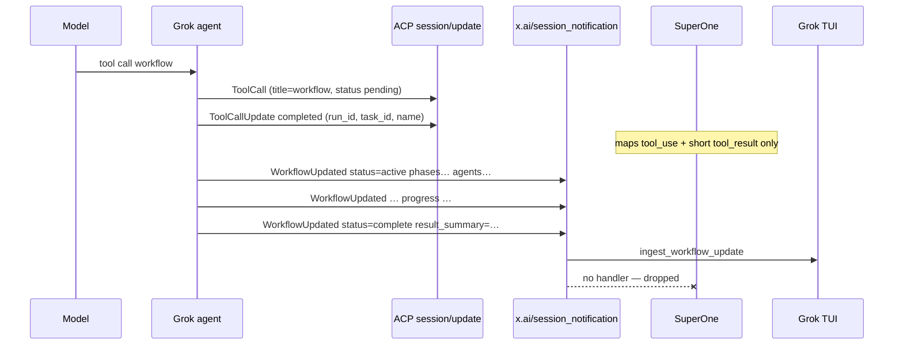

# Design: SuperOne × Grok xAI Extension Notifications

| Field | Value |
|-------|--------|
| Status | Draft |
| Date | 2026-07-28 |
| Scope | SuperOne as ACP host for Grok Build — **agent → client ExtNotification bus** (workflow, subagent, background tasks, goal, usage, compact, …) |
| SuperOne path | this monorepo (`apps/desktop/src/main/acp/`) |
| Grok Build source | `/Users/wuhangqi25/Developer/Projects/grok-build` (scanned 2026-07-28) |
| Related | [`grok-build-parity.md`](./grok-build-parity.md), [`grok-acp-permissions.md`](./grok-acp-permissions.md) |
| Trigger | Workflow runs succeed inside Grok but SuperOne never receives progress / result |

---

## 0. Executive summary

**Symptom.** When Grok launches a workflow (or other long-lived background work), SuperOne may show a brief `workflow` tool call with a launch ack, then nothing — no phases, agents, progress, or `result_summary`.

**Root cause (verified against Grok source).**

1. Standard ACP has **no** workflow / subagent-progress / goal types.
2. Grok ships those updates as **ACP extension notifications** (`ExtNotification`), primarily:
   - `x.ai/session_notification` (and aliases `x.ai/session/update`, `_x.ai/…`)
   - plus standalone methods (`x.ai/task_backgrounded`, `x.ai/task_completed`, `x.ai/monitor_event`, `x.ai/follow_ups`, …)
3. SuperOne’s ACP host only:
   - pumps **standard** `session/update` via `session.nextUpdate()`
   - handles reverse **requests** `x.ai/ask_user_question` / `x.ai/exit_plan_mode`
   - sends client→agent **notify** `x.ai/yolo_mode_changed`
4. SuperOne does **not** register any handler for agent→client ExtNotifications. The entire progressive bus is dropped on the floor.

**Not true:** “ACP cannot carry workflow information.”  
**True:** ACP does not define it; Grok uses the **extension rail** that SuperOne has not implemented.

**Fix direction.** Register the ExtNotification bus once, parse `sessionUpdate` variants (and key standalone methods), map high-value payloads onto existing SuperOne `AgentEvent` types. Do **not** change Grok agent source for host correctness.

---

## 1. Relationship to existing designs

| Doc | Role | Overlap |
|-----|------|---------|
| `grok-acp-permissions.md` | Permission mode + preapprove + yolo wire | Orthogonal. Keep. |
| `grok-build-parity.md` | Broad host parity matrix | Explicitly deferred “full x.ai surface” as non-goal (P2/P3). **This doc elevates the progressive bus** (workflow / subagent / bg task / usage) because it is **main-chat correctness**, not TUI chrome. |
| This doc | Agent→client extension notifications only | Owns wire inventory, mapping, PR plan for the bus |

Update `grok-build-parity.md` later (docs PR) to link here and reclassify progressive lifecycle as **in scope** rather than “full x.ai surface / defer”.

---

## 2. Architecture (verified)

### 2.1 What SuperOne implements today

```text
SuperOne renderer (chat, Task/Workflow UI, plan approval, …)
        │ IPC
        ▼
Session → AcpBackend
        │
        ▼
createAcpRuntime  ──spawn──►  `grok agent stdio` (JSON-RPC ACP)
        │
        ├── session/new | load | prompt | cancel
        ├── nextUpdate() loop  →  mapSessionUpdate()  →  AgentEvent
        │         ▲
        │         └── ONLY standard session/update
        ├── reverse request: request_permission, fs/*, terminal/*
        ├── reverse request: x.ai/ask_user_question, x.ai/exit_plan_mode
        └── client notify: x.ai/yolo_mode_changed
```

**Key SuperOne files**

| Area | Path |
|------|------|
| Runtime / update pump | `apps/desktop/src/main/acp/acp-runtime.ts` |
| Standard update → events | `apps/desktop/src/main/acp/acp-event-map.ts` |
| x.ai reverse RPC helpers | `apps/desktop/src/main/acp/acp-xai-extensions.ts` |
| Backend | `apps/desktop/src/main/session/backends/acp-backend.ts` |
| Agent events | `packages/shared/src/agent-types.ts` |
| Workflow UI (Claude-oriented) | `apps/desktop/src/renderer/src/components/chat/workflow-*.ts(x)` |
| Remote workflow meta | `apps/desktop/src/main/remote-control-service.ts`, `workflow-transcripts.ts` |

### 2.2 What Grok emits for progressive work

```text
Grok agent (stdio)
  │
  ├─ Standard ACP session/update
  │     tool_call / tool_call_update  (workflow launch ack only for Workflow tool)
  │     agent_message_chunk, etc.
  │
  └─ ExtNotification (agent → client, fire-and-forget)
        │
        ├─ x.ai/session_notification   ← primary progressive bus
        │     params: {
        │       sessionId,
        │       update: { sessionUpdate: "<variant>", ...fields },
        │       _meta?: { eventId, … }
        │     }
        │
        ├─ x.ai/task_backgrounded | x.ai/task_completed
        ├─ x.ai/monitor_event
        ├─ x.ai/follow_ups
        ├─ x.ai/scheduled_task_*
        ├─ x.ai/session/prompt_complete | interjection
        └─ x.ai/mcp/* | models/update | … (lower priority for SuperOne)
```

**Grok source anchors**

| Concern | Path |
|---------|------|
| Workflow launch tool (immediate ack only) | `crates/codegen/xai-grok-tools/src/implementations/grok_build/workflow/mod.rs` |
| Workflow → ExtNotification | `crates/codegen/xai-grok-shell/src/session/workflow/notify.rs` |
| Generic xAI notify send | `crates/codegen/xai-grok-shell/src/session/acp_session_impl/updates.rs` (`send_xai_notification`) |
| SessionUpdate enum (wire variants) | `crates/codegen/xai-grok-shell/src/extensions/notification.rs` |
| Pager ExtNotification dispatch | `crates/codegen/xai-grok-pager/src/app/acp_handler/mod.rs` (`handle_ext_notification`) |
| Pager workflow ingest | `crates/codegen/xai-grok-pager/src/app/acp_handler/workflow_ingest.rs` |
| Pager session_notification router | `crates/codegen/xai-grok-pager/src/app/acp_handler/session_notification.rs` |
| Suppress standard workflow ToolCall in TUI | `crates/codegen/xai-grok-pager/src/acp/tracker.rs` (`is_workflow_tool`) |

### 2.3 Workflow path in detail (the reported bug)



**Launch tool contract (Grok):** returns immediately with `{ run_id, task_id, name, … }`. Description explicitly says: do **not** poll via `task_output` / `wait_tasks`; progress lives under `/workflows` and completion is notified automatically — i.e. via the extension bus.

**Grok TUI policy:** standard ToolCall for live `workflow` runs is **suppressed** from scrollback; UI is driven solely by `WorkflowUpdated`. Authoring/validate_only calls may still show as tools.

---

## 3. Wire formats (host must parse)

### 3.1 Envelope: `x.ai/session_notification`

Method names observed / handled by Grok pager:

| Method | Role |
|--------|------|
| `x.ai/session_notification` | Live progressive updates (primary) |
| `x.ai/session/update` | Replay / alternate rail (same payload shape) |
| `_x.ai/session_notification` / nested wrap | Leader/client alias patterns (handle if present) |

**Envelope shape** (camelCase on outer struct):

```json
{
  "sessionId": "<acp-session-id>",
  "update": {
    "sessionUpdate": "workflow_updated",
    "run_id": "wf_…",
    "revision": 3,
    "name": "review-changes",
    "objective": "…",
    "status": "active",
    "phases": [{ "title": "Plan", "state": "done" }, { "title": "Execute", "state": "active" }],
    "current_phase": "Execute",
    "agents": [{ "agent_id": "…", "label": "…", "state": "running", "tokens_used": 0, "duration_ms": 0 }],
    "elapsed_ms": 12000,
    "result_summary": null,
    "pause_message": null
  },
  "_meta": {
    "eventId": "…",
    "eventSeq": 42
  }
}
```

**Variant tag:** `update.sessionUpdate` is **snake_case** (`workflow_updated`, `subagent_spawned`, …) — from

```rust
#[serde(rename_all = "snake_case", tag = "sessionUpdate")]
pub enum SessionUpdate { … }
```

Unknown variants deserialize to `Unknown` on Grok’s side; SuperOne should **ignore unknown `sessionUpdate` values** (forward-compatible).

### 3.2 Key `sessionUpdate` variants

Inventory from `notification.rs` (not exhaustive of every field — host mappers should tolerate missing optional fields).

#### Progressive lifecycle (P0 / P1)

| `sessionUpdate` | Purpose | Critical fields |
|-----------------|---------|-----------------|
| `workflow_updated` | Workflow run snapshot | `run_id`, `revision`, `name`, `objective`, `status`, `phases[]`, `current_phase`, `agents[]`, `agent_budget`, `agents_used`, `elapsed_ms`, `pause_message`, `result_summary` |
| `subagent_spawned` | Child session registered on parent | `subagent_id`, `parent_session_id`, `child_session_id`, `subagent_type`, `description`, `model`, `workflow_run_id?` |
| `subagent_progress` | ~2s rate-limited progress | `subagent_id`, `duration_ms`, `turn_count`, `tool_call_count`, `tokens_used`, `context_window_tokens`, `context_usage_pct`, `tools_used[]` |
| `subagent_finished` | Child terminal | `subagent_id`, `status` (`completed`\|`failed`\|`cancelled`), `error?`, `tool_calls`, `turns`, `duration_ms`, `tokens_used`, `output?` |
| `task_completed` | Background task done | `task_snapshot`, `will_wake?` |
| `task_backgrounded` | Bash/monitor moved to bg | `tool_call_id`, `task_id`, `command`, `cwd`, `output_file`, `description?`, `monitor_description?` |
| `goal_updated` | Goal-mode orchestration | `goal_id`, `objective`, `status`, `phase`, token budgets, subagent stats |
| `scheduled_task_created` / `fired` / `deleted` | Scheduler | `task_id`, `prompt`, `human_schedule`, … |
| `monitor_event` | Monitor stdout line | `task_id`, `description`, `event_text` |

#### Session meta (P1)

| `sessionUpdate` | Purpose | SuperOne mapping target |
|-----------------|---------|-------------------------|
| `turn_completed` | Durable turn end + usage | stop correlation + `message_usage` / context cache |
| `auto_compact_started` / `completed` / `failed` / `cancelled` | Auto-compact UX | `status_indicator`, `compact_boundary` |
| `model_changed` / `model_auto_switched` | Model switch broadcast | `agent_setting_change` |
| `retry_state` / `auto_recovery_*` | Retry UI | `api_retry` / status text |

#### Lower priority (P2/P3 / defer)

| `sessionUpdate` | Notes |
|-----------------|-------|
| `diff_review` | Interactive diff review |
| `session_recap` / `session_summary_generated` / recap unavailable | Recap product |
| `hooks_*` / `plugins_*` | Agent plugin chrome |
| `memory_*` / `image_compressed` / `image_dropped` | Niche UX |
| `pending_interaction` / `interaction_resolved` | Multi-client pending chrome |
| `relay_sync_status` | Relay topology |
| `feedback_request` | Product-specific |
| `unknown` | Forward-compat sink |

**Workflow `status` strings (observed):**  
`active`, `complete`, `failed`, `interrupted`, `cancelled`, `cleared`, plus pause-family states (user / budget / …). Treat unknown status as “paused-like” for UI, not as crash.

### 3.3 Standalone ExtNotification methods (Grok pager)

From `handle_ext_notification` in the pager:

| Method | Purpose | SuperOne priority |
|--------|---------|-------------------|
| `x.ai/session_notification` / `x.ai/session/update` | Progressive bus | **P0** |
| `x.ai/task_backgrounded` | Bg bash/monitor start | **P0** (or via nested variant if duplicated) |
| `x.ai/task_completed` | Bg task done | **P0** |
| `x.ai/monitor_event` | Monitor lines | P1 |
| `x.ai/follow_ups` | Follow-up suggestion chips | P1 |
| `x.ai/scheduled_task_*` (+ `inject_prompt`) | Cron-like tasks | P2 |
| `x.ai/session/prompt_complete` | Legacy turn end (deprecating toward `turn_completed`) | P2 |
| `x.ai/session/interjection` | Mid-turn user insert display | P2 |
| `x.ai/mcp/init_progress` / `tools_changed` / `server_status` / `servers_updated` / `mcp_initialized` | MCP host status | P2 (`getMcpServerStatus` currently `[]`) |
| `x.ai/models/update`, `settings/update`, `sessions/changed`, `queue/changed`, `announcements/update`, `git_head_changed` | Multi-client / TUI | **defer** (stdio single client) |

### 3.4 What SuperOne already handles (not this bus)

| Method | Direction | Status |
|--------|-----------|--------|
| `x.ai/ask_user_question` | agent → client **request** | done |
| `x.ai/exit_plan_mode` | agent → client **request** | done |
| `x.ai/yolo_mode_changed` | client → agent **notify** | done |
| `_meta["x.ai/tool"]` on ToolCall | inside standard session/update | done (event-map) |
| `_meta["x.ai/sessionConfig"]` | model/effort options | done (config) |

---

## 4. Gap matrix (user-visible)

Status: `missing` | `partial` | `done` | `na`.

| id | Capability | Source | SuperOne status | User impact if missing | Priority |
|----|------------|--------|-----------------|------------------------|----------|
| BUS-01 | ExtNotification registration | runtime | **missing** | Entire progressive bus dead | **P0** |
| BUS-02 | Parse `x.ai/session_notification` envelope | runtime | **missing** | — | **P0** |
| WF-01 | `workflow_updated` progress | session_notification | **missing** | “Workflow ran but SuperOne empty” | **P0** |
| WF-02 | `workflow_updated` terminal + `result_summary` | session_notification | **missing** | No result | **P0** |
| WF-03 | Correlate `run_id` ↔ launch `tool_use_id` | host state | **missing** | Orphan progress events | **P0** |
| WF-04 | `workflow` in TOOL_ID_TO_NAME | event-map | **missing** | Launch chip may look like generic tool | P1 |
| SA-01 | `subagent_spawned` / `progress` / `finished` | session_notification | **missing** | No live subagent panel | **P0** |
| BG-01 | `task_backgrounded` / `task_completed` | standalone and/or nested | **missing** | Bg bash never completes in UI | **P0** |
| BG-02 | `monitor_event` | standalone | **missing** | Monitor silent | P1 |
| US-01 | `turn_completed.usage` | session_notification | **missing** | Context bar null (`getContextUsage` stub) | P1 |
| US-02 | Auto-compact indicators | session_notification | **missing** | Silent compact | P1 |
| US-03 | `model_changed` | session_notification | **missing** | UI model lag after remote switch | P1 |
| FU-01 | `x.ai/follow_ups` | standalone | **missing** | No suggestion chips | P1 |
| GL-01 | `goal_updated` | session_notification | **missing** | Goal mode opaque | P2 |
| SC-01 | Scheduler notifications | standalone | **missing** | Cron UX | P2 |
| MCP-N | MCP status notifications | standalone | **missing** | Status UI empty | P2 |
| TUI-* | announcements, queue, leader | standalone | **na** | Multi-client / pager | defer |

Claude-specific SuperOne workflow features (DAG replay from Rhai transcripts under Claude project dirs) are **orthogonal** — Grok does not use that filesystem layout. Phase-1 Grok workflow UX should use **snapshot events**, not Claude transcript scraping.

---

## 5. Integration design

### 5.1 Principles

1. **Bus first, variants second** — one registration + dispatcher; unknown variants no-op with debug log.
2. **Reuse SuperOne `AgentEvent`** — avoid a parallel Grok-only event taxonomy until forced.
3. **Turn-independent delivery** — progressive events arrive **after** `session/prompt` returns. Must use session-level `onSessionEvent` / backend stream, not only the in-flight prompt callback.
4. **Idempotent apply** — honor `revision` / `eventSeq` when present (Grok TUI drops stale `workflow_updated`).
5. **No Grok source changes** for host correctness.
6. **Minimum viable UI first** — text progress + result summary before full DAG parity with Claude workflow renderer.

### 5.2 Runtime plumbing

```text
createAcpRuntime
  connection = client(...)
    .onRequest(...existing...)
    .onNotification('x.ai/session_notification', parseEnvelope, onXaiSessionNotification)
    .onNotification('x.ai/session/update', parseEnvelope, onXaiSessionNotification)
    // optional aliases:
    // .onNotification('_x.ai/session_notification', …)
    .onNotification('x.ai/task_backgrounded', …)
    .onNotification('x.ai/task_completed', …)
    .onNotification('x.ai/monitor_event', …)
    .onNotification('x.ai/follow_ups', …)
    .connect(stream)

  onXaiSessionNotification(params):
    events = mapXaiSessionUpdate(params.update, correlationState)
    for e in events: deliver(e)   // same deliver() as standard pump
```

**SDK note.** Custom methods require the 3-arg form with a params parser (same pattern as `x.ai/ask_user_question` onRequest). Confirm `@agentclientprotocol/sdk` surfaces agent→client notifications via `onNotification`; if a method is dropped by the SDK, fall back to raw stream inspection (last resort).

**Correlation state** (per runtime / session):

```ts
interface XaiCorrelationState {
  /** workflow run_id → launch tool_use_id (from standard ToolCall) */
  workflowToolByRunId: Map<string, string>
  /** last applied revision per run_id */
  workflowRevision: Map<string, number>
  /** subagent_id → spawn tool_use_id */
  subagentToolById: Map<string, string>
  /** task_id → tool_use_id / description */
  bgTaskById: Map<string, { toolUseId?: string; description: string; outputFile?: string }>
  /** latest usage snapshot for getContextUsage() */
  lastUsage: ContextUsageInfo | null
}
```

Populate `workflowToolByRunId` when standard map emits tool_result for a workflow-like tool whose output JSON contains `run_id` / `task_id`.

### 5.3 New / extended modules

| Module | Responsibility |
|--------|----------------|
| `acp-xai-session-notify.ts` (new) | Parse envelope; switch on `sessionUpdate`; pure mappers → `AgentEvent[]` |
| `acp-xai-extensions.ts` (extend) | Method name constants; shared types |
| `acp-runtime.ts` | Register notifications; own correlation maps; `deliver` |
| `acp-event-map.ts` | Add `workflow` → display name; optionally stash run_id from tool result |
| `acp-backend.ts` | Ensure session-level events reach chat store after turn; implement `getContextUsage` from cache |
| tests | Fixtures cloned from Grok serde shapes |

### 5.4 Event mapping (recommended)

#### Workflow

| Wire | AgentEvent |
|------|------------|
| first `workflow_updated` with new `run_id` | `task_started` `{ taskId: run_id, toolUseId?, description: name or objective }` |
| subsequent non-terminal | `task_progress` `{ taskId, toolUseId?, description, summary: phase line, usage: { totalTokens, toolUses, durationMs }, workflowAgents: agents mapped }` |
| terminal `complete` | `task_notification` `{ taskStatus: 'completed', resultText: result_summary, … }` |
| terminal `failed` / `interrupted` | `task_notification` `{ taskStatus: 'failed', summary/error }` |
| terminal `cancelled` | `task_notification` `{ taskStatus: 'stopped' }` |
| `cleared` | optional; remove live row / ignore if already terminal |

**Phase-1 UI:** existing Task / workflowAgents rendering is enough.  
**Phase-2 UI:** dedicated Grok workflow block (phases list, pause_message) without requiring Claude Rhai DAG.

#### Subagent

| Wire | AgentEvent |
|------|------------|
| `subagent_spawned` | `task_started` `{ taskId: subagent_id, description, taskType: subagent_type }` |
| `subagent_progress` | `task_progress` `{ usage from tokens/tool_call_count/duration_ms, activityText from tools_used }` |
| `subagent_finished` | `task_notification` `{ taskStatus from status, resultText: output }` |

Also consider nesting under parent `spawn_subagent` / Task tool_use when correlation succeeds (`parentToolUseId` already used elsewhere for Claude).

#### Background task / monitor

| Wire | AgentEvent |
|------|------------|
| `task_backgrounded` / `x.ai/task_backgrounded` | `task_started` + remember `output_file` |
| `task_completed` / `x.ai/task_completed` | `task_notification` with `outputFile` |
| `monitor_event` | `task_progress` activityText = `event_text` (or append to summary) |

#### Session meta

| Wire | AgentEvent / API |
|------|------------------|
| `auto_compact_started` | `status_indicator` `{ indicator: 'compacting' }` |
| `auto_compact_completed` | `status_indicator` null + `compact_boundary` when tokens known |
| `turn_completed` | refresh usage cache; optionally `message_usage` |
| `model_changed` | `agent_setting_change` `{ selectedModel }` |
| `x.ai/follow_ups` | one or more `prompt_suggestion` |

### 5.5 Delivery timing (critical)

```ts
// acp-runtime deliver() — already branches:
if (promptOnEvent) promptOnEvent(event)
else opts.onSessionEvent?.(event)
```

Requirements:

1. `AcpBackend` must subscribe `onSessionEvent` for the lifetime of the runtime, not only during `prompt()`.
2. Chat store must accept `task_*` events when agent status is idle (background completion).
3. Do not clear correlation maps on prompt end; clear on session dispose.

### 5.6 Dedup / ordering

- Prefer Grok’s `revision` on `workflow_updated`: apply only if `revision === 0` (snapshot) carefully, or `revision > last`.
- `_meta.eventSeq` high-water for non-workflow updates (Grok TUI pattern); workflow often exempted from strict seq drop.
- Drop `status === 'cleared'` after marking run closed.

### 5.7 Capability / product flags

- No new harness flag strictly required for receiving events.
- Optional: `HARNESS_CAPABILITIES.acp.supportsWorkflowProgress` once UI ships, if chrome needs gating.
- Do **not** advertise fake Grok TUI capabilities (`clientType: grok-desktop`) solely to unlock wire — unrelated permission option sets.

### 5.8 Explicit non-goals (this design)

| Non-goal | Why |
|----------|-----|
| Reimplement Grok `/workflows` modal 1:1 | SuperOne chrome; snapshot events suffice first |
| Claude Rhai DAG replay for Grok runs | Different filesystem / engine contract |
| Leader/follower multi-client session fanout | SuperOne stdio topology |
| Agent-side hook/deny engine | Agent-owned |
| Changing Grok to put full workflow graph into standard tool_result | Wrong layer; host should consume extension bus |
| Full MCP marketplace / announcements / queue pane | Parity deferred |

---

## 6. PR plan

Each PR = one logical change (Agents.md commit style). Suggested subjects:

### PR1 — `feat(acp): handle x.ai/session_notification bus`

**Scope**

- Register notification handlers + envelope parser.
- Dispatcher with unknown-variant ignore + structured log (`trace` / `log.debug`).
- Unit tests with synthetic fixtures (`workflow_updated`, `subagent_finished`, garbage variant).

**Out of scope:** product mapping beyond optional no-op or log-only.

**Acceptance**

- Live Grok session log shows parsed `sessionUpdate` names while a workflow runs.
- No regressions on standard `nextUpdate` pump.

### PR2 — `feat(acp): map workflow_updated to task events`

**Scope**

- Map workflow snapshots → `task_started` / `task_progress` / `task_notification`.
- Correlate `run_id` from workflow tool_result JSON.
- Add `workflow` name mapping in `acp-event-map` if needed.
- Tests for status matrix + revision dedup.

**Acceptance**

- User sees progressive status and final `result_summary` in chat for a simple named workflow.

### PR3 — `feat(acp): map subagent and background task notifications`

**Scope**

- `subagent_*` + `x.ai/task_backgrounded` / `task_completed` (+ nested variants if dual-emitted).
- Correlation to Task tool_use ids when present.

**Acceptance**

- Background subagent and bg bash show completion/output in SuperOne without polling tools.

### PR4 — `feat(acp): usage, compact, and model extension updates`

**Scope**

- Cache usage from `turn_completed` / progress; implement `getContextUsage`.
- Auto-compact → status indicators.
- `model_changed` → settings event.

**Acceptance**

- Context meter non-null after a Grok turn with usage; compact shows spinner state.

### PR5 — `feat(acp): follow_ups and goal/scheduler (product-gated)`

**Scope**

- `x.ai/follow_ups` → `prompt_suggestion`.
- Optional goal/scheduler/monitor polish.

**Acceptance**

- Product checklist; can ship follow_ups alone if goal UI is deferred.

### PR0 (docs, anytime) — cross-link parity doc

- In `grok-build-parity.md` §1 non-goals / §3 matrix: link this design; mark progressive bus as planned/in-progress rather than blanket “full x.ai surface defer”.

---

## 7. Testing plan

### 7.1 Unit

| Case | Fixture |
|------|---------|
| Envelope parse camelCase / snake_case tolerance | Minimal JSON |
| `workflow_updated` active → progress event | From notify.rs field set |
| complete with `result_summary` | Terminal |
| revision drop / accept | revision 2 then 1 |
| `subagent_finished` failed with error | |
| unknown `sessionUpdate` | no throw, empty events |
| correlation run_id from tool_result | map + later progress carries toolUseId |

### 7.2 Integration (mock agent)

Extend existing ACP mock pattern in `acp-runtime.test.ts`:

1. Standard ToolCall workflow complete with `{ run_id: "wf_1" }`.
2. Emit ExtNotification `workflow_updated` active then complete.
3. Assert delivered `task_*` events and order.

### 7.3 Manual Grok CLI checklist

- [ ] Start SuperOne ACP session with Grok Build.
- [ ] Prompt: launch a short built-in or project workflow (`/workflow` or agent tool).
- [ ] Observe launch tool chip.
- [ ] Observe progressive phase / agents (after PR2).
- [ ] Observe terminal result summary.
- [ ] Spawn background Task/subagent; observe finish (after PR3).
- [ ] Confirm chat still works after turn returns while workflow runs.
- [ ] Reload/resume session: progressive events for new runs still work (replay optional later).

---

## 8. Risks and open questions

| Risk / Q | Mitigation / default |
|----------|----------------------|
| SDK drops unregistered ExtNotifications silently | Register early; log raw method if connection supports catch-all |
| Dual emission (nested variant + standalone method) for tasks | Dedup by `task_id` |
| No toolUseId if launch ToolCall missed | Still emit with `taskId=run_id`; UI shows free-floating task |
| Claude workflow DAG incompatible with Grok snapshots | Phase-1 task list only; no forced DAG |
| High-frequency `subagent_progress` / `workflow_updated` | Rate-limit UI updates in store if needed; do not drop on wire |
| `getContextUsage` semantics differ ACP vs headless Grok | Prefer ACP `PromptUsage` full prompt sum; document in UI |
| Should SuperOne suppress workflow ToolCall like Grok TUI? | **No** for phase-1 — keep launch chip for affordance; avoid double-noisy final body |

**Open product questions**

1. Dedicated workflow panel vs reuse Task rows only?
2. Expose pause/resume/stop (`/workflow` slash already in available_commands) via SuperOne chrome?
3. Persist Grok workflow snapshots in SuperOne DB for history replay?

Defaults until decided: Task rows + result text; slash commands remain agent-side; no SuperOne DB snapshot store in PR1–2.

---

## 9. Success criteria

| # | Criterion | PR |
|---|-----------|-----|
| G1 | SuperOne logs / handles `x.ai/session_notification` without breaking standard ACP | PR1 |
| G2 | Live workflow progress visible in SuperOne chat | PR2 |
| G3 | Workflow terminal `result_summary` visible | PR2 |
| G4 | Subagent + bg task completion visible | PR3 |
| G5 | Context usage no longer always null after Grok turns that emit usage | PR4 |
| G6 | Unknown future `sessionUpdate` variants never crash the host | PR1 |

---

## 10. Appendix

### A. Grok pager ExtNotification match list (reference)

```text
x.ai/session_notification | x.ai/session/update
x.ai/follow_ups
x.ai/task_backgrounded
x.ai/task_completed
x.ai/models/update
x.ai/settings/update
x.ai/sessions/changed
x.ai/queue/changed
x.ai/session/prompt_complete
x.ai/session/interjection
x.ai/monitor_event
x.ai/scheduled_task_created | fired | deleted | inject_prompt
x.ai/announcements/update
x.ai/git_head_changed
x.ai/mcp/init_progress
x.ai/mcp/tools_changed | x.ai/mcp_initialized
x.ai/mcp/server_status
x.ai/mcp/servers_updated
```

Reverse **requests** (already SuperOne): `x.ai/ask_user_question`, `x.ai/exit_plan_mode`.

### B. WorkflowUpdated field sketch (TypeScript)

```ts
export interface GrokWorkflowUpdated {
  sessionUpdate: 'workflow_updated'
  run_id: string
  revision?: number
  name: string
  objective: string
  status: string
  foreground?: boolean
  phases?: Array<{ title: string; state: string }>
  current_phase?: string | null
  agent_budget?: number | null
  agents_used?: number
  agents_reserved?: number
  agents_remaining?: number | null
  agent_usage_incomplete?: boolean
  elapsed_ms: number
  active_agents?: number
  current_agent_label?: string | null
  agents?: Array<{
    agent_id: string
    label: string
    phase?: string | null
    model?: string | null
    state: string
    tokens_used?: number
    duration_ms?: number
  }>
  last_event?: string | null
  last_event_detail?: string | null
  last_event_timestamp?: string | null
  pause_message?: string | null
  result_summary?: string | null
}
```

### C. Related SuperOne stubs to retire as bus lands

| API | Current | After |
|-----|---------|--------|
| `AcpBackend.getContextUsage()` | always `null` | read usage cache from `turn_completed` / progress |
| `getMcpServerStatus()` | `[]` | optional PR for `x.ai/mcp/*` |
| `rewindFiles` | unsupported | still out of scope (needs `x.ai/rewind/*` requests, different design) |

### D. Investigation notes (2026-07-28)

- Confirmed workflow progress is **not** missing because ACP ToolCall failed — launch completes; progress is a separate channel.
- `acp-event-map.ts` has no `workflow` entry in `TOOL_ID_TO_NAME` (display-only gap).
- `docs/design/grok-build-parity.md` does not list workflow/subagent progressive bus in the capability matrix (gap in planning docs, not only code).
- SuperOne Claude workflow transcript helpers (`workflow-transcripts.ts`, DAG) remain Claude-harness-specific.

---

## 11. Decision log

| Date | Decision |
|------|----------|
| 2026-07-28 | Treat missing ExtNotification bus as root cause of “workflow results not received”. |
| 2026-07-28 | Integrate by host-side bus + AgentEvent mapping; do not require Grok agent changes. |
| 2026-07-28 | PR order: bus → workflow → subagent/bg → usage/compact → follow_ups/goal. |
| 2026-07-28 | Phase-1 workflow UI = task progress events, not Claude DAG replay. |
