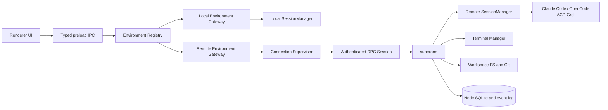

# SuperOne Persistent Remote Node Service

Status: active architecture and implementation tracker
Last reviewed: 2026-08-01

Implementation markers used by this document:

- **[IMPLEMENTED]**: the described code path and focused automated tests exist.
  This does not by itself claim production or clean-host end-to-end validation.
- **[PARTIAL]**: a usable contract or runtime skeleton exists, but at least one
  required production behavior is still missing.
- **[PLANNED]**: no production implementation is claimed.
- **[VALIDATION PENDING]**: implementation exists, but the acceptance scenario
  still needs a real supported-host or provider-runtime probe.

## 1. Decision Summary

SuperOne will model each local or remote node runtime instance as an execution
environment. An environment is a persistent `superone` service instance, its
fixed per-user data directory, and the Unix principal under which it executes.
It is not a physical machine: one Linux host may run several isolated
environments for different Unix users, but one Unix user owns exactly one
SuperOne node environment. A remote environment owns:

- projects and workspace paths
- Sessions and provider runtimes
- terminals and child processes
- filesystem and Git operations
- MCP processes and tools
- provider configuration and credentials
- durable event and message state

The remote boundary sits above `SessionManager`. A desktop must not create a
local `Session` whose `SessionBackend` happens to run remotely, because that
would split Session ownership, permissions, lifecycle, and persistence across
two processes.

SSH is a bootstrap, repair, and optional tunneling mechanism. It is not the
application protocol and does not own the remote node lifecycle. Normal product
traffic uses the same authenticated RPC protocol regardless of whether the
selected access endpoint is direct WSS, Tailscale, an SSH local forward, or a
future relay.

The initial production deployment target is a Linux `systemd` service. Closing
SuperOne, dropping the network, or closing an SSH tunnel must not stop the node
or its active Agent turns.

## 2. Goals

- Operate Linux projects from the SuperOne desktop as first-class projects.
- Keep active Agent turns running while every client is disconnected.
- Reconnect and reconstruct authoritative state without relying on an in-memory
  desktop transcript.
- Support more than one client and more than one access route to a node.
- Preserve the existing Session/Harness behavior and provider identities.
- **Reuse harness implementations across local and remote.** Node harnesses
  (Claude, Codex, …) must share the same electron-free provider core as the
  desktop path — extract shared packages (`@superone/claude`, future
  codex-core, …) rather than a second CLI-only side track (print-mode only,
  custom protocol parsers, etc.). Thin host adapters (permission UI, MCP
  registration, Electron spawn) may differ; the agent protocol and turn
  semantics must not.
- Keep local execution working throughout the migration.
- Reuse the same RPC contracts for desktop, mobile, and future web clients.
- Make remote access authenticated, revocable, observable, and upgradeable.
- Isolate environments on the same host by Unix principal and stable runtime
  identity, with one fixed node data directory per principal.

## 3. Non-goals

- Treating SSHFS or a mounted network filesystem as remote execution.
- Sending individual shell commands over SSH as the normal Agent runtime.
- Automatically copying provider credentials from the desktop to a node.
- Reusing the current mobile remote-control room protocol as the node protocol.
- Supporting arbitrary third-party node implementations in the first release.
- Replacing local Electron execution in the first milestone.
- Providing high availability or automatic failover between nodes.

## 4. Lessons From T3Code

T3Code provides the strongest local reference because its server already owns
orchestration, providers, terminals, Git, and filesystem operations. The useful
decisions to adopt are:

1. One server instance is one stable execution environment.
2. Environment identity is independent of hostname, IP address, and endpoint.
3. A known environment is client-local connection metadata, not server state.
4. One environment may expose several access endpoints.
5. Launch method and access method are separate concepts.
6. SSH launches or discovers the server and establishes a port forward; clients
   still use ordinary HTTP/WebSocket RPC afterward.
7. Pairing credentials are distinct from steady-state authenticated sessions.
8. Connection supervision owns retries, backoff, health probes, and network
   transitions instead of scattering reconnect logic across UI components.

SuperOne intentionally differs in two places:

- T3Code's desktop-managed SSH process stops its managed server when the tunnel
  scope closes. SuperOne's node is independently supervised by `systemd` and
  survives all client and tunnel lifecycles.
- T3Code clients connect directly to the environment. SuperOne desktop keeps
  node credentials and sockets in Electron Main and exposes typed, scoped IPC
  to the renderer. This preserves SuperOne's existing trust boundary and keeps
  secrets out of renderer storage.

## 5. Architecture



### 5.1 Process boundaries

`superone` is a Node.js process with no Electron dependency. It hosts the
same domain services that must run where the project lives. Electron-only
functions such as windows, dialogs, desktop keychain access, native menus, and
renderer event transport remain in `apps/desktop`.

The desired code ownership is:

```text
packages/shared              protocol-neutral schemas and shared value types
packages/runtime             @superone/runtime — session + fs + git (always on node)
packages/claude              @superone/claude  — enable harness claude
packages/codex               @superone/codex   — enable harness codex
packages/acp                 @superone/acp     — enable harness acp
packages/opencode            @superone/opencode — enable harness opencode
apps/cli                     authenticated HTTP/WS server + thin adapters
apps/desktop                 Electron shell, local gateway, remote client gateway
apps/relay                   optional environment relay and mobile remote control
```

**Enable rule:** CLI always depends on `@superone/runtime`. Enabling a harness
adds the matching package (`@superone/claude`, …) so optional SDK/binary deps
stay out of the base install. Subpaths: `@superone/runtime/session|fs|git`.

**Landed:** runtime (session/fs/git) + all four harness packages. ACP/OpenCode
real process paths are opt-in via env binaries; default simulated. Desktop
thin-wrap deferred.

**Workspaces:** `"apps/*"`, `"packages/*"`.

The dependency rule is mandatory: `@superone/runtime`, harness packages, and
`apps/cli` must not import Electron. Protocol, authentication-client,
connection-supervisor, and RPC-client cores are also platform-neutral. Electron
Main and mobile provide separate socket and secure credential-store adapters
around those cores.

#### Harness reuse (local ↔ remote)

Remote turns are not a second product surface. When a harness already exists on
desktop, the remote node must run **the same provider integration**, not a
print-mode / subprocess-only facsimile:

1. Extract an **electron-free core** (Agent SDK for Claude, App Server client
   for Codex, …) into `packages/core/<harness>` (or keep the transitional
   `packages/claude` name until moved).
2. Desktop and CLI both call that core. Host-specific concerns
   (permissions UI, MCP in-process servers, binary resolution, spawn wrappers)
   stay in thin adapters.
3. Temporary expedients (e.g. Stage 5-B `claude -p` stream-json) are allowed
   only until the shared core lands; they must not become the long-term remote
   path.

#### What belongs in which package (binding)

| Concern | Target package | npm name (proposed) | Notes |
|---|---|---|---|
| Claude Agent SDK turn | `packages/claude` | `@superone/claude` | **Landed** |
| Codex App Server turn | `packages/codex` | `@superone/codex` | **Landed** — desktop richer pool deferred |
| ACP turn | `packages/acp` | `@superone/acp` | **Landed** — process + minimal agent turn when `SUPERONE_ACP_BINARY` set; else simulated |
| OpenCode turn | `packages/opencode` | `@superone/opencode` | **Landed** — serve + SDK turn when `SUPERONE_OPENCODE_BINARY` set; else simulated |
| Pure git / worktree | `packages/runtime/src/git` | `@superone/runtime/git` | **Landed** |
| Pure workspace FS | `packages/runtime/src/fs` | `@superone/runtime/fs` | **Landed** |
| Session send/interrupt/permission | `packages/runtime/src/session` | `@superone/runtime/session` | **Landed** — store/lease ports; SQLite adapter in CLI |
| Protocol / types / event map | `packages/shared` | `@superone/shared` | Wire contracts only; no process I/O |
| Electron IPC / UI | `apps/desktop` | `@superone/desktop` | Thin adapters over gateway + cores |

**Rules:**

- Do **not** fold cross-harness infrastructure into a harness package (`core/claude`
  must not grow git/session).
- Harness packages depend on `@superone/shared` only (plus their vendor SDK).
- `core/git` and `core/fs` must not depend on harness packages.
- Hosts (`apps/cli`, `apps/desktop` main) depend on cores; cores never depend on hosts.
- Prefer one package = one deployable concern; avoid a single mega `@superone/core`.

#### Migration order

1. **Workspace + docs** — done.
2. Claude → `core/claude` — done.
3. Git / FS pure helpers → `core/git`, `core/fs` — done.
4. Codex App Server client → `core/codex` — done.
5. Session runtime + ports → `core/session` — done (CLI SQLite adapter).
6. ACP / OpenCode packages → `core/acp`, `core/opencode` — done (real path opt-in via env; simulated default).
7. **Next:** deepen ACP (event map / terminals / xAI) and OpenCode event stream fidelity; desktop thin-wrap still deferred.

### 5.2 Gateway boundary

Desktop features route through an environment-scoped gateway:

```ts
interface EnvironmentGateway {
  getDescriptor(): Promise<ExecutionEnvironmentDescriptor>
  listProjects(): Promise<ProjectSnapshot[]>
  getProject(projectId: string): Promise<ProjectSnapshot>
  subscribeEvents(input: SubscribeEventsInput): AsyncIterable<EnvironmentEvent>
  sessions: SessionGateway
  interactions: InteractionGateway
  terminals: TerminalGateway
  workspace: WorkspaceGateway
}
```

The typed sub-gateways cover complete operation families, including Session
create/send/interrupt/close, permission/question/plan response, terminal
attach/input/resize/kill, file watch cancellation, and streaming transfer
cancellation. Features must not bypass the gateway by adding
environment-specific raw IPC.

`LocalEnvironmentGateway` delegates to existing in-process services.
`RemoteEnvironmentGateway` delegates to an authenticated node RPC session.

UI stores use scoped references and never route by a bare project or Session ID:

```ts
type EnvironmentRef = { environmentId: string }
type ProjectRef = { environmentId: string; projectId: string }
type SessionRef = { environmentId: string; sessionId: string }
type TerminalRef = { environmentId: string; terminalId: string }
```

## 6. Domain Model

### 6.1 ExecutionEnvironment

An `ExecutionEnvironment` is one SuperOne node runtime instance and has a
stable, random `environmentId` persisted in `$HOME/.superone/node`. Its
effective identity is bound to that fixed data directory and Unix principal.
The local desktop runtime is also an environment, even before local execution
moves out of Electron Main.

The descriptor includes:

```ts
interface ExecutionEnvironmentDescriptor {
  environmentId: string
  label: string
  platform: { os: 'darwin' | 'linux' | 'windows'; arch: string }
  nodeVersion: string
  protocolVersion: number
  capabilities: EnvironmentCapabilities
}
```

Capabilities are negotiated, not inferred from version strings. Initial flags
cover Sessions, Harness IDs, terminal, workspace filesystem, Git, worktrees,
MCP, file transfer, collaboration, and node administration.

The node also persists an instance key pair and a binding derived from the host
machine identity, Unix UID, and canonical fixed data-directory path. A binding
change starts in `identity_conflict` mode and serves only local administrative
recovery.
Clients bind a known environment to both `environmentId` and the node public-key
fingerprint. If a client or Relay observes the same identity with simultaneous,
differently signed boot epochs, it blocks both routes as a possible clone.

No design can detect two isolated clones that never share a client or registry,
so backup/VM restore instructions require `identity regenerate` before network
access. That command creates a new `environmentId`, key pair, binding, and
pairing state without rewriting project or Session data. An explicit
administrator-only `identity adopt` handles legitimate host migration while
revoking prior client sessions.

### 6.2 KnownEnvironment

A connection starts as a client-local pending profile because a manually entered
WSS or SSH endpoint may not know its environment identity before the first
authenticated descriptor exchange:

```ts
interface PendingConnectionProfile {
  connectionId: string
  label: string
  endpointProfiles: EndpointProfile[]
}
```

After authentication, the profile is atomically bound to a node identity and
becomes a `KnownEnvironment`. It contains presentation and access metadata, not
authoritative runtime state.

```ts
interface KnownEnvironment {
  connectionId: string
  environmentId: string
  nodePublicKeyFingerprint: string
  label: string
  endpointProfiles: EndpointProfile[]
  preferredEndpointId?: string
}
```

Binding deduplicates existing entries by verified environment identity. Every
later endpoint change or failover must return the same environment ID and key
fingerprint or the connection is blocked.

Secrets are stored separately in a fail-closed platform credential store and
are referenced by `connectionId`. They must not be stored in an ordinary SQLite
row or renderer local storage. SuperOne's existing secret-store fallback to
plaintext SQLite is not acceptable for long-lived node credentials. When secure
storage is unavailable, clients allow an explicitly temporary in-memory session
or refuse to save the credential.

### 6.3 EndpointProfile

One environment can have multiple endpoint profiles:

- `direct-wss`: operator-managed TLS endpoint
- `tailscale`: Tailnet address or Tailscale Serve HTTPS endpoint
- `ssh-forward`: desktop establishes a loopback local port forward
- `relay`: node and client connect outbound to a broker

Endpoint profiles describe access only. They do not create a second environment
or duplicate its projects and Sessions.

### 6.4 InstallationProfile

Installation and service management are separate from endpoints:

- `systemd-user`
- `systemd-system`
- `container`
- `manual`

The first managed installation is `systemd-user`, with an explicit option for a
system administrator to install a system service later. SuperOne records how it
installed a node for diagnostics and upgrades, but the node remains usable if
the installation profile is removed from one client.

## 7. Runtime Ownership

The node is authoritative for all state whose meaning depends on the remote
filesystem or process runtime:

| State | Authority |
|---|---|
| Node identity and capabilities | node |
| Remote projects and paths | node |
| Session metadata and transcript | node |
| Active turns and permission requests | node |
| Provider resume IDs and runtime payloads | node |
| Terminal processes and snapshots | node |
| Git status, branches, worktrees, checkpoints | node |
| MCP server lifecycle | node |
| UI layout, selected environment, endpoint preference | client |
| Cached remote snapshots | client, disposable |

Desktop caches accelerate rendering but are never treated as the recovery
source. A reconnect hydrates from the node snapshot and then resumes its event
cursor.

## 8. Node Persistence

The production node data directory is fixed at `$HOME/.superone/node`. Public
CLI commands do not expose `--home` or `--data-dir`. This makes the supported
product model one node environment per Unix user and ensures that SSH bootstrap,
`systemd-user`, diagnostics, Harness state, and identity commands always resolve
the same environment.

`SUPERONE_NODE_HOME` remains an internal override for automated tests and the
Docker development lab. It is not documented as a production multi-instance
feature. If multi-instance support is introduced later, it requires an explicit
identity, service-unit, port-allocation, and upgrade design; exposing a path flag
alone is insufficient.

The node directory contains:

```text
~/.superone/node/
  environment-id
  state.sqlite
  config.json
  secrets/
  logs/
  attachments/
  provider-logs/
  runtime.json
```

Required SQLite data includes:

- projects and repository identity
- Session metadata and messages
- provider runtime binding, resume cursor, and runtime payload
- normalized environment event log
- pending permission/question interactions
- terminal metadata and bounded output checkpoints
- paired client sessions and revocation state
- idempotency receipts for mutating RPC commands
- node upgrade history

SQLite uses WAL mode and foreign keys. Secret material is stored in files with
owner-only permissions or a supported system secret store, not ordinary rows.

Authoritative state changes and their durable events are committed in the same
SQLite transaction. Event publication reads from that committed outbox. The
node must never update a Session and then separately attempt to append its event,
because a crash between those writes would make cursor-based recovery
incomplete.

For a mutating command, one transaction commits all of the following or none of
them:

1. the idempotency receipt
2. authoritative aggregate state
3. durable events and their sequence allocation

The idempotency unique key is `(clientIdentity, operation, idempotencyKey)` and
the receipt stores a canonical request-payload hash. Reusing a key with a
different payload returns an explicit conflict instead of the earlier result.

High-frequency presentation deltas may be batched, but Phase 3 durably projects
turn start, user input, assistant content blocks, reasoning blocks, tool
start/input/result, permission/question/plan interactions, usage, completion,
interruption, and error state. Streaming text/reasoning/tool-input deltas are
folded into the current content block and checkpointed at a bounded interval or
byte threshold. A disconnect may lose only an uncommitted presentation fragment,
never an acknowledged semantic transition or completed content block.

Event retention uses snapshots and compaction; deleting old events is allowed
only after a snapshot at or beyond their sequence is durable. A subscription
whose cursor predates retained history receives `cursor_too_old` with
`snapshot_required`, never a partial stream. The current in-memory
`event-seq.ts` process epoch and counter are not a durable cursor and cannot be
reused for this protocol.

## 9. Commands, Events, and Reconnect

### 9.1 RPC model

RPC uses schema-validated request and response envelopes. Mutating operations
carry a client-generated idempotency key:

```ts
interface RpcCommandEnvelope<T> {
  protocolVersion: number
  requestId: string
  idempotencyKey?: string
  environmentId: string
  payload: T
}
```

The node returns a command receipt before or with the resulting events. A retry
with the same authenticated client and idempotency key returns the prior receipt
instead of repeating the mutation.

Handshake descriptors advertise a current protocol generation plus supported
minimum/maximum protocol and database-schema generations. The connection is
blocked before mutable RPC is enabled when the ranges do not overlap.

### 9.2 Event log

Every durable environment event has:

- stable `eventId`
- monotonically increasing environment `sequence`, encoded as a decimal string
  on the wire and a SQLite integer internally
- timestamp
- aggregate type and aggregate ID
- event type and version
- payload
- optional causation request ID

The first implementation may use one sequence per environment. Partitioned
streams are unnecessary until measurements prove otherwise.

On connect:

1. Authenticate and verify the expected `environmentId`.
2. Negotiate protocol and capabilities.
3. Request a consistent snapshot and its `snapshotSequence`.
4. Subscribe from `snapshotSequence + 1`.
5. Detect gaps and resnapshot rather than silently continuing.

Client acknowledgement is a delivery cursor, not a shared `read` flag. UI reads
must not consume delivery for Agents or other clients.

### 9.3 Recovery guarantees

Session continuity and in-flight operation continuity are separate guarantees:

| Failure | Agent turn | PTY | Pending interaction | Recovery result |
|---|---|---|---|---|
| Client/network/SSH tunnel disconnect | continues | continues | remains pending | reconnect snapshot plus cursor resumes the same live runtime |
| Graceful node restart or upgrade | drain when supported; otherwise explicitly interrupt after policy/timeout | closes unless a future capability supports reattach | persisted | Session remains usable; original in-flight operation resumes only for a Harness that advertises and passes reattach tests |
| Node or systemd crash | process normally dies with node cgroup | process normally dies | persisted | startup reconciliation marks running work `interrupted` or `unknown`, preserves committed output, and permits a later turn from durable provider resume state |
| Provider subprocess crash | current turn becomes `error`, `interrupted`, or `unknown` from observed evidence | unaffected | reconciled | restart provider for a later turn; never claim original-turn reattach without a verified capability |

A disconnected client never causes permission escalation. A turn that needs
approval waits for an authorized client or follows an explicit node-side
timeout policy that records a denial/error event. Idle provider processes may
be released after a retention window while their resume metadata remains
durable.

### 9.4 Fenced control leases

Interactive Session and writable terminal control use server-issued leases:

```ts
interface ControlLease {
  leaseId: string
  resource: SessionRef | TerminalRef
  holderClientId: string
  generation: string
  expiresAt: string
}
```

- Only one live control lease exists for a resource; observers never acquire a
  lease and never block its holder.
- A holder renews before expiry. Normal disconnect does not instantly transfer
  control; the short lease TTL bounds takeover delay.
- Explicit release permits immediate acquisition. Administrative takeover
  increments `generation`, records an audit event, and invalidates the old
  lease.
- Every mutating control command carries `leaseId` and `generation`. The node
  rejects expired, superseded, or late commands even if their socket remains
  open after endpoint failover.
- Permission, question, and plan responses require both scope and the current
  Session control lease, unless a future separately scoped approval capability
  is explicitly introduced.
- Node restart invalidates all prior leases by changing the lease epoch. Clients
  must reacquire after synchronization.

## 10. Connection Supervision

Electron Main owns one supervisor per desired environment. The supervisor state
machine is:

```text
available -> connecting -> synchronizing -> connected
                    |             |
                    v             v
                 backoff <----- disconnected
                    |
                 blocked
```

Transient failures retry with capped exponential backoff and jitter. Auth,
protocol incompatibility, revoked credentials, and invalid configuration enter
`blocked` and require user action. Application resume and network-online events
trigger an immediate health probe or retry.

Endpoint selection follows saved preference first, then observed successful
routes. Failure of one endpoint may try another endpoint for the same
environment, but only after confirming the resolved descriptor carries the same
`environmentId` and node public-key fingerprint.

## 11. Access Methods

### 11.1 SSH bootstrap and forward

Desktop uses the system OpenSSH client to inherit `~/.ssh/config`, ssh-agent,
ProxyJump, host key verification, and platform security updates.

SSH operations support:

- host discovery and `ssh -G` resolution
- environment probe
- signed node package upload or remote package installation
- `systemd` unit installation and status checks
- one-time pairing credential creation
- log tail and diagnostic bundle collection
- `-L localPort:127.0.0.1:nodePort` forwarding

The normal node service binds loopback in SSH-only deployments. Closing the
forward disconnects the client but never stops the service.

Password prompts may be bridged through a short-lived askpass helper, but
passwords stay in memory only. Key and agent authentication remain the preferred
path. Host key errors are never auto-accepted.

### 11.2 Tailscale

Tailscale is the preferred direct remote route for personal deployments. The
node may bind its Tailnet IP or use Tailscale Serve for HTTPS/WSS. Tailscale
network identity supplements but does not replace SuperOne application auth.
SuperOne's existing desktop endpoint discovery is only a reference; its local
`tailscaleServeEnabled` state is not authoritative for a remote node. Each node
discovers, configures, and advertises its own Tailscale endpoints.

### 11.3 Direct WSS

An operator may expose the node behind a reverse proxy with TLS. Plain public
`ws://` is rejected. The node supports trusted proxy configuration explicitly;
it must not trust forwarded headers by default.

### 11.4 Relay

Relay support is a later endpoint provider. The node opens an outbound
authenticated connection so no inbound port is required. The relay forwards
opaque encrypted frames and must not hold provider credentials or plaintext
workspace data.

The existing mobile protocol remains separate. A new environment relay protocol
must support node/client roles, multiple clients, per-client identity, flow
control, replay bounds, and connection generation. Shared crypto and framing
utilities may be extracted where semantics genuinely match.

Relay-visible metadata is limited to routing identifiers, connection
generation, opaque frame size, flow-control counters, and expiry. Application
method names, resource IDs, prompts, terminal output, and file data remain
inside end-to-end encrypted payloads. Relay replay is only a transport
optimization; the node's durable event log remains the recovery authority.

## 12. Authentication and Authorization

### 12.1 Pairing

1. An administrator creates a 10-minute, single-use pairing token on the node,
   normally through authenticated SSH bootstrap.
2. The client generates a device key pair and atomically exchanges the pairing
   token while registering its public key and presentation metadata.
3. The node creates a revocable client session and returns a rotating refresh
   credential bound to that device key.
4. Refresh exchange produces a 15-minute, scoped proof-of-possession access
   token. Refresh credentials expire after 90 days of inactivity, rotate on
   successful use, and token-family reuse revokes that family.
5. WebSocket connection uses a 30-second, single-use ticket with `/ws` audience,
   client-session ID, scopes, and device-key thumbprint.

Pairing tokens and WebSocket tickets are consumed atomically. The node stores
only keyed hashes and metadata for pairing and refresh credentials. A high-
entropy secret comparison is constant-time. Access tokens and tickets are
signed by the node instance key and validated for issuer, audience, expiry,
scope, session status, and proof key.

Revoking a client session invalidates its refresh family, access tokens, and
unused tickets and actively closes all sockets for that session. Scope changes
also force reconnect. Proof-of-possession is required for every remote access
path and is mandatory across Relay so a forwarding layer cannot replay a stolen
bearer credential.

Pairing material is redacted from structured logs, errors, argv, shell history,
SSH stdout diagnostics, tracing attributes, and support bundles. The SSH flow
parses credentials in memory and never embeds them in a saved command.

| Credential | Active lifetime | Stored by node | Terminal transitions |
|---|---|---|---|
| pairing token | 10 minutes, one exchange | keyed hash, scopes, issuer, expiry | consumed, expired, revoked |
| client refresh family | 90 days since last use, rotates | keyed hash, device public key, scopes | rotated, reuse-revoked, admin-revoked, expired |
| access token | 15 minutes | session/revocation metadata only | expired or session-revoked |
| WebSocket ticket | 30 seconds, one `/ws` upgrade | keyed hash, audience, proof thumbprint | consumed, expired, session-revoked |

Consumption and rotation use compare-and-update transactions so concurrent
exchange attempts have exactly one winner.

### 12.2 Scopes

Initial scopes are:

- `environment:read`
- `project:read`
- `project:manage`
- `session:read`
- `session:operate`
- `terminal:operate`
- `workspace:read`
- `workspace:write`
- `access:manage`
- `node:admin`

Administrative pairing grants all scopes. Later pairing flows may issue
read-only or task-limited clients without changing RPC contracts.

### 12.3 Session control

Authenticated client identity is propagated to Session operations. Existing
local/remote ownership semantics must evolve into the fenced leases defined in
Section 9.4:

- observation does not imply control
- one client may hold the interactive control lease for a Session
- background host work is a distinct trusted origin
- lease expiration and disconnect behavior are explicit
- an Agent collaboration credential cannot be used as a node client credential

Permission responses require `session:operate`, a matching pending interaction,
and the current fenced control lease. They cannot be fabricated by supplying
another Session ID.

### 12.4 Provider credentials

Provider authentication belongs to the execution environment. A remote node
discovers and uses its own Claude, Codex, OpenCode, and ACP-Grok configuration.
Desktop credentials are not copied implicitly.

The first Codex setup supports node-side CLI/device login initiated through SSH
or an RPC that returns an external-browser authorization URL. An API-key form,
when supported, necessarily holds the secret briefly in renderer memory; it
must never persist or re-display it, must clear it after submission, and sends
it through a dedicated typed IPC path to Electron Main and then the node. A
native Main-process secure input surface may later avoid renderer exposure.

Claude, OpenCode, and ACP-Grok setup methods are specified per Harness before
their remote phase. Export/import of provider configuration is a separate
future feature requiring explicit user authorization.

## 13. Session and Harness Runtime

**Implementation status: [PARTIAL].** The node has persistent Session records,
control leases, an event log, restart reconciliation, RPC handlers, a
multi-Harness router, and a durable Harness installation catalog. The current
router is still simulated for all Harness IDs and must not be treated as a real
provider integration. Production descriptors advertise only enabled+ready
harnesses (default empty); `simulatedHarness` is an in-memory test overlay that
does not persist readiness.

Remote support is an execution location, not another Harness. The target
first-party Harness IDs are:

| Harness ID | Protocol/runtime | Runtime ownership |
|---|---|---|
| `claude` | Claude Agent SDK with its platform binary | `managed` |
| `codex` | Codex App Server platform package | `managed` |
| `opencode` | native OpenCode server and SDK client | `external` binary |
| `acp-grok` | ACP client connected to Grok Build | `external` binary |

`opencode` remains an independent Harness. It must not be represented as an ACP
agent or an `acpAgentId: opencode` shortcut. `acp-grok` identifies the concrete
Grok Harness while reusing the shared ACP protocol adapter. The existing
persisted `harnessId: acp` is a legacy read alias during migration. **Target
behavior:** newly created Grok Sessions write `acp-grok`. **Stage 1 behavior:**
`session.create` still normalizes `acp-grok` → wire `acp` so desktop storage
does not break until that migration lands. The migration must not rewrite an
arbitrary custom ACP profile to Grok without evidence that it uses the Grok
definition.

### 13.1 Runtime boundary

The reusable runtime must include:

- `Session` and `SessionManager`
- Harness registry and Session providers
- provider runtime adapters
- runtime idle reaper
- project resource discovery
- permission, plan, and question state
- collaboration lifecycle and mailbox delivery
- MCP server lifecycle and Session-scoped tools
- persistence ports and event publication

Electron callbacks are replaced with injected ports. For example, renderer
delivery becomes an environment event publisher, and desktop dialogs become
durable interactions answered through RPC.

Agent collaboration stays within an environment in the first release. Parent
and child Sessions run on the same node and use the existing persistent mailbox
model. Cross-environment collaboration is a separate protocol and is not implied
by remote-node support.

Each Harness publishes and tests a recovery capability record:

| Capability | Meaning |
|---|---|
| `coldSessionResume` | a later turn can continue from persisted provider identity |
| `inFlightTurnReattach` | the same running turn can be reattached after node restart |
| `pendingInteractionRestore` | provider and SuperOne can restore a pending interaction |
| `providerCrashRecovery` | adapter can reconcile and restart after subprocess crash |

Capabilities default to false. Parity means equivalent supported behavior, not
claiming that all Harnesses have the same recovery guarantees.

### 13.2 Harness installation ownership

Harness adapters and protocol clients are part of the Electron-free node
runtime. Runtime installation ownership is deliberately narrower:

- SuperOne manages only the platform payloads required by `claude` and `codex`.
- Users install and upgrade the `opencode` executable.
- Users install and upgrade the Grok executable used by `acp-grok`.
- External executable detection never grants permission to install, upgrade, or
  delete that executable.
- ACP being a protocol does not make its Agent executable dependency-free. It
  only allows SuperOne to keep one reusable ACP adapter while the concrete
  external command remains user-managed.

The runtime source is explicit:

```ts
type HarnessRuntimeSource = 'managed' | 'external'
```

For managed Harnesses, SuperOne downloads into a staging directory, verifies a
signed manifest and digest, probes the unpacked runtime, and atomically activates
it. It never mutates the globally installed CLI package or performs an unpinned
global `npm install`.

For external Harnesses, SuperOne resolves the configured command to an absolute
path, checks its version, performs the protocol readiness probe, and persists
the resolved configuration. A later probe detects if that path disappears or
becomes incompatible.

### 13.3 Managed Harness release coupling

Managed Harnesses follow the CLI release lifecycle. They do not have an
independent product upgrade channel and their upstream version numbers do not
need to equal the CLI version.

Each CLI release publishes a signed compatibility manifest similar to:

```json
{
  "cliVersion": "0.49.4",
  "managedHarnesses": {
    "claude": {
      "runtimeVersion": "0.3.220",
      "artifactVersion": "superone-claude-0.3.220.1"
    },
    "codex": {
      "runtimeVersion": "0.145.0",
      "artifactVersion": "superone-codex-0.145.0.2"
    }
  }
}
```

Rules:

1. `harness enable claude|codex` installs the exact artifact selected by the
   current CLI manifest. It never resolves an upstream `latest` tag.
2. Upgrading the CLI also upgrades every enabled managed Harness to the versions
   selected by the new CLI manifest.
3. Disabled managed Harnesses are not downloaded during upgrade. Enabling them
   later installs the artifact selected by the then-current CLI release.
4. External Harnesses are never upgraded by a CLI update. They are re-probed for
   compatibility after the update.
5. CLI and enabled managed Harness activation is one transaction. The launcher
   stages and verifies all artifacts, applies the configured drain policy,
   switches the release, runs health and Harness handshake probes, and commits
   only if the complete version set is healthy.
6. Failure rolls back the CLI and all managed Harness pointers together. An old
   CLI must never be left paired with a newer, unverified App Server runtime.

The release layout is version-grouped:

```text
$HOME/.superone/node/releases/
  0.49.3/
    cli/
    harnesses/claude/
    harnesses/codex/
  0.49.4/
    cli/
    harnesses/claude/
    harnesses/codex/
  current -> 0.49.4
```

Only enabled managed Harness directories are required in a release. Old release
garbage collection is owned by the node upgrader, not by a separate Harness
upgrade mechanism.

### 13.4 Harness state and advertised capabilities

Installation, administrator intent, authentication, and readiness are separate
facts. The persisted state machine is:

```text
disabled -> missing -> installing -> needs_auth -> ready
                            |              |
                            v              v
                          error       incompatible
```

The exact transition may skip states, for example an already installed external
binary can move from `disabled` directly to `ready` after a successful probe.

The descriptor must not advertise every adapter compiled into the node as a
runnable Harness. `capabilities.harnessIds` contains only enabled and `ready`
Harnesses. A separate administrative catalog exposes installability and
diagnostics:

```ts
interface HarnessInstallationStatus {
  id: 'claude' | 'codex' | 'opencode' | 'acp-grok'
  runtimeSource: 'managed' | 'external'
  enabled: boolean
  state:
    | 'disabled'
    | 'missing'
    | 'installing'
    | 'needs_auth'
    | 'ready'
    | 'incompatible'
    | 'error'
  runtimeVersion?: string
  command?: string
  requiresAuth: boolean
  diagnostic?: { code: string; message: string }
}
```

Secrets, raw environment values, tokens, and passwords never appear in the
descriptor, CLI JSON output, logs, or diagnostics.

### 13.5 Harness CLI surface

**Implementation status: [PARTIAL] (Stage 2).** The `superone harness` command
group is implemented for list/show/enable/disable/configure/doctor/repair.
Public commands intentionally omit `--home` and `--data-dir`; every command
operates on `$HOME/.superone/node` (`SUPERONE_NODE_HOME` remains a test/Docker
override only). All commands support `--json` and `--help`.

Stage 2 gaps vs full §13.5 (flags are **rejected** if passed, not silently
ignored):

- managed signed download/manifest without offline `--artifact`
- `--env-file`, `--server-password-stdin`, `--clear-server-password`,
  `--clear-env`, `--startup-timeout`, `--initialize-timeout`
- full ACP/OpenCode protocol handshake (existence/executable probe only)
- live Session drain from the CLI process (documented no-op until node RPC)

#### List and inspect

```bash
superone harness list [--json]
superone harness show <HARNESS_ID> [--json]
```

`list` returns every first-party definition with `id`, `runtimeSource`,
`enabled`, `state`, `runtimeVersion`, resolved command when non-sensitive,
diagnostic summary, and `requiresAuth`. `show` adds the CLI-required version,
actual version, installation path, last probe time, and full redacted diagnostic.

#### Enable managed Harnesses

```bash
superone harness enable claude [--artifact <FILE>] [--json]
superone harness enable codex [--artifact <FILE>] [--json]
```

Without `--artifact`, the CLI downloads the artifact pinned by its signed
release manifest. `--artifact` is the advanced development, offline, and desktop
upload path; it must still match the manifest identity, platform, architecture,
digest, and signature. There is no public `--version` option.

Installation is atomic. A successfully installed runtime without usable
provider authentication becomes enabled with state `needs_auth`; it does not
enter `capabilities.harnessIds` until a readiness probe succeeds.

#### Enable OpenCode

```bash
superone harness enable opencode \
  [--command <ABSOLUTE_PATH> | --server-url <URL>] \
  [--server-password-stdin] \
  [--env-file <FILE>] \
  [--startup-timeout <DURATION>] \
  [--json]
```

If neither `--command` nor `--server-url` is supplied, the node searches the
current Unix user's supported install locations and `PATH`, then persists the
resolved absolute path. `--server-password-stdin` prevents a password from
appearing in argv or shell history. `--env-file` imports values into owner-only
node secret storage; the source path is not retained. A server URL is accepted
only under the node's configured transport-security policy.

#### Enable Grok over ACP

```bash
superone harness enable acp-grok \
  [--command <ABSOLUTE_PATH>] \
  [--arg <VALUE>]... \
  [--env-file <FILE>] \
  [--initialize-timeout <DURATION>] \
  [--json]
```

The default command is `grok` with arguments `agent stdio`. The command is
resolved and persisted as an absolute path. If any `--arg` is present, the
provided sequence replaces the complete default argument list. SuperOne probes
ACP initialization and Grok-required extensions before enabling the Harness.

#### Reconfigure external Harnesses

```bash
superone harness configure opencode \
  [--command <ABSOLUTE_PATH> | --server-url <URL>] \
  [--server-password-stdin | --clear-server-password] \
  [--env-file <FILE> | --clear-env] \
  [--startup-timeout <DURATION>] \
  [--json]

superone harness configure acp-grok \
  [--command <ABSOLUTE_PATH>] \
  [--arg <VALUE>]... [--default-args] \
  [--env-file <FILE> | --clear-env] \
  [--initialize-timeout <DURATION>] \
  [--json]
```

Configuration is transactional: validate and probe the proposed configuration
before replacing the current working configuration. `claude` and `codex` do not
support `harness configure` in the first release. Models, reasoning effort,
permission presets, API providers, and Session defaults belong to provider or
Session configuration rather than Harness installation configuration.

#### Disable

```bash
superone harness disable <HARNESS_ID> \
  [--drain wait|cancel] \
  [--timeout <DURATION>] \
  [--json]
```

The default is `--drain wait --timeout 60s`. Timeout fails without silently
killing a provider process. `cancel` explicitly interrupts affected active
Sessions before disabling. Disabling does not delete a managed artifact and
never deletes a user-owned external executable.

#### Diagnose and repair

```bash
superone harness doctor [<HARNESS_ID>] [--json]
superone harness repair claude [--artifact <FILE>] [--json]
superone harness repair codex [--artifact <FILE>] [--json]
```

`doctor` checks release-manifest consistency, file permissions, digest,
platform compatibility, runtime version, external command resolution, protocol
handshake, credential presence, and workspace/runtime-directory access. With no
ID it checks every definition. `repair` reinstalls the current CLI-pinned
managed artifact atomically. External Harnesses do not support `repair`.

The first release intentionally has no `harness install`, `harness upgrade`,
`harness remove`, `harness login`, or `harness add` command. `enable` covers
managed installation, CLI upgrade owns managed updates and old-release cleanup,
provider authentication is specified with the real Harness integration, and
arbitrary third-party Harness installation is out of scope.

### 13.6 Persistence and security requirements

Non-secret Harness intent and diagnostics are persisted in node configuration
or SQLite. Secret environment values and server passwords are stored under the
node secret store with owner-only permissions. Managed artifacts are executable
only after verification and are never selected by an untrusted filename,
unresolved environment variable, or mutable upstream tag.

Harness configuration mutations require `node:admin`. Read-only status is
available through an administrative read scope but ordinary Session clients
cannot enable, reconfigure, repair, or disable a Harness. Every mutation records
the authenticated client identity, previous state, new state, artifact identity
or external executable fingerprint, and result without recording secrets.

The running node reloads Harness availability for new Sessions after a
successful configuration transaction. Existing Sessions retain their bound
runtime until drain/disable or normal release. A configuration change must not
silently switch the executable underneath an active Session.

## 14. Terminal, Filesystem, and Git

### 14.1 Terminal

PTYs are created on the node. Terminal operations use terminal references scoped
by environment and authenticated ownership. Output events include a monotonic
sequence. The node maintains a bounded terminal snapshot so a reconnect does
not require replaying unlimited output.

### 14.2 Filesystem

All remote paths are opaque node paths. Desktop code must not call `existsSync`,
`realpath`, or file watchers on them. Workspace APIs provide `stat`, directory
listing, read, atomic write, search, and watch operations.

The node enforces allowed project roots, normalizes real paths, rejects traversal
and symlink escapes where applicable, and applies payload/transfer limits.

### 14.3 Git and worktrees

Git commands and worktree creation execute on the node. A local and remote clone
are distinct projects even if repository identity groups them in the UI.
Worktree paths never cross environments.

## 15. Installation, Service Lifecycle, and Upgrade

The managed Linux installation provides:

- versioned `superone` artifacts
- checksum and signature verification
- atomic version switch with rollback
- `systemd` unit using `Restart=on-failure`
- `systemd-user` linger detection and an explicit enablement/alternative path
- explicit Unix-account binding
- explicit data and log paths
- preflight checks for runtime and native dependencies
- health, version, logs, restart, stop, and uninstall commands

### 15.1 Public packages and binary name

SuperOne is open source. Runtime packages are published to the public npm
organization **`super-one`**.

| Role | Public package name | Notes |
|------|---------------------|--------|
| Headless node CLI | **`@super-one/cli`** | Installable on remote hosts; primary product surface for nodes |
| Shared contracts / i18n | **`@super-one/shared`** (and other libs as needed) | Public and versioned; must remain free of Electron |
| Global binary | **`superone`** | Only CLI bin name; never a scoped binary |

Monorepo workspace names may still use the historical unscoped-hyphen form
(`@superone/*`) until a rename pass. User-facing docs, install commands, and
Desktop remote install **always** use the public names above.

```bash
npm install -g @super-one/cli
superone start
# or
npx @super-one/cli pair-create
```

Publish policy:

- packages are **public** (`publishConfig.access: public`)
- CLI and shared use **semver**; Desktop pins a compatible CLI version when
  installing remotely (protocol/schema matrix), and must not install bare
  `latest` without a resolved version
- alpha / beta / stable map to npm **dist-tags** and pre-release versions —
  see **§15.4**
- CLI must not import Electron; shared remains protocol-neutral

### 15.2 Dual install paths (registry default, upload for dev)

SSH is only a bootstrap channel. Once the node is running, product traffic uses
the authenticated RPC protocol. Getting `superone` onto the host has two paths:

| Path | When | Mechanism |
|------|------|-----------|
| **`registry` (default)** | Production / normal Settings UI | Over SSH, run a version-pinned install of `@super-one/cli` (user-local prefix, no root required when possible), then `start` + `pair-create` |
| **`upload` (dev/debug)** | Local builds, unreleased commits, offline/air-gapped hosts | Desktop uploads a prebuilt `superone-<version>-<target>.tar.gz` (checksum-verified, atomic `current` symlink), then `start` + `pair-create` |

Rules:

1. If `superone` is already on the remote host (PATH or known install roots),
   reuse it — do not reinstall unless the user explicitly requests upgrade.
2. **Registry is the product default.** The UI destination field alone is enough
   when SSH key auth works; advanced options may pin version or force upload.
3. **Upload is opt-in** (advanced / development). It requires a matching local
   artifact (dev: `apps/cli/dist/`; packaged: `resources/superone-dist/`).
4. Both paths share the same post-install bootstrap: start node on loopback,
   mint pairing token in memory, open local forward, pair.
5. Long term, registry-backed installs should still prefer signed, complete
   artifacts (optional embedded JS runtime) so a clean host does not depend on
   a random system Node. Until that lands, preflight requires Node ≥ 20 (and
   npm for the registry path) and fails with an actionable message.

### 15.3 Distribution artifact (upload path and future runtime bundle)

The node distribution is versioned per OS and architecture and, for the
full/signed release artifact, includes a compatible JavaScript runtime plus its
native `better-sqlite3` and PTY modules. That complete artifact must not depend
on whichever Node.js version happens to be installed on the host. Checksums and
signatures cover the complete artifact.

The lighter **npm package** path may rely on a host Node ≥ 20 until the signed
runtime-bundled artifact is the default delivery for clean hosts.

### 15.4 Release channels, npm dist-tags, and CI publish

Desktop SuperOne already ships **alpha / beta / public (stable)** channels
(version strings such as `0.49.4-alpha.3`, `0.49.4-beta.1`, `0.49.4`). npm has
no separate “channel pointer files” like the desktop updater’s
`alpha.yml` / `beta.yml` / `latest`; channels are expressed with **semver
pre-release identifiers** and **npm dist-tags**.

#### Version ↔ dist-tag mapping

| Desktop channel | Example version | npm dist-tag on publish | Default `npm i -g @super-one/cli` |
|-----------------|-----------------|-------------------------|-----------------------------------|
| alpha | `0.49.4-alpha.3` | `alpha` | **No** — installs `latest` only |
| beta | `0.49.4-beta.1` | `beta` | **No** |
| public / stable | `0.49.4` | `latest` | **Yes** |

Publish rules:

1. **Never** publish a pre-release (`-alpha*`, `-beta*`, `-rc*`) with dist-tag
   `latest`.
2. Stable publishes use `npm publish --tag latest` (or the default tag).
3. Pre-releases use an explicit tag, e.g. `npm publish --tag alpha`.
4. Prefer publishing the **exact version string** that matches the desktop
   release (lockstep), so protocol/schema compatibility is obvious.
5. npm does **not** cascade tags the way desktop `set-latest` does: publishing
   a stable build updates `latest` only; it does not retarget `alpha` / `beta`
   unless we explicitly choose to (default: do not cascade).

#### Desktop remote install (registry path)

Desktop **must pin an exact CLI version** derived from the running app version
(or an explicit override). It must **not** install bare `@super-one/cli@latest`
or `@super-one/cli@alpha` without resolving to a concrete version first.

```text
Desktop app version 0.49.4-alpha.3
  → remote: npm install -g @super-one/cli@0.49.4-alpha.3
```

Consequences:

- Each desktop channel that offers “add remote over SSH” (registry) needs the
  **same version** published on npm, or registry install fails and the user
  must use the **upload** path.
- Alpha desktop must not default to stable CLI (and vice versa) without a
  documented protocol compatibility matrix.
- Until the first CI publish lands, registry install may fail; **upload**
  remains the supported bootstrap for unreleased / local builds.

#### Manual install (operators)

Document both the default and channel-aware commands:

```bash
# stable (dist-tag latest)
npm install -g @super-one/cli

# follow a channel’s moving tip
npm install -g @super-one/cli@alpha
npm install -g @super-one/cli@beta

# pin (preferred for automation and Desktop)
npm install -g @super-one/cli@0.49.4-alpha.3
```

Pre-release versions are not treated by npm as “newer than” a stable release
for default installs, so stable users are not accidentally upgraded to alpha.

#### CI publish (intended pipeline)

npm publish is automated in CI; it is **not** run on every PR or every main
commit.

| Trigger | Behavior |
|---------|----------|
| **Recommended** | On desktop release publish / version tag `v*`, publish `@super-one/cli` (and later `@super-one/shared` if needed) at the **same version**, with dist-tag from the mapping above |
| Optional | Independent `workflow_dispatch` to re-publish or backfill a version |
| Forbidden | Auto-publish from arbitrary PR merges without a version bump |

Pipeline sketch:

1. Checkout the release commit / tag.
2. Install deps, run CLI tests / typecheck.
3. Build a **publishable** package (bundle or real dependency versions — monorepo
   `workspace:*` must not ship as-is).
4. `npm publish --access public --tag <alpha|beta|latest>` with npm trusted
   publishing (OIDC) or a scoped automation token.
5. Fail the job if the version already exists (idempotent retries must not
   overwrite; use a new version for fixes).

Coupling to the existing desktop release skill:

- **Lockstep (default):** when promoting/publishing desktop `X.Y.Z[-channel]`,
  also publish `@super-one/cli@X.Y.Z[-channel]` so registry remote-install works
  for that build.
- Desktop artifact channels (R2 / GitHub Release) and npm dist-tags stay
  **conceptually aligned** but use different mechanisms; do not assume one
  system’s pointer updates the other.

#### Package identity reminder

- Public name: `@super-one/cli` (organization `super-one`).
- Global bin: `superone`.
- Monorepo workspace id may remain `@superone/cli` until a rename; publish
  config / pack step maps to the public name.

A `systemd-user` installation is considered persistent only when user lingering
is enabled. The installer checks `loginctl` state and either enables linger with
explicit user consent, provides an administrator-assisted system service path,
or reports that the installation will not survive logout. It must not claim the
node is persistent while this condition is unresolved.

The first release binds a node to one Unix account and runs `systemd-user` as
that account. Workspace access, Git/SSH configuration, provider CLIs, provider
credentials, and `HOME` all belong to the same principal. A later system service
may use a dedicated account, but it must explicitly configure allowed workspace
roots, ownership/ACLs, HOME, and provider credentials; it never borrows another
user's HOME implicitly.

The generated unit sets an explicit `WorkingDirectory`, `HOME`, `UMask=0077`,
`KillMode=control-group`, graceful `TimeoutStopSec`, capped restart backoff, and
configurable CPU/memory/process limits. A controlled restart therefore drains
or reconciles all provider and PTY children rather than orphaning them. Journal
and service diagnostics use the same secret-redaction policy as application
logs.

Release trust is rooted in public keys embedded in the installer and existing
node launcher. A signed manifest binds version, protocol/schema compatibility,
artifact digest, OS, architecture, and signing-key ID. Key rotation requires a
manifest signed by an already trusted key; a client cannot provide a new trust
root alongside its artifact.

Upgrades are initiated by an authorized administrator. The client uploads or
selects a version and a small external launcher verifies it. Before switching,
the launcher checks the protocol/schema compatibility matrix and takes a
verified SQLite backup. Database migrations declare forward and backward
compatibility; an irreversible migration prevents binary rollback unless its
pre-migration database backup is restored.

Drain policy offers `wait`, `cancel`, and administrative `force`, each with an
explicit timeout. The launcher atomically switches versions, starts the new
node, and performs an authenticated local health check. Startup or migration
failure causes the external launcher/systemd helper to restore the compatible
previous binary and, when required, its database backup. Recovery does not
depend on the failed node reporting its own failure. Compatibility is defined
by supported protocol and schema generations, not desktop release numbers.

Uninstall is destructive and separate from disconnect. Disconnecting only
removes or disables a client connection. Uninstall requires confirmation and
does not delete node data unless the user explicitly requests data removal.

## 16. Repository Migration Plan

### Implementation snapshot (2026-08-05)

| Phase | Status | Implemented evidence | Required work not yet claimed |
|---|---|---|---|
| Phase 0 | **[IMPLEMENTED]** | shared environment/auth/RPC contracts, scoped refs, gateway interfaces, architecture tests | continue evolving contracts with real Harness events |
| Phase 1 | **[PARTIAL] [VALIDATION PENDING]** | persistent CLI server, identity, SQLite, auth, SSH bootstrap/forward, systemd-user code, desktop registry/supervisor, remote terminal, Docker lab and focused tests | supported clean-host install, linger, credential-store, identity-clone, and reconnect product E2E |
| Phase 2 | **[IMPLEMENTED] [VALIDATION PENDING]** | remote project registry, filesystem/search/watch, Git/worktree RPC, environment-aware desktop project routing and focused tests | complete supported-host product E2E and large transfer validation |
| Phase 3 | **[PARTIAL]** | Stage 1–5-E + UX parity: drain/resume; question/plan; effort/images/permissionMode/additionalDirs/**enabledSkills**; unified attachments; **Claude long-lived SDK + priority=next mid-turn inject** (other harnesses FIFO); **skills.\* / mcp.\* resource RPC** (Claude+Codex manage parity); host-action MCP; desktop-app grant | Network download + signature, desktop resource UI wiring, product E2E, ACP/OpenCode production adapters |
| Phase 4 | **[PARTIAL]** | simulated multi-Harness contract tests and persistent collaboration mailbox skeleton; Stage 5-E real Claude Agent SDK path on node; question/plan runtime plumbing | full Claude desktop parity via shared core, OpenCode/ACP-Grok runtimes, provider setup/resources, production collaboration and automation |
| Phase 5 | **[PARTIAL]** | platform-neutral connection supervisor, endpoint failover core, relay framing contracts and tests | actual Tailscale provider, environment Relay service path, mobile environment client and cross-route E2E |
| Phase 6 | **[PLANNED]** | local descriptor/gateway compatibility scaffolding only | move local Session/runtime ownership out of Electron Main and complete lifecycle convergence |

The snapshot records repository implementation, not only the intended phase
order. A later phase having contract scaffolding does not imply that earlier
acceptance criteria are complete. In particular, simulated Harness runners prove
RPC shape and persistence behavior only; they are not provider integrations.

Known implementation drift to resolve in the next slice:

- The current CLI still exposes `--home`; the target public CLI removes it and
  retains only the internal `SUPERONE_NODE_HOME` test/Docker override.
- Catalog id `acp-grok` is first-class; Stage 1 still normalizes new Sessions to
  the legacy session wire id `acp` so desktop storage does not break. Target:
  newly created Grok Sessions write `acp-grok` after desktop migration.
- Production `session.create` now fail-closes when catalog is ready but no real
  binary/runtime resolves (Claude/Codex/ACP/OpenCode). Simulated overlay remains
  test-only. Remaining: deeper protocol probes beyond path existence.
- Public `harness` CLI command group (§13.5): list/show/enable/disable/configure/
  doctor/**probe**/repair exist; managed signed download, full protocol probes,
  env/password flags, and live Session drain on disable remain.

### Phase 0: Contracts and architecture guards

Implementation status: **[IMPLEMENTED]**.

Current evidence includes shared environment descriptors, scoped references,
capabilities, auth and RPC envelopes, gateway interfaces, the local gateway
skeleton, and Electron-dependency guards. Additional event types may still be
added as real Harness adapters are extracted.

Deliverables:

- environment, scoped reference, endpoint, capability, command, event, and auth
  schemas in `packages/shared`
- `EnvironmentGateway` interface
- local environment descriptor and `LocalEnvironmentGateway`
- schema compatibility and architecture dependency tests

Acceptance:

- existing local Session behavior is unchanged
- UI state can key projects and Sessions by environment-scoped references
- node-runtime packages cannot import Electron

### Phase 1: Persistent node vertical slice

Implementation status: **[PARTIAL] [VALIDATION PENDING]**.

The repository contains the CLI HTTP/WebSocket server, persistent identity and
SQLite state, proof-bound pairing/authentication, systemd-user helpers, SSH
bootstrap and local forwarding, Electron Main connection management, remote
terminal support, a Docker SSH lab, and focused acceptance tests. A complete
clean supported Linux host run from desktop install through logout persistence,
desktop restart, revocation, and identity-clone recovery is still required
before this phase is marked fully accepted.

Deliverables:

- `apps/cli` CLI and authenticated HTTP/WebSocket server
- stable environment identity and SQLite initialization
- Linux `systemd-user` install/status/log/restart/uninstall flow
- SSH discovery, install, pairing, and loopback forwarding
- Electron Main environment registry, credential storage, and supervisor
- descriptor, health, system info, and remote terminal RPC

Acceptance:

- install a node on a clean supported Linux host from the desktop
- reconnect after desktop restart without reinstalling or repairing the node
- run a terminal command remotely and recover terminal state after reconnect
- node continues running after all clients and SSH tunnels close
- logout persistence is verified or installation is explicitly blocked until
  linger/system-service requirements are satisfied
- revoked credentials and host key failures are enforced
- long-lived credentials cannot fall back to plaintext storage
- a cloned node identity is detected and requires explicit regeneration

### Phase 2: Remote workspace

Implementation status: **[IMPLEMENTED] [VALIDATION PENDING]**.

The node and desktop currently implement remote project registration,
filesystem list/read/write/search/watch, Git status/diff/branches/worktrees,
clone/open/remove flows, remote project keys, and environment-aware sidebar and
Session routing. Focused path-security and gateway tests exist. The remaining
claim is product-level validation on the supported remote Linux deployment,
including bounded transfer behavior under realistic payloads.

Deliverables:

- remote project registry
- filesystem list/read/write/search/watch operations
- Git status, diff, branches, worktrees, and repository identity
- remote project selection and environment-aware UI routing
- bounded file transfer with integrity checks

Acceptance:

- no desktop filesystem API receives a remote path
- file edits and Git operations execute only on the selected node
- symlink, traversal, payload, and authorization tests pass

### Phase 3: Remote Agent Session

Implementation status: **[PARTIAL]**.

The node has a minimal Electron-free Session runtime with SQLite persistence,
control leases, durable sequence allocation, disconnect-safe background turn
execution, restart reconciliation, permission response authorization, and
snapshot/event RPC. Desktop remote projects can create, materialize, list,
rename, remove, and send to node Sessions.

The current turn runner is simulated, transcripts are text-block oriented, the
node does not run a real Codex App Server, question and plan response paths are
not implemented, and node-side provider login/readiness and MCP lifecycle are
missing.

**Stage 1 (Harness catalog + availability) [IMPLEMENTED]:** shared
`HarnessInstallationStatus` / `NodeHarnessId` contracts (including `acp-grok`),
SQLite `harness_installations` table, `HarnessManager`, descriptor
`capabilities.harnessIds` only lists enabled+ready harnesses (production default
`[]`), `session.create` rejects non-ready harnesses and normalizes `acp-grok` →
wire `acp`, admin RPC `harness.list` / `harness.show` require `node:admin`,
diagnostic/command redaction at the manager boundary, and
`simulatedHarness` as an **in-memory-only** readiness overlay (never persisted;
production restart of the same node home stays fail-closed).

**Stage 2 (Harness CLI) [IMPLEMENTED]:** public `superone harness` command group
with strict parsing, transactional configure, and fail-closed executable probes.

**Stage 3 (Managed release pin + offline install) [IMPLEMENTED]:**
`release-manifest.json` / `SUPERONE_HARNESS_MANIFEST` pins managed harness
artifacts; `enable claude|codex --artifact` verifies host platform/arch SHA-256,
atomically installs under `$NODE_HOME/releases/<cliVersion>/harnesses/<id>/`, and
catalog points at the installed path (`needs_auth` until provider login). Network
download and signature verification remain deferred.

**Stage 4 (Real Codex App Server turns) [IMPLEMENTED]:** node production path
uses `createProductionTurnRunner` → spawn managed/installed or
`SUPERONE_CODEX_BINARY` with `app-server --listen stdio://`, JSON-RPC
initialize / thread/start / turn/start, stream `item/agentMessage/delta`, and
persist `providerResume` as `thread:<id>` for later turns. Tests inject
simulated runners (`simulatedHarness`) so CI stays binary-free. Not full
desktop parity (MCP/skills/provider overrides/permission UX are later).

**Stage 5-A (TurnRunner onEvent + durable session events) [IMPLEMENTED]:**
shared `SessionTurnEvent` contracts (`text` | `tool` | `permission` |
`status`) and `SESSION_DURABLE_EVENT` type strings in
`@superone/shared/environment`. Node `TurnRunner` gains optional `onEvent`
while **keeping Codex `onDelta`**. `SessionRuntime` projects stream events
into the durable log (`session.tool_started` / `tool_input_delta` /
`tool_completed` / `tool_failed`, `session.status_changed`,
`session.assistant_text`, plus existing lifecycle/permission types) via
`EventLog.appendSession`.

**Stage 5-B (Real Claude print turns) [IMPLEMENTED → superseded by 5-E]:**
expedient multi-dispatch path spawned `claude -p … --output-format stream-json`
via `claude-print-client`. Kept for tests/reference only; production Claude
turns use Stage 5-E.

**Stage 5-C / 5-D (Desktop bridge + permissions) [IMPLEMENTED]:** desktop remote
send/permission respond re-hydrates node sessions; `SessionRuntime` parks on a
single-settlement permission waiter (`onPermission` →
`session.respondPermission`).

**Stage 5-E (Claude Agent SDK core on node) [IMPLEMENTED]:**
`@superone/claude` is the electron-free shared turn core: Anthropic
**Claude Agent SDK** `query()` + `canUseTool` → structured `SessionTurnEvent`
(`onEvent`). CLI `claude-turn-runner` calls this core (not print-mode). The
**default binary is the SDK optional platform package**
(`@anthropic-ai/claude-agent-sdk-<platform>-<arch>/claude`) — same as desktop
`resolveSdkClaudeBinary`. Catalog `command` / `SUPERONE_CLAUDE_BINARY` are
optional overrides only. `providerResume` remains `claude-session:<id>` for SDK
`resume`. Host `$HOME` credentials apply in local lab. Desktop still uses its
fuller `claude-query` adapter; a later slice thin-wraps desktop onto the same
core. MCP/skills/system-prompt parity remain incremental.

**Harness reuse principle (binding):** node harnesses must not permanently
diverge from desktop. Temporary print/CLI side tracks are migration tools only.

**Next Phase 3 slice:** signed network download, desktop thin-wrap to
`@superone/claude`, node MCP, OpenCode/ACP-Grok real adapters + remaining
Claude desktop-parity features, and product E2E for reconnect rich-stream
resume (plumbing landed; full UX still partial).

Deliverables:

- extracted Electron-free Session runtime
- Harness catalog, persistent configuration, and Section 13 CLI commands
- managed Claude/Codex artifact verification and CLI-release coupling
- external OpenCode and ACP-Grok command detection and readiness probes
- node Session persistence and event publication
- Codex Harness running fully on the node
- clean-host Codex readiness plus node-side CLI/device authentication and
  dedicated secret submission handling
- remote permission/question/plan interactions
- disconnect-safe turn execution and cursor recovery
- node-side MCP bridge and Session tools

Acceptance:

- start a Codex Session against a remote project
- disconnect the desktop during a turn, reconnect, and recover the complete
  ordered transcript without restarting the turn
- reopen the Session after node restart and, when `coldSessionResume` is
  supported, continue with a later turn from durable provider metadata
- after node restart, the Session is reusable and any non-reattachable in-flight
  turn is explicitly reconciled rather than reported as still running
- permission requests cannot be answered by an unauthorized client

### Phase 4: Harness and collaboration parity

Implementation status: **[PARTIAL]**.

The repository contains protocol-level simulated runners for all current
Harness IDs and a SQLite-backed collaboration mailbox with focused persistence
tests. These do not satisfy real provider parity. Collaboration RPC is still
test-gated and the provider binaries, setup paths, resources, automation, and
background behavior are not production-integrated.

Deliverables:

- Claude, ACP-Grok, and OpenCode remote support
- remote project resources, plugins, skills, and provider setup UX
- same-environment Agent collaboration and mailbox delivery
- automation and background Session behavior

Acceptance:

- focused parity suites run against local and remote gateways
- one AgentProfile can still launch multiple child Sessions
- collaboration messages survive client and node restart

### Phase 5: Additional endpoint providers

Implementation status: **[PARTIAL]**.

The platform-neutral connection-supervisor core, endpoint identity checks,
failover selection, and opaque relay framing contracts have focused tests. The
actual Tailscale node provider, outbound environment Relay connection, mobile
secure-store/socket adapter, and route-by-route recovery tests remain planned.

Deliverables:

- Tailscale endpoint discovery and optional Serve setup
- outbound environment Relay protocol
- endpoint failover and diagnostics
- mobile environment connections using the platform-neutral protocol/auth/
  supervisor core plus mobile secure-storage and socket adapters

Acceptance:

- changing access routes preserves the same environment identity and data
- relay cannot decrypt application payloads
- reconnect and event gap recovery work through every endpoint type
- mobile saves credentials only in platform secure storage and reconnects using
  its own socket adapter without Electron APIs

### Phase 6: Local runtime convergence

Implementation status: **[PLANNED]**.

After remote Phases 1–5 prove the environment gateway and node server, converge
the **local** desktop path onto the same backend so there is one execution model
rather than a permanent local-vs-remote split.

**Product packaging (user mental model)**

- Users still install **one SuperOne desktop app** on Mac, Windows, and
  GUI Linux. The app ships the UI and the same node backend binary/runtime.
- There is no separate "server product" for desktop users. Headless/server-only
  install remains a **deployment variant** (primarily Linux without a display),
  not a second product.

**Backend lifecycle**

| Mode | When | Default |
|------|------|---------|
| **App-lifecycle** | Backend starts with the app and stops when the app exits | Desktop (Mac / Windows / GUI Linux) |
| **Always-on** | Backend is promoted to an OS-managed service (launchd / Windows Service / systemd-user) so it survives app quit | Optional via Settings on all platforms; default for headless Linux installs |

Settings expose a single choice: whether the local execution environment keeps
running after SuperOne quits. Enabling always-on is performed **by the desktop
app** (install/enable the service unit); users do not install a second package.

**App quit (app-lifecycle mode)**

Quitting the app means the user is leaving **local** operation. Before exit,
if local Sessions or turns are still active, prompt to confirm (finish, cancel,
or leave—product copy). Do not silently keep a non-resident backend alive after
quit. Remote always-on environments are unaffected: closing this desktop does
not stop tasks on another machine.

**Deliverables**

- Local environment runs through the same node process and
  `EnvironmentGateway` path as remote (no parallel in-process Session ownership
  for product features)
- App-supervised start/stop of the embedded backend for app-lifecycle mode
- Settings toggle to install/enable/disable always-on for the local environment
- Quit prompt when local work would be interrupted in app-lifecycle mode
- Same pairing/connect story so another SuperOne client can attach to this
  machine when always-on (or while the app is open)

**Acceptance**

- Local project open, edit, terminal, and Agent Session work only through the
  local environment gateway/node path
- Default desktop install: quit stops the local backend after the quit prompt
  path when needed
- Always-on enabled: quit UI leaves backend running; reconnect from the same
  or another client without reinstall
- Always-on disabled again: service torn down or disabled; lifecycle returns to
  app-supervised
- Remote environments already in use keep working; this phase does not regress
  Phases 1–5

Remote support **does not wait** for Phase 6. Phase 6 removes the dual local
runtime once remote is proven, so packaging and Settings match the one-app
mental model above.

## 17. Validation Strategy

### Contract tests

- schema round trips and version compatibility
- unknown capability behavior
- scoped ID routing and environment mismatch rejection
- auth scope matrices and credential redaction
- protocol/schema range negotiation and incompatible-generation blocking
- credential TTL, atomic single-use consumption, refresh rotation/reuse
  detection, proof-key binding, and socket closure on revocation

### Integration tests

- real local node server with real WebSocket transport and temporary SQLite
- duplicate command idempotency and same-key/different-payload conflict
- snapshot plus event subscription without gaps
- disconnect during streaming and reconnect recovery
- node restart with pending interaction and provider resume metadata
- terminal output snapshot and sequence recovery
- credential revocation while connected
- two-client Session and terminal lease acquisition, renewal, expiry, takeover,
  endpoint failover, stale generation, and late-packet rejection
- transaction fault injection before and after state/outbox/receipt commit
- outbox duplicate publication, snapshot compaction races, and
  `cursor_too_old` recovery
- provider-specific recovery capability conformance

### SSH tests

- `~/.ssh/config`, aliases, ports, ProxyJump, and ssh-agent behavior
- interactive askpass cancellation and secret cleanup
- host key mismatch behavior
- install, upgrade, stale tunnel, forwarding failure, and log retrieval
- remote process survives tunnel and desktop exit
- logout with and without linger, Unix HOME/ownership, unit hardening, and
  journal redaction
- pairing token absence from argv, shell history, stdout errors, logs, and
  diagnostic bundles

### End-to-end tests

- Linux VM installation through SSH
- Tailscale connection
- remote file edit, Git diff, terminal, and Codex turn
- desktop sleep/network loss/restart during an active turn
- node crash and `systemd` restart with explicit turn/PTY reconciliation
- provider subprocess crash with capability-correct recovery
- database migration failure, backup restore, binary rollback, and irreversible
  migration blocking
- supported and unsupported protocol/schema generation pairs
- two clients racing control and approval across endpoint failover

## 18. Observability

Structured logs and traces include environment ID, connection ID, Session ID,
request ID, event sequence, endpoint kind, and connection generation. They must
never include pairing credentials, bearer tokens, provider keys, prompt content,
terminal output, or file contents by default.

Node diagnostics expose:

- service and protocol version
- uptime and restart reason
- database health and migration version
- active/idle Session and terminal counts
- endpoint state
- bounded recent errors
- provider availability without secrets

## 19. Principal Risks and Mitigations

| Risk | Mitigation |
|---|---|
| Split local and remote authorities | Put remote boundary above `SessionManager` |
| Desktop path APIs touch remote paths | Environment-scoped workspace gateway |
| Active turns disappear on disconnect | Node-owned runtime plus durable events |
| Duplicate mutations after retry | Client idempotency keys and durable receipts |
| Public remote-code-execution surface | Loopback default, application auth, scopes, revocation |
| Relay semantics contaminate mobile control | Separate environment relay protocol |
| Provider secrets leak to clients | Node-local provider auth and redacted diagnostics |
| Upgrade strands an incompatible node | Capability negotiation, compatibility window, rollback |
| Extraction becomes a broad rewrite | Vertical slices and preserved local gateway |

## 20. Confirmed Architecture Decisions

These defaults are part of this plan unless implementation evidence requires a
change:

1. The first supported node OS is Linux with systemd.
2. The first managed service mode is `systemd-user`.
3. The first access path is SSH loopback forwarding.
4. Tailscale is the first non-SSH endpoint provider.
5. Electron Main owns credentials and node sockets.
6. The node owns authoritative Session and workspace state.
7. The first remote Harness is Codex.
8. Provider credentials remain node-local.
9. The event stream starts with one environment-wide sequence.
10. Relay and cross-environment Agent collaboration are later phases.
11. One Unix user owns exactly one node environment at
    `$HOME/.superone/node`; public CLI commands do not expose a data-directory
    override.
12. `SUPERONE_NODE_HOME` is an internal test and Docker-lab override, not a
    supported production multi-instance feature.
13. SuperOne manages runtime artifacts only for Claude Agent SDK and Codex App
    Server; OpenCode and Grok executables remain user-managed.
14. Managed Harness artifacts are pinned by and upgraded atomically with the CLI
    release; they do not have an independent upgrade channel.
15. The concrete Grok Harness ID is `acp-grok`. OpenCode remains a distinct
    Harness rather than an ACP agent configuration.
