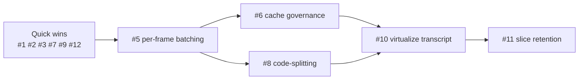

# Desktop Renderer Performance — Audit & Optimization Plan

Status: **proposed / not started.** Read-only audit of the SuperOne desktop renderer
focused on reducing **memory footprint** and **CPU consumption**. No code was changed
to produce this document; every finding is cited to `file:line` and was
adversarially verified.

**Method.** A multi-agent workflow swept 7 dimensions of the renderer
(render reconciliation, message virtualization / DOM, streaming throughput, heavy
render libraries, memory leaks / lifecycle, continuous-CPU animation, bundle /
eager-load). Each candidate finding was then independently re-checked against the
source to refute false positives. **33 of 35** candidate findings survived
verification and are consolidated into the 12 recommendations below.

---

## TL;DR — the two structural root causes

The chat transcript is the performance epicenter. Almost every confirmed finding
collapses into two compounding root causes, plus a boot-time bundle problem:

1. **CPU — no per-frame delta batching.** After hydration, every agent event runs
   `handleAgentEvent` immediately (`useAgentEvents.ts:22`) → one store `set()` per
   event (`event-slice.ts:142`) with **zero** batching. Each `content_delta`
   rebuilds the entire `session.messages` array (`content.ts:15`) and the live
   message's whole `content[]`, **re-allocating the accumulated text string every
   token**. Cost is `O(transcript)` per token and the string realloc is `O(L²)` over
   a long answer. On top of this, the live message re-lexes the **whole document**
   via `marked.Lexer.lex` every ~33 ms, and several render-path consumers
   (`compactIndices` flatMap, `useChatScroll` layout reads + trace IPC) re-fire per
   delta.

2. **Memory — the transcript is never virtualized.** `ChatContent` only **grows** its
   mounted window via `renderCount`; the `IntersectionObserver` only ever *increases*
   it and never unmounts (`ChatContent.tsx:97-121`). So DOM nodes, mounted
   `DiffView`s, base64 codex images held in React state, and unbounded caches
   (`@streamdown/code` Maps, `_bashOutputs`, `_pendingStandaloneCalls`) accumulate for
   the whole session lifetime.

3. **Boot — one ~11.7 MB eager `index` chunk.** `mermaid`, `xterm`, `recharts`, and
   `tiptap` are pulled into boot through always-mounted `ActivityPanel` / `CodingLayout`
   chains and an eagerly-imported `SettingsLayout`.

The highest-leverage moves: **(1)** a per-frame delta-coalescing layer in
`useAgentEvents` (subsumes ~6 streaming findings); **(2)** virtualize the transcript
(subsumes ~5 DOM/memory findings); **(3)** move codex images to `media://` and bound
the streamdown caches; **(4)** code-split the bundle (mostly small/medium effort, large
startup + heap wins, low risk).

> Why this is `O(N²)`, not `O(N)`: for an N-token reply, each token copies an
> array/string of size ∝ N, so total work is ∝ N². That is why long answers degrade
> progressively — the tail of a stream is the expensive part. Batching turns
> `O(tokens × transcript)` into `O(frames × transcript)`; virtualization bounds the
> resident render set to the viewport regardless of session length.

---

## Findings by dimension

| Dimension | Confirmed / Total | Core problem |
|---|---|---|
| Streaming throughput | 5 / 5 | No per-frame delta batching (root cause 1) |
| Message virtualization / DOM | 4 / 4 | Transcript never virtualized (root cause 2) |
| Render reconciliation | 5 / 6 | Per-token re-render; `O(n²)` compact-row `indexOf` |
| Heavy render libs | 4 / 5 | streamdown whole-doc re-lex + unbounded highlight cache |
| Memory leaks / lifecycle | 5 / 5 | base64 images, bash outputs, orphaned file watchers |
| Continuous-CPU animation | 3 / 3 | FireText rAF spin, permanent `willChange` GPU layer |
| Bundle / eager-load | 7 / 7 | recharts / xterm / mermaid / tiptap loaded eagerly |

---

## Root-cause → findings map

```mermaid
flowchart TD
    A["Root cause 1 — CPU<br/>no per-frame delta batching<br/>one set() per token"]
    A --> A1["content.ts:15 rebuilds whole messages[]"]
    A --> A2["event-helpers applyDelta rebuilds content[]<br/>accumulated text re-alloc/token -> O(L^2)"]
    A --> A3["streamdown whole-doc re-lex every ~33ms"]
    A --> A4["compactIndices full scan + indexOf O(n^2)"]
    A --> A5["useChatScroll forced reflow + trace IPC per delta"]

    B["Root cause 2 — memory<br/>transcript never virtualized<br/>window only grows"]
    B --> B1["DOM nodes grow linearly with history"]
    B --> B2["historical DiffViews stay mounted + token arrays resident"]
    B --> B3["codex base64 images pinned in React state"]
    B --> B4["@streamdown/code caches never evicted -> monotonic leak"]

    C["Root cause 3 — boot<br/>~11.7MB eager index chunk"]
    C --> C1["recharts via eager SettingsLayout"]
    C --> C2["xterm/mermaid/tiptap via always-mounted panels"]
```

---

## Recommendations

Three tiers: **Quick-win** (small, low-risk, independently landable),
**Medium** (needs test coverage, high payoff), **Structural** (dedicated branch +
alpha validation, largest payoff). Ranked by payoff ÷ cost within the overview's
sequencing logic.

### Tier 1 — Quick wins

---

#### 1. Lazy-load `SettingsLayout` + `UsagePage` (recharts) from `App`
**Category:** CPU + memory  **Severity:** high  **Effort:** small

- **Problem.** `App.tsx:14` statically imports `SettingsLayout`, which
  (`SettingsLayout.tsx:5-16`) statically imports all 12 settings pages including
  `UsagePage` (`UsagePage.tsx:4` pulls the full **recharts** library). Settings is only
  reachable via `Cmd+,`, yet recharts + all 12 pages land in the eager 11.7 MB `index`
  chunk and execute at boot.
- **Solution.** Wrap `SettingsLayout` in `React.lazy` + a single `Suspense` in `App.tsx`
  (one-line change). Inside `SettingsLayout`, `lazy()` each page (or at minimum
  `UsagePage`) behind one `Suspense` so recharts only loads on the Usage tab. No
  behavior change — Settings is never first paint.
- **Expected gain.** Removes recharts (~hundreds of KB parsed JS + chart runtime heap)
  and 12 page modules from boot; measurable drop in index chunk size, startup
  parse/eval CPU, and steady-state heap.
- **Risk.** Low. `Suspense` fallback flash on first Settings open; mitigate with a
  lightweight skeleton. No data-flow change.
- **Files.** `App.tsx`, `components/SettingsLayout.tsx`, `components/UsagePage.tsx`

---

#### 2. Serve codex-generated images via `media://` instead of base64 data URIs in React state
**Category:** memory (largest single win)  **Severity:** high  **Effort:** medium

- **Problem.** `useImageDataUri` (`codex-image-shared.tsx:33-54`) holds full base64 PNG
  strings in `useState` for every mounted codex image / gallery thumb; `CodexImageViewer`
  builds a **second** `new Image()` from it (lines 197-203). Because the transcript
  window only grows (never unmounts), scrolling an image-heavy codex session pins every
  thumbnail's base64 (~1.33× raw bytes in JS heap + decoded bitmap) simultaneously —
  tens of MB, unbounded. `markdown-image.tsx:110` already does the right thing with
  `toMediaUrl()`.
- **Solution.** Route codex image bytes through the existing `toMediaUrl` / `media://`
  (`local-file://`) protocol like `markdown-image.tsx`, so bytes live in the native
  image cache and free on `` unmount. If a data URI is truly needed, materialize it
  only for the currently-open `CodexImageViewer`; gallery thumbnails use the media URL.
- **Expected gain.** Largest single memory win in the set: drops tens of MB of resident
  base64 + duplicate decode in image-heavy sessions; bytes become OS / native-cache
  managed and evictable.
- **Risk.** Low-medium. `media://` plumbing already exists; risk is ensuring saved paths
  resolve and the viewer's zoom/copy still works against a URL instead of a data URI.
- **Files.** `chat/codex-image-shared.tsx`, `chat/CodexImageGalleryBlock.tsx`,
  `chat/CodexImageGenerationBlock.tsx`, `chat/markdown-image.tsx`

---

#### 3. Gate debug trace IPC + redundant `scrollHeight` reads in `useChatScroll` behind DEV
**Category:** CPU  **Severity:** medium  **Effort:** small

- **Problem.** `useChatScroll.ts:93` (and `:39`) call `window.app.trace?.('scroll', …)`
  inside a layout effect keyed on `[messages, …]`, reading
  `el.scrollHeight/scrollTop/clientHeight` purely to build a trace payload, then
  structured-cloning + sending over IPC. The renderer-side trace (`preload/index.ts:878`)
  is **not** dev-gated, and during streaming the `messages` identity changes per delta,
  so production pays a forced full-transcript reflow + IPC serialize on every token even
  though the main-process trace sink is a dev-only no-op. `scrollHeight` is also read
  twice in the same effect (line 93 trace + line 95 write).
- **Solution.** Wrap both trace calls (`useChatScroll.ts:39`, `:93`) in
  `import.meta.env.DEV` so production never reads layout solely for tracing nor crosses
  IPC. Compute `scrollHeight` once per effect run and reuse for the write.
  rAF-coalesce the `ResizeObserver` autoscroll writes (lines 113-123) so multiple
  streaming resizes per frame trigger one `scrollHeight` read.
- **Expected gain.** Removes one forced synchronous full-transcript layout + one IPC
  structured-clone per streaming delta in production; CPU scales with the un-virtualized
  transcript length so this compounds with rank 10.
- **Risk.** Very low. Line 93's layout read is load-bearing for the scroll write itself —
  keep that; only the trace-only payload + IPC is removed in prod.
- **Files.** `hooks/useChatScroll.ts`, `preload/index.ts`

---

#### 4. Cheapen `ChatContent` `compactIndices` memo key + O(1) compact-row rank lookup
**Category:** CPU  **Severity:** medium  **Effort:** small

- **Problem.** `ChatContent` subscribes to `s.messages` (`ChatContent.tsx:38-52`) whose
  identity changes every `content_delta` (`content.ts:15`), so it re-renders per token.
  `compactIndices = useMemo(() => messages.flatMap(parseCompactMarker…), [messages])`
  (`ChatContent.tsx:89-92`) re-scans the **full** transcript with a regex `.match`
  (`ChatMessage.tsx:453-457`) every token. Compact-marker rows additionally do
  `messages.indexOf(msg)` (full `O(n)` scan) + `compactIndices.indexOf`
  (`ChatContent.tsx:220-221`) per row per render — `O(n²)`. Compact markers only sit on
  immutable system messages, so they only change when a message is appended (length
  change), not when the streaming message grows.
- **Solution.** Key the memo on a cheap stable signal (`messages.length` + last message
  id) instead of array identity, or maintain `compactIndices` incrementally on append.
  Build a `Map<messageId, index>` once via `useMemo` for `O(1)` `origIdx`, or precompute
  each compact row's rank when constructing `compactIndices` so no per-row `indexOf` runs
  at render. Fix both together (same `compactIndices` + render path).
- **Expected gain.** Removes an `O(n)` regex transcript scan and the `O(n²)` compact-row
  `indexOf` from every streaming token; in long sessions this is real per-delta
  main-thread savings. Largely auto-subsumed once rank 5 batches deltas, but the
  memo-key fix is independently cheap.
- **Risk.** Very low. Pure derivation change; correctness preserved as long as the signal
  captures message-boundary changes.
- **Files.** `chat/ChatContent.tsx`, `chat/ChatMessage.tsx`

---

#### 7. Prune `_bashOutputs` and `_pendingStandaloneCalls` on session eviction / project close
**Category:** memory  **Severity:** medium  **Effort:** small

- **Problem.** `_bashOutputs` (`tool-slice.ts:17`) holds full streamed Bash / subagent
  output keyed by `toolUseId` and is pruned **only** in `clearMessagesImpl` for the
  active session (`session-lifecycle.ts:183-189`). On idle-session eviction
  (`event-slice.ts:382-393`) and project removal (`app.ts:297-303`) the session is
  dropped but its bash outputs (and their main-process file watchers — the `unwatch` IPC
  is skipped too) are not, so large output strings leak across a multi-project day.
  `_pendingStandaloneCalls` (`tool-slice.ts:67-69`) is write-only with **zero** delete
  path anywhere and survives every teardown.
- **Solution.** On idle-evict and `removeRecentFolder`, reuse `clearMessagesImpl`'s
  `tool_use`-ID set loop (`session-lifecycle.ts:176-189`) for the evicted session, call
  `window.app.unwatchBashOutput` for each id present, and delete those `_bashOutputs` and
  `_pendingStandaloneCalls` entries. Also delete a `_pendingStandaloneCalls` entry once
  its standalone call resolves. Optionally cap `_bashOutputs[id].content` to the last N
  lines/bytes in memory, since `ToolBlock`'s `readBashOutputMore` disk-paging can load
  older lines on demand.
- **Expected gain.** Bounds two write-only / under-pruned stores; reclaims potentially
  large bash/subagent output strings on session/project teardown and stops orphaned
  main-process file watchers from streaming into dead entries.
- **Risk.** Low. Pruning logic already exists in `clearMessagesImpl`; main risk is
  unwatching an id still referenced elsewhere — guard by building the set from the
  session actually being removed.
- **Files.** `stores/chat-store/slices/tool-slice.ts`,
  `stores/chat-store/slices/event-slice.ts`,
  `stores/chat-store/helpers/session-lifecycle.ts`, `stores/app.ts`

---

#### 9. Memoize MCP/mini-app lookups, `mermaid.initialize`, FireText visibility gate, `willChange`, timer cleanup
**Category:** CPU  **Severity:** low  **Effort:** small

A bundle of small, independent hygiene issues:

- **(a)** `ToolBlock.tsx:248-251/387/436` run `mcpLibrary.find` + `miniApps.find` +
  `parseMcpToolName` unmemoized in the render body on every input-delta re-render (only
  for MCP / mini-app blocks). → Wrap the `serverName → icon` and `slug → app` lookups in
  `useMemo` keyed on `[serverName, mcpLibrary]` / `[mcpSlug, miniApps]`, or precompute
  Maps via a store selector.
- **(b)** `FireText.tsx:80-118` runs an unconditional self-rescheduling rAF particle loop
  with only unmount teardown — burns ~60 fps main + GPU when MAX effort is selected and
  the window is idle-but-visible; `index.css:40-59` `.rainbow-text` / `.fire-text-glow`
  infinite keyframes run while mounted. → Pause the rAF loop on `document.hidden` via
  `visibilitychange` (resume on visible) or only animate on a hover/selection burst;
  apply `animation-play-state: paused` to the infinite CSS keyframes when hidden.
- **(c)** `MermaidBlock.tsx:116-120` re-runs `mermaid.initialize` per block/effect/theme
  toggle. → Hoist to once (module init or ref-guarded, re-keyed only on theme).
- **(d)** `CodeMinimap.tsx:255` sets `willChange: 'transform'` permanently though the
  container never transforms, pinning a ~1500px GPU layer. → Drop it (`contain: 'strict'`
  already gives the useful isolation).
- **(e)** `MermaidBlock` copy-reset `setTimeout` (139-143) is never cleared on unmount. →
  Store the timeout id in a ref and clear on next copy + unmount.

- **Expected gain.** Each is small individually; aggregate trims idle main-thread / GPU
  burn (FireText), per-render scans (ToolBlock), redundant mermaid init, and standing
  compositor VRAM (minimap).
- **Risk.** Very low. Cosmetic/decorative paths; FireText burst-only behavior is a minor
  UX change worth confirming with the user.
- **Files.** `chat/ToolBlock.tsx`, `chat/FireText.tsx`, `chat/MermaidBlock.tsx`,
  `coding/CodeMinimap.tsx`, `styles/index.css`

---

#### 12. Defer boot Shiki preload and trim eager lobehub brand-icon imports
**Category:** CPU + memory  **Severity:** low  **Effort:** medium

- **Problem.** **(a)** `App.tsx:90` calls `preloadFileHighlighter()` synchronously in the
  boot effect, firing 10 `createHighlighter` / `loadLanguage` grammar+theme loads
  (`diff-utils.tsx:98-105`) plus `createJavaScriptRegexEngine` at module scope on the
  boot main thread before any diff is shown. **(b)** `ProviderLabel.tsx:3` statically
  imports 19 `@lobehub/icons` brand SVGs into the eager chat chain
  (`ChatSuggestions → ChatContent`), though typically only one icon (Claude/OpenAI) ever
  renders.
- **Solution.** **(a)** Defer `preloadFileHighlighter()` behind `requestIdleCallback`, or
  trigger it on first code/diff view instead of the synchronous boot effect (the chat
  `codePlugin` is already lazy, so the "two Shiki instances" concern is moot — only the
  diff preload needs deferring). **(b)** Map `provider → icon` through a lookup that
  references only the handful actually used, or dynamic-import the specific
  `@lobehub/icons` entry on demand, so unused brand SVG modules leave the eager chat
  chunk.
- **Expected gain.** **(a)** Removes 10 async grammar/theme loads from the boot
  main-thread critical path (CPU-on-boot, not bundle size — grammars are already split
  into separate chunks). **(b)** Modest bundle/heap trim of unused brand SVG path data.
- **Risk.** Low. Deferring preload may show a brief un-highlighted flash on the very first
  diff before grammars load; acceptable. Icon lookup must cover all providers to avoid a
  missing-icon regression.
- **Files.** `App.tsx`, `lib/diff-utils.tsx`, `components/ProviderLabel.tsx`

---

### Tier 2 — Medium (needs test coverage, high payoff)

---

#### 5. ⭐ Coalesce streaming deltas into one per-frame store commit
**Category:** CPU + memory  **Severity:** high  **Effort:** medium

> **The single highest-leverage fix.** It is the root cause behind the per-delta
> `set()`, the `O(n²)` `applyDelta`, the codex item copies, `lastEventAt`
> cache-busting, the `compactIndices` re-scan, and the `useChatScroll` reflow.

- **Problem.** After hydration every agent event runs `handleAgentEvent` immediately
  (`useAgentEvents.ts:22`) → one `set()` per event (`event-slice.ts:142`) with zero
  batching (no rAF / microtask / `unstable_batchedUpdates` anywhere in the chat store).
  Each `content_delta` rebuilds the whole `session.messages` array (`content.ts:15` map)
  and the live message's whole `content[]` (`event-helpers` `applyDelta`), re-allocating
  the accumulated text string every token (~`O(L²)`). **Codex is worse:**
  `codex_item_delta` re-sends the **entire** cumulative item text per delta and copies
  `messages[]` + `items[]` each time (`codex.ts:49-72`, `codex-helpers.ts:28-34`).
- **Solution.** Add a coalescing queue in `useAgentEvents` (or wrapping
  `handleAgentEvent`) that buffers high-frequency append-only deltas (`content_delta`
  text/thinking, `tool_input_delta`, `codex_item_delta`) per session and flushes them in
  a **single** `set()` per `requestAnimationFrame`, applying all queued deltas at once.
  Keep state-critical / ordering events (`message_start`, `message_complete`,
  `permission_request`, `status_change`) **un-batched and flushed immediately** — but
  flush the queued deltas for that session first so ordering is preserved. For codex,
  dedupe identical consecutive cumulative item states before committing. This collapses N
  per-token sets into ~60/sec: `messages.map` and content rebuild happen once per frame,
  and the text string concatenates once per frame instead of per token.
- **Expected gain.** High CPU + GC reduction during fast streaming — turns
  `O(tokens × transcript)` into `O(frames × transcript)`, and the `O(L²)` string realloc
  into `O(L²/batch)`. Directly subsumes most of rank 4 and the streaming-throughput
  findings; cuts main-thread time and garbage dramatically on long fast answers.
- **Risk.** Medium. **Ordering is the trap:** queued deltas for a session **must** flush
  before any immediate critical event for that session, and on interrupt / complete /
  unmount. Contained to one hook + a flush helper; needs replay-recording tests (existing
  event-recording harness) to prove no message corruption.
- **Files.** `hooks/useAgentEvents.ts`, `stores/chat-store/slices/event-slice.ts`,
  `stores/chat-store/event-reducer/content.ts`, `stores/chat-store/event-reducer/codex.ts`,
  `stores/chat-store/helpers/codex-helpers.ts`

---

#### 6. Bound the `@streamdown/code` highlight caches and split streaming markdown re-lexing
**Category:** CPU + memory  **Severity:** high  **Effort:** large

Two coupled streamdown costs:

- **CPU.** The actively-streaming message re-lexes the **whole document** via
  `marked.Lexer.lex` every ~33 ms (`CopyableMarkdown.tsx:22` `STREAMING_THROTTLE_MS` +
  streamdown internals); plus full-document `normalizeCodeFences` / `splitByInsightBlocks`
  scans keyed on the whole text — `O(N)` per tick ⇒ `O(N²)` over a long answer.
- **Memory.** `@streamdown/code` holds three module-level Maps (highlighter-per-lang,
  result cache keyed by code length+head+tail, pending) with **no eviction**; each
  streaming code-fence delta produces a unique string ⇒ a permanent cache entry ⇒
  monotonic leak not cleared on project/session switch (`disposeHighlightCache` only
  clears the **separate** in-repo bounded cache).

- **Solution.** *CPU:* feed only the **unstable tail** to the heavy parser — render
  completed blocks (everything before the last fence/paragraph boundary) once and only
  re-lex/re-scan the growing tail; memoize `normalizeCodeFences` / `splitByInsightBlocks`
  on a cheap prefix signature so per-tick work is proportional to the appended delta.
  *Memory:* avoid driving intermediate streaming code strings through
  `codePlugin.highlight` (gate highlight until the fence closes / `isStreaming === false`,
  or debounce), and on project switch / session reset recreate the `codePlugin` singleton
  (`chat-shared.ts:14`) to release accumulated highlighters / token caches; where
  feasible route code through the in-repo bounded `HighlightCache` (LRU 100/project) which
  is already disposed on project switch.
- **Expected gain.** *CPU:* removes whole-document re-lex per tick for the live message —
  large win on long fast-streamed answers. *Memory:* converts a monotonic per-session leak
  into a bounded/evictable cache, reclaiming code-highlight heap on session/project switch.
- **Risk.** Medium-high. Prefix/tail splitting must respect markdown block boundaries
  (unterminated fences) to avoid flicker/incorrect rendering; singleton recreate must not
  race in-flight async highlights. Needs visual regression checks on streaming code blocks.
- **Files.** `chat/CopyableMarkdown.tsx`, `chat/CodeBlock.tsx`, `chat/chat-shared.ts`

---

#### 8. Lazy-load xterm + mermaid editor path + tiptap off the always-mounted boot chains
**Category:** CPU + memory  **Severity:** high  **Effort:** medium

Three heavy libs load eagerly into the 11.7 MB `index` chunk via always-mounted chains:

- **(a) xterm.** `TerminalPanel` (`TerminalPanel.tsx:3-9`) eagerly imports xterm + 5
  addons incl. WebGL; `CodingLayout.tsx:92` mounts it CSS-hidden but never unmounts —
  loaded on every coding boot (the default mode).
- **(b) mermaid.** `mermaid-view.tsx:11` statically imports `MermaidPreview` from the
  eager-mermaid module (`MermaidBlock.tsx:5` `import mermaid`), dragging the full mermaid
  engine through the always-mounted `ActivityPanel → FilePreview` chain even though the
  chat path already lazy-loads it and `mermaid-view` itself uses `await import('mermaid')`.
- **(c) tiptap.** `MarkdownEditor.tsx:2-20` statically imports tiptap + runs
  `createLowlight(common)` (~35 grammars) at module scope, also via the always-mounted
  `ActivityPanel` chain.

- **Solution.** **(a)** Render `TerminalPanel` only when `termOpen || hasTerminals` **and**
  convert its xterm/addons imports to dynamic `import` (conditional mount alone won't drop
  xterm from index). **(b)** Split `MermaidPreview` (pure SVG wrapper) into its own module
  so `mermaid-view` imports the wrapper without `import mermaid`; keep `import mermaid` only
  inside lazy `MermaidBlock`. **(c)** Register `FilePreview` / `MarkdownEditor` as a lazy
  dockview panel and defer `createLowlight(common)` until the editor mounts (or register
  only needed grammars). Add `manualChunks` rules (`electron.vite.config.ts:86-95`) so
  recharts/dockview/tiptap/xterm/mermaid land in their own chunks.
- **Expected gain.** Large startup CPU + bundle + boot-heap reduction: xterm WebGL
  instantiation, full mermaid engine parse, and the ~35-grammar lowlight registry all move
  off the boot path to first-actual-use. Shrinks the eager index chunk meaningfully.
- **Risk.** Medium. Dockview lazy-panel registration and Suspense boundaries inside the
  coding layout need care; terminal must still attach correctly on first open. The
  mermaid-view split is a pure module move (low risk).
- **Files.** `coding/CodingLayout.tsx`, `coding/TerminalPanel.tsx`,
  `coding/extensions/mermaid-view.tsx`, `chat/MermaidBlock.tsx`, `coding/MarkdownEditor.tsx`,
  `electron.vite.config.ts`

---

### Tier 3 — Structural (dedicated branch + alpha validation)

> Per project convention ([memory: *Large refactors on a new branch*,
> *Alpha testing > feature flags*]): these are design changes, not patches. Land them on
> a dedicated branch and validate wholesale in alpha — no feature flag / gradual rollout.

---

#### 10. ⭐ Virtualize the chat transcript and collapse off-latest diffs
**Category:** CPU + memory  **Severity:** high  **Effort:** large

> **The largest structural win.** Bounds live DOM, mounted DiffViews/token arrays, and
> codex image mounts to the viewport regardless of session length.

- **Problem.** The transcript has no windowing that unmounts. `ChatContent` renders
  `renderedMessages.map` into a plain flex column in one `ScrollArea`
  (`ChatContent.tsx:215-217`); the only bound is `renderCount`, which the
  `IntersectionObserver` only ever **increases** (`ChatContent.tsx:114`) and never shrinks —
  scrolling up monotonically grows the mounted set toward full history. Each `ChatMessage`
  expands to multiple `ToolBlock` / `DiffView` subtrees, and Edit/Write/FileChange diffs
  auto-expand and stay mounted in every historical message (`ToolBlock.tsx:343-352`), each
  keeping a mounted virtualizer + two token arrays + a `requestIdleCallback` width-measure
  that scans **all** lines (`diff-utils.tsx:543-557`). So DOM-node memory and
  style/layout-recalc CPU scale linearly with scrolled-through history.
- **Solution.** Virtualize the transcript with `@tanstack/react-virtual` (already a
  workspace dep, used in `ProjectHistoryList` / `FileTree` / `diff-utils`) keyed by message
  id, with dynamic `measureElement`, generous overscan, and bottom-anchoring for streaming;
  off-screen messages unmount so live node count is bounded by viewport + overscan. Drive
  the existing near-bottom autoscroll (`useChatScroll`) off the virtualizer's total size
  instead of raw `scrollHeight`. Additionally, auto-expand diffs only within the most recent
  assistant turn and render historical diffs as a one-line summary until clicked, and gate
  the diff width-measure to run only when on-screen. The virtualizer must absorb
  `ChatContent`'s compact-marker expand-level logic and the load-more observer.
- **Expected gain.** Largest structural memory + CPU win: bounds live DOM nodes, mounted
  DiffViews/token arrays, and codex image mounts to the viewport regardless of session
  length; removes layout/style recalc that scales with history. Subsumes the
  bash-output/image retention pressure on the DOM side and makes the unbounded `messages`
  array tolerable.
- **Risk.** High. `ChatContent` mixes compact-marker expand levels, the
  `IntersectionObserver` load-more, the per-message wrapper, and bottom-anchored streaming
  autoscroll — the virtualizer must absorb all four without breaking scroll position on
  stream, fork/rewind, or session switch. Off-latest diff collapse must not disrupt the
  grid `1fr`/`0fr` expand animation (`ToolBlock.tsx:627-657`). Do on a dedicated branch with
  recording-replay + manual scroll regression testing.
- **Files.** `chat/ChatContent.tsx`, `chat/ChatMessage.tsx`, `chat/ToolBlock.tsx`,
  `lib/diff-utils.tsx`, `hooks/useChatScroll.ts`

---

#### 11. Bound the active-session messages array with a recent-slice retention model
**Category:** CPU + memory  **Severity:** medium  **Effort:** large

- **Problem.** There is no size cap on `session.messages` — no `MAX_MESSAGES` / trim exists
  (only user-initiated fork/checkpoint splices). The active session is never evicted
  (idle-evict only touches non-active sessions, `event-slice.ts:366-394`). Because
  `content.ts:15` maps the entire messages array per `content_delta` and `event-slice`
  spreads `_sessions` / `projectSessions` every event, per-delta cost is
  `O(total messages)` and heap holds every content block of a multi-hour session resident
  even though older messages already persist to SQLite and re-hydrate on scroll-up via
  `_historySessionId`.
- **Solution.** Introduce a retention split: keep only a bounded recent slice of messages
  live in the Zustand store for the active session; older messages stay in SQLite and
  re-hydrate on scroll-up (the `_historySessionId` hydration path already exists). This caps
  both the `O(n)` per-delta immutable map/spread cost and the resident content-block heap.
  **Land this *after* virtualization (rank 10)** so the render window and the store array
  shrink together rather than fighting.
- **Expected gain.** Bounds active-session heap on long fast-streaming sessions and caps the
  per-delta `messages.map` at the retained slice size instead of full history — gradual CPU
  rise on multi-hour sessions flattens; combined with batching (rank 5) the per-delta copy
  becomes `O(slice)` per frame.
- **Risk.** High. Touching the in-memory transcript model risks scroll/hydrate/rewind/fork
  regressions and message loss if the SQLite backstop or re-hydration boundary is wrong.
  Design change, not a patch — dedicated branch, alpha-validated wholesale.
- **Files.** `stores/chat-store/slices/event-slice.ts`,
  `stores/chat-store/event-reducer/content.ts`,
  `stores/chat-store/helpers/session-lifecycle.ts`

---

## Recommended sequencing

The findings have a **subsumption** structure — landing the big ones auto-resolves
several small ones, so order by dependency, not by number:

1. **Quick wins first** (`#1`, `#2`, `#3`, `#7`, `#9`, `#12`): each independent and
   low-risk; ship for immediate relief while the bigger work is scoped.
2. **`#5` per-frame batching**: single-point root cause for most streaming CPU/GC; also
   auto-subsumes `#4`. Land with replay-recording tests.
3. **`#6` cache governance + `#8` code-splitting**: plug the monotonic streamdown leak and
   shrink the eager index chunk.
4. **`#10` virtualization → `#11` slice retention**: structural surgery on a dedicated
   branch, alpha-validated wholesale. Order matters — virtualize the render window before
   trimming the store array so they shrink together.

---

## Measurement plan

Every fix is measured against the **same** deterministic token stream, not a live model.

- **Baseline harness.** Run the existing event-recording replay (`scripts/recordings` +
  `reference_desktop_recording_replay_tests.md`) to drive a deterministic long
  fast-streaming session through the real store / `ChatContent`.
- **Streaming CPU (`#4`,`#5`,`#6`).** Wrap `handleAgentEvent` and `applyDelta` with
  `performance.mark/measure` (or `console.time`) to capture per-delta and per-frame
  store-commit time; before/after batching, assert `set()` call count drops from ~1/token
  to ~60/sec and total main-thread time over a fixed N-token replay falls. React Profiler:
  confirm `ChatContent` / `ChatMessage` commit count per second drops and that only the live
  message subtree commits.
- **GC / array churn (`#5`,`#11`).** DevTools Performance + Memory track ("Allocation
  instrumentation on timeline") during the replay — confirm the per-token
  `messages[]`/`content[]`/string allocation sawtooth flattens after batching; cross-check
  with `performance.memory.usedJSHeapSize` sampled per second.
- **Whole-document re-lex (`#6`).** `performance.mark` around the streamdown lex /
  `normalizeCodeFences` / `splitByInsightBlocks` calls (or DevTools Bottom-Up filtered to
  `Lexer.lex`) on a long-answer replay; assert per-tick parse time stops scaling with
  document length (flat instead of rising) after prefix/tail splitting.
- **Memory leaks / retention (`#1`,`#2`,`#6`,`#7`).** Chrome DevTools heap snapshots,
  3-snapshot technique — snapshot, scroll through an image-heavy codex session + multiple
  project switches, snapshot, force GC, snapshot; diff retained size. Before `#2`, expect
  base64 strings (large "string" retainers) and `ImageBitmap` growth; after, gone. For
  `#6`/`#7`, filter for `@streamdown/code` Map entries and
  `_bashOutputs`/`_pendingStandaloneCalls` retainers and assert they shrink/clear on
  session+project switch.
- **DOM / virtualization (`#10`).** `document.querySelectorAll('[data-message-id]').length`
  before/after — assert it becomes bounded (~viewport+overscan) regardless of transcript
  length; DevTools Performance "Recalculate Style"/"Layout" time per scroll should stop
  scaling with history. Confirm scroll position, fork/rewind, and session-switch behavior
  with recording-replay scroll regression checks.
- **Bundle (`#1`,`#8`,`#12`).** Compare `apps/desktop/out/renderer/assets/index-*.js` size
  before/after each split, and add `rollup-plugin-visualizer` (or `vite build --mode
  analyze`) to confirm recharts/xterm/mermaid/tiptap moved out of the index chunk into their
  own lazy chunks. Use the Coverage tab to verify those chunks are NOT executed on a
  chat-only boot.
- **Startup CPU (`#1`,`#8`,`#12`).** `performance` marks at app entry (`main.tsx`) through
  first-meaningful-paint; DevTools Performance "Bottom-Up" filtered to module eval
  (`createLowlight`, mermaid init, `createHighlighter`) before/after — assert those frames
  disappear from the boot critical path. Sample 5 cold starts, compare medians.
- **Idle CPU (`#9` FireText).** DevTools Performance recording of an idle window with MAX
  effort selected — assert the continuous rAF particle frames and infinite CSS keyframe
  paint stop when `document.hidden` / the visibility gate engages; check the Rendering tab
  "Frame Rendering Stats" for idle dropped frames going to zero.
- **Process-level (overall).** `app.getAppMetrics()` / `process.getProcessMemoryInfo()` (or
  the in-repo `perf-trace.ts` `messagesTotal`/`toolBlocksTotal` counters and
  `chrome://process-internals`) to track renderer RSS and CPU% over a sustained multi-hour
  multi-project session before/after the structural fixes (`#10`,`#11`), proving the linear
  growth flattens.

---

## Appendix — confirmation summary

- **15** agents, **361** tool calls, **~1.58 M** subagent tokens.
- **33 / 35** candidate findings survived adversarial verification (2 refuted).
- Per-dimension confirmed: streaming 5/5, virtualization 4/4, reconciliation 5/6,
  heavy-libs 4/5, memory-leaks 5/5, animation 3/3, bundle 7/7.
