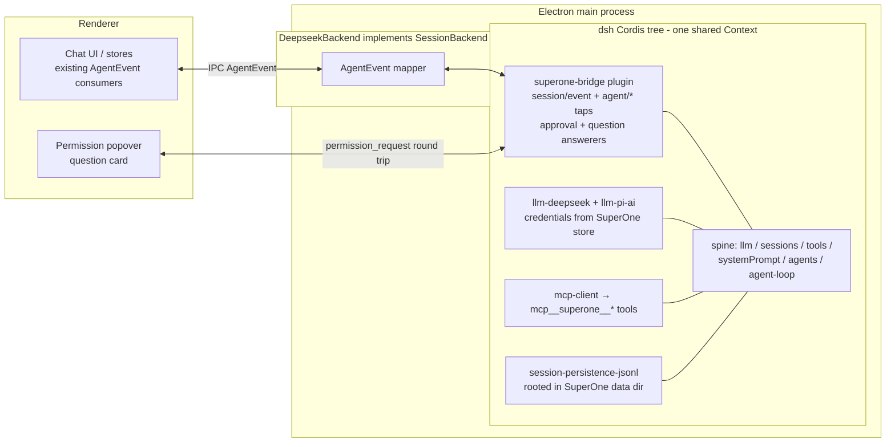

# DeepSeek Harness (dsh) Integration — Route D: In-Process Cordis Embedding (Draft)

Status: **in progress** — Route D executing. P0 (contract) + P1 (runtime/backend/credentials) + P2 (live model catalog → renderer resources, session defaults) landed; P3 partial (pickers, icon, permission subset, context gauge); P4 started — native tool plane (fs/shell/search/todo + permission gate) landed; MCP mount / resume / fork / subagents / permission presets still pending
Last updated: 2026-08-19

> Execution note (P2): `dsh-permission-presets` hard-requires a mounted *confining* bash executor (`ctx.shell.sandboxMode`) and `ctx.approval` — its constructor throws otherwise. The D5 preset vocabulary therefore lands together with the P4 bash-executor mount, not before. Until then the chat bar shows the shared-mode subset the backend honors (`default` = ask, `bypassPermissions` = auto-allow).
Spike: [`docs/draft/deepseek-harness-spike.mjs`](./deepseek-harness-spike.mjs) (reproducible; see Appendix)
Related: `.agents/skills/superone-harness/` (new-harness roadmap, event contract, experiences matrix), `docs/design/cursor-sdk-harness.md` (breadth reference: 152 files / 7 commits)

---

## 1. Decision summary

Integrate DeepSeek Harness (`dsh`, `@deepseek-ai/dsh-*`) as a new SuperOne harness by **embedding its Cordis plugin tree in-process** and writing SuperOne-owned Cordis plugins that bridge dsh's seams to SuperOne's `AgentEvent` contract, HITL surfaces, and tool plane.

Identity boundary: SuperOne's canonical `HarnessId`, `NodeHarnessId`, AgentEvent `providerId`, and
base SessionProvider prefix are all `dsh` (`dsh-base`). `DeepSeek` / `deepseek` remain the product
name, brand key, API-provider id, i18n/label keys, and package/file names. The harness has never
shipped, so there is deliberately **no back-compat path** for the pre-rename `deepseek` id: no DB
migration, no settings alias — a dev database written before the rename must be re-seeded.

This is different from every existing harness (Claude = black-box SDK, Codex = spawned binary, ACP = wire protocol, Cursor = SDK + local store): dsh is a **white-box plugin tree** — MIT-licensed, all-TypeScript, published on npm — so the bridge logic lives *inside* the engine as first-class plugins instead of adapting an event stream at the boundary. This is also the only route that delivers cancel + HITL approval today:

| Route | Cancel | HITL approval | Streaming | Verdict |
|---|---|---|---|---|
| A. ACP server (`@deepseek-ai/dsh-acp`) | ✅ | one-shot only | ❌ committed messages only | automation-grade; rejected |
| B. SDK subprocess (`@deepseek-ai/dsh-sdk-client`) | ❌ no wire method | ❌ unimplemented on wire | ✅ | hard gaps; rejected for now |
| C. Web Client protocol (Connection `/api` + Typert RPC) | ✅ | ✅ | ✅ | full fidelity but generated-artifact coupling; fallback option |
| **D. In-process embedding (this plan)** | ✅ verified | ✅ verified | ✅ verified | **chosen** |

dsh is in **developer preview** (`0.1.0-rc.7` at time of writing) with breaking changes promised. §11 owns the version strategy; the short version is: exact-pin the whole family, keep the spike as a smoke test, absorb breakage on explicit upgrades only.

---

## 2. What dsh is (one paragraph)

dsh is built on [Cordis](https://github.com/cordiverse/cordis): every part of the product — model adapter, tool registry, session log, agent loop — is a plugin contributing services (`ctx.llm`, `ctx.tools`, `ctx.sessions`, `ctx.agents`, `ctx.approval`, …), typed events, and reversible registrations to a shared context. The session log is an append-only `SessionEvent` stream (`turn/*`, `step/*`, `assistant/chunk`, `tool/call`, `tool/result`, `todo/write`, …) from which model history is *derived*; "model-visible means logged" is a runtime invariant. Capability seams (fs, subprocess, shell, sandbox, subagent, approval, questions) are swappable provider triangles. Plugins mount and unmount at runtime with effects unwinding cleanly.

---

## 3. Verified facts (experiments, 2026-08-18)

All experiments ran against the **published npm packages** `@deepseek-ai/*@0.1.0-rc.7` (not the repo checkout), which is exactly how SuperOne will consume them. Full script: `deepseek-harness-spike.mjs`; runs green under **both Node 24 and bun 1.3.9**.

| # | Experiment | Result |
|---|---|---|
| E1 | `bun add @deepseek-ai/dsh` | ✅ 524 packages, 195 `@deepseek-ai/*`, complete `lib/` + `.d.ts` + `src/` in every package. No sqlite/native deps in the core path. 4 postinstalls blocked by default; only `dsh-subprocess-local` (spawn helper) and `koffi` need trusting, and only when the bash/PTY executors are mounted. |
| E2 | In-process boot: `new Context()` + 8 `ctx.plugin(...)` calls (Timer, LlmRuntime, SessionStore, SystemPrompt, ToolRuntime, AgentRegistry, ApprovalService, AgentLoop) + a mock `LlmAdapter` on route `mock` | ✅ Bridge plugin activates via `inject: ['agents','llm','tools','sessions']`; `agents.create()` → `followup()` produces the full durable stream: `turn/start → step/start → user/message → request/header → request/context → assistant/chunk×N → assistant/message(+usage) → step/end → turn/end {kind:'completed'}` |
| E3 | Custom tool via `ctx.tools.register(...)` + scripted tool-call | ✅ `tool/call` → pipeline → `tool/result` → automatic second step → final text, one turn. Tool schemas assembled into `request/header.tools` automatically. |
| E4 | HITL: `tools/pre-execute` waterfall returns `{kind:'ask'}`, `approval/request` waterfall answered in-process after a delay | ✅ Approval intercepts the call, an async answerer returning `'allowed-once'` resumes execution, and dsh logs `approval/asked` / `approval/decided` audit events into the session log for free. |
| E5a | Mid-turn cancel: `agent.cancel({kind:'user'})` during streaming | ✅ Stream stops, `turn/end {kind:'aborted', reason:{kind:'user'}}`, agent returns to `idle`, next turn works normally. |
| E5b | Runtime hot mount/unmount: `ctx.plugin({...registers tool 'extra'})` then `fiber.dispose()` | ✅ Model-visible tool list goes `[extra, ping]` → `[ping]` across turns. Reversible-effects model confirmed end-to-end. |

Additional verified facts from source/docs review:

- **`llm-pi-ai`** is a generic multi-provider adapter (config-keyed provider profiles; OpenAI-compatible gateways are configuration, not code).
- **`mcp-client`** registers external MCP server tools on `ctx.tools` — SuperOne's `mcp__superone__*` surface plugs in without new code.
- **Subagent providers** include `subagent-claude-code` and `subagent-codex` — dsh can delegate to our other harnesses as subagents.
- dsh anticipates Electron embedding: the connection layer has an in-process carrier, and `dsh-host-webserver` documents "Electron loads dist over `file://` and carries fetch over an IPC bridge".
- `ctx.sessions.fork(source, boundary?, childSessionId?)` and `agents.resume({resumeSessionId})` exist; persistence is `dsh-session-persistence-jsonl` (zstd-compressed JSONL, seed-replay on resume).

### Footguns found by the spike (encode these in the backend)

1. **`resolveModel()` is strictly validated** — must return `{provider, id, name}` echoing the exact route/id, else `INVALID_MODEL_INFO` fails the turn.
2. **Send-after-turn is latched** — a `followup()` submitted between `turn/end` and the idle transition can park in the inbox without opening a turn. Await `agent.whenIdle()` before treating the agent as ready, and treat parked input as "queued message" UI state.
3. **Family versions are lockstep** — all `@deepseek-ai/dsh-*` must be the same exact version; never mix.
4. **The default system prompt announces dsh identity** — `SystemPrompt` config (`includeHarnessIdentity`, `persona`) is where SuperOne branding/persona goes.
5. **`agent/status` payload is `{agent, status}`** (single object), and the agent id is `agent.id` (= `SessionId`).

---

## 4. Architecture overview



One dsh `Context` per app lifetime hosts N agents (one per SuperOne dsh session); each `agents.create()` gets its own scoped `agent.ctx`, `cwd`, model route, and inbox. The backend never reaches into loop internals — everything flows through documented seams, exactly like the spike.

---

## 5. Design decisions

### D1 — Process model: Electron main, in-process (like Claude), utilityProcess deferred

The Claude harness already runs an agent engine inside main; dsh's minimal spine adds no native modules and no server. Start in-process for parity and debuggability. Revisit `utilityProcess` isolation only if profiling shows loop work competing with IPC/UI duties, or when the bash/PTY executors (which spawn real processes) land. The composition is carrier-agnostic, so the move is mechanical later: the bridge plugin stays identical; only the AgentEvent transport changes from function call to MessagePort.

### D2 — One shared Context, one agent per SuperOne session

The ACP bridge and Web host both run many sessions on one tree; per-agent isolation comes from scoped contexts (`agent.ctx`) and scope-filtered event dispatch (`tools/pre-execute` etc. are Scoped). SuperOne does the same: a lazily-booted singleton tree in `@superone/deepseek`, `agents.create({sessionId, meta:{cwd}, agentOptions:{provider, model, maxTokens}})` per session, `handle.dispose()` on close. Per-session tool/capability differences use `CreateAgentOptions.setup` (composes the agent's scoped world before publication).

### D3 — Composition: manual spine, no Loader/YAML/profiles

`dsh`'s CLI boots from profile YAML through the Loader; `agent-spine-demo` proves the same tree composes with plain `ctx.plugin(...)` calls. SuperOne owns configuration already (settings store, credentials, per-session options), so we compose programmatically and skip: Loader, `$DSH_HOME` profiles, `settings-file`, `credentials-local`, telemetry, webserver, the entire `client/*` and `host/*` planes. Initial plugin set (verified minimal + product needs):

| Plugin | Why |
|---|---|
| `cordis-plugin-timer`, `dsh-llm`, `dsh-session`, `dsh-system-prompt`, `dsh-tools`, `dsh-agent`, `dsh-agent-loop` | the verified minimal spine |
| `dsh-user-approval` (policy `ask`), `dsh-user-questions` | HITL seams the bridge answers |
| `dsh-permission-presets` | semantic source for the displayed permission vocabulary (Q2 decision) |
| `dsh-llm-deepseek`, `dsh-llm-pi-ai`, `dsh-llm-retry`, `dsh-token-meter` | model routes + retry + accounting |
| `dsh-session-persistence-jsonl`, `dsh-session-checkpoint-policy` | durability + resume |
| `dsh-compaction-basic`, `dsh-session-projection` | context compaction + durable subagent identity |
| `dsh-tool-todo` | `todo/write` → TODO panel |
| `dsh-subprocess-local`, `dsh-bash-local`, `dsh-shell-env`, `dsh-tool-bash` | bash execution (needs postinstall trust; see E1) |
| `dsh-fs-local`, `dsh-fs-observation-policy`, `dsh-tool-fs` | read/write/edit tools |
| `dsh-subagent` + `dsh-subagent-spawn-in-process` + `dsh-tool-subagent` | subagents (P4) |
| `dsh-mcp-client` | mount `mcp__superone__*` (P4) |
| `dsh-invariants` + per-package invariant companions | keep on in dev builds; they catch bridge mistakes loudly |

Skills, goals, workflow, jobs, e2b, LSP, terminal: deferred until a product decision wants them — each is one `ctx.plugin` line away.

### D4 — The bridge is a Cordis plugin; the backend is thin

`superone-bridge` (inside `packages/deepseek`) is a dsh plugin with `inject: ['agents','llm','tools','sessions']`. It owns: session/event tap → AgentEvent mapping (§6), `approval/request` + question answering (D5), agent registry bookkeeping. `DeepseekBackend implements SessionBackend` holds the per-session façade (send/interrupt/setModel/…) and calls into the bridge. This keeps all dsh vocabulary in one file pair and the backend looking like every other backend to the rest of SuperOne.

### D5 — HITL mapping

- `approval/request` (waterfall, carries `agent`, `toolName`, `callId`, `reason`, abort `signal`) → emit `permission_request` with the already-streamed tool block (`callId` matches the `tool/call` event we already mapped). User's answer resolves the waterfall: allow → `'allowed-once'`, deny → `'rejected'`; a withdrawn request (signal abort) clears the popover. dsh's own `approval/asked`/`approval/decided` audit events are mapped to nothing (UI already reflects the round trip) but keep sessions replayable.
- Which calls ask: dsh's approval policy (`'ask'` default) + our own `tools/pre-execute` policy listener. **Decided 2026-08-18: the displayed mode vocabulary is dsh's own permission presets** — mount `dsh-permission-presets` as the semantic source and register its preset names in the mode-list module, following the Codex precedent (shared `PermissionMode` stays the carrier type across the ~40 store/wire surfaces; the popover, status bar, and mode list show dsh preset names mapped onto it). SuperOne's permission popover remains the presentation; the seam is the integration point.
- `ctx.userQuestions` provider → `ask_user_question` AgentEvent; same round-trip pattern.

### D6 — Tool plane: MCP first, native second

**Landed (P4a) — native tools, per agent scope.** `packages/deepseek/src/tool-plane.ts` mounts `subprocess-local` + `fs-local` + `bash-local` + `shell-env` and the `read/write/edit`, `glob/grep`, `bash`, `todo_write` tools inside `agents.create({setup})`. Two dsh mechanics carry it:
- registrations made under an agent's scoped context file into *that agent's* tool layer (`ctx.tools` resolves per scope key), so one shared tree still gives each session its own tool set;
- `agentCtx.isolate('subprocess'|'fs'|'shell'|'shellEnv')` gives the executors a private service realm. Without it the first session's `ctx.fs`/`ctx.shell` land in the ROOT realm — process-global, rooted at that session's cwd — and session two silently resolves relative paths against session one's workspace. (Same hazard `dsh-agent-presets` guards with `leakedServices`.) Covered by the "keeps each session rooted in its own cwd" test.

**Permission gate.** dsh's own `ctx.approval` only fires for *sandbox escalation*, and with an unconfined `bash-local` that never happens — so mounting tools without a gate would run `write`/`bash` with no prompt at all. A SuperOne-owned `tools/pre-execute` listener (scope-filtered to the agent) allows read-only tools (`read`, `read_image`, `glob`, `grep`, `todo_write`) and asks for everything else. It asks through the backend's own answerer rather than returning dsh's `{kind:'ask'}`, because `approval.request` carries only a tool name while the popover renders the call — the bash command, the file being written. `bypassPermissions` short-circuits in the backend, so both paths share one mode check.

**Naming.** dsh's argument shapes already match Claude's (`file_path`, `command`, `old_string`…), so the event mapper renames `read/write/edit/bash/glob/grep/todo_write` to the canonical `Read/Write/Edit/Bash/Glob/Grep/TodoWrite` and the existing renderers (Bash terminal view, edit diff, todo panel) light up unchanged. The permission popover uses the same canonical name.

**Still pending (P4b): MCP.** `dsh-mcp-client` mounted on the agent scope would scope its tools correctly, but it reserves `serverName` **process-globally** (`activeServerNames` keyed on `ctx.root`), so the second session mounting `superone` throws. A per-session `serverName` is not an option — the `mcp__superone__*` prefix is a contract on our side. Plan: a SuperOne-owned scoped MCP registrar (MCP SDK client against `getSuperoneMcpHttpConfig(sessionId)`), or upstream keying that reservation on `scopeOf(ctx) ?? ctx.root`.

### D7 — Models & credentials stay SuperOne-owned

Do not mount `dsh-settings-file` / `dsh-credentials-local` (they own `$DSH_HOME` files and env resolution). Register adapters programmatically: `dsh-llm-deepseek` config from the SuperOne credential store (DeepSeek official), `dsh-llm-pi-ai` profiles generated from SuperOne's existing provider/credential bindings (OpenAI-compatible endpoints are config rows). Model picker reads `ctx.llm.listProviders()` / `listModels()` — live, adapter-owned, no static catalog to maintain; classification can reuse the local models.dev mirror (`buildCatalogTaskIndex`) like custom providers do.
`request/context` events carry `contextWindow` per route — feed the context gauge from there instead of a hardcoded table.

### D8 — Persistence, resume, fork

- Mount `dsh-session-persistence-jsonl` with `root` under SuperOne's per-project data dir. dsh owns durability of its own log (crash-safe, seq-contiguous); SuperOne's SQLite keeps rendering-oriented persistence exactly as for other harnesses. Dual-write is redundant by design — the JSONL is the *provider-side* thread, ours is the UI cache — same split as Claude's `.jsonl` vs our DB.
- `provider_session_id` = the dsh `SessionId` we mint at `agents.create`. Cold resume: `agents.resume({resumeSessionId})` replays the log (seed events arrive with `session/end-seed` marking the boundary → map with `isReplay: true`).
- Fork: `ctx.sessions.fork(source, boundary?, childId?)` — cleaner than Claude's forkSession+relocate dance; wire to the existing fork UX in P4.

### D9 — Runtime plugin hot-swap is a product surface, later

E5b proves mount/unmount works live. The eventual "SuperOne features as runtime-loadable plugins" product builds on this — but it is explicitly **out of scope** for the harness integration phases below. The integration only has to not preclude it, which D2/D4 guarantee (everything is already a plugin).

**Exception (decided 2026-08-18): `tool-cordis` ships as a user-facing opt-in setting** (default off), following the Browser-CDP/Liquid-Glass opt-in pattern: an `AppSettings` flag gates one `ctx.plugin(toolCordis)` mount at tree boot, with the setting description warning that model-mounted plugins are experimental and affect every dsh session in the process. Lands in P4.

---

## 6. Event mapping: dsh `session/event` + `agent/*` → `AgentEvent`

The mapper lives in `packages/deepseek/src/event-map.ts`, table-driven, tested against recorded spike logs. Ordering guarantees come free: the session log is seq-contiguous and the reducer's happy order (`message_start` → deltas → `message_complete`) matches `step/start` → chunks → `step/end`.

| dsh event | AgentEvent | Notes |
|---|---|---|
| (backend start) | `session_init` | once, from backend, not from dsh |
| `turn/start` | — (bookkeeping) | marks turn scope; drive idle derivation |
| `step/start` | `message_start` | one assistant message per step |
| `assistant/chunk {type:'text-delta'}` | `content_delta` (text) | batch via shared `agent-event-batcher` + `applyContentDelta` |
| `assistant/chunk {type:'reasoning-delta'}` | `content_delta` (thinking) | |
| `assistant/chunk {type:'tool-call-delta'}` | `content_delta` (tool_use) + `tool_input_delta` | raw JSON string deltas; `mergeToolUseInputJson` handles sparseness |
| `assistant/chunk {type:'block-end'}` | finalize the block | authoritative assembled block |
| `assistant/message {usage}` | `message_usage` | disjoint counts: billed input = input + cacheRead + cacheWrite |
| `tool/call` | (tool_use block already streamed) | correlate by `callId` |
| `tool/result {message, error?, meta?}` | `content_delta` (tool_result) | `meta` is tool-private presentation payload — keep for custom ToolBlocks |
| `step/end` | `message_complete` | |
| `turn/end {kind:'completed'}` | `status_change` (idle candidate) | idle = `turn/end` + `agent/status idle` (both observed; see footgun 2) |
| `turn/end {kind:'aborted'}` | `message_interrupted` | maps user cancel |
| `turn/end {kind:'error'}` | `message_error` | error carried in reason |
| `todo/write` | `todos_updated` | whole-list snapshot, replace |
| `request/header` | (init-ish metadata) | system prompt + tool schemas; useful for context inspector |
| `request/context` | context gauge input | `contextWindow` per resolved route |
| `compaction/start` / `summary` / `end` | `compact_boundary` / `status_indicator` | from `compaction-basic` |
| `agent/inbox/spliced` (insert, no turn) | queued-message chip state | parked input = queued |
| `agent/inbox/claimed` | `queued_message_consumed` | |
| `agent/status {status}` | `status_change` | |
| `agent/error` | `message_error` | non-turn-scoped failures |
| `approval/request` (waterfall) | `permission_request` | round trip resolves the waterfall (D5) |
| user-questions seam | `ask_user_question` | |
| `subagent.started` lineage / `session-projection` | `task_started` + `parentToolUseId` | P4; recursive tree per existing subagent rendering rules |
| session title provider (`ctx.sessionTitle`) | `session_title_changed` | we register SuperOne's titler as the sole provider |
| `llm/adapters-updated` | model picker refresh | registry notification, re-read lists |
| `hook/invoked` / `hook/result` (if hooks mounted) | `hook_started` / `hook_complete` | deferred |

---

## 7. `SessionBackend` sketch

Required members all have direct dsh counterparts (verified in spike): `send` → `agent.followup(createUserMessage(...))` after `whenIdle` gating / else queued; `interrupt` → `agent.cancel({kind:'user'})`; model/permission setters → `agentOptions` are create-time, but model *can* change per-request via route config — treat model change as in-place (no rebuild), permission-mode change as in-place (policy listener reads current mode).

Optional members — honest first-cut:

| Member | P1 stance |
|---|---|
| `setTitle` | ✅ implement (we own the `ctx.sessionTitle` provider) |
| `getPendingInteractions` | ✅ implement — replay unanswered `approval/request`s (bridge holds open waterfalls) |
| `stopTask` | ❌ omit until subagents (P4) |
| `injectTaskNotification` | ✅ implement via `agent.inject()` (mid-turn context; lands in next admitted request) |
| `getRateLimits` | ❌ omit (no provider signal yet) |
| `requestSessionRecap` | ❌ omit |

## 8. Capability flags (initial, honest)

`supportsTodos: true` (E3 path + `tool-todo`), `supportsStreamingToolInput: true` (E2), `supportsCompact: true` once `compaction-basic` mounted, `supportsSubagents: false` until P4, sandbox control: `false` in `sandboxHarness.ts` initially (dsh sandbox seam exists but only Linux landlock is native today — folding SuperOne's macOS sandbox in is its own project), effort selector: expose only if the configured adapter reports `reasoning.efforts` for the selected model (dynamic, like the mapped-provider rule).

---

## 9. Phase roadmap

Follow `.agents/skills/superone-harness/references/new-harness.md` (P0→P5), specialized:

**P0 — Contract layer** (compiler-driven): add `dsh` to `HarnessResourcesMap`; fix every red `Record<HarnessId,…>`: `HARNESS_CAPABILITIES` (§8 values), `HARNESS_DEFAULT_BRAND_HUE`/`HARNESS_DEFAULT_TOKENS`, `HarnessHandlerMap`, store maps, `BrandColorPopover` label, `createHarnessRunner` switch. Add the `dsh-base` entry to the exhaustive shared SessionProvider catalog and use it for desktop + runtime/CLI DB seeds. Add `NODE_HARNESS_DEFINITIONS` entry (visibility fails closed without it). i18n strings.
*Accept:* typecheck green; harness visible-but-inert in pickers.

**P1 — Runtime layer**: new workspace `packages/deepseek` (`@superone/deepseek`): pinned `@deepseek-ai/*` deps, tree boot (D3), bridge plugin (D4), event mapper (§6), `DeepseekBackend` (§7) registered in main. Mock-adapter unit tests for the mapper (table-driven over spike-recorded logs); real `llm-deepseek` behind a credential.
*Accept:* full turn streams in chat UI; stop button works; errors surface.

**P2 — State layer**: chat-store `deepseek-handler`, `session-lifecycle` defaults (default model route/permission), routing switches.
*Accept:* store-routing tests green (`chat-store/harness/*-handler.test.ts` pattern).

**P3 — Presentation**: model picker from live `ctx.llm` lists (D7); permission popover + `StatusBarPermission` + mode list (D5); icon + brand (all three registries: `resolveSessionIcon`, brandKey variant, hue/tokens); context gauge from `request/context`; TODO panel.
*Accept:* manual chat-bar walk left→right, every control live or intentionally absent.

**P4 — Parity features**: HITL approval + questions round trip (D5) if not landed in P1; MCP tool mount (D6); resume (`provider_session_id` persistence + `agents.resume`); fork (D8); subagents (`spawn-in-process` + `task_started` mapping + flip capability flag); compaction UI.
*Accept:* each feature demoed on a real session; capability flags truthful.

**P5 — Periphery** (legitimately deferrable): remote node (`apps/cli` harness package pattern — dsh's pure-TS spine actually makes this easier than Claude's binary), mobile event stripping exemptions (tool `meta` payloads!), usage page, packaging (plain-JS deps → no asar-unpack needs beyond the bash spawn-helper if bundled; verify `require.resolve` paths on Windows).

Estimated shape: backend + bridge ≈ Claude-backend-sized (~500–800 lines); the long tail is the ~40 enumeration surfaces (Cursor: 152 files). P0–P3 is a shippable alpha per the OpenCode/Cursor precedent.

---

## 10. Testing strategy

- **Mapper tests**: table-driven over recorded dsh session logs (record via the spike's event tap; the log is lossless JSON, perfect fixture material). One fixture file per flow (text turn / tool turn / approval / cancel / compaction), per repo convention.
- **Keep the spike** as `packages/deepseek/tests/spike.e2e.ts` (mock adapter, no network): it is the canary for dsh upgrades — it exercises boot, streaming, tools, approval, cancel, hot-swap in ~3 s.
- **Store-routing tests** per existing harness-handler patterns.
- Run from `apps/desktop` cwd (vitest alias footgun); no real better-sqlite3 in tests.

## 11. Version & risk strategy

| Risk | Mitigation |
|---|---|
| rc breaking changes (promised) | Exact-pin the family to one version in `packages/deepseek` only; no `^`. Upgrades are deliberate PRs: bump → run spike e2e + mapper fixtures → fix → land. Never mix family versions (footgun 3). |
| API drift in seams we touch (`SessionEventMap`, approval, tools, llm) | All dsh vocabulary confined to `packages/deepseek` (D4); blast radius is one package. The seams we use are dsh's own extension points (ACP/Web client use the same ones), the least likely to break silently. |
| rc quality issues in the loop | Invariant companions stay mounted in dev; they fail loud at the source. |
| Send-during-teardown latch (footgun 2) | Backend gates sends on `whenIdle`; parked input surfaces as queued-message UI. |
| Postinstall trust (bash executor) | Document `bun pm trust` needs; consider bundling the spawn helper explicitly at packaging time. |
| Provider auth model mismatch | We bypass dsh's credential files entirely (D7); credentials flow through existing SuperOne bindings. |
| dsh Python/native components | Not in our path: python SDK, landlock (Linux sandbox), e2b are unmounted. |

## 12. Resolved questions (decided with the user, 2026-08-18)

1. **Persona/system prompt** → **keep dsh's harness identity**, inject SuperOne additions through the `persona` field (matches the Claude/Codex precedent; preserves behavior comparability with upstream dsh).
2. **Permission vocabulary** → **show dsh's own permission-preset names**; shared `PermissionMode` remains the carrier type across store/wire surfaces, mapped Codex-style (see D5).
3. **Sandbox** → `ctx.sandbox` backend spike for SuperOne's macOS sandbox is scheduled **after P4**; until then `sandboxHarness.ts` returns `false` (no dead toggle).
4. **utilityProcess trigger** (owner: engineering) → revisit D1 when either (a) the bash/PTY executors land in the main process, or (b) the event trace shows dsh-attributed main-process stalls.
5. **`tool-cordis`** → **user-facing opt-in setting**, default off, lands in P4 (see D9).

---

## Appendix: reproducing the spike

```sh
mkdir /tmp/dsh-spike && cd /tmp/dsh-spike
echo '{"name":"dsh-spike","type":"module","private":true}' > package.json
bun add @deepseek-ai/dsh@0.1.0-rc.7        # or the current pinned version
cp <repo>/docs/draft/deepseek-harness-spike.mjs .
node deepseek-harness-spike.mjs             # or: bun deepseek-harness-spike.mjs
```

Expected tail: `[E5b] tools with hot plugin: [extra,ping] | after dispose: [ping]` and a summary counting `turn/start:5 … tool/call:1 approval/asked:1 tool/result:1`.
