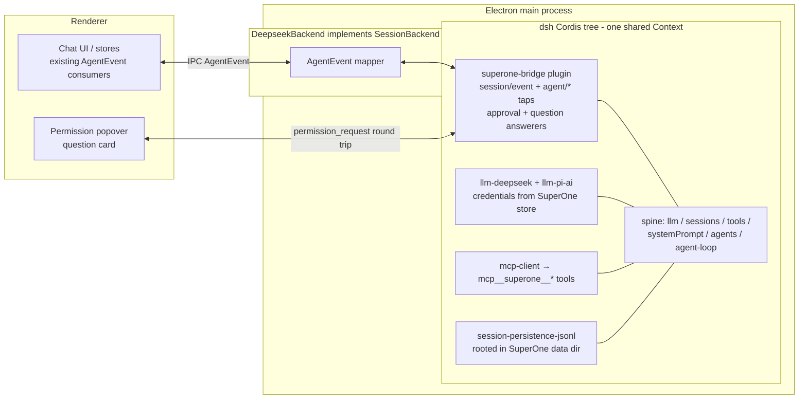

# DeepSeek Harness (dsh) Integration — Route D: In-Process Cordis Embedding (Draft)

Status: **in progress** — Route D executing. P0 (contract) + P1 (runtime/backend/credentials) + P2 (live model catalog → renderer resources, session defaults) landed; P3 partial (pickers, icon, permission subset, context gauge); P4 started — native tool plane (fs/shell/search/todo + permission gate, host-plane since P4e) and SuperOne's own tools as native dsh plugins landed; third-party MCP, resume, session fork and foreground subagents (spawn + fork, rendered as a Task block) landed; compaction landed; background/continuable children and permission presets still pending
Last updated: 2026-08-19

> Execution note (P2): `dsh-permission-presets` hard-requires a mounted *confining* bash executor (`ctx.shell.sandboxMode`) and `ctx.approval` — its constructor throws otherwise. The D5 preset vocabulary therefore lands together with the P4 bash-executor mount, not before. Until then the chat bar shows the shared-mode subset the backend honors (`default` = ask, `bypassPermissions` = auto-allow).
Spike: [`docs/draft/deepseek-harness-spike.mjs`](./deepseek-harness-spike.mjs) (reproducible; see Appendix)
Related: `.agents/skills/superone-harness/` (new-harness roadmap, event contract, experiences matrix), `docs/design/cursor-sdk-harness.md` (breadth reference: 152 files / 7 commits)

---

## 1. Decision summary

Integrate DeepSeek Harness (`dsh`, `@deepseek-ai/dsh-*`) as a new SuperOne harness by **embedding its Cordis plugin tree in-process** and writing SuperOne-owned Cordis plugins that bridge dsh's seams to SuperOne's `AgentEvent` contract, HITL surfaces, and tool plane.

Identity boundary: SuperOne's canonical `HarnessId`, `NodeHarnessId`, AgentEvent `providerId`, and
base SessionProvider prefix are all `dsh` (`dsh-base`). `DeepSeek` / `deepseek` remain the product
name, brand key, API-provider id, i18n/label keys, and package/file names. The harness has never
shipped, so there is deliberately **no back-compat path** for the pre-rename `deepseek` id: no DB
migration, no settings alias — a dev database written before the rename must be re-seeded.

This is different from every existing harness (Claude = black-box SDK, Codex = spawned binary, ACP = wire protocol, Cursor = SDK + local store): dsh is a **white-box plugin tree** — MIT-licensed, all-TypeScript, published on npm — so the bridge logic lives *inside* the engine as first-class plugins instead of adapting an event stream at the boundary. This is also the only route that delivers cancel + HITL approval today:

| Route | Cancel | HITL approval | Streaming | Verdict |
|---|---|---|---|---|
| A. ACP server (`@deepseek-ai/dsh-acp`) | ✅ | one-shot only | ❌ committed messages only | automation-grade; rejected |
| B. SDK subprocess (`@deepseek-ai/dsh-sdk-client`) | ❌ no wire method | ❌ unimplemented on wire | ✅ | hard gaps; rejected for now |
| C. Web Client protocol (Connection `/api` + Typert RPC) | ✅ | ✅ | ✅ | full fidelity but generated-artifact coupling; fallback option |
| **D. In-process embedding (this plan)** | ✅ verified | ✅ verified | ✅ verified | **chosen** |

dsh is in **developer preview** (`0.1.0-rc.7` at time of writing) with breaking changes promised. §11 owns the version strategy; the short version is: exact-pin the whole family, keep the spike as a smoke test, absorb breakage on explicit upgrades only.

---

## 2. What dsh is (one paragraph)

dsh is built on [Cordis](https://github.com/cordiverse/cordis): every part of the product — model adapter, tool registry, session log, agent loop — is a plugin contributing services (`ctx.llm`, `ctx.tools`, `ctx.sessions`, `ctx.agents`, `ctx.approval`, …), typed events, and reversible registrations to a shared context. The session log is an append-only `SessionEvent` stream (`turn/*`, `step/*`, `assistant/chunk`, `tool/call`, `tool/result`, `todo/write`, …) from which model history is *derived*; "model-visible means logged" is a runtime invariant. Capability seams (fs, subprocess, shell, sandbox, subagent, approval, questions) are swappable provider triangles. Plugins mount and unmount at runtime with effects unwinding cleanly.

---

## 3. Verified facts (experiments, 2026-08-18)

All experiments ran against the **published npm packages** `@deepseek-ai/*@0.1.0-rc.7` (not the repo checkout), which is exactly how SuperOne will consume them. Full script: `deepseek-harness-spike.mjs`; runs green under **both Node 24 and bun 1.3.9**.

| # | Experiment | Result |
|---|---|---|
| E1 | `bun add @deepseek-ai/dsh` | ✅ 524 packages, 195 `@deepseek-ai/*`, complete `lib/` + `.d.ts` + `src/` in every package. No sqlite/native deps in the core path. 4 postinstalls blocked by default; only `dsh-subprocess-local` (spawn helper) and `koffi` need trusting, and only when the bash/PTY executors are mounted. |
| E2 | In-process boot: `new Context()` + 8 `ctx.plugin(...)` calls (Timer, LlmRuntime, SessionStore, SystemPrompt, ToolRuntime, AgentRegistry, ApprovalService, AgentLoop) + a mock `LlmAdapter` on route `mock` | ✅ Bridge plugin activates via `inject: ['agents','llm','tools','sessions']`; `agents.create()` → `followup()` produces the full durable stream: `turn/start → step/start → user/message → request/header → request/context → assistant/chunk×N → assistant/message(+usage) → step/end → turn/end {kind:'completed'}` |
| E3 | Custom tool via `ctx.tools.register(...)` + scripted tool-call | ✅ `tool/call` → pipeline → `tool/result` → automatic second step → final text, one turn. Tool schemas assembled into `request/header.tools` automatically. |
| E4 | HITL: `tools/pre-execute` waterfall returns `{kind:'ask'}`, `approval/request` waterfall answered in-process after a delay | ✅ Approval intercepts the call, an async answerer returning `'allowed-once'` resumes execution, and dsh logs `approval/asked` / `approval/decided` audit events into the session log for free. |
| E5a | Mid-turn cancel: `agent.cancel({kind:'user'})` during streaming | ✅ Stream stops, `turn/end {kind:'aborted', reason:{kind:'user'}}`, agent returns to `idle`, next turn works normally. |
| E5b | Runtime hot mount/unmount: `ctx.plugin({...registers tool 'extra'})` then `fiber.dispose()` | ✅ Model-visible tool list goes `[extra, ping]` → `[ping]` across turns. Reversible-effects model confirmed end-to-end. |

Additional verified facts from source/docs review:

- **`llm-pi-ai`** is a generic multi-provider adapter (config-keyed provider profiles; OpenAI-compatible gateways are configuration, not code).
- **`mcp-client`** registers external MCP server tools on `ctx.tools` — SuperOne's `mcp__superone__*` surface plugs in without new code.
- **Subagent providers** include `subagent-claude-code` and `subagent-codex` — dsh can delegate to our other harnesses as subagents.
- dsh anticipates Electron embedding: the connection layer has an in-process carrier, and `dsh-host-webserver` documents "Electron loads dist over `file://` and carries fetch over an IPC bridge".
- `ctx.sessions.fork(source, boundary?, childSessionId?)` and `agents.resume({resumeSessionId})` exist; persistence is `dsh-session-persistence-jsonl` (zstd-compressed JSONL, seed-replay on resume).

### Footguns found by the spike (encode these in the backend)

1. **`resolveModel()` is strictly validated** — must return `{provider, id, name}` echoing the exact route/id, else `INVALID_MODEL_INFO` fails the turn.
2. **Send-after-turn is latched** — a `followup()` submitted between `turn/end` and the idle transition can park in the inbox without opening a turn. Await `agent.whenIdle()` before treating the agent as ready, and treat parked input as "queued message" UI state.
3. **Family versions are lockstep** — all `@deepseek-ai/dsh-*` must be the same exact version; never mix.
4. **The default system prompt announces dsh identity** — `SystemPrompt` config (`includeHarnessIdentity`, `persona`) is where SuperOne branding/persona goes.
5. **`agent/status` payload is `{agent, status}`** (single object), and the agent id is `agent.id` (= `SessionId`).

---

## 4. Architecture overview



One dsh `Context` per app lifetime hosts N agents (one per SuperOne dsh session); each `agents.create()` gets its own scoped `agent.ctx`, `cwd`, model route, and inbox. The backend never reaches into loop internals — everything flows through documented seams, exactly like the spike.

---

## 5. Design decisions

### D1 — Process model: Electron main, in-process (like Claude), utilityProcess deferred

The Claude harness already runs an agent engine inside main; dsh's minimal spine adds no native modules and no server. Start in-process for parity and debuggability. Revisit `utilityProcess` isolation only if profiling shows loop work competing with IPC/UI duties, or when the bash/PTY executors (which spawn real processes) land. The composition is carrier-agnostic, so the move is mechanical later: the bridge plugin stays identical; only the AgentEvent transport changes from function call to MessagePort.

### D2 — One shared Context, one agent per SuperOne session

The ACP bridge and Web host both run many sessions on one tree; per-agent isolation comes from scoped contexts (`agent.ctx`) and scope-filtered event dispatch (`tools/pre-execute` etc. are Scoped). SuperOne does the same: a lazily-booted singleton tree in `@superone/deepseek`, `agents.create({sessionId, meta:{cwd}, agentOptions:{provider, model, maxTokens}})` per session, `handle.dispose()` on close. Per-session tool/capability differences use `CreateAgentOptions.setup` (composes the agent's scoped world before publication).

### D3 — Composition: manual spine, no Loader/YAML/profiles

`dsh`'s CLI boots from profile YAML through the Loader; `agent-spine-demo` proves the same tree composes with plain `ctx.plugin(...)` calls. SuperOne owns configuration already (settings store, credentials, per-session options), so we compose programmatically and skip: Loader, `$DSH_HOME` profiles, `settings-file`, `credentials-local`, telemetry, webserver, the entire `client/*` and `host/*` planes. Initial plugin set (verified minimal + product needs):

| Plugin | Why |
|---|---|
| `cordis-plugin-timer`, `dsh-llm`, `dsh-session`, `dsh-system-prompt`, `dsh-tools`, `dsh-agent`, `dsh-agent-loop` | the verified minimal spine |
| `dsh-user-approval` (policy `ask`), `dsh-user-questions` | HITL seams the bridge answers |
| `dsh-permission-presets` | semantic source for the displayed permission vocabulary (Q2 decision) |
| `dsh-llm-deepseek`, `dsh-llm-pi-ai`, `dsh-llm-retry`, `dsh-token-meter` | model routes + retry + accounting |
| `dsh-session-persistence-jsonl`, `dsh-session-checkpoint-policy` | durability + resume |
| `dsh-compaction-basic`, `dsh-session-projection` | context compaction + durable subagent identity |
| `dsh-tool-todo` | `todo/write` → TODO panel |
| `dsh-subprocess-local`, `dsh-bash-local`, `dsh-shell-env`, `dsh-tool-bash` | bash execution (needs postinstall trust; see E1) |
| `dsh-fs-local`, `dsh-fs-observation-policy`, `dsh-tool-fs` | read/write/edit tools |
| `dsh-subagent` + `dsh-subagent-spawn-in-process` + `dsh-tool-subagent` | subagents (P4) |
| `dsh-mcp-client` | mount `mcp__superone__*` (P4) |
| `dsh-invariants` + per-package invariant companions | keep on in dev builds; they catch bridge mistakes loudly |

Skills, goals, workflow, jobs, e2b, LSP, terminal: deferred until a product decision wants them — each is one `ctx.plugin` line away.

### D4 — The bridge is a Cordis plugin; the backend is thin

`superone-bridge` (inside `packages/deepseek`) is a dsh plugin with `inject: ['agents','llm','tools','sessions']`. It owns: session/event tap → AgentEvent mapping (§6), `approval/request` + question answering (D5), agent registry bookkeeping. `DeepseekBackend implements SessionBackend` holds the per-session façade (send/interrupt/setModel/…) and calls into the bridge. This keeps all dsh vocabulary in one file pair and the backend looking like every other backend to the rest of SuperOne.

### D5 — HITL mapping

- `approval/request` (waterfall, carries `agent`, `toolName`, `callId`, `reason`, abort `signal`) → emit `permission_request` with the already-streamed tool block (`callId` matches the `tool/call` event we already mapped). User's answer resolves the waterfall: allow → `'allowed-once'`, deny → `'rejected'`; a withdrawn request (signal abort) clears the popover. dsh's own `approval/asked`/`approval/decided` audit events are mapped to nothing (UI already reflects the round trip) but keep sessions replayable.
- Which calls ask: dsh's approval policy (`'ask'` default) + our own `tools/pre-execute` policy listener. **Decided 2026-08-18: the displayed mode vocabulary is dsh's own permission presets** — mount `dsh-permission-presets` as the semantic source and register its preset names in the mode-list module, following the Codex precedent (shared `PermissionMode` stays the carrier type across the ~40 store/wire surfaces; the popover, status bar, and mode list show dsh preset names mapped onto it). SuperOne's permission popover remains the presentation; the seam is the integration point.
- `ctx.userQuestions` provider → `ask_user_question` AgentEvent; same round-trip pattern.

### D6 — Tool plane: everything is a plugin (revised 2026-08-19)

**Landed (P4a) — native tools. Relocated to the host plane in P4e; see §17.** `packages/deepseek/src/tool-plane.ts` mounts `subprocess-local` + `fs-local` + `bash-local` + `shell-env` and the `read/write/edit`, `glob/grep`, `bash`, `todo_write` tools. The first cut put them inside `agents.create({setup})`, one isolated realm per session; delegation made that unrepresentable and they now sit in the tree's global layer, where dsh's own rosterless deployments keep them. Per-session correctness moved with them and did not weaken: dsh resolves the workspace at the *tool* boundary (`tool-fs` passes `exec.agent.session.header.cwd` into `ctx.fs.resolve()`, `tool-bash` defaults `workdir` the same way), so `config.cwd` is only the fallback for a non-agent caller. The "keeps each session rooted in its own cwd" test passed unchanged across the move, which is the evidence.

**Permission gate.** dsh's own `ctx.approval` only fires for *sandbox escalation*, and with an unconfined `bash-local` that never happens — so mounting tools without a gate would run `write`/`bash` with no prompt at all. A SuperOne-owned `tools/pre-execute` listener allows read-only tools (`read`, `read_image`, `glob`, `grep`, `todo_write`) and asks for everything else. It asks through the backend's own answerer rather than returning dsh's `{kind:'ask'}`, because `approval.request` carries only a tool name while the popover renders the call — the bash command, the file being written. `bypassPermissions` short-circuits in the backend, so both paths share one mode check. The listener is host-plane too (P4e): a gate on the parent's agent scope never sees a delegated child's calls.

**Naming.** dsh's argument shapes already match Claude's (`file_path`, `command`, `old_string`…), so the event mapper renames `read/write/edit/bash/glob/grep/todo_write` to the canonical `Read/Write/Edit/Bash/Glob/Grep/TodoWrite` and the existing renderers (Bash terminal view, edit diff, todo panel) light up unchanged. The permission popover uses the same canonical name.

**Landed (P4b) — SuperOne's own tools are native dsh tools.** Superseded the original "MCP first" plan after one iteration of it. `packages/deepseek/src/tool-surface.ts` registers SuperOne's built-ins directly on the agent's scope, executing in-process through the same `listSuperoneMcpTools` / `executeSuperoneMcpTool` pair the MCP server calls. dsh's organising principle is that everything is a plugin and its tool registry resolves per agent scope, so the aligned integration is a plugin — not a client of our own server.

The MCP bridge that preceded it (an MCP SDK client per session over `getSuperoneMcpHttpConfig(sessionId)`) worked, but it paid a transport, a session token, a reconnect policy and a `tools/list_changed` subscription to reach tools living in the same process, and it did not implement that last one — a mini-app registered mid-session stayed invisible until restart. Native registration re-syncs off `addToolsChangedListener`, so Computer-Use toggles, mini-app registration and mobile-share availability all take effect on the next request. It also drops the `@modelcontextprotocol/sdk` dependency from `@superone/deepseek`.

Names stay qualified — `mcp__superone__<bare>` — even though nothing MCP is involved for dsh any more. That string is SuperOne's canonical tool identity: host-owned admission, hidden tool rows, mobile event stripping and mini-app dispatch all match on it, and Claude/Codex/ACP advertise the same names. The bare name is what reaches the executor.

Two containment rules survive from the bridge: a broken surface is caught inside `mountToolPlane` (a `setup` rejection rolls the agent scope back, so the session would never be published), and a descriptor dsh rejects skips one tool instead of the whole surface. Each tool declares the canonical `{content, structuredContent?}` output envelope because dsh validates `output.schema` at `register()`.

**Layer A admission.** `isStaticHostOwnedSuperoneToolQualified()` short-circuits the permission gate for SuperOne's own tools, so their executor (which runs the real product confirmation) owns the authorization. Dynamic mini-app / third-party tools sharing the prefix are deliberately not matched, and `computer_*` still prompts — the feature-gated set is not plumbed into the gate yet.

**Landed (P4c) — third-party MCP servers, from dsh's own config file.** `@deepseek-ai/dsh-mcp-client` is mounted unmodified, once per distinct server config, in the tree's global layer.

The decisive question was *whose config file*, and the answer follows SuperOne's product principle: SuperOne **extends** a harness rather than centralizing it, so each harness keeps its servers in its own file — Codex in `~/.codex/config.toml`, dsh in its profile patch layer. (SuperOne's cross-harness MCP list exists so a user can *re-apply* a server they used elsewhere; it is a catalog for reconfiguration, not one shared runtime config.) An earlier cut of this had dsh reading the Claude-shaped `~/.claude.json` / `.mcp.json` family that Cursor, ACP and OpenCode share — wrong for exactly that reason.

Verified location (`~/.dsh` on a machine that had run dsh):

```
~/.dsh/
  settings.yaml                        # runtime settings — not plugins
  .credentials.yaml                    # DEEPSEEK_API_KEY
  profiles/
    node_modules/                      # installed plugin packages (dsh-mcp-client included)
    web/
      package.json                     # dsh.profile.bundles
      cordis.yml                       # "Edit cordis.patch.yml, not this file."
      cordis.patch.yml                 # ← MCP servers live here, as loader entries
```

`packages/runtime/src/fs/mcp-config-dsh.ts` reads and writes that patch layer through the `yaml` document API, touching only entries whose `name` is `@deepseek-ai/dsh-mcp-client`; every other row, its comments and dsh's `!!js` expressions round-trip untouched (covered by tests). `listMcpConfigs(provider, cwd)` gains a `dsh` branch beside Claude's and Codex's, and `ResourceProvider` widens to include `dsh` — for MCP only, since dsh has no skills surface there.

**Placement follows dsh, not SuperOne.** dsh composes per deployment: one Host process serves many workspaces, its servers are composition entries, and `serverName` is a process-wide reservation by design. So there is no project scope to model — every server mounts once in the global layer and every session sees the same set, which is exactly what that one file says. `DeepseekMcpServers.sync()` diffs by connection-tuple identity, so an edited endpoint re-mounts and a removed server goes away.

Not covered: the desktop settings page still has no dsh MCP CRUD channel (the runtime facade supports `provider: 'dsh'`, so the node/CLI path is complete); SSE servers are dropped (`dsh-mcp-client` speaks stdio and Streamable HTTP); `getMcpServerStatus()` still returns `[]`.

**Open, related:** `~/.dsh/.credentials.yaml` holds the user's `DEEPSEEK_API_KEY`. D7 currently ignores it and serves credentials from SuperOne's own store. Under the same "extend the harness" principle that decided this section, that deserves a second look.

### D7 — Models & credentials stay SuperOne-owned

Do not mount `dsh-settings-file` / `dsh-credentials-local` (they own `$DSH_HOME` files and env resolution). Register adapters programmatically: `dsh-llm-deepseek` config from the SuperOne credential store (DeepSeek official), `dsh-llm-pi-ai` profiles generated from SuperOne's existing provider/credential bindings (OpenAI-compatible endpoints are config rows). Model picker reads `ctx.llm.listProviders()` / `listModels()` — live, adapter-owned, no static catalog to maintain; classification can reuse the local models.dev mirror (`buildCatalogTaskIndex`) like custom providers do.
`request/context` events carry `contextWindow` per route — feed the context gauge from there instead of a hardcoded table.

### D8 — Persistence, resume, fork

- Mount `dsh-session-persistence-jsonl` with `root` under SuperOne's per-project data dir. dsh owns durability of its own log (crash-safe, seq-contiguous); SuperOne's SQLite keeps rendering-oriented persistence exactly as for other harnesses. Dual-write is redundant by design — the JSONL is the *provider-side* thread, ours is the UI cache — same split as Claude's `.jsonl` vs our DB.
- `provider_session_id` = the dsh `SessionId` we mint at `agents.create`.

**Landed (P4d) — cold resume.** `agents.resume({resumeSessionId})` was already wired; what needed pinning is *why it does not duplicate the transcript*. dsh seeds a resumed session through its **constructor**, and constructor seeds never publish on the `session/event` firehose (`Session.firstLiveSeq` documents exactly this), so our mapper only ever sees live events. A test boots a second tree over the same JSONL root and asserts both halves at once: the model sees the earlier turn, SuperOne's event stream does not.

**Landed (P4d) — fork.** Copies the log prefix at the **persistence layer** (`load` → filter by seq → `create` + `append`), not through `ctx.sessions.fork`. Two facts rule that API out for our shape:
- it only accepts a **live** source (`SESSION_NOT_LIVE`), while the usual fork is cold — the user forks a session nobody is running;
- it *publishes* the child, and a published session cannot then be resumed in the same process (`cannot prepare session while it is live`), which is exactly what the desktop does next.

The prefix write keeps nothing live, so the child starts through the ordinary resume path — the same shape as Claude's fork. Lineage (`parentSession`, `seedLength`) is recorded in the child header; `createdAt` is epoch ms, not an ISO string (the persistence coordinator validates it).

**Fork boundary.** dsh forks at an inclusive event seq, so the mapper stamps each `message_complete` with the seq that closed its step, carried on the shared `MessageMetadata.forkAnchorId` seam the other harnesses already use for their native ids. `forkDeepseekTranscript` resolves SuperOne's `forkFromMessageId` to that seq, walking back to the previous completed message when the fork point is a user message (which has no seq of its own). Cutting at a step boundary can leave the turn open at the tail; dsh's cold-load recovery closes it, which is the same path an interrupted session takes.

### D9 — Runtime plugin hot-swap is a product surface, later

E5b proves mount/unmount works live. The eventual "SuperOne features as runtime-loadable plugins" product builds on this — but it is explicitly **out of scope** for the harness integration phases below. The integration only has to not preclude it, which D2/D4 guarantee (everything is already a plugin).

**Exception (decided 2026-08-18): `tool-cordis` ships as a user-facing opt-in setting** (default off), following the Browser-CDP/Liquid-Glass opt-in pattern: an `AppSettings` flag gates one `ctx.plugin(toolCordis)` mount at tree boot, with the setting description warning that model-mounted plugins are experimental and affect every dsh session in the process. Lands in P4.

---

## 6. Event mapping: dsh `session/event` + `agent/*` → `AgentEvent`

The mapper lives in `packages/deepseek/src/event-map.ts`, table-driven, tested against recorded spike logs. Ordering guarantees come free: the session log is seq-contiguous and the reducer's happy order (`message_start` → deltas → `message_complete`) matches `step/start` → chunks → `step/end`.

| dsh event | AgentEvent | Notes |
|---|---|---|
| (backend start) | `session_init` | once, from backend, not from dsh |
| `turn/start` | — (bookkeeping) | marks turn scope; drive idle derivation |
| `step/start` | `message_start` | one assistant message per step |
| `assistant/chunk {type:'text-delta'}` | `content_delta` (text) | batch via shared `agent-event-batcher` + `applyContentDelta` |
| `assistant/chunk {type:'reasoning-delta'}` | `content_delta` (thinking) | |
| `assistant/chunk {type:'tool-call-delta'}` | `content_delta` (tool_use) + `tool_input_delta` | raw JSON string deltas; `mergeToolUseInputJson` handles sparseness |
| `assistant/chunk {type:'block-end'}` | finalize the block | authoritative assembled block |
| `assistant/message {usage}` | `message_usage` | disjoint counts: billed input = input + cacheRead + cacheWrite |
| `tool/call` | (tool_use block already streamed) | correlate by `callId` |
| `tool/result {message, error?, meta?}` | `content_delta` (tool_result) | `meta` is tool-private presentation payload — keep for custom ToolBlocks |
| `step/end` | `message_complete` | |
| `turn/end {kind:'completed'}` | `status_change` (idle candidate) | idle = `turn/end` + `agent/status idle` (both observed; see footgun 2) |
| `turn/end {kind:'aborted'}` | `message_interrupted` | maps user cancel |
| `turn/end {kind:'error'}` | `message_error` | error carried in reason |
| `todo/write` | `todos_updated` | whole-list snapshot, replace |
| `request/header` | (init-ish metadata) | system prompt + tool schemas; useful for context inspector |
| `request/context` | context gauge input | `contextWindow` per resolved route |
| `compaction/start` / `summary` / `end` | `compact_boundary` / `status_indicator` | from `compaction-basic` |
| `agent/inbox/spliced` (insert, no turn) | queued-message chip state | parked input = queued |
| `agent/inbox/claimed` | `queued_message_consumed` | |
| `agent/status {status}` | `status_change` | |
| `agent/error` | `message_error` | non-turn-scoped failures |
| `approval/request` (waterfall) | `permission_request` | round trip resolves the waterfall (D5) |
| user-questions seam | `ask_user_question` | |
| `subagent.started` lineage / `session-projection` | `task_started` + `parentToolUseId` | P4; recursive tree per existing subagent rendering rules |
| session title provider (`ctx.sessionTitle`) | `session_title_changed` | we register SuperOne's titler as the sole provider |
| `llm/adapters-updated` | model picker refresh | registry notification, re-read lists |
| `hook/invoked` / `hook/result` (if hooks mounted) | `hook_started` / `hook_complete` | deferred |

---

## 7. `SessionBackend` sketch

Required members all have direct dsh counterparts (verified in spike): `send` → `agent.followup(createUserMessage(...))` after `whenIdle` gating / else queued; `interrupt` → `agent.cancel({kind:'user'})`; model/permission setters → `agentOptions` are create-time, but model *can* change per-request via route config — treat model change as in-place (no rebuild), permission-mode change as in-place (policy listener reads current mode).

Optional members — honest first-cut:

| Member | P1 stance |
|---|---|
| `setTitle` | ✅ implement (we own the `ctx.sessionTitle` provider) |
| `getPendingInteractions` | ✅ implement — replay unanswered `approval/request`s (bridge holds open waterfalls) |
| `stopTask` | ❌ omit until subagents (P4) |
| `injectTaskNotification` | ✅ implement via `agent.inject()` (mid-turn context; lands in next admitted request) |
| `getRateLimits` | ❌ omit (no provider signal yet) |
| `requestSessionRecap` | ❌ omit |

## 8. Capability flags (initial, honest)

`supportsTodos: true` (E3 path + `tool-todo`), `supportsStreamingToolInput: true` (E2), `supportsCompact: true` once `compaction-basic` mounted, `supportsSubagents: false` until P4, sandbox control: `false` in `sandboxHarness.ts` initially (dsh sandbox seam exists but only Linux landlock is native today — folding SuperOne's macOS sandbox in is its own project), effort selector: expose only if the configured adapter reports `reasoning.efforts` for the selected model (dynamic, like the mapped-provider rule).

---

## 9. Phase roadmap

Follow `.agents/skills/superone-harness/references/new-harness.md` (P0→P5), specialized:

**P0 — Contract layer** (compiler-driven): add `dsh` to `HarnessResourcesMap`; fix every red `Record<HarnessId,…>`: `HARNESS_CAPABILITIES` (§8 values), `HARNESS_DEFAULT_BRAND_HUE`/`HARNESS_DEFAULT_TOKENS`, `HarnessHandlerMap`, store maps, `BrandColorPopover` label, `createHarnessRunner` switch. Add the `dsh-base` entry to the exhaustive shared SessionProvider catalog and use it for desktop + runtime/CLI DB seeds. Add `NODE_HARNESS_DEFINITIONS` entry (visibility fails closed without it). i18n strings.
*Accept:* typecheck green; harness visible-but-inert in pickers.

**P1 — Runtime layer**: new workspace `packages/deepseek` (`@superone/deepseek`): pinned `@deepseek-ai/*` deps, tree boot (D3), bridge plugin (D4), event mapper (§6), `DeepseekBackend` (§7) registered in main. Mock-adapter unit tests for the mapper (table-driven over spike-recorded logs); real `llm-deepseek` behind a credential.
*Accept:* full turn streams in chat UI; stop button works; errors surface.

**P2 — State layer**: chat-store `deepseek-handler`, `session-lifecycle` defaults (default model route/permission), routing switches.
*Accept:* store-routing tests green (`chat-store/harness/*-handler.test.ts` pattern).

**P3 — Presentation**: model picker from live `ctx.llm` lists (D7); permission popover + `StatusBarPermission` + mode list (D5); icon + brand (all three registries: `resolveSessionIcon`, brandKey variant, hue/tokens); context gauge from `request/context`; TODO panel.
*Accept:* manual chat-bar walk left→right, every control live or intentionally absent.

**P4 — Parity features**: HITL approval + questions round trip (D5) if not landed in P1; MCP tool mount (D6); resume (`provider_session_id` persistence + `agents.resume`); fork (D8); subagents (`spawn-in-process` + `task_started` mapping + flip capability flag); compaction UI.
*Accept:* each feature demoed on a real session; capability flags truthful.

**P5 — Periphery** (legitimately deferrable): remote node (`apps/cli` harness package pattern — dsh's pure-TS spine actually makes this easier than Claude's binary), mobile event stripping exemptions (tool `meta` payloads!), usage page, packaging (plain-JS deps → no asar-unpack needs beyond the bash spawn-helper if bundled; verify `require.resolve` paths on Windows).

Estimated shape: backend + bridge ≈ Claude-backend-sized (~500–800 lines); the long tail is the ~40 enumeration surfaces (Cursor: 152 files). P0–P3 is a shippable alpha per the OpenCode/Cursor precedent.

---

## 10. Testing strategy

- **Mapper tests**: table-driven over recorded dsh session logs (record via the spike's event tap; the log is lossless JSON, perfect fixture material). One fixture file per flow (text turn / tool turn / approval / cancel / compaction), per repo convention.
- **Keep the spike** as `packages/deepseek/tests/spike.e2e.ts` (mock adapter, no network): it is the canary for dsh upgrades — it exercises boot, streaming, tools, approval, cancel, hot-swap in ~3 s.
- **Store-routing tests** per existing harness-handler patterns.
- Run from `apps/desktop` cwd (vitest alias footgun); no real better-sqlite3 in tests.

## 11. Version & risk strategy

| Risk | Mitigation |
|---|---|
| rc breaking changes (promised) | Exact-pin the family to one version in `packages/deepseek` only; no `^`. Upgrades are deliberate PRs: bump → run spike e2e + mapper fixtures → fix → land. Never mix family versions (footgun 3). |
| API drift in seams we touch (`SessionEventMap`, approval, tools, llm) | All dsh vocabulary confined to `packages/deepseek` (D4); blast radius is one package. The seams we use are dsh's own extension points (ACP/Web client use the same ones), the least likely to break silently. |
| rc quality issues in the loop | Invariant companions stay mounted in dev; they fail loud at the source. |
| Send-during-teardown latch (footgun 2) | Backend gates sends on `whenIdle`; parked input surfaces as queued-message UI. |
| Postinstall trust (bash executor) | Document `bun pm trust` needs; consider bundling the spawn helper explicitly at packaging time. |
| Provider auth model mismatch | We bypass dsh's credential files entirely (D7); credentials flow through existing SuperOne bindings. |
| dsh Python/native components | Not in our path: python SDK, landlock (Linux sandbox), e2b are unmounted. |

## 12. Resolved questions (decided with the user, 2026-08-18)

1. **Persona/system prompt** → **keep dsh's harness identity**, inject SuperOne additions through the `persona` field (matches the Claude/Codex precedent; preserves behavior comparability with upstream dsh).
2. **Permission vocabulary** → **show dsh's own permission-preset names**; shared `PermissionMode` remains the carrier type across store/wire surfaces, mapped Codex-style (see D5).
3. **Sandbox** → `ctx.sandbox` backend spike for SuperOne's macOS sandbox is scheduled **after P4**; until then `sandboxHarness.ts` returns `false` (no dead toggle).
4. **utilityProcess trigger** (owner: engineering) → revisit D1 when either (a) the bash/PTY executors land in the main process, or (b) the event trace shows dsh-attributed main-process stalls.
5. **`tool-cordis`** → **user-facing opt-in setting**, default off, lands in P4 (see D9).

---

## Appendix: reproducing the spike

```sh
mkdir /tmp/dsh-spike && cd /tmp/dsh-spike
echo '{"name":"dsh-spike","type":"module","private":true}' > package.json
bun add @deepseek-ai/dsh@0.1.0-rc.7        # or the current pinned version
cp <repo>/docs/draft/deepseek-harness-spike.mjs .
node deepseek-harness-spike.mjs             # or: bun deepseek-harness-spike.mjs
```

Expected tail: `[E5b] tools with hot plugin: [extra,ping] | after dispose: [ping]` and a summary counting `turn/start:5 … tool/call:1 approval/asked:1 tool/result:1`.

---

## 13. Official composition inventory (`dsh-base`, 2026-08-19)

Product principle (aligned with the user, 2026-08-19): **integrate the official
harness first; where an official plugin conflicts with a SuperOne surface — UI,
transport, identity — use ours.** "Not integrated yet" is not the same as
"replaced by ours", and D3 blurred the two.

### 13.1 Where the official composition lives

The official deployment composes from **bundles**, not hand-written plugin lists:

```jsonc
// $DSH_HOME/profiles/web/package.json
"dsh": { "profile": { "bundles": ["@deepseek-ai/dsh-base", "@deepseek-ai/dsh-web-app"] } }
```

Each bundle ships a `cordis.patch.yml` — `dsh-base` inserts 79 rows, `dsh-web-app`
overrides some and inserts the browser/host plane. The user's own
`$DSH_HOME/profiles/<p>/cordis.patch.yml` is the last layer (this is the file our
MCP CRUD writes, §D6).

`dsh-base` carries **no `dsh-mcp-client` row**. Third-party MCP is a user-profile
concern in the official design too, which is exactly where we put it.

### 13.2 Version trap — `latest` is stale, use `next`

| dist-tag | version | published |
|---|---|---|
| `latest` | `0.0.1-rc.1` | 2026-08-10 (first publish, never moved) |
| `next` | `0.1.0-rc.7` | 2026-08-17 (our pinned line) |

`npm add @deepseek-ai/dsh-<x>` with no version resolves to the **oldest** release,
and that release uses **different package names** for the same capability:

| 0.0.1-rc.1 | 0.1.0-rc.7 (ours) |
|---|---|
| `dsh-permission` | `dsh-permission-presets` |
| `dsh-compact-basic` | `dsh-compaction-basic` |
| `dsh-subagent-spawn` | `dsh-subagent-spawn-in-process` |
| `dsh-user-interaction` | `dsh-user-questions` |
| `dsh-tasks-local` / `dsh-tool-tasks` | `dsh-jobs-local` / `dsh-tool-jobs` |
| `dsh-bash-env` | `dsh-shell-env` |
| `dsh-settings-local` | `dsh-settings-file` |
| `dsh-fs-policy` | `dsh-fs-observation-policy` |
| `dsh-timeout-policy` | `dsh-tool-call-timeout-policy` |
| `dsh-repeat-tool-guard` | `dsh-repeat-tool-reminder` |
| `dsh-workflow-workerthread` | `dsh-workflow-worker-thread` |
| `dsh-compact-tool-result-prune` | `dsh-compaction-tool-result-pruner` |

Always pin `0.1.0-rc.7` explicitly. A bare install silently gives a different
harness whose rows do not match anything written here.

### 13.3 The gap: 21 of 79 rows mounted

**Mounted today** — tree (12): `timer` `llm` `session` `system-prompt` `tools`
`agent` `agent-loop` `user-approval` `llm-deepseek` `session-persistence-jsonl`
`session-checkpoint-policy` + our credential plugin. Per-agent tool plane (8):
`subprocess-local` `fs-local` `bash-local` `shell-env` `tool-fs` `tool-fs-search`
`tool-bash` `tool-todo`. Deployment (1): `mcp-client`.

**Conflicts — keep ours, exclude theirs:**

| Official row(s) | Why ours wins |
|---|---|
| the whole `dsh-client-ui-*` roster (21 rows) | SuperOne is the UI |
| `host-webserver` `host-apiproxy` `client-connection` `client-modules` `api-remotes` `web-app` `web-startup` `client-hmr` `host-directory-picker-auto` | browser transport; we use Electron IPC |
| `typert-registry` `typert-loader` `api-gateway` | RPC gateway for that transport |
| `hmr` | we are embedded in Electron main |
| `session-title` + `session-title-first-prompt-llm` | SuperOne titles sessions via `session_rename` |
| `agent-default-model` | SuperOne owns model selection (D7) |
| `commands` `command-feedback` `command-goal` `command-compact` | SuperOne owns the slash surface |
| `settings-file` `credentials-local` | currently ours (D7) — worth re-deciding under the "respect the harness's own config" principle |
| **`session-telemetry-otel`** | **must exclude** — mounted on by default, mirrors *every* session-log event to `harness-telemetry.deepseeksvc.com`. Disable the row (config cannot turn it off). |

**Capability rows we simply have not integrated yet** (no UI conflict — this is
the actual backlog):

| Group | Rows |
|---|---|
| subagents | ~~`subagent`~~ ~~`subagent-spawn-in-process`~~ ~~`subagent-fork-in-process`~~ ~~`tool-subagent`×2~~ (landed, §17) · still out: `tool-subagent-control`(+`/list-agents`), `tool-subagent-report` |
| compaction | ~~`compaction-basic`~~ ~~`compaction-tool-result-pruner`~~ ~~`token-meter`~~ (landed, §18) |
| permission / sandbox | `permission-presets` `sandbox-local` `sandbox-policy` `bash-sandbox` (`pwsh-sandbox` + `tool-pwsh` on Windows) |
| context & durability | `session-projection` `spill-local` `spill-policy` `token-meter` `tool-call-timeout-policy` |
| model plane | `llm-retry` `llm-pi-ai` (dormant multi-provider adapter) |
| tools | `tool-str-replace-editor` `tool-jobs` + `jobs-local` `tool-ralph` `tool-workflow` + `workflow-worker-thread` |
| HITL & modes | `user-questions` `plan-mode` |
| content | `attachment-local` `session-query-sqlite` `web` + `web-search-deepseek` + `tool-web` |
| prompt & policy | `agent-instructions` `fs-observation-policy` `repeat-tool-reminder` |
| skills / goals | `skill` `skill-filesystem` `skill-badge` `tool-skill` · `goal` `goal-round-driver` `tool-goal` |

### 13.4 `agent-presets` confirms the tool-plane shape

`dsh-web-app` disables every per-agent row from `dsh-base` (`tool-bash`, `tool-fs`,
`tool-todo`, `tool-subagent*`, `plan-mode`, `token-meter`, `compaction-basic`, …)
and re-mounts them behind **`dsh-agent-presets`**, one composition per session,
while the *registries* (`subagents`, `jobs`, `skill`, `goals`, `shell-env`) stay on
the host plane because they are process singletons with cross-session queries.

That is the same split we arrived at independently in `tool-plane.ts`
(`agentCtx.isolate(...)` per agent, deployment-level MCP mounts). The official
criterion is sharper and worth adopting verbatim: **a service a row outside the
realm reads belongs to the plane both can see.** Our `mcp-servers.ts` placement
follows it; `subagents` will require it (the registry is a process singleton with
`listChildren`/`followup`).

---

## 14. Loader feasibility: asar dynamic-import probe (verified 2026-08-19)

**Question.** `@deepseek-ai/cordis-plugin-loader` resolves plugins with a bare
specifier held in a *runtime variable* (`await import(name)`) plus
`createRequire().resolve(name)`. Does that survive an Electron asar package?
A literal specifier would be statically analyzable and would not answer it.

**Method.** A temporary main entry (`src/main/dsh-asar-probe.ts`, since deleted)
built through electron-vite, packaged with `electron-builder --dir --mac`
(unsigned), then run two ways against the same 654 MB `app.asar`: once as
`ELECTRON_RUN_AS_NODE=1` (fork-node context, how `llm-proxy-entry` runs) and once
in the **real Electron main process** behind `SO_DSH_ASAR_PROBE=1`.

**Result — both contexts, all green.** `import.meta.url` confirmed inside
`app.asar`; every resolution landed on
`.../app.asar/node_modules/@deepseek-ai/<pkg>/lib/index.js`.

| Package | `await import(runtimeVar)` | `require.resolve` |
|---|---|---|
| `@deepseek-ai/cordis` | ok (`Context`, …) | ok, inside asar |
| `@deepseek-ai/dsh-tool-bash` | ok (`Config`, `apply`, `inject`) | ok, inside asar |
| `@deepseek-ai/dsh-tool-todo` | ok | ok, inside asar |
| `@deepseek-ai/dsh-session` | ok | ok, inside asar |

Module identity also holds: `(await import(name)).default === staticImport` and
the two namespaces are `===`. A dynamically loaded plugin is the *same module
record* a static import gets, so nothing about Loader-mounted plugins differs
from the tree we hand-write today.

**One false alarm, recorded so it is not re-investigated.** The probe also tried
mounting a dynamically imported `dsh-tools` on a bare `new Context()` and
reported `FAIL service missing`. That reproduces **identically outside the
package** (plain `node` against `node_modules`): `dsh-tools` declares injects and
stays dormant until the spine services exist, so a bare Context never gets
`ctx.tools`. Not an asar finding.

**Conclusion.** The asar risk that gated adopting the Loader is **cleared**.
`cordis-plugin-loader` is 25 KB, its only `dependency` is `cosmokit` (already
installed) and its peers are `cordis` (installed) + `node-addon-require-builtin`,
which is **optional**: `loader.internal` (Node's internal ESM ModuleLoader, used
only for HMR cache eviction) is `ModuleLoader | undefined`, and the loader falls
back to plain `await import(name)` when absent. Adopting the Loader without HMR
therefore introduces **no native module**.

Remaining caveats for whoever implements it:

- Anything the Loader may mount must stay a **declared dependency** of
  `apps/desktop`, or electron-builder will not pack it. Externalization already
  works this way (`mainExternal` = every non-`@superone/*` dep), and the probe
  confirmed all 409 `@deepseek-ai` asar entries are present.
- HMR (`cordis-plugin-hmr`) needs the native addon and Node ESM internals —
  skip it. File-watch reload is better served by our own `fs.watch` +
  `loader.update()`.
- Runtime *download* of a not-yet-installed plugin is a separate problem
  (asar is read-only) and belongs with the harness hot-swap work, not here.

---

## 15. Adopted: `ctx.loader` as the runtime entry tree (2026-08-19)

D3 said "no Loader" and meant "no YAML/profile/bundle machinery". That reading
still holds, but it over-reached: the Loader **service** is separable from its
file-backed half, and it is the right home for any row that changes while the
tree runs. `packages/deepseek/src/tree.ts` now mounts:

```ts
ctx.plugin(Loader, { baseUrl: import.meta.url })
```

Deliberately **not** mounted: `cordis-plugin-include` (YAML-backed trees) and
`cordis-plugin-hmr` (needs Node ESM internals via a native addon). `Loader.write()`
is a no-op, so nothing this tree holds is ever persisted.

### What it replaced

`DeepseekMcpServers` was a hand-rolled loader: identity = the whole connection
tuple, and any field change meant `dispose()` then `ctx.plugin()` again. Now
identity is the **sanitized server name** and a config change is
`loader.update(entryId, { config })` — an in-place restart of that row. This
matters because `dsh-mcp-client` reserves `serverName` **process-wide**: the old
dispose-then-remount briefly released that reservation. Entry ids are
`mcp-<serverName>`, matching dsh's own patch-file convention, so a running tree
reads like the file the user edits.

`sync()` and `dispose()` became async; both call sites in `runtime.ts` await them.

### Cordis footgun, hit twice

`ctx.loader` **throws** (`cannot get property "loader" without inject`) for a
consumer that did not declare `inject: ['loader']` — it does not return
`undefined`. Anything optionally depending on a service must use
`ctx.get('name')`. This bit production code and test code in the same change,
and is the same rule that forced `ctx.get('sessionPersistence')` in §D8.

A second face of it: a service obtained through `ctx.get()` is a **tracked proxy
bound to the caller's context**, so inside its methods `this.ctx` is the
consumer's context, not the service's. Calling `loader.import(specifier)`
directly from a test therefore throws, while `loader.create({ name })` is fine —
the entry resolves the module through the tree's own context. Test the create
path, not the import primitive.

### Test seam

`loader.import()` treats a `cordis:<key>` specifier as a lookup in
`loader.builtins`, so tests register a fake server plugin there and construct
the registrar with `cordis:<key>`. The loader path under test is then the
production one; only the module behind the specifier differs. One test
deliberately uses the **real** `@deepseek-ai/dsh-mcp-client` specifier against an
unreachable endpoint, because a builtin-only suite would keep passing if the
real package were renamed or dropped from the manifest (mutation-checked: it
fails with `expected [] to include 'mcp-probe'`).

### Follow-ups this unlocks

- **B — config edits take effect live.** `fs.watch` on the profile patch file +
  `loader.update()`; no `include`/`hmr` needed. Today a settings-page MCP edit
  waits for the next session.
- **C — `dsh-tool-cordis`** (model edits its own plugin tree) stays out: its
  README calls its sandbox "not a security boundary" and says to treat it like
  bash access, and its dynamic packages are process-wide, which crosses
  SuperOne's Layer-A tool-identity model. Opt-in, default off, if ever.
- Harness hot-swap (memory: `project_harness_hot_swap`) now has its mount
  mechanism; only the *download* half (asar is read-only) remains open.

---

## 16. Live config reload (B, 2026-08-19)

SuperOne keeps no copy of dsh's MCP list — the harness's profile patch layer is
the only source (§D6) — so an edit made *anywhere* has to reach a running tree
the same way. Before this, an edit waited for the next session to start.

`apps/desktop/src/main/deepseek/`:

| Module | Role |
|---|---|
| `deepseek-mcp-watcher.ts` | `watchDshMcpConfig(onChange, opts)` — debounced (150 ms) notification that the patch file changed |
| `deepseek-mcp-sync.ts` | `readDshMcpServerSpecs(cwd)` (moved out of `deepseek-backend.ts`) + `trackDshMcpConfig(cwd)` / `stopTrackingDshMcpConfig()` |
| `deepseek-runtime-host.ts` | new `peekDeepseekRuntime()`; `disposeDeepseekRuntime()` stops the watch |

`DeepseekRuntime.syncMcpServers(specs)` is the new public seam. Creating an agent
still syncs from a fresh read; the watch covers only the other case. Both funnel
into the same fingerprint-diffing registrar, so a redundant call is free.

Three decisions worth keeping:

- **Watch the directory, not the file.** Our own `saveDshMcpConfig` writes in
  place, but vim/VS Code save by writing a temp file and renaming over the
  target — that replaces the inode and a file watch silently follows the dead
  one. Pinned by a `renameSync` test.
- **`peekDeepseekRuntime()`, not `getDeepseekRuntime()`.** A file change is an
  *ambient* signal, not user intent. The eager accessor would boot a whole dsh
  tree because someone added a server in Settings without ever opening a
  DeepSeek session. Worth copying wherever else a singleton reacts to ambient
  events.
- **`mkdirSync` the profile directory before watching.** It is the same
  directory `saveDshMcpConfig` creates on first write. Without it, a user
  adding their *first* server is exactly the edit that goes unnoticed.

`cwd` is the newest session's. It only decorates stdio servers, and the mounts
are deployment-level, so last-session-wins — the same rule that already applied
before the watch existed. Not a new inconsistency, but a real one: two projects
with different cwds share one mount.

Tests: `deepseek-mcp-watcher.test.ts` (6, real fs incl. atomic-rename save,
event coalescing, arming before the directory exists) and
`deepseek-mcp-sync.test.ts` (5, real `saveDshMcpConfig`/`toggleDshMcpConfig`
writes; only the tree is stubbed, because booting one needs Electron's userData
path).

---

## 17. Subagents (P4e, 2026-08-19)

Foreground delegation runs. `dsh-subagent` (provider registry) +
`dsh-subagent-spawn-in-process` (fresh child Agent, this process) +
`dsh-tool-subagent` (the one model-facing row, `toolName: 'subagent'`,
`maxDepth: 3`) are mounted unmodified in `tree.ts`.

### The finding that reshaped the tool plane

dsh composes a child agent with one call — `applyChildComposition(childCtx,
parent, composition)` — which **joins the parent's `dsh-agent-presets`
composition** before applying the child's own persona and tool filter. Its
README states the consequence directly: *"a child that joined nothing would
reach the model with an empty tool registry."*

That left three possible shapes, only two of them official:

| Shape | Where model-facing rows live | Verdict |
|---|---|---|
| Preset roster (`dsh-web-app`) | per-preset standing mount, joined by scope-key parenting | needs preset **directories** with `agent.cordis.yml` on disk — the YAML composition D3 exists to avoid |
| Rosterless (`dsh-base`) | the host composition; children resolve them through the tool registry's global layer | matches D3; `composeFrom()` returns `undefined` for a rosterless parent and that is explicitly *"not an error"* |
| What we had | the **parent's agent scope**, no roster | neither — a child joins nothing *and* finds nothing globally |

So P4a's per-agent mount was not a conservative choice, it was an unrepresented
one: it worked precisely because nothing had ever tried to create a child.

**Adopted the rosterless shape.** `mountHostToolPlane(ctx)` moves the executors
and the `tool-fs`/`tool-fs-search`/`tool-bash`/`tool-todo` rows to the tree's
global layer.

The isolation P4a bought with `agentCtx.isolate('fs'|'shell'|…)` turns out not
to have been load-bearing. dsh resolves the workspace **per call, at the tool
boundary** — `tool-fs` passes `exec.agent.session.header.cwd` into
`ctx.fs.resolve()` and `tool-bash` defaults `workdir` from the same field
(`.agents/notes/…/2026-07-02-fs-per-session-cwd.md` in dsh's tree). `config.cwd`
is only the fallback for a caller with no agent. The evidence is that the
"keeps each session rooted in its own cwd" test — written to prove the isolation
was necessary — passes unchanged with one shared `ctx.fs`.

### The permission gate had to move for a second reason

A `tools/pre-execute` listener on the parent's agent scope never observes a
child's executions. Left there, a delegated child would run `write` and `bash`
with **no prompt at all** — a strictly worse hole than the one P4a's gate
closed. It is now installed once on the bridge, and resolves its answerer per
call:

- the calling agent's dsh session id comes from `exec.agent.session.header.id`;
- a child is absent from `DeepseekRuntime.records`, so `ownerOf()` walks
  `header.parentSession` through the live session store (bounded at 8 hops)
  until it reaches the SuperOne session the user is looking at.

The two empty outcomes of that walk are deliberately different. A session that
configured **no answerer** returns `undefined`, which defers the call to dsh's
own approval waterfall — that is what keeps chat-only and MCP-only sessions
behaving as they did. An agent that resolves to **no SuperOne session at all**
is refused: an effect nobody can attribute is an effect nobody can approve.

`subagent` itself joins the read-only set. Delegating is not an effect, and
every effect it causes is gated under the child's own call; prompting for both
would ask twice for one action.

### Deliberately not enabled

- **`run_in_background`.** The one-shot background route registers a
  parent-owned Task whose status/collection/kill tools (`job_output`,
  `job_kill`) are a surface SuperOne does not render. Exposing it would let the
  model start work the user can neither see nor stop. Foreground only until the
  Task block lands.
- **Continuable children** (`startContinuable`, `send_message`, `list_agents`)
  — a durable multi-turn child conversation is a product surface, not a mapping.

### Known gaps

- **A child does not get SuperOne's own tools.** `mountSuperoneTools` stays on
  the agent scope because the surface is per session — feature gates, registered
  mini-apps, whether a phone is subscribed. A child therefore runs with dsh's
  file/search/shell/todo tools alone. Fixing it means a session-resolved
  surface on the host plane, keyed off `exec.agent.session.header.id` and its
  ancestry the same way the permission gate now is.
- **`session-projection` is unmounted**, so `listChildren()` / `listDescendants()`
  would fail loud. Nothing calls them yet; they become required with
  `list_agents`.

### The Task block (landed)

`subagent` is renamed to `Task` in the mapper's canonical table, because
`isSubagentToolName()` matches `Agent`/`Task` **exactly** — that string is the
whole switch between a generic tool row and the collapsible subagent segment.

**Linking a child to its delegation call is the hard part**, and dsh gives you
almost nothing to do it with. `subagent/start` carries `{runId, provider, id,
local}` — the child's session, not the tool call that asked for it. Its declared
second argument, `parent: Agent`, **never reaches a listener**: the contained
lifecycle emitter dispatches with the parent as the scope *carrier*
(`ctx.events.dispatch('emit', [carrier(parent), name, info])`) and then invokes
each callback as `callback(info)`. A listener written to the published signature
throws on `parent.id`, and the emitter swallows it into a `logger.warn` — which
is exactly how this failed silently the first time.

So both halves come from our side, through an `AsyncLocalStorage` span opened in
a `tools/execute` wrapper (dsh's own around-dispatch seam;
`tool-call-timeout-policy` is the precedent). The span carries the call id, the
model's `description`, and the delegating agent's session id, and
`provider.start()` is awaited inside it. A plain "last delegation wins" variable
would not survive `maxParallelToolCalls` — sibling delegations in one assistant
message overlap by design.

**Child blocks join the parent's message.** `ChatMessage.tsx` rebuilds the
subagent subtree by scanning `parentToolUseId` stamps within **one message's**
`content` array, so a nested mapper publishes no `message_start` of its own; it
resolves the parent's open message id at emit time and stamps every block. Three
things are suppressed in nested mode for the same "it is not the parent's" rule:
`todos_updated` (session-wide — a child's plan would overwrite the panel),
`turn/end` interrupt/error mapping (the child's failure arrives as the
delegation tool's errored result), and `message_usage`, which becomes
`subagent_usage` instead.

Lifecycle maps to `task_started` (on `subagent/start`, `taskId` = the run id,
`toolUseId` = the delegation call) → `task_progress` (throttled to
`tool/call`/`tool/result`/`assistant/message`/`step/end`; every chunk would be
one store write per token) → `task_notification` with `completed` / `stopped` /
`failed` derived from dsh's stop reason. `outputFile` is `''`: dsh keeps the
child transcript in its own JSONL log, which "open full view" cannot read yet,
and the reducer treats an empty path as absent.

`subagent_fork` is a second `tool-subagent` instance over
`dsh-subagent-fork-in-process`: one instance binds one provider to one tool
name, and the tool derives its own description from
`provider.inheritsParentContext`, so the model is told which of the two it is
choosing. Fork seeds the child with the parent's contiguous prefix up to the
last `turn/end` — the completed turns, never the in-flight one that is
delegating. Both render as the same `Task` block.

Nesting beyond one level needs no extra work — a depth-2 delegation's own
`Task` block is itself stamped with the depth-1 call id, which is what
`topAncestorSubagent()` walks.

Tests: 5 more in `subagent.test.ts` — the rename, the `task_started` /
`task_notification` pair keyed on the delegation call and sharing a run id, a
child block landing on the parent's message under the right
`parentToolUseId`, the negative case (no extra message published, no
`todos_updated` from the child), and a fork child reading a secret its parent
said in an earlier completed turn (mutation-checked: pointing the
`subagent_fork` row at the spawn provider fails it).

Tests: `subagent.test.ts` (3) — a delegated child writes a file in the parent's
workspace (the host-plane proof: with per-agent tools the child's registry is
empty and no file appears), its `write` reaches the parent's answerer tagged
with the *child's* session id while `subagent` itself never prompts, and a
rejection leaves no file.

---

## 18. Compaction (P4f, 2026-08-19)

`dsh-token-meter` + `dsh-compaction-basic` + `dsh-compaction-tool-result-pruner`
mounted unmodified in `tree.ts`. `supportsCompact` is now true.

**`auto` stays on** (its default). The step-boundary pressure listener and the
provider-overflow recovery path are the whole reason a long dsh session
survives; a harness that only compacts when asked is one that dies at the
context wall. Compaction happens at `0.8 × routedContextWindow`, keeps a
`0.16` tail, prunes oversized tool results before summarizing, and summarizes
through a direct `llm.stream()` call marked `purpose: 'compaction'`.

**`dsh-command-compact` is NOT mounted.** SuperOne owns the slash surface, so
the manual path is `DeepseekBackend.send()` intercepting `/compact` →
`DeepseekRuntime.compactSession()` → `ctx.compaction.compactNow()`. That keeps
the whole `commands` family out of the tree, consistent with §13.3.

### The bracket is the mapping

dsh writes one compaction as `compaction/start` … `compaction/summary` …
`compaction/end`, all log-only, with the actual surface mutation riding a
`user/message` (`surfaceOp: replace`) between the last two. So the transcript
events come from the mapper, not from the backend:

| dsh | SuperOne |
|---|---|
| `compaction/start` | `status_indicator: 'compacting'`; `turn: null` ⇒ `trigger: 'manual'`, a numeric owner ⇒ `'auto'` |
| `compaction/summary` | remembers `shadowedTokenCount` as `preTokens` and the summarization `usage.outputTokens` as `postTokens` |
| `compaction/end` | `compact_boundary` + `status_indicator: null, compactResult: 'success'`, or the `failed` indicator when it carries `error` |

The replacement `user/message` is deliberately **not** mapped: it shadows
history the chat panel is already showing, so rendering it would duplicate the
transcript rather than compact it. A test asserts the summary text never
reaches the event stream.

The backend handles only the rejection path — `compactNow` rejects *before*
appending anything for `busy` and `changed`, so nothing in the log would tell
the UI what happened. It also emits `status_change: idle`, because `/compact`
opens no turn and nothing else would clear the optimistic streaming state.

`/compact` is dsh's only slash entry (`ChatInput.tsx`). It borrows
`chat.codexCommands.compactDesc` for its label — shared wording, not a shared
surface; a dsh-owned i18n key is a small follow-up. `isCompactSlash` in
`send-message.ts` now includes `dsh`, so the typed message is replaced by the
boundary row instead of sitting unanswered.

### Known gaps

- **No context-pressure UI.** `ctx.tokenMeter` knows the live pressure ratio;
  the context gauge still derives from `request/context` usage.
- **The retention policy is dsh's default** (`0.8` / `0.16`), not a setting.

Tests: `compaction.test.ts` (3) — the manual bracket end to end against the
real engine (indicator → `compact_boundary {trigger:'manual', preTokens>0}` →
success), the negative case that no transcript message or summary text escapes,
and two racing compactions where dsh's durable lock rejects the loser without
leaving the indicator spinning.

### Unrelated fix carried here

`deepseek-mcp-watcher.test.ts` had gone red on this machine. `fs.watch` returns
before the platform watch is necessarily live — on macOS the FSEvents stream
starts asynchronously — so a write issued in the same tick could be missed, and
a fixed 120 ms wait made the assertions hostage to FSEvents latency besides.
Production never races either one (the watch arms at session start; the user
edits much later). The tests now await arming and poll for the callback, with a
fixed wait kept only where elapsed time is the evidence (the negative cases and
the debounce count).
