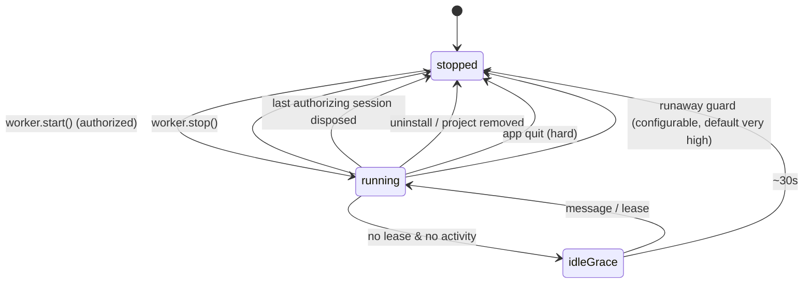

# Mini-App Background Worker API

> Status: design. This revision corrects the security-boundary argument to match
> the **actual production code path** (sandboxed `<iframe>` + `superone-app://`
> protocol + injected bridge), not the dev webview/preload path.

## 1. Motivation

Mini-apps run inside an `<iframe>` whose JS context is destroyed when the panel
is closed (`MiniAppHostLayer` removes the instance → React unmounts → DOM
destroyed). Any in-flight work dies with the DOM, even though — see §3 — the
app's *permissions* actually outlive the panel.

A user wants to start a long download from a mini-app and have it continue while
the panel is closed. Generalized: a real **background worker** running arbitrary
mini-app JS.

## 2. Constraints (decided)

1. **Not download-only.** Worker runs arbitrary mini-app JS.
2. **Worker security boundary must be *identical to the iframe's*** — and proven
   by **reusing the same production primitive**, not by re-deriving it.
3. **No host-managed `tasks` layer.** Cross-app-restart durability is out of
   scope. Resumable download is the mini-app's job (`fetch` + `Range` +
   `superone.kv` checkpoint).

## 3. Ground Truth in Current Code (verified)

These determine the whole design and were previously misstated:

- **Production transport is iframe + custom protocol + injected bridge, NOT
  preload.**
  `MiniAppFrame.tsx:35` renders `<iframe src="superone-app://<host>/index.html"
  sandbox={sandbox} allow={allow}>`; the bridge is injected by the
  `superone-app://` protocol handler; host side is `useMiniAppBridge` →
  `handleMiniAppMessage` → `window.miniapp` IPC.
  `apps/desktop/src/preload/miniapp-preload.ts` uses `ipcRenderer.sendToHost`
  and is the **dev `<webview>` path only** (`MiniAppDevFrame`). A standalone
  top-level `BrowserWindow` cannot use `sendToHost`. **"Reuse the same preload"
  is invalid.**

- **iframe sandbox ≠ `webPreferences.sandbox`.**
  `MiniAppFrame.tsx:38` `sandbox={sandbox}` comes from `buildMiniAppFrameAttrs`
  (base `allow-scripts`; `allow-same-origin` only added for storage/media). This
  HTML `sandbox` attribute (blocks top-nav, `window.open`, form submit, etc.) is
  unrelated to a `BrowserWindow`'s process `webPreferences.sandbox`. A top-level
  window does **not** inherit these restrictions.

- **Permissions are session-scoped, not panel-scoped.**
  `MINIAPP_CLOSE` (`index.ts:1883`) is explicitly *"purely a UI action"* and
  only adjusts `miniAppSessionRefs`. fs/media grants are cleared by
  `SessionManager.disposeSession` (`session-manager.ts:374-375`,
  `clearAllowedDirectories` / `clearAllowedMedia`) and by `MINIAPP_UNINSTALL`.
  → The earlier premise "closing the panel kills the boundary" is **false**. The
  boundary already survives panel close; it ends at **chat-session dispose** or
  uninstall.

## 4. Corrected Architecture

### 4.1 Boundary equivalence by *path reuse*

The worker must execute mini-app code in the **exact same primitive** as
production: a sandboxed `<iframe src="superone-app://<host>/background.html">`
with the **same `buildMiniAppFrameAttrs` sandbox/allow**, the **same
`superone-app://` protocol + injected bridge**, the **same dispatch table**
(worker uses the role-gated *headless variant*, §4.6 — not the full UI
handler), and therefore the **same main-process IPC auth chain**.

The only thing that differs is **where that iframe lives**:

| | Visible mini-app | Worker |
|---|---|---|
| Container | iframe in the panel renderer (unmounts on panel close) | iframe in a **hidden, panel-independent host shell renderer** |
| Sandbox attrs | `buildMiniAppFrameAttrs(...)` | **same call, same result** |
| URL / bridge | `superone-app://.../index.html` + injected bridge | `superone-app://.../background.html` + **same** injected bridge |
| Host side | `useMiniAppBridge` → full `handleMiniAppMessage` | **same dispatch table**, role-gated **headless variant** (§4.6) |
| Main IPC auth | `window.miniapp` handlers | **same** handlers |

So equivalence is *by construction* — the worker reuses the production
protocol/bridge/auth path verbatim, differing only by the role-gated headless
handler variant. The hidden `BrowserWindow` is a **headless host shell**
(trusted host code) that receives **zero** app capabilities — and to make
"zero" literal it must use a **dedicated minimal preload** (§4.2), not the
default `index.js` preload (which exposes `electron/agent/app/miniapp` to every
window — `apps/desktop/src/preload/index.ts:1046-1049`). The mini-app runs only inside the nested sandboxed iframe,
exactly as in the visible panel. The single delta is a `role: 'worker'` flag
passed to the (same) injected bridge so it also exposes `superone.self`
(§5) — a small, testable addition on the same path, not a new transport.

> Why a hidden `BrowserWindow` is still the right shell: we need a renderer that
> can host a `superone-app://` iframe and is independent of panel/window
> lifetime. `utilityProcess` is Node-only (no DOM, no custom-protocol iframe,
> no shared path) — rejected. Hidden renderer is the documented Electron pattern
> (Electron [Performance](https://www.electronjs.org/docs/latest/tutorial/performance),
> [electron-load-balancer](https://github.com/Pipe-Runner-Lab/electron-load-balancer)).

### 4.2 Worker shell hardening (required, was missing)

The hidden shell window must explicitly neutralize what a top-level window would
otherwise allow (since iframe-sandbox semantics do not apply to the window
itself):

- `webContents.setWindowOpenHandler(() => ({ action: 'deny' }))`
- block `will-navigate` / `will-redirect` to anything outside the worker entry.
- **Dedicated minimal preload + `WindowRole.WorkerHost` (locked).** The shell
  window must NOT use the default `index.js` preload (it exposes
  `electron/agent/app/miniapp` to every window —
  `apps/desktop/src/preload/index.ts:1046-1049`). Add `WindowRole.WorkerHost`
  (the enum already drives `roleArg()` / `additionalArguments`, e.g.
  `WindowRole.Main`/`Mini` at `index.ts:293,378`) and a new minimal preload that
  exposes **only** the miniapp-bridge IPC the headless shell needs — nothing
  from `agent`/`app`. Minimizes the hidden-window attack surface; makes the
  "zero capabilities" claim literal.
- **Dedicated partition (locked, not an open item).**
  `session.setPermissionRequestHandler` must NOT be re-`set` on
  `session.defaultSession` (the app's media handlers live there,
  `index.ts:2304-2324`; a second `set` silently overrides). Decision: the shell
  window runs on its **own `partition`**. Extract a shared
  **`registerMiniAppProtocolHandlers(session)`** (the `superone-app://` protocol
  + CSP + network allowlist registration currently bound to `defaultSession`)
  and call it for both the default session and the worker partition — **one
  implementation, two sessions**, never a fork. A deny-all permission handler is
  set **only on the worker partition**. This is the only way to harden the shell
  without clobbering the global media handler.
- **Storage-partition nuance (new known limitation).** Option 1 means the
  worker iframe's web-origin storage (IndexedDB/localStorage under
  `allow-same-origin`) lives in a different partition than the visible iframe,
  so the two do **not** share web storage. This is acceptable because the
  documented cross-context handoff is `superone.kv` (main-process, partition-
  independent), not web storage — must be called out in the guide so apps don't
  rely on shared `localStorage` between panel and worker.
- Verify the `superone-app://` CSP and network allowlist apply to the nested
  iframe on whichever partition is chosen — covered by an integration test, not
  assumed.
- `nodeIntegration:false`, `contextIsolation:true`; the shell page is static and
  ships in the renderer build.

### 4.3 Lifetime model (corrected — anchored to the session, not the panel)

Because permissions live until **session dispose**, the worker must not outlive
the authorizing session (outliving it would be privilege escalation beyond the
iframe's own boundary). Model:

- **Authorization anchor (corrected).** Do **not** anchor to
  `miniAppSessionRefs` (`index.ts:256`) — that set is *panel presence* and
  `MINIAPP_CLOSE` deletes the session from it (`index.ts:1891-1894`), so a
  closed panel would falsely read as "unauthorized". The real source of truth is
  the MCP server's session→app registration, queried via
  **`isAppStillAuthorizedInProject(projectDir, appId)`**
  (`apps/desktop/src/main/mcp/superone-mcp-server.ts`), the exact predicate
  `SessionManager.disposeSession` already uses to decide grant teardown
  (`session-manager.ts:369-377`). A worker is keyed by `(appId, projectDir)` and
  authorized iff `isAppStillAuthorizedInProject` is true.
- **Panel close**: no effect — `isAppStillAuthorizedInProject` stays true; the
  worker shell is independent of the panel renderer. This is the core
  capability.
- **Session dispose** of the last authorizing session: hook into the **existing
  cleanup block** in `session-manager.ts:369-377` — right where
  `unregisterSessionAllApps` → `!isAppStillAuthorizedInProject` →
  `clearAllowedDirectories/clearAllowedMedia` runs, add: stop the worker and
  destroy its shell **before** `clearAllowedDirectories`. The worker can never
  operate without the grants the iframe would have had.
- **Uninstall / project removal**: stop + destroy.
- **App quit**: hard boundary — all renderer contexts die (§4.5).

`AppSecurityContext` (optional refactor) is therefore **not** needed to "keep
perms alive across panel close" (they already are). Its only justified roles:
(a) a single object to attach the worker-shell ref and the
session-dispose→stop wiring, (b) ensure deterministic teardown ordering with
`clearAllowedDirectories`. If it complicates the existing
`miniAppSessionRefs` + `disposeSession` flow, prefer extending those directly.

### 4.4 Lifecycle (service-worker-ish, no wall-clock feature cap)



- **Lease**: `superone.self.keepAlive(label)` → handle; while any lease is held
  the shell is not reclaimed. `release()` starts the ~30s idle timer.
- **No short wall-clock cap.** The previous "~10 min hard cap" contradicted
  "finish a big slow download". Replaced by: alive while leased *and* an
  authorizing session is alive *and* user has not stopped it. A *runaway guard*
  exists only as an abuse backstop, configurable, defaulting very high (e.g. 6h)
  — it is a safety limit, not a product limit, and surfaces a warning before
  killing.
- One worker per `(appId, projectDir)`; multiple panel instances share it.

### 4.5 Survival matrix (corrected, honest)

| Action | Worker survives? | Notes |
|---|---|---|
| Close mini-app panel | ✅ | Shell window independent of panel renderer; perms already session-scoped |
| Close/minimize main window | ⚠️ conditional | Shell is a separate `BrowserWindow`; **on Win/Linux a hidden window keeps the process alive with no visible window — a ghost-process risk** (§7). Must be mitigated, not advertised as a feature |
| Authorizing chat session disposed | ❌ by design | Worker stopped with grant teardown — must not exceed iframe boundary |
| Quit app | ❌ hard | All renderer contexts die. Mitigated by quit-confirmation gate (§7) |

### 4.6 Headless-safe message handling (was under-specified)

The hidden shell must **not** run the full `handleMiniAppMessage`
(`miniapp-message-handler.ts`) as-is: it contains renderer/UI side effects —
`miniapp-sendPrompt`, `toast`, tooltip/contextmenu/popover, `clipboard`,
`openExternalLink`, `context-set/clear`, `miniapp-media` store writes. In a
hidden window these are either invisible or would mutate the wrong (hidden)
renderer's stores.

Policy: a **single role-keyed capability allowlist** (one source, shared by
panel and worker paths):

- **Headless-safe (allowed in worker role):** `fs`, `kv`, `db`, `git`, network
  (`fetch` via CSP/allowlist), tool result/intercept plumbing, `worker`/`self`
  messaging, `miniapp-ready`/`resize` (no-op in worker).
- **UI-bound (rejected in worker role):** `sendPrompt`, `toast`, tooltip,
  contextmenu, popover, `clipboard`, `openExternalLink`, `context-set/clear`,
  media-store. Worker-role calls return a structured error to the worker
  (`{ error: 'unavailable-in-worker' }`) so the app can branch, rather than
  silently corrupting a hidden store.
- Implementation: extract the dispatch into a table keyed by message type with a
  `headlessSafe: boolean` flag; the worker shell uses a `handleMiniAppMessage`
  variant that rejects non-`headlessSafe` types. The panel path is unchanged.
  (Future: a few UI-bound types like notification *could* be forwarded to the
  main window — out of scope v1; default is reject.)

## 5. API Surface

```ts
interface SuperoneApi {
  worker: {
    start(): Promise<void>      // main re-validates manifest.background + permissions.background
    stop(): Promise<void>
    status(): Promise<{ running: boolean; since?: number }>
    postMessage(msg: unknown): void
    onMessage(handler: (msg: any) => void): () => void
  }
}
// Exposed by the SAME injected bridge only when role==='worker':
interface SuperoneSelfApi {
  onMessage(handler: (msg: any) => void): () => void
  postMessage(msg: unknown): void
  keepAlive(label: string): { release: () => void }
}
declare const superone: SuperoneApi & { self: SuperoneSelfApi }
```

`superone.self` is added to the existing injected bridge runtime
(`miniapp-api-runtime.js`) gated on a `role` flag — **not** a preload addition
(preload is the dev path only).

### 5.1 Broker delivery semantics (specified, was hand-waved)

Foreground⇄worker `postMessage` is brokered by main. Bounded, best-effort:

- One FIFO ring buffer per direction per `(appId, projectDir)`.
- Cap: **100 messages or 256 KB**, whichever first. Overflow → **drop oldest**
  and deliver a `{ type: '__superone_dropped', count }` marker to the receiver.
- TTL **60 s**; expired entries dropped on next flush.
- Buffer **cleared on worker stop**; messages sent to a stopped worker are
  dropped (sender may observe via `status()`), not queued indefinitely.
- Best-effort, no ack/dedup. Durable handoff is the app's responsibility via
  `superone.kv`. Documented explicitly so apps cannot use the broker as
  unbounded memory.

### 5.2 Manifest + enforcement

```jsonc
{
  "background": { "entry": "background.html" },
  "permissions": { "background": { "reason": "Continue downloads with the panel closed" } }
}
```

- `worker.start()` is **enforced in main**: reject unless the manifest has a
  valid `background.entry` *and* `permissions.background` is granted. Hiding the
  JS API is not enforcement.
- **Session attribution (was missing).** `handleMiniAppMessage` currently has no
  `sessionId` argument (signature: `type,data,appId,projectDir,send,overlay`),
  but the `MINIAPP_OPEN`/`MINIAPP_CLOSE` IPC handlers do receive `sessionId`.
  The `worker.start` IPC payload must carry the authorizing `sessionId`. Add an
  **explicit** query to `apps/desktop/src/main/mcp/superone-mcp-server.ts`:
  `isSessionAuthorizedForApp(sessionId, projectDir, appId): boolean` (trivial —
  the registry is already keyed `${sessionId}::${appId}` with `projectDir` on
  the entry, `superone-mcp-server.ts:52-53`). Main validates **that** plus
  `isAppStillAuthorizedInProject(projectDir, appId)`. `WorkerHost` must use this
  function, **not** read `getAppToolDefs()`'s Map directly. Reject otherwise.
- Install/first-use consent UI shows `permissions.background.reason`, same
  channel as other permission reasons; user can deny → `worker.start()` rejects.

## 6. Reference Implementation (developer-facing)

Foreground and `background.js` are unchanged from the prior draft (resumable
download via `fetch` + `Range` + `superone.kv`, lease around the work). See §6
example retained below.

```js
// background.js
superone.self.onMessage(async (msg) => {
  if (msg.type === 'query') { if (current) emit('progress', current); return }
  if (msg.type === 'download') runDownload(msg.url, msg.dest).catch(e => emit('error',{error:String(e)}))
})
async function runDownload(url, dest) {
  const lease = superone.self.keepAlive(`download ${dest}`)
  try {
    const k = `dl:${dest}`, c = (await superone.kv.get(k)) ?? { received: 0, etag: null }
    const res = await fetch(url, c.received ? { headers: { Range: `bytes=${c.received}-`, 'If-Range': c.etag ?? '' } } : {})
    const total = c.received + Number(res.headers.get('content-length') ?? 0)
    const etag = res.headers.get('etag'); const r = res.body.getReader(); let received = c.received
    for (;;) { const { done, value } = await r.read(); if (done) break
      await superone.fs.writeFile(dest, value, { append: received > 0 })
      received += value.byteLength
      current = { received, total, percent: Math.floor(received/total*100) }
      await superone.kv.set(k, { received, etag }); emit('progress', current) }
    await superone.kv.delete(k); current = null; emit('done', { path: dest })
  } finally { lease.release() }
}
```

Resumability across app restart is the **mini-app's** responsibility, not a host
feature.

## 7. UI/UX & ghost-process mitigation (strengthened)

- **App-icon indicator**: thin progress ring on the existing Apps-panel icon
  (dye existing element, no new badge).
- **Main window closed while a worker runs (Win/Linux)**: a sidebar popover is
  insufficient (no window to host it). Required mitigation, pick one and
  implement explicitly:
  1. **Tray icon** showing active workers + Stop + reopen, *and*
  2. When a worker is active, intercept main-window close → **hide/minimize to
     tray instead of destroy**, with a one-time notice "Still running in
     background"; full quit only via tray/confirm.
- **Quit gate**: extend `before-quit` (`index.ts:2436`, currently
  `agentService.hasRunningSessions()`) to also check `workerHost.hasActiveWorkers()`
  → confirm "Background work running; quitting interrupts it."
- **Completion/failure**: panel closed → native `Notification`; panel open →
  app UI / existing overlay toast.
- **Reopen**: iframe remounts → `worker.status()` + a `query` message
  rehydrates UI.

Wording rule: do **not** claim "finishes whether or not the panel stays open"
unconditionally. Accurate claim: *"continues while the authorizing session is
alive and the worker holds a lease; user-visible and user-stoppable; does not
survive app quit."*

## 8. File-Level Plan (revised)

**Schema / types**

- `miniapp-schema.ts` — add `background?: { entry: string }`,
  `permissions.background?: { reason: string }`.
- `packages/shared/src/miniapp-types.ts` — add `MiniAppBridgeMessageType`:
  `miniapp-worker-start/stop/status/status-result`, `miniapp-worker-msg`,
  `miniapp-worker-event`, `miniapp-worker-lease`, `miniapp-worker-lease-release`,
  `__superone_dropped`.
- `packages/shared/src/agent-types.ts` — `miniapp:` IPC channels for
  start/stop/status/send + worker event.

**Bridge runtime (same injected path, not preload)**

- `packages/shared/src/miniapp-api-runtime.js` — add `worker` namespace
  always; add `self` namespace gated on injected `role==='worker'`.
- `miniapp-api-runtime.d.ts`, `miniapp-templates.ts#generateSuperoneDts` — types.
- `apps/desktop/src/main/miniapp/miniapp-bridge.ts` — pass `role` into the
  injected script for the `superone-app://` path.

**Hidden worker shell (new)**

- New static host page in the renderer build,
  `apps/desktop/src/renderer/worker-host.html` + tiny entry, that mounts one
  `<iframe src="superone-app://<host>/<background.entry>">` using
  `buildMiniAppFrameAttrs` and runs the **headless-safe** handler variant
  (§4.6) — a headless `MiniAppFrame`/`useMiniAppBridge` equivalent, no UI stores.
- `apps/desktop/electron.vite.config.ts` — the renderer `rollupOptions.input` is
  currently a single `src/renderer/index.html` (line 80). Add a **second input**
  for `worker-host.html` (multi-input is already used in the main/preload
  sections, lines 30-51), or reuse `index.html` with a `?mode=worker-host`
  branch. Multi-input preferred (smaller worker bundle, no app code).
- New **minimal worker-host preload** (e.g.
  `apps/desktop/src/preload/worker-host-preload.ts`) exposing only the
  miniapp-bridge IPC the headless shell needs — no `agent`/`app`. Add
  `WindowRole.WorkerHost` to the `WindowRole` enum + `roleArg()` plumbing
  (alongside `Main`/`Mini`, `index.ts:293,378`).
- Extract **`registerMiniAppProtocolHandlers(session)`** from the current
  `defaultSession`-bound `superone-app://` protocol + CSP + network registration;
  call it for both `defaultSession` and the worker partition (§4.2). One impl,
  two sessions.
- `apps/desktop/src/main/miniapp/worker-host.ts` (new) — `WorkerHost`:
  create/destroy hidden `BrowserWindow` on a **dedicated partition** with the
  **worker-host preload**, independent of `mainWindow`, §4.2 hardening (deny-all
  permission handler on that partition only, window-open/nav deny), lease
  registry + idle timer + runaway guard, the §5.1 bounded broker,
  `hasActiveWorkers()`, stop-on-session-dispose / uninstall. Authorization
  checks go through `isSessionAuthorizedForApp` — never reads tool-def Maps.

**Main wiring**

- `apps/desktop/src/main/index.ts` — register IPC; `worker.start()`
  manifest+permission enforcement; extend `before-quit` gate; main-window-close
  interception (§7).
- `apps/desktop/src/main/session/session-manager.ts` — inside the existing
  cleanup block (`:369-377`), where `!isAppStillAuthorizedInProject(...)` gates
  `clearAllowedDirectories/clearAllowedMedia`, add `workerHost.stop(projectDir,
  appId)` **before** the clears. Authorization anchor is
  `isAppStillAuthorizedInProject` (MCP server), **not** `miniAppSessionRefs`.
- `apps/desktop/src/main/mcp/superone-mcp-server.ts` — add
  `isSessionAuthorizedForApp(sessionId, projectDir, appId): boolean` (registry
  keyed `${sessionId}::${appId}`, `:52-53`).
- `worker.start` IPC validation: `isAppStillAuthorizedInProject(projectDir,
  appId)` **and** `isSessionAuthorizedForApp(sessionId, projectDir, appId)` (§5.2).
- No `app-security-context.ts` / `miniAppSessionRefs` refactor — authorization
  already has a correct owner (MCP-server registry + `disposeSession`); reuse it.

**Renderer / IPC surface**

- `miniapp-message-handler.ts` — extract the type→handler dispatch into a table
  with a per-type `headlessSafe` flag (§4.6); export a headless variant that
  rejects non-safe types. Panel path unchanged. Handle `miniapp-worker-*`.
- `window.miniapp` (preload + types) — `workerStart/Stop/Status/Send` + event
  subscription; `workerStart` payload carries the authorizing `sessionId`.

**Dependency**

- `superone.fs.writeFile` `{ append?: boolean }` — handler in
  `miniapp-service.ts` + runtime + d.ts + guide.

**Docs**

- `guides/api/worker.md` (new) incl. the accurate survival caveats; update
  `manifest.md`, `permissions.md`, `overview.md`; add `examples/miniapp`
  background demo.

## 9. Tests (integration-first)

- `miniapp-worker-survives-panel-close.test.ts` — start worker, unmount
  `MiniAppView`; assert grants intact (session alive), worker completes scoped
  `fs.writeFile`, reopen rehydrates.
- `miniapp-worker-boundary-equivalence.test.ts` — assert the worker iframe gets
  the **same** `buildMiniAppFrameAttrs` output, same `superone-app://` CSP, same
  network allowlist; an out-of-scope path / undeclared domain is rejected
  identically to the panel iframe.
- `miniapp-worker-authorization-anchor.test.ts` — `MINIAPP_CLOSE` (panel close)
  removes the session from `miniAppSessionRefs` yet `worker.start()`/keepalive
  still succeed because `isAppStillAuthorizedInProject` is true; worker stops
  **only** when that predicate flips.
- `miniapp-worker-stops-on-session-dispose.test.ts` — disposing the last
  authorizing session (predicate flips false) stops the worker and destroys the
  shell before grant teardown, inside the `session-manager.ts:369-377` block.
- `miniapp-worker-headless-policy.test.ts` — UI-bound types in worker role
  return `unavailable-in-worker`; data APIs succeed; panel path unaffected.
- `miniapp-worker-shell-hardening.test.ts` — `window.open`, external nav,
  permission requests on the shell are denied.
- `miniapp-worker-broker.test.ts` — FIFO, cap/overflow drop-oldest + marker,
  TTL, cleared on stop.
- Mock network and the hidden `BrowserWindow` at true boundaries only.

## 10. Decisions / Open Items

| Item | Decision |
|---|---|
| Worker generality | Arbitrary mini-app JS |
| Boundary proof | **Reuse production iframe + `superone-app://` + injected bridge in a headless hidden shell**; equivalence by path reuse, verified by tests — *not* "same preload" |
| Container | Hidden independent `BrowserWindow` as headless shell hosting the sandboxed iframe; hardened per §4.2 |
| Authorization anchor | **`isAppStillAuthorizedInProject` (MCP-server registry)**, the predicate `disposeSession` already uses — **NOT `miniAppSessionRefs`** (panel presence, mutated by `MINIAPP_CLOSE`) |
| Permission lifetime | Session-scoped (already true in code); worker stop wired into the existing `session-manager.ts:369-377` cleanup, before `clearAllowedDirectories` — never exceeds iframe boundary |
| Session attribution | `worker.start` IPC carries authorizing `sessionId`; main validates via new **`isSessionAuthorizedForApp(sessionId, projectDir, appId)`** in `superone-mcp-server.ts` (not by reading tool-def Maps) |
| Shell preload | **Locked**: dedicated minimal worker-host preload + new `WindowRole.WorkerHost` — NOT the default `index.js` preload (exposes `agent/app/miniapp` to all windows, `preload/index.ts:1046-1049`) |
| Shell permission handler | **Locked**: dedicated `partition` + shared extracted `registerMiniAppProtocolHandlers(session)`; deny-all handler on the worker partition only. Never re-`set` on `defaultSession` (`index.ts:2304-2324`) |
| Headless-safe handler | UI-bound message types (`sendPrompt`/`toast`/`clipboard`/popover/context/media) **rejected in worker role** via a role-keyed allowlist; data APIs (fs/kv/db/git/net) allowed |
| Storage partition nuance | Dedicated partition → worker & panel do NOT share web storage; cross-context state must use `superone.kv` (documented) |
| Renderer build | Add `worker-host.html` as a 2nd rollup input in `electron.vite.config.ts` |
| Panel close | No effect (the actual capability) |
| `tasks` layer | Dropped |
| Lifecycle cap | Lease + 30s idle + session lifetime; runaway guard only (configurable, very high), **no short wall-clock feature cap** |
| Broker | Bounded FIFO, 100 msg / 256 KB / 60 s TTL, drop-oldest + marker, cleared on stop |
| `permissions.background` | Enforced in main at `worker.start()` + consent UI |
| Ghost process (Win/Linux) | **Open**: must implement tray + main-window-close→hide before shipping; not solved by sidebar popover |
| App-quit survival | Not supported; quit-confirmation gate + KV-checkpoint pattern |
