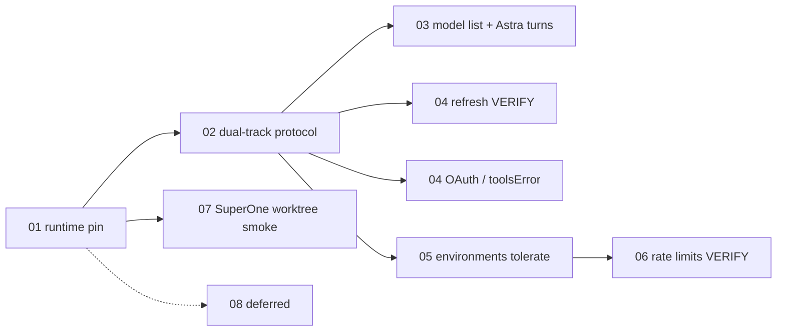

# Codex App Server 0.154 升级计划

状态：修订稿 v4（Codex 审核 rust-v0.153.2 → rust-v0.154.0 后；已吸收 attestation 方向修正）

日期：2026-09-12

目标版本：`@openai/codex` `0.154.0`（GitHub `rust-v0.154.0` / `36eab01061`，2026-09-09）

对比基线：`0.153.2`（`rust-v0.153.2` / `79016fcca2`）。不跟 `0.155.0-alpha.*`。本地 Codex 克隆 `~/Developer/Github/codex` 的 `main` 可能落后于该 tag，审查与 schema 生成都以 **tag** 为准。

0.154 不是 0.147 那种稳定协议面扩展。**稳定** `ClientRequest` 方法集合 102→102，只把 `account/rateLimits/read` 的 params 改成可选 envelope。**稳定** `ServerRequest` 10→10、`ServerNotification` 83→83，没有新的稳定 notification method。产品差异在 runtime 行为、thread 响应字段、模型目录、MCP 诊断，以及 `experimentalApi` 下才出现的 user-verification RPC。

这里的“计划”不代表功能已经实现。

## 文档状态

- **[PLANNED]**：本轮要实现。
- **[VERIFY]**：仓库已有对应能力，升级后对照 0.154 做回归，不新开产品面。
- **[DEFERRED]**：当前不进入实现周期。

## 当前基线

- 桌面 bundled 与 managed runtime 钉在 `@openai/codex` `0.153.2`：
  - [`apps/desktop/package.json`](../../../../apps/desktop/package.json)
  - [`packages/runtime/src/harness/managed-official.ts`](../../../../packages/runtime/src/harness/managed-official.ts) `OFFICIAL_CODEX_NPM_VERSION`
- CHANGELOG `[0.62.0]` 已接入 0.153：structured async questions、live reviewer、remote plugin reconciliation。
- Electron Main 通过 App Server JSON-RPC 连接，`initialize` 启用 `experimentalApi`（[`app-server-connection.ts`](../../../../apps/desktop/src/main/codex/app-server-connection.ts)）。`experimentalApi: true` **不会**自动打开 elicitation `openai/userVerification`；那条要专门的 extensions opt-in。
- SuperOne 已有 `thread/{start,resume,fork,revert}`、`turn/{start,steer,interrupt}`、`review/start`、`thread/compact/start`、Goals、`model/list`、Skills、Hooks、`plugin/{list,reconcile,installed}`、MCP 状态、账户用量、realtime、async questions。
- SuperOne 自己的 session fork 已经能切 git worktree；不要用 Codex 原生 `--worktree` 再做一套。
- renderer 不持有 Codex 连接或凭据。新会话能力优先走 `EnvironmentGateway`。

## 推荐顺序

1. 钉 pin、分别生成 **稳定** 与 **`--experimental`** schema、三端 smoke `initialize`。
2. 双轨协议审查：未知 **notification** 可忽略；带 id 的未知 **server request** 必须 `-32601`。Rewind 保持 exclusive `beforeTurnId`。
3. 动态 `model/list` 作目录；有明确用户选择才显式传 model。无选择时省略，保留服务端 `config.model` 解析。有 entitlement 时跑 Astra **真实回合**。CLI 静态表只当离线 fallback。
4. 插件 / skills / hooks 热刷新回归（VERIFY）；MCP `toolsError` 诊断与 OAuth `_meta` challenge 桥接（PLANNED）。
5. Thread 响应对 `environments` 容忍。不把 TUI changelog 当成 app-server 新权限默认规则。
6. `account/rateLimits/read` 无参兼容（VERIFY）；新参数 / Luna Reserve UI 可选且默认省略 `supportsLunaReserve`。
7. SuperOne 自有 worktree fork smoke。原生 Codex worktree、Windows daemon、user-verification ceremony、context 设置、TUI 复刻暂缓。Windows sandbox setup/readiness/首条 command 不随 daemon 延期。

## 明确不做（本轮）

- 把 rewind 的 `beforeTurnId` 改成 `lastTurnId`。两者语义不同（exclusive vs inclusive）；`experimentalApi` 下 fork 已支持 `beforeTurnId`。
- 按「0.154 才有 saved permissions」给 SuperOne 做 runtime 分支，或无条件省略 resume 上的显式权限。saved policy 在 0.153.2 已有；首次 `turn/start` 仍会覆盖。权限 inherit 若要做，单开全路径设计，不塞进这次 pin。
- 把连接池 / 60s idle-release 写成与 Windows daemon 等价。
- 把 `experimentalFeature/enablement/set` 当只读，或假设能打开 `context_management`（allowlist 不含它）。
- 把 `ThreadList` 的 originators 过滤当成本地 app-server 可用能力（非空过滤会被拒）。
- 复刻 TUI、原生 worktree 工作流、user-verification ceremony。
- 为 `userVerification/{status,enroll,delete,verify}` 增加入站 responder（它们是出站 ClientRequest）。
- 打开 `requestAttestation` 或实现 `attestation/generate`；该 ServerRequest 本轮保持关闭，收到则 `-32601`。
- 无用户选择时把 `model/list` picker default 写进 `thread/start`，覆盖服务端 `config.model`。
- 把 MCP `toolsError` 伪装成 disconnected / failed 连接状态。

## 横向验收要求

- 桌面 bundled、CLI managed、harness 发布 pin 三个数字一致，都是 `0.154.0`。
- 现有 run / review / compact / steer / interrupt / permission / async question / plugin reconcile / realtime 测试通过。
- 新字段不得让现有 parser 抛错。
- 带 id 的未知 server request 不得回空对象或泛化 `deny` 冒充成功。
- 本地与远程 runtime 不一致时警告，不静默切换。
- 不在 renderer 暴露 API key、ChatGPT token、MCP OAuth refresh token。
- 测试按风险：协议/回归项有单测或 smoke；纯 TUI / DEFERRED 不制造无意义测试。

## 功能文档

| 文件 | 功能 | 状态 |
|---|---|---|
| [01-runtime-upgrade.md](./01-runtime-upgrade.md) | 0.154.0 runtime pin、双轨 schema、发布清单 | [PLANNED] |
| [02-protocol-compat.md](./02-protocol-compat.md) | 稳定 vs experimental schema、未知 request、rewind 语义、async 非结束 turn | [PLANNED] |
| [03-models-astra.md](./03-models-astra.md) | 动态目录、entitlement 下的 Astra 真实回合 | [PLANNED] |
| [04-live-refresh.md](./04-live-refresh.md) | 热刷新回归；OAuth `_meta` 与 `toolsError` | [VERIFY] + [PLANNED] |
| [05-thread-lifecycle.md](./05-thread-lifecycle.md) | `environments` 容忍；不改权限 inherit | [PLANNED] |
| [06-rate-limits.md](./06-rate-limits.md) | 无参兼容；Reserve 默认 omit | [VERIFY] |
| [07-worktree.md](./07-worktree.md) | 原生 worktree 暂缓；自有 worktree smoke | [DEFERRED] + [VERIFY] |
| [08-deferred.md](./08-deferred.md) | daemon、verification ceremony、context、TUI | [DEFERRED] |

## 官方依据

- [Release 0.154.0](https://github.com/openai/codex/releases/tag/rust-v0.154.0)
- 对比：`rust-v0.153.2...rust-v0.154.0`（changelog 标题写的是 `rust-v0.153.0...`，实现审查用 0.153.2）。
- Schema：同一 runtime 分别跑默认 `generate-json-schema` / `generate-ts` 与 `--experimental`。稳定 TS 会滤掉 experimental 方法，**不能只看已过滤 TS**。
- 0.147 功能目录仍有效，本轮只处理 0.153.2 → 0.154.0 的增量。
- 审核证据：Codex 会话对照 tag 源码；临时快照曾在 `/private/tmp/codex-154-review/`。
