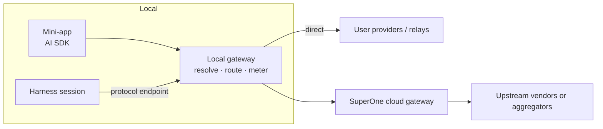

# AI Gateway and mini-app AI API

Status: draft · Updated: 2026-10-01

Scope: expose every AI capability the user has configured — plus, later,
SuperOne's first-party service — through one interface, so mini-app developers
never integrate providers themselves. A developer names a model; the user's
routing settings decide which provider serves it and who pays. The same routing
core serves harness sessions, so agents and apps share model selection,
ordering and metering.

## 1. Decisions

| Question | Decision |
|---|---|
| Developer interface | An AI SDK custom provider. Developers call stock `generateText`, `streamText`, `generateObject`, `embed`, `generateImage`, … with models from `context.ai`. No SuperOne-specific call API. |
| Model selection | The developer names a model id. Required, not optional. |
| Canonical model id | The model creator's own first-party API id (`claude-sonnet-5-5`, `gpt-5.5`, `gemini-3-pro`). SuperOne maintains the mapping to every provider's id. |
| Where routing runs | A local gateway on the user's machine. BYOK traffic goes straight to the user's provider and never passes through SuperOne's cloud. |
| First-party service | One more upstream in the same registry: the credential is the SuperOne account, the endpoint is SuperOne's cloud gateway. Not a separate path. |
| Who pays | Decided by the user's routing settings. Developers never see billing. |

## 2. Current state

| Piece | Where | State |
|---|---|---|
| Platform registry | `packages/shared/src/platform-registry/` | `WireProtocol` × `CapabilityTask` (`chat`, `image`, `video`, `tts`, `asr`) via `PROTOCOL_TASKS` |
| Consumers | `ConsumerId` in `platform-registry/types.ts` | `chat:claude`, `chat:codex`, `media:image`, `media:video`, `tts`, `asr`; defaults in `consumer_bindings` |
| Endpoint choice | `selectEndpoint` | Credential-aware: a media consumer needs an enabled model tagged for the task |
| Enabled models / mapping | `credentials.overrides_json[endpointId].models`, `modelMapping` | Per-credential enabled set; harness model routing |
| Catalog | models.dev (`@opencode-ai/models`) | Keyed by provider; same model appears under several ids |
| Chat proxy | `apps/desktop/src/main/providers/llm-proxy-manager.ts`, transformers in `providers/claude-messages`, `providers/codex-responses` | On-demand sidecar per upstream, idle after 5 min; serves harnesses only |
| Media generation | `apps/desktop/src/main/media-gen/` | Uses AI SDK (`ai` 7, `@ai-sdk/openai`, `@ai-sdk/google`, `@ai-sdk/openai-compatible`); reached by agents through `media_*` MCP tools |
| Remote credentials | `apps/desktop/src/main/environment/node-credential-store.ts` | Credentials held on a remote node |

The routing pieces exist but only `media-gen`, the chat proxy and the agent MCP
tools consume them. Nothing is offered to mini-apps, and chat models' enabled
state has no consumer.

## 3. Architecture



The local gateway grows out of the chat proxy and presents one routing core in
two shapes:

- **Protocol endpoints** (Anthropic Messages, OpenAI Responses, …) for harnesses,
  as the proxy does today.
- **An AI SDK provider** for mini-apps, implementing the `@ai-sdk/provider`
  model interfaces over RPC to the process that holds credentials.

## 4. Mini-app API

```ts
interface SuperOneMiniAppAiApi {
  languageModel(id: string): LanguageModel
  imageModel(id: string): ImageModel
  embeddingModel(id: string): EmbeddingModel
  speechModel(id: string): SpeechModel
  transcriptionModel(id: string): TranscriptionModel
  /** Models the user can reach right now, with capabilities and routes. */
  models(filter?: { task?: CapabilityTask }): Promise<AiModelInfo[]>
}
```

```ts
import { generateText } from 'ai'

const { text } = await generateText({
  model: context.ai.languageModel('claude-sonnet-5-5'),
  prompt,
})
```

Results report the route actually used (provider, provider model id) in
provider metadata. A model with no route fails with a structured
`model_unavailable` error; the host renders guidance to configure a provider or
use a SuperOne account.

Boundary with [miniapp-agent-api.md](miniapp-agent-api.md): `context.ai` is
stateless and never touches the workspace. Anything that edits files, runs
commands or should be visible as a conversation is an agent session.

## 5. Model ids and mapping

The canonical id is the creator's first-party API id. A mapping entry resolves
it for one route:

```ts
interface RouteModel {
  routeModelId: string                    // e.g. 'us.anthropic.claude-…' on Bedrock
  providerOptions?: Record<string, unknown>
  headers?: Record<string, string>        // e.g. a 1M-context beta
  capabilities: ModelCapabilities         // tools, vision, caching, structured output
}
```

| Concern | Rule |
|---|---|
| Alias vs snapshot | A snapshot id routes only to routes serving that exact snapshot; an alias resolves to the latest. |
| Variants | Context-window and reasoning variants map to options/headers, not to a renamed id. |
| Open-weight models | Use the creator's own API id when one exists; otherwise allow a `creator/` prefix for disambiguation only. |
| Custom relays | On setup, list `/v1/models`, normalize (strip vendor prefixes and date suffixes), auto-match, and let the user confirm the rest. |

Mapping sources, by precedence: user overrides → built-in per-provider-type
rewrite rules (Bedrock, Vertex, OpenRouter, …) → catalog data. Storage reuses
`modelMapping` / `overrides_json`.

## 6. Routing

For a request for model `m`:

1. Collect routes: every credential whose endpoint serves `m`, plus the
   first-party upstream when the user has an account.
2. Drop routes lacking a capability the request uses (tools, images,
   structured output).
3. Order by the user's provider ranking, optionally overridden per model.
4. Try in order. Falling back from BYOK to first-party spends money and
   happens only when the user enabled it.

## 7. Metering

Every call — mini-app or harness — passes one metering point that records
tokens / units and cost, attributed to `appId` and `sessionId`. It exists from
the first phase, before first-party billing, so users see per-app spend and
per-app budgets have somewhere to live. First-party billing attaches here
later.

## 8. Security

- Apps never receive keys; calls execute where credentials live.
- The manifest declares the AI tasks an app uses; the user grants them at
  install time.
- Per-app limits (budget, BYOK-only) are enforced at the metering point.

## 9. Phases

1. Extract the resolver and metering point into a platform service; move
   `media-gen` and the `media_*` tools onto it; ship `context.ai` for text,
   objects and images on BYOK.
2. Canonical ids and mapping; route ordering and capability filtering; grow the
   chat proxy into the local gateway serving both shapes.
3. First-party upstream, account and billing; add `embedding` and `rerank` to
   `CapabilityTask`; speech, transcription and video models.

## 10. Open questions

1. BYOK → first-party fallback default and consent UX.
2. First-party upstream: direct vendor contracts, an aggregator, or both.
3. Which side resolves calls for a mini-app on a remote node — proposed: the
   side running the MiniApp Host, matching the agent layer.
4. Whether WebViews get `context.ai` directly or only via `superone.node`.
5. Long-running jobs (video): job handles that survive restarts, stored with
   existing media outputs.
