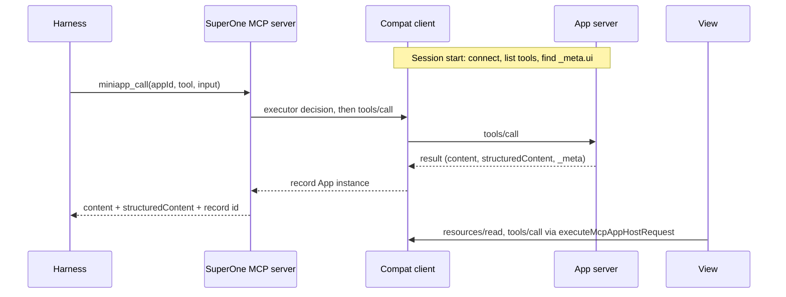

# MCP Apps compatibility layer through mini-apps

Status: paused · Updated: 2026-10-03

Paused by product priority: SuperOne mini-apps are the primary App surface on
every harness, and MCP Apps stay on each harness's native support. The phase 1
Cursor pilot stays as shipped, behind the Cursor setting that is off by
default; no further phases are planned until this is reopened.

Part of [mini-apps-and-mcp-apps.md](mini-apps-and-mcp-apps.md).

Scope: give every harness the full capabilities of MCP Apps servers, including
those built with OpenAI's MCP extensions, by serving a server through the
mini-app path whenever the harness cannot carry what that server uses. That is
every App server on harnesses with no MCP Apps support (OpenCode, Cursor, dsh,
Grok), and servers using extensions a native harness does not pass through
(today Claude). The host, View, executor
and shared contract are described in
[features/mcp-apps.md](../features/mcp-apps.md); OpenAI extensions in
[mcp-apps-openai-extensions.md](mcp-apps-openai-extensions.md). The parked
[mcp-apps-gateway.md](mcp-apps-gateway.md) proposes replacing the rerouting
through `miniapp_call` with a gateway under the original server name, now that
Codex and Claude identify their calls in request `_meta`.

## 1. Decisions

- **Native when it covers the server.** Per server and harness: if the
  harness carries every extension the server uses, the server stays native.
  Otherwise the session reroutes it through the layer. The coverage per
  harness is the table in
  [mcp-apps-openai-extensions.md](mcp-apps-openai-extensions.md) §3. Cosmetic
  gaps (a tool title or icon) fall back and never reroute; functional gaps do:
  any App use on a harness without MCP Apps, and on Claude `openai/settings`
  and file entrypoints. A rerouted server also gets OpenAI forms, since
  SuperOne advertises them.
- **The harness keeps its config.** Servers are configured where that harness
  reads them: Claude's own config files, the shared config SuperOne hands to
  ACP, Cursor and OpenCode, and dsh's own `cordis.patch.yml`. The layer reads the same source and never
  writes it, and it adds no separate place to install servers.
- **Session-level rerouting.** In a SuperOne session, a server the harness does
  not cover is left out of the list handed to the harness and served through
  the mini-app path instead. There is one connection and one tool
  surface. Outside SuperOne, the harness behaves as configured.
- **Mini-app path.** App tools are reached with the existing `miniapp_list` /
  `miniapp_call`, which every harness already has through the SuperOne MCP
  server. Entrypoints and settings use the mini-app shell. The View stays in
  the MCP App sandbox and never gets the mini-app preload.
- **SuperOne is the MCP client.** It advertises the UI extension and the
  OpenAI extensions it implements, reads titles, icons and capabilities, and
  injects request `_meta`, so these harnesses get the full extension set.
- **Cursor pilot is user opt-in.** Rerouting is off by default, enabled only in
  the existing Cursor Preferences UI, with an explicit explanation that
  SuperOne starts local App servers outside Cursor's team MCP allowlist,
  network controls and sandbox. SDK 1.0.30 cannot expose those team controls for
  detection. Agent config tools cannot enable it; sandbox requests stay native
  even with the opt-in. This user decision accepts the disclosed boundary for
  the pilot and does not settle policy integration for later harnesses.

## 2. Flow

- **Discovery.** At session start the layer connects to each server in the
  harness's list (reusing the client code of `mcp-probe-service.ts`) and
  records the extensions it uses: tools with `_meta.ui`, tool
  `_meta["openai/*"]` (entrypoints, `mentions/search`) and
  `capabilities.extensions["openai/*"]`. Servers the harness covers are handed
  to it unchanged.
- **Undetectable extensions.** `openai/elicitation` forms are sent at run time
  and cannot be seen in advance. A server that uses only them is not
  rerouted; on a harness without the extension it degrades to that harness's
  standard elicitation, as the server's own fallback.
- **Visibility.** `miniapp_list` shows only tools whose visibility includes
  `"model"`; `miniapp_call` rejects the rest. App-only tools are reachable only
  from the View, through the existing provider dispatch gate.
- **Results.** The harness receives `content` and `structuredContent` (required
  when the tool declares `outputSchema`). The full result, including private
  `_meta`, stays in the host record for the View.
- **Correlation.** SuperOne produces the `miniapp_call` result, so it embeds the
  App record id there. The row finds its record by that id, never by tool name
  or arguments. Each SuperOne MCP endpoint is already per session.
- **Provider.** The layer is one more `McpAppsProvider`; activation, history
  restore, the phone projection and the executor work unchanged.

## 3. Harness routing

| Harness | Where its servers come from | Rerouting point | Status |
|---|---|---|---|
| Codex | Codex config | Not needed today: Codex carries the whole set | — |
| Claude | Claude config files, read by the CLI | A per-session exclusion (`strictMcpConfig` with an explicit list, or disabled-server settings) | To verify |
| ACP (Grok) | Shared config, pushed in `session/new` (`acp-mcp.ts`) | Omit from the pushed list | Feasible |
| Cursor SDK | Shared config, built per session (`cursor-mcp.ts`) | Omit from `mcpServers` after user opt-in; sandbox requests stay native | Local stdio pilot implemented/tested, off by default; live model turn unverified (isolated profile has no API key) |
| OpenCode | Shared config, added with `mcp.add`; OpenCode also loads its own `opencode.json` | Omit from `mcp.add`; servers from `opencode.json` need a per-session disconnect | To verify |
| dsh | `~/.dsh/profiles/<profile>/cordis.patch.yml` | A per-session override of the Cordis entry | To verify |
| Remote node | `mcp-merge.ts` | Same omission on the node | To verify |

## 4. Permissions and OAuth

- Agent calls go through the `miniapp_call` executor decision, not the
  harness's per-server rules. App servers get their own approval entry,
  defaulting to ask, with per-tool allow.
- View calls follow the existing policy: no host approval for the person
  operating the View, `ui/message` confirmed.
- SuperOne owns auth for the servers it connects: PKCE, protected-resource and
  authorization-server discovery, dynamic client registration or a
  pre-registered client, tokens encrypted at rest (Electron `safeStorage` on
  desktop, a CLI store on nodes), single-flight refresh. Tokens the harness
  stored for itself are not reused, so a server may need one sign-in in
  SuperOne. Retry only after an auth rejection known not to have executed.

## 5. Phases

1. Rerouting and discovery on Cursor or ACP with the fixture server: model
   calls through `miniapp_call`, View on the row, View tool calls.
2. OAuth, then OpenCode, dsh and Claude rerouting.
3. Entrypoints and settings on the mini-app shell, shared with
   [mcp-apps-openai-extensions.md](mcp-apps-openai-extensions.md).
4. Remote nodes and the phone.

## 6. Pilot findings and open questions

- How well models use App tools through `miniapp_list` / `miniapp_call`
  compared with native tool names, and whether the layer should hand the
  model a short usage note per server.
- **Discovery (phase 1):** when the user opts in, the first local Cursor turn
  waits for discovery, bounded to 10 seconds per server. Non-App discovery is cached in memory by
  local node/config fingerprint, including cwd for relative stdio paths, so
  later sessions do not start a second probe. App connections are retained for
  their session. A failure or timeout stays native for that session; HTTP/SSE
  (including servers requiring auth) stay native in this local-only pilot.
  Discovery includes visibility-only `_meta.ui` declarations; malformed
  visibility grants neither the model nor the View. Cache entries validate
  config/environment changes without adding credential values to the binding.
- **Process (phase 1):** the compat client runs in main, lazy-loaded at local
  Cursor use, and supervises stdio children. Moving it to a MiniApp Host for
  crash isolation remains a later decision; Views keep the MCP App sandbox.
- **Restrictions (phase 1):** a Cursor session requesting sandbox skips compat
  discovery/rerouting, closes any existing compat client and keeps native MCP
  servers. Cursor SDK also applies organization MCP/network controls separately
  from the session sandbox. Its public API and account metadata cannot detect
  these policies; the internal dashboard service has only an in-memory cache.
  The user chose default-off, UI-only opt-in with a plain-language disclosure
  of the bypass. Fully native routing includes no discovery spawn while off;
  changes take effect at the next runtime start/rebuild and close prior compat
  clients when disabled. Automatic team-policy detection/enforcement remains
  unavailable; future harness coverage still needs its own policy decision.
  See the
  [Cursor contracts](../harness/cursor/contracts.md).
- **Correlation (phase 1):** a host-generated random UUID travels as the first
  text content block, `[superone-mcp-app:<id>]`. Cursor SDK 1.0.30 drops both
  `structuredContent` and `_meta` and may serialize its content envelope as
  JSON; the marker survives its summary cap. Only an exact `miniapp_call` row
  in that session can claim its host record, once, and the host stamps that
  row's real harness call id. No tool-name/arguments/FIFO matching. A direct
  upstream call-id path remains open: Cursor sends only `{name, arguments}`
  to MCP, even though its internal client holds the harness call id.
  Unclaimed records expire after five minutes even if the session is idle;
  each session retains at most 32 and evicts the oldest when full. Expired or
  evicted markers cannot attach a View; already attached records are unaffected.
- **Catalog refresh (phase 1):** ordinary provider reads use the session's
  cached catalog. The shared View gate requests one refresh when a tool is
  missing; concurrent refreshes share a paginated `tools/list`, bounded to
  10 seconds / 100 pages, with a 10-second cooldown. Known visibility denials
  never refresh. Refreshed descriptors retain visibility normalization and
  server attribution; app-only tools stay out of `miniapp_list`.
- **Result data (phase 1):** the View reads the original result from the
  bounded host record. Initial results beyond the shared 2 MiB initial-result
  cap retain a working View with `toolResultOmitted`, instead of changing
  a completed call into an error. The MCP reply retains structured content for
  clients that carry it, plus a bounded text summary for Cursor; private `_meta`
  never enters the model reply.
- **History (phase 1):** compat uses the existing executor's CAS path. Saved
  resources contain hash/meta, and cold restoration hydrates HTML from disk
  without a provider call. The shared attachment merge preserves that resource
  reference and model context across later tool-result deltas. Activate enables
  outbound calls without replacing the saved hash.

Execution and evidence: [phase 1 log](../plans/mcp-apps-compat-layer.md).
