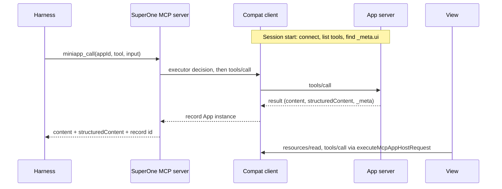

# MCP Apps compatibility layer through mini-apps

Status: draft · Updated: 2026-10-01

Part of [mini-apps-and-mcp-apps.md](mini-apps-and-mcp-apps.md).

Scope: give every harness the full capabilities of MCP Apps servers, including
those built with OpenAI's MCP extensions, by serving a server through the
mini-app path whenever the harness cannot carry what that server uses. That is
every App server on harnesses with no MCP Apps support (OpenCode, Cursor, dsh,
Grok), and servers using extensions a native harness does not pass through
(today Claude). The host, View, executor
and shared contract are described in
[features/mcp-apps.md](../features/mcp-apps.md); OpenAI extensions in
[mcp-apps-openai-extensions.md](mcp-apps-openai-extensions.md). Supersedes the
gateway proposal, which exposed SuperOne as a proxy under the original server
name.

## 1. Decisions

- **Native when it covers the server.** Per server and harness: if the
  harness carries every extension the server uses, the server stays native.
  Otherwise the session reroutes it through the layer. The coverage per
  harness is the table in
  [mcp-apps-openai-extensions.md](mcp-apps-openai-extensions.md) §3. Cosmetic
  gaps (a tool title or icon) fall back and never reroute; functional gaps do:
  any App use on a harness without MCP Apps, and on Claude `openai/settings`
  and file entrypoints. A rerouted server also gets OpenAI forms, since
  SuperOne advertises them.
- **The harness keeps its config.** Servers are configured where that harness
  reads them: Claude's own config files, the shared config SuperOne hands to
  ACP, Cursor and OpenCode, and dsh's own `cordis.patch.yml`. The layer reads the same source and never
  writes it, and it adds no separate place to install servers.
- **Session-level rerouting.** In a SuperOne session, a server the harness does
  not cover is left out of the list handed to the harness and served through
  the mini-app path instead. There is one connection and one tool
  surface. Outside SuperOne, the harness behaves as configured.
- **Mini-app path.** App tools are reached with the existing `miniapp_list` /
  `miniapp_call`, which every harness already has through the SuperOne MCP
  server. Entrypoints and settings use the mini-app shell. The View stays in
  the MCP App sandbox and never gets the mini-app preload.
- **SuperOne is the MCP client.** It advertises the UI extension and the
  OpenAI extensions it implements, reads titles, icons and capabilities, and
  injects request `_meta`, so these harnesses get the full extension set.

## 2. Flow

- **Discovery.** At session start the layer connects to each server in the
  harness's list (reusing the client code of `mcp-probe-service.ts`) and
  records the extensions it uses: tools with `_meta.ui`, tool
  `_meta["openai/*"]` (entrypoints, `mentions/search`) and
  `capabilities.extensions["openai/*"]`. Servers the harness covers are handed
  to it unchanged.
- **Undetectable extensions.** `openai/elicitation` forms are sent at run time
  and cannot be seen in advance. A server that uses only them is not
  rerouted; on a harness without the extension it degrades to that harness's
  standard elicitation, as the server's own fallback.
- **Visibility.** `miniapp_list` shows only tools whose visibility includes
  `"model"`; `miniapp_call` rejects the rest. App-only tools are reachable only
  from the View, through the existing provider dispatch gate.
- **Results.** The harness receives `content` and `structuredContent` (required
  when the tool declares `outputSchema`). The full result, including private
  `_meta`, stays in the host record for the View.
- **Correlation.** SuperOne produces the `miniapp_call` result, so it embeds the
  App record id there. The row finds its record by that id, never by tool name
  or arguments. Each SuperOne MCP endpoint is already per session.
- **Provider.** The layer is one more `McpAppsProvider`; activation, history
  restore, the phone projection and the executor work unchanged.

## 3. Harness routing

| Harness | Where its servers come from | Rerouting point | Status |
|---|---|---|---|
| Codex | Codex config | Not needed today: Codex carries the whole set | — |
| Claude | Claude config files, read by the CLI | A per-session exclusion (`strictMcpConfig` with an explicit list, or disabled-server settings) | To verify |
| ACP (Grok) | Shared config, pushed in `session/new` (`acp-mcp.ts`) | Omit from the pushed list | Feasible |
| Cursor SDK | Shared config, built per session (`cursor-mcp.ts`) | Omit from `mcpServers` | Feasible |
| OpenCode | Shared config, added with `mcp.add`; OpenCode also loads its own `opencode.json` | Omit from `mcp.add`; servers from `opencode.json` need a per-session disconnect | To verify |
| dsh | `~/.dsh/profiles/<profile>/cordis.patch.yml` | A per-session override of the Cordis entry | To verify |
| Remote node | `mcp-merge.ts` | Same omission on the node | To verify |

## 4. Permissions and OAuth

- Agent calls go through the `miniapp_call` executor decision, not the
  harness's per-server rules. App servers get their own approval entry,
  defaulting to ask, with per-tool allow.
- View calls follow the existing policy: no host approval for the person
  operating the View, `ui/message` confirmed.
- SuperOne owns auth for the servers it connects: PKCE, protected-resource and
  authorization-server discovery, dynamic client registration or a
  pre-registered client, tokens encrypted at rest (Electron `safeStorage` on
  desktop, a CLI store on nodes), single-flight refresh. Tokens the harness
  stored for itself are not reused, so a server may need one sign-in in
  SuperOne. Retry only after an auth rejection known not to have executed.

## 5. Phases

1. Rerouting and discovery on Cursor or ACP with the fixture server: model
   calls through `miniapp_call`, View on the row, View tool calls.
2. OAuth, then OpenCode, dsh and Claude rerouting.
3. Entrypoints and settings on the mini-app shell, shared with
   [mcp-apps-openai-extensions.md](mcp-apps-openai-extensions.md).
4. Remote nodes and the phone.

## 6. Open questions

- How well models use App tools through `miniapp_list` / `miniapp_call`
  compared with native tool names, and whether the layer should hand the
  model a short usage note per server.
- Whether the first turn waits for discovery, or a server is rerouted only
  from the next session start once discovery has seen it (cached per config
  fingerprint).
- Where the compat client runs: in main, or in a MiniApp Host process per
  server for crash isolation of stdio children.
- Where the record id lives in the result when a harness keeps only text
  content.
