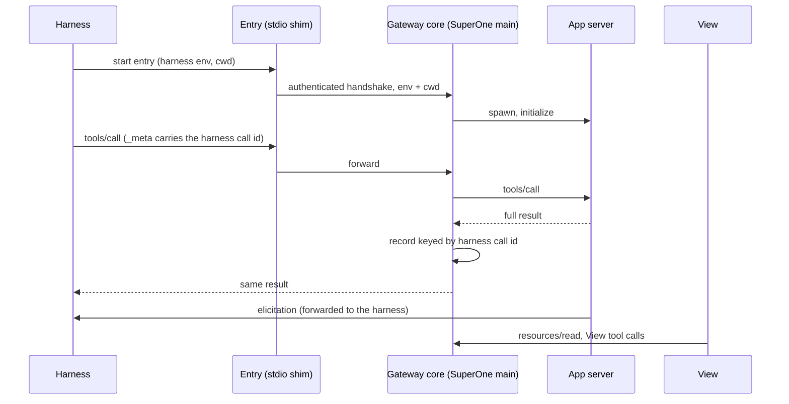

# MCP Apps gateway

Status: parked · Updated: 2026-10-03

Parked by product priority: SuperOne mini-apps, which run on every harness, are
the primary App surface, and MCP Apps stay on each harness's native support.
The design and spike results below are kept for when native gaps (Codex's
1 MiB client truncation, Claude without OpenAI extensions, harnesses without
MCP Apps) justify the cost. Reopening starts with HTTP routing (§5), the
largest gap left in phase 1's scope.

Part of [mini-apps-and-mcp-apps.md](mini-apps-and-mcp-apps.md). Would replace
the rerouting through `miniapp_call` in
[mcp-apps-compat-layer.md](mcp-apps-compat-layer.md) on every harness that
identifies its calls (§4). The host, View, executor and shared contract are in
[features/mcp-apps.md](../features/mcp-apps.md).

## 1. Goal

Separate the two things an MCP App needs:

- **The model calls tools natively.** Tool names, schemas, per-tool permission
  rules, tool search and Codex code mode stay those of the harness.
- **SuperOne hosts the View.** It sees the full tool result and talks to the
  server with every extension it implements, whatever the harness supports.

Today these are bound together. Native hosting depends on what each harness
passes through: Codex sends clients a truncated preview of results over 1 MiB
(the model path is not affected by that cap), Claude advertises no OpenAI
forms, other harnesses support no MCP Apps. The compatibility layer fixes
hosting but replaces native tools with `miniapp_call`.

The Codex truncation alone has a smaller fix upstream (§7). The gateway is
justified by the other two gaps and by converging on one hosting path, and is
introduced per harness only where it reaches parity.

## 2. Design

A **gateway core** in SuperOne main owns one upstream connection per session
and App server. Each harness reaches it through an entry under the server's
**original name**, so the model's tools do not change.

### Core

- **Lifecycle.** The core spawns the upstream only after an entry the harness
  admitted has completed its authenticated handshake, and the entry reports
  ready only once the upstream has initialized, so the harness's startup
  timeout still covers the server. The upstream outlives turns while a View
  references it. A turn stop cancels the model's call; a session or config
  generation teardown closes all requests and the owned process group.
- **Process.** Started with the entry's environment and cwd only (environment
  cleared first, program resolved by the original PATH/cwd rules), clean file
  descriptors and its own process group. The MCP SDK's default environment
  merge is not used.
- **Scope.** Roots, identity, server state and cancellation never leak across
  sessions, as with today's compatibility clients.

### Harness entries

- **Codex: a thin same-name stdio shim.** The thread config overlays only
  `command` (the shim) and `args` on the server's entry, adding a session token
  to `env`. Codex merges config tables recursively and replaces other values,
  so the original `env`, `env_vars`, `cwd`, per-tool approvals and enabled or
  disabled tools stay in force under the same name. The shim pipes stdio to the
  core's socket. The original command and args are read from Codex's effective
  config before the overlay. Replacing a stdio entry with a `url` entry is not
  possible: the merged entry keeps `command` and fails validation.
- **Claude: the same stdio shim**, registered through the SDK `mcpServers`
  option under the original name, with the original entry's env, cwd, timeout
  and `alwaysLoad`. The SDK entry (scope `dynamic`) replaces a same-name project
  server: the CLI never spawns the original, other servers are untouched, and
  status reports the shim. The original entry is resolved the way the CLI
  resolves scopes before the session starts. An in-process SDK server
  (`type: 'sdk'`) does not work: the CLI declares no client capabilities to it,
  so it cannot elicit, and it still spawns the same-name server from disk.

### Owner gate

Each session × server has one owner, fixed when the harness runtime is built:
native, gateway or compatibility. A change takes effect only at a runtime
rebuild; a resume of a loaded thread can ignore config overrides. Phase 1 makes
a server eligible only when all hold:

- a local stdio entry in the local environment, explicitly opted in;
- not Codex's hosted `codex_apps`, a plugin or another hosted server;
- the harness admits the original entry, and replacing it does not bypass
  managed policy. Codex 0.159's `configRequirements/read` does not expose MCP
  requirements, so an empty answer proves nothing; when admission cannot be
  shown, the server stays native.

Servers not on the gateway keep today's native or compatibility path.

### Tool surface

The core filters `tools/list` toward the harness by visibility, using the full
upstream metadata, then removes every key that would start native App handling
(Codex reads `ui.resourceUri`, `ui/resourceUri` and `openai/outputTemplate`).
Names, schemas, descriptions, titles and annotations are unchanged. Harness
calls to tools hidden from the model are rejected. The catalog is ready before
the harness captures its first step; `list_changed` behaves as it does natively.

### Results

- The harness receives the upstream result unchanged.
- The record is keyed by runtime generation, server and harness call id; the
  session is bound by the entry's token, never by `_meta`. Model calls and View
  calls use separate keys.
- Either arrival order (record or harness row first) joins; records expire by
  TTL and a byte budget. A record from an old generation never fills a new row.
- The record takes precedence over the harness's own item. Without an id, or
  over the result cap, the View is not mounted; a truncated preview is never
  mounted and a call is never re-run (also after an interrupt with an unknown
  outcome).
- The record uses the host's one initial-result cap, the same for the live
  View, phone and history
  ([Initial result size](../features/mcp-apps.md#initial-result-size)).
  Execution outcome and harness row status are stored separately.

### Server requests

- **Codex.** Every server-to-client request during a model call, including
  `openai/elicitation/create`, goes to Codex, which keeps its policy, Guardian
  review and the timeout pause while a form waits. SuperOne renders it through
  Codex's existing request.
- **Claude.** Claude declares form and URL elicitation to the shim, so
  standard elicitations go to Claude: SDK and settings `Elicitation` hooks,
  SuperOne's `onElicitation`, then `ElicitationResult` hooks.
  `openai/elicitation/create`, which Claude does not support, is answered by
  SuperOne's form UI. That path cannot run Claude's hooks, so the core
  advertises OpenAI forms to a server only when no `Elicitation` or
  `ElicitationResult` hook could match it. The check reads the session's hook
  listing from the running query (the CLI's own `/hooks` view, which lists the
  settings-file and plugin hooks that run, with matchers; SuperOne's own SDK
  callback hooks are not listed) before the upstream initializes, and holds
  for that connection; a hook change applies at the next runtime rebuild. Such a
  server falls back to standard elicitation or fails. Claude's MCP tool timeout
  is wall-clock and is not paused by a waiting form.
- The core sets no timeout of its own that could fire while a form waits.
  Cancellation, teardown and concurrent forms follow the existing pending
  request maps.

### View calls

- **Codex.** View calls keep the current `mcpServer/tool/call` path, which
  applies the tool filter and timeout but not the model's per-tool approval.
  Codex can route elicitations outside a turn, but SuperOne handles server
  requests only inside a turn stream (and declines them during prewarm);
  between turns they queue in the inbox and can hang or reach the next turn.
  Phase 1 adds a standing handler that declines server requests between turns;
  an interactive idle dispatcher is separate work. Guardian review is
  unavailable outside a turn, so such requests are never downgraded to a plain
  form.
- **Claude.** View calls go from the executor to the core. Their elicitations
  use SuperOne's form UI, a new host path: today's compatibility client
  declares no elicitation capability.

### Protocol

Toward the upstream, the core advertises what the harness declares and the core
can route completely, plus the extensions SuperOne implements (UI; for Claude
also OpenAI forms). Reverse requests, cancellation, roots or sampling it cannot
route are not declared. Upstream identity and protocol `_meta` are the
core's own. Phase 1 negotiates the legacy protocol only; servers that require
MCP 2026-07-28 stay native.

## 3. Correlation

A call record attaches to the harness's own tool row only through an id the
harness sends; rows are never matched by tool name or arguments. Verified
2026-10-03 with a logging stdio server through SuperOne's integration paths:

| Harness | Request `_meta` key | Equals | Verified with |
|---|---|---|---|
| Codex | `callId` | `mcpToolCall` item id (code mode included) | app-server 0.159.0 via `runCodexAppServerTurn` |
| Claude | `claudecode/toolUseId` | `tool_use` id | Agent SDK 0.3.287 `query()` + stdio `mcpServers`, including a same-name entry replacing a project server |
| Cursor | none: SDK 1.0.30 sends only `{name, arguments}` | — | compatibility pilot |
| ACP (Grok), OpenCode, dsh | to verify | | |

Codex also sends `threadId`, `sessionId`, `itemId` and `x-codex-turn-metadata`
(turn id, model, sandbox mode). Neither key is an MCP standard field. A
contract test re-checks both through the actual entry on every harness upgrade.

## 4. Harness coverage

| Harness | Correlation | Gateway use |
|---|---|---|
| Codex | `callId` | Full results for the View; native policy and forms unchanged |
| Claude | `claudecode/toolUseId` | Adds OpenAI forms, settings, file entrypoints; full results |
| ACP, OpenCode, dsh | to verify | Gateway if verified; otherwise the decision below |
| Cursor | none | Open: keep `miniapp_call` rerouting, or gateway with the View as its own block next to the tool row |

Harnesses are enabled independently. A harness's native App attach path and its
`miniapp_call` rerouting are removed only after the gateway reaches parity on
it.

## 5. Auth and policy

- **Sandbox.** Codex starts local stdio MCP servers outside its tool sandbox,
  as plain processes with a cleared environment plus its MCP allowlist. The
  gateway matches this by starting the upstream with the shim's environment.
  Other harnesses need the same verdict before their servers are routed.
- **Managed policy.** Codex requirements match servers by name and command,
  args or URL, and Claude's `allowedMcpServers` / `deniedMcpServers` by name,
  command array or URL; a shim's command can fail an allowlist the original
  passed. The owner gate (§2) keeps such servers native. Claude permission
  rules match tool names, so they still apply to the shim's tools.
- **HTTP servers (phase 2).** Codex cannot swap an entry's transport by
  override, and a `url` overlay keeps the original auth fields. Needs its own
  routing design before HTTP servers move.
- **OAuth.** The gateway owns auth for HTTP App servers: PKCE, protected-
  resource and authorization-server discovery, dynamic or pre-registered
  clients, tokens encrypted at rest (Electron `safeStorage`, a CLI store on
  nodes), single-flight refresh with one owner per rotating refresh token,
  retry only after a rejection known not to have executed. Reading a harness's
  stored token where that is allowed (Claude's MCP OAuth token is read-only
  reusable) avoids a second sign-in.
- **Tokens.** The entry token is bound to session, server and runtime
  generation, loopback only, revoked at teardown, and never logged, persisted
  or sent to a View.

## 6. Phases

1. **Codex and Claude, local stdio**, with the Bits & Bolts fixture. The
   Claude spike (2026-10-03, Agent SDK 0.3.287) verified the shim entry
   replacing a same-name project server, `claudecode/toolUseId`, untouched
   other servers, a tool-name deny rule, elicitation through SDK and settings
   hooks and `onElicitation`, and a hook listing with settings and plugin hooks.
   Still open before Claude is enabled:
   - same-name replacement of user- and local-scope servers;
   - whether hooks from `managed-settings.json` appear in the listing (hooks
     passed through the SDK's `managedSettings` option neither appear nor run);
   - `Query.getHooksListing()` exists at runtime but is missing from the public
     typings; OpenAI forms stay off for Claude until it, or a supported
     equivalent, is confirmed.

   Acceptance on both:
   - routing and admission, including a disabled or policy-blocked server
     staying off and the runtime rebuild path;
   - direct and code-mode calls, concurrent and subagent calls, both arrival
     orders;
   - a Codex result over its 1 MiB client cap opening in the View on desktop,
     phone and history;
   - forms: Codex policy and timeout pause, Claude OpenAI forms, cancel,
     teardown, timeout;
   - View calls and app-only tools, and a server request between turns
     declined rather than queued;
   - session restart, config change, disconnect after execution;
   - p50/p95 for cold start, `tools/list`, call, result capture and HTML load,
     and bytes on the wire.
2. **HTTP servers and OAuth.**
3. **ACP, OpenCode and dsh**: correlation spikes, routing points, policy
   verdicts. The Cursor decision.
4. **Remote nodes**: the core runs where the harness runs, Node-only, with
   forms projected over the existing environment RPC.
5. **Retire** native App attach paths and `miniapp_call` rerouting per harness.

## 7. Upstream track

Ask Codex to keep the full result in the live `mcpToolCall` completion and
bound only the rollout and history copy, or to expose the full result by call
id for a limited time. Either fixes results over 1 MiB in Codex sessions without
the gateway; neither adds OpenAI forms to Claude.

## 8. Open questions

- Is an interactive idle request dispatcher for Codex worth building, so
  View-initiated forms work between turns?
- Does Cursor justify keeping the `miniapp_call` path, or is an adjacent View
  block enough?
- How does an App server that a user also runs outside SuperOne behave when
  both connect (two stdio instances, shared state on disk)?
