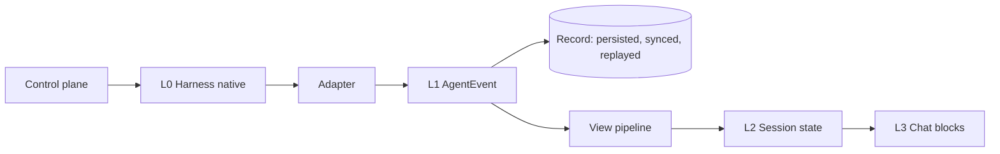

# Mini-app Event API

Status: draft · Updated: 2026-10-01

Scope: let a mini-app take part in the conversation pipeline itself — observe,
intercept or rewrite agent events at a layer the developer chooses, and gate
the agent on the input side. This is how an app changes what the chat looks
like and how the agent behaves, instead of living only in a side panel.
Related: [miniapp-agent-api.md](miniapp-agent-api.md),
[ai-gateway.md](ai-gateway.md).

## 1. Decisions

| Question | Decision |
|---|---|
| Who picks the layer | The developer. SuperOne fixes the layer standard; apps choose layer and operation. |
| Operations | `observe` (fork), `intercept`, `rewrite`, on every layer where they are meaningful (§3). |
| Integrity model | Proposed: **the record is immutable; views are programmable.** Intercept and rewrite shape views, never the persisted record (§4.1, open question 1). |
| Events that need an answer | May be intercepted; the interceptor then owns the answer, with a host timeout falling back to the default UI. |
| Rewrite limits | Field-level. Facts a user relies on for a safety decision are read-only. |
| Matching | Declarative in the manifest; only matched events reach the app. |
| Scope | Sessions the app is attached to or anchored on (same rule as the Agent API). |
| Public contract | L2 semantic slots are the stable surface; lower layers carry weaker guarantees (§7). |

## 2. Current state

| Piece | Where | Relation to this API |
|---|---|---|
| Event pipeline | harness adapters → `AgentEvent` → `applyEventToSession` in `packages/chat-core` → presenters in `packages/chat-view` | The layers below name points on this path |
| Tool renderers | `manifest.tools[].renderer.intercept / result / standalone` (`apps/desktop/src/main/mcp/guides/tools.md`) | A special case of an L2/L3 claim on the app's own `tool:<name>` slot |
| Context card, prefill | `context.agent.setContext`, `sendPrompt` | A special case of control-plane prompt augmentation |
| Agent API events | `onGraphChange` / event reads in [miniapp-agent-api.md](miniapp-agent-api.md) | A special case of L1/L2 observe; one channel serves both |

The Event API generalizes these three mechanisms into one model instead of
adding a fourth.

## 3. Layers

| Layer | Content | observe | intercept | rewrite |
|---|---|---|---|---|
| L0 Harness native | Raw SDK messages, Codex RPC, ACP, including fields not mapped into `AgentEvent` | yes | no — precedes the record | no — precedes the record |
| L1 AgentEvent | Normalized event stream | yes | yes — the event skips this view's reducer | yes, field-level |
| L2 Session state | Semantic slots: `todos`, `plan`, `tool:<name>`, `file_change`, `usage`, `subagent`, messages | yes | yes — the app claims the slot | yes, field-level |
| L3 Chat blocks | One rendered block | — | yes — replace or hide the block | yes — styling, added content |
| Control plane | User message submit, tool call, permission answer, stop | yes | yes — block a tool call or submit | yes — tool args, prompt augmentation |

Effects differ by layer, and the developer chooses knowingly: intercepting
`todos` at L1 also empties every view derived from it (for example a todo
count); intercepting at L3 only removes the chat block.

Control-plane support differs per harness (Claude hooks are complete; Codex
elicitation carries no tool args; OpenCode has static rules only). Each
control point is reported through capability data with explicit unsupported
states.

## 4. Invariants

### 4.1 The record is immutable

Transcripts, phone sync, replay and other apps always receive original events.
Intercepting means "this view does not handle it the default way", not
deletion. Consequences:

- When the app is missing — uninstalled, host crashed, or on the phone — the
  view falls back to default rendering.
- Several apps see the same facts.
- Aggressive L1/L2 interception cannot corrupt data.

L0 sits before the record, so it is observe-only. Rewriting L0 amounts to a
custom adapter and would be a separate, higher-privilege extension.

### 4.2 Intercepting an answerable event takes on the answer

`permission_request`, `ask_user_question` and `plan_approval` may be
intercepted. The app must answer through `respond`; after a host timeout the
default UI takes over, so a session never hangs on an app.

### 4.3 Rewrite is field-level

| Field class | Examples | Rewritable |
|---|---|---|
| Facts behind a safety decision | Tool name and args in a permission request, a command to run, changed file paths | No |
| Display fields | Titles, text formatting, collapsed state | Yes |
| Additions | Badges, links, notes, extra data | Yes, additive only |

A control-plane rewrite (changing tool args) is different: it changes what the
agent actually does, and the rewritten args enter the record, so the user sees
what really ran. It needs its own grant.

## 5. Permissions

- `observe` is low risk semantically but reads conversation content — code,
  secrets, personal data — in an app that has network access. The manifest
  declares observed layers and slots; install consent shows them. Full text
  (`text`, `content_delta`) is presented as more sensitive than a slot like
  `todos`.
- `intercept` and view `rewrite` are granted with the layer/slot declaration.
- Control-plane `intercept` / `rewrite` are a separate grant.

## 6. Matching and performance

L1/L2 sit on the streaming hot path.

- **Declarative match**: manifest rules such as
  `{ layer: 'L2', slot: 'todos', op: 'intercept' }`. The renderer decides
  synchronously; no round-trip to the MiniApp Host.
- **Async handling**: only matched events are delivered. High-frequency deltas
  are batched by default; per-event delivery is an explicit opt-in.
- **Conflicts**: one intercepting app per slot per session; the user picks on
  conflict. Observers are unlimited; rewriters apply in a declared order.

## 7. Stability

Opening a layer to third parties freezes its shape. Tiers:

| Layer | Guarantee |
|---|---|
| L2 semantic slots | Stable, versioned public contract; most apps should live here |
| L1 AgentEvent | Advanced, versioned; breaking changes only on major versions |
| L0 Harness native | Experimental; follows harness upgrades without guarantees |
| L3 chat blocks | Block-level claim and augmentation only; DOM structure is not API |
| Control plane | Stable per control point, gated by capability data |

## 8. Coverage

Estimated, not measured.

| Category | Examples | Role of the Event API |
|---|---|---|
| Custom visualization | Todo board, plan timeline, diff viewer, test dashboard, cost meter | Core |
| Monitoring | Usage, audit log, activity feed, push to Slack or phone | Core |
| Governance | Command deny-lists, secret scanning in tool args, directory policy, team approval | Core, harness-limited |
| Custom interaction | Own UI for approvals, questions, plan review | Core |
| Workflow automation | Lint after edits, continue until tests pass, RAG context | Major, with the Agent API |
| Display rewrite | Live translation, masking sensitive text | Major |
| Orchestration | Project manager, review pipeline | Supporting, with the Agent API |
| Agent-backed domain apps | Spreadsheet or design tool calling an agent | Supporting |
| LLM as a function | Classify, extract, generate images | None; see the AI API |

Alone the Event API covers roughly 60–70% of apps that interact with a
conversation. With tools, the Agent API and the AI API, roughly 85–90%. Most of
the remainder needs input-side **contribution points** (composer buttons,
slash commands, mention sources, message context menu items, sidebar entries),
which are declared UI slots rather than events.

## 9. Phases

Define the whole layer standard up front; open cells by demand. The first four
cells carry most of the value:

1. L2 observe.
2. L2/L3 intercept (slot claim), absorbing tool renderers.
3. Control-plane tool gating.
4. Control-plane prompt augmentation, absorbing `setContext`.

Then L1 observe/rewrite, L0 observe, and answer ownership for interactive
events.

## 10. Open questions

1. Record integrity: views only (proposed), app-chosen write-back to the
   record, or write-back as a later high-privilege capability.
2. Contribution points are covered by
   [input-surfaces.md](input-surfaces.md), the fifth pillar next to tools, the
   Agent API, the AI API and the Event API.
3. Phone rendering of claimed slots: default fallback only, or a mobile
   rendering path for app views.
4. The per-harness capability matrix for each control point.
5. Timeout length and fallback UX when an app owns an answer and does not
   respond.
