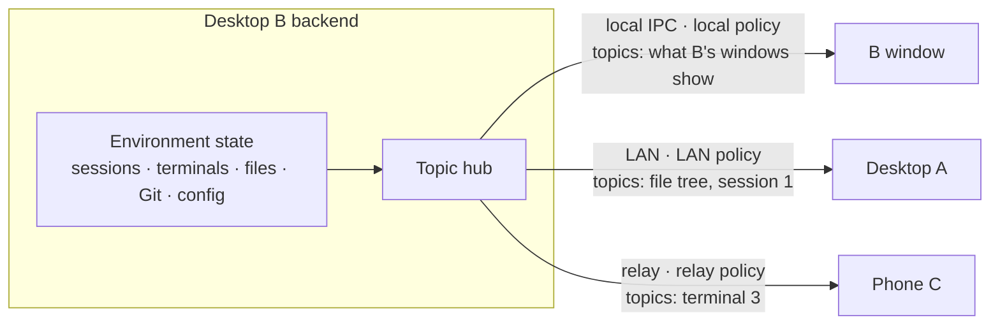

# Unified remote protocol

Status: draft · Updated: 2026-10-10

Scope: one backend serves many frontends. An environment's backend (a desktop's
main process, a CLI node) serves its own window, controller desktops and
phones through one subscription model and one protocol. Each frontend
subscribes to what it is looking at, and each connection gets a delivery policy
that fits its link. The optimizations built for the phone become shared
policy, not phone-only code.

Related: [mobile-remote-control.md](../architecture/mobile-remote-control.md),
[remote-node-service.md](../architecture/remote-node-service.md),
[desktop-node-orchestration.md](../plans/desktop-node-orchestration.md),
[remote-node.md](../plans/remote-node.md),
[mobile-desktop-compatibility.md](../plans/mobile-desktop-compatibility.md).

## 1. Model

Desktop B is controlled by desktop A on the same Wi-Fi and by phone C over
the relay. B's own window is open too.

- **Topics.** The backend publishes by topic: a session, a session list, a
  terminal, a watched directory, a project's Git state, a configuration family.
  A connection receives only the topics its frontend subscribed to. C watching
  a terminal does not pay for A's file tree.
- **Delivery policy per connection.** The same published event is delivered
  differently per connection, chosen by link tier and adapted by client
  surface ([§4](#4-delivery-policy)). When A leaves B's Wi-Fi and fails over to
  the relay, A's connection switches to the relay policy without reopening
  anything.
- **One protocol.** A, C and any future frontend speak the same protocol to
  any backend. The protocol is the layer above the secure channel: the phone
  keeps its pairing and channel, the node keeps its own; only what travels
  inside changes. B's own window uses local IPC as transport but the same hub,
  topics and policy pipeline.
- **Routing.** A phone connects only to its paired desktop. When C opens an
  environment A controls, A subscribes on that node to the union of topics its
  own window and relayed phones need, and re-serves them per connection. A
  direct phone-to-node link later is a new endpoint, not a new protocol.

## 2. Today (verified 2026-10-10)

| Piece | State |
|---|---|
| Event hub | `SessionEventHub` publishes every desktop event tagged by source; consumers filter by source, not by topic interest. |
| B serving A and C | Two pipelines: node-protocol subscription for controllers, `MobileBroadcaster` with the `mobile` profile for phones. |
| Projection | Filtering, heavy-payload summaries and progressive loading (`progressive-session.ts`, `progressive-tools.ts`) apply to phones only. |
| On-demand detail | `subscribe_detail` / `remote_detail` and the client cache (`use-deferred-text.ts`, `detail-cache.ts`) exist only in chat-view. The desktop renderer does not understand `remoteDetail` references. |
| Framing | DEFLATE and response chunking on the phone link only; the node protocol has neither. Batching is shared (`createEventBatcher`). |
| Policy selection | By client kind (phone vs desktop), not by link. |
| Topics beyond sessions | Remote terminals are read every 50 ms (`remote-terminal-controller.ts`); workspace watch polls every 100 ms (`remote-environment-gateway.ts`). |
| Phone wire | About 80 `RemoteCommand` types keyed by `projectPath`; remote environments only through session links (`environment-commands.ts`). |
| Desktop as node | Git serves `fetch` and `worktreeActivate` only; no terminal or workspace port (`node-host-server.ts`, `desktop-worktree-port.ts`). |

## 3. Goals

- One backend serves any number of frontends at once, each seeing only its
  subscribed topics.
- One delivery pipeline whose policy is chosen per connection by link and
  surface; phone and desktop share every optimization.
- One protocol for desktop → node, desktop → desktop and phone → desktop.
- Consistent experience: a session collapsed on a relayed desktop looks and
  expands like on a phone.
- A base that new features and new frontends extend by adding topics and
  methods, not pipelines.

Long-term, beyond this branch: every desktop feature is available on the phone
and on every remote environment, added topic by topic.

## 4. Delivery policy

A policy is a parameter set, not a code path. Link tier decides cost controls;
client surface decides presentation adapters.

| Link tier | Cost that matters | Policy |
|---|---|---|
| Local IPC | Renderer CPU, re-renders, memory | Batching. On-demand detail only if measured to help. |
| LAN / Tailscale | Serialization, encryption | Batching, on-demand detail for bulky content; compression optional. |
| Relay | Bytes, latency, relay load | Filtering, summaries, on-demand detail, batching, compression, progress throttling. |

| Surface | Adapter |
|---|---|
| Desktop | Full UI; no presentation trimming. |
| Phone | Thumbnails, mobile-specific omissions, narrower history pages. |

Rules:

- The tier comes only from the route the connection actually uses (loopback,
  LAN, Tailscale, relay) and is re-evaluated on failover. A switch mid-session
  aligns the client with catch-up events or `resnapshot`, never a reload.
- Projection state is per connection, so one event can be full for A and
  summarized for C.
- Summarized content is always reachable: every frontend's client code
  understands `remoteDetail` references and detail subscriptions. That client
  logic moves from chat-view into chat-core so the desktop renderer and the
  phone share it.
- Local IPC keeps its broadcast to every window (session windows follow side
  chats and draft-to-session id changes); topics there are the union of what
  the windows show.

## 5. Protocol

The node protocol is the base: encrypted channel, auth, RPC envelope with
`environmentId`, protocol negotiation, idempotency keys, fenced leases,
per-environment cursors and `resnapshot`
([remote-node-service.md §9](../architecture/remote-node-service.md#9-commands-events-and-reconnect)).
Added to it:

- **Topic subscriptions**: subscribe and unsubscribe by scoped reference
  (`SessionRef`, `TerminalRef`, `ProjectRef` + scope); the session stream
  becomes one topic kind.
- **From the phone link**: DEFLATE inside the ciphertext above a size
  threshold, chunked large responses, request coalescing, responses bound to
  the asking connection, progressive session loading, detail subscriptions.
- **Backpressure**: a per-connection byte budget; control events first; over
  budget, a topic degrades to `resnapshot` instead of buffering without bound.
- **Capabilities** per RPC method in the descriptor; a routing desktop
  advertises each target's methods as the target reports them. The UI gates
  each entry point on the methods it calls.
- **Actors**: client session plus `delegate` for each device a desktop relays.
  Exclusive resources (session, terminal) use fenced leases; files and
  configuration writes carry a version or hash.

## 6. Sync per topic kind

| Topic | Model | Recovery |
|---|---|---|
| Session | Existing pushed session stream | Existing cursor and `resnapshot` |
| Session list, projects, drafts | Snapshot + version + change events | From version; snapshot when gone |
| Configuration, MCP, providers, automations | Snapshot + version + change events | Same |
| Watched directory, Git state | Change notification; client re-queries the scope; covers outside programs | Re-query open scopes |
| Terminal | Ordered output with sequence, bounded buffer, snapshot on attach | Attach from sequence; snapshot when evicted |
| File contents, attachments | Request/response with caps; transfer channel for large payloads | Idempotent reads |
| Browser, device, screen (later) | State events plus a media channel | Out of scope |

## 7. Decisions

| Question | Decision |
|---|---|
| Frontends per backend | Many, concurrently, each with its own topics and policy. |
| Policy selection | By link tier, re-evaluated on failover, adapted by client surface. |
| Phone reach | Phone connects only to its paired desktop; the desktop routes. |
| Addressing | Scoped references on the wire; no `projectPath` addressing. |
| Pairing | Unchanged. Existing phone pairings and channels keep working; the cut-over replaces the application protocol inside the channel, so no phone pairs again. |
| Client-scoped state | Push notification tokens, seen state, presence and mobile logs describe a frontend, not an environment. They are methods and topics of the desktop endpoint the phone pairs with, not of every environment. |
| Phone cut-over | All existing phone features move to the protocol in one cut-over, released with the minimum desktop version; the old phone commands and `environment_command` are removed, no translation layer. |
| Full feature parity | Every desktop feature on the phone and on remote environments is the long-term goal, added topic by topic after the cut-over. |
| Capabilities | Per RPC method; no per-family versions. |
| Ownership | The backend owns its data; frontends own presentation only. |
| Control | Every controllable resource uses fenced leases, local sessions included; the `Session` owner model is retired. Takeover keeps today's node rules ([remote-node-service.md §9.4](../architecture/remote-node-service.md#94-fenced-control-leases)): a phone takes over the desktop window, a second phone is refused while one holds the resource, and the window reclaims explicitly. The controlled side revokes or suspends a controller to stop it. |
| Host parity | Local desktop, desktop node and CLI node implement the same domain ports from `@superone/runtime`. |

## 8. Phases

1. **Topic hub and per-connection policy.** Generalize `SessionEventHub` to
   topic subscriptions; one delivery pipeline with policy per connection.
   Local IPC, controller connections and phone connections all go through it.
   The `mobile` profile splits into the relay tier and the phone surface.
2. **Shared on-demand detail.** Move detail subscription and caching into
   chat-core; the desktop renderer handles `remoteDetail`. A relayed desktop
   gets the relay policy.
3. **Protocol additions.** Topic subscriptions, compression, chunking,
   coalescing, backpressure on the node protocol, measured on desktop → desktop
   over relay against the phone link's numbers.
4. **Phone cut-over.** Every existing phone feature served through the
   protocol by the desktop for its own and routed environments; phone link
   commands removed; pairing unchanged. Local sessions move from the owner
   model to leases in the same step, since phones take them over through the
   protocol.
5. **Feature parity, topic by topic.** Terminals and watched directories
   pushed instead of polled; workspace and Git on the desktop node; then the
   remaining desktop features on the phone.

Phases 1–4 are this branch's target: the architecture every later feature
extends.

## 9. Open questions

- None at present.

## 10. Acceptance

- B serves its window, A and C at once; each receives only its subscribed
  topics (measured per connection).
- The same turn reaches A full over LAN and C summarized over relay; expanding
  a row on C fetches its detail.
- A fails over from LAN to relay mid-turn; its policy switches without reload
  and its view stays consistent.
- On relay, a long streaming turn on desktop A costs no more than on the phone
  link today.
- After the cut-over, every existing phone feature works through the protocol,
  at no more bytes and frames per turn than the phone link's recorded-session
  golden runs.
