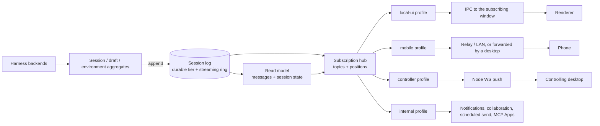

# Unified session stream

Status: accepted · Updated: 2026-10-10
Plan: [unified-session-stream.md](../plans/unified-session-stream.md)

Scope: one source of session data per node, and one subscription contract that
the local renderer, a controlling desktop, a desktop relaying a phone, and
in-process consumers all use. Each subscriber gets its own processing pipeline
over the same stream. This covers session events, session, project and draft
lists, snapshots, positions and control. Artifact files stay in
[session-sync-zone.md](../architecture/session-sync-zone.md).

Builds on: [remote-node-service.md](../architecture/remote-node-service.md) §5.2, §8, §9;
[desktop-node-orchestration.md](../plans/desktop-node-orchestration.md) steps 1–2;
[remote-node.md](../plans/remote-node.md) "Local runtime convergence".

## 1. Problem

Pub/sub already exists: `sessionManager.onAny` and several direct
`safeSend(EVENT)` calls publish to whoever listens. What is missing is a log.
Without a shared position, snapshot and resume contract, every consumer solved
ordering, deduplication and reconnect on its own.

Session data reaches its consumers through five pipelines:

| Consumer | Read path | Positions | Reconnect |
|---|---|---|---|
| Local renderer | `onAny` → `publishAgentEvent` → `renderer-agent-event-transport.ts` → IPC broadcast to every window | process `{epoch, seq}` (`session/event-seq.ts`) | `syncLiveSnapshots` + replay events |
| Phone | `MobileBroadcaster` (progressive projection) → `RemoteControlService.sendAgentEvent` → `RemoteEventBatcher` → sealed per channel | channel anti-replay seq; chat-core dedupes on event `seq/epoch` | `restoreSession`: snapshot + `EventBuffer` + connection epoch |
| Desktop → CLI node | `EnvironmentHost.runSessionEventDrain` polls `session.events` every 80 ms from a send until the turn settles | node rowid, written into `AgentEvent.seq` without an epoch | in-memory cursor dropped on disconnect; rehydrate via `remote-session-ops.ts` |
| Desktop as node | `DesktopSessionHost` writes its own `EventLog` of lossless `agent_event`, only for sessions a controller started | rowid | as above |
| Phone → desktop → node | `environment-commands.ts` polls through `RemoteEnvironmentGateway.subscribeEvents` (100 ms), reduces with chat-core in main, re-runs the progressive projection | mixed | its own |

Consequences:

- **Events created outside `Session`.** `AgentService` synthesizes events
  (`publishSyntheticEvent`, provider and directory changes) and most
  `interaction_resolved` events, then publishes them through
  `publishAgentEvent`. Listeners on `session.on` (the node-host event log among
  them) never see those. Which path emits a resolution depends on how it ended:

  | Resolution path | Emitted by |
  |---|---|
  | Human response over IPC or from a phone | `AgentService` synthesizes it, in addition to any backend emission |
  | Response through desktop-node RPC (`DesktopSessionHost`) | nobody: it calls `Session` directly and misses the `AgentService` synthesis |
  | Response through CLI-node RPC | `SessionRuntime` durable response events |
  | Cursor question/plan answer or cancellation | the Cursor backend (`cursor-interactions.ts`) |
  | ACP elicitation completion | the ACP backend's elicitation-complete path |
  | Codex MCP App elicitation abort | the Codex backend |

- **Publishes that bypass the convergence point.** Besides the renderer
  transport's own send, `index.ts` calls `safeSend(EVENT)` directly for
  presence, the remote-node sink and the settings fallback, skipping batching
  and notifications. Replay events (`getReplayEvents`) pass through `onAny` to
  every consumer.
- **Polling, and no live updates when idle.** Remote session reads are a
  per-turn 80 ms drain, a 100 ms poller per phone-relayed node session, and a
  2 s collaboration watcher per environment with remote children
  (`collaboration-remote-watch.ts`). `session.events` returns the whole
  environment's events and the client filters. An open remote session that is
  not running a turn receives nothing until it is rehydrated. The CLI writes
  one SQLite row per text delta.
- **`AgentEvent.seq` has two meanings.** Process counter on local paths, node
  rowid on remote paths. `mergeMessagesByMaxSeq` relies on the process epoch,
  which a node event does not have.
- **Duplicated logic.** Host-side reduction runs in main `Session.applyReducer`
  (per dialect), in the CLI message catalog, and in main again for the phone →
  node path. Two batchers, two progressive projections, three pending-interaction
  mappers, five snapshot APIs (`getLiveSnapshots`, `buildRemoteSessionSnapshot`,
  `buildProgressiveBootstrap`, `linkBootstrap`, node `session.get` +
  `messages.list`), three session-list signals (`SESSIONS_CHANGED`,
  `session_list_changed`, pull-only remote lists).
- **Two client stacks.** The renderer calls `isRemoteProjectKey` /
  `parseRemoteProjectKey` on 171 lines in 50 non-test files
  (`grep -rn "isRemoteProjectKey\|parseRemoteProjectKey" apps/desktop/src/renderer/src | grep -v '\.test\.'`),
  with separate hydrate and merge code. Local sessions use agent IPC;
  `LocalEnvironmentGateway.subscribeEvents` returns nothing.
- **Three session control models.** `Session` owner/subscribers (phones and
  node controllers), `ControlLeaseService` leases, and the phone → node
  device map in `environment-commands.ts`. Drafts have their own controller.
- **Two read models.** The node keeps a text-only `transcript_json` and rebuilds
  tool rows from its event log (`message-catalog.ts`); the desktop stores
  messages. This is why a remote fork loses tool rows
  ([remote-fork-history.md](../plans/remote-fork-history.md)).

The direction of the remote node (backend on the node, client on the desktop)
is sound. The problems come from running it half-migrated, as two parallel
stacks, instead of one stack with two transports.

## 2. Decisions

| Question | Decision |
|---|---|
| Model | Event log per node plus position-based subscriptions (event sourcing), not fire-and-forget pub/sub. |
| Source of truth | The node that runs the session. A desktop is a node plus a UI client. |
| Publish point | One: `SessionLog.append`. Every event, including synthesized ones and interaction resolutions, is created inside the owning aggregate and appended there. |
| Broker | None. In-process hub plus SQLite on every node. No NATS, Redis or cloud broker. |
| Transport | Carries frames only: Electron IPC, node WebSocket, relay and LAN. No semantic logic in a transport. |
| Per-subscriber processing | A profile composed from shared stages, bound to the subscription, run on the node that holds the read model. |
| Remote reads | Server push over the node WebSocket. Session read polling is removed. |
| Positions | One durable `sequence` per source environment (remote-node-service.md §18.9), plus a per-session `version` contiguous across both tiers within an `epoch` (§3.2). |
| Control | Interactive commands on existing sessions and terminals use fenced `ControlLease`s with one holder per downstream client. Drafts keep their own controller. |
| Phone ↔ CLI node | Through the desktop, which forwards frames the node's `mobile` profile produced. No direct phone-to-node link. |
| Phone wire format | Unchanged in every phase. A later format change goes through the authenticated compatibility handshake of [mobile-desktop-compatibility.md](../plans/mobile-desktop-compatibility.md). |
| Older CLI nodes | The release that adds `session.subscribe` raises the minimum protocol generation; the desktop offers the node upgrade through its existing flow. |
| Existing CLI delta rows | Kept. `environment_events` is append-only and has no retention; they stay until snapshot-backed retention exists. |

## 3. Architecture



### 3.1 Session log

- `append(aggregate, event)`. Aggregates are a session, a draft, or the
  environment (provider changes, project and session list mutations). It is the
  only way an event reaches a subscriber.
- Durability is decided by payload and phase, not by event type:

  | Durable (SQLite, when it happens) | Ephemeral (streaming ring) |
  |---|---|
  | user message; `content_delta` of `tool_use` (start) and `tool_result`; a tool's consolidated input once complete; `codex_item_delta` `started` and `completed`; message completion, interruption and error; interactions and their resolution; status, settings, lifecycle; list mutations | `content_delta` of text and thinking; `tool_input_delta`; `codex_item_delta` `updated`; `tool_progress` |

  Durable events commit as they happen, not at turn end: a turn can run for
  many minutes and hundreds of tool calls, and a crash must not lose the
  completed part.
- **Commit before publish.** A durable event, the read-model change it causes
  and its position commit in one SQLite transaction before any subscriber sees
  it. Today the desktop fans out first and persists later, and the CLI writes
  the session row and the event separately (remote-node-service.md §8); both
  change.
- **Message commit.** Completion writes the consolidated message row into the
  read model in the same transaction. `message_complete` today carries only
  metadata, so the commit is what lets a client that missed the deltas rebuild
  the text: a frame covering retired streaming versions carries that row.
- **Streaming ring.** Holds the ephemeral events of messages still streaming,
  per session, and drops them when the message commits. `codex_item_delta`
  `updated` keeps only the latest entry per item. The ring has a byte cap; a
  resume over an evicted range gets the message's current partial content from
  the read model, which keeps it in memory while the process lives.
- **Restart.** The ring and in-memory partial content are lost. The runtime
  marks running turns interrupted and clears interaction waiters (as
  `SessionRuntime.reconcileAfterRestart` does today). A snapshot after restart
  contains committed content and the interruption, never the lost partial text.
- `getReplayEvents` disappears: what it carries becomes snapshot state.

### 3.2 Positions

```ts
/** Per source environment. A federated subscription holds one per source. */
interface SourceCursor {
  environmentId: string
  /** Durable sequence: one per environment, SQLite rowid. */
  sequence: string
  /** Changes when a node process restarts and its ring is lost. */
  epoch: string
  /** Last covered version per subscribed session topic. */
  versions: Record<string, number>
}

interface FrameCoverage {
  topic: string
  /** Inclusive range of source versions this frame accounts for. */
  fromVersion: number
  toVersion: number
  /** Durable sequence of the last durable event at or before this frame. */
  sequence: string
}
```

- Each session's events get a `version`, contiguous across durable and
  ephemeral events within an epoch. Durable events store it (additive column).
  After a restart the new epoch continues above the durable head.
- Within a session, version order is total. Across sessions only the durable
  sequence orders events; a frame's `sequence` places ephemeral events between
  durable ones.
- Every frame declares its coverage. Filtering, throttling, coalescing,
  latest-per-item replacement and message commit advance coverage over the
  versions they consume, so an intentional omission is not a gap. A gap is
  coverage that is not contiguous, and it makes the client resnapshot that
  topic.
- Non-session topics (session, project and draft lists) are durable only; their
  position is the sequence. Adding a topic to a live subscription bootstraps it
  with a snapshot at the current position.
- An epoch change resnapshots the session topics; the durable sequence stays
  valid.
- Federation keeps origin positions: forwarded frames carry the source
  environment and its coverage; the forwarding desktop never re-sequences.
- `AgentEvent.seq` stops carrying positions on the desktop and node paths. The
  `mobile` profile keeps writing the `seq/epoch` the phone's reducer dedupes
  on, because the phone wire does not change.

### 3.3 Read model and snapshots

One implementation in `packages/runtime`: messages plus session state (status,
pending interactions, settings, queue, goal, todos, usage, live turn). It
replaces the five snapshot APIs:

```ts
snapshot(ref: SessionRef, page?: MessagePageRequest): {
  state: SessionStateSnapshot
  messages: MessagePage
  cursor: SourceCursor
}
```

- A snapshot is taken at an applied-position barrier: everything at or before
  its cursor is in it, nothing after. The hub registers the subscriber before
  taking the snapshot, holds live frames past the cursor, replays from the
  cursor, then joins live delivery. No gap and no duplicate at the hand-off.
- Host-side reduction happens once per session here. Stages that need reduced
  state (progressive projection) read it.

### 3.4 Subscription contract

```ts
type StreamTopic =
  | { kind: 'session'; ref: SessionRef }
  | { kind: 'sessions'; environmentId: string }
  | { kind: 'projects'; environmentId: string }
  | { kind: 'drafts'; environmentId: string }
  | { kind: 'environment'; environmentId: string }  // provider changes and other environment state
  | { kind: 'terminal'; ref: TerminalRef }
  | { kind: 'detail'; ref: SessionRef; detailRef: RemoteDetailRef }

subscribe({ topics, after?: SourceCursor[], profile }): {
  snapshot?: SnapshotByTopic
  stream: AsyncIterable<StreamFrame>
}
ack(subscriptionId, cursors: SourceCursor[])   // delivery cursor for the whole topic set
```

- Topic filtering happens on the server.
- The `environment` topic carries environment-aggregate events that belong to
  no session (`provider_changed` has no `sessionId`); its snapshot is the
  current environment state. Clients that show sessions subscribe it.
- Every list mutation emits an event on its topic. Producers to enumerate in
  the plan include create, delete, rename, pin, archive, tags (session tags are
  persisted today without an event), project add/remove, and draft save/delete.
- Internal consumers (notifications, collaboration child watcher, scheduled
  send, MCP Apps executor) are subscriptions. One that has side effects
  persists its processed cursor in the same transaction as the side effect
  before acknowledging; the collaboration watcher's wake-and-cursor transaction
  is the model.

### 3.5 Profiles and stages

Stages are deterministic functions over frames with per-subscription state.
Filesystem reads and clocks come in through ports. They live in
`packages/runtime` so the desktop and the CLI node run the same code.

| Stage | Today |
|---|---|
| `project` | `progressive-session.ts#projectProgressiveEvent`, detail updates (`MobileBroadcaster`) |
| `accumulate` | live tool state in `sendAgentEvent`: todo inputs read from `tool_input_delta` before it is filtered, workflow and bash tracking |
| `filter` | `SKIPPED_EVENTS` |
| `truncate` | `slash_command_output` 200,000 chars |
| `throttle` | `tool_progress` 2 s |
| `rewrite` | `todo_result`, `remoteBashResult` |
| `enrich` | workflow agents read from transcript files (filesystem port) |
| `strip` | `remote-content.ts#stripEventForRemote`, attachment echo |
| `coalesce` / `batch` | `coalesceAgentEventBatch`, renderer transport, `RemoteEventBatcher` |
| `encode` | Codex delta → patch, `frameHostPayload` deflate |

| Profile | Stages, in order |
|---|---|
| `local-ui` | coalesce, batch (33 ms), encode |
| `mobile` | project, accumulate, filter, truncate, throttle, rewrite, enrich, strip, coalesce, batch (33 ms, 64 KiB, 128 events), encode |
| `controller` | lossless, batch |
| `internal` | none |

The `mobile` order is today's order, kept during extraction. Sealing per phone
channel stays in the transport.

### 3.6 Federation

A profile runs on the node that holds the session's read model. When a phone
opens a session that runs on a CLI node, the desktop subscribes the node with
the `mobile` profile, forwards the frames and seals them per phone channel.
`detail` topics go to the node the same way. `environment-commands.ts` loses its
reducer and projection.

The phone's reducer cannot apply a replacement row: `message_start` ignores a
known id and Claude completion seals only the content it received. So when the
forwarding desktop's upstream resumes across a retired or evicted range, or
resnapshots, while the phone stays connected, the desktop sends the affected
phones the existing `reset` frame. The phone then runs its normal restore and
takes a new baseline. No wire change.

### 3.7 Writes and control

- Interactive control commands on an existing session or terminal (send,
  interrupt, respond, settings) carry `{ leaseId, generation, idempotencyKey }`.
  Create and acquire, draft saves, and trusted host writes (automations,
  collaboration delivery under the initiator's lease) are separate operations.
- One holder per downstream client. A desktop that relays phones acquires
  leases for delegated holders (its authenticated client id plus the phone's
  device id), so two phones and the desktop's own UI never share a lease. The
  phone → node device map is removed only once delegated holders exist.
- Product behavior stays: a phone that opens a session takes control and puts
  the desktop UI in observation mode, as the `Session` owner model does today.
  Under leases that is an acquire on open, not an observer subscription.
- Drafts keep their own controller (`draft-control.ts`); a draft becomes a
  session, and a lease resource, on its first send.
- The renderer writes through one `EnvironmentClient`, keyed by `SessionRef`,
  for local and remote sessions alike.

## 4. Phases

Each phase ships on its own. The phone wire format does not change.

1. **One publish point on desktop.** Every event is created inside its
   aggregate and leaves through one hub. `Session` owns interaction resolution
   on every path, including node-host calls and backend cancellations.
2. **Shared stages and profiles.** Extract the stages in today's order; the
   renderer transport and the mobile pipeline become profiles.
3. **Node push.** `session.subscribe` with server-side topic filtering,
   coverage and resume. The CLI still writes every event durably in this
   phase, so positions are durable-only until phase 4. Replaces all session
   read polling.
4. **Durable log, streaming ring and read model on every node.** Commit before
   publish; additive schema; existing sessions bootstrap the read model from
   their current display content (desktop stored messages, CLI full display
   catalog) without re-running actions; shadow run before switching.
5. **Renderer on the contract and federated phone sessions.** One client stack
   in the renderer; the node's `mobile` profile serves relayed phones. The
   device map stays.
6. **Control.** Delegated holders, `Session` ownership onto leases, device map
   removed.

## 5. Not in scope

- An external message broker.
- A direct phone-to-CLI-node link, and any phone wire change.
- Persisting every delta durably.
- Pruning `environment_events`.
- Artifact file transfer (session sync zone).
- Terminal byte streams beyond moving their subscription onto a topic; their
  `lastSeq` snapshot model stays.

## 6. Settled questions

1. **Ring bounds.** The messages currently streaming, dropped on commit, latest
   entry per item for `codex_item_delta` `updated`, with a byte cap backed by
   the read model's in-memory partial content (§3.1).
2. **Renderer transport.** Electron IPC, sent only to the window that holds the
   subscription. Both IPC and `MessagePort` structured-clone and neither has
   backpressure; a `MessagePort` pays off only when the session runtime moves
   to a `utilityProcess`, where it lets the renderer reach the runtime without
   relaying through main. Switch then.
3. **Read model.** Starts from the desktop main reducers, which keep full
   messages (the CLI catalog keeps text only). Shadow run on full pre-profile
   recordings with deterministic ports: messages against both dialect
   reducers, session state against the `Session`/backend state recorded at
   each event (the plan's "Shadow comparison"). Switch when they agree.
4. **Phase order.** As listed in §4.

## 7. Expected outcomes

Baselines measured 2026-10-10; the plan verifies each.

| Measure | Today | Target |
|---|---|---|
| Session read polling | 80 ms per running remote turn; 100 ms per phone-relayed node session; 2 s per environment with remote children | none (lease renewal and connection heartbeats remain) |
| Open idle remote session sees another client's activity | no, until rehydrate | yes, pushed |
| CLI writes per streamed text delta | one SQLite row | none; one consolidated row per committed message |
| Direct `safeSend(EVENT)` bypassing the convergence point | 3 (presence, node sink, settings fallback) | 0 |
| Events created outside their aggregate | `AgentService` synthesized events and most interaction resolutions | 0 |
| Event position schemes on desktop and node paths | 2 (process `{epoch, seq}`, node rowid in `AgentEvent.seq`) | 1 |
| Snapshot / hydrate APIs | 5 | 1 |
| Host-side reducers | 3 | 1 |
| Renderer lines branching on remote keys | 171 in 50 files | only genuinely environment-specific capabilities |
| Session control models | 3 | 1 |
| Desktop reconnect mid-turn | rehydrate (remote), live snapshot (local) | resume from cursor |
| Phone reconnect | `restoreSession` | unchanged |
| Streaming ring memory | — | peak measured on the plan's workloads, within the byte cap |
