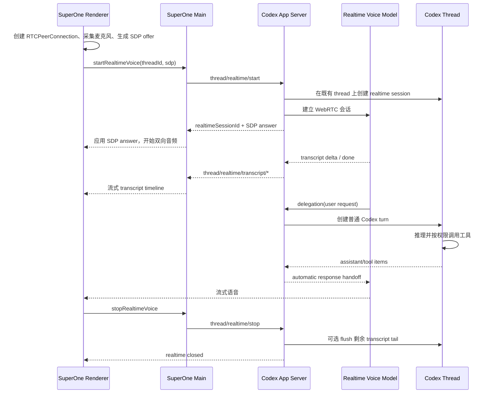

# Codex Realtime Conversation 机制研究

> 状态：已通过本地实现与 `@openai/codex` `0.150.1` 实验协议校验
> 日期：2026-08-29
> 适用范围：SuperOne Desktop 的 Codex harness
> 稳定性：实验功能，不应视为稳定的公开 API 契约

## 结论

Codex Realtime Conversation 不是一个脱离 Codex 的独立语音聊天，也不会创建第二个可见的 Codex thread。它是在一个正常 Codex thread 上启动的短生命周期 realtime session：

- **SuperOne session** 是产品层的会话、UI 和持久化实体。
- **Codex thread** 是长期存在的 provider session，保存正常 Codex 上下文、turn、item 和工具调用。
- **Realtime session** 是绑定在该 thread 上的临时语音连接，负责低延迟音频和转写。
- **Delegation** 把需要执行或深入回答的语音请求送入同一个 Codex thread，形成普通 Codex turn。
- **Timeline** 是该 thread 的统一时间线，其中可以同时出现 realtime transcript 和普通 Codex item。

因此，SuperOne 需要持久化并显示背后的 Codex `threadId`，但不应把 realtime session 当成另一个 Codex session。语音前台模型和后台 Codex 模型的职责也不同：前者负责实时交互与路由，后者负责推理、工具和最终执行。

## 术语和归属

| 实体 | 标识 | 生命周期 | 持久化归属 | 主要职责 |
| --- | --- | --- | --- | --- |
| SuperOne session | SuperOne session id | 长期 | SuperOne SQLite | 产品会话、标题、目录、UI 状态 |
| Codex thread | `threadId` | 长期，可 resume | Codex rollout + SuperOne provider session id | 正常 turn、item、上下文、工具调用 |
| Realtime session | `realtimeSessionId` | 短期，一次语音连接 | Codex thread timeline 中留痕 | WebRTC、音频、转写、handoff |
| Delegated turn | `turnId` | 单次任务 | Codex thread | 执行语音请求、调用 Codex 内置工具 |

一个 SuperOne session 在当前设计中对应一个 Codex thread；一次开始/停止语音只是在该 thread 下创建和关闭 realtime session。

## 总体架构



WebRTC 只承载实时媒体和低延迟会话。Codex App Server 仍是 thread、turn、timeline 和工具执行的控制面。

## 启动和恢复流程

SuperOne 当前启动流程如下：

1. Renderer 创建 `RTCPeerConnection`，加入麦克风 track，并生成 SDP offer。
2. Main process 解析当前 Codex thread：
   - 已有 `threadId` 时调用 `thread/resume`；
   - 没有 `threadId` 时调用 `thread/start`。
3. Main process 对同一个 `threadId` 调用 `thread/realtime/start`。
4. Codex 返回 `realtimeSessionId` 和 SDP answer。
5. Renderer 应用 answer，音频直接通过 WebRTC 流式传输。
6. Main process 订阅 transcript、error、closed 等 App Server notification，并转换成统一 `AgentEvent`。
7. Codex `threadId` 作为 provider session id 写回 SuperOne，供后续恢复和 Codex Thread 视图使用。

关键点是第 2、3 步：realtime session 必须依附于一个支持 realtime 的正常 Codex thread。之前出现的 `Session not found` 和 `thread ... does not support realtime conversation`，分别对应 thread 未正确解析/恢复，以及 realtime 实验能力未启用或当前 thread 连接不支持该能力。

## 当前启动参数

SuperOne 在 `0.150.1` 上发送的主要参数是：

```ts
{
  threadId,
  version: 'v3',
  outputModality: 'audio',
  codexResponseHandoffMode: 'bemTags',
  includeStartupContext: true,
  flushTranscriptTailOnSessionEnd: true,
  voice: request.voice ?? 'cove',
  transport: {
    type: 'webrtc',
    sdp: request.sdp,
  },
}
```

| 参数 | 当前值 | 含义 |
| --- | --- | --- |
| `version` | `v3` | 使用当前实验 realtime 协议版本 |
| `outputModality` | `audio` | 请求实时音频输出；timeline 文本只是 transcript，不代表没有音频 |
| `codexResponseHandoffMode` | `bemTags` | 自动把后台 Codex 响应以 BEM 标记方式交回 realtime 层 |
| `includeStartupContext` | `true` | 向 realtime 会话提供 Codex 启动上下文 |
| `flushTranscriptTailOnSessionEnd` | `true` | 停止时把尚未 delegation 的 transcript 尾部再交给 Codex |
| `voice` | `cove` | 默认语音 |
| `transport.type` | `webrtc` | 使用 SDP offer/answer 建立媒体连接 |

SuperOne 会在 App Server 启动配置中显式启用 `features.realtime_conversation=true`，因为 `0.150.1` 中该能力仍是 under-development feature，默认关闭。

## 提示词注入点

Realtime Conversation 同时存在直接语音模型和后台 Codex 两个模型边界。协议中的提示词字段作用对象不同，不能互换：

| 注入点 | 作用对象 | 注入形态 | 默认/覆盖语义 | SuperOne 策略 |
| --- | --- | --- | --- | --- |
| thread `config.developer_instructions` | 后台普通 Codex turn | thread 级 developer instructions | 创建或恢复 thread 时设置 | 已注入 `CODEX_SYSTEM_PROMPT_APPEND`，并追加 session 级 `systemPromptAppend` |
| `prompt` | 直接 Realtime 语音模型 | `RealtimeSessionConfig.instructions` 主提示词 | 非空 Codex 配置覆盖请求值；请求值覆盖 Codex 内置 realtime prompt | 预留空 constant；空值不发送，避免替换 Codex 内置行为 |
| `initialItems` | 直接 Realtime 语音模型 | V3 初始 role-bearing conversation items | 与内置 realtime prompt 并存，不替换主提示词 | 预留空 developer-instructions constant；空值不发送 |
| `realtimeStartInstructions` | realtime 期间被 delegation 唤起的后台 Codex | realtime 状态进入 active 时的一次性 developer fragment | 自定义值替换 Codex 默认 start instructions | 预留空 constant；空值不发送，保留 Codex 默认 realtime-mode 行为 |
| `realtimeEndInstructions` | realtime 结束后再次运行的后台 Codex | realtime 状态从 active 退出时的一次性 developer fragment | 自定义值替换 Codex 默认 end instructions | 预留空 constant；空值不发送，保留 Codex 默认恢复文字聊天行为 |

### 直接 Realtime 模型

`prompt` 是最直接的注入点，但它不是 append。Codex 的优先级是：

```text
experimental_realtime_ws_backend_prompt（非空）
  > thread/realtime/start.prompt
  > Codex 内置 realtime backend prompt
```

`includeStartupContext=true` 只会在选出的 realtime backend prompt 后追加当前 thread 对话、近期工作和工作区摘要。该启动上下文明确不包含 AGENTS、project-doc prompt blend、memory instructions，也不会自动复制 thread 的 `developer_instructions`。

SuperOne 不应通过 `prompt` 直接发送 `CODEX_SYSTEM_PROMPT_APPEND`，否则会整体替换 Codex 内置 realtime prompt，可能破坏语音前台的身份、delegation 判断和 handoff 协议。如果后续确定需要给直接语音模型添加宿主约束，当前使用的 V3 可以通过 `initialItems` 添加一条 `developer` item。

当前先预留四个独立 constant，不预设具体提示词：

```ts
export const CODEX_REALTIME_PROMPT_OVERRIDE = ''
export const CODEX_REALTIME_INITIAL_DEVELOPER_INSTRUCTIONS = ''
export const CODEX_REALTIME_START_INSTRUCTIONS = ''
export const CODEX_REALTIME_END_INSTRUCTIONS = ''
```

构造 `thread/realtime/start` 参数时只序列化非空 constant。不能为了占位发送 `prompt: ''`：空字符串在 Codex 中表示显式清空内置 realtime backend prompt，而不是“不配置”。`initialItems` 启用后最多注入一条 `developer` item；V3 协议最多允许 128 条、合计最多 8192 估算 token。

### 后台 Codex 模型

后台 Codex 始终沿用同一个 thread。SuperOne 在 `thread/start` 和 `thread/resume` 的 `config.developer_instructions` 中注入基础宿主提示词及可选 session collaboration prompt，因此 delegation 形成的普通 Codex turn 已具备完整 SuperOne instructions。

`realtimeStartInstructions` 和 `realtimeEndInstructions` 只描述后台 Codex 的 realtime 模式转换：

- start 默认告诉后台 Codex：它是语音中间层背后的执行器，输入可能是有识别误差的 transcript，响应应简洁并适合交回中间层；
- end 默认告诉后台 Codex：语音会话已经结束，后续恢复普通文字聊天，不再假设输入有转写误差；
- 两者只在 active 状态变化时注入一次，不会在每个 turn 重复；
- 自定义值会替换相应的 Codex 默认指令而不是追加，每个字段最多 8192 估算 token。

因此，这两个字段不用于重复注入 SuperOne system prompt，也不能解决直接 Realtime 语音模型看不到 thread `developer_instructions` 的问题。

## Delegation 的真实行为

### 不是定时同步

从本地 rollout 观察，realtime 前台会在识别到可委托的用户意图后发起 delegation。连续说话时可能产生多次 delegation，看起来像“定时传一次”，但时间点实际跟用户话语和语义边界相关，不是固定间隔轮询。

delegation 在同一个 Codex thread 中表现为普通输入，当前可观察到的内部包装类似：

```xml
<realtime_delegation>
  <input>用户希望后台 Codex 执行的请求</input>
  <transcript_delta>对应的转写增量</transcript_delta>
</realtime_delegation>
```

当停止语音且仍有未处理的 transcript tail 时，因 SuperOne 开启了 `flushTranscriptTailOnSessionEnd`，还可能产生：

```xml
<realtime_delegation>
  <source>transcript_tail_flush</source>
  ...
</realtime_delegation>
```

以上 XML 形态来自 `0.150.1` 本地 rollout，是实现细节而非稳定 UI 或公开协议。UI 不应原样暴露它，建议将其渲染为“Voice delegation”，并只显示 `<input>` 的用户意图，避免与 transcript 重复。

### 谁调用工具

Realtime 前台模型的主要职责是：

- 维持低延迟语音对话；
- 生成 transcript；
- 判断何时把请求 delegation 给后台；
- 接收 Codex 响应 handoff，并转换为实时语音。

真正的 SuperOne/Codex 工具仍由后台正常 Codex turn 调用，沿用 Codex thread 的上下文、sandbox、权限和审批机制。不能把 realtime 层理解成一个拥有完整 MCP 工具集的独立 agent。

### 响应如何回到语音

`ThreadRealtimeStartParams.clientManagedHandoffs` 在省略时默认为 `false`，因此 App Server 会自动把后台 Codex 响应转给 realtime 层。SuperOne 当前选择 `bemTags` handoff mode，不需要客户端逐条 append Codex 输出。

如果未来改成 `clientManagedHandoffs=true`，SuperOne 就必须显式管理转交时机和内容；这会改变当前的数据流和容错边界，不应只作为 UI 开关处理。

## Timeline 数据模型

`thread/timeline/list` 返回的是同一个 Codex thread 的 canonical timeline。它可以混合以下 entry：

| Entry | 内容 | 推荐视图 |
| --- | --- | --- |
| `turnStarted` | 普通 Codex turn 开始 | Codex Thread |
| `item` | 用户消息、assistant 消息、工具调用等正常 item | Codex Thread |
| `turnCompleted` | 普通 Codex turn 完成 | Codex Thread |
| `realtime` | realtime session、transcript、BEM promotion 等 | Voice Timeline |

`0.150.1` 实验 schema 中的 realtime item 包括：

- `realtimeSessionStarted`
- `transcriptSegment { role, text }`
- `bemItemPromoted { item_id, turn_id, presentation }`
- `realtimeSessionClosed { outcome }`

其中 `bemItemPromoted` 是把语音侧内容和后台 Codex `turn_id` / `item_id` 建立显式关联的关键。其 presentation 可为 `wholeItem`、`inlineMarkdown` 或 `inlineVisualization`。

当前 SuperOne 将 timeline 分成两种呈现数据：

- realtime `transcriptSegment` 映射为 Voice Timeline 的 `segments`；
- 普通 turn/item 映射为 Codex Thread 的 `threadMessages`。

这只是两个 UI 投影，不是两个后端存储。二者共享同一个 `threadId` 和 canonical timeline。

## 音频和文字为什么同时存在

`outputModality: 'audio'` 表示 realtime session 通过 WebRTC 返回流式音频。Timeline 中返回文字是为了记录、恢复、搜索和 UI 呈现的 transcript，不是语音模型只返回了文字。

两条通道需要分开理解：

- **媒体通道**：WebRTC remote audio track，低延迟播放，不依赖 timeline 刷新。
- **控制与持久化通道**：App Server notification 和 `thread/timeline/list`，承载 transcript、状态和 Codex item。

只看到 transcript 而听不到音频时，应检查 WebRTC remote track、autoplay/audio element、SDP 和设备权限，而不是用 timeline 是否有文字判断模型输出模态。

## SuperOne 的持久化职责

SuperOne 需要持久化的核心关联是：

```text
SuperOne session id -> Codex provider session id (threadId)
```

不需要把 `realtimeSessionId` 当作新的长期 Codex session。它可以用于当前连接的状态跟踪和日志，但关闭后不应替代 `threadId`。

恢复一个 SuperOne session 时：

1. 用 provider session id 恢复 Codex thread；
2. 从 `thread/timeline/list` 重建 Voice Timeline 和 Codex Thread 两个投影；
3. 用户再次开始语音时，在该 thread 上创建新的 realtime session。

新建的 voice-only SuperOne session 应在第一条 final 用户 transcript 到达时更新标题。额外目录属于一次新会话的创建上下文，开始全新的语音 session 后不应继续显示旧会话的 additional directory 提示。

## UI 建议

当前采用两个 tab 是合理的，因为用户关注的层次不同：

- **Voice Timeline**：以自然对话为主，只显示用户/assistant transcript 和必要状态。
- **Codex Thread**：展示 delegation 后的完整 Codex turn、工具调用和执行结果。

建议遵循以下规则：

1. 开始 voice session 后自动切到 Voice Timeline。
2. 仅当当前 session 存在 timeline 且正在看 Codex Thread 时，显示“返回 Voice Timeline”的入口。
3. 切换到 Codex Thread 时保持当前 Codex harness，不要回退到默认 harness。
4. Voice Timeline 复用正常聊天消息的排版和间距，但不显示普通 session message footer。
5. 内部 `<realtime_delegation>` 不原样显示；渲染为简洁的 delegation 卡片或用户意图。
6. 利用 `bemItemPromoted` 给 Voice Timeline 中的后台响应提供“查看 Codex turn”入口。
7. transcript 和 Codex item 只保留一个 canonical 数据源，tab 负责过滤和投影，避免复制状态。

## 权限和安全边界

- Delegation 不得绕过 Codex thread 原有的 sandbox、工具授权和用户审批。
- Realtime 前台的“始终 delegation”行为不等于后台必须执行；最终安全判断仍由后台 Codex 和宿主权限层完成。
- Timeline 和 transcript 含有用户语音内容，持久化、日志、导出和遥测应按敏感聊天数据处理。
- Realtime session 的实验字段和内部 prompt 不应暴露为稳定的用户配置契约。

## `0.150.1` 实验协议补充

本地生成的 experimental JSON schema 还暴露了以下能力，目前 SuperOne 未使用或未完整呈现：

| 字段/事件 | 作用 | 当前状态 |
| --- | --- | --- |
| `clientManagedHandoffs` | 由客户端显式转交 Codex 响应 | 未设置，使用自动 handoff |
| `codexResponsesAsItems` | 把自动 Codex 响应作为 realtime conversation item | 未启用 |
| `delegationAckFiller` | V3 delegation 时生成确认 filler | 未显式设置 |
| `initialItems` | 提供 V3 启动历史，最多 128 items / 8192 估算 token | 已预留空 constant，当前不发送 |
| `realtimeStartInstructions` | realtime 开始时给后台 Codex 的 developer instructions | 未使用 |
| `realtimeEndInstructions` | realtime 结束时给后台 Codex 的 developer instructions | 未使用 |
| `thread/realtime/item/*` | canonical realtime item 生命周期通知 | 尚未完整映射到 SuperOne UI |
| output audio delta | 服务端音频增量事件 | WebRTC 已承担播放，Main 未映射为 timeline event |

不要把 realtime model 和普通 Codex model 合并为同一个模型配置。此前 `Field session.model is not allowed for this Codex realtime session` 表明 Codex 托管 realtime session 对原始 Realtime API session 字段有限制。SuperOne 当前不传 model override，由 Codex App Server 管理对应 realtime 模型和必需的实验 header。

## 当前限制和后续工作

- Timeline 当前一次最多读取 200 条，尚未实现分页。
- 当前 realtime 只支持官方 Codex account，不支持自定义 API provider。
- SuperOne 尚未完整消费 `bemItemPromoted`，Voice Timeline 到 Codex turn 的显式跳转仍需补齐。
- `thread/realtime/item/started|completed` 等 notification 尚未进入统一 UI 映射。
- Realtime feature、V3 协议、Quicksilver header 和内部 delegation 格式均可能随 Codex 版本变化。
- 每次升级 `@openai/codex` 时，应重新生成 experimental schema，并用真实 voice session 验证启动参数、timeline union 和 handoff 行为。

## 事实边界

本文的信息分三类：

1. **公开稳定机制**：OpenAI Realtime API 使用 WebRTC 的 SDP offer/answer；Codex App Server 是本地 JSON-RPC 控制面。
2. **`0.150.1` 实验契约**：`thread/realtime/*`、V3 参数、timeline realtime union，来自该版本本地生成的 experimental schema。
3. **本地行为观察**：`<realtime_delegation>`、`transcript_tail_flush` 和 delegation 时机，来自本地 rollout/debug log，不应被视为跨版本稳定保证。

文档和代码应明确保留这一区分，避免把可观察实现细节固化为产品协议。

## 参考资料和实现位置

官方资料：

- [Codex App Server](https://learn.chatgpt.com/docs/app-server)
- [OpenAI Realtime WebRTC call API](https://developers.openai.com/api/reference/typescript/resources/realtime/subresources/calls/methods/create)

SuperOne 实现：

- [`apps/desktop/src/main/codex/codex-realtime.ts`](../../apps/desktop/src/main/codex/codex-realtime.ts)
- [`apps/desktop/src/main/codex/app-server-connection.ts`](../../apps/desktop/src/main/codex/app-server-connection.ts)
- [`apps/desktop/src/main/codex/codex-turn.ts`](../../apps/desktop/src/main/codex/codex-turn.ts)
- [`apps/desktop/src/main/session/backends/codex-backend.ts`](../../apps/desktop/src/main/session/backends/codex-backend.ts)
- [`apps/desktop/src/main/session/session.ts`](../../apps/desktop/src/main/session/session.ts)

版本校验命令：

```bash
codex --version
codex app-server generate-json-schema --experimental --out <output-directory>
```
