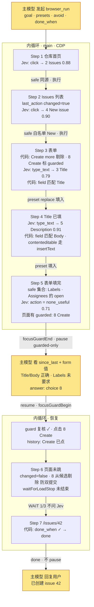

# 用 Jev 加速 browser / computer / device use 的研究

> 状态：browser 线 MVP 已实现（见 10），computer / device 未实现
> 日期：2026-09-18；2026-09-19 按两轮评审修订（见 8.13）并落地 browser 线
> 参考实现：[browser-use/jev-ultrafast](https://github.com/browser-use/jev-ultrafast)（本地路径 `~/Developer/Github/jev-ultrafast`）
> 官方资料：[typesafe-ai skill](https://github.com/typesafe-ai/skills/blob/main/skills/typesafe-ai/SKILL.md)、[docs.typesafe.ai](https://docs.typesafe.ai/llms.txt)（API、primitives、confidence、fan-out、confidence-routing、jev-1.13 jaggedness）
> 适用范围：SuperOne Desktop 的 `browser_*`、`computer_*`、`device_*` agent 工具

## 结论

SuperOne 三条 UI 自动化线的瓶颈不在 observe/act 基础设施，而在**每一个 UI 动作都要经过主模型一整轮**。Jev（TypeSafe 的 System One 模型）能以约 200 ms/步的代价在有限动作空间里做"下一步点哪个"的选择，且 SuperOne 现有的 snapshot 输出（带 ref 的元素表、`stateId` 过期保护、settle 等待、outcome 判断、条件词汇表）已经是 Jev 所需的输入形态。

推荐的接入方式是在现有 observe/act 之上加一个**快速内循环**，按"快思考 / 慢思考"分工：

- **主模型（慢）**：发起时定策略（目标、预设值、允许/禁止的动作、完成条件）；内循环拿不准或只剩受控动作时被问；不再为每一次点击付一轮
- **代码**：持有控制流、历史、新鲜度、风险分类、预算、完成判定；**所有机器可查的判断（加载、完成、变化）都先于 Jev**
- **Jev（快）**：只在代码划定的安全动作集合里做窄选择，永远没有机会自己决定一件不可逆的事

一个 7 步的 GitHub 建 issue 任务：逐步模式 12+ 轮主模型，内循环 **2 轮**（发起 + 1 次受控动作裁定）；主模型预先 `allow` 后可降到 1 轮。

**实施顺序：平台无关内核 → browser（要求 CDP 已开启）→ 阈值校准并钉版 → computer → device。** browser 优先不是因为 adapter 最薄（computer 最薄），而是阈值校准需要 10–20 个可复现任务，公开站点是唯一能低成本攒样本的线（见 7、8.14）。

## 1. Jev 是什么、jev-ultrafast 怎么用它

### 1.1 TypeSafe System One（官方资料要点）

- 一次请求 = 一个 `state`（字符串 / JSON）+ 一组带 id 的 `questions`；所有问题**并行、独立**地评估同一个 state，加问题几乎不加延迟（投机式 fan-out）
- 三种原语：**Choice**（从给定选项选一个，返回选项、全概率分布、confidence）、**Noul**（是/否概率，无 confidence）、**Score**（有序等级）
- 模型只能返回你给的选项，不生成文本；question id 不发给模型，指令要写全；用反引号路径指向 state（`` `elements[3]` ``）
- 限制（官方 models 页）：**64k token 总量；state + 最长一个 question ≤ 32k**；Choice 选项上限 255 在官方页面**未找到出处**，按 jev-ultrafast 的 250 元素截断保守对待；state 里无关内容会导致 context rot
- jev-1.13 jaggedness：字面理解、不会算数/比日期、多跳推理弱、**不把 state 当敌对内容**、不能生成、**相关问题间的结构不变量不保证**（同一请求里几个 Noul 可以同时为高，代码要定优先序）
- 置信度按风险分级（confidence-routing）：官方给的是 **universal floor 0.6**，低于 0.6 一律交人；高风险要 >0.85 或人工确认；阈值调好后钉死版本号（`jev-1.13.0`，jev-ultrafast 的 performance.md 用的就是这个版本）
- 价格 $0.042/Mtok 输入，输出免费；1200 rpm。JS SDK `@typesafe-ai/sdk`（Node 20+，自带 retry/429 backoff、答案类型推导）
- 官方定位："AI-powered software, not agents"——code owns control flow，模型只做窄判断

### 1.2 jev-ultrafast 的循环

```
observe（一次 Runtime.evaluate 跑 snapshot.js）
  → 只取视口内、可见、未禁用的控件，≤ 250 个；视口内文本 ≤ 6000 字符
  → 每个可编辑字段额外生成一个 "Open <label>" 点击候选（打开 combobox / 弹出建议）
  → 每个 <select> 的每个未选中 option 各一个 select 候选（"label → option"）
  → 附带 marker（整页语义）、page_key（表单状态）、guards[node]（目标元素 + 所在 form/dialog/row 文本）
predict（一次 POST /v1/systemone）
  → operation ∈ {CLICK, TYPE_TEXT, SELECT, SCROLL_UP/DOWN, WAIT, DONE, BLOCKED}
  → click_target / type_text_target / select_target（投机 fan-out，只消费被选中操作的头）
act
  → 执行前 fresh() 复核：有目标元素时比 [page_key, guards[node]]，否则比 marker
     —— 作用域化的新鲜度：目标所在 form/dialog/row 没变就算 fresh，允许页面无关区域变化
  → 索引映射回 WeakMap 保存的真实 DOM 节点，重算几何、遮挡检测
  → CDP 输入；先记 history 再 observe；连续 3 步 page_changed=false 且 kind≠wait 即 blocked
TYPE_TEXT 的文本由一个小 LLM（Mercury）根据 goal + 字段 + 页面文本生成
```

测得（`docs/performance.md`，Google Flights）：**17 次 Jev 请求、10 个动作 + 1 次 WAIT**，中位 178 ms/请求，共 7.07 s（含两次文本生成 ≈ 0.9 s 和 Google 结果加载）。17 vs 11 意味着约 **35% 的决策因 stale 被丢弃重做**；90,558 输入 token / 17 ≈ **5.3k token/请求**。

### 1.3 jev-ultrafast 与官方指导的差距

| 官方指导 | jev-ultrafast | 本方案 |
| --- | --- | --- |
| 三种原语 | 只用 Choice | Noul 做元判断（完成 / 加载中），但只在机器信号之后兜底 |
| 拆原子问题 | `operation` 一个 Choice 混了动作与 DONE/WAIT/BLOCKED | 元判断拆出来 |
| Select instead of generate | TYPE_TEXT 用生成模型 | 主模型预设候选值，代码/Jev 只做"哪个预设属于哪个字段" |
| 历史由代码持有，state 只放观察事实 | `recent_actions` 10 条进 state | 只留 `last_action` 一条；去重、防双提交、WAIT 预算全在代码 |
| 置信度按风险分级 | 无阈值 | 风险分类在代码，Jev 只在安全集合里选；floor 0.6 |
| state 过滤 | 已是视口内 + 6k 文本，上限 250 元素 | 收紧到 ≤ 60 元素、≤ 4k 文本，按 32k 总预算校验 |
| 钉版本、用 SDK | 钉 `jev-1.13.0`、手写 httpx | 同样钉版；`@typesafe-ai/sdk` |

保留不改的部分：作用域化 `guard`、"Open <label>" 候选、"先记 history 再 observe"、blocked 计数排除 WAIT。

## 2. SuperOne 现状

三条线的执行模式一致：主模型 → `*_snapshot`（TOON 表）→ 主模型思考 → `*_act(ref)` → 再 snapshot。每步一次主模型往返（3–10 s），上下文随步数线性增长。

| 线 | 执行路径 | Observe 输出 | Act 定位 | 新鲜度 | 变化判断 |
| --- | --- | --- | --- | --- | --- |
| browser | **默认 main → renderer IPC → webview `executeJavaScript`**，单次 30 s 超时（`browser-automation-bridge.ts`）；`AppSettings.cdpEnabled` 开启后 main 可直接 `webContents.debugger`（`browser-cdp.ts`） | `snapshot(elements)` → `{selector, role, name, enabled, inViewport}`，按视口中心距离排序，默认 40 个（`browser-automation-runtime.ts` `HELPERS.ref`） | CSS selector / text / x,y | 无 | 无；有 `waitForLoadStop` |
| computer | main 内 helper 进程 | TOON `outline{ref,depth,role,name,value,x,y,w,h,can,state}`，`can` = `press\|setText\|typeText\|scroll\|focus`（`computer-use/outline-toon.ts`） | `@eN` ref；`delivery=semantic\|app-directed\|physical`；**1–20 个动作一个事务 + `expect` 后置条件**（`tools.ts`） | `stateId` 过期即拒绝 | outcome `worked\|didnt\|unknown`（`outcome.ts`） |
| device | main 内 backend | `DeviceUiNode` 树 + ref + `stateId`，backend settle（`device/settle.ts`） | ref → uid / native handle；tap / setText / swipe | **`requireCurrent`：任何新 snapshot 都让旧 `stateId` 失效**（`state-store.ts`） | 树 diff + `frameHash` |

已有、本方案直接复用的原语：

- **条件词汇表**：computer `conditionSchema`（`exists / notExists / textEquals / textContains / valueEquals`）、device `DeviceCondition`（同名四种 + target），注释明说"一套词汇表，别让 agent 学两套"
- **用户面向确认**：computer `ensureComputerUseAppGrant`（按 bundleId、session/always）、device `control-confirm.ts`，都走 `HostConfirmRegistry`，signal 联动已现成
- **focus guard**：browser `focusGuardBegin / focusGuardEnd`
- **`description` 字段**：computer/browser 工具强制 1–160 字，供 UI 展示
- **错误码**：computer act 会抛 `MODAL_BLOCKED`、`STALE_STATE`、`TIER_BLOCKED`（tier=click 时 setText/typeText 被拒）

与本方案的缺口：

| 线 | 缺口 |
| --- | --- |
| browser | 没有域级权限模型；`HELPERS.ref` 缺 `value / checked / expanded`；靠 CSS selector 定位；没有作用域化新鲜度；`typeScript` 的 value setter 对 `contenteditable` 无效；执行后无变化判断 |
| computer | 几乎零缺口。`can` 列直接映射动作分组；`stateId` 即 stale；outcome / `expect` 即 `changed_page` |
| device | tap / setText / swipe 映射即可；`treeUnavailable` 的屏幕不能交给 Jev；挂起期间不能依赖 `stateId` 短路 |

## 3. 设计

### 3.1 三方分工

```
主模型（System 2）   发起：goal、presets、done_when（可选）、description
                     被问：Jev 拿不准 / 只剩受控动作 / 没进展 / 预算到
代码                 控制流、动作空间构造与风险分类、历史与去重、新鲜度、预算、完成判定、执行、中止
Jev（System 1）      每步一次请求：在安全动作集合里选下一步；预设值属于哪个字段（后置）；元判断兜底
用户                 受控动作里的高危档、切换 app / 设备的 grant、密码字段
```

### 3.2 工具契约

每条线一个 goal 级工具（`browser_run` / `computer_run` / `device_run`），发起与恢复共用：

```ts
browser_run(
  | {                                   // 发起
      description: string,              // 1–160 字，给用户看的（与现有工具一致）
      goal: string,
      tab?: string,
      presets?: Array<{ key: string; value: string; field?: string }>,   // 预设的字段值；field 是字段提示
      done_when?: Condition,            // 可选加速器：复用现有 conditionSchema；browser 额外支持 urlMatches（8.15）
      maxSteps?: number,                // 默认 30
      maxWallMs?: number,               // 默认取当前 harness 工具超时的 60%，到点 pause(budget)
    }
  | { runId: string, answer: Answer }   // 恢复
)
→ {
  status: 'paused' | 'done' | 'aborted',
  runId?: string,
  question?: Question,                  // paused 时
  since_last: string[],                 // 上次返回以来每步一行："Type presets.Title → [3] Title"
  snapshot: <与 browser_snapshot 相同的元素表 + 可视文本 + url>,
  elapsed_ms: number,
}
```

`computer_run` / `device_run` 除定位参数（`root` / `device`）外相同。

- `Condition` 不新造类型：直接用 computer 的 `conditionSchema` / device 的 `DeviceCondition`，browser 加 `{ kind: 'urlMatches', pattern }`
- `maxWallMs` 是硬约束：Claude SDK `MCP_TOOL_TIMEOUT`、Codex `tool_timeout_sec` 都是 per-call 墙钟，内循环必须在超时前主动 pause 返回 `runId`
- 密码类字段永不参与 presets；遇到 password 输入框见 3.5
- 没有 `allow` / `avoid`：主模型派活时看不到页面，让它预判哪些按钮可按等于让它代劳；风险和完成都在现场由 Jev 判断（8.15）
- 工具 description 里要写清路由：**多步、目标明确、动作以点击/填表为主** → `*_run`；单步、需要像素判断、drag/hover/上传/组合键 → 现有 `*_snapshot` / `*_act`

### 3.3 协作协议：pause / resume

内循环是可挂起的协程。三个原语，与触发场景无关：

```
pause(question)   内循环交出一个自己无法裁定的决策
resume(answer)    上层作答，可附带修正 goal 或中止
trace             每次返回携带 since_last + snapshot
```

`Question` 只有两种形状，与 TypeSafe 的 question 一致，上层不需要知道内循环为什么问：

```ts
interface Question {
  id: string
  type: 'choice' | 'value'
  options?: Array<{ key: string; label: string; probability?: number }>   // choice：永远是索引/枚举，不是 selector
  schema?: JsonSchema                                                     // value：如 { text: string }
  context: Record<string, unknown>   // 回答者需要的一切：目标元素、所在 form 的字段与值、Jev 的概率分布、why
  reason: 'uncertain' | 'guarded-only' | 'no-progress' | 'budget' | 'grant' | 'secret'
  audience: 'model' | 'user'
}

interface Answer {
  questionId: string
  choice?: string
  value?: unknown
  goal?: string      // 任意时刻可修正
  abort?: true       // 任意时刻可中止，主模型接管
}
```

**`audience: 'user'` 的产生路径**（不是预留字段，有明确触发）：

| 触发 | 走的现有 UI |
| --- | --- |
| guarded 高危档（pay / delete / send 类关键词，或 `avoid` 命中） | 现有 permission_request（`HostConfirmRegistry`） |
| computer 线 Jev 点击后切到未授权 app / 窗口 | `ensureComputerUseAppGrant` |
| device 线需要重新拿控制权 | `control-confirm.ts` |
| password 字段 | 现有 secret 输入 UI，值不回传给内循环也不进 trace |

`audience: 'model'` 的 pause 走 tool result；`audience: 'user'` 的 pause 由内循环直接 raise 到 host confirm，用户答完内循环继续，不经过主模型。

**挂起时给主模型的上下文**按"它此刻若在逐步操作能看到的一切 + Jev 在想什么"的标准：完整 snapshot（元素带 value）、可视文本、url、目标元素及所在 form 的其他字段与值、Jev 本步的全部概率分布、`since_last`。挂起不锁定 tab / root / device：主模型可以直接用现有 `browser_query` / `computer_query` 等读工具往下挖；若它用写工具改了页面，恢复时新鲜度复核会发现并重新观察。

**恢复时的一致性**：

- browser / computer：先复核新鲜度；变了就重新 observe + predict；只有当 **新决策与挂起时的 (node, kind, label, 输入文本) 完全相同** 才复用答案（对齐 jev-ultrafast `pending_text` 的复用条件），否则丢弃
- device：`requireCurrent` 让任何一次 `device_snapshot` 都使旧 `stateId` 失效，主模型在挂起期间读一次屏就会让短路失效，所以 **device 恢复时无条件 re-observe**（一次 settle ≈ 250 ms），不做新鲜度短路
- **guarded 动作已执行的记录优先于复用规则**：主模型答 Create → 点击已发出 → 页面未跳 → 复核发现变化 → re-predict 又指向 Create，此时 history 里"Create 已点、页面未变"的记录直接剔除该候选，不复用答案（防双提交，见 3.5）

挂起的 run 有 TTL（5 min）；**绑定 `toolUseId`（发起它的那次工具调用）而不是 session**——同一 session 里 Task 子代理可能并行调用，按 session 唯一会互踢；过期释放归属。

为什么不用别的机制：主进程内小模型没有对话/文件/memory 上下文；MCP sampling SuperOne host 未实现且各 harness 支持不一；MCP elicitation 面向用户且 Codex 自动接受。tool result 挂起 + `runId` 恢复只依赖所有 harness 都有的"工具返回 → 再调工具"。

### 3.4 每步一次 Jev 请求

**state（代码构造，只放观察事实）**

```json
{
  "goal": "…",
  "page": { "url": "…", "title": "…", "text": "<视口内文本，≤ 4k 字符>" },
  "elements": [ { "index": "3", "role": "textbox", "label": "Title", "value": "" }, … ],
  "presets": [ { "key": "Title", "hint": "…前 80 字符" }, { "key": "Body", "field": "the issue description editor" } ],
  "last_action": { "label": "Click New issue", "changed_page": true }
}
```

- `elements` 只含视口内可交互元素，≤ 60 个，带 `value / checked / expanded`；受控元素（见 3.5）也在表里，Jev 能看到但不可选；每个可编辑字段附带一个 `open` 候选（打开 combobox）
- `presets` 只给 key、提示、摘要；完整正文由代码在执行时填入
- `last_action` 只一条，是 Jev 观察不到的事实（上一步有没有效果）；完整 history 由代码持有
- 构造后按官方预算校验（state + 最长 question ≤ 32k，state + 全部 questions ≤ 64k），超了先砍文本再砍元素

**questions（一次 fan-out）**

```ts
{
  // 元判断（Noul，各自独立；只在机器信号缺席时兜底，见 3.6）
  goal_satisfied: noul("Is every requirement in `goal` visibly satisfied by `page` and `elements`?"),
  still_loading:  noul("Should the next step wait for `page` to update instead of acting: is the control `goal` needs next absent or disabled, or are submitted results or suggestions still arriving?"),  // 8.16

  // 动作（Choice）——候选只含安全元素
  action:           choice("Which single action best advances `goal` from the current `page`?",
                           { click, type_text, scroll_down, scroll_up, none_useful }),
  click_target:     choice(…, { "1": {...}, "2": {...}, "open:3": {...}, …, none_of_these }),
  type_text_target: choice(…, { "3": {...}, "5": {...}, none_of_these }),

  // 预设值匹配：每个 preset 一个问题（不是每个输入框一个）
  field_for_Title: choice("Which element in `elements` is the field that `presets[0]` belongs in?", { "3", "5", none }),
  field_for_Body:  choice(…, { "3", "5", none }),
}
```

约 3–5k token（按 jev-ultrafast 实测 5.3k/请求估，不按 2–4k）；代码只消费被选中动作对应的 target 头和 field 头。

**MVP 不做的问题**：`select`（选项候选会撞上限，且现有 `selectScript` 已能按 label 选，交主模型）、`obstructed`（cookie banner / login wall 由 guarded 集合 + no-progress 兜住）、`field_for_*` 先用代码按 `presets[].field` 与元素 label 匹配，匹配不上 pause，Jev 匹配后置。

### 3.5 动作空间构造（代码）

**页面上每个可操作元素都是候选**；代码不做风险分类，只做两件事：

```
剔除    ←  password / secure 字段（永不进任何候选：没有 preset 可填，点它也无意义）
        ←  disabled；adapter 标记 clickable=false 的纯文本
候选    ←  其余全部：链接（含跨域）、按钮（含 submit）、tab / menuitem / 行、可编辑字段本身及其 open 候选
        ←  已填写字段的 `submit:N`（按 Enter 提交）——npm、GitHub 的搜索框靠这个
历史    ←  上次页面变化以来，`(node, kind)` 执行后 changed_page=false → 本步剔除该候选；页面一变即重置
```

- 风险由 Jev 对**它选中的那一步**回答 `next_step_risk`（3.4），代码按阈值决定是否 pause；不再有 safe / guarded、`HIGH_RISK_LABEL`、`NAV_LABEL`、origin 集合这些标签规则（8.15）
- 剩下的硬边界只有权限边界：切到未授权 app（computer）、设备控制权（device）——这不是风险判断，是 grant

### 3.6 每步的代码决策

机器信号先于 Jev：

```
observe 之后、问 Jev 之前：
0a. 平台加载信号（browser waitForLoadStop / computer、device settle）未结束 → WAIT（不问 Jev）；连续 WAIT ≤ 3
0b. done_when 成立                                → done（不问 Jev、不 pause）
0c. 平台错误：MODAL_BLOCKED → 当作页面存在 guarded 弹窗，走 3；STALE_STATE → re-observe；treeUnavailable → pause(no-progress)

answers 回来后，按顺序：
1. still_loading ≥ 0.7 且平台无加载信号           → WAIT：等页面相对 Jev 看到的那份 marker 发生变化，事件驱动、提前返回；上限按连续次数递增 1 / 2 / 4 s；连续 WAIT ≤ 3，之后必须选动作（8.16）
2. goal_satisfied ≥ 0.7 且 done_when 未给        → 候选完成：settle 后重新观察再问一次，仍 ≥ 0.7 → done（8.15；Wikipedia 完成页 0.82，之前各页 ≤ 0.09）
   done_when 已给                                → 由 0b 决定，goal_satisfied 只记录
3. action = none_useful（或 target = none_of_these）
     且 click_target 对某候选 ≥ 0.8              → 按 click 处理（action 头在一屏相似项前会整体放弃，target 头仍能挑出那一行）
     否则                                        → 可下滚且本页未滚过 → scroll；否则 pause(no-progress, choice = 候选 ≤ 24 + abort)
4. target 置信度 < 阈值（读取类 0.6 / 写入类 0.7） → pause(reason: uncertain, choice = Jev 的 top-k)
4b. next_step_risk ≥ 0.5                         → pause(reason: risky, choice = 该步 + top-k 替代 + abort)；主模型答该步的 key 即执行
5. action = type_text：
     代码按 presets[].field 匹配到 preset       → 用 preset 正文 replace 输入（不 append）
     否则                                        → pause(reason: uncertain, value{text}，context 含 presets 和候选概率)
6. 执行前新鲜度复核；执行；先记 history 再 observe；computer 线用 expect: valueEquals 校验 type_text
7. 连续 3 步 changed_page=false 且 kind≠wait / maxSteps / maxWallMs 到 → pause(no-progress / budget)
```

同一请求内几个 Noul 同时为高时优先序：`still_loading > goal_satisfied`，且都排在机器信号之后。

阈值是起点（读取类不低于官方 floor 0.6），必须用真实任务的 `trace` 数据校准后钉死模型版本。

### 3.7 各平台 adapter

**browser**（改动最多；**前置条件：`cdpEnabled` 已开启**，否则不注册 `browser_run`）：

- 循环在 main，通过 `webContents.debugger` 直接 `Runtime.evaluate` / `Input.*`，不走 renderer IPC 的 30 s 单次超时
- 移植 `snapshot.js`：WeakMap 节点身份挂到 `window.__sone`，执行按 node id 取回真实节点；`page_key / guards[node] / marker` 作用域化新鲜度（目标所在 form/dialog/row 没变就算 fresh）；"Open <label>" 候选；视口内文本
- `HELPERS.ref` 补 `value / checked / expanded / readOnly`；`contenteditable` 元素按 `innerText` 取 value，输入走 CDP `Input.insertText`（先 select-all），不用现有 `typeScript` 的 value setter 路径
- `type_text` 语义固定为 **replace**
- 观察 + 复核 + 执行 + 等待 + 再观察合并成一个 `step` 调用，一次往返
- CDP 输入绕过 renderer 的 focus isolation：`focusGuardBegin` 在 run 开始，`focusGuardEnd` 在每次 pause 前、resume 时再 `Begin`（8.12 第一条已定）
- 执行后 combobox 200 ms / 其他 50 ms 的 rAF 等待

**computer**：`can` 含 `press` → click 候选；含 `setText`/`typeText` → type_text（tier=click 时构造期剔除）；含 `scroll` → scroll；`state` 含 `disabled` 剔除。执行 `delivery=semantic`。多个高置信 preset 填入可打包成一个 `computer_act` 事务，`expect: valueEquals` 做后置校验。`stateId` 即新鲜度；`outcome.worked` / `expect` 即 `changed_page`。app / 窗口切换触发 `ensureComputerUseAppGrant` → pause(grant, audience: user)。

**device**：有 `bounds` 且可点 → click（tap 中心）；输入类 → type_text（`setText`）；scroll → swipe。`settle.ts` 覆盖等待。`treeUnavailable` → pause(no-progress)。恢复时无条件 re-observe。

### 3.8 中止与生命周期

- 工具调用的 `extra.signal` 贯穿整个 loop：Jev 请求、执行、等待都 `race` 它（不能只在循环头检查）
- abort 来源：用户 UI 停止、harness 中止工具、主模型 `answer.abort`、TTL 到期
- abort 时：取消 in-flight Jev 请求；已发出的 act 不回滚，但记进 history 和 trace；释放 focus guard / grant；run 置 `aborted`
- 用户可见性：每步通过 host event 推进度（复用 record-action / permission 事件形态），ToolBlock 与移动端事件裁剪豁免要两面登记（见 superone-tool skill）

### 3.9 trace

阈值校准、UI 进度、pause 原因分布都依赖 trace，先定 schema：

```ts
interface TraceStep {
  runId: string; step: number; platform: 'browser' | 'computer' | 'device'
  stateHash: string              // 便于 record/replay 对齐
  elements: number; textChars: number; requestTokens: number
  answers: Record<string, { choice?: string; probabilities?: Record<string, number>; confidence?: number; probability?: number }>
  model: string                  // 响应里的实际模型版本
  latencyMs: { jev: number; act: number; settle: number }
  decision: { rule: number; action?: string; target?: string; reason?: string }   // 3.6 的哪一条
  changedPage: boolean | null
  stale: boolean                 // 决策是否因新鲜度丢弃
}
```

存主进程 `userData/jev-traces/<runId>.jsonl`；密码值、secret 答案永不入 trace。

### 3.10 代码位置

`apps/desktop/src/main/jev/`：

| 文件 | 职责 |
| --- | --- |
| `action-space.ts` | 三平台 adapter：snapshot → elements + safe/guarded 白名单分类 + origin 集合 + 历史规则 |
| `questions.ts` | 3.4 的问题集合构造；预算校验在 client |
| `typesafe-client.ts` | 直接 `fetch` `/v1/systemone`（不引 SDK：只需一种调用形状 + AbortSignal + 严格校验）、答案校验（choice ∈ 候选、概率合法）、模型钉版 |
| `policy.ts` | 3.6 的决策表与阈值 |
| `loop.ts` | observe → 机器判定 → ask → decide → act 循环，pause / resume，AbortSignal |
| `run-store.ts` | 挂起的 run：`runId` → 状态、`toolUseId` 归属、TTL |
| `trace.ts` | 3.9 |
| `mcp/jev-run-tools.ts` | 注册 `*_run`；无 TypeSafe key 不注册；`browser_run` 额外要求 CDP 开启 |

TypeSafe key 存主进程 settings。

## 4. 例子：GitHub 建 issue

用户：「去 GitHub 给 browser-use/jev-ultrafast 提个 issue，标题 "Add Electron webview adapter"，正文用你刚才那段总结。」

```
browser_run({
  description: "在 GitHub 上给 jev-ultrafast 创建 issue",
  goal: "Create a new issue in browser-use/jev-ultrafast. Stop when the created issue page is visible.",
  tab: "t3",
  presets: [ { key: "Title", value: "Add Electron webview adapter", field: "the title textbox" },
             { key: "Body",  value: "## Summary\n…", field: "the issue description editor" } ],
  done_when: { kind: "urlMatches", pattern: "/issues/\\d+$" },
  avoid: ["Create more"]
})
```



主模型 2 轮：发起、裁定 Create。若发起时 `allow: ["Create"]`，Step 5 Jev 直接点，主模型 1 轮。注意 GitHub 新版 issue 正文是 `contenteditable` Markdown 编辑器，不是 textarea，这正是 3.7 要求 `insertText` 路径的原因。

Step 5 返回给主模型的内容：

```json
{
  "status": "paused", "runId": "r7",
  "question": {
    "id": "q1", "type": "choice", "reason": "guarded-only", "audience": "model",
    "options": [ { "key": "8", "label": "button Create" }, { "key": "abort", "label": "Stop; hand control back" } ],
    "context": {
      "why": "No safe action advances the goal; guarded elements remain",
      "form": [ { "label": "Title", "value": "Add Electron webview adapter" },
                { "label": "Add a description", "value": "## Summary…" },
                { "label": "Assignees", "value": "" }, { "label": "Labels", "value": "" } ],
      "decision": { "action": { "none_useful": 0.71, "click": 0.22, "…": "…" }, "goal_satisfied": 0.12 }
    }
  },
  "since_last": [ "Click [2] Issues", "Click [4] New issue",
                  "Type presets.Title → [3] Title", "Type presets.Body → [5] Add a description" ],
  "snapshot": "<元素表 + 可视文本 + url>"
}
```

## 5. 风险与边界

| 风险 | 处理 |
| --- | --- |
| Jev 只做选择，不能看像素：canvas、无 AX 的 app、无 tree 的手机屏幕 | pause(no-progress)，主模型接管 |
| 页面文本注入（Jev 不把 state 当敌对内容） | safe 白名单 + origin 集合：Jev 选不到 guarded / 跨域；avoid；主模型在 pause 和最终结果上把关 |
| 代码分类错：把危险动作放进 safe | 白名单默认拒绝；导航类 label 白名单是唯一放行口，集中维护并在 trace 里记每次 safe 点击的 label 供审计 |
| 挂起期间页面变化 | 作用域化 guard 复核，完全同决策才复用答案；device 无条件 re-observe |
| 双提交 | "guarded 已点、页面未变"记录优先于答案复用 |
| harness 工具超时 | `maxWallMs` 到点主动 pause(budget) 返回 runId |
| 挂起过多抵消收益 | 阈值集中可调；presets / allow 减少 pause；trace 里记录每次 pause 的 reason 分布 |
| 动作集有限：click / type_text / scroll / wait | select、drag、组合键、上传、hover 仍走主模型现有工具（见 9） |
| 外部依赖 TypeSafe；browser 依赖 CDP 开关 | 无 key / 离线 / CDP 关闭时不注册对应 `*_run` |
| 阈值随模型版本漂移 | 钉 `jev-1.13.0`；trace 记录响应 `model` |
| 循环失控 | `maxSteps`、`maxWallMs`、连续 WAIT ≤ 3、连续无变化 3 步即 pause |
| 多 session / 子代理并发 | run 绑定 `toolUseId` + tab / root / device，复用现有 driver 归属 |
| 中止 | AbortSignal 贯穿；已发出的 act 不回滚但入 trace |
| 用户可见性 | 每步 host event；pause 原因可见；允许中止 |

## 6. 预期收益

| | 逐步模式 | 内循环 |
| --- | --- | --- |
| 主模型轮次（7 步 issue 任务） | 12+ | 2（allow 后 1） |
| 每步耗时 | 3–10 s | ≈ 0.2 Jev + 0.1 执行 + 0.05–0.2 等待；stale 重做按 ~35% 估 |
| 总耗时 | ~50 s | ~4–6 s + 每次 pause 一轮主模型 |
| 主模型输入 | 每步一份 TOON 快照累积（7 × ~3k） | pause 时一份完整 snapshot + since_last（1–2 × ~4k）+ 发起 |
| Jev 成本 | — | ~5k token/步 ≈ $0.0002；30 步 < 1 分钱 |

收益来源是"大部分步骤是安全的点击"。表单密集型任务靠 presets；提交密集型任务靠 allow。

## 7. 验证路径

1. **平台无关内核**：`typesafe-client`（钉版、32k 预算、答案校验、**record/replay**——jev-ultrafast 的 `docs/*measurement.json` 不含 request/answers，不能直接当 fixture，要自建）+ `loop` / `policy` / `run-store` / `trace`。用录制的 snapshot fixture 离线跑通决策表和 pause/resume/abort
2. **browser 线**（CDP 开启）：移植 `snapshot.js` 的节点身份、scoped guard、open 候选；补 `value/checked`；`contenteditable` 输入。用 GitHub issue / Google Flights / Wikipedia 对比逐步模式
3. **阈值校准**：10–20 个公开站点真实任务的 trace，定读取/写入阈值和 field 匹配阈值，钉版本
4. **computer 线**：复用 outline；接 grant / MODAL_BLOCKED / TIER 映射；事务 + `expect`
5. device 线：无条件 re-observe

## 8. 讨论与决策记录

以下是讨论中依次做出的决定及理由，按时间顺序。设计章节反映最终结果；这一节保留"为什么"，方便以后重新评估。

### 8.1 Jev 不操作浏览器，只做选择题

jev-ultrafast 里 Jev 的输入是索引化的元素表，输出是索引；操作浏览器的是 Python 侧的 CDP 代码。`TYPE_TEXT` 被拆成两步：Jev 选"要不要输、往哪输"，另一个小 LLM 生成"输什么"。这决定了 Jev 在 SuperOne 里的定位：**不是替换现有工具，而是在现有 observe/act 之上加一个快速内循环**。

### 8.2 主模型不能只做发起和验证

最初的方案是主模型发起 → 内循环自主跑完 → 主模型验证。否决原因：`TYPE_TEXT` 要输什么只有主模型知道（来自对话历史、文件、memory），jev-ultrafast 的小模型方案在 SuperOne 里不成立。因此需要一个内循环与主模型的联动机制。

评估过的联动机制：

| 机制 | 结论 |
| --- | --- |
| 主进程内小模型生成文本 | 没有对话上下文，只能做可选加速，不能做默认 |
| MCP sampling | SuperOne host 未实现；各 harness 支持度不一 |
| MCP elicitation | 面向用户；Codex 自动接受 |
| **tool result 挂起 + `runId` 恢复** | 只依赖所有 harness 都有的"工具返回 → 再调工具"；采用 |

### 8.3 协作协议要通用，不枚举场景

第一版定义了 `text / choose / verify / stuck / budget` 五种 `ask.kind`。否决：太具体，每加一个场景就要改契约。改为：问题只有 `choice` / `value` 两种形状（与 TypeSafe 的 question 一致），`reason` 和 `context` 描述为什么问；**什么时候 pause 是策略，不是协议**，策略集中在 `policy.ts`。

### 8.4 挂起时给主模型的上下文要充分

第一版只给字段摘录。改为按"主模型若在逐步操作此刻能看到的一切 + Jev 在想什么"的标准：完整 snapshot（元素带 value）、可视文本、目标元素所在 form 的其他字段与值、Jev 的概率分布、执行增量。理由：pause 次数少，每次可以给得慷慨；总量仍远低于逐步模式的快照累积。同时明确**挂起不锁定资源**，主模型可以直接用现有读工具往下挖，不需要在协议里再造"请求更多信息"。

### 8.5 发起时预先提供信息以减少中断

主模型发起时可以给 `presets`（字段值）、`done_when`（机器可查的完成条件）、`avoid` / `allow`（动作白黑名单）。对内统一编译成"预先写好的答案"：内循环在 pause 前先查有没有匹配的预设。猜错的后果只是回到 pause，没有损失。

### 8.6 按官方指导重新设计 Jev 请求

读了 typesafe-ai skill 和官方文档后的调整（详见 1.3）：

- DONE / WAIT / BLOCKED 从 `operation` Choice 拆成独立 Noul
- `presets` 的匹配从字符串比对改为语义匹配，投机式地和动作选择放在同一请求（MVP 先代码匹配，见 8.13）
- 每个 target 头加 `none_of_these`
- state 过滤：视口内、≤ 60 元素、≤ 4k 文本；反引号路径引用
- 用 `@typesafe-ai/sdk`，钉 `jev-1.13.0`

### 8.7 从仅保留 `last_action` 到有界 `completed_actions`

jev-ultrafast 把最近 10 步放进 state，用途是防重复、判断上一步有没有效果、WAIT 计数。按官方"历史由代码持有，state 只放观察事实"的指导，逐项检查后：防重复和 WAIT 预算都是确定性规则，移到代码；"上一步有没有效果"是 Jev 观察不到的事实，值得保留，但只需一条。jev-ultrafast 里那句 "Recent WAIT actions are not evidence of loading" 本身就是历史进 state 导致过度解读的症状。

2026-09-19 desktop diagnostic revision: a Calculator task reproducibly selected Equals at step 3 despite observing `12` and being given the exact sequence. One controlled diagnostic added only `completed_actions`, the last eight executed action labels with transient indices removed. With `["Click 1", "Click 2"]`, the same step chose digit 3 at 0.99; all seven observed actions followed the intended sequence (`rce269e87`, versus `r407e1325` without history). Retain this bounded field alongside `last_action`. Waiting, failed dispatches and future plans are excluded; the list survives budget pauses. Code still owns risk, retries, loading budgets and completion checks. This single diagnostic supports the state change, not a general performance claim or a reason to route known sequences away from batching.

### 8.8 `steps` 改为 `since_last`

pause 时主模型需要知道从上次返回以来内循环做了什么（尤其是预设值填进了哪个字段），但不需要每步概率和累积全量历史。改为每步一行的增量；概率、延迟、模型版本进 trace 日志给 UI 和调参用。

### 8.9 风险判断不交给 Jev（已被 8.15 推翻）

第一版设计了 `risky_N` Noul 让 Jev 判断每个点击候选是否不可逆。否决：按快慢思考的逻辑，"这个动作要不要认真想"本身就是 System 2 的判断，不能让 System 1 决定 System 2 该不该介入。改为代码分类 `safe | guarded`，Jev 只在 safe 集合里选；Jev 答 `none_useful` 且页面有 guarded 元素 → pause 交主模型裁定；主模型可用 `allow` 预先放行。这样也顺带解决了"图标按钮 Jev 判不了"的问题——不认识的一律 guarded。

实测推翻了这条（见 8.15）：白名单在桌面上等于"每个任务把要按的键抄进 allow"，主模型派活时根本没有这些信息。

### 8.10 预设匹配不确定时 pause，不降级

场景：Jev 选了往某字段输入，但对哪个 preset 属于它只有 0.61。两个选项：pause 问主模型，或当作没匹配上让 Jev 换动作（赌下一步会更确定）。决定 pause：Jev 拿不准就是需要慢思考；填错字段虽可逆，但主模型多一轮成本很低。附带措施：`presets[].field` 让主模型给字段提示，降低这种情况的发生率。

### 8.11 完成判定：机器条件优先（已被 8.15 修订）

`done_when` 成立即 done，`goal_satisfied` 只是佐证；Jev 说满足但机器条件不成立或未给 → pause。理由：AGENTS.md 原则 "DONE 不是证据"，机器条件比 Jev 的判断硬。

修订：`done_when` 仍然优先，但它是可选的；没给时 Jev 的判定（重观察确认后）直接结束 run，不再 pause 问主模型。

### 8.12 原待定项（已定）

- 挂起期间 tab 的 focus guard：**必须释放**——CDP 输入绕过 renderer 的 focus isolation，guard 不释放用户在 pause 期间无法操作该 tab；pause 前 `End`，resume 时 `Begin`
- `no-progress` 时：把当前动作空间（含 guarded）作为 choice 返回，主模型可直接点一步，也可 abort 自己逐步走。两者不冲突，主模型按 context 决定
- 阈值：起点按官方 floor 0.6，校准后钉

### 8.13 2026-09-19 两轮评审的修订

第一轮（Opus）对照 SuperOne 代码，第二轮（Fable）对照 jev-ultrafast 源码与 TypeSafe 官方文档。逐条结论：

| 修订 | 理由 |
| --- | --- |
| 事实：floor 0.6、255 未证实、Noul 间无结构不变量；token 预算 64k/32k 经 models 页复核**维持原文**（第二轮评审说"32k 共享"是错的） | 对照官方页面；原文 0.5 无出处 |
| 事实：snapshot.js 本就视口内 + 6k 文本；`fresh()` 是作用域化 guard 不是指纹；17 请求 / 11 动作；5.3k tok/请求；open 候选；blocked 排除 WAIT | 对照 `snapshot.js:44-104`、`browser.py:90-98`、`agent.py:153-158`、`performance.md`。原 1.3 把"改进"建立在错误刻画上；scoped guard 是要移植的核心，原 3.7 一笔带过 |
| browser 循环前置条件：CDP 开启 | 默认路径是 renderer IPC + 30 s 单次超时，"main 内循环 + 0.1 s 执行"只在 CDP 下成立 |
| `maxWallMs` | harness 工具超时是 per-call 硬墙钟，pause 是唯一逃生口 |
| `done_when` 复用 conditionSchema / DeviceCondition | 已有一套词汇表，不造第二套 |
| safe 由黑名单改白名单 + origin 集合 | 原黑名单让 "Close issue"、checkbox、跨域链接落进 safe，与 8.9 "不认识一律 guarded" 矛盾；跨域是注入防线 |
| `audience: 'user'` 接上 grant / control confirm / secret | 原先定义了但无产生路径；computer 一次点击切 app 就要 grant，这是天然触发 |
| 机器信号先于 Jev（加载、完成、变化） | 原 3.6 先信 `still_loading` Noul，与 8.11 自己的原则矛盾 |
| 答案复用条件收紧 + guarded 已执行优先 | 原"同 node+label 复用"与防双提交冲突，是唯一会造成不可逆后果的漏洞 |
| device 恢复无条件 re-observe | `requireCurrent` 让挂起期间任何 snapshot 都使 run 失效 |
| run 绑定 `toolUseId` | 同 session 子代理并行会互踢 |
| `field_for_<preset>` 反向；MVP 先代码匹配 | 每输入框一问在大表单膨胀；参考实现没有此问题，属新增，后置 |
| MVP 去掉 select / obstructed / allow 之外的复杂度 | 先拿到可校准的最小闭环 |
| `type_text` = replace；contenteditable 走 insertText | 原文未定义；GitHub 例子正好踩到 |
| 加 `description`、host event 进度、AbortSignal、trace schema | 与现有工具契约对齐；校准依赖 trace |
| 顺序改为 browser 先 | 见 8.14 |

### 8.14 为什么 browser 先于 computer

原文按"落地难度"把 computer 排第一：adapter 最薄、`stateId` / outcome 现成。评审指出"落地容易"≠"能校准"：阈值必须用 10–20 个可复现任务的 trace 钉死，browser 用公开站点即可，computer 受 macOS + 功能开关 + 逐 app grant 限制，样本难攒且不可复现。内核做成平台无关后，adapter 顺序只影响谁先拿到校准数据，所以 browser 先。

### 8.15 2026-09-19 范式修订：派活与判断分开（browser 先行）

Finder 与 Calculator 两组 desktop 实测（10.4）暴露的不是 Jev 决策问题，而是契约问题：主模型调用 `*_run` 时**看不到页面**，它只负责派活；`allow` 白名单要求它预判哪些按钮可按——网页上链接/tab 天然安全所以很少需要，桌面上一切都是 button，结果是每个任务把要按的键抄一遍进 `allow`（Grok 还抄漏了两个）。这不是委托，是代劳。是否完成同理：8.11 让 Jev 说"完成"时还要 pause 问主模型一轮，而"这一屏是不是目标状态"恰恰是 Jev 最擅长的 noul 题。

决定：

- **删掉 `allow` / `avoid`**。接口只剩 `goal`、`presets`（主模型独有的信息：要输入的值）、可选 `done_when`。
- **风险由 Jev 判**：每步多一个 noul 头 `next_step_risk`，只问它选中的那一步是否不可逆（提交/发送/付款/删除/改设置/离开当前站点或 app）。≥ 0.5 → `pause(risky)`，选项第一条就是该步，主模型确认即执行。代码里的标签规则（`HIGH_RISK_LABEL`、`NAV_LABEL`、submit guarded、跨域 guarded、桌面菜单命令分类）全部删除；只保留权限边界（未授权 app、设备控制权）和 password 剔除。
- **完成由 Jev 判**：`goal_satisfied ≥ 0.9` → settle 后重观察再问一次，仍成立 → `done`，返回最终快照（主模型本来就会核对）。`done_when` 给了就提前结束，是加速器不是前提。
- 与 8.9 的原则冲突，明知故犯：8.9 的"System 1 不该决定 System 2 是否介入"在理论上成立，但代价是主模型必须在无信息的情况下替 System 1 预判，实践上更差。误放行的代价是"做了一个不该做的动作"，由阈值和 trace 校准兜；误 done 的代价是主模型看快照后再发起一次。
- 顺序：browser 线先落地并重跑 10.1/10.2 的两个任务确认范式，再迁移 computer / device。

### 8.16 2026-09-19 WAIT：Jev 判要不要等，代码判等什么

npm 搜索 → 点建议项 → SPA 客户端导航（fetch ≈ 0.8 s 后才 `pushState`）。按 3.7 的 2 帧 / 50 ms settle 与 `readyState` 信号，点击后立刻观察到的仍是一张**完整的首页**，Jev 对 "Is page still loading?" 答 0.16，选 scroll，两轮后 no-progress 暂停（trace `rd4198244`）。

对照 jev-ultrafast：它在适配器层没有更聪明的等待（同款 settle），而是把 WAIT 当动作候选交给 Jev，规则写的是 "**WAIT only when the needed control is absent/disabled**, or submitted results are still loading"（`questions.py:10`），然后固定 sleep 100 ms 再问一遍——Google Flights 记录里 17 请求 / 11 动作有一部分就是这么来的。

决定：

- **要不要等由 Jev 判**：`still_loading` 改成 jev-ultrafast 的问法（目标需要的控件不在 / 已提交的结果没出来），它问的是页面上可见的事实，不是网络状态。
- **等什么、等多久由代码判**：Jev 说等，含义就是"我要的还没出现"，代码要等的就是页面变化。browser 在页内挂 MutationObserver（100 ms 安静后重算 marker，另有 250 ms 兜底 tick），marker 与 **Jev 看到的那份**比较（决策与等待之间已发生的变化立即命中），变了再等两帧返回；整页导航销毁 context 视为变化。computer / device 走 loop 里的 observe + changed 轮询兜底。
- **不让 Jev 选时长**：时长不是页面上可观察的事实；事件驱动下短上限也省不了时间，只多一次 Jev 往返。
- **上限递增 1 / 2 / 4 s，连续 ≤ 3**：上限只在页面不变时付代价；连续几轮 Jev 独立重看后仍说"没出现"，可信度递增，就给更长的耐心；三轮后必须选动作。最坏 7 s + 3 次 Jev；npm 那种 0.8 s 导航只多付 1 次。
- 等待结束与 `changed_page` 用同一个 marker，由构造保证两者一致。
- 未覆盖：页面完全静止但网络在等（DOM 不动）只能等到上限；需要时再加页内 in-flight 请求计数（Playwright networkidle 思路），是加法不是替代。

### 8.17 2026-09-19 WebVoyager 抽样：点击不设门槛、动作后等变化、折叠导航标 Expand

用 5 个真实站点（Cambridge Dictionary、arXiv、Hugging Face、GitHub、Apple）加 Wikipedia / npm 回归抽样，全部 Grok 4.6 / high、无 `done_when`、dev 面板 748 px（含窄视口/汉堡布局，故意不放大）。首轮暴露三类机制缺口（不是站点特例）：

1. **动作后快照太早**（第三次撞到）：点击触发的菜单/下拉/SPA 导航在 2 帧 / 50 ms 后还没出现，`changed=False`，Jev 下一步看到同一页。→ `settleAfter` 改成事件驱动：等页面相对**动作前** marker 变化（MutationObserver + tick），上限 500 ms，变了再等两帧；combobox 保留"等可见 option"。与 8.16 的 WAIT 共用一个 `changeWaitExpr`。直连探针：Apple Menu 点击后 15 ms 即测得 12→16 元素。
2. **低风险点击被置信门槛拦**：arXiv 首页正确的 "Search" 链接 Jev 只给 0.36、HF 的 Tasks 0.49，都被 `read` 0.6 拦成 `uncertain` pause。风险已由 `next_step_risk` 单独判（两例 ≈0.1），点错安全元素只赔一步重观察，pause 却赔主模型一整轮。→ 删掉 click 的置信门槛（`THRESHOLDS.read`），只保留 `next_step_risk ≥ 0.5` 的 risky pause 和 type 的 0.7 门槛。jev-ultrafast 同样从不设门槛。
3. **折叠导航 Jev 认不出**：GitHub / Apple 窄布局把搜索藏在 `aria-expanded=false` 的汉堡后。→ 候选标签按 8.15 "把动作写进标签"的规律，`expanded=false` 的按钮显示为 "Expand <label>"（`clickVerb`），并加一条 RULE：控件不在页面时先展开折叠导航再滚动或等待。

### 8.18 2026-09-19 根因：跨边界比较 marker，settle 与 WAIT 从未真正等待

8.16 / 8.17 的等待全部是空转，直到 apple.com 的"点了 Menu 却报没变化"被追到底。诊断顺序：先把 settle 的结论写进 trace（`settled`），再让它报出差异的 marker 字段，最后把差异的元素**以原始字符串**记录——真相才出现：

```
was: {"disabled":…,"editable":…,"href":…,"label":"Apple","node":1,…}   ← 字母序
now: {"node":1,"role":"link","label":"Apple","value":"",…}              ← 插入序
```

同一份数据，键序不同。Electron 的 `webContents.debugger` 在 `returnByValue` 时按字母序重排对象键，而 settle 比较的是 **Node 侧序列化的字符串**与**页面内序列化的字符串**，于是 `JSON.stringify(s.marker) !== seen` 恒为真：每个动作后 settle 立刻返回"已变化"，Jev 的 WAIT 也立刻返回（arXiv trace 里的 `wait: 7` ms 即是）。

这个 bug 能长期隐藏，是因为 `deps.changed` 与 `isFresh` 比较的两侧都来自 CDP，排序一致因而正确；只有 settle / WAIT 跨了边界。**用裸 WebSocket 直连 CDP 的探针复现不出来**（那条路径保留键序），一度把排查引向"水合竞态"等错误假设。

修法：不跨边界比字符串，在页面内对两侧做同一套递归键排序后再比。

同时修正的两处（都由 Apple 的真实时序逼出）：

- **settle 等的是"可观察状态稳定"，不是 DOM 安静**。Apple 的菜单用 CSS 过渡把条目显现出来，**不产生 mutation**，以 DOM 安静为准会在展开到一半时返回（同一份代码两次跑出 16 与 39 个元素的差异）。改为：差异成立后持续采样 marker，直到它 200 ms 不变，或 `graceMs` 1000 ms 用尽；上限 2000 ms。
- **滚动之后没有 settle**。`execute()` 里只有 click / type 调 settle，而滚轮是平滑动画，观察发生在滚动落地之前，于是每次滚动都报"无变化"，三次即触发 no-progress——但页面其实一直在滚（探针读到 `scrollY` 已达 6346）。

### 8.19 候选标签要说明动作会揭示什么

GitHub 首页在 748 px 下把搜索框收进 "Toggle navigation"。标成 `Expand Toggle navigation` 后 Jev 仍只给 0.16，选择滚动；Apple 的同类控件因为 aria-label 字面写着 "Local Nav Open Menu" 而拿到 0.74。差别在标签文字，不在 `expanded` 属性——Jev 无法从"这个控件可展开"推出"我要的搜索框在里面"。

把结果写进标签（`Expand <label> to reveal controls that are not on the page right now`），同一控件升到 0.53–0.64，GitHub 全程走通。这是 8.15 "把动作写进标签"的延伸：**属性描述状态，标签描述后果，Jev 对后者反应好得多**。

### 8.20 2026-09-19 wait 范式移植到 computer / device：只继承了一半

8.16–8.18 的 wait 工作分三层，只有第一层在共享 `loop.ts` 里。移植时发现 computer / device 只拿到了那一层：

| 机制 | 归属 | browser | computer（移植前） | device（移植前） |
|---|---|---|---|---|
| Jev 判要不要等、1/2/4 s 阶梯、≤3 连续、no-progress 兜底 | 共享 loop | ✓ | ✓ | ✓ |
| `waitForChange`（等到界面真变） | 适配器 | ✓ 页内观察态对比 | ✗ | ✗ |
| `settle`（动作后等稳定） | 适配器 | ✓ 2 s 稳定 + 1 s grace | ✗ no-op | ✗ no-op（**但下层已做**） |
| `loading` 机器信号 | 适配器 | ✓ `readyState` | ✗ 硬编码 `false` | ✓ `!settled` |
| `waitReady` | 适配器 | ✓ 轮询 readyState | ✗ 恒 `true` | ✗ 恒 `true` |

**缺陷一：wait 的轮询兜底对这两个平台是死的。** 没有 `waitForChange` dep 时 loop 退化成每 150 ms 调一次 `changed(page, observe())`。但 computer / device 的 `changed` 只读 `after.outcome`，而 `outcome` 只在 `act()` 的 successor 上赋值，`observe()` 产生的页面没有它 —— 恒返回 `null`，于是**每次 wait 都等满 1/2/4 s**。参数写成 `_before` 就是信号：它根本没在做前后对比。与 8.18 同类：判据取错了对象。

**缺陷二：computer 点击后不等任何东西。** `settle` 是 no-op，理由写的是"`service.act` 已验证 successor"。但 `act` 只在传了 `expect` 时才轮询等待，而 `planNodeAction` 只给 `setText` 配了 expect —— click / scroll / enter 发完输入立刻 `look()` 一次就返回。桌面的菜单展开、sheet 下拉比网页的 CSS 过渡更普遍，正是 8.18 那个"16 vs 39 个元素"的同类。

**device 不需要补 settle。** `android-backend.observe()` 内部按截屏哈希 settle（2.5 s 上限，60 ms 采样），`runAct` 的 successor 也走同一条路 —— 交给它的每个观察都已经停稳了。原注释是准确的，盲目叠一层只会把每步的墙钟再翻一倍。

移植结果（`jev/settle.ts`）：

- 观察签名取 **loop 真正读的字段**（elements 的 node/role/label/value/checked/selected/expanded/disabled + title），不是平台原始树。computer 现成的 `signature: JSON.stringify(outline)` 不能用 —— 代码里早有注释说它会在两次读之间因焦点标志churn，拿它判稳定永远判不出来。
- 采样节奏按成本分档：browser 在页内 30 ms tick，一次 CDP 往返；computer 每次采样是一次跨进程 AX 读，用 150 ms / 总预算 1500 ms / grace 600 ms（browser 是 2000 / 1000）；device 的 observe 自带 settle，只用 25 ms 下限兜底。
- **下限不能是 0**。让循环推进完全依赖 observe 耗时，一个立刻返回的读就会空转，deadline 永远到不了。
- computer 的 settle 把稳定后的观察写回 successor，**并保留 act 的 outcome** —— 否则 `changed` 读不到动作的结论，每步都报 "change unknown"。
- computer 的 `loading` 保持 `false`：AX 没有 `readyState` 的等价物，稳定性由 settle 负责，这是诚实的而不是漏接。

**实测（Calculator，sin(pi/6)，Grok 4.6 / high）暴露了签名的第一版漏洞。** 7 步里有 3 步（Pi、Divide、6）报 `settled: unchanged`：按这些键**只动显示屏**，而显示屏是 static label——所有元素的 role/label/value 原封不动，变化只出现在 `page.text` 里（`sine (, π ÷ 6, implicit )`）。第一版签名把 text 排除在外，理由是"桌面 outline 的 text 会 churn"；trace 说这个理由不成立，而单元测试当时断言的是**我的假设**而不是平台的事实。把 text 纳入后重跑，7/7 步都是 `settled: changed ['observation']`，显示读到 `zero point five`。

教训与 8.18 同源：**判据必须对着被判断的东西取**。8.18 是比错了序列化边界，这次是取了一个不包含目标信号的字段集，两次都不报错，只是安静地永远给同一个答案。

顺带暴露一个**不属于 wait 范围**的问题：`checkDone` 把 `done_when` 绑在第一次观察的 stateId 上（`conditionStateId ??= current.stateId`），而 Calculator 任务必须先 Basic → Scientific，位置性 ref 随之失效——结果算对了（`Edit field = zero point five`）但完成条件永不满足，run 多走一次 scroll 再 no-progress 暂停，由主模型 abort 收尾。这是 10.4 记的 Calculator 反例的另一个侧面，留待单独处理。

### 8.21 2026-09-19 `done_when` 不该否决 Jev 的完成判定

8.15 把完成判定交给了 Jev，但 policy 里两条 done 规则都写着 `&& !doneWhenGiven`——**只要调用方传了 `done_when`，Jev 的判断就完全不采纳**。注释说的是"done_when 是调用方更严格的定义"，实现出来却是"给了条件就只认条件"。

Calculator 实测把这个矛盾逼了出来。第 8 步 Jev 给 `goal_satisfied 0.83` + `action: none_useful 0.97`（显示已是 `zero point five`，正是 done_when 要的值），两条 done 规则都因 `doneWhenGiven` 跳过，落到 `noneUseful()` → 滚动 → 第 9 步再 none_useful → no-progress 暂停，由主模型 abort 收尾。**任务早就做完了，run 却在原地打转。**

而 `done_when` 本身永远不会命中：它的 ref 绑在**第一次观察**的 state 上（`conditionStateId ??= current.stateId`），这个任务必须先 Basic → Scientific，树重排后 `resolveConditionTarget` 按 role + bounds 距离重定位失败。两条完成路径同时失效，于是谁也收不了尾。

**这不是 computer 特有的。** 同一条门控对三个平台一视同仁；browser 没暴露，只因为 10.6 的抽样 prompt 一律写着"不要传 done_when，让循环自己判完成"。

修法：`doneWhenGiven` 原本承载了两个意思——"调用方给了条件"和"调用方在 goal_satisfied 暂停后答了继续"。拆成两个参数，只有后者（`satisfiedOverruled`）继续否决完成判定；前者只影响措辞。`done_when` 仍是快速路径（每次 ask 之前先查，命中就立刻结束，省一次 Jev 请求），但不再是唯一裁判。走到 policy 就说明它没命中，所以完成理由里如实写上 `(done_when never matched)`，调用方自己判断要不要接受。

修复后同一任务：8 步、22.6 s、`status: done`、`why: goal_satisfied 0.80 (done_when never matched)`，最终快照 `Edit field = zero point five`。

一个参数同时表达两件事，是这类缺陷的温床——它让"给了条件"悄悄继承了"用户说还没完"的否决权。

## 9. 非目标

- 不替换现有 `*_snapshot` / `*_act` / `*_query`；`*_run` 是并列的 goal 级工具，主模型按工具 description 里的路由指引选
- 不支持 select（MVP）、drag、hover、组合键、上传、新标签页、嵌套滚动、canvas
- 不做主进程内文本生成
- 不在 pause 期间锁定 tab / root / device
- 不把 Jev 的 DONE / 任何 Noul 当作完成证据

## 10. 实现状态（2026-09-19）

browser、computer 和 device 线 MVP 已落地。三条线共用一个 `FastRun`，代码在 `apps/desktop/src/main/jev/`：

| 文件 | 对应章节 |
| --- | --- |
| `typesafe-client.ts` | 1.1 · 3.4（预算校验、答案校验、钉 `jev-1.13.0`、429/529 退避、AbortSignal） |
| `browser-page.ts` | 3.7 browser adapter：移植 `snapshot.js`（`window.__soneJev` 节点身份、scoped `guard` / `pageKey` / `marker`、视口内文本 ≤ 4k、≤ 250 元素）、CDP click / replace-type（select-all + `Input.insertText`，contenteditable 可用）/ 滚动、执行前 hit-test、执行后 rAF settle、`readyState` 机器加载信号、`waitForPageChange`（MutationObserver + 250 ms 兜底 tick 重算 marker，与 Jev 看到的比较，变了再等两帧）、`done_when` 机器判定；stale 统一抛 loop 的 `StaleObservation` |
| `action-space.ts` | 3.5：所有可操作元素为候选（password 剔除）、`open:` / `submit:` 候选、历史规则（未变页面前不重复）；风险由 Jev 的 `next_step_risk` 判（8.15） |
| `questions.ts` | 3.4：`goal_satisfied` / `still_loading` Noul、`action` / `click_target` / `type_text_target` Choice、每个 preset 一个 `field_for_<key>` |
| `policy.ts` | 3.6 决策表与阈值（target 头概率：读 0.6 / 写 0.7；preset 0.7；loading 0.7；satisfied 0.85。`action` 头只取 argmax，不设门槛，见 10.1） |
| `loop.ts` | 3.3 / 3.6 / 3.8：`FastRun` 协程，pause / resume、答案复用只在目标 guard 未变时、guarded 已执行记录、连续 3 步无变化 → no-progress、`maxSteps` + `maxWallMs`（默认 45 s，低于 Codex 60 s 工具超时）→ budget、focus guard 在段首/段尾、AbortSignal 贯穿 |
| `run-store.ts` | 挂起的 run：`runId` → run，绑定 session，TTL 5 min |
| `trace.ts` | 3.9：`userData/jev-traces/<runId>.jsonl`，每步脱敏 request state、全部概率及前三选项、实际 usage、延迟、决策、stale |
| `jev-api-key.ts` | TypeSafe key：`app_meta` 表 + `safeStorage` 加密，从不进 `AppSettings` |
| `device-page.ts` / `device-run-tool.ts` | 3.7 device adapter：现有控制权校验、当前 snapshot / semantic tree、tap / setText / swipe、原生 device Condition；无 tree 暂停、resume 总是重新观察、独立 device_release 清理 |
| `computer-page.ts` / `computer-run-tool.ts` | 3.7 computer adapter：semantic outline / capabilities / state epoch、原生 act 与 Condition、授权和 tier 门控、resume 重新观察；继承共享 pause / resume 协议 |
| `browser-run-tool.ts` | `browser_run` 契约与门控（`jevFastLoopEnabled` + `cdpEnabled` + 有 key，执行时判定） |

接线：`browser_run` 同时登记在 compact 与 legacy 两个 surface、`BROWSER_TOOL_NAMES`（host-owned 放行）、远程节点 host-action 目录、chat ToolBlock（`run` op）。设置：Settings → Browser → Experimental Tools → "Jev Fast Inner Loop"，开启时若无 key 先弹 key 表单，key 存好才置位。

### 10.1 首次实测对比（2026-09-19，Claude harness，dev 版）

任务：从 Wikipedia 首页搜索 "TypeScript"，打开条目，再打开 "View history"，回复最终 URL。两组同一 prompt，只换一句工具指引（"Prefer browser_run" vs "step by step, do not use browser_run"）。

| | 逐步（browser_snapshot / act） | browser_run（Jev） |
| --- | --- | --- |
| 主模型工具调用 | 14（1 ToolSearch + 13 浏览器） | 6（2 ToolSearch + 1 无 tab 报错 + 1 开 tab + 1 发起 + 1 回答）|
| 墙钟 | 43.4 s | 27.8 s |
| 主模型花费 / 上下文 | $0.134 / 51.6k | $0.056 / 35.6k |
| Jev 请求 | — | 5 步 ≈ 9.6k token ≈ $0.0004，中位 ≈ 390 ms/步（首步 1.1 s 含冷启动） |
| 内循环动作 | — | Click Search → Type preset → Click 建议项 → Click View history；1 次 pause（首页窄视口下 "Search" 链接概率 0.54 < 0.6） |
| 结果 | 正确，但模型放弃了搜索框，直接 navigate 到 `index.php?search=TypeScript` | 正确，全程走页面 UI |

修正前的第一次 Jev 运行是反例：64.9 s、17 次调用、$0.183——四次 pause 后主模型 abort 改走 browser_act。三个根因都已修：(1) 用 `action` 头的 confidence 做写入门槛（4 选 1 的 confidence 天然只有 0.4 左右）→ 改为只按 target 头概率门控；(2) preset 的 `field` 提示按整句子串匹配 "the search box" 匹配不上 "Search Wikipedia" → 改按词元重叠，且 pause 时把已匹配的 preset 随 pending 带到 resume；(3) Wikipedia 搜索框在加载后从 `searchbox` 升级成 `combobox`，scoped guard 变化导致答案被丢弃 → resume 时 guard 不同则重新观察，同 node + 同 label 仍视为同一目标。

### 10.2 两个任务 × Opus 汇总（2026-09-19，dev 版，Claude harness，主模型 opus）

| 任务 | 模式 | 主模型工具调用 | 墙钟 | 主模型花费 | 上下文 | Jev |
| --- | --- | ---: | ---: | ---: | ---: | --- |
| 1 Wikipedia：搜 TypeScript → 条目 → View history | 逐步 | 13 | 41.3 s | $0.464 | 37.6k | — |
| | browser_run | **5**（rename + 2 ToolSearch + 开 tab + 1 次 run，**0 pause**） | **27.4 s** | **$0.266** | 35.5k | 6 req · 16.0k tok · $0.0007 · 内循环 3.3 s |
| 2 npm：搜 zod → 包页 → Versions tab，读最新版本 | 逐步 | 17 | 69.4 s | $0.629 | 42.6k | — |
| | browser_run | **8**（2 次 run + 1 次 abort + 1 次 browser_act 按 Enter） | **45.3 s** | **$0.542** | 38.0k | 5 req · 7.6k tok · $0.0003 · 内循环 1.0 s + 2.1 s |
| **合计** | 逐步 | 30 | 110.7 s | $1.093 | | |
| | browser_run | 13（−57%） | 72.7 s（−34%） | $0.808（−26%）+ $0.001 Jev | | |

两组都拿到了正确结果。任务 1 用 haiku 时的数字（10.1）比例相近：43.4 s / 14 次 / $0.134 vs 27.8 s / 6 次 / $0.056。

观察：

- 花费降幅小于调用次数降幅：Opus 每次调用都要重读 35–40k 上下文，`browser_run` 的 pause/done 返回里带完整 snapshot，单次调用比一次 `browser_act` 贵；省的是次数，不是每次的量。
- Jev 单次延迟：每个 run 首个请求 1.1–1.7 s（冷启动），之后 330–530 ms，中位 ≈ 390 ms，比 jev-ultrafast 报告的 178 ms 慢一倍（网络位置差异）。内循环本身只占墙钟的 5–10%，其余是主模型。
- 任务 2 的 abort 是新的真问题：npm 首页搜索框有自动补全下拉，点 "Search" 按钮时 mousedown 先触发 blur → React 重渲染 → click 没落到提交上；页面 marker 变了（下拉关闭）所以没触发"无变化"规则，Jev 再看时判 `none_of_these`，只剩 guarded → pause；Opus 选择 abort 自己按了 Enter。**已修**（见 10.3）：(1) 动作空间加 `submit:N`（在已填写的字段上按 Enter，风险等级同提交按钮，`allow: ["Enter"]` 或字段 label 放行）；(2) `guarded-only` 的 pause 选项在 guarded 之后列出 safe 候选（≤ 20），主模型能答"再点一次 12"而不是只能 abort。
- 逐步模式下 Opus 每个任务都额外花 2–3 次调用写/读 `browser_memory`（npm 的"链接要用 cdp engine"经验），这是逐步模式的固有开销，也说明它在替代 Jev 做的"页面适配"工作。

### 10.3 修复 submit 路径后重跑任务 2（Opus，browser_run）

| 主模型工具调用 | 墙钟 | 主模型花费 | 上下文 | Jev |
| ---: | ---: | ---: | ---: | --- |
| **4**（rename + ToolSearch + 开 tab + **1 次 run，0 pause**） | **22.9 s** | **$0.234** | 33.9k | 5 req · 8.4k tok · $0.0004 · 内循环 3.5 s |

对比修复前的 45.3 s / 8 次 / $0.542，以及逐步的 69.4 s / 17 次 / $0.629。这次 Jev 点 "Search" 直接生效（step 2 因下拉弹出 guard 变化被判 stale、重观察后 step 3 点中），`submit:N` 未被用到，但它现在是 Jev 可选的候选（主模型这次传了 `allow: ["Search"]`，字段 label 不匹配所以 Enter 仍在 guarded 列表里；若再出现 blur 吞 click，pause 选项里会同时有 "press Enter in Search packages" 和 "再点 Search"）。

逐步模式任务 2 再跑一次做方差参考：17 次 / 73.4 s / $0.610 / 43.6k（首跑 17 / 69.4 / $0.629 / 42.6k），两次都要靠 `browser_memory` 里记下的"npm 链接要 cdp engine 点内部 h3"才能通过——这条经验是首跑时它自己写的，第二跑先读再用，仍然 17 次。

**修复后两任务汇总（Opus，逐步取两次均值）**：

| | 逐步 | browser_run | 差 |
| --- | ---: | ---: | ---: |
| 主模型工具调用 | 30 | **9** | −70% |
| 墙钟 | 112.7 s | **50.3 s** | −55% |
| 主模型花费 | $1.084 | **$0.500** | −54% |
| Jev 花费 | — | $0.0011 | |

阈值仍未系统校准；`jev-traces/*.jsonl` 已在记录。

### 10.4 Desktop: task selection and the Calculator counterexample (Grok)

The desktop adapter is registered on both tool surfaces and the remote descriptor catalog, with running / paused / done / aborted chat labels in English and Chinese. It reuses the existing app identity and grant path, semantic action executor, state store and native `computer_wait_for` conditions. The experimental setting and API key are shared with the browser loop. `read` grants pause; secure fields are excluded; obstruction and capability failures return a pause. Native refs are re-observed on resume and an answer is discarded when the outline changed. Return requires the same app-focused AX field; scrolling uses the same app-directed delivery as `computer_act`. There is no physical-input fallback.

**Task type matters.** Tasks whose next target must be found on the current screen and that end in a native condition are the fast-loop targets; the Finder navigation pair below is the first desktop gain measured. A known button sequence is a poor fit; the main model can send a `computer_act` batch faster and more accurately. The tool description explicitly routes known sequences to `computer_act`.

#### Finder folder navigation (Grok 4.6 / high, empty workspace, paired)

Same window, same initial state (one list-view Finder window at the startup disk root), same prompt except for the tool policy. Task: open `System`, then `Applications` inside it, then `Utilities`; done when the window title is exactly `Utilities`. Three steps, each a choice among the rows on screen (the second screen also holds a root-level `Applications` that must not be chosen; the third holds ~40 apps and one folder). `done_when = { kind: 'textEquals', ref: <window>, text: 'Utilities' }`.

| Mode | Main-model tool calls | Wall time | Main-model cost | Context | Result | Jev |
| --- | ---: | ---: | ---: | ---: | --- | --- |
| `computer_act` step by step | 20 | 236.4 s | $0.2605 | 97.5k | done | — |
| `computer_run` (final) | 9 | 102.0 s | $0.0986 | 58.7k | done, 0 pauses; run 17.5 s, 3 steps at 0.89 / 0.89 / 0.84 | 3 requests, 24.8k input tokens, $0.0010, latency 1.5 s / 0.4 s / 1.3 s |

Calls −55 %, wall time −57 %, main-model cost −62 %. The baseline found `Utilities` with `computer_query search` against the full state after its snapshot table was folded; the fast loop cannot query, which is why the three earlier `computer_run` attempts on this task failed and produced the fixes in `7c3e448b` / `17ae7de8`:

| Attempt | Calls / time / cost | Where it stopped | Cause |
| --- | --- | --- | --- |
| 1 | 15 / 220.7 s / $0.181 | step 3, guarded-only pause, aborted | Adapter read the folded outline (400 nodes): the third screen ended at row 17, `Utilities` was never a candidate. Unnamed rows produced `Select `, `Open ` and empty candidates; 106 guarded menu commands (including Apple-menu recent files) came first and made the pause question 100+ options long. |
| 2 | 13 / 160.1 s / $0.105 | step 1, guarded-only pause; the resumed answer was discarded | After the fix, the name cell inherited the row label but not the name field's folder metadata, so `Open System` was guarded as an unknown item; the whole-outline signature rejected the resume because menu state churns between reads. |
| 3 | 11 / 132.1 s / $0.102 | step 3, guarded-only pause, aborted | `click_target` chose `Open Utilities` at 0.86 while the `action` head answered `none_useful` at 0.55 over a screen of fifty guarded app rows; policy followed the action head. |

Decisions taken from these: the desktop adapter builds candidates from the complete, compacted state outline (never the model-facing fold); rows and cells are named by their first readable descendant and inherit its file metadata; one candidate per intent; window content precedes app menus and the Apple menu is dropped; a paused answer survives when id, label and native ref agree; guarded pause options are capped at 24 with the omitted count reported; a click target ≥ 0.8 overrides a `none_useful` action head (§3.6 threshold table gains `overrideNone`). The last rule is the only policy change; it is general and covered by a unit test, but it was calibrated on one screen shape and remains on the uncalibrated-threshold list.

The following attempted comparison is retained as a counterexample, **not a successful paired benchmark**. Both sessions used Grok 4.6 / high and the same Calculator task: clear Basic mode, press visible buttons for `(123 + 456) × 2`, verify `1,158`. Calls and cost include setup and cleanup. These sessions ran in the repository workspace; later diagnostics use an empty workspace.

| Task | Mode | Main-model tool calls | Wall time | Main-model cost | Context | Jev |
| --- | --- | ---: | ---: | ---: | ---: | --- |
| Calculator arithmetic: known button sequence | `computer_act` batches | 16 | 153.0 s | $0.125199 | 47.1k | —; correct result, two action batches |
| Same task | `computer_run`, then recovery and interruption | 28 | Incomplete; at least 271.1 s | $0.268996 | 72.3k | 7 requests; 13,514 input tokens; about $0.000568; 1 uncertain pause, then aborted; wrong result `24` |

The first Jev call started 173.2 s after the user message, after 23 main-model tool calls (including 8 tool searches and source inspection). That setup time is separate from the 3.485 s summed Jev API latency. Baseline batching already reduced the actual calculation to two main-model action rounds; it did not pay a turn for every button. An earlier recorder incorrectly followed the active chat and copied the baseline session into the Jev result; its reported 47.444 s is invalid and excluded. The recorder now pins both project and session ID.

A single diagnostic in `/private/tmp/jev-clean-bench/workspace` reproduced the wrong sequence with Grok 4.6 / high (`r407e1325`, seven-step budget, then abort). At step 3, the exact Jev request contained `Edit field 12`, the prior action `Click [10] 2`, and correctly labelled candidates `[11] 3`, `[12] Add`, `[14] Equals`. Nevertheless, `click_target` ranked Equals at 0.86, Multiply at 0.06, and digit 1 at 0.02. This rules out missing display text and a mislabelled button for that decision. It demonstrates a sequence-decision limitation; it does not establish a general navigation-task failure. Full redacted request state and top-three probabilities now remain in each run trace for diagnosis.

A second, single diagnostic added `completed_actions` (at most eight executed labels) and changed step 3 to digit 3 at 0.99 (`rce269e87`). All seven actions were correct, ending at `123 + 456`; it then paused at the diagnostic step budget and was aborted. The field is retained with a regression test (see §8.7). The full calculation and performance gain were not tested in this experiment.

The live investigation also exposed an independent root-selection issue: macOS can publish a tiny auxiliary window for Calculator. App resolution now prefers the visible ordinary window while retaining modal and transient priority. The native adapter uses the action successor state rather than another screenshot, and normal turn cleanup owns desktop visuals so pause/resume does not invalidate its window.

The follow-up found two desktop contract gaps independent of Jev decisions: window outlines omitted the app menu bar, and native completion conditions could not express a newly opened panel. The fixes expose visible menu nodes in ordinary snapshots and route their refs through the existing semantic `computer_act` executor. Candidate construction and dispatch now share a native action planner: a candidate requires the actual grant, node capability and delivery prerequisites. `typeText` alone does not imply safe text replacement; secure and disabled nodes remain excluded.

Native `Condition` now includes `newRoot`, shared by `computer_act.expect`, `computer_wait_for` and `computer_run.done_when`. It matches a newly visible root in the same app/process using exact `title` and/or semantic `text` substring, with an optional `rootKind` filter; all supplied constraints must match. Existing windows and title-only changes do not qualify. Actions and the run follow the new root, and completion returns its verified snapshot. No Jev request shape or policy threshold changed in this follow-up.

Commits: menu support `dbef5b82`, shared action planner `38e45368`, pure service split `b035f2ec`, native completion `4c91e993`. Completion verification: 148 targeted tests passed; related checks 5,433 passed / 39 skipped; node and web typechecks passed.

### 10.5 Device functionality smoke (Grok; not A/B)

`device_run` uses the same `FastRun`, policy, questions, action space, trace and session/platform-bound run store. Its adapter uses `DeviceAgentSession` for observation, input and outcome checks. Both tool surfaces, shared host-owned names, remote descriptors and chat labels are wired. There is one shared experimental setting. The loop requires a device already granted to the session; missing control returns the same `NO_DEVICE` error as `device_act` and never opens a control prompt. Resume re-observes, and positional answers survive only an unchanged tree. Secure, disabled, offscreen and OCR-only controls are excluded. A missing accessibility tree pauses with context instead of guessing from pixels.

Only a functionality smoke was authorized; **no baseline or A/B comparison was run**. The clean-workspace session used Grok 4.6 / high and iPhone 17 Pro Max (`427A175E-DCA5-4F31-B916-89FC00483162`, iOS 26.4 runtime; About reports 26.4.1), initially shut down. Task: Home → Settings → General → About, change nothing, inspect and release the device.

| Task | Mode | Main-model tool calls | Wall time | Main-model cost | Context | Jev |
| --- | --- | ---: | ---: | ---: | ---: | --- |
| Settings navigation; functionality smoke | `device_run` | 14 | 205.1 s | $0.136097 | 50.1k | 4 requests · 5,199 input tokens · about $0.000218 · API latency 2.819 s · 2 pauses · 0 stale retries |
| Same task | Baseline | — | Not run | — | — | A/B remains paused |

Run `r97cbf4cf` selected Settings (1.00), General (1.00) and About (0.99), and reached the correct About page. The first pause was `no-progress` after the cold Settings launch returned no usable tree (17.638 s from run start; the action/settle capture accounted for 15.866 s). The caller inspected and resumed once, using a fresh snapshot. The second pause was `guarded-only`: the requested exact condition `label:"Model Name"` did not match the actual accessibility name `Model Name, iPhone 17 Pro Max`. The existing condition vocabulary behaved correctly; there was no false `done`. The observed stable identifier was `ProductModelName`; the tool schema now explains whole-label matching and recommends an observed identifier. This was an over-narrow smoke input, not an adapter failure, so no repeat was run.

The caller aborted the paused run, captured a settled About screenshot and called `device_release`. The release returned `outcome:"shutdown"`, `running:false`, and the simulator was independently confirmed shut down. Abort ends the loop and returns control to the caller; `device_release` remains the explicit device-ownership cleanup. No settings or credentials were changed. End-to-end time includes discovery, boot, control, inspection, pauses and shutdown; it is not a claimed latency improvement.

Verification: Jev/browser surface, the built-in tool catalog and device presenter checks: 130 tests passed. Related checks: 5,924 passed / 39 skipped (426 files passed / 3 skipped). Node and web typechecks passed. Stories cover running, paused, done, aborted and error at a narrow width. The exact completion condition was deliberately not weakened to substring matching; the same native vocabulary remains shared with `device_wait_for`.

与设计文档的偏差（MVP 有意收窄）：

- `audience: 'user'` 未实现：password 字段直接不进候选，登录类页面会以 `no-progress` 交回主模型
- `done_when` 按平台复用：browser 用 selector / selectorGone / text / urlIncludes / urlMatches；computer 和 device 用各自已有 Condition。computer 将原始 ref 绑定到 native identity，并增加原生 newRoot 条件识别同应用新窗口；原始状态若被有界 state store 淘汰，需要开始新的 run。
- run 绑定 session 而非 `toolUseId`（同 session 并行子代理各自 runId 不冲突，只是 TTL 清理按 session）
- 无 select、无 `obstructed`、无 host event 逐步进度（UI 只见 tool row 的 paused / done / aborted）
- 阈值未校准（含新增的 `overrideNone: 0.8`，只在 Finder 一种屏幕形态上校过）；Calculator 的已知按键序列是已复现的模型决策边界。desktop 的性能收益目前只有 Finder 三步导航一组配对数据（§10.4）；菜单 → 弹面板类任务因 `hidesOnDeactivate` 尚无有效配对。
- computer 输入只使用原生能力：替换文本要求 setText；不支持的输入路径暂停交回 computer_act。
- computer 保持后台控制（目标 app 不被激活）。`hidesOnDeactivate` 的系统面板（Fonts、Colors 等 NSPanel）只在目标 app 前台时存在：直连 helper 实测 TextEdit 前台时 `list_windows` 返回 `Fonts` AX root，切到后台即消失（CG 层面同样如此，面板在 layer 3 且离屏）。这类面板在 `computer_run` 下无法观察，`newRoot` 不会命中；不通过激活目标 app 来规避，选题时避开。
- device 不提供键盘 Enter、OCR 坐标候选或无 tree 降级；已有 device_act 处理这些情况。device 的 live 数据仅为功能 smoke，未作 A/B 性能结论。

### 10.6 browser 范式抽样（Grok 4.6 / high，dev 版，无 `done_when`，面板 748 px）

> 8.18 之前的读数已作废：settle 与 WAIT 因跨边界比较 marker 而从未真正等待。下表是修复后逐个跑通的实测。

| 任务 | 结果 | `browser_run` | 主模型 | Jev 步数 / 完成判定 | 修复前 |
| --- | --- | --- | --- | --- | --- |
| Wikipedia 三跳 | ✅ done | 1 | 7 calls / 105.1 s / $0.0533 | 6 步 / 0.95·0.96 | 通过（0.82） |
| npm 搜 zod → Versions | ✅ done | 1 | 7 calls / 105.6 s / $0.0464 | 5 步 / 0.93·0.94 | 通过（0.83） |
| Cambridge Dictionary 查词 | ✅ done | 1 | 6 calls / 79.5 s / $0.0603 | 4 步 / 0.96·0.97 | 通过（0.85） |
| Apple → MacBook Air → Tech Specs | ✅ done | 1 | 7 calls / 131.1 s / $0.0387 | 16 步 / 0.83·0.82 | 首页第 1 步即卡住 |
| arXiv 搜索 → 首条摘要 | ✅ done | 1 | 6 calls / 61.5 s / $0.0515 | 6 步 / 0.88·0.85 | 覆盖元素死循环 |
| Hugging Face 筛选 + 排序 | ✅ done（`sort=downloads`） | 1 | 7 calls / 69.1 s / $0.0510 | 8 步 / 0.63→0.93 | 排序错成 trending |
| GitHub 搜仓库 → Issues | ✅ done | 1 | 7 calls / 207.9 s / $0.0440 | 11 步 / 0.96 | 首页 no-progress |

**7/7 通过，每个任务只用一次 `browser_run`、零暂停。** 三个原本已通过的任务同时回归确认，且完成判定普遍升高（npm 0.83→0.94、Dictionary 0.85→0.97），说明 8.18 的终点状态问法不只救了 arXiv，也让 0.7 阈值的余量变大。一次 Wikipedia 运行在 Jev 判完成（0.96）之后卡在主模型侧未收尾、被 runner 的 480 s 上限掐断，重跑正常——属 harness 偶发，与循环无关。

#### 更难的一批（多约束筛选、自动补全、日期选择器）

| 任务 | 结果 | `browser_run` | 主模型 | Jev 步数 / 完成判定 | 暴露的问题 |
| --- | --- | --- | --- | --- | --- |
| Google Flights 单程 ZRH→LHR 2026-10-15 | ✅ done | 1 | 9 calls / 359.8 s / $0.0360 | 18 步 / 0.94·0.95 | — （4 步 stale 重试，22%） |
| Coursera 搜索 + Beginner 级别筛选 | ✅ done | 2（一次 no-progress 暂停后恢复） | 8 calls / 71.5 s / $0.0723 | 8 步 / 0.76→0.85 | 隐藏 input + label 代理 |
| Allrecipes 搜索 → 首条食谱 | ✅ done | 1 | 7 calls / 65.5 s / $0.0689 | 6 步 / 0.86·0.87 | `<noscript>` 标记污染可访问名 |

Google Flights 是 jev-ultrafast 自己发布过数据的任务（17 次 Jev 请求 / 10 动作 + 1 次 WAIT / 7.07 s，约 35% 决策因 stale 作废）。我们这次 18 次请求、13 个动作 + 2 次 WAIT，**4 次 stale（22%）**；它完成了机票类型切换、两处自动补全城市选择、日期选择器选日，全程无暂停。总时长 359.8 s 绝大部分是主模型的轮次，循环自身约 16 s。

Coursera 一例值得单独记：Level 展开后页面文字里明明写着 "Beginner ( 4,765 )"，动作空间里却什么可点的都没有——该站把真正的 `<input type=checkbox>` 设为 `opacity: 0`，可见的是样式化 label。这类"隐藏 input + 代理"在设计系统里极常见，观察层必须把**能接住点击的那个节点**（label）作为候选节点，同时保留 input 的语义（role / name / checked）。修好后该复选框得分 1.00。

Apple 一例在修复过程中的推进（同一 prompt、同一模型），可见每一层各自的贡献：

| 构建 | 结果 |
| --- | --- |
| 8.17 状态（settle 空转） | 第 1 步 click Menu 即报"无变化"，候选被 stuck 规则剔除 → no-progress |
| + marker 规范化 | 导航三步全对，落到 `/macbook-air/`，但滚动全报"无变化" → 三次即暂停 |
| + 滚动 settle + 状态稳定判定 | 全程走通并自判完成 |

**这批修复按影响排序**：跨边界 marker 比较（8.18，让等待全部失效）> 遮挡元素仍被提供（Jev 每轮选它、执行器每轮拒绝）> 完成判定问的是"每条要求"而非"终点状态"（同一页 0.49 → 0.88）> 折叠控件标签没说明展开会揭示什么（0.16 → 0.53）。四者都不是模型能力问题：每一例里 Jev 的选择在它看到的信息下都是合理的。

### 10.7 Jev 前后的配对基准（Grok 4.6 / high，dev 版，computer_use）

前面几节比的是"循环能不能跑通"。这节比的是接入 Jev 到底省了什么：同一 prompt、同一模型、同一台机器，只把导航段从"主模型逐步 `computer_act`"换成"一次 `computer_run`"，两腿之间用脚本把应用状态复位。

`totalCostUsd` 只记主模型（Grok 4.6 / high）的账；Jev 自己的请求走另一条链路，单列在最后一栏，不并进成本列。

| | 计算器 `sin(π/6)` | | | Finder 三级目录导航 | | |
| --- | ---: | ---: | ---: | ---: | ---: | ---: |
| | 逐步 `_act` | `_run` | 差 | 逐步 `_act` | `_run` | 差 |
| 墙钟 | 127.2 s | 113.2 s | **−11%** | 200.9 s | 124.5 s | **−38%** |
| 工具调用（总） | 12 | 10 | −17% | 14 | 11 | −21% |
| 工具调用（任务相关） | 6 | 4 | −33% | 11 | 4 | **−64%** |
| 主模型成本 | $0.1059 | $0.0707 | **−33%** | $0.1951 | $0.0997 | **−49%** |
| 上下文 | 73.9k | 56.4k | −24% | 99.1k | 61.7k | **−38%** |
| Jev 自身 | — | 9 req / 37.9k tok / 7.45 s | | — | 3 req / 34.4k tok / 3.52 s | |

**收益随"每步之间观察的成本"放大，而不是随步数放大。** 计算器的按键全部在第一张快照里就可见且位置不变，主模型每次 `computer_act` 之间并不需要重新观察，所以省下的主要是工具往返；Finder 每打开一层目录整张 AX 表就换一遍（66 → 82 → 190 → 109 个元素），逐步模式必须把每一张都读进上下文，于是上下文 −38%、成本 −49%。**这条规律决定了 `computer_run` 该用在哪：状态在步与步之间大幅改变的导航型任务，而不是坐标稳定的定点操作。**

Finder 的 `computer_run` 三步全部一次命中（click_target 0.75 / 0.83 / 0.78），无暂停、无 stale 重试，循环自身 23.9 s，其余时间都在主模型的解析与汇报轮次上。

§10.4 已有一组更早的 Finder 配对（基线 20 calls / 236.4 s / $0.2605 / 97.5k，`computer_run` 9 calls / 102.0 s / $0.0986 / 58.7k）。两次独立配对方向一致，且**`computer_run` 那条腿高度可复现**（$0.0986 vs $0.0997，58.7k vs 61.7k），波动几乎全来自基线腿（20 calls vs 14 calls）——主模型自己决定要看几张快照、要不要 `computer_query`，而把导航交给 Jev 之后这个自由度就没了。这也是为什么单次配对的绝对百分比不该当结论用，但方向可以。

#### 两条一开始没跑通的腿

**计算器首跑结果是 `0.0091384`** —— 不是代码缺陷，是我的复位脚本没生效：`killall Calculator` + `open` **不会重置角度模式**，基线腿从弧度开始、Jev 腿从角度开始并多做了一次切换。也就是说计算器那列的对比是**对 Jev 不利**的（它多走了一步），真实差距只会更大。AppleScript 读不到计算器按钮（`window 1` 只返回红绿灯，`entire contents` 里 `class of e is button` 匹配不到任何东西），这条路要复位得另找办法。

**Finder 的 Jev 腿首跑在第 1 步就 `no-progress` 暂停**，报 `The observed target does not support this computer_act operation`。根因在 `action-space.ts`：

```ts
if (el.editable) {
  ...
  clickCandidates.push(`open:${el.index}`)   // 无条件
  continue                                    // ← 从这里跳出
}
if (el.clickable === false) continue          // ← 永远轮不到 editable 元素
```

`clickable === false` 这道闸写在 `continue` 之后，对 editable 元素完全失效。**在 DOM 里 `editable ⇒ clickable` 恒成立（`<input>` 一定能点），移植到 AX 树上这个蕴含关系就断了**：Finder 行的名称单元格是 `AXTextField`，可以改名（`setText` 有 plan），但**没有 `AXPress`**。`computer-page.ts` 正确地把它标成 `clickable: false` 且不登记 `clickKinds`，动作空间却照样把它当点击候选发给 Jev；Jev 选中它（一个执行不了的选项凭空占走概率质量），适配器查不到 plan，第 1 步即暂停。修掉后同一 prompt 一次跑通。browser-page 从不设置 `clickable` 字段（恒为 `undefined`），所以这个缺陷在浏览器侧不可能触发——**只有移植到第二个平台才会暴露"共享层里藏着的平台假设"。**

同一次排查还暴露了一个诊断缺陷：`loop.ts` 的 act catch 只对 `StaleObservation` 写 trace，`RunPaused` 直接 rethrow，于是**唯一会让人想读 trace 的那一步，恰好是 trace 文件里没有的那一步**（该 runId 根本没有生成 `.jsonl`）。已改为抛出前先 `emit(trace)`。

#### 方法与口径

- 两腿都经 `scripts/cdp-eval.mjs` 驱动 dev 版渲染进程，跑在同一个基准工作区 `/private/tmp/jev-clean-bench/workspace`，每腿 `resetSession()` 开新会话。
- 成本与上下文读自会话 store 的 `totalCostUsd` / `contextTokens`，在该腿结束后、下一腿开始前立即采样。
- "任务相关调用"排除框架开销（`SearchTools`、`session_rename`）。计算器：`computer_apps` + 快照 + `computer_act` / `computer_run`；Finder 基线为 `computer_apps`×1 + `computer_snapshot`×4 + `computer_act`×3 + `computer_query`×2 + `computer_wait_for`×1，Jev 腿为 `computer_apps`×1 + `computer_snapshot`×2 + `computer_run`×1。
- **单次配对，不是统计结论**：主模型的轮次长度波动很大（§10.6 里同一任务出现过 65 s 与 360 s 的差距），这两组只说明量级和方向。


### 10.8 Finder 两个补充案例：菜单栏与长列表（2026-09-20，Grok 4.6 / high，dev 版）

§10.7 之后又加了两个专挑未覆盖路径的案例：**B 菜单栏**（View ▸ Sort By ▸ Date Modified，验收用 `AXMenuItemMarkChar` 的 ✓）和 **A 长列表**（/System/Library 163 项，目标在倒数第 2 行，验收用窗口标题）。两个首跑都失败，各挖出一串缺陷；修完后 B 一次 press 完成（3 步 6.9 s，`goal_satisfied 0.81`），A 10 步 31.9 s 到达（5 次滚动每次视口都在推进，最后 `Open WorkflowResponsiveness` 置信度 1.0）。

#### B：后台 app 的菜单命令是死的，而且没有后台路径

昨晚的判断（"关闭时 `enabled` 不可信"）是错的，真因是**前台 vs 后台**：AppKit 的 `validateMenuItem:` 按 active app 的 key window 校验，后台 app 没有 key window，41 个 View 菜单项只剩 3 个 enabled；AXPress 报 `ok:true` 但排序列不变，Finder 切到前台后同一操作立刻生效。逐条实测的替代路径全部无效：`CGEventPostToPid` 快捷键（⌘1 在前台变 icon view、后台不变）、直接 AXPress 关闭菜单树里的叶子、先用 AX 把窗口设 AXMain/AXFocusedWindow 再按、System Events `click menu item`、SkyLight 私有 `_SLPSSetFrontProcessWithOptions(kCPSNoWindows)`（非前台进程调用被忽略）、以及"AX 读取刷新了 enabled 之后再按"。`AXEnabled` 不可写。

落地的是**事务性激活**（helper `axPressMenuCommand`）：叶子命令 press 时若 app 不在前台 → `activate()` → 沿菜单栏往下枚举 children 直到该项 `AXEnabled` 变 true（AppKit 在激活后的下一轮 run loop 重新校验，实测 0.25–1.0 s；单独读那个元素**不会**刷新，必须枚举祖先菜单的 children）→ AXPress → `previous.activate()`。18/18 成功，整个事务 ≈ 1 s，用户看到目标 app 闪一下、焦点自动回来；这 1 s 内用户按键会落进目标 app，是已知代价。两个陷阱：激活后立刻按（不等 enabled）0/6 成功，即使 app 已 active；激活前就读到 true 的 flag 是上次校验的残留，只能等满 1.1 s 再信。菜单栏项和带子菜单的项**不**激活（按了只是把菜单打开，恢复前台又立刻关掉），观察层也不再把它们当候选——闭合菜单树是完整的，一条菜单路径就是对叶子的一次 press。`computer_apps focus` 新增 `activate` 参数，留给确实要连续前台操作的序列；service 侧不设闸门。后台读到的菜单 `enabled` 全部上报为 true（helper `unvalidatedMenuFlags`），不再把"没有 key window"当成命令自身的状态。

同一案例顺带揪出四个 TS 侧缺陷：

- **`continueDespiteSatisfied` 是死功能的残留**：goal_satisfied 的 accept 暂停早已删除，但对任何非 budget 的 accept 暂停回答 `continue` 仍会置位，此后 Jev 的完成判定被永久否决——run 在第 3 步已经排好序，`goal_satisfied 0.84` 照样继续滚到 maxSteps。已删。
- **候选按 label 去重把菜单命令吞掉**：列标题 "Date Modified" 先出现，菜单里的 "Date Modified" 命令被当重复丢弃，run 只能点列标题（违反"只用菜单栏"）。改为按名称来源节点的 ref 去重（row / cell / textfield 三者共享同一个来源，仍合并）。
- **`AXMenuItem` 一律回答 `AXExpanded=false`**：叶子命令被标成折叠，Jev 看到 "Expand Date Modified" 以为还有下一步，连按 7 次。helper 只在有 AXMenu 子节点时上报 `expanded`。
- **菜单项的状态在 ✓ 里不在 value 里**：`AXMenuItemMarkChar` → `checked`，Jev 第一次能看见"已选 Date Modified"，完成判定从 0.5 跳到 0.8+。

#### A：滚动从来没生效过，而观察也看不到滚动的结果

- **app-directed 滚轮事件被后台 app 丢弃**。昨晚和今天前几轮的 `changedPage: True` 全来自 act diff 的噪声（光标/焦点标志），列表一动没动；用户肉眼看到的正是这个。给事件补上 `kCGMouseEventWindowUnderMousePointer` 字段、把窗口 AXRaise 到最前都没用，只有 Finder 在前台时滚轮才动（且带惯性、行为怪异）。**能后台滚动的是 AXScrollBar 的 `AXValue`**：可写、立即生效、精确分页（0.5 → InternetAccounts，1.0 → SetupAssistantBundles）。`delivery=semantic` 的 scroll 现在写 scroller 值，Δvalue = Δpx ÷ (内容高 − 视口高)；run 的 scroll 计划改走 semantic；`canScroll` 由 scroller 值决定。
- **AX 树把整张表的所有行都暴露出来**：/System/Library 一次 `ax_tree` 12.6 s、1500 节点上限处截断在第 114 行，目标行永远读不到；就算滚动生效，候选也永远是树开头的 250 个。helper 的 `axChildren` 对超过 30 个子节点的表/大纲只保留 `AXVisibleRows`：12.6 s → 0.44 s，33 行可见行的 y 全在窗口内，滚动后候选集随视口变化——这才是浏览器那边一直享有的"观察即视口"语义。
- **settle 在大树上纯亏**：单次 observe 9 s，预算 1.5 s，七步全报 `budget` 零收敛。规则：act（输入 + 后继读取）本身已超过 settle 预算时，后继就是 settled 观察，跳过采样（`act-outlasted-budget`）；按每次 act 度量，离开大列表后 settle 自动恢复。trace 的 `latencyMs` 新增 `settle`。

#### 启动也是 host 的事，不是主模型的

`computer_run app=X` 之前只解析已运行 app 的窗口，工具描述让主模型"先用 computer_apps launch"；基准 prompt 又硬性要求先 list、再 snapshot，于是每次 run 前固定多 2–3 个主模型工具轮次。app 是否在运行、启动它、等第一个窗口，全是确定性 host 事实，不该问任何模型（也不该问 Jev——Jev 是逐步判定器，不是编排器）。现在 `rootForApp` 在没窗口时走后台 `launch` 并等首窗（≤ 8 s），描述改为 "no computer_apps or computer_snapshot call is needed first"。Calculator 冷启动实测：主模型直接 `computer_run app="Calculator"`，**工具调用 4 次**（2 次 SearchTools + run + 验证快照），run 8 步 25.5 s 算出 19，前台始终是 SuperOne。

同一轮揪出菜单命令平铺的一个副作用：闭合菜单树里 View ▸ Decimal Places ▸ "12" 作为候选只剩一个 "12"，目标里写 "enter 12"，Jev 就点了它（0.54）而不是数字键，算出 7.5。命令标签现在带最近一级菜单名（"Decimal Places ▸ 12"、"Sort By ▸ Date Modified"、"File ▸ New Folder"）。另外 Calculator 会恢复上次的显示值（重启后仍是 0.5），目标要显式先 All Clear——run 自己判断不出"显示的不是我的数"。

#### 方法上的教训

- 昨晚"关闭 vs 打开"的结论来自一次读数对照，但两次读数之间还有一个没控制的变量（AppleScript 先 `activate` 了）。今天所有结论都先用 helper 直连 socket 做 A/B（前台 / 后台各一遍），再改代码。
- Finder 的 `list view options` 的 `sort column` 读写都不可靠（读到 name column 时菜单里 ✓ 在 Date Modified），reset 脚本一度用它自欺；改用真实菜单点击 + ✓ 验收。
- `bun run dev` 运行期间重建 helper 会把 dev 实例带下去（helper 被替换 → app 干净退出），要先关再建。


### 10.9 动作覆盖第一批：展开/选中与 sheet，以及后台 ⌘ 快捷键的真相（2026-09-20，Grok 4.6 / high，dev 版）

§10.8 之后按"每个 computer_act 动作至少一个用例"做了覆盖审计，缺的有：disclosure triangle 的 Expand、行的 select、sheet/dialog 根、逐键 typeText、`textContains` 等待、物理坐标点击与右键菜单、zoom / 视觉快照 / 录屏 / 拖拽。第一批跑了前三个：**Finder 展开 Users 并选中 Shared**（不打开、不用侧栏，标题保持 Macintosh HD）和 **TextEdit File ▸ Save… 填名保存**（sheet 根）。两个首跑都"看起来成功"，trace 说明不是。

#### Finder：三角形没有名字，行的状态不在文本里

首跑 `r72a995cc`：第 1 步点了一个 **label 为空** 的候选（0.99），第 2 步 Select Shared（0.97），然后 `goal_satisfied 0.53 with no action left`——步骤对了，Jev 却不确定自己做完了。Finder 列表里每行一个 `AXDisclosureTriangle`：没有名字，**不回答 AXExpanded**，状态在 AXValue 里是 "0"/"1"。页面把四个三角形当成四个无名候选、value 全是 "0"；Jev 靠列表顺序猜中了 Users 的那个，展开之后页面文本里仍只有 "Users\n1"，看不出有什么变了。第二次跑 `r8efb3b2f` 暴露另一半：Select Shared 之后这一行**从候选里消失**（已选中的行不再提供 select），文本却没有任何"已选中"的痕迹，Jev 读成页面没变，滚了一下，`no-progress` 暂停。

修法都在"把状态放进 Jev 判定完成所依据的那段文本"：helper 把 AppKit 三角形的 AXValue 上报为 `expanded`；页面用所在行的名字给三角形命名并以 Expand 提供；文本里写 `(Users: expanded)`、`(Users: selected)`。修完 `rf4cabeb8`：Expand Users 1.0 → Select Shared 1.0 → `goal_satisfied 0.85`，9.4 s，前台始终是 SuperOne。快照的 TOON 大纲同样加了 expanded/collapsed/checked 状态列——主模型也不该从一个数字里解码状态。

#### TextEdit sheet：四个观察缺陷和一个 settle 假设

`rd0500e96` / `r18f45d6d` 都以 `goal_satisfied 0.60–0.69 with no action left` 结束，文件确实保存了，但过程里每一步都有毛病：

- **标尺把二十个数字放在文档前面**。TextEdit 的 ruler 每个制表位一个 `AXRulerMarker`，value 是偏移量（"1.2698412698"…），页面文本以此开头。位置类角色（ruler / scroll bar / splitter / slider）不进文本。
- **无名的 pop-up 是 "button "**。保存 sheet 的文件格式菜单没有标题，只有当前选项 "Rich Text Document"；现在无名控件以它显示的值为名，既无名又无值的不再提供。
- **禁用的滚动条照样提供 scroll_down**（`rddf9f7d6` 第 4 步）。一行文档的 scroller `enabled=false` 是 AppKit 在说"内容装得下"，现在读成两个方向都不能滚。
- **标题栏配件被当成 dialog 根**：macOS 27 的窗口共享按钮是一个 66×20、标题为 "Window" 的 AXDialog，瞬态根发现把它列在真正的 sheet 旁边，主模型进去找保存表单。根要有最小尺寸。
- **File ▸ Save… 之后 settle 被跳过了**（`act-outlasted-budget`）。§10.8 的规则"act 超过预算就把后继当 settled"假设 act 慢是因为读窗口慢；菜单命令慢是因为激活 + 等菜单校验（1–2 s），TextEdit 窗口本身 300 ms 就读完，而 sheet 正是 settle 该等的东西。现在同时要求读取本身也超过预算的一半才跳过。

修完 `rd6bca69f` / `rddf9f7d6` 的 Save… 之后都是真 settle（`observation`）。仍然软的一点：Save 之后 `goal_satisfied` 只有 0.57–0.62、`none_useful` 0.7，两个都在阈值之下，于是一次点了 File ▸ Save As…（0.46，risky 暂停）、一次滚动（禁用滚动条修掉了这条路）。阈值按设计保留，等下一批再看。

#### 插曲：`computer_act keypress cmd+s` 在后台为什么什么都不发生

同一个 helper、同一个 sheet：`computer_run` 通过菜单 press 能打开，`computer_act` 的 app-directed `cmd+s` 却毫无反应。先排除了两个误判：

1. **helper 根本没把 "s" 当键**。`keypress` 的 keycode 表只有数字和导航键，字母走 unicode 回退——keycode 0 的事件上挂一个字符。AppKit 按**虚拟 keycode** 匹配菜单快捷键，`cmd+s` 于是以 ⌘A 的 keycode 到达、字符是 "s"，谁也不认——**前台也一样失败**。表补齐了字母、符号、F 键（§10.8 的 `cmd+1..3` 修的是同一个 bug 的数字那一半）。
2. 补上 keycode 后前台通了、后台还是不通。逐条实测所有按 pid 投递的通道（`CGEventPostToPid`、SkyLight `SLEventPostToPid`、带 window 字段、先 AXRaise）：**⌘ 组合键在后台 app 一律被丢弃、不留痕迹，普通按键则照常到达 first responder**。原因和 §10.8 的菜单校验是同一个：⌘ 快捷键就是菜单命令，AppKit 只在自认 active 的 app 里派发。

如果全走物理投递（HID），每个快捷键都要抢前台、抢键盘，用户在别的 app 打字会被截走——退回到 §10.8 那次"闪一下"的体验之下。于是调研了别家：Codex Computer Use 能"聚焦到 app 但不到前台"，靠的是 `SyntheticAppFocusEnforcer`。**app 的 active 信念和 window server 的前台进程是两件事**：前者由 window server 发给 app 的通知设置（`NSApp.isActive`、key window），后者决定谁的菜单栏在屏幕上、真实输入路由给谁。伪造前者、不动后者：给 app 发一条 AppKit-defined 的 `ApplicationActivated` 事件（subtype 1），再发一个路由到它窗口的左键（`CGEventField` 91/92 = windowID；当时打在 (−5000, −5000)，以为点不到任何控件就无害——§10.10 证明打不中 view 的 mouse-down 会被重放，现在打在标题文字上；mouse-down 是让窗口成为 key 的动作），app 就跑它的前台逻辑：菜单校验通过、AXPress 生效、发到它 pid 的 ⌘S 打开保存 sheet，而屏幕上什么都不变；事后发 subtype 2 `ApplicationDeactivated` 收回。**不收回 app 会卡死**：TextEdit 留在"自认 active"的状态后，后续真实激活再也建立不了 key window，连前台 ⌘S 都没反应，只能重启。

落地在 helper 里（`SyntheticActivation.swift`），菜单 press 和 ⌘ 快捷键共用，每一步都用 AX 验证（`AXFrontmost` 变 true 且 `AXFocusedWindow` 出现），拿不到就退回真实激活。两个性能坑：

- **发完事件立刻探 AX 会把 app 主线程占住**——它既要处理事件也要回答 AX，press 拖到 1.4 s。先歇 30 ms，再等 `AXFrontmost` 翻转（那是 app 自己的信念，处理完激活事件才会变）。
- **AppKit 的菜单校验有约 0.85 s 的缓存**。观察时 `ax_tree` 走了一遍后台菜单树（全部 disabled），一秒内的 press 读到的还是那份缓存，只能等它过期。改成**按 app 租约**（`SyntheticActivationLease`）：菜单遍历、press、快捷键都在同一份信念下校验，观察到的 enabled 是真的，press 立即；最后一次请求 2 s 后收回，用户真实激活时（`didActivateApplicationNotification`）静默放弃。press 从 ≈1.4 s 降到 ≈430 ms。

结果：Finder View ▸ Sort By ▸ Date Modified `rc5f65309` 一次 press 完成（4.6 s，`goal_satisfied 0.87`），**前台从头到尾没有变过**——§10.8 的"闪一下 + 1 s 内按键会落进目标 app"这条代价不存在了；TextEdit 后台 `computer_act keypress cmd+s` 现在直接打开 Save sheet。`computer_apps focus activate=true` 只剩给确实需要连续前台操作的序列。工具描述改为"菜单命令和 ⌘ 快捷键在后台可用；系统级热键（⌘Space、⌘Tab、截屏）才需要 physical"。

#### 方法上的教训

- "看起来成功"的 run 要读 trace 里的置信度：`with no action left` 的 done 和 0.5x 的 goal_satisfied 都在说观察层少给了什么。
- 后台通道能不能用，先用独立 helper（`/tmp/claude/menu-probe`）直连 socket 做前台 / 后台 A/B，再改代码；这次 keycode 那个 bug 就是 A/B 时前台也失败才暴露的。
- 重复给同一个 app 发合成激活事件而不收回会把它弄坏，探针脚本每轮先 `fresh.sh` 重启 TextEdit。


### 10.10 动作覆盖第二到第四批：逐键输入、后台指针、视觉证据（2026-09-20，Grok 4.6 / high，dev 版）

§10.9 之后把剩下的动作跑完：**逐键 `typeText` + `textContains`/`textEquals` 等待**（TextEdit 正文与 Save sheet）、**坐标点击 / 右键菜单 / physical**（Finder 列表）、**zoom / 视觉快照 / 录屏 / 拖拽 / moveMouse**（TextEdit）。每批都是主模型通过 `computer_act` 做单步探测，不经 Jev；目标是"默认纯后台"——宿主预选投递路径、agent 只给操作，physical 最终去掉——所以每种后台投递都得可靠。三批共 15 个缺陷，全部在导出树上带测试提交；下面按发现顺序记，数字来自 `/tmp/claude/cu-cases/*.out` 与 `/tmp/claude/menu-probe` 的直连探针。

#### 第二批：逐键输入（`e1d16907` … `da61e558`）

- **act diff 按 ref 配对，一个新节点让整条菜单栏"改名"**。TextEdit 第一次击键后标题栏多出 "Edited"，其后每个 ref 移一位，diff 报出几百条 "@e49 name from Apple"，真正的改动埋在 4000 字符 cap 之外，而且按条数任何 act 都算 worked。改成在配对的父节点下按 role+name、再按 role 配对，剩余才是 added/removed。
- **`typeText` 开头先发一个 Escape**。Escape 是 Cancel 的键等价物：physical 投递到 Save sheet 时 sheet 关了、文字进了后面的文档。
- **沙盒 app 的 Save/Open sheet 由 ViewBridge XPC service 托管**。sheet 是 app 的窗口，里面的控件活在 service 进程里，window server 把 HID 键盘事件直接交给 service；投给 app pid 的键事件停在 app（前台也一样），AX 又报的是 app 的 pid。通过 responsibility API 找到 app 的 service，谁持有焦点窗口就投给谁——后台往 Save sheet 里打 "jev-typed 你好" 落地。
- **`wait_for` 超时只说 `failed`**。"second line" 被 TextEdit 自动首字母大写成 "Second line"，主模型只能再拍一张快照找原因。失败结果现在带 `observed`（ref/name/value）；描述里说明 typeText 是击键、受 app 自动纠正影响，setText 才是精确赋值。
- 66×20 的窗口共享指示器还留在 CG 窗口列表里当 dialog 根（§10.9 只滤了 AX 侧）。

#### 第三批：后台指针（`55c9b1bb` … `47f498dc`）

**投给 pid 的鼠标事件一直是无效的**，之前 `changedPage: True` 全是 diff 噪声。HID 指针事件到 app 时由 window server 填好窗口号和窗内位置；posted 事件两者皆无，`windowNumber` 为 0，NSApplication 直接丢。窗口号在 `CGEventField` 51（把 windowID 逐个写进每个字段试出来的），窗内位置是独立记录（私有 `CGEventSetWindowLocation`）；两者都填上之后，后台坐标点击选中 Finder 行、右键弹出 20+ 项的上下文菜单、滚轮翻页 /System/Library 全通，前台始终是 Electron。顺带修的：表格的 AXValue 是元素指针，每次读地址都变、diff 恒有噪声；`selected` 翻转本身就算 act 生效（一行被点中只改 4 处，低于"内容刷新"的 8 处阈值）；`newRoot` 等待的起点就是那个菜单根时回 `preexisting` 而不是 `failed`。

租约的两个时序坑：**释放事件打到刚被用户真实激活的 app 上**（Finder 被拉到前台做 physical 点击的两秒后收到 `ApplicationDeactivated`，自己退到后台，physical 点击因"不是 frontmost"被拒）——释放改到主队列、对已 active 的 app 什么都不发；**上下文菜单随租约一起关掉**——菜单是 app 自己的窗口，只在它自认 active 时存活，2 s 租约到期菜单就没了，agent 还没读；目标 pid 有 pop-up menu 层（level 101）的窗口就推迟释放。physical 那条腿最后一次复跑是 `TIER_BLOCKED`（前台是 Electron）——这正是要去掉的路径，不修。

#### 第四批：拖拽、视觉快照、zoom、录屏、moveMouse（`ff3f212e` … `e15e2a95`）

用例 `visual-jev-{1..4}`：语义快照 → 窗口视觉快照 → zoom 文本行 → 带录屏的 moveMouse → 拖选整行并 typeText 替换 → `textEquals` 等待 → 整屏视觉快照，全程 app-directed、TextEdit 在后台。首跑除 zoom 外全部 worked，但三个结果是假的：

- **后台拖拽根本不生效，单击也只成功过一次**。直连探针：click 把光标放到 "Jev sheet |benchmark"，drag 之后 typeText 落在第 0 位。自建了一个可插桩的 AppKit 实验 app（`/tmp/claude/dragprobe/lab`，在 `sendEvent`/`mouseDown` 上打日志），看到的是：§10.9 那个"位置 (−5000, −5000) 所以点不到任何控件"的 key-making click **确实让窗口变 key，但没打中任何 view 的 mouseDown 会被 AppKit 留下来，在下一次点击之后重放给 first responder**——日志里紧跟着 `textview mouseDown at {60,288}` 的是 `textview mouseDown at {-1,333}`，光标被拽到了文本开头；拖选同理坍缩。窗口圆角处的 (1,1) 一样被重放；打在标题文字上、标尺上、目标点上的都不重放。另外 NSTextView 不接受 first mouse：没有 key window 时它的第一次点击被吞掉只用来变 key，而 Calculator 的按钮是 click-through，第一次就生效——所以"点两次"对按钮会双击、对标题栏正中在统一工具栏（Finder）里会按到控件。落地：key-making click 打在 AXWindow 的 `AXTitleUIElement` 中心，没有标题元素就打在关闭按钮左侧 6 px 的窗框上，两者都没有就不点（它的第一次真实点击自会让窗口变 key）。修后 TextEdit 后台单击 2/2、拖选替换 2/2（"dragged"），Finder 点击/右键/滚动与 Calculator 按钮无回归。
- **zoom 不放大**。它把窗口按同样的逻辑尺寸重拍一遍再裁剪，320×40 的区域回来还是 320×40 像素，看不到快照里没有的东西——`SCDisplay.width` 是点数，由它推出的 scale 恒为 1。现在从 display mode 取真实像素宽度，只对区域用 `sourceRect` 拍一张 2× 的图（640×80）。第二个坑：窗口过滤器上的 `sourceRect` 平时按窗口坐标解释，**一旦同一窗口上有 SCStream 在跑（取景器的 PiP 镜像），就变成显示器坐标**，zoom 拍到的是标题栏；直连探针复现了 PiP 开/关两种结果。区域裁剪改走"只包含这个窗口的显示器过滤器"，坐标语义只有一种。
- **moveMouse 报 worked**。diff 里几十条菜单项 `enabled` true→false、"Browse All Versions…"→"No Document"，把 unknown 提成了 worked。菜单栏的 enabled 是校验状态——取决于 app 此刻是否自认 active、AppKit 上次何时校验——不是 act 改的。菜单栏整个不进 diff；"内容被替换"的比例也只按被比较的节点算（菜单栏占了小窗口大纲的大半，分母不扣它，一个没变的窗口会被判成整页重绘，hover 照样 worked）。修后 hover 是 `unknown`、diff 为空。

其余按预期：窗口视觉快照 586×488（逻辑尺寸）、整屏 1440×931（`maxCaptureWidth` 缩放）、录屏 mp4 1172×976 / 0.67–1.4 s / 9 帧（录屏是原生 2×，快照是 1×）、拖选 + typeText 的 diff 只有 `@e3 value "Jev sheet benchmark" → "dragged"` 加几条标尺刻度、`textEquals` 立即 `preexisting`。

#### 方法上的教训

- 真实 app 看不到 AppKit 内部状态时，写一个几十行的替身 app 打日志比猜源码快：这次 "重放的 mouseDown" 和 "NSTextView 不接受 first mouse" 都是日志直接给出的。
- 同一个 helper、同样的参数，直连探针对、走宿主就错——差异必然在环境（这次是 PiP 的 SCStream）。把宿主在动作前后做的副作用（取景器、录屏）逐个加进探针，而不是在宿主里加日志。
- 每一个 "worked" 都要看 diff 内容：hover 能 worked，说明效果判定被环境噪声喂饱了。


### 10.11 后台输入兼容矩阵：Chromium 窗口吃掉第一次点击（2026-09-20，直连探针，无 Jev）

§10.10 之后"默认纯后台"还差一个证据：不同 UI 栈的 app 在后台各跑一遍点击 + 打字 + 右键 + ⌘ 快捷键。矩阵是 **Chrome**（Chromium 原生框架）、**Cursor**（Electron，隐藏标题栏，SuperOne 自己的形状）、**系统设置**（SwiftUI/AppKit）、**备忘录**（AppKit）、再加 TextEdit / Finder 回归；全程 SuperOne 在前台，每一步都用 AX 读回目标控件验证，不看 `ok`。Cursor 一开始就全灭：点进输入框不聚焦、打字落空、⌘N 无反应、右键什么都没有；Chrome 却全绿。

#### 根因：refuse-first-mouse 的窗口没有可点的框

用仓库里的 Electron 44 起一个几十行的探针 app（`/tmp/claude/matrix/eprobe`，可选 `titleBarStyle` / `trafficLightPosition`），每次测试前重启拿到干净状态，很快分出真假：**一个尚未成为 key 的 Chromium 窗口会吞掉第一次点击**——按钮在第二次点击才触发、输入框第二次才聚焦、点两下就全通（`TWO=1` 对照）。这是 Chromium 内容视图 `acceptsFirstMouse` 为 NO 的正常行为，§10.10 已经为 NSTextView 撞过一次，所以 helper 才有那个"让窗口变 key 的点击"。问题在它落在哪：

- 有标题文字（TextEdit / Finder / Calculator）→ 点标题文字，正确；
- 没有标题文字时点关闭按钮左侧 6 pt 的"窗框"，条件是关闭按钮离左边 ≥ 12 pt。Chrome 是 12 → 点中 Chromium 的 views 区域（标签栏），碰巧能变 key；Electron 默认标题栏是 8/11 → 不点，第一次点击被吃；**Cursor 是 14 → 点中的是它 HTML 标题栏的拖拽区**，一次拖拽区按下什么都不变 key。用 `AXUIElementCopyElementAtPosition` 对候选点做命中测试：TextEdit 返回 AXWindow 本身，Chrome/Cursor 返回 AXGroup，Electron 返回 AXWebArea——**只有 app 说这一点就是窗口本体时它才是框**。
- 让 Chromium 窗口变 key 的办法试了一圈：AXRaise 能通但会把窗口提到其它 app 的窗口之上（CG 窗口序 9 → 3）；设 `AXFocused` / `AXFocusedWindow` / `AXMain` 在干净实例上都无效（之前看到的"有效"是同一实例上一次两连击留下的粘性状态——**变过 key 的窗口在租约释放后仍是"上一个 key 窗口"，下次合成激活会恢复它**，所以实验必须重启目标）；§10.9 那个 (−5000, −5000) 的离屏点击对 Chromium 窗口有效，而且 Chromium **不重放**它：之后按钮只触发一次、拖选 + 输入替换正确。

落地在 `SyntheticActivation.keyMakingPoint`：标题文字 → 命中测试通过的框点 → 窗口内容含 `AXWebArea`（广度优先、200 节点预算）则离屏点击 → 否则不点。AppKit 无标题窗口仍不点，避开 §10.10 的重放。

#### 矩阵结果（修后）

| app | 点击聚焦 | 打字 | 右键 | ⌘ 快捷键 | 备注 |
|---|---|---|---|---|---|
| Chrome | ✓ 页内输入框 | ✓ | ✓ 原生菜单 | ✓ ⌘L / ⌘T / ⌘W | 修前经 views 框点击也通；修后走离屏路径，尚未在 Chrome 上复跑（用户正在用） |
| Electron 44 探针（default / hiddenInset / 交通灯内缩 20 pt） | ✓ 一次 | ✓ | — | ✓ ⌘N 菜单加速键 | 修前 hiddenInset 与内缩形状均需两次点击 |
| Cursor | ✓ | ✓ | ✓ HTML 菜单（在窗口 AX 树里是 AXMenuItem，不是新根） | ✓ ⌘A / ⌘⇧P | 修前全灭 |
| 系统设置 | ✓ 侧栏行选中、搜索框 | ✓ | 无菜单可测 | ✓ ⌘F | |
| 备忘录 | — | 正文 AXTextArea 不回 value，无法读回 | ✓ 原生菜单 | ⌘N 返回 ok，效果读不到 | 窗口 AX 树里只有文件夹大纲，笔记列表不暴露 |
| TextEdit | ✓ 光标不跳 | ✓ | | | 拖选替换 ✓（起点要在文字内，容器 inset 里按下不会开始选择） |

#### 方法上的教训

- **实验对象要能重置**。Chromium 的 key 状态是粘的，同一个 Cursor 实例上先后跑五种策略全"有效"，只有第一种真的有效；换成每次重启的 Electron 探针后半小时就定位了。
- **命中测试胜过几何阈值**。"关闭按钮左侧 12 pt 是框"在 Chrome 上碰巧对、在 Cursor 上错；问 app 那一点是什么，三种 UI 栈一次分清。
- 探针脚本点到用户真实窗口要三思：一次坐标点击落在 YouTube 的视频链接上，导航了用户的标签页（⌘← 撤回）。后续 Chrome 用例改为 ⌘T 开自己的标签、⌘W 关掉，全程 app-directed。

### 10.12 focus-steal 防护：被驱动的 app 自己抢前台时还回去（2026-09-20，直连探针）

"默认纯后台"的最后一块：被驱动的 app 在后台"自认 active"，有些操作会让它**真的**调 `NSApp.activate`。先量哪些会：TextEdit 的 ⌘N / ⌘O（Open 面板）/ ⌘P 都不会；**Electron 新开一个 `BrowserWindow`（⌘⇧N）一秒内就把自己切到前台**，用户在 SuperOne 里的输入焦点被截走；`dialog.showMessageBox` 是 sheet，不抢。Codex 为此有 `SystemFocusStealPreventer`，我们现在也有一个（`FocusStealGuard.swift`）。

判定"抢"而不是"用户自己切过去"靠两个条件：这个 app 在最近 3 s 内被驱动过（投过事件、持有合成激活租约、做过 AX 动作），且最近 0.5 s 没有任何 HID 输入。后者读窗口服务器的 `CGEventSource.secondsSinceLastEventType(.hidSystemState, …)`——**投给 pid 的事件不计入 HID 也不计入 session 状态**（探针里投了三个 ⌘ 组合键，两个时钟都纹丝不动），所以它能把用户的手和 helper 的手分开。判定为抢就把之前在前台的 app `activate()` 回来（helper 作为后台进程调它是有效的，菜单 press 的 fallback 一直这么用）。helper 自己要求的激活——`focus_app`/`launch_app` 带 `activate`、`focus_window`、菜单 press 的真实激活兜底——先登记再做，不会被还回去。

验证（Electron 44 探针，每次重启）：后台 ⌘⇧N 后 1.5 s 前台仍是 SuperOne，helper 日志 "Electron took the front while driven; returning it to SuperOne Alpha"；先过 HID tap 投一个零位移滚轮再切过去（模拟用户之手）→ 切换成立；纯脚本切换（无 HID）→ 被还回；`focus_app activate=true` 与 `focus_window` → 成立。

两个后续决定（2026-09-21）：

- **用户真的切到目标 app 之后 agent 照投不管**。app-directed 按 pid 投递、不看前台，用户的击键和 agent 的会在同一个输入框里交错；讨论过"目标 app 真实前台 + 最近 0.5 s 有 HID 输入就把 act 判成 `didnt`"，决定不做，保持现状。
- **右键菜单读完即关、按项时重开**。矩阵测试时用户看到备忘录的右键菜单盖在 SuperOne 上——菜单是 app 自己的 pop-up 层窗口，不管谁在前台都画在最上面，agent 读它、决策的几秒到几十秒里一直可见。现在动作打开的菜单被读进后继状态后立刻取下（helper `dismiss_root`：对 AXMenu 做 `AXCancel`，等价于 Escape 但不投事件）；那个状态照常可用——在它上面 act / snapshot / zoom 时，服务重放打开它的动作（右键或 press）、把重开的菜单绑回原来的 rootId（ref 按遍历序号解析，同一菜单重开后序号一致：TextEdit 82 项同序）、用完再取下，除非动作本身已把它关掉（按了一项）。用户自己打开的菜单不碰（不在 rootsBefore 之外的不取）。`ContextMenuLedger`（`context-menu.ts`）承载全部逻辑，fake backend 把取下的菜单收起、opener 再按时原样放回，契约测试 5 条。租约另加一道兜底：菜单撑着租约超过 60 s 没有任何请求，就用 AX 关掉菜单并释放。
- 代价：每次对菜单状态操作多一次重开（右键 + 等菜单出现，≈0.3–0.8 s）；对菜单状态做文本类 wait 会每 50 ms 重开一次（闪），菜单是静态的，实际不会这么等。

### 10.13 `delivery` 从 `computer_act` 移除：路径由宿主按动作选（2026-09-21）

§10.9–10.12 把每种输入都做到了后台可靠之后，`delivery` 三个值里已经没有 agent 需要表达的信息：`semantic` 与 `app-directed` 的区别只取决于动作类型和 ref 有没有原生动作，`physical` 的用途（系统级热键）目标根本不是某个 app 进程。字段整个从 schema 去掉，选择下沉到 `MacosPlatformAdapter.applyOne`：

| 动作 | 路径 |
| --- | --- |
| press / select / open / setText | AX 动作 |
| click(ref) | ref 有 `press` 能力 → AXPress；否则 ref 中心的 posted 点击 |
| click(x,y) / typeText / keypress / drag / moveMouse | posted 事件（typeText 带 ref 时先 AX focus） |
| scroll(ref) | ref 下有 scroll bar → 写 AXValue；bar 已到头 → `didnt`（不改投滚轮）；没有 bar（web view）→ ref 中心的滚轮 |
| scroll(x,y) | 滚轮 |

保留的约束：AX 路径失败不悄悄换成 posted 事件——这条原来是 "semantic never silently upgrades" 的 agent 契约，现在是宿主内部规则。`ActResult.grounding` 一并删除，每步走的路径在 `evidence[].description` 里（`ax press @e3` / `click(…) via app_post`）。`service.assertFrontmost` 与 `adapter.frontmost` 门控随 physical 一起删除。

helper 同步清掉：`InputDelivery` / `parseDelivery` / `requireFrontmost` 与 `.cghidEventTap` 投递整个删除，六个输入 handler 统一走 `inputTargetPid`（没有可解析的 pid 直接拒绝，而不是退到 HID），`postEvent` 只剩 `postToPid`；wire 上 `delivery` / `requireFrontmostBundleId` 字段不再发也不再回。lab 的 `deliveries` 元数据随之删除，S13 改名 Zero AX（同一块无 AX 画板，验收改为"lab 在后台、全部坐标操作都改变 HUD"）。系统级热键（⌘Space / ⌘Tab / 截屏）此后在工具描述里明说不可用，等有确定性替代（`open -a`、独立工具）再补。

## 11. `computer_run` 动作空间扩展（2026-09-21 决定）

### 11.1 哪些动作可以交给 Jev

Jev 在这个集成里的能力是固定的：只读文本状态，从给定候选里选一个（choice），或对一句话判是/否（noul），每步无记忆，不产生自由文本、不产生坐标。由此四条判据，全满足才交给它：

| 判据 | 含义 | 不满足时的症状 |
| --- | --- | --- |
| A. 目标可枚举 | 目标是观察里一个有名字的候选，不是坐标、不是"那个红的" | 无法出题 |
| B. 参数可枚举或调用方给出 | 动作的每个参数，要么能从观察里枚举，要么由调用方预先给出（preset） | Jev 编不出参数 |
| C. 效果进文本 | 动作做完后 `text` / `elements` 里能看到变化 | `changedPage=false` 被判 stuck，或 `goal_satisfied` 永远上不去 |
| D. 错了便宜 | 错选一次只花一次重观察；不便宜的靠 `next_step_risk` 暂停兜底 | 不可逆误操作 |

B 的范式就是 `presets`：把带参数的动作拆成几个选择题，每题的选项集在提问前已知（`action` 选动词、`type_text_target` 选字段、`field_for_<preset>` 每个 preset 一题）。约束：同一请求里各头**互相独立**，后一个头不能以前一个头的答案为条件，所以展开依据只能是提问前已知的东西（preset、selected 项、root 列表），依赖上一步答案的要拆成两步（press 开菜单 → 下一步在菜单 root 里选项，pop-up 已经这么走）。

永远不给 Jev：参数是坐标/几何（点像素、画路径、hover）、参数是自由文本（写正文）、目标没有 AX 名（canvas / pictureOnly）、启动/切换 app 与授权（host 事实，§10.8）、执行不可逆动作（Jev 可以选，但必须暂停给主模型，现状保持）。

### 11.2 `computer_act` 十个动作对照

| `computer_act` 动作 | Jev 现状 | 计划 | 拆法 |
| --- | --- | --- | --- |
| `press` / `select` / `open` ref | ✓ `click` 候选 | 保持 | |
| `setText` ref + preset | ✓ `type_text_target` + `field_for_<preset>` | 保持 | 整篇替换 |
| `keypress` Return（聚焦字段） | ✓ `submit:N` | 保持 | |
| `scroll` ref | △ 只取第一个 scroll area | **扩：`scroll_area` 头** | 每个 area 一个候选，方向仍来自 `action` |
| `click` ref, button=right | ✗ | **扩：`action=context_menu` + `context_menu_target` 头** | 两步：这步开菜单（ledger 读完即关），下一步在菜单 root 里 `click_target` |
| `typeText` ref（追加） | ✗ | **扩：`action=append` + `append_target` 头** | 执行 = click 末尾 + typeText preset；文本仍来自 preset |
| `keypress` Escape | ✗ | **扩：`action=escape`** | 闭集常量，只此一个；⌘ 快捷键 = 菜单命令，已覆盖 |
| `drag` | ✗ | **扩：`action=drag` + `drag_target_for_<selected>` 头** | 只在有 selected 项时出题，目标 = 可见容器（文件夹/邮箱/组）；执行 `drag` 中心到中心 |
| `click` x,y / `typeText` 自由文本 / 任意 `keypress` / `moveMouse` / 自由路径 `drag` | ✗ | 不给 | 几何、自由文本、开集、效果不进文本 |
| （不在 `_act` 里）切换 root / 窗口 | ✗ | **扩：`action=switch` + `switch_target` 头** | 候选 = 同 app 的 root 列表 |

汇总：`action` 头从 5 项扩到 9 项（+ append / context_menu / escape / switch / drag，其中 drag 只在有 selected 项时出现），新增 4 个目标头（`scroll_area` / `append_target` / `context_menu_target` / `switch_target`）和 1 类按 selected 项展开的头（`drag_target_for_*`）。browser / device adapter 不提供这些候选时头就不出，不受影响。

### 11.3 顺序与验证

按"改动面 × 收益"：

1. `scroll_area` + `append` —— 只动 `computer-page.ts` 和 `questions.ts` / `policy.ts`
2. `escape` + `switch` —— `RunDeps` 加可选的 `dismiss` / `switchRoot`（browser 不实现）
3. `context_menu` —— 两步协议，靠 `ContextMenuLedger` 已有的读完即关；run 的观察要能落在菜单 root 上
4. `drag` —— 最后，候选对最需要看真实分布

每步做完用 Finder / TextEdit / Mail 各一个用例跑 trace，看 `action` 头扩到 9 项后的置信度是否还撑得住 §10.1 的"argmax 不设门槛"；撑不住就在 `policy.ts` 给新动词加门槛，而不是回退动作。

### 11.4 第五步：能力交接——Jev 判定需要输入，主模型给数据，run 执行（2026-09-21 决定）

§11.1 把"参数是坐标/自由文本、目标无 AX 名"划为永远不给 Jev。这条边界改掉：按快慢思考的分工，Jev（快）负责判断**下一步需要外部输入**，主模型（慢）看暂停附带的观察和截图**给出数据**，执行仍归 run。现有 pause / resume 只有三种触发（`risky` 要批准、`uncertain` 要选、`no-progress` 没东西可做），这是第四种：`capability`。

**Jev 侧。** `action` 头加一个选项 `needs_input`：目标需要候选里没有的东西——一个位置、一段路径、presets 里没有的文字、某个控件里没列出的值。配两个头：`hand_target`（它关乎哪个候选，可 `none_of_these`）和 `input_kind`（闭集 `position | path | text | value | other`，**只作提示，不选 schema**：Jev 判错一次不该把主模型锁进错的表单）。为此 `pictureOnly` 区域要以 `(picture-only: <名字>)` 进 `text`，否则 Jev 不知道有画布。和其他动词一样不设门槛，过度交接靠 trace 分布看。

**为什么 answer 的 schema 是固定的、且就是平台的 `*_act` 动作。** Jev 只有 choice / noul 头，说不出自由文本的需求，也生不出 JSON schema，所以"需要什么"只能由代码从它的答案（target + kind + 落选候选）拼出提示，而 answer 必须是一个事先固定的形状。最通用又不新增词汇的形状：**`{ actions?: <本平台 act 动作数组>, presets?: Preset[] }`**——主模型早就会写 `computer_act` / `browser_act` / `device_act` 的 actions，三个平台各用自己的；文本走 `presets` 回填，Jev 之后自己打，并且 `field_for_<key>` 头随之出现，一次交接可覆盖后续字段；两者可同时给（先点开画布再打字）。

**暂停携带的东西**（§8.4 的具体化）。所有暂停——不只 `capability`——都返回一份**暂停时刻的新鲜 fused 观察**：`snapshot.stateId` 指向它，`snapshot.image = { path, width, height, relevance }`，`snapshot.coordinateSpace` 与 `computer_snapshot` 同义。图只回 **path**（和 `computer_snapshot` / `computer_act` 一样，`toAgentImage` 落盘、base64 不进工具结果），读不读由主模型决定，所以带图的成本只是一次窗口级抓取，不是上下文。`relevance` 由暂停原因查表得出，不问 Jev：`capability` → `required`，`risky` → `useful`，`uncertain` / `no-progress` / `budget` → `optional`。不给 Jev 一个"要不要截图"的头：它只看文本，判不出比这张表更多的东西，而它判错的代价正好是多一次 snapshot 调用。

`capability` 暂停另带的 `context` 只放主模型还不知道的东西——goal 是它自己写的、候选全在 `snapshot.elements` 里、presets 是它给的，都不回传；留下的三项都是 Jev 的判断：

```json
{
  "reason": "capability",
  "question": {
    "type": "value",
    "context": {
      "target": { "index": "7", "bounds": [x, y, w, h] },
      "hint": "position",
      "why": "the goal asks for a place on the picture; no offered element is it"
    },
    "schema": { "actions?": "<computer_act actions>", "presets?": "[{ key, value, field? }]" }
  },
  "snapshot": { "stateId": "…", "image": { "path": "…", "relevance": "required" }, "coordinateSpace": { "…": "…" } }
}
```

**暂停 payload 的完整定义。** 每次暂停返回 `question`、`snapshot`、`progress`、`steps`、`elapsed_ms`，其中 `progress` 是 run 自己已经知道、不必再问 Jev 的进度报告，取代原来只有动作标签的 `since_last`：

```json
"progress": {
  "completed": [
    { "label": "Append Line to Text area", "outcome": "worked" },
    { "label": "Scroll down list view", "outcome": "unknown" }
  ],
  "goal_satisfied": 0.45,
  "still_loading": 0.08
}
```

- `completed` **只含上次暂停（或开始）以来的步骤**：resume 时清零，主模型每次只收到新的进度，跨暂停的全程只在 trace 里。`outcome` 沿用 `computer_act` 的 `worked | didnt | unknown`（browser 用 settle 的 `changed`），主模型不用学新词。
- `goal_satisfied` / `still_loading` 是暂停前最后一次 Jev 的判定。没有它主模型分不清"快完了但 Jev 看不出"（去核对或宣布完成）和"根本没推进"（改 goal 或接管）——TextEdit append 那次主模型看到的只是"又停了"，于是 abort 了一个其实已经成功的 run。

`question.context.why` 的生成规则：Jev 不生成文本，`why` 只能是**对头的翻译，不能是推断**。按 `input_kind` 分支用句子模板（`position` → "A point on [7] Canvas is needed; no offered element is that place"，`text` → "Text for [7] Body is needed and no preset holds it"，`value` → "[7] Date needs a value not among its options"，`other` → 退回概率表），再接一句落选头的翻译（"no click target stood out (best: [3] Open 0.31)"）。每个分句都能回溯到某个头的数值；"goal asks for a place on the picture" 这种超出任何头答案的话不许出现。

**resume。** `presets` 合并进 run；`actions` 经新的可选 `RunDeps.act(stateId, actions)` 执行——computer 走 `service.act`（stale 检查照常），browser 走 CDP，device 走 device act——进 history / trace（`kind: 'handed'`，带 actions），settle 与 `changedPage` 照常；交接来的动作若被 `next_step_risk` 判不可逆，同一次 pause 合并批准。budget 内每次交接计一步。

**为什么 run 执行而不是主模型自己 `computer_act`。** 主模型已经拿到截图和坐标空间，把 actions 塞回 answer 比再发一次 `computer_act` 少一个工具往返；这一步进 run 的记录，后续 Jev 判断有据可依；执行路径只有一条，不会出现主模型执行完 run 又重放的重复。

**顺序。** 排在 §11.3 四步之后作第 5 步；依赖第 1 步的 `RunDeps` 可选方法模式。验证用例：Finder 图标视图里把文件拖到窗口某处（position / path）、备忘录新建一条并写正文（text → presets）、Preview 在图片上点一个位置（`pictureOnly` 进文本）。

### 11.5 第一步落地：`scroll_area` + `append`（2026-09-21，Grok 4.6 / high，dev 版）

实现方式是 §11.2 说的"adapter 不提供候选头就不出"：`RawElement` 多两个可选能力标记——`scroll: {up, down}`（这个元素是一个滚动区，以及它还能往哪动）和 `appendable`（可在末尾续写的多行文本区）——`buildActionSpace` 据此产出 `scrollCandidates` / `appendCandidates`，`buildRequest` 只在非空时发 `scroll_area` / `append_target` 头和 `append` 选项。browser / device 页面不设标记，请求形状不变（`loop.test` 有断言）。`RunDeps` 加可选的 `scrollArea(node, dy)` 与 `append(node, text)`，computer 实现：滚动 = 对该区的 `planNodeAction(scroll)`（有 bar 写 AXValue）；追加 = `click ref` → `keypress cmd+down`（Cocoa 的 moveToEndOfDocument:，End 键不是）→ `typeText`，不带 `expect`（app 会自动纠正，猜出来的 valueEquals 会把成功等成超时）。方向仍由 `action` 头出，`scroll_area` 头不知道方向：Jev 选的区不能朝那边动时，取该头里能动的最高概率区；都不能则用 adapter 默认区。

**TextEdit 追加（`rae236c55`）。** 第 1 步 `action`：append **0.88** / none_useful 0.08 / click 0.03 / type_text 0.01；`append_target` 文本区 0.80；`type_text_target` 反而答 none_of_these 0.52——两个写入头分得开。但 `field_for_Line` 只有 0.68（阈值 0.7），preset 的 `field` 提示 "the document text area" 里 text / area 都是停用词、"document" 不在标签里（文本区的标签是它的内容），于是走了 value 暂停；主模型填回文本后追加成功，文档变成两行。第 2 步 `goal_satisfied` 0.45、none_useful 0.64（append 掉到 0.35）——两条 done 规则都差一点没到（0.5 / 0.8），no-progress 暂停由主模型 abort 收尾。goal 写的是"文档以 … 结尾"，而 `text` 里文档之后还跟着格式工具栏的文字，措辞问题多于观察问题；先记录，不调阈值。

同一条 trace 揪出一个候选错误：`click_target` 把 **`submit:1`（在文档里按 Return）给到 0.78**。多行文本区里 Return 是换行不是提交，`canSubmit` 现在对 textarea 恒 false。

**Finder 长列表（`r1ec4b958`，/System/Library 163 项，目标倒数第 4 行）。** 8 步 28 s `done`，`goal_satisfied 0.90`：5 次滚动每次 `scroll_area` 都给 "list view starting at …" **0.98–1.0**，sidebar ≤ 0.01，`action` scroll_down 0.89–0.96；第 6 步 `click_target` Select WorkflowResponsiveness 0.99；之后两轮 none_useful 0.96–0.97 + goal_satisfied 0.90 收尾。首跑（`r7fd69d76`，reset 脚本里的 ⌘↑ 把窗口带回了 /System，9 项装得下）虽然环境错了，却暴露三个观察层问题，都已修：

- **滚动区的名字读成了容器的描述**："List starting at list view"——Finder 给 AXOutline 起名 "list view" / "sidebar"，`labelSource` 把它当第一行。现在容器的名字是内容种类，第一行从容器的后代里取："list view starting at Applications"、"sidebar starting at AirDrop"。
- **滚动条自己成了滚动区候选**：`scroll` 能力按角色名含 "scroll" 授予，AXScrollBar 也有，候选里多出 "area starting at 0.42"（它的 value indicator）。位置类角色不再当区。
- **没有 bar 的列表滚八次全是 "change unknown"**：无 bar 时投滚轮，act 结论 unknown、diff 空，`changed` 恒 null，三步无变化的 no-progress 规则永远不触发，run 一直滚到 maxSteps。settle 明明看到没动（`unchanged`）：现在 act 结论说不上话时读 settle 的结论（`settledChange`），与 browser 的 marker 语义一致。

### 11.6 第二步落地：`escape` + `switch`（2026-09-21，Grok 4.6 / high，dev 版）

`RunDeps` 加可选 `dismiss()`（computer：`service.act` 投 `keypress escape`，后台到达 first responder）和 `switchRoot(rootId)`（不按任何东西：adapter 的目标 root 换成它，下一次 observe 读那个 root；root 不在了抛 StaleObservation 而不是失败）。`switch` 的候选是同 app 其它 root——从 state 的 `observedRootIds` 经新的 `service.knownRoots()` 解析，排除 menu、最小化和当前 root——以 `RawElement.root` 标记进 `elements`（role = window/sheet/dialog，label = 标题），`switch_target` 头只在有候选时出；`escape` 由 `RunObservation.canEscape` 门控，computer 恒 true（闭集常量，§11.2）。browser / device 两者都不出，请求形状不变。switch 后的 `changedPage` 恒 true（换了页面，无需和 act 结论比）；风险判定沿用 `next_step_risk`，escape 的 risky 暂停选项是 `escape` 本身。

**TextEdit Save sheet → Escape（`rd938ec27`）。** run 从 sheet root 起步（模态 root 优先），第 1 步 `action` escape **1.0**，`click_target` none_of_these 0.97（Cancel 只有 0.03——goal 说了别按 Cancel），`switch_target` 给后面的文档窗口 0.52。Escape 投出后 act 的 successor 落到文档窗口（transient 关闭 → `waitForTransientSuccessor`），sheet root 消失。第 2 步 none_useful 0.93、`goal_satisfied` **0.49**——差 0.01 没到 idle 门槛 0.5，no-progress 暂停，主模型 abort 收尾；`computer_apps` 确认 sheet 已不在。

**两个文档 → 切窗口再追加（`reac49eb7`）。** run 起在错的（更大的）窗口："Untitled 40 / Jev sheet benchmark"。第 1 步 `action` switch 0.74（none_useful 0.12、escape 0.11），`switch_target` "Untitled 39" 0.82，`append_target` 在这页答 none_of_these 0.99（没有 Second document 可写——头之间分得开）；第 2 步在新 root 上 append 0.82、`append_target` 0.99、`field_for_Line` 0.97（这次 preset 的 field 提示 "the Second document text area" 里 "second"/"document" 能命中标签，直接走 hint 匹配）；第 3–4 步 `goal_satisfied` 0.85 两次确认 → **4 步 done**。escape 作为常驻选项在每步拿 0.11–0.21 的底噪，没有一次赢过正确动词。

**门槛校准（`goalSatisfiedIdle` 0.5 → 0.4）。** 桌面上"已完成"页面的 `goal_satisfied` 系统性低于网页：§10.9 Save 后 0.57 / 0.62，本轮 append 后 0.45、Escape 后 0.49，四次都配着 none_useful ≥ 0.64；而所有 trace 里未完成的桌面页面最高 0.18（Finder 选中前一步）。0.5 把两次已完成的 run 判成 no-progress 暂停，0.4 在现有数据上仍把两类分开，browser 的校准（完成 0.63–0.86，未完成 ≤ 0.11）不受影响。这条路径仍要求 none_useful ≥ 0.8 且重新观察后再问一次同意。

### 11.7 暂停 payload 与第三、四步落地（2026-09-21，Grok 4.6 / high，dev 版）

**暂停 payload（`febc6b1e`）。** 每次结果带 `progress = { completed: [{label, outcome: worked|didnt|unknown}], goal_satisfied, still_loading, note? }`（取代 `since_last`，resume 清零；outcome 来自 `changed` 三态）；每次暂停经可选 `RunDeps.capture()` 拿一份新鲜 fused 观察——computer 走 `service.observe(root,'fused')` + `persistComputerUseScreenshot` + `alignStateVisual`（`snapshot.stateId` 指向它，暂停页的 epoch 不变所以仍 fresh），browser 走渲染进程截图，device 走 fused `device_snapshot`——回 `snapshot.image = {path,width,height,relevance}`（risky → useful，其余 optional；capability → required 留给第 5 步）与 `coordinateSpace`；抓图失败只丢图不丢问题。`question.context.why` 改为 reason 短句 + `describeHeads()` 对头的逐条翻译（"action: none_useful 0.64, then append 0.35; click_target: none_of_these 0.98 (best element [1] … 0.02); goal_satisfied 0.45; …"），`decision` 表照旧并列。另加：**no-progress 暂停多一个 `accept` 选项**（"Finish: the goal is reached as the page stands"）→ run 以 `done: Accepted by the caller` 结束——之前三个已达成目标的 run 只能 abort 收尾，正是因为没有这个出口。

重跑两个 abort 用例：TextEdit 追加 `r6253e2db` **3 步 done**（append 0.92、`field_for_Line` 0.85 直接匹配，随后 `goal_satisfied 0.46 / 0.50 with no action left`）；Save sheet Escape `r16e9c662` **3 步 done**（Press Escape worked）。两条都没再暂停——是 §11.6 的 0.4 门槛在起作用，payload 本身这两条上没被触发；`progress` 在第四步的 budget 暂停里被主模型读到（见下）。

**第三步 `context_menu`（`e4d049d9` + `20c75f35`）。** 首跑 `r7f07d1ad`：第 1 步 `action` context_menu 0.97、`context_menu_target` "Select Report.txt" 0.99，右键后观察落在菜单 root（title "AXMenu"，96 元素，settle 走 `menu-root` 不采样），第 2 步 `click_target` Get Info **1.0**——但 press 报 `didnt`，Info 窗口没出现。helper 直连三种序列（直接按、dismiss → 重开 → 按旧 index、菜单 root 一出现就按）全部成功，问题在 service：`act` 重开菜单时换了 `root`，**`coordinateSpace.axRootId` 还是被 dismiss 掉的旧菜单 id**，helper 的 `validateCoordinateGeometry` 按旧 id 找不到 AX root，`ax_action` 抛错被 `axActionStep` 吞成 `applied:false` → `didnt`。fake backend 没有几何校验，五条契约测试因此全绿；现在 fake 给菜单每次（重）开分配新 `axRootId`、按缺失 id 校验拒绝，契约测试在修复前变红。修法 `ContextMenuLedger.rebase()`：重开后 root 与 `coordinateSpace.axRootId` 一起换（act / zoom 两处）。修后 `r8064a401` **4 步 done**：context_menu 0.96 → Get Info 1.0（`changed: observation`，act 3.5 s 含重开）→ `goal_satisfied 0.60 / 0.62`；前台始终是 SuperOne。同一批还修了宿主路由：`click button:'right'` 打在有 press 能力的 ref 上原来走 AXPress（左键语义），现在右键一律 posted。

**第四步 `drag`（`b619ae70`）——决策对，投递不到。** `rfdf5bd30`：第 1 步 `action` drag **0.96**、`drag_target_for_Report_txt` → Archive 0.86，之后两次 0.95；`next_step_risk` 0.32（未到 0.5，没暂停确认——把文件移进文件夹 Jev 没算不可逆）。三次 drag 文件都没进 Archive（第一次 `changed: observation` 是拖过时 Archive 被 spring-load 展开），maxSteps 用尽 budget 暂停，主模型读了 `progress`（"3 次 drag 只 1 次 worked"）后 abort。直连探针：**同一条 posted drag 在 Finder 后台不落 drop，Finder 在前台时文件就进去了**；`postPointer` 对每个指针事件都已持有合成激活租约，所以"自认 active"对拖放不够——Finder 的拖放会话（drag manager）只在真正前台的 app 里接受 drop。这是 §10.10 之后没测过的路径（那里只验证了 TextEdit 拖选文字）。选项：(a) 拖拽走事务性真实激活（§10.8 菜单命令最初的做法：activate → drag → previous.activate，≈1 s 前台闪一下，期间用户按键会落进目标 app）；(b) 保留 drag，只在目标 app 恰在前台时有效，描述里写明；(c) 拿掉 drag，"移入文件夹"交给菜单命令（Edit ▸ Copy 与 ⌥ 变体 Move Item Here 都在 AX 菜单树里）。待定。

**跑 case 的两个脚本坑（bench 基础设施，非产品）。** AppleScript `key code 126 using command down`（⌘↑）在 Finder 是 Enclosing Folder，把 /System/Library 的窗口带回了 /System；`make new Finder window to X` 后紧接 `set current view` / `set bounds` 有时目标不生效，创建和设置分两次 osascript 调用。

### 11.8 后台拖放死在哪一层：窗口服务器按真实叠放顺序选 drop 目标（2026-09-21，直连探针，无 Jev）

§11.7 的结论"Finder 的拖放会话只在真正前台的 app 里接受 drop"是错的归因。四组探针（一次性 AppKit lab app + 拖放剪贴板 changeCount 监视 + Finder pid 上的 listen-only CGEvent tap + CGWindowList 叠放顺序）定位到的是另一层：

1. **源 app 里会话完整开始。** Finder 后台（SuperOne 前台）收到 posted 序列（tap 看到 down、70+ 个 `leftMouseDragged`、up，pressure 1.0，51/91/92 都在），拖放剪贴板 changeCount 49 → 50、类型 `public.file-url` / `NSFilenamesPboardType`——Finder 已经 `beginDraggingSession`。文件没动，是 drop 没到目标。
2. **AppKit 的目标侧对后台也无要求。** lab app（左半 `NSDraggingSource` 视图、右半 `NSDraggingDestination` 视图，逐回调打日志）在 TextEdit 前台时收同一条 posted drag：`beginDraggingSession → willBeginAt → movedTo/draggingUpdated 跟着 posted 路径 → prepareForDragOperation → performDragOperation → endedAt operation=1`，全程 `NSApp.isActive` 是租约给的 1，前台一直是 TextEdit。`mouseDragged` 的 `deltaX/Y = 0`、`pressure 1.0`、3 点 spring 加密路径都不妨碍；把窗口挪到离真实光标很远的位置也一样。**事件形状不是原因。**
3. **拒绝的是窗口服务器的 drop 目标解析。** 会话开始后，目标由 drag manager 用 drag 位置对**真实屏幕叠放顺序**做 hit-test，谁在那个点上最靠前谁就是目标；posted 事件绕过了这层（它们靠 51/91/92 直投到窗口号）。把 Electron 主窗叠到 lab 窗口上再拖：会话照样开始，但每次 `movedTo` 都问 `sourceOperationMask context=0`（`.outsideApplication`——drag manager 认为指针在别的 app 窗口上），目标视图从未 `draggingEntered`，`endedAt operation=0`。bench 里 Finder 窗口 {94,69,894,531} 整个压在 dev Electron 窗 (144,45,1440×900) 和 TextEdit 草稿窗下面，drop 被投给了 Electron；"Finder 前台就成功"只是因为激活把它的窗口抬到了上面。
4. **反证。** 同一条 posted drag，Finder 仍在后台（TextEdit 前台）、bench 窗口挪到 {900,69,1700,531} 没被任何窗口盖住：**文件进了 Archive**。跨窗口同样成立（第二个 Finder 窗口开着 Archive，从 A 的行拖到 B 的内容区，display 坐标，后台，落地）。
5. **只有 drop 点要露出来。** lab 窗口大半压在 Electron 主窗下、只有右缘露出 x>1584：源点和路径 127 次 `context=0`，drag 位置一越过 Electron 右缘就 `draggingEntered → performDragOperation → operation=1`。源元素和路径被盖住无所谓。
6. **租约已经跨整段序列。** `SyntheticActivationLease` 是 2 s 空闲租约、每个事件续期；lab 日志整段拖放只有一对 `didBecomeActive / didResignActive`。§11.7 里"每个事件各持一次租约"描述的是调用形式，不是效果。
7. **不激活就抬窗口做不到。** 后台 app 的窗口 `AXRaise`（等价 `orderFront:`）能越过前台 app 的次级窗口，越不过它的 key 窗口（Electron 13515 仍在 Finder 之上）；给别的进程排窗口没有公开 API。agent 光标 overlay 在 drop 点上不挡（`ignoresMouseEvents` 窗口不参与 hit-test）。

所以"后台 drag"的真实边界是：**drop 点在屏幕上没被别的窗口盖住就落地，被盖住就投到盖住它的窗口。** 常见的遮挡者正是 SuperOne 自己的窗口。可判定：`CGWindowListCopyWindowInfo(.optionOnScreenOnly)` 前到后第一个包含 drop 点的 layer-0 窗口是不是目标窗口。§11.7 的三个选项要重排：(a) 遮挡时才事务性真实激活、露出时保持后台；(b) 只在露出时提供 `drag`（观察层按 drop 点可见性给 `dropTarget`，被盖住时说明原因）；(c) 拿掉 drag 走菜单命令。决定留给宿主侧。探针源码在 `/tmp/claude/dragprobe/{lab2/lab2.swift, pb.swift, tap.swift, wl0.swift, axraise.swift}` 与 `/tmp/claude/menu-probe/{labdrag,dragprobe,dragcross}.mjs`。

### 11.9 drag 的 (b′)：只在 drop 点露出时提供，宿主自己挡着就自己让路（2026-09-21，Grok 4.6 / high，dev 版）

**探针：宿主给自己让路（一次性 Electron lab 窗，同一 electron 二进制）。** `BrowserWindow.setAlwaysOnTop(true, 'normal', -1)` 把窗口放到 level −1——所有普通窗之下——posted drag 落地，`setAlwaysOnTop(false)` 复位回最前；全程 app 仍 active，`isFocused`、`document.hasFocus()`、`activeElement` 不变。`hide()`+`showInactive()` 不行：`showInactive` 是 `orderFrontRegardless`，窗口留在最上，且 `hide()` 丢 document focus。bench 里有两个盖住者（dev 主窗 + 被 reset 脚本抬起的另一窗），一层不够，要循环到 drop 点不再被自己盖住。

**实现（`d675a782`）。** helper 新 RPC `window_cover`（drag 同一套坐标参数 + `points`）：`CGWindowListCopyWindowInfo(.optionOnScreenOnly)` 前到后第一个 layer-0、alpha>0、非 helper 自身的窗口含该点且不是目标窗 → `{windowId, pid, app}`，否则 `null`。`PlatformAdapter.coveringWindows?` → `service.coveringWindows(stateId, points)`（menu root 一律未盖；fake 用 `coverWindow()`/`uncover()` 配置）。`computer-page` 在 `observe` 后对全部 `dropTarget` 中心点查一次：第三方盖住 → 去掉 `dropTarget`，text 加 `(Archive: drop point covered by TextEdit)`；被宿主自己盖住 → 保留，`drag` 前 `yieldDropPoint` 循环 lower（≤4 层），`finally` 复位。`jev/own-windows.ts` 按 `getMediaSourceId()` 的 `window:<CGWindowID>:0` 找到 `BrowserWindow`，已 alwaysOnTop 的不动；没有 `ownWindows` 的宿主，自己的窗口视同第三方。不激活任何 app；第三方遮挡只报告。

**真跑。** 三次，bench 窗压在 dev 主窗下两次、露出一次：
- `r095b0682`（压窗，修 nested row 前）：drag **0.98** → Archive 0.83，risk 0.27，文件进了 Archive，前台始终 SuperOne——自降窗在真 run 成立。但 `goal_satisfied` 0.21 → 0.15，第 3 步 no-progress 暂停，主模型 abort：Finder 把移入的文件显示为**展开的 Archive 下的缩进子行**，观察层把 outline 摊平、没有层级，前后 text 逐字相同（只有 Archive 的修改时间变了）；Jev 唯一抓到的证据是 [139] "Edit ▸ Undo Move of Report.txt" 0.22。观察层缺口，修在 `cc9ca71b`：helper 读 `AXDisclosureLevel`，`UiOutlineNode.level`，text 写 `(Report.txt: selected, inside Archive)`；label 不变，drag head key 不变。
- `rb5113659`（压窗，修后）：drag **0.99** → 0.80，worked；`goal_satisfied` 0.06 → **0.37** → 0.31；第 3 步 no-progress 暂停（none_useful 0.53、drag 残留 0.27，不到 idle 规则要的 0.8），主模型读到 "inside Archive" 选 **accept** → done。
- `r53ab728f`（露出，TextEdit 前台，dev 窗在 Finder 之下）：drag **0.95** → 0.84，worked，没有 lower；`goal_satisfied` 0.06 → 0.32 → **0.42**；同样 accept → done。

**判读。** `goal_satisfied` 对这次移动是有区分的（0.06 → 0.3–0.4），但没过线：goal 写的是 "no longer listed beside Archive"，而文件仍列在窗口里（缩进在 Archive 下），Jev 有理由不确定；drag 残留 0.27 使 idle 规则（none_useful ≥ 0.8）不触发。第 5 步之外的两个可选项：goal 措辞在提示词里说清"listed inside Archive counts"；或 `dropTarget` 落地后把 `(X: inside Y)` 直接当 done 证据——目前不动，先看更多用例。前台在三次 run 里都没变过。

### 11.10 第五步落地：`needs_input` 交接（2026-09-21，Grok 4.6 / high，dev 版）

**实现（`10acef93`）。** `action` 加 `needs_input`（总在候选里），两个头 `hand_target`（候选 = 窗口上的元素含图片，不含菜单命令：`RawElement.menuCommand`，否则 146 个菜单项把 criteria 翻倍）和 `input_kind`（`position | path | text | value | other`，只作提示）。`decide` → `pause(reason: 'capability', mode: 'handed', type: 'value')`，`context = { target: {index, role, label, bounds}, hint, why, risk? }`，`why` 按 kind 走句子模板再接 `describeHeads()`；schema `{ actions?, presets? }`（anyOf），另给 `options: [accept, abort]`。图 relevance `required`。resume：`presets` 合并进 run（同 key 覆盖，`progress.note`），`actions` 经新的可选 `RunDeps.act(page, actions)` 执行——computer 走 `service.act`（解析、门控与 `computer_act` 相同），device 走 `session.act`，browser 暂缺（其 act 走 MCP compact 层的 primitive 映射，没有可直接调的函数）——没有 `act` 的平台 schema 只留 `presets` 并在 `why` 里说明。交接动作计一步，history `kind: 'handed'`，`approved: true`，settle 照常。观察层：`role === 'image'` / `pictureOnly` 且无动作的节点进 `elements`（`picture: true`）并写 `(picture-only: X)`；所有元素带 `bounds`；禁用控件的 text 写 `X (disabled)`。

**真跑（三个用例，各 2 次）。**

| 用例 | needs_input | hand_target | input_kind | 主模型给的 | 结果 |
|---|---|---|---|---|---|
| Preview 框选红点 `r5164fdbb` / `rb53dc841` | **0.79** / 0.50 | [1] Picture 0.99 | path 0.98 | 看图后 `drag` path 围住红点 | 选区落地（Edit ▸ Cut/Copy/Invert Selection 变可用，元素 39→89）；第二次暂停 needs_input 0.55/0.39 → 首跑 abort（无收尾出口），修后 **accept → done** |
| TextEdit 追加俳句 `r9d5e2bc9` / `rb2951dae` | 0.10 / — | none 0.62 | text 0.97 | — | Jev 选的是 **append 0.56**，走原有的 `uncertain` value 暂停（"no preset matched"），主模型给 `{text}`，append worked；第二次同样暂停，首跑 abort；重跑主模型漏了行首换行，俳句接在第一行后面 → abort |
| Finder 图标拖到右下 `r36bb39f3` / `r3cc85ddf` | 0.45 / 0.45 | [1] icon view 0.88 | path 0.96 | `drag` (60,92)→(720,380) | 首跑 drop 落进盖着的 dev 主窗（见下）；修后图标到 (719,316)，**accept → done** |

**运行里暴露、已修的四处。**
1. **交接来的 drag 绕过了自降窗**（`10acef93` 内）：`deps.act` 直达 `service.act`，`yieldDropPoint` 只在 loop 自己的 `drag` dep 里；用户看到文件掉进了最前的 SuperOne dev 窗口。现在 `act` dep 对每个 `drag` 的终点同样让路。
2. **value 暂停没有收尾出口**：capability 与"no preset matched"两种 value 暂停都加 `options: [accept, abort]`——两个已达成目标的 run 只能 abort。
3. **菜单遍历预算被前几个菜单吃光**（`5d891049`）：DFS 下 Services / Open Recent / Open With 把 250 节点用尽，Preview 的 Tools 菜单从未被读到；现在每个顶层菜单均分剩余预算，被截断的菜单用 `axSubtreeSize` 补齐 index，`ax_action` 的 DFS 定位不变。另发现 Preview 的 "Adjust Color…" 等菜单项 `AXTitle` 读取返回 -25200，成了无名元素被丢弃；Crop 不在 Tools 菜单的 AX 子树里（AppleScript 能按名找到）。用例的 verdict "Crop 变可用"因此不可观察，实际落地以 Edit 菜单的选区命令为证。
4. **位置变化不算变化**（`84364444`）：settle 签名没有 bounds，图标移动后 `changed: false`，`progress` 报 didnt，主模型得靠 `computer_query` 才知道动了；现在 bounds 取整进签名。
5. **append 的换行**（`fe060b6c`）：value 暂停说明文本按原样接在现有文本之后。

**判读。** 交接本身按设计工作：Jev 在三个用例里都把缺的东西指对了元素（0.88–0.99）和种类（path/text 0.93–0.98），`needs_input` 概率 0.45–0.79；主模型两次都从暂停截图里算出了正确坐标。`needs_input` 与已有的 append/type "no preset" value 暂停在 text 场景重叠——Jev 更愿意选 `append`（0.56 vs 0.10），两条路现在形状一致（都收 value、都有 accept），不必合并。过度交接：完成后的页面上 needs_input 仍有 0.39–0.55（Preview）/0.47（Finder），`goal_satisfied` 只到 0.2–0.28——和 §11.9 一样，goal 达成的证据（选区、位置）不在文本里；位置进签名后 `progress` 至少能说 worked。browser 的 `RunDeps.act` 留待其 act 层可复用时补。

## 参考

- `~/Developer/Github/jev-ultrafast/jev_ultrafast/{agent.py, browser.py, snapshot.js, model.py, questions.py}`、`docs/performance.md`
- `apps/desktop/src/main/browser/{browser-automation-bridge.ts, browser-cdp.ts}`
- `apps/desktop/src/renderer/src/components/browser/browser-automation-runtime.ts`
- `apps/desktop/src/main/computer-use/{outline-toon.ts, tools.ts, outcome.ts, policy.ts, grant-request.ts}`
- `apps/desktop/src/main/device-agent/{types.ts, execute.ts, conditions.ts, state-store.ts, control-confirm.ts}`、`apps/desktop/src/main/device/settle.ts`
- `apps/desktop/src/main/session/host-confirm-registry.ts`
- https://docs.typesafe.ai/api · /primitives · /confidence · /patterns/fan-out · /patterns/confidence-routing · /model-jaggedness/jev-1.13 · /sdk/javascript
