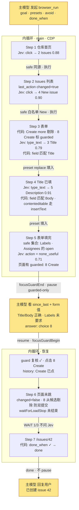

# 用 Jev 加速 browser / computer / device use 的研究

> 状态：browser 线 MVP 已实现（见 10），computer / device 未实现
> 日期：2026-09-18；2026-09-19 按两轮评审修订（见 8.13）并落地 browser 线
> 参考实现：[browser-use/jev-ultrafast](https://github.com/browser-use/jev-ultrafast)（本地路径 `~/Developer/Github/jev-ultrafast`）
> 官方资料：[typesafe-ai skill](https://github.com/typesafe-ai/skills/blob/main/skills/typesafe-ai/SKILL.md)、[docs.typesafe.ai](https://docs.typesafe.ai/llms.txt)（API、primitives、confidence、fan-out、confidence-routing、jev-1.13 jaggedness）
> 适用范围：SuperOne Desktop 的 `browser_*`、`computer_*`、`device_*` agent 工具

## 结论

SuperOne 三条 UI 自动化线的瓶颈不在 observe/act 基础设施，而在**每一个 UI 动作都要经过主模型一整轮**。Jev（TypeSafe 的 System One 模型）能以约 200 ms/步的代价在有限动作空间里做"下一步点哪个"的选择，且 SuperOne 现有的 snapshot 输出（带 ref 的元素表、`stateId` 过期保护、settle 等待、outcome 判断、条件词汇表）已经是 Jev 所需的输入形态。

推荐的接入方式是在现有 observe/act 之上加一个**快速内循环**，按"快思考 / 慢思考"分工：

- **主模型（慢）**：发起时定策略（目标、预设值、允许/禁止的动作、完成条件）；内循环拿不准或只剩受控动作时被问；不再为每一次点击付一轮
- **代码**：持有控制流、历史、新鲜度、风险分类、预算、完成判定；**所有机器可查的判断（加载、完成、变化）都先于 Jev**
- **Jev（快）**：只在代码划定的安全动作集合里做窄选择，永远没有机会自己决定一件不可逆的事

一个 7 步的 GitHub 建 issue 任务：逐步模式 12+ 轮主模型，内循环 **2 轮**（发起 + 1 次受控动作裁定）；主模型预先 `allow` 后可降到 1 轮。

**实施顺序：平台无关内核 → browser（要求 CDP 已开启）→ 阈值校准并钉版 → computer → device。** browser 优先不是因为 adapter 最薄（computer 最薄），而是阈值校准需要 10–20 个可复现任务，公开站点是唯一能低成本攒样本的线（见 7、8.14）。

## 1. Jev 是什么、jev-ultrafast 怎么用它

### 1.1 TypeSafe System One（官方资料要点）

- 一次请求 = 一个 `state`（字符串 / JSON）+ 一组带 id 的 `questions`；所有问题**并行、独立**地评估同一个 state，加问题几乎不加延迟（投机式 fan-out）
- 三种原语：**Choice**（从给定选项选一个，返回选项、全概率分布、confidence）、**Noul**（是/否概率，无 confidence）、**Score**（有序等级）
- 模型只能返回你给的选项，不生成文本；question id 不发给模型，指令要写全；用反引号路径指向 state（`` `elements[3]` ``）
- 限制（官方 models 页）：**64k token 总量；state + 最长一个 question ≤ 32k**；Choice 选项上限 255 在官方页面**未找到出处**，按 jev-ultrafast 的 250 元素截断保守对待；state 里无关内容会导致 context rot
- jev-1.13 jaggedness：字面理解、不会算数/比日期、多跳推理弱、**不把 state 当敌对内容**、不能生成、**相关问题间的结构不变量不保证**（同一请求里几个 Noul 可以同时为高，代码要定优先序）
- 置信度按风险分级（confidence-routing）：官方给的是 **universal floor 0.6**，低于 0.6 一律交人；高风险要 >0.85 或人工确认；阈值调好后钉死版本号（`jev-1.13.0`，jev-ultrafast 的 performance.md 用的就是这个版本）
- 价格 $0.042/Mtok 输入，输出免费；1200 rpm。JS SDK `@typesafe-ai/sdk`（Node 20+，自带 retry/429 backoff、答案类型推导）
- 官方定位："AI-powered software, not agents"——code owns control flow，模型只做窄判断

### 1.2 jev-ultrafast 的循环

```
observe（一次 Runtime.evaluate 跑 snapshot.js）
  → 只取视口内、可见、未禁用的控件，≤ 250 个；视口内文本 ≤ 6000 字符
  → 每个可编辑字段额外生成一个 "Open <label>" 点击候选（打开 combobox / 弹出建议）
  → 每个 <select> 的每个未选中 option 各一个 select 候选（"label → option"）
  → 附带 marker（整页语义）、page_key（表单状态）、guards[node]（目标元素 + 所在 form/dialog/row 文本）
predict（一次 POST /v1/systemone）
  → operation ∈ {CLICK, TYPE_TEXT, SELECT, SCROLL_UP/DOWN, WAIT, DONE, BLOCKED}
  → click_target / type_text_target / select_target（投机 fan-out，只消费被选中操作的头）
act
  → 执行前 fresh() 复核：有目标元素时比 [page_key, guards[node]]，否则比 marker
     —— 作用域化的新鲜度：目标所在 form/dialog/row 没变就算 fresh，允许页面无关区域变化
  → 索引映射回 WeakMap 保存的真实 DOM 节点，重算几何、遮挡检测
  → CDP 输入；先记 history 再 observe；连续 3 步 page_changed=false 且 kind≠wait 即 blocked
TYPE_TEXT 的文本由一个小 LLM（Mercury）根据 goal + 字段 + 页面文本生成
```

测得（`docs/performance.md`，Google Flights）：**17 次 Jev 请求、10 个动作 + 1 次 WAIT**，中位 178 ms/请求，共 7.07 s（含两次文本生成 ≈ 0.9 s 和 Google 结果加载）。17 vs 11 意味着约 **35% 的决策因 stale 被丢弃重做**；90,558 输入 token / 17 ≈ **5.3k token/请求**。

### 1.3 jev-ultrafast 与官方指导的差距

| 官方指导 | jev-ultrafast | 本方案 |
| --- | --- | --- |
| 三种原语 | 只用 Choice | Noul 做元判断（完成 / 加载中），但只在机器信号之后兜底 |
| 拆原子问题 | `operation` 一个 Choice 混了动作与 DONE/WAIT/BLOCKED | 元判断拆出来 |
| Select instead of generate | TYPE_TEXT 用生成模型 | 主模型预设候选值，代码/Jev 只做"哪个预设属于哪个字段" |
| 历史由代码持有，state 只放观察事实 | `recent_actions` 10 条进 state | 只留 `last_action` 一条；去重、防双提交、WAIT 预算全在代码 |
| 置信度按风险分级 | 无阈值 | 风险分类在代码，Jev 只在安全集合里选；floor 0.6 |
| state 过滤 | 已是视口内 + 6k 文本，上限 250 元素 | 收紧到 ≤ 60 元素、≤ 4k 文本，按 32k 总预算校验 |
| 钉版本、用 SDK | 钉 `jev-1.13.0`、手写 httpx | 同样钉版；`@typesafe-ai/sdk` |

保留不改的部分：作用域化 `guard`、"Open <label>" 候选、"先记 history 再 observe"、blocked 计数排除 WAIT。

## 2. SuperOne 现状

三条线的执行模式一致：主模型 → `*_snapshot`（TOON 表）→ 主模型思考 → `*_act(ref)` → 再 snapshot。每步一次主模型往返（3–10 s），上下文随步数线性增长。

| 线 | 执行路径 | Observe 输出 | Act 定位 | 新鲜度 | 变化判断 |
| --- | --- | --- | --- | --- | --- |
| browser | **默认 main → renderer IPC → webview `executeJavaScript`**，单次 30 s 超时（`browser-automation-bridge.ts`）；`AppSettings.cdpEnabled` 开启后 main 可直接 `webContents.debugger`（`browser-cdp.ts`） | `snapshot(elements)` → `{selector, role, name, enabled, inViewport}`，按视口中心距离排序，默认 40 个（`browser-automation-runtime.ts` `HELPERS.ref`） | CSS selector / text / x,y | 无 | 无；有 `waitForLoadStop` |
| computer | main 内 helper 进程 | TOON `outline{ref,depth,role,name,value,x,y,w,h,can,state}`，`can` = `press\|setText\|typeText\|scroll\|focus`（`computer-use/outline-toon.ts`） | `@eN` ref；`delivery=semantic\|app-directed\|physical`；**1–20 个动作一个事务 + `expect` 后置条件**（`tools.ts`） | `stateId` 过期即拒绝 | outcome `worked\|didnt\|unknown`（`outcome.ts`） |
| device | main 内 backend | `DeviceUiNode` 树 + ref + `stateId`，backend settle（`device/settle.ts`） | ref → uid / native handle；tap / setText / swipe | **`requireCurrent`：任何新 snapshot 都让旧 `stateId` 失效**（`state-store.ts`） | 树 diff + `frameHash` |

已有、本方案直接复用的原语：

- **条件词汇表**：computer `conditionSchema`（`exists / notExists / textEquals / textContains / valueEquals`）、device `DeviceCondition`（同名四种 + target），注释明说"一套词汇表，别让 agent 学两套"
- **用户面向确认**：computer `ensureComputerUseAppGrant`（按 bundleId、session/always）、device `control-confirm.ts`，都走 `HostConfirmRegistry`，signal 联动已现成
- **focus guard**：browser `focusGuardBegin / focusGuardEnd`
- **`description` 字段**：computer/browser 工具强制 1–160 字，供 UI 展示
- **错误码**：computer act 会抛 `MODAL_BLOCKED`、`STALE_STATE`、`TIER_BLOCKED`（tier=click 时 setText/typeText 被拒）

与本方案的缺口：

| 线 | 缺口 |
| --- | --- |
| browser | 没有域级权限模型；`HELPERS.ref` 缺 `value / checked / expanded`；靠 CSS selector 定位；没有作用域化新鲜度；`typeScript` 的 value setter 对 `contenteditable` 无效；执行后无变化判断 |
| computer | 几乎零缺口。`can` 列直接映射动作分组；`stateId` 即 stale；outcome / `expect` 即 `changed_page` |
| device | tap / setText / swipe 映射即可；`treeUnavailable` 的屏幕不能交给 Jev；挂起期间不能依赖 `stateId` 短路 |

## 3. 设计

### 3.1 三方分工

```
主模型（System 2）   发起：goal、presets、done_when（可选）、description
                     被问：Jev 拿不准 / 只剩受控动作 / 没进展 / 预算到
代码                 控制流、动作空间构造与风险分类、历史与去重、新鲜度、预算、完成判定、执行、中止
Jev（System 1）      每步一次请求：在安全动作集合里选下一步；预设值属于哪个字段（后置）；元判断兜底
用户                 受控动作里的高危档、切换 app / 设备的 grant、密码字段
```

### 3.2 工具契约

每条线一个 goal 级工具（`browser_run` / `computer_run` / `device_run`），发起与恢复共用：

```ts
browser_run(
  | {                                   // 发起
      description: string,              // 1–160 字，给用户看的（与现有工具一致）
      goal: string,
      tab?: string,
      presets?: Array<{ key: string; value: string; field?: string }>,   // 预设的字段值；field 是字段提示
      done_when?: Condition,            // 可选加速器：复用现有 conditionSchema；browser 额外支持 urlMatches（8.15）
      maxSteps?: number,                // 默认 30
      maxWallMs?: number,               // 默认取当前 harness 工具超时的 60%，到点 pause(budget)
    }
  | { runId: string, answer: Answer }   // 恢复
)
→ {
  status: 'paused' | 'done' | 'aborted',
  runId?: string,
  question?: Question,                  // paused 时
  since_last: string[],                 // 上次返回以来每步一行："Type presets.Title → [3] Title"
  snapshot: <与 browser_snapshot 相同的元素表 + 可视文本 + url>,
  elapsed_ms: number,
}
```

`computer_run` / `device_run` 除定位参数（`root` / `device`）外相同。

- `Condition` 不新造类型：直接用 computer 的 `conditionSchema` / device 的 `DeviceCondition`，browser 加 `{ kind: 'urlMatches', pattern }`
- `maxWallMs` 是硬约束：Claude SDK `MCP_TOOL_TIMEOUT`、Codex `tool_timeout_sec` 都是 per-call 墙钟，内循环必须在超时前主动 pause 返回 `runId`
- 密码类字段永不参与 presets；遇到 password 输入框见 3.5
- 没有 `allow` / `avoid`：主模型派活时看不到页面，让它预判哪些按钮可按等于让它代劳；风险和完成都在现场由 Jev 判断（8.15）
- 工具 description 里要写清路由：**多步、目标明确、动作以点击/填表为主** → `*_run`；单步、需要像素判断、drag/hover/上传/组合键 → 现有 `*_snapshot` / `*_act`

### 3.3 协作协议：pause / resume

内循环是可挂起的协程。三个原语，与触发场景无关：

```
pause(question)   内循环交出一个自己无法裁定的决策
resume(answer)    上层作答，可附带修正 goal 或中止
trace             每次返回携带 since_last + snapshot
```

`Question` 只有两种形状，与 TypeSafe 的 question 一致，上层不需要知道内循环为什么问：

```ts
interface Question {
  id: string
  type: 'choice' | 'value'
  options?: Array<{ key: string; label: string; probability?: number }>   // choice：永远是索引/枚举，不是 selector
  schema?: JsonSchema                                                     // value：如 { text: string }
  context: Record<string, unknown>   // 回答者需要的一切：目标元素、所在 form 的字段与值、Jev 的概率分布、why
  reason: 'uncertain' | 'guarded-only' | 'no-progress' | 'budget' | 'grant' | 'secret'
  audience: 'model' | 'user'
}

interface Answer {
  questionId: string
  choice?: string
  value?: unknown
  goal?: string      // 任意时刻可修正
  abort?: true       // 任意时刻可中止，主模型接管
}
```

**`audience: 'user'` 的产生路径**（不是预留字段，有明确触发）：

| 触发 | 走的现有 UI |
| --- | --- |
| guarded 高危档（pay / delete / send 类关键词，或 `avoid` 命中） | 现有 permission_request（`HostConfirmRegistry`） |
| computer 线 Jev 点击后切到未授权 app / 窗口 | `ensureComputerUseAppGrant` |
| device 线需要重新拿控制权 | `control-confirm.ts` |
| password 字段 | 现有 secret 输入 UI，值不回传给内循环也不进 trace |

`audience: 'model'` 的 pause 走 tool result；`audience: 'user'` 的 pause 由内循环直接 raise 到 host confirm，用户答完内循环继续，不经过主模型。

**挂起时给主模型的上下文**按"它此刻若在逐步操作能看到的一切 + Jev 在想什么"的标准：完整 snapshot（元素带 value）、可视文本、url、目标元素及所在 form 的其他字段与值、Jev 本步的全部概率分布、`since_last`。挂起不锁定 tab / root / device：主模型可以直接用现有 `browser_query` / `computer_query` 等读工具往下挖；若它用写工具改了页面，恢复时新鲜度复核会发现并重新观察。

**恢复时的一致性**：

- browser / computer：先复核新鲜度；变了就重新 observe + predict；只有当 **新决策与挂起时的 (node, kind, label, 输入文本) 完全相同** 才复用答案（对齐 jev-ultrafast `pending_text` 的复用条件），否则丢弃
- device：`requireCurrent` 让任何一次 `device_snapshot` 都使旧 `stateId` 失效，主模型在挂起期间读一次屏就会让短路失效，所以 **device 恢复时无条件 re-observe**（一次 settle ≈ 250 ms），不做新鲜度短路
- **guarded 动作已执行的记录优先于复用规则**：主模型答 Create → 点击已发出 → 页面未跳 → 复核发现变化 → re-predict 又指向 Create，此时 history 里"Create 已点、页面未变"的记录直接剔除该候选，不复用答案（防双提交，见 3.5）

挂起的 run 有 TTL（5 min）；**绑定 `toolUseId`（发起它的那次工具调用）而不是 session**——同一 session 里 Task 子代理可能并行调用，按 session 唯一会互踢；过期释放归属。

为什么不用别的机制：主进程内小模型没有对话/文件/memory 上下文；MCP sampling SuperOne host 未实现且各 harness 支持不一；MCP elicitation 面向用户且 Codex 自动接受。tool result 挂起 + `runId` 恢复只依赖所有 harness 都有的"工具返回 → 再调工具"。

### 3.4 每步一次 Jev 请求

**state（代码构造，只放观察事实）**

```json
{
  "goal": "…",
  "page": { "url": "…", "title": "…", "text": "<视口内文本，≤ 4k 字符>" },
  "elements": [ { "index": "3", "role": "textbox", "label": "Title", "value": "" }, … ],
  "presets": [ { "key": "Title", "hint": "…前 80 字符" }, { "key": "Body", "field": "the issue description editor" } ],
  "last_action": { "label": "Click New issue", "changed_page": true }
}
```

- `elements` 只含视口内可交互元素，≤ 60 个，带 `value / checked / expanded`；受控元素（见 3.5）也在表里，Jev 能看到但不可选；每个可编辑字段附带一个 `open` 候选（打开 combobox）
- `presets` 只给 key、提示、摘要；完整正文由代码在执行时填入
- `last_action` 只一条，是 Jev 观察不到的事实（上一步有没有效果）；完整 history 由代码持有
- 构造后按官方预算校验（state + 最长 question ≤ 32k，state + 全部 questions ≤ 64k），超了先砍文本再砍元素

**questions（一次 fan-out）**

```ts
{
  // 元判断（Noul，各自独立；只在机器信号缺席时兜底，见 3.6）
  goal_satisfied: noul("Is every requirement in `goal` visibly satisfied by `page` and `elements`?"),
  still_loading:  noul("Should the next step wait for `page` to update instead of acting: is the control `goal` needs next absent or disabled, or are submitted results or suggestions still arriving?"),  // 8.16

  // 动作（Choice）——候选只含安全元素
  action:           choice("Which single action best advances `goal` from the current `page`?",
                           { click, type_text, scroll_down, scroll_up, none_useful }),
  click_target:     choice(…, { "1": {...}, "2": {...}, "open:3": {...}, …, none_of_these }),
  type_text_target: choice(…, { "3": {...}, "5": {...}, none_of_these }),

  // 预设值匹配：每个 preset 一个问题（不是每个输入框一个）
  field_for_Title: choice("Which element in `elements` is the field that `presets[0]` belongs in?", { "3", "5", none }),
  field_for_Body:  choice(…, { "3", "5", none }),
}
```

约 3–5k token（按 jev-ultrafast 实测 5.3k/请求估，不按 2–4k）；代码只消费被选中动作对应的 target 头和 field 头。

**MVP 不做的问题**：`select`（选项候选会撞上限，且现有 `selectScript` 已能按 label 选，交主模型）、`obstructed`（cookie banner / login wall 由 guarded 集合 + no-progress 兜住）、`field_for_*` 先用代码按 `presets[].field` 与元素 label 匹配，匹配不上 pause，Jev 匹配后置。

### 3.5 动作空间构造（代码）

**页面上每个可操作元素都是候选**；代码不做风险分类，只做两件事：

```
剔除    ←  password / secure 字段（永不进任何候选：没有 preset 可填，点它也无意义）
        ←  disabled；adapter 标记 clickable=false 的纯文本
候选    ←  其余全部：链接（含跨域）、按钮（含 submit）、tab / menuitem / 行、可编辑字段本身及其 open 候选
        ←  已填写字段的 `submit:N`（按 Enter 提交）——npm、GitHub 的搜索框靠这个
历史    ←  上次页面变化以来，`(node, kind)` 执行后 changed_page=false → 本步剔除该候选；页面一变即重置
```

- 风险由 Jev 对**它选中的那一步**回答 `next_step_risk`（3.4），代码按阈值决定是否 pause；不再有 safe / guarded、`HIGH_RISK_LABEL`、`NAV_LABEL`、origin 集合这些标签规则（8.15）
- 剩下的硬边界只有权限边界：切到未授权 app（computer）、设备控制权（device）——这不是风险判断，是 grant

### 3.6 每步的代码决策

机器信号先于 Jev：

```
observe 之后、问 Jev 之前：
0a. 平台加载信号（browser waitForLoadStop / computer、device settle）未结束 → WAIT（不问 Jev）；连续 WAIT ≤ 3
0b. done_when 成立                                → done（不问 Jev、不 pause）
0c. 平台错误：MODAL_BLOCKED → 当作页面存在 guarded 弹窗，走 3；STALE_STATE → re-observe；treeUnavailable → pause(no-progress)

answers 回来后，按顺序：
1. still_loading ≥ 0.7 且平台无加载信号           → WAIT：等页面相对 Jev 看到的那份 marker 发生变化，事件驱动、提前返回；上限按连续次数递增 1 / 2 / 4 s；连续 WAIT ≤ 3，之后必须选动作（8.16）
2. goal_satisfied ≥ 0.7 且 done_when 未给        → 候选完成：settle 后重新观察再问一次，仍 ≥ 0.7 → done（8.15；Wikipedia 完成页 0.82，之前各页 ≤ 0.09）
   done_when 已给                                → 由 0b 决定，goal_satisfied 只记录
3. action = none_useful（或 target = none_of_these）
     且 click_target 对某候选 ≥ 0.8              → 按 click 处理（action 头在一屏相似项前会整体放弃，target 头仍能挑出那一行）
     否则                                        → 可下滚且本页未滚过 → scroll；否则 pause(no-progress, choice = 候选 ≤ 24 + abort)
4. target 置信度 < 阈值（读取类 0.6 / 写入类 0.7） → pause(reason: uncertain, choice = Jev 的 top-k)
4b. next_step_risk ≥ 0.5                         → pause(reason: risky, choice = 该步 + top-k 替代 + abort)；主模型答该步的 key 即执行
5. action = type_text：
     代码按 presets[].field 匹配到 preset       → 用 preset 正文 replace 输入（不 append）
     否则                                        → pause(reason: uncertain, value{text}，context 含 presets 和候选概率)
6. 执行前新鲜度复核；执行；先记 history 再 observe；computer 线用 expect: valueEquals 校验 type_text
7. 连续 3 步 changed_page=false 且 kind≠wait / maxSteps / maxWallMs 到 → pause(no-progress / budget)
```

同一请求内几个 Noul 同时为高时优先序：`still_loading > goal_satisfied`，且都排在机器信号之后。

阈值是起点（读取类不低于官方 floor 0.6），必须用真实任务的 `trace` 数据校准后钉死模型版本。

### 3.7 各平台 adapter

**browser**（改动最多；**前置条件：`cdpEnabled` 已开启**，否则不注册 `browser_run`）：

- 循环在 main，通过 `webContents.debugger` 直接 `Runtime.evaluate` / `Input.*`，不走 renderer IPC 的 30 s 单次超时
- 移植 `snapshot.js`：WeakMap 节点身份挂到 `window.__sone`，执行按 node id 取回真实节点；`page_key / guards[node] / marker` 作用域化新鲜度（目标所在 form/dialog/row 没变就算 fresh）；"Open <label>" 候选；视口内文本
- `HELPERS.ref` 补 `value / checked / expanded / readOnly`；`contenteditable` 元素按 `innerText` 取 value，输入走 CDP `Input.insertText`（先 select-all），不用现有 `typeScript` 的 value setter 路径
- `type_text` 语义固定为 **replace**
- 观察 + 复核 + 执行 + 等待 + 再观察合并成一个 `step` 调用，一次往返
- CDP 输入绕过 renderer 的 focus isolation：`focusGuardBegin` 在 run 开始，`focusGuardEnd` 在每次 pause 前、resume 时再 `Begin`（8.12 第一条已定）
- 执行后 combobox 200 ms / 其他 50 ms 的 rAF 等待

**computer**：`can` 含 `press` → click 候选；含 `setText`/`typeText` → type_text（tier=click 时构造期剔除）；含 `scroll` → scroll；`state` 含 `disabled` 剔除。执行 `delivery=semantic`。多个高置信 preset 填入可打包成一个 `computer_act` 事务，`expect: valueEquals` 做后置校验。`stateId` 即新鲜度；`outcome.worked` / `expect` 即 `changed_page`。app / 窗口切换触发 `ensureComputerUseAppGrant` → pause(grant, audience: user)。

**device**：有 `bounds` 且可点 → click（tap 中心）；输入类 → type_text（`setText`）；scroll → swipe。`settle.ts` 覆盖等待。`treeUnavailable` → pause(no-progress)。恢复时无条件 re-observe。

### 3.8 中止与生命周期

- 工具调用的 `extra.signal` 贯穿整个 loop：Jev 请求、执行、等待都 `race` 它（不能只在循环头检查）
- abort 来源：用户 UI 停止、harness 中止工具、主模型 `answer.abort`、TTL 到期
- abort 时：取消 in-flight Jev 请求；已发出的 act 不回滚，但记进 history 和 trace；释放 focus guard / grant；run 置 `aborted`
- 用户可见性：每步通过 host event 推进度（复用 record-action / permission 事件形态），ToolBlock 与移动端事件裁剪豁免要两面登记（见 superone-tool skill）

### 3.9 trace

阈值校准、UI 进度、pause 原因分布都依赖 trace，先定 schema：

```ts
interface TraceStep {
  runId: string; step: number; platform: 'browser' | 'computer' | 'device'
  stateHash: string              // 便于 record/replay 对齐
  elements: number; textChars: number; requestTokens: number
  answers: Record<string, { choice?: string; probabilities?: Record<string, number>; confidence?: number; probability?: number }>
  model: string                  // 响应里的实际模型版本
  latencyMs: { jev: number; act: number; settle: number }
  decision: { rule: number; action?: string; target?: string; reason?: string }   // 3.6 的哪一条
  changedPage: boolean | null
  stale: boolean                 // 决策是否因新鲜度丢弃
}
```

存主进程 `userData/jev-traces/<runId>.jsonl`；密码值、secret 答案永不入 trace。

### 3.10 代码位置

`apps/desktop/src/main/jev/`：

| 文件 | 职责 |
| --- | --- |
| `action-space.ts` | 三平台 adapter：snapshot → elements + safe/guarded 白名单分类 + origin 集合 + 历史规则 |
| `questions.ts` | 3.4 的问题集合构造；预算校验在 client |
| `typesafe-client.ts` | 直接 `fetch` `/v1/systemone`（不引 SDK：只需一种调用形状 + AbortSignal + 严格校验）、答案校验（choice ∈ 候选、概率合法）、模型钉版 |
| `policy.ts` | 3.6 的决策表与阈值 |
| `loop.ts` | observe → 机器判定 → ask → decide → act 循环，pause / resume，AbortSignal |
| `run-store.ts` | 挂起的 run：`runId` → 状态、`toolUseId` 归属、TTL |
| `trace.ts` | 3.9 |
| `mcp/jev-run-tools.ts` | 注册 `*_run`；无 TypeSafe key 不注册；`browser_run` 额外要求 CDP 开启 |

TypeSafe key 存主进程 settings。

## 4. 例子：GitHub 建 issue

用户：「去 GitHub 给 browser-use/jev-ultrafast 提个 issue，标题 "Add Electron webview adapter"，正文用你刚才那段总结。」

```
browser_run({
  description: "在 GitHub 上给 jev-ultrafast 创建 issue",
  goal: "Create a new issue in browser-use/jev-ultrafast. Stop when the created issue page is visible.",
  tab: "t3",
  presets: [ { key: "Title", value: "Add Electron webview adapter", field: "the title textbox" },
             { key: "Body",  value: "## Summary\n…", field: "the issue description editor" } ],
  done_when: { kind: "urlMatches", pattern: "/issues/\\d+$" },
  avoid: ["Create more"]
})
```



主模型 2 轮：发起、裁定 Create。若发起时 `allow: ["Create"]`，Step 5 Jev 直接点，主模型 1 轮。注意 GitHub 新版 issue 正文是 `contenteditable` Markdown 编辑器，不是 textarea，这正是 3.7 要求 `insertText` 路径的原因。

Step 5 返回给主模型的内容：

```json
{
  "status": "paused", "runId": "r7",
  "question": {
    "id": "q1", "type": "choice", "reason": "guarded-only", "audience": "model",
    "options": [ { "key": "8", "label": "button Create" }, { "key": "abort", "label": "Stop; hand control back" } ],
    "context": {
      "why": "No safe action advances the goal; guarded elements remain",
      "form": [ { "label": "Title", "value": "Add Electron webview adapter" },
                { "label": "Add a description", "value": "## Summary…" },
                { "label": "Assignees", "value": "" }, { "label": "Labels", "value": "" } ],
      "decision": { "action": { "none_useful": 0.71, "click": 0.22, "…": "…" }, "goal_satisfied": 0.12 }
    }
  },
  "since_last": [ "Click [2] Issues", "Click [4] New issue",
                  "Type presets.Title → [3] Title", "Type presets.Body → [5] Add a description" ],
  "snapshot": "<元素表 + 可视文本 + url>"
}
```

## 5. 风险与边界

| 风险 | 处理 |
| --- | --- |
| Jev 只做选择，不能看像素：canvas、无 AX 的 app、无 tree 的手机屏幕 | pause(no-progress)，主模型接管 |
| 页面文本注入（Jev 不把 state 当敌对内容） | safe 白名单 + origin 集合：Jev 选不到 guarded / 跨域；avoid；主模型在 pause 和最终结果上把关 |
| 代码分类错：把危险动作放进 safe | 白名单默认拒绝；导航类 label 白名单是唯一放行口，集中维护并在 trace 里记每次 safe 点击的 label 供审计 |
| 挂起期间页面变化 | 作用域化 guard 复核，完全同决策才复用答案；device 无条件 re-observe |
| 双提交 | "guarded 已点、页面未变"记录优先于答案复用 |
| harness 工具超时 | `maxWallMs` 到点主动 pause(budget) 返回 runId |
| 挂起过多抵消收益 | 阈值集中可调；presets / allow 减少 pause；trace 里记录每次 pause 的 reason 分布 |
| 动作集有限：click / type_text / scroll / wait | select、drag、组合键、上传、hover 仍走主模型现有工具（见 9） |
| 外部依赖 TypeSafe；browser 依赖 CDP 开关 | 无 key / 离线 / CDP 关闭时不注册对应 `*_run` |
| 阈值随模型版本漂移 | 钉 `jev-1.13.0`；trace 记录响应 `model` |
| 循环失控 | `maxSteps`、`maxWallMs`、连续 WAIT ≤ 3、连续无变化 3 步即 pause |
| 多 session / 子代理并发 | run 绑定 `toolUseId` + tab / root / device，复用现有 driver 归属 |
| 中止 | AbortSignal 贯穿；已发出的 act 不回滚但入 trace |
| 用户可见性 | 每步 host event；pause 原因可见；允许中止 |

## 6. 预期收益

| | 逐步模式 | 内循环 |
| --- | --- | --- |
| 主模型轮次（7 步 issue 任务） | 12+ | 2（allow 后 1） |
| 每步耗时 | 3–10 s | ≈ 0.2 Jev + 0.1 执行 + 0.05–0.2 等待；stale 重做按 ~35% 估 |
| 总耗时 | ~50 s | ~4–6 s + 每次 pause 一轮主模型 |
| 主模型输入 | 每步一份 TOON 快照累积（7 × ~3k） | pause 时一份完整 snapshot + since_last（1–2 × ~4k）+ 发起 |
| Jev 成本 | — | ~5k token/步 ≈ $0.0002；30 步 < 1 分钱 |

收益来源是"大部分步骤是安全的点击"。表单密集型任务靠 presets；提交密集型任务靠 allow。

## 7. 验证路径

1. **平台无关内核**：`typesafe-client`（钉版、32k 预算、答案校验、**record/replay**——jev-ultrafast 的 `docs/*measurement.json` 不含 request/answers，不能直接当 fixture，要自建）+ `loop` / `policy` / `run-store` / `trace`。用录制的 snapshot fixture 离线跑通决策表和 pause/resume/abort
2. **browser 线**（CDP 开启）：移植 `snapshot.js` 的节点身份、scoped guard、open 候选；补 `value/checked`；`contenteditable` 输入。用 GitHub issue / Google Flights / Wikipedia 对比逐步模式
3. **阈值校准**：10–20 个公开站点真实任务的 trace，定读取/写入阈值和 field 匹配阈值，钉版本
4. **computer 线**：复用 outline；接 grant / MODAL_BLOCKED / TIER 映射；事务 + `expect`
5. device 线：无条件 re-observe

## 8. 讨论与决策记录

以下是讨论中依次做出的决定及理由，按时间顺序。设计章节反映最终结果；这一节保留"为什么"，方便以后重新评估。

### 8.1 Jev 不操作浏览器，只做选择题

jev-ultrafast 里 Jev 的输入是索引化的元素表，输出是索引；操作浏览器的是 Python 侧的 CDP 代码。`TYPE_TEXT` 被拆成两步：Jev 选"要不要输、往哪输"，另一个小 LLM 生成"输什么"。这决定了 Jev 在 SuperOne 里的定位：**不是替换现有工具，而是在现有 observe/act 之上加一个快速内循环**。

### 8.2 主模型不能只做发起和验证

最初的方案是主模型发起 → 内循环自主跑完 → 主模型验证。否决原因：`TYPE_TEXT` 要输什么只有主模型知道（来自对话历史、文件、memory），jev-ultrafast 的小模型方案在 SuperOne 里不成立。因此需要一个内循环与主模型的联动机制。

评估过的联动机制：

| 机制 | 结论 |
| --- | --- |
| 主进程内小模型生成文本 | 没有对话上下文，只能做可选加速，不能做默认 |
| MCP sampling | SuperOne host 未实现；各 harness 支持度不一 |
| MCP elicitation | 面向用户；Codex 自动接受 |
| **tool result 挂起 + `runId` 恢复** | 只依赖所有 harness 都有的"工具返回 → 再调工具"；采用 |

### 8.3 协作协议要通用，不枚举场景

第一版定义了 `text / choose / verify / stuck / budget` 五种 `ask.kind`。否决：太具体，每加一个场景就要改契约。改为：问题只有 `choice` / `value` 两种形状（与 TypeSafe 的 question 一致），`reason` 和 `context` 描述为什么问；**什么时候 pause 是策略，不是协议**，策略集中在 `policy.ts`。

### 8.4 挂起时给主模型的上下文要充分

第一版只给字段摘录。改为按"主模型若在逐步操作此刻能看到的一切 + Jev 在想什么"的标准：完整 snapshot（元素带 value）、可视文本、目标元素所在 form 的其他字段与值、Jev 的概率分布、执行增量。理由：pause 次数少，每次可以给得慷慨；总量仍远低于逐步模式的快照累积。同时明确**挂起不锁定资源**，主模型可以直接用现有读工具往下挖，不需要在协议里再造"请求更多信息"。

### 8.5 发起时预先提供信息以减少中断

主模型发起时可以给 `presets`（字段值）、`done_when`（机器可查的完成条件）、`avoid` / `allow`（动作白黑名单）。对内统一编译成"预先写好的答案"：内循环在 pause 前先查有没有匹配的预设。猜错的后果只是回到 pause，没有损失。

### 8.6 按官方指导重新设计 Jev 请求

读了 typesafe-ai skill 和官方文档后的调整（详见 1.3）：

- DONE / WAIT / BLOCKED 从 `operation` Choice 拆成独立 Noul
- `presets` 的匹配从字符串比对改为语义匹配，投机式地和动作选择放在同一请求（MVP 先代码匹配，见 8.13）
- 每个 target 头加 `none_of_these`
- state 过滤：视口内、≤ 60 元素、≤ 4k 文本；反引号路径引用
- 用 `@typesafe-ai/sdk`，钉 `jev-1.13.0`

### 8.7 从仅保留 `last_action` 到有界 `completed_actions`

jev-ultrafast 把最近 10 步放进 state，用途是防重复、判断上一步有没有效果、WAIT 计数。按官方"历史由代码持有，state 只放观察事实"的指导，逐项检查后：防重复和 WAIT 预算都是确定性规则，移到代码；"上一步有没有效果"是 Jev 观察不到的事实，值得保留，但只需一条。jev-ultrafast 里那句 "Recent WAIT actions are not evidence of loading" 本身就是历史进 state 导致过度解读的症状。

2026-09-19 desktop diagnostic revision: a Calculator task reproducibly selected Equals at step 3 despite observing `12` and being given the exact sequence. One controlled diagnostic added only `completed_actions`, the last eight executed action labels with transient indices removed. With `["Click 1", "Click 2"]`, the same step chose digit 3 at 0.99; all seven observed actions followed the intended sequence (`rce269e87`, versus `r407e1325` without history). Retain this bounded field alongside `last_action`. Waiting, failed dispatches and future plans are excluded; the list survives budget pauses. Code still owns risk, retries, loading budgets and completion checks. This single diagnostic supports the state change, not a general performance claim or a reason to route known sequences away from batching.

### 8.8 `steps` 改为 `since_last`

pause 时主模型需要知道从上次返回以来内循环做了什么（尤其是预设值填进了哪个字段），但不需要每步概率和累积全量历史。改为每步一行的增量；概率、延迟、模型版本进 trace 日志给 UI 和调参用。

### 8.9 风险判断不交给 Jev（已被 8.15 推翻）

第一版设计了 `risky_N` Noul 让 Jev 判断每个点击候选是否不可逆。否决：按快慢思考的逻辑，"这个动作要不要认真想"本身就是 System 2 的判断，不能让 System 1 决定 System 2 该不该介入。改为代码分类 `safe | guarded`，Jev 只在 safe 集合里选；Jev 答 `none_useful` 且页面有 guarded 元素 → pause 交主模型裁定；主模型可用 `allow` 预先放行。这样也顺带解决了"图标按钮 Jev 判不了"的问题——不认识的一律 guarded。

实测推翻了这条（见 8.15）：白名单在桌面上等于"每个任务把要按的键抄进 allow"，主模型派活时根本没有这些信息。

### 8.10 预设匹配不确定时 pause，不降级

场景：Jev 选了往某字段输入，但对哪个 preset 属于它只有 0.61。两个选项：pause 问主模型，或当作没匹配上让 Jev 换动作（赌下一步会更确定）。决定 pause：Jev 拿不准就是需要慢思考；填错字段虽可逆，但主模型多一轮成本很低。附带措施：`presets[].field` 让主模型给字段提示，降低这种情况的发生率。

### 8.11 完成判定：机器条件优先（已被 8.15 修订）

`done_when` 成立即 done，`goal_satisfied` 只是佐证；Jev 说满足但机器条件不成立或未给 → pause。理由：AGENTS.md 原则 "DONE 不是证据"，机器条件比 Jev 的判断硬。

修订：`done_when` 仍然优先，但它是可选的；没给时 Jev 的判定（重观察确认后）直接结束 run，不再 pause 问主模型。

### 8.12 原待定项（已定）

- 挂起期间 tab 的 focus guard：**必须释放**——CDP 输入绕过 renderer 的 focus isolation，guard 不释放用户在 pause 期间无法操作该 tab；pause 前 `End`，resume 时 `Begin`
- `no-progress` 时：把当前动作空间（含 guarded）作为 choice 返回，主模型可直接点一步，也可 abort 自己逐步走。两者不冲突，主模型按 context 决定
- 阈值：起点按官方 floor 0.6，校准后钉

### 8.13 2026-09-19 两轮评审的修订

第一轮（Opus）对照 SuperOne 代码，第二轮（Fable）对照 jev-ultrafast 源码与 TypeSafe 官方文档。逐条结论：

| 修订 | 理由 |
| --- | --- |
| 事实：floor 0.6、255 未证实、Noul 间无结构不变量；token 预算 64k/32k 经 models 页复核**维持原文**（第二轮评审说"32k 共享"是错的） | 对照官方页面；原文 0.5 无出处 |
| 事实：snapshot.js 本就视口内 + 6k 文本；`fresh()` 是作用域化 guard 不是指纹；17 请求 / 11 动作；5.3k tok/请求；open 候选；blocked 排除 WAIT | 对照 `snapshot.js:44-104`、`browser.py:90-98`、`agent.py:153-158`、`performance.md`。原 1.3 把"改进"建立在错误刻画上；scoped guard 是要移植的核心，原 3.7 一笔带过 |
| browser 循环前置条件：CDP 开启 | 默认路径是 renderer IPC + 30 s 单次超时，"main 内循环 + 0.1 s 执行"只在 CDP 下成立 |
| `maxWallMs` | harness 工具超时是 per-call 硬墙钟，pause 是唯一逃生口 |
| `done_when` 复用 conditionSchema / DeviceCondition | 已有一套词汇表，不造第二套 |
| safe 由黑名单改白名单 + origin 集合 | 原黑名单让 "Close issue"、checkbox、跨域链接落进 safe，与 8.9 "不认识一律 guarded" 矛盾；跨域是注入防线 |
| `audience: 'user'` 接上 grant / control confirm / secret | 原先定义了但无产生路径；computer 一次点击切 app 就要 grant，这是天然触发 |
| 机器信号先于 Jev（加载、完成、变化） | 原 3.6 先信 `still_loading` Noul，与 8.11 自己的原则矛盾 |
| 答案复用条件收紧 + guarded 已执行优先 | 原"同 node+label 复用"与防双提交冲突，是唯一会造成不可逆后果的漏洞 |
| device 恢复无条件 re-observe | `requireCurrent` 让挂起期间任何 snapshot 都使 run 失效 |
| run 绑定 `toolUseId` | 同 session 子代理并行会互踢 |
| `field_for_<preset>` 反向；MVP 先代码匹配 | 每输入框一问在大表单膨胀；参考实现没有此问题，属新增，后置 |
| MVP 去掉 select / obstructed / allow 之外的复杂度 | 先拿到可校准的最小闭环 |
| `type_text` = replace；contenteditable 走 insertText | 原文未定义；GitHub 例子正好踩到 |
| 加 `description`、host event 进度、AbortSignal、trace schema | 与现有工具契约对齐；校准依赖 trace |
| 顺序改为 browser 先 | 见 8.14 |

### 8.14 为什么 browser 先于 computer

原文按"落地难度"把 computer 排第一：adapter 最薄、`stateId` / outcome 现成。评审指出"落地容易"≠"能校准"：阈值必须用 10–20 个可复现任务的 trace 钉死，browser 用公开站点即可，computer 受 macOS + 功能开关 + 逐 app grant 限制，样本难攒且不可复现。内核做成平台无关后，adapter 顺序只影响谁先拿到校准数据，所以 browser 先。

### 8.15 2026-09-19 范式修订：派活与判断分开（browser 先行）

Finder 与 Calculator 两组 desktop 实测（10.4）暴露的不是 Jev 决策问题，而是契约问题：主模型调用 `*_run` 时**看不到页面**，它只负责派活；`allow` 白名单要求它预判哪些按钮可按——网页上链接/tab 天然安全所以很少需要，桌面上一切都是 button，结果是每个任务把要按的键抄一遍进 `allow`（Grok 还抄漏了两个）。这不是委托，是代劳。是否完成同理：8.11 让 Jev 说"完成"时还要 pause 问主模型一轮，而"这一屏是不是目标状态"恰恰是 Jev 最擅长的 noul 题。

决定：

- **删掉 `allow` / `avoid`**。接口只剩 `goal`、`presets`（主模型独有的信息：要输入的值）、可选 `done_when`。
- **风险由 Jev 判**：每步多一个 noul 头 `next_step_risk`，只问它选中的那一步是否不可逆（提交/发送/付款/删除/改设置/离开当前站点或 app）。≥ 0.5 → `pause(risky)`，选项第一条就是该步，主模型确认即执行。代码里的标签规则（`HIGH_RISK_LABEL`、`NAV_LABEL`、submit guarded、跨域 guarded、桌面菜单命令分类）全部删除；只保留权限边界（未授权 app、设备控制权）和 password 剔除。
- **完成由 Jev 判**：`goal_satisfied ≥ 0.9` → settle 后重观察再问一次，仍成立 → `done`，返回最终快照（主模型本来就会核对）。`done_when` 给了就提前结束，是加速器不是前提。
- 与 8.9 的原则冲突，明知故犯：8.9 的"System 1 不该决定 System 2 是否介入"在理论上成立，但代价是主模型必须在无信息的情况下替 System 1 预判，实践上更差。误放行的代价是"做了一个不该做的动作"，由阈值和 trace 校准兜；误 done 的代价是主模型看快照后再发起一次。
- 顺序：browser 线先落地并重跑 10.1/10.2 的两个任务确认范式，再迁移 computer / device。

### 8.16 2026-09-19 WAIT：Jev 判要不要等，代码判等什么

npm 搜索 → 点建议项 → SPA 客户端导航（fetch ≈ 0.8 s 后才 `pushState`）。按 3.7 的 2 帧 / 50 ms settle 与 `readyState` 信号，点击后立刻观察到的仍是一张**完整的首页**，Jev 对 "Is page still loading?" 答 0.16，选 scroll，两轮后 no-progress 暂停（trace `rd4198244`）。

对照 jev-ultrafast：它在适配器层没有更聪明的等待（同款 settle），而是把 WAIT 当动作候选交给 Jev，规则写的是 "**WAIT only when the needed control is absent/disabled**, or submitted results are still loading"（`questions.py:10`），然后固定 sleep 100 ms 再问一遍——Google Flights 记录里 17 请求 / 11 动作有一部分就是这么来的。

决定：

- **要不要等由 Jev 判**：`still_loading` 改成 jev-ultrafast 的问法（目标需要的控件不在 / 已提交的结果没出来），它问的是页面上可见的事实，不是网络状态。
- **等什么、等多久由代码判**：Jev 说等，含义就是"我要的还没出现"，代码要等的就是页面变化。browser 在页内挂 MutationObserver（100 ms 安静后重算 marker，另有 250 ms 兜底 tick），marker 与 **Jev 看到的那份**比较（决策与等待之间已发生的变化立即命中），变了再等两帧返回；整页导航销毁 context 视为变化。computer / device 走 loop 里的 observe + changed 轮询兜底。
- **不让 Jev 选时长**：时长不是页面上可观察的事实；事件驱动下短上限也省不了时间，只多一次 Jev 往返。
- **上限递增 1 / 2 / 4 s，连续 ≤ 3**：上限只在页面不变时付代价；连续几轮 Jev 独立重看后仍说"没出现"，可信度递增，就给更长的耐心；三轮后必须选动作。最坏 7 s + 3 次 Jev；npm 那种 0.8 s 导航只多付 1 次。
- 等待结束与 `changed_page` 用同一个 marker，由构造保证两者一致。
- 未覆盖：页面完全静止但网络在等（DOM 不动）只能等到上限；需要时再加页内 in-flight 请求计数（Playwright networkidle 思路），是加法不是替代。

### 8.17 2026-09-19 WebVoyager 抽样：点击不设门槛、动作后等变化、折叠导航标 Expand

用 5 个真实站点（Cambridge Dictionary、arXiv、Hugging Face、GitHub、Apple）加 Wikipedia / npm 回归抽样，全部 Grok 4.6 / high、无 `done_when`、dev 面板 748 px（含窄视口/汉堡布局，故意不放大）。首轮暴露三类机制缺口（不是站点特例）：

1. **动作后快照太早**（第三次撞到）：点击触发的菜单/下拉/SPA 导航在 2 帧 / 50 ms 后还没出现，`changed=False`，Jev 下一步看到同一页。→ `settleAfter` 改成事件驱动：等页面相对**动作前** marker 变化（MutationObserver + tick），上限 500 ms，变了再等两帧；combobox 保留"等可见 option"。与 8.16 的 WAIT 共用一个 `changeWaitExpr`。直连探针：Apple Menu 点击后 15 ms 即测得 12→16 元素。
2. **低风险点击被置信门槛拦**：arXiv 首页正确的 "Search" 链接 Jev 只给 0.36、HF 的 Tasks 0.49，都被 `read` 0.6 拦成 `uncertain` pause。风险已由 `next_step_risk` 单独判（两例 ≈0.1），点错安全元素只赔一步重观察，pause 却赔主模型一整轮。→ 删掉 click 的置信门槛（`THRESHOLDS.read`），只保留 `next_step_risk ≥ 0.5` 的 risky pause 和 type 的 0.7 门槛。jev-ultrafast 同样从不设门槛。
3. **折叠导航 Jev 认不出**：GitHub / Apple 窄布局把搜索藏在 `aria-expanded=false` 的汉堡后。→ 候选标签按 8.15 "把动作写进标签"的规律，`expanded=false` 的按钮显示为 "Expand <label>"（`clickVerb`），并加一条 RULE：控件不在页面时先展开折叠导航再滚动或等待。

### 8.18 尚未解决（同批暴露）

- **完成检测**：arXiv 实际走到了正确的 `/abs/` 摘要页（目标页），但 `goal_satisfied` 在该页只到 0.45–0.50，未过 0.7，未 done，最终 no-progress 暂停。降阈值会引入误 done，属 `goalSatisfied` 校准与"第一条结果"这类无法从单屏证实的目标的固有张力。
- **水合竞态**：Apple 的 Menu 是 React globalnav，`readyState=complete` 后处理器仍未挂上，loop 约 1 s 时点击是无效点击（`cdpClick` 与手动探针逐字节相同，手动稍后点击可展开），`changed=False` 后被 stuck 规则永久剔除 → 暂停。候选修法：click 后无变化时先 WAIT 再重观察、重试一次，而不是立即剔除。
- **窄布局语义**：GitHub 的 "Toggle navigation" 即便标成 Expand + RULE，Jev 仍给 0.18 并选择滚动，没意识到搜索在汉堡里。属 Jev 语义能力边界，非机制问题。

## 9. 非目标

- 不替换现有 `*_snapshot` / `*_act` / `*_query`；`*_run` 是并列的 goal 级工具，主模型按工具 description 里的路由指引选
- 不支持 select（MVP）、drag、hover、组合键、上传、新标签页、嵌套滚动、canvas
- 不做主进程内文本生成
- 不在 pause 期间锁定 tab / root / device
- 不把 Jev 的 DONE / 任何 Noul 当作完成证据

## 10. 实现状态（2026-09-19）

browser、computer 和 device 线 MVP 已落地。三条线共用一个 `FastRun`，代码在 `apps/desktop/src/main/jev/`：

| 文件 | 对应章节 |
| --- | --- |
| `typesafe-client.ts` | 1.1 · 3.4（预算校验、答案校验、钉 `jev-1.13.0`、429/529 退避、AbortSignal） |
| `browser-page.ts` | 3.7 browser adapter：移植 `snapshot.js`（`window.__soneJev` 节点身份、scoped `guard` / `pageKey` / `marker`、视口内文本 ≤ 4k、≤ 250 元素）、CDP click / replace-type（select-all + `Input.insertText`，contenteditable 可用）/ 滚动、执行前 hit-test、执行后 rAF settle、`readyState` 机器加载信号、`waitForPageChange`（MutationObserver + 250 ms 兜底 tick 重算 marker，与 Jev 看到的比较，变了再等两帧）、`done_when` 机器判定；stale 统一抛 loop 的 `StaleObservation` |
| `action-space.ts` | 3.5：所有可操作元素为候选（password 剔除）、`open:` / `submit:` 候选、历史规则（未变页面前不重复）；风险由 Jev 的 `next_step_risk` 判（8.15） |
| `questions.ts` | 3.4：`goal_satisfied` / `still_loading` Noul、`action` / `click_target` / `type_text_target` Choice、每个 preset 一个 `field_for_<key>` |
| `policy.ts` | 3.6 决策表与阈值（target 头概率：读 0.6 / 写 0.7；preset 0.7；loading 0.7；satisfied 0.85。`action` 头只取 argmax，不设门槛，见 10.1） |
| `loop.ts` | 3.3 / 3.6 / 3.8：`FastRun` 协程，pause / resume、答案复用只在目标 guard 未变时、guarded 已执行记录、连续 3 步无变化 → no-progress、`maxSteps` + `maxWallMs`（默认 45 s，低于 Codex 60 s 工具超时）→ budget、focus guard 在段首/段尾、AbortSignal 贯穿 |
| `run-store.ts` | 挂起的 run：`runId` → run，绑定 session，TTL 5 min |
| `trace.ts` | 3.9：`userData/jev-traces/<runId>.jsonl`，每步脱敏 request state、全部概率及前三选项、实际 usage、延迟、决策、stale |
| `jev-api-key.ts` | TypeSafe key：`app_meta` 表 + `safeStorage` 加密，从不进 `AppSettings` |
| `device-page.ts` / `device-run-tool.ts` | 3.7 device adapter：现有控制权校验、当前 snapshot / semantic tree、tap / setText / swipe、原生 device Condition；无 tree 暂停、resume 总是重新观察、独立 device_release 清理 |
| `computer-page.ts` / `computer-run-tool.ts` | 3.7 computer adapter：semantic outline / capabilities / state epoch、原生 act 与 Condition、授权和 tier 门控、resume 重新观察；继承共享 pause / resume 协议 |
| `browser-run-tool.ts` | `browser_run` 契约与门控（`jevFastLoopEnabled` + `cdpEnabled` + 有 key，执行时判定） |

接线：`browser_run` 同时登记在 compact 与 legacy 两个 surface、`BROWSER_TOOL_NAMES`（host-owned 放行）、远程节点 host-action 目录、chat ToolBlock（`run` op）。设置：Settings → Browser → Experimental Tools → "Jev Fast Inner Loop"，开启时若无 key 先弹 key 表单，key 存好才置位。

### 10.1 首次实测对比（2026-09-19，Claude harness，dev 版）

任务：从 Wikipedia 首页搜索 "TypeScript"，打开条目，再打开 "View history"，回复最终 URL。两组同一 prompt，只换一句工具指引（"Prefer browser_run" vs "step by step, do not use browser_run"）。

| | 逐步（browser_snapshot / act） | browser_run（Jev） |
| --- | --- | --- |
| 主模型工具调用 | 14（1 ToolSearch + 13 浏览器） | 6（2 ToolSearch + 1 无 tab 报错 + 1 开 tab + 1 发起 + 1 回答）|
| 墙钟 | 43.4 s | 27.8 s |
| 主模型花费 / 上下文 | $0.134 / 51.6k | $0.056 / 35.6k |
| Jev 请求 | — | 5 步 ≈ 9.6k token ≈ $0.0004，中位 ≈ 390 ms/步（首步 1.1 s 含冷启动） |
| 内循环动作 | — | Click Search → Type preset → Click 建议项 → Click View history；1 次 pause（首页窄视口下 "Search" 链接概率 0.54 < 0.6） |
| 结果 | 正确，但模型放弃了搜索框，直接 navigate 到 `index.php?search=TypeScript` | 正确，全程走页面 UI |

修正前的第一次 Jev 运行是反例：64.9 s、17 次调用、$0.183——四次 pause 后主模型 abort 改走 browser_act。三个根因都已修：(1) 用 `action` 头的 confidence 做写入门槛（4 选 1 的 confidence 天然只有 0.4 左右）→ 改为只按 target 头概率门控；(2) preset 的 `field` 提示按整句子串匹配 "the search box" 匹配不上 "Search Wikipedia" → 改按词元重叠，且 pause 时把已匹配的 preset 随 pending 带到 resume；(3) Wikipedia 搜索框在加载后从 `searchbox` 升级成 `combobox`，scoped guard 变化导致答案被丢弃 → resume 时 guard 不同则重新观察，同 node + 同 label 仍视为同一目标。

### 10.2 两个任务 × Opus 汇总（2026-09-19，dev 版，Claude harness，主模型 opus）

| 任务 | 模式 | 主模型工具调用 | 墙钟 | 主模型花费 | 上下文 | Jev |
| --- | --- | ---: | ---: | ---: | ---: | --- |
| 1 Wikipedia：搜 TypeScript → 条目 → View history | 逐步 | 13 | 41.3 s | $0.464 | 37.6k | — |
| | browser_run | **5**（rename + 2 ToolSearch + 开 tab + 1 次 run，**0 pause**） | **27.4 s** | **$0.266** | 35.5k | 6 req · 16.0k tok · $0.0007 · 内循环 3.3 s |
| 2 npm：搜 zod → 包页 → Versions tab，读最新版本 | 逐步 | 17 | 69.4 s | $0.629 | 42.6k | — |
| | browser_run | **8**（2 次 run + 1 次 abort + 1 次 browser_act 按 Enter） | **45.3 s** | **$0.542** | 38.0k | 5 req · 7.6k tok · $0.0003 · 内循环 1.0 s + 2.1 s |
| **合计** | 逐步 | 30 | 110.7 s | $1.093 | | |
| | browser_run | 13（−57%） | 72.7 s（−34%） | $0.808（−26%）+ $0.001 Jev | | |

两组都拿到了正确结果。任务 1 用 haiku 时的数字（10.1）比例相近：43.4 s / 14 次 / $0.134 vs 27.8 s / 6 次 / $0.056。

观察：

- 花费降幅小于调用次数降幅：Opus 每次调用都要重读 35–40k 上下文，`browser_run` 的 pause/done 返回里带完整 snapshot，单次调用比一次 `browser_act` 贵；省的是次数，不是每次的量。
- Jev 单次延迟：每个 run 首个请求 1.1–1.7 s（冷启动），之后 330–530 ms，中位 ≈ 390 ms，比 jev-ultrafast 报告的 178 ms 慢一倍（网络位置差异）。内循环本身只占墙钟的 5–10%，其余是主模型。
- 任务 2 的 abort 是新的真问题：npm 首页搜索框有自动补全下拉，点 "Search" 按钮时 mousedown 先触发 blur → React 重渲染 → click 没落到提交上；页面 marker 变了（下拉关闭）所以没触发"无变化"规则，Jev 再看时判 `none_of_these`，只剩 guarded → pause；Opus 选择 abort 自己按了 Enter。**已修**（见 10.3）：(1) 动作空间加 `submit:N`（在已填写的字段上按 Enter，风险等级同提交按钮，`allow: ["Enter"]` 或字段 label 放行）；(2) `guarded-only` 的 pause 选项在 guarded 之后列出 safe 候选（≤ 20），主模型能答"再点一次 12"而不是只能 abort。
- 逐步模式下 Opus 每个任务都额外花 2–3 次调用写/读 `browser_memory`（npm 的"链接要用 cdp engine"经验），这是逐步模式的固有开销，也说明它在替代 Jev 做的"页面适配"工作。

### 10.3 修复 submit 路径后重跑任务 2（Opus，browser_run）

| 主模型工具调用 | 墙钟 | 主模型花费 | 上下文 | Jev |
| ---: | ---: | ---: | ---: | --- |
| **4**（rename + ToolSearch + 开 tab + **1 次 run，0 pause**） | **22.9 s** | **$0.234** | 33.9k | 5 req · 8.4k tok · $0.0004 · 内循环 3.5 s |

对比修复前的 45.3 s / 8 次 / $0.542，以及逐步的 69.4 s / 17 次 / $0.629。这次 Jev 点 "Search" 直接生效（step 2 因下拉弹出 guard 变化被判 stale、重观察后 step 3 点中），`submit:N` 未被用到，但它现在是 Jev 可选的候选（主模型这次传了 `allow: ["Search"]`，字段 label 不匹配所以 Enter 仍在 guarded 列表里；若再出现 blur 吞 click，pause 选项里会同时有 "press Enter in Search packages" 和 "再点 Search"）。

逐步模式任务 2 再跑一次做方差参考：17 次 / 73.4 s / $0.610 / 43.6k（首跑 17 / 69.4 / $0.629 / 42.6k），两次都要靠 `browser_memory` 里记下的"npm 链接要 cdp engine 点内部 h3"才能通过——这条经验是首跑时它自己写的，第二跑先读再用，仍然 17 次。

**修复后两任务汇总（Opus，逐步取两次均值）**：

| | 逐步 | browser_run | 差 |
| --- | ---: | ---: | ---: |
| 主模型工具调用 | 30 | **9** | −70% |
| 墙钟 | 112.7 s | **50.3 s** | −55% |
| 主模型花费 | $1.084 | **$0.500** | −54% |
| Jev 花费 | — | $0.0011 | |

阈值仍未系统校准；`jev-traces/*.jsonl` 已在记录。

### 10.4 Desktop: task selection and the Calculator counterexample (Grok)

The desktop adapter is registered on both tool surfaces and the remote descriptor catalog, with running / paused / done / aborted chat labels in English and Chinese. It reuses the existing app identity and grant path, semantic action executor, state store and native `computer_wait_for` conditions. The experimental setting and API key are shared with the browser loop. `read` grants pause; secure fields are excluded; obstruction and capability failures return a pause. Native refs are re-observed on resume and an answer is discarded when the outline changed. Return requires the same app-focused AX field; scrolling uses the same app-directed delivery as `computer_act`. There is no physical-input fallback.

**Task type matters.** Tasks whose next target must be found on the current screen and that end in a native condition are the fast-loop targets; the Finder navigation pair below is the first desktop gain measured. A known button sequence is a poor fit; the main model can send a `computer_act` batch faster and more accurately. The tool description explicitly routes known sequences to `computer_act`.

#### Finder folder navigation (Grok 4.6 / high, empty workspace, paired)

Same window, same initial state (one list-view Finder window at the startup disk root), same prompt except for the tool policy. Task: open `System`, then `Applications` inside it, then `Utilities`; done when the window title is exactly `Utilities`. Three steps, each a choice among the rows on screen (the second screen also holds a root-level `Applications` that must not be chosen; the third holds ~40 apps and one folder). `done_when = { kind: 'textEquals', ref: <window>, text: 'Utilities' }`.

| Mode | Main-model tool calls | Wall time | Main-model cost | Context | Result | Jev |
| --- | ---: | ---: | ---: | ---: | --- | --- |
| `computer_act` step by step | 20 | 236.4 s | $0.2605 | 97.5k | done | — |
| `computer_run` (final) | 9 | 102.0 s | $0.0986 | 58.7k | done, 0 pauses; run 17.5 s, 3 steps at 0.89 / 0.89 / 0.84 | 3 requests, 24.8k input tokens, $0.0010, latency 1.5 s / 0.4 s / 1.3 s |

Calls −55 %, wall time −57 %, main-model cost −62 %. The baseline found `Utilities` with `computer_query search` against the full state after its snapshot table was folded; the fast loop cannot query, which is why the three earlier `computer_run` attempts on this task failed and produced the fixes in `7c3e448b` / `17ae7de8`:

| Attempt | Calls / time / cost | Where it stopped | Cause |
| --- | --- | --- | --- |
| 1 | 15 / 220.7 s / $0.181 | step 3, guarded-only pause, aborted | Adapter read the folded outline (400 nodes): the third screen ended at row 17, `Utilities` was never a candidate. Unnamed rows produced `Select `, `Open ` and empty candidates; 106 guarded menu commands (including Apple-menu recent files) came first and made the pause question 100+ options long. |
| 2 | 13 / 160.1 s / $0.105 | step 1, guarded-only pause; the resumed answer was discarded | After the fix, the name cell inherited the row label but not the name field's folder metadata, so `Open System` was guarded as an unknown item; the whole-outline signature rejected the resume because menu state churns between reads. |
| 3 | 11 / 132.1 s / $0.102 | step 3, guarded-only pause, aborted | `click_target` chose `Open Utilities` at 0.86 while the `action` head answered `none_useful` at 0.55 over a screen of fifty guarded app rows; policy followed the action head. |

Decisions taken from these: the desktop adapter builds candidates from the complete, compacted state outline (never the model-facing fold); rows and cells are named by their first readable descendant and inherit its file metadata; one candidate per intent; window content precedes app menus and the Apple menu is dropped; a paused answer survives when id, label and native ref agree; guarded pause options are capped at 24 with the omitted count reported; a click target ≥ 0.8 overrides a `none_useful` action head (§3.6 threshold table gains `overrideNone`). The last rule is the only policy change; it is general and covered by a unit test, but it was calibrated on one screen shape and remains on the uncalibrated-threshold list.

The following attempted comparison is retained as a counterexample, **not a successful paired benchmark**. Both sessions used Grok 4.6 / high and the same Calculator task: clear Basic mode, press visible buttons for `(123 + 456) × 2`, verify `1,158`. Calls and cost include setup and cleanup. These sessions ran in the repository workspace; later diagnostics use an empty workspace.

| Task | Mode | Main-model tool calls | Wall time | Main-model cost | Context | Jev |
| --- | --- | ---: | ---: | ---: | ---: | --- |
| Calculator arithmetic: known button sequence | `computer_act` batches | 16 | 153.0 s | $0.125199 | 47.1k | —; correct result, two action batches |
| Same task | `computer_run`, then recovery and interruption | 28 | Incomplete; at least 271.1 s | $0.268996 | 72.3k | 7 requests; 13,514 input tokens; about $0.000568; 1 uncertain pause, then aborted; wrong result `24` |

The first Jev call started 173.2 s after the user message, after 23 main-model tool calls (including 8 tool searches and source inspection). That setup time is separate from the 3.485 s summed Jev API latency. Baseline batching already reduced the actual calculation to two main-model action rounds; it did not pay a turn for every button. An earlier recorder incorrectly followed the active chat and copied the baseline session into the Jev result; its reported 47.444 s is invalid and excluded. The recorder now pins both project and session ID.

A single diagnostic in `/private/tmp/jev-clean-bench/workspace` reproduced the wrong sequence with Grok 4.6 / high (`r407e1325`, seven-step budget, then abort). At step 3, the exact Jev request contained `Edit field 12`, the prior action `Click [10] 2`, and correctly labelled candidates `[11] 3`, `[12] Add`, `[14] Equals`. Nevertheless, `click_target` ranked Equals at 0.86, Multiply at 0.06, and digit 1 at 0.02. This rules out missing display text and a mislabelled button for that decision. It demonstrates a sequence-decision limitation; it does not establish a general navigation-task failure. Full redacted request state and top-three probabilities now remain in each run trace for diagnosis.

A second, single diagnostic added `completed_actions` (at most eight executed labels) and changed step 3 to digit 3 at 0.99 (`rce269e87`). All seven actions were correct, ending at `123 + 456`; it then paused at the diagnostic step budget and was aborted. The field is retained with a regression test (see §8.7). The full calculation and performance gain were not tested in this experiment.

The live investigation also exposed an independent root-selection issue: macOS can publish a tiny auxiliary window for Calculator. App resolution now prefers the visible ordinary window while retaining modal and transient priority. The native adapter uses the action successor state rather than another screenshot, and normal turn cleanup owns desktop visuals so pause/resume does not invalidate its window.

The follow-up found two desktop contract gaps independent of Jev decisions: window outlines omitted the app menu bar, and native completion conditions could not express a newly opened panel. The fixes expose visible menu nodes in ordinary snapshots and route their refs through the existing semantic `computer_act` executor. Candidate construction and dispatch now share a native action planner: a candidate requires the actual grant, node capability and delivery prerequisites. `typeText` alone does not imply safe text replacement; secure and disabled nodes remain excluded.

Native `Condition` now includes `newRoot`, shared by `computer_act.expect`, `computer_wait_for` and `computer_run.done_when`. It matches a newly visible root in the same app/process using exact `title` and/or semantic `text` substring, with an optional `rootKind` filter; all supplied constraints must match. Existing windows and title-only changes do not qualify. Actions and the run follow the new root, and completion returns its verified snapshot. No Jev request shape or policy threshold changed in this follow-up.

Commits: menu support `dbef5b82`, shared action planner `38e45368`, pure service split `b035f2ec`, native completion `4c91e993`. Completion verification: 148 targeted tests passed; related checks 5,433 passed / 39 skipped; node and web typechecks passed.

### 10.5 Device functionality smoke (Grok; not A/B)

`device_run` uses the same `FastRun`, policy, questions, action space, trace and session/platform-bound run store. Its adapter uses `DeviceAgentSession` for observation, input and outcome checks. Both tool surfaces, shared host-owned names, remote descriptors and chat labels are wired. There is one shared experimental setting. The loop requires a device already granted to the session; missing control returns the same `NO_DEVICE` error as `device_act` and never opens a control prompt. Resume re-observes, and positional answers survive only an unchanged tree. Secure, disabled, offscreen and OCR-only controls are excluded. A missing accessibility tree pauses with context instead of guessing from pixels.

Only a functionality smoke was authorized; **no baseline or A/B comparison was run**. The clean-workspace session used Grok 4.6 / high and iPhone 17 Pro Max (`427A175E-DCA5-4F31-B916-89FC00483162`, iOS 26.4 runtime; About reports 26.4.1), initially shut down. Task: Home → Settings → General → About, change nothing, inspect and release the device.

| Task | Mode | Main-model tool calls | Wall time | Main-model cost | Context | Jev |
| --- | --- | ---: | ---: | ---: | ---: | --- |
| Settings navigation; functionality smoke | `device_run` | 14 | 205.1 s | $0.136097 | 50.1k | 4 requests · 5,199 input tokens · about $0.000218 · API latency 2.819 s · 2 pauses · 0 stale retries |
| Same task | Baseline | — | Not run | — | — | A/B remains paused |

Run `r97cbf4cf` selected Settings (1.00), General (1.00) and About (0.99), and reached the correct About page. The first pause was `no-progress` after the cold Settings launch returned no usable tree (17.638 s from run start; the action/settle capture accounted for 15.866 s). The caller inspected and resumed once, using a fresh snapshot. The second pause was `guarded-only`: the requested exact condition `label:"Model Name"` did not match the actual accessibility name `Model Name, iPhone 17 Pro Max`. The existing condition vocabulary behaved correctly; there was no false `done`. The observed stable identifier was `ProductModelName`; the tool schema now explains whole-label matching and recommends an observed identifier. This was an over-narrow smoke input, not an adapter failure, so no repeat was run.

The caller aborted the paused run, captured a settled About screenshot and called `device_release`. The release returned `outcome:"shutdown"`, `running:false`, and the simulator was independently confirmed shut down. Abort ends the loop and returns control to the caller; `device_release` remains the explicit device-ownership cleanup. No settings or credentials were changed. End-to-end time includes discovery, boot, control, inspection, pauses and shutdown; it is not a claimed latency improvement.

Verification: Jev/browser surface, the built-in tool catalog and device presenter checks: 130 tests passed. Related checks: 5,924 passed / 39 skipped (426 files passed / 3 skipped). Node and web typechecks passed. Stories cover running, paused, done, aborted and error at a narrow width. The exact completion condition was deliberately not weakened to substring matching; the same native vocabulary remains shared with `device_wait_for`.

与设计文档的偏差（MVP 有意收窄）：

- `audience: 'user'` 未实现：password 字段直接不进候选，登录类页面会以 `no-progress` 交回主模型
- `done_when` 按平台复用：browser 用 selector / selectorGone / text / urlIncludes / urlMatches；computer 和 device 用各自已有 Condition。computer 将原始 ref 绑定到 native identity，并增加原生 newRoot 条件识别同应用新窗口；原始状态若被有界 state store 淘汰，需要开始新的 run。
- run 绑定 session 而非 `toolUseId`（同 session 并行子代理各自 runId 不冲突，只是 TTL 清理按 session）
- 无 select、无 `obstructed`、无 host event 逐步进度（UI 只见 tool row 的 paused / done / aborted）
- 阈值未校准（含新增的 `overrideNone: 0.8`，只在 Finder 一种屏幕形态上校过）；Calculator 的已知按键序列是已复现的模型决策边界。desktop 的性能收益目前只有 Finder 三步导航一组配对数据（§10.4）；菜单 → 弹面板类任务因 `hidesOnDeactivate` 尚无有效配对。
- computer 输入只使用原生能力：替换文本要求 setText；不支持的输入路径暂停交回 computer_act。
- computer 保持后台控制（目标 app 不被激活）。`hidesOnDeactivate` 的系统面板（Fonts、Colors 等 NSPanel）只在目标 app 前台时存在：直连 helper 实测 TextEdit 前台时 `list_windows` 返回 `Fonts` AX root，切到后台即消失（CG 层面同样如此，面板在 layer 3 且离屏）。这类面板在 `computer_run` 下无法观察，`newRoot` 不会命中；不通过激活目标 app 来规避，选题时避开。
- device 不提供键盘 Enter、OCR 坐标候选或无 tree 降级；已有 device_act 处理这些情况。device 的 live 数据仅为功能 smoke，未作 A/B 性能结论。

### 10.6 browser 范式抽样（Grok 4.6 / high，dev 版，无 `done_when`，面板 748 px）

含 8.16 / 8.17 全部改动后（提交 `a766a53b` stale、`668140c8` WAIT、本批 settle/门槛/Expand）：

| 任务 | 结果 | `browser_run` | 主模型 | Jev | 备注 |
| --- | --- | --- | --- | --- | --- |
| Wikipedia 三跳（回归） | ✅ done | 1 | 6 calls / 51.5 s / $0.040 | — | |
| npm 搜 zod → Versions（回归） | ✅ done | 1 | 6 calls / 55.4 s / $0.038 | 6 步，完成页 goal_satisfied 0.83/0.84 两次确认 | 过渡页靠 scroll 的整页新鲜度判 stale 重观察，WAIT 未触发 |
| Cambridge Dictionary 查词 | ✅ done | 1 | 8 calls / 118.8 s / $0.038 | 4 步 | |
| arXiv 搜索 → 首条摘要 | △ 走到正确 `/abs/` 页但未判 done | 2（后一次 abort） | 6 calls / 87.8 s / $0.050 | 7 步：Search 链接 0.5（删门槛后才可点）→ WAIT 等搜索页 → 输入 → Search → 点首条 → 摘要页 | 8.18 完成检测：gs 在目标页仅 0.45–0.50 |
| Hugging Face 筛选+排序 | △ 筛选对（text-classification），排序错（trending 非 downloads） | 3 | 10 calls / 98.9 s / $0.067 | — | |
| GitHub 搜仓库 → Issues | ✗ 首页 no-progress | 2 | 7 calls / 68.2 s / $0.038 | 2 步：Toggle navigation 标成 Expand 仍只 0.18，选择滚动 | 8.18 窄布局语义 |
| Apple → MacBook Air → Tech Specs | ✗ 首页 no-progress | 2 | 8 calls / 79.1 s / $0.038 | 2 步：Menu 点击无效（水合竞态）后被剔除 | 8.18 水合竞态 |

**净读数**：干净完成 3/7，目标达成但未判完成 1（arXiv），部分 1（HF），失败 2（GitHub / Apple）。改动的确救回 arXiv（此前首页即 abort），并把 npm 收敛到 1 次干净调用；剩余失败是 8.18 的三类独立难题，不是补丁能一次抹平的。同批也重申了失败代价：一次 pause→abort 让主模型多花一整轮（60–100 s），窄布局/水合类任务目前用 `browser_run` 反而比逐步 `browser_act` 贵——定位上，`browser_run` 更适合主模型已确认是纯点击/填表流程的委托。

## 参考

- `~/Developer/Github/jev-ultrafast/jev_ultrafast/{agent.py, browser.py, snapshot.js, model.py, questions.py}`、`docs/performance.md`
- `apps/desktop/src/main/browser/{browser-automation-bridge.ts, browser-cdp.ts}`
- `apps/desktop/src/renderer/src/components/browser/browser-automation-runtime.ts`
- `apps/desktop/src/main/computer-use/{outline-toon.ts, tools.ts, outcome.ts, policy.ts, grant-request.ts}`
- `apps/desktop/src/main/device-agent/{types.ts, execute.ts, conditions.ts, state-store.ts, control-confirm.ts}`、`apps/desktop/src/main/device/settle.ts`
- `apps/desktop/src/main/session/host-confirm-registry.ts`
- https://docs.typesafe.ai/api · /primitives · /confidence · /patterns/fan-out · /patterns/confidence-routing · /model-jaggedness/jev-1.13 · /sdk/javascript
