# Research: accelerating browser / computer / device use with Jev

> Status: the browser line MVP is implemented (see 10); computer / device are not yet implemented
> Date: 2026-09-18; revised 2026-09-19 after two review rounds (see 8.13) and the browser line landed
> Reference implementation: [browser-use/jev-ultrafast](https://github.com/browser-use/jev-ultrafast) (local path `~/Developer/Github/jev-ultrafast`)
> Official material: [typesafe-ai skill](https://github.com/typesafe-ai/skills/blob/main/skills/typesafe-ai/SKILL.md), [docs.typesafe.ai](https://docs.typesafe.ai/llms.txt) (API, primitives, confidence, fan-out, confidence-routing, jev-1.13 jaggedness)
> Scope: the `browser_*`, `computer_*`, `device_*` agent tools of SuperOne Desktop

## Conclusion

The bottleneck of SuperOne's three UI-automation lines is not the observe/act infrastructure but the fact that **every single UI action costs one full round trip through the main model**. Jev (TypeSafe's System One model) can make the "which element to click next" choice inside a bounded action space at roughly 200 ms/step, and SuperOne's existing snapshot output (element tables with refs, `stateId` staleness protection, settle waiting, outcome judgement, the condition vocabulary) is already the input shape Jev needs.

The recommended integration is a **fast inner loop** layered on top of the existing observe/act, split along "fast thinking / slow thinking" lines:

- **Main model (slow)**: sets strategy at launch (goal, preset values, allowed/forbidden actions, completion condition); is asked when the inner loop is unsure or only guarded actions remain; no longer pays a round trip per click
- **Code**: owns control flow, history, freshness, risk classification, budgets, completion checks; **every machine-checkable judgement (loading, completion, change) runs before Jev**
- **Jev (fast)**: makes only narrow choices inside the safe action set delimited by code, and never gets the chance to decide anything irreversible on its own

A 7-step "create a GitHub issue" task: step-by-step mode costs 12+ main-model rounds; the inner loop costs **2 rounds** (launch + 1 guarded-action ruling); with the main model `allow`-ing up front it drops to 1 round.

**Implementation order: platform-independent kernel → browser (requires CDP enabled) → threshold calibration and version pinning → computer → device.** Browser goes first not because its adapter is the thinnest (computer's is), but because threshold calibration needs 10–20 reproducible tasks, and public websites are the only line where samples can be accumulated cheaply (see 7, 8.14).

## 1. What Jev is and how jev-ultrafast uses it

### 1.1 TypeSafe System One (key points from official material)

- One request = one `state` (string / JSON) + a set of `questions` with ids; all questions are evaluated **in parallel and independently** against the same state, so adding questions adds almost no latency (speculative fan-out)
- Three primitives: **Choice** (pick one of the given options; returns the option, the full probability distribution, and a confidence), **Noul** (yes/no probability, no confidence), **Score** (ordered levels)
- The model can only return the options you provide; it does not generate text; question ids are not sent to the model, so instructions must be spelled out in full; use backtick paths to point into the state (`` `elements[3]` ``)
- Limits (official models page): **64k tokens total; state + the longest single question ≤ 32k**; the 255-option cap for Choice was **not found on the official pages**, so treat jev-ultrafast's 250-element truncation as the conservative bound; irrelevant content in the state causes context rot
- jev-1.13 jaggedness: literal reading, no arithmetic / date comparison, weak multi-hop reasoning, **does not treat the state as adversarial content**, cannot generate, **structural invariants across related questions are not guaranteed** (several Nouls in one request can all be high at once; code must define the priority order)
- Confidence is tiered by risk (confidence-routing): the official **universal floor is 0.6**; anything below 0.6 goes to a human; high risk needs >0.85 or human confirmation; once thresholds are tuned, pin the version (`jev-1.13.0`, which is what jev-ultrafast's performance.md used)
- Price $0.042/Mtok input, output free; 1200 rpm. JS SDK `@typesafe-ai/sdk` (Node 20+, built-in retry/429 backoff, answer type inference)
- Official positioning: "AI-powered software, not agents" — code owns control flow, the model only makes narrow judgements

### 1.2 The jev-ultrafast loop

```
observe (one Runtime.evaluate running snapshot.js)
  → keep only in-viewport, visible, enabled controls, ≤ 250; in-viewport text ≤ 6000 chars
  → generate an extra "Open <label>" click candidate for every editable field (opens a combobox / suggestion popup)
  → one select candidate per unselected option of every <select> ("label → option")
  → attach marker (whole-page semantics), page_key (form state), guards[node] (target element + text of its enclosing form/dialog/row)
predict (one POST /v1/systemone)
  → operation ∈ {CLICK, TYPE_TEXT, SELECT, SCROLL_UP/DOWN, WAIT, DONE, BLOCKED}
  → click_target / type_text_target / select_target (speculative fan-out, only the head of the chosen operation is consumed)
act
  → fresh() recheck before executing: with a target element compare [page_key, guards[node]], otherwise compare marker
     —— scoped freshness: if the target's form/dialog/row is unchanged it counts as fresh, unrelated page regions may change
  → map the index back to the real DOM node kept in a WeakMap, recompute geometry, occlusion check
  → CDP input; record history first, then observe; 3 consecutive steps with page_changed=false and kind≠wait means blocked
Text for TYPE_TEXT is generated by a small LLM (Mercury) from goal + field + page text
```

Measured (`docs/performance.md`, Google Flights): **17 Jev requests, 10 actions + 1 WAIT**, median 178 ms/request, 7.07 s total (including two text generations ≈ 0.9 s and Google results loading). 17 vs 11 means roughly **35% of decisions were discarded and redone because of staleness**; 90,558 input tokens / 17 ≈ **5.3k tokens/request**.

### 1.3 Where jev-ultrafast diverges from the official guidance

| Official guidance | jev-ultrafast | This proposal |
| --- | --- | --- |
| Three primitives | Choice only | Noul for meta judgements (done / loading), but only as a fallback after machine signals |
| Split into atomic questions | one `operation` Choice mixes actions with DONE/WAIT/BLOCKED | meta judgements split out |
| Select instead of generate | TYPE_TEXT uses a generative model | main model presets candidate values; code/Jev only decide "which preset belongs to which field" |
| Code holds history; state holds only observed facts | 10 `recent_actions` entries in the state | keep only one `last_action`; dedup, double-submit protection, WAIT budget all in code |
| Confidence tiered by risk | no thresholds | risk classification in code, Jev picks only within the safe set; floor 0.6 |
| State filtering | already in-viewport + 6k text, cap 250 elements | tightened to ≤ 60 elements, ≤ 4k text, validated against the 32k total budget |
| Pin version, use the SDK | pins `jev-1.13.0`, hand-written httpx | pin likewise; `@typesafe-ai/sdk` |

Kept unchanged: scoped `guard`, "Open <label>" candidates, "record history first, then observe", blocked counting excludes WAIT.

## 2. Current state of SuperOne

All three lines share the same execution pattern: main model → `*_snapshot` (TOON table) → main model thinks → `*_act(ref)` → snapshot again. One main-model round trip per step (3–10 s), and context grows linearly with step count.

| Line | Execution path | Observe output | Act targeting | Freshness | Change detection |
| --- | --- | --- | --- | --- | --- |
| browser | **default main → renderer IPC → webview `executeJavaScript`**, 30 s timeout per call (`browser-automation-bridge.ts`); once `AppSettings.cdpEnabled` is on, main can drive `webContents.debugger` directly (`browser-cdp.ts`) | `snapshot(elements)` → `{selector, role, name, enabled, inViewport}`, sorted by distance from viewport centre, 40 by default (`browser-automation-runtime.ts` `HELPERS.ref`) | CSS selector / text / x,y | none | none; has `waitForLoadStop` |
| computer | helper process inside main | TOON `outline{ref,depth,role,name,value,x,y,w,h,can,state}`, `can` = `press\|setText\|typeText\|scroll\|focus` (`computer-use/outline-toon.ts`) | `@eN` ref; `delivery=semantic\|app-directed\|physical`; **1–20 actions per transaction + `expect` postconditions** (`tools.ts`) | rejected once `stateId` is stale | outcome `worked\|didnt\|unknown` (`outcome.ts`) |
| device | backend inside main | `DeviceUiNode` tree + ref + `stateId`, backend settle (`device/settle.ts`) | ref → uid / native handle; tap / setText / swipe | **`requireCurrent`: any new snapshot invalidates the old `stateId`** (`state-store.ts`) | tree diff + `frameHash` |

Existing primitives this proposal reuses directly:

- **Condition vocabulary**: computer `conditionSchema` (`exists / notExists / textEquals / textContains / valueEquals`), device `DeviceCondition` (the same four + target); a comment says outright "one vocabulary, don't make the agent learn two"
- **User-facing confirmation**: computer `ensureComputerUseAppGrant` (by bundleId, session/always), device `control-confirm.ts`, both via `HostConfirmRegistry`; signal wiring already exists
- **focus guard**: browser `focusGuardBegin / focusGuardEnd`
- **`description` field**: computer/browser tools require 1–160 chars, shown in the UI
- **Error codes**: computer act throws `MODAL_BLOCKED`, `STALE_STATE`, `TIER_BLOCKED` (setText/typeText rejected when tier=click)

Gaps relative to this proposal:

| Line | Gap |
| --- | --- |
| browser | no domain-level permission model; `HELPERS.ref` lacks `value / checked / expanded`; targets by CSS selector; no scoped freshness; `typeScript`'s value setter does nothing for `contenteditable`; no change detection after execution |
| computer | almost no gap. The `can` column maps directly onto action groups; `stateId` is staleness; outcome / `expect` is `changed_page` |
| device | tap / setText / swipe map directly; screens with `treeUnavailable` cannot be handed to Jev; `stateId` short-circuits cannot be relied on while suspended |

## 3. Design

### 3.1 Division of labour

```
Main model (System 2)   launches: goal, presets, done_when (optional), description
                        is asked: Jev unsure / only guarded actions left / no progress / budget hit
Code                    control flow, action-space construction and risk classification, history and dedup, freshness, budget, completion check, execution, abort
Jev (System 1)          one request per step: picks the next step within the safe action set; which preset belongs to which field (deferred); meta judgement fallback
User                    the high-risk tier of guarded actions, grants for switching app / device, password fields
```

### 3.2 Tool contract

One goal-level tool per line (`browser_run` / `computer_run` / `device_run`), shared by launch and resume:

```ts
browser_run(
  | {                                   // launch
      description: string,              // 1–160 chars, shown to the user (same as existing tools)
      goal: string,
      tab?: string,
      presets?: Array<{ key: string; value: string; field?: string }>,   // preset field values; field is a field hint
      done_when?: Condition,            // optional accelerator: reuses the existing conditionSchema; browser additionally supports urlMatches (8.15)
      maxSteps?: number,                // default 30
      maxWallMs?: number,               // default 60% of the current harness tool timeout; pause(budget) when reached
    }
  | { runId: string, answer: Answer }   // resume
)
→ {
  status: 'paused' | 'done' | 'aborted',
  runId?: string,
  question?: Question,                  // when paused
  since_last: string[],                 // one line per step since the last return: "Type presets.Title → [3] Title"
  snapshot: <the same element table as browser_snapshot + visible text + url>,
  elapsed_ms: number,
}
```

`computer_run` / `device_run` are identical apart from the targeting parameters (`root` / `device`).

- `Condition` introduces no new type: use computer's `conditionSchema` / device's `DeviceCondition` directly; browser adds `{ kind: 'urlMatches', pattern }`
- `maxWallMs` is a hard constraint: Claude SDK `MCP_TOOL_TIMEOUT` and Codex `tool_timeout_sec` are both per-call wall clocks, so the inner loop must pause proactively and return a `runId` before the timeout
- Password-type fields never take part in presets; see 3.5 for password inputs
- No `allow` / `avoid`: the main model cannot see the page when it delegates, so asking it to predict which buttons may be pressed amounts to doing the work for it; risk and completion are judged on the spot by Jev (8.15)
- The tool description must spell out routing: **multi-step, clear goal, actions mostly click/fill** → `*_run`; single step, needs pixel judgement, drag/hover/upload/key combos → existing `*_snapshot` / `*_act`

### 3.3 Cooperation protocol: pause / resume

The inner loop is a suspendable coroutine. Three primitives, independent of what triggered them:

```
pause(question)   the inner loop hands over a decision it cannot make itself
resume(answer)    the upper layer answers, optionally correcting the goal or aborting
trace             every return carries since_last + snapshot
```

`Question` has only two shapes, matching TypeSafe's questions; the upper layer need not know why the inner loop is asking:

```ts
interface Question {
  id: string
  type: 'choice' | 'value'
  options?: Array<{ key: string; label: string; probability?: number }>   // choice: always an index/enum, never a selector
  schema?: JsonSchema                                                     // value: e.g. { text: string }
  context: Record<string, unknown>   // everything the answerer needs: target element, fields and values of its form, Jev's distribution, why
  reason: 'uncertain' | 'guarded-only' | 'no-progress' | 'budget' | 'grant' | 'secret'
  audience: 'model' | 'user'
}

interface Answer {
  questionId: string
  choice?: string
  value?: unknown
  goal?: string      // may be corrected at any time
  abort?: true       // may abort at any time; the main model takes over
}
```

**How `audience: 'user'` arises** (not a reserved field; it has explicit triggers):

| Trigger | Existing UI used |
| --- | --- |
| guarded high-risk tier (pay / delete / send keywords, or an `avoid` hit) | existing permission_request (`HostConfirmRegistry`) |
| computer line: a Jev click switches to an unauthorised app / window | `ensureComputerUseAppGrant` |
| device line needs to re-acquire control | `control-confirm.ts` |
| password field | existing secret-input UI; the value is neither passed back to the inner loop nor recorded in the trace |

A pause with `audience: 'model'` goes through the tool result; a pause with `audience: 'user'` is raised by the inner loop directly to host confirm, and the inner loop continues once the user answers, without passing through the main model.

**Context handed to the main model on pause** follows the standard "everything it could see if it were operating step by step right now + what Jev is thinking": the full snapshot (elements with values), visible text, url, the target element and the other fields/values of its form, Jev's full distribution for this step, `since_last`. Pausing does not lock the tab / root / device: the main model may dig further with the existing `browser_query` / `computer_query` read tools; if it changes the page with write tools, the freshness recheck on resume will notice and re-observe.

**Consistency on resume**:

- browser / computer: recheck freshness first; if changed, re-observe + re-predict; the answer is reused only when **the new decision is exactly the same (node, kind, label, input text) as at pause time** (aligned with jev-ultrafast's reuse condition for `pending_text`), otherwise it is discarded
- device: `requireCurrent` makes any `device_snapshot` invalidate the old `stateId`; a single screen read by the main model while suspended defeats the short-circuit, so **device always re-observes on resume** (one settle ≈ 250 ms) without a freshness short-circuit
- **A record that a guarded action was already executed takes precedence over the reuse rule**: main model answers Create → click dispatched → page does not navigate → recheck detects change → re-predict points at Create again; at this point the history entry "Create clicked, page unchanged" removes that candidate outright and the answer is not reused (double-submit protection, see 3.5)

A suspended run has a TTL (5 min); it is **bound to the `toolUseId` (the tool call that launched it), not to the session** — Task subagents in the same session may call in parallel, and session-uniqueness would make them evict each other; on expiry ownership is released.

Why not another mechanism: a small in-main-process model has no conversation/file/memory context; MCP sampling is unimplemented in the SuperOne host and unevenly supported across harnesses; MCP elicitation is user-facing and Codex auto-accepts it. Suspending via tool result + resuming via `runId` relies only on "tool returns → tool is called again", which every harness has.

### 3.4 One Jev request per step

**state (built by code; observed facts only)**

```json
{
  "goal": "…",
  "page": { "url": "…", "title": "…", "text": "<in-viewport text, ≤ 4k chars>" },
  "elements": [ { "index": "3", "role": "textbox", "label": "Title", "value": "" }, … ],
  "presets": [ { "key": "Title", "hint": "…first 80 chars" }, { "key": "Body", "field": "the issue description editor" } ],
  "last_action": { "label": "Click New issue", "changed_page": true }
}
```

- `elements` contains only in-viewport interactive elements, ≤ 60, with `value / checked / expanded`; guarded elements (see 3.5) are also in the table so Jev can see them but cannot choose them; every editable field carries an `open` candidate (opens the combobox)
- `presets` carries only key, hint and summary; the full body is filled in by code at execution time
- `last_action` is a single entry: a fact Jev cannot observe (whether the previous step had an effect); the full history is held by code
- After construction, validate against the official budget (state + longest question ≤ 32k, state + all questions ≤ 64k); if over, cut text first, then elements

**questions (one fan-out)**

```ts
{
  // meta judgements (Noul, independent of each other; fallback only when machine signals are absent, see 3.6)
  goal_satisfied: noul("Is every requirement in `goal` visibly satisfied by `page` and `elements`?"),
  still_loading:  noul("Should the next step wait for `page` to update instead of acting: is the control `goal` needs next absent or disabled, or are submitted results or suggestions still arriving?"),  // 8.16

  // actions (Choice) — candidates include safe elements only
  action:           choice("Which single action best advances `goal` from the current `page`?",
                           { click, type_text, scroll_down, scroll_up, none_useful }),
  click_target:     choice(…, { "1": {...}, "2": {...}, "open:3": {...}, …, none_of_these }),
  type_text_target: choice(…, { "3": {...}, "5": {...}, none_of_these }),

  // preset matching: one question per preset (not one per input box)
  field_for_Title: choice("Which element in `elements` is the field that `presets[0]` belongs in?", { "3", "5", none }),
  field_for_Body:  choice(…, { "3", "5", none }),
}
```

Roughly 3–5k tokens (estimated from jev-ultrafast's measured 5.3k/request, not 2–4k); code consumes only the target head and field head of the chosen action.

**Questions the MVP does not ask**: `select` (option candidates would hit the cap, and the existing `selectScript` already selects by label, so hand it to the main model), `obstructed` (cookie banners / login walls are caught by the guarded set + no-progress), `field_for_*` is first done in code by matching `presets[].field` against element labels; pause when no match; Jev matching is deferred.

### 3.5 Action-space construction (code)

**Every operable element on the page is a candidate**; code does no risk classification and only does two things:

```
remove     ←  password / secure fields (never enter any candidate set: no preset can fill them, and clicking them is pointless)
           ←  disabled; plain text the adapter marks clickable=false
candidate  ←  everything else: links (including cross-origin), buttons (including submit), tab / menuitem / rows, editable fields themselves and their open candidates
           ←  `submit:N` for already-filled fields (submit via Enter) — npm's and GitHub's search boxes rely on this
history    ←  since the last page change, `(node, kind)` executed with changed_page=false → drop that candidate this step; reset as soon as the page changes
```

- Risk is answered by Jev via `next_step_risk` for **the step it picked** (3.4); code decides whether to pause by threshold; there are no more safe / guarded, `HIGH_RISK_LABEL`, `NAV_LABEL`, origin-set label rules (8.15)
- The only remaining hard boundaries are permission boundaries: switching to an unauthorised app (computer), device control (device) — these are not risk judgements, they are grants

### 3.6 Code decisions per step

Machine signals come before Jev:

```
after observe, before asking Jev:
0a. platform loading signal (browser waitForLoadStop / computer, device settle) not finished → WAIT (do not ask Jev); consecutive WAIT ≤ 3
0b. done_when holds                              → done (no Jev, no pause)
0c. platform error: MODAL_BLOCKED → treat as a guarded dialog on the page, go to 3; STALE_STATE → re-observe; treeUnavailable → pause(no-progress)

after the answers come back, in order:
1. still_loading ≥ 0.7 and no platform loading signal   → WAIT: wait for the page to change relative to the marker Jev saw, event-driven, early return; cap grows with consecutive count 1 / 2 / 4 s; consecutive WAIT ≤ 3, then an action must be chosen (8.16)
2. goal_satisfied ≥ 0.7 and no done_when given          → candidate completion: settle, re-observe and ask again; still ≥ 0.7 → done (8.15; Wikipedia completion page 0.82, earlier pages ≤ 0.09)
   done_when given                                       → decided by 0b; goal_satisfied is only recorded
3. action = none_useful (or target = none_of_these)
     and click_target ≥ 0.8 for some candidate          → treat as click (the action head gives up wholesale in front of a screen of similar items, the target head can still pick the row)
     otherwise                                           → can scroll down and this page not yet scrolled → scroll; else pause(no-progress, choice = candidates ≤ 24 + abort)
4. target confidence < threshold (read 0.6 / write 0.7)  → pause(reason: uncertain, choice = Jev's top-k)
4b. next_step_risk ≥ 0.5                                 → pause(reason: risky, choice = this step + top-k alternatives + abort); main model answering this step's key executes it
5. action = type_text:
     code matches a preset via presets[].field           → replace the input with the preset body (not append)
     otherwise                                           → pause(reason: uncertain, value{text}, context includes presets and candidate probabilities)
6. freshness recheck before executing; execute; record history first then observe; computer line validates type_text with expect: valueEquals
7. 3 consecutive steps with changed_page=false and kind≠wait / maxSteps / maxWallMs reached → pause(no-progress / budget)
```

When several Nouls are high in the same request, the priority is `still_loading > goal_satisfied`, and both rank after machine signals.

Thresholds are a starting point (read class no lower than the official floor 0.6); they must be calibrated with `trace` data from real tasks and then the model version pinned.

### 3.7 Per-platform adapters

**browser** (most changes; **precondition: `cdpEnabled` is on**, otherwise `browser_run` is not registered):

- The loop runs in main and drives `Runtime.evaluate` / `Input.*` directly through `webContents.debugger`, bypassing the renderer IPC's 30 s per-call timeout
- Port `snapshot.js`: WeakMap node identity attached to `window.__sone`, execution fetches the real node by node id; `page_key / guards[node] / marker` scoped freshness (fresh if the target's form/dialog/row is unchanged); "Open <label>" candidates; in-viewport text
- `HELPERS.ref` gains `value / checked / expanded / readOnly`; `contenteditable` elements take their value from `innerText`, input goes through CDP `Input.insertText` (select-all first), not the existing `typeScript` value-setter path
- `type_text` semantics are fixed to **replace**
- observe + recheck + execute + wait + re-observe are merged into one `step` call, one round trip
- CDP input bypasses the renderer's focus isolation: `focusGuardBegin` at run start, `focusGuardEnd` before each pause, `Begin` again on resume (decided in 8.12 item 1)
- After execution, a rAF wait of 200 ms for comboboxes / 50 ms otherwise

**computer**: `can` includes `press` → click candidate; includes `setText`/`typeText` → type_text (removed at construction time when tier=click); includes `scroll` → scroll; `state` includes `disabled` → removed. Execute with `delivery=semantic`. Several high-confidence preset fills can be packed into one `computer_act` transaction with `expect: valueEquals` as the postcondition. `stateId` is freshness; `outcome.worked` / `expect` is `changed_page`. An app / window switch triggers `ensureComputerUseAppGrant` → pause(grant, audience: user).

**device**: has `bounds` and is clickable → click (tap the centre); input class → type_text (`setText`); scroll → swipe. `settle.ts` covers waiting. `treeUnavailable` → pause(no-progress). Always re-observe on resume.

### 3.8 Abort and lifecycle

- The tool call's `extra.signal` runs through the whole loop: Jev requests, execution and waiting all `race` it (checking only at the loop head is not enough)
- Abort sources: user stops from the UI, harness aborts the tool, main model `answer.abort`, TTL expiry
- On abort: cancel the in-flight Jev request; already-dispatched acts are not rolled back but are recorded in history and trace; release focus guard / grant; mark the run `aborted`
- User visibility: push progress per step via host events (reusing the record-action / permission event shape); the ToolBlock and the mobile event-stripping exemption must both be registered (see the superone-tool skill)

### 3.9 trace

Threshold calibration, UI progress and the pause-reason distribution all depend on the trace, so fix the schema first:

```ts
interface TraceStep {
  runId: string; step: number; platform: 'browser' | 'computer' | 'device'
  stateHash: string              // for record/replay alignment
  elements: number; textChars: number; requestTokens: number
  answers: Record<string, { choice?: string; probabilities?: Record<string, number>; confidence?: number; probability?: number }>
  model: string                  // actual model version in the response
  latencyMs: { jev: number; act: number; settle: number }
  decision: { rule: number; action?: string; target?: string; reason?: string }   // which rule of 3.6
  changedPage: boolean | null
  stale: boolean                 // whether the decision was discarded for freshness
}
```

Stored in main under `userData/jev-traces/<runId>.jsonl`; password values and secret answers never enter the trace.

### 3.10 Code layout

`apps/desktop/src/main/jev/`:

| File | Responsibility |
| --- | --- |
| `action-space.ts` | adapters for the three platforms: snapshot → elements + safe/guarded whitelist classification + origin set + history rules |
| `questions.ts` | question-set construction from 3.4; budget validation lives in the client |
| `typesafe-client.ts` | direct `fetch` of `/v1/systemone` (no SDK: only one call shape + AbortSignal + strict validation are needed), answer validation (choice ∈ candidates, probabilities valid), model pinning |
| `policy.ts` | the decision table and thresholds of 3.6 |
| `loop.ts` | observe → machine checks → ask → decide → act loop, pause / resume, AbortSignal |
| `run-store.ts` | suspended runs: `runId` → state, `toolUseId` ownership, TTL |
| `trace.ts` | 3.9 |
| `mcp/jev-run-tools.ts` | registers `*_run`; not registered without a TypeSafe key; `browser_run` additionally requires CDP enabled |

The TypeSafe key is stored in main-process settings.

## 4. Example: creating a GitHub issue

User: "Go to GitHub and open an issue on browser-use/jev-ultrafast, title "Add Electron webview adapter", body the summary you just wrote."

```
browser_run({
  description: "Create an issue for jev-ultrafast on GitHub",
  goal: "Create a new issue in browser-use/jev-ultrafast. Stop when the created issue page is visible.",
  tab: "t3",
  presets: [ { key: "Title", value: "Add Electron webview adapter", field: "the title textbox" },
             { key: "Body",  value: "## Summary\n…", field: "the issue description editor" } ],
  done_when: { kind: "urlMatches", pattern: "/issues/\\d+$" },
  avoid: ["Create more"]
})
```



```mermaid
flowchart TD
    M0[Main model launches browser_run<br/>goal · presets · avoid · done_when] --> S1

    subgraph loop1 [inner loop · main · CDP]
        S1[Step 1 repo home<br/>Jev: click → 2 Issues 0.88] -->|safe same-origin · execute| S2
        S2[Step 2 Issues list<br/>last_action changed=true<br/>Jev: click → 4 New issue 0.90] -->|safe whitelist New · execute| S3
        S3[Step 3 form<br/>code: Create more removed · 8 Create marked guarded<br/>Jev: type_text → 3 Title 0.79<br/>code: field matches Title] -->|preset replace fill| S4
        S4[Step 4 Title filled<br/>Jev: type_text → 5 Description 0.91<br/>code: field matches Body · contenteditable via insertText] -->|preset fill| S5
        S5[Step 5 form complete<br/>safe set: open for Labels · Assignees<br/>Jev: action = none_useful 0.71<br/>page has guarded: 8 Create]
    end

    S5 -->|focusGuardEnd · pause guarded-only| M1[Main model reads since_last + form values<br/>Title/Body correct · Labels not requested<br/>answer: choice 8]
    M1 -->|resume · focusGuardBegin| S6

    subgraph loop2 [inner loop · resumed]
        S6[guard recheck ✓ · click 8 Create<br/>history: Create clicked] --> S7
        S7[Step 6 page not navigated<br/>changed=false · 8 removed from candidates, double-submit guard<br/>waitForLoadStop not finished] -->|WAIT 1/3 without asking Jev| S8
        S8[Step 7 /issues/42<br/>code: done_when ✓ → done]
    end

    S8 -->|done · no pause| M2[Main model replies to user<br/>issue 42 created]

    style M0 fill:#fde68a,stroke:#b45309
    style M1 fill:#fde68a,stroke:#b45309
    style M2 fill:#fde68a,stroke:#b45309
```

Main model: 2 rounds — launch, and ruling on Create. With `allow: ["Create"]` at launch, Jev clicks directly at Step 5 and the main model spends 1 round. Note that GitHub's new issue body is a `contenteditable` Markdown editor, not a textarea, which is exactly why 3.7 requires the `insertText` path.

What Step 5 returns to the main model:

```json
{
  "status": "paused", "runId": "r7",
  "question": {
    "id": "q1", "type": "choice", "reason": "guarded-only", "audience": "model",
    "options": [ { "key": "8", "label": "button Create" }, { "key": "abort", "label": "Stop; hand control back" } ],
    "context": {
      "why": "No safe action advances the goal; guarded elements remain",
      "form": [ { "label": "Title", "value": "Add Electron webview adapter" },
                { "label": "Add a description", "value": "## Summary…" },
                { "label": "Assignees", "value": "" }, { "label": "Labels", "value": "" } ],
      "decision": { "action": { "none_useful": 0.71, "click": 0.22, "…": "…" }, "goal_satisfied": 0.12 }
    }
  },
  "since_last": [ "Click [2] Issues", "Click [4] New issue",
                  "Type presets.Title → [3] Title", "Type presets.Body → [5] Add a description" ],
  "snapshot": "<element table + visible text + url>"
}
```

## 5. Risks and boundaries

| Risk | Handling |
| --- | --- |
| Jev only chooses, it cannot see pixels: canvas, apps without AX, phone screens without a tree | pause(no-progress), main model takes over |
| Page text injection (Jev does not treat the state as adversarial) | safe whitelist + origin set: Jev cannot pick guarded / cross-origin; avoid; the main model gatekeeps at pause and on the final result |
| Code misclassifies: a dangerous action lands in safe | the whitelist denies by default; the navigation-label whitelist is the only pass-through, maintained centrally, and the label of every safe click is recorded in the trace for audit |
| Page changes while suspended | scoped guard recheck, answer reused only for an identical decision; device always re-observes |
| Double submit | the "guarded clicked, page unchanged" record takes precedence over answer reuse |
| Harness tool timeout | pause(budget) proactively when `maxWallMs` is reached and return runId |
| Too many pauses cancel out the gain | thresholds are centrally tunable; presets / allow reduce pauses; the trace records the reason distribution of every pause |
| Limited action set: click / type_text / scroll / wait | select, drag, key combos, upload, hover still go through the main model's existing tools (see 9) |
| External dependency on TypeSafe; browser depends on the CDP switch | without a key / offline / CDP off, the corresponding `*_run` is not registered |
| Thresholds drift with model version | pin `jev-1.13.0`; the trace records the response `model` |
| Runaway loop | `maxSteps`, `maxWallMs`, consecutive WAIT ≤ 3, pause after 3 consecutive no-change steps |
| Multi-session / subagent concurrency | run bound to `toolUseId` + tab / root / device, reusing existing driver ownership |
| Abort | AbortSignal throughout; dispatched acts are not rolled back but enter the trace |
| User visibility | host event per step; pause reason visible; abort allowed |

## 6. Expected gains

| | Step-by-step | Inner loop |
| --- | --- | --- |
| Main-model rounds (7-step issue task) | 12+ | 2 (1 with allow) |
| Time per step | 3–10 s | ≈ 0.2 Jev + 0.1 execute + 0.05–0.2 wait; stale redo estimated at ~35% |
| Total time | ~50 s | ~4–6 s + one main-model round per pause |
| Main-model input | one TOON snapshot accumulated per step (7 × ~3k) | one full snapshot + since_last per pause (1–2 × ~4k) + launch |
| Jev cost | — | ~5k tokens/step ≈ $0.0002; 30 steps < 1 cent |

The gain comes from "most steps are safe clicks". Form-heavy tasks rely on presets; submit-heavy tasks rely on allow.

## 7. Verification path

1. **Platform-independent kernel**: `typesafe-client` (pinning, 32k budget, answer validation, **record/replay** — jev-ultrafast's `docs/*measurement.json` does not include request/answers, so it cannot serve as a fixture directly; build our own) + `loop` / `policy` / `run-store` / `trace`. Run the decision table and pause/resume/abort offline against recorded snapshot fixtures
2. **browser line** (CDP on): port `snapshot.js`'s node identity, scoped guard, open candidates; add `value/checked`; `contenteditable` input. Compare against step-by-step mode on GitHub issue / Google Flights / Wikipedia
3. **Threshold calibration**: traces from 10–20 real tasks on public sites; set read/write thresholds and the field-matching threshold; pin the version
4. **computer line**: reuse the outline; wire the grant / MODAL_BLOCKED / TIER mappings; transactions + `expect`
5. device line: always re-observe

## 8. Discussion and decision log

The decisions made during the discussion and their rationale, in chronological order. The design chapters reflect the final result; this section preserves the "why" so the decisions can be re-evaluated later.

### 8.1 Jev does not operate the browser; it only answers multiple-choice questions

In jev-ultrafast, Jev's input is an indexed element table and its output is an index; the browser is operated by CDP code on the Python side. `TYPE_TEXT` is split in two: Jev chooses "whether to type and where", and another small LLM generates "what to type". This fixes Jev's role in SuperOne: **not a replacement for the existing tools, but a fast inner loop on top of the existing observe/act**.

### 8.2 The main model cannot only launch and verify

The first proposal was main model launches → inner loop runs autonomously to completion → main model verifies. Rejected because: only the main model knows what `TYPE_TEXT` should type (from conversation history, files, memory); jev-ultrafast's small-model approach does not hold in SuperOne. A cooperation mechanism between the inner loop and the main model is therefore needed.

Mechanisms evaluated:

| Mechanism | Verdict |
| --- | --- |
| Small in-main-process model generates text | no conversation context; can only be an optional accelerator, not the default |
| MCP sampling | not implemented in the SuperOne host; uneven harness support |
| MCP elicitation | user-facing; Codex auto-accepts |
| **Suspend via tool result + resume via `runId`** | relies only on "tool returns → tool is called again", which every harness has; adopted |

### 8.3 The cooperation protocol must be generic, not enumerate scenarios

The first version defined five `ask.kind`s: `text / choose / verify / stuck / budget`. Rejected: too specific; every new scenario would change the contract. Changed to: questions have only two shapes, `choice` / `value` (matching TypeSafe's questions), with `reason` and `context` describing why; **when to pause is policy, not protocol**, and the policy is concentrated in `policy.ts`.

### 8.4 Context handed to the main model on pause must be generous

The first version gave only field excerpts. Changed to the standard "everything the main model could see if it were operating step by step right now + what Jev is thinking": full snapshot (elements with values), visible text, the other fields/values in the target's form, Jev's distribution, the execution delta. Rationale: pauses are rare, so each one can be generous; the total is still far below the snapshot accumulation of step-by-step mode. It was also made explicit that **pausing does not lock resources**: the main model may dig further with the existing read tools, so no "request more information" primitive needs to be invented in the protocol.

### 8.5 Provide information up front at launch to reduce interruptions

At launch the main model can give `presets` (field values), `done_when` (a machine-checkable completion condition), `avoid` / `allow` (action deny/allow lists). Internally they compile into "pre-written answers": before pausing, the inner loop checks whether a matching preset exists. A wrong guess only falls back to a pause; nothing is lost.

### 8.6 Redesign the Jev request along the official guidance

Adjustments after reading the typesafe-ai skill and the official docs (details in 1.3):

- DONE / WAIT / BLOCKED split out of the `operation` Choice into independent Nouls
- `presets` matching changed from string comparison to semantic matching, placed speculatively in the same request as action selection (the MVP matches in code first, see 8.13)
- `none_of_these` added to every target head
- State filtering: in-viewport, ≤ 60 elements, ≤ 4k text; backtick path references
- Use `@typesafe-ai/sdk`, pin `jev-1.13.0`

### 8.7 From keeping only `last_action` to a bounded `completed_actions`

jev-ultrafast puts the last 10 steps into the state, for dedup, judging whether the last step had an effect, and WAIT counting. Following the official guidance "code holds history, the state holds only observed facts", item by item: dedup and the WAIT budget are deterministic rules and move to code; "did the last step have an effect" is a fact Jev cannot observe and is worth keeping, but one entry suffices. jev-ultrafast's own line "Recent WAIT actions are not evidence of loading" is a symptom of over-interpretation caused by history entering the state.

2026-09-19 desktop diagnostic revision: a Calculator task reproducibly selected Equals at step 3 despite observing `12` and being given the exact sequence. One controlled diagnostic added only `completed_actions`, the last eight executed action labels with transient indices removed. With `["Click 1", "Click 2"]`, the same step chose digit 3 at 0.99; all seven observed actions followed the intended sequence (`rce269e87`, versus `r407e1325` without history). Retain this bounded field alongside `last_action`. Waiting, failed dispatches and future plans are excluded; the list survives budget pauses. Code still owns risk, retries, loading budgets and completion checks. This single diagnostic supports the state change, not a general performance claim or a reason to route known sequences away from batching.

### 8.8 `steps` becomes `since_last`

On pause the main model needs to know what the inner loop did since the last return (especially which field each preset was filled into), but not per-step probabilities or the accumulated full history. Changed to a one-line-per-step delta; probabilities, latency and model version go into the trace log for the UI and tuning.

### 8.9 Risk judgement is not delegated to Jev (overturned by 8.15)

The first version designed a `risky_N` Noul for Jev to judge whether each click candidate is irreversible. Rejected: by the fast/slow-thinking logic, "does this action need careful thought" is itself a System 2 judgement; System 1 must not decide whether System 2 should step in. Changed to code classifying `safe | guarded`, with Jev choosing only within the safe set; Jev answers `none_useful` and the page has guarded elements → pause for the main model to rule; the main model may pre-approve via `allow`. This also incidentally solved "Jev can't judge icon buttons" — anything unrecognised is guarded.

Real runs overturned this (see 8.15): on the desktop the whitelist amounts to "copy every key to be pressed into `allow` for each task", and the main model simply does not have that information when it delegates.

### 8.10 Pause on uncertain preset matching; do not degrade

Scenario: Jev chooses to type into some field but is only 0.61 on which preset belongs to it. Two options: pause and ask the main model, or treat it as unmatched and let Jev pick another action (betting the next step will be more certain). Decision: pause. Jev being unsure is exactly when slow thinking is needed; filling the wrong field is reversible, but one extra main-model round is cheap. Accompanying measure: `presets[].field` lets the main model give a field hint, lowering the rate of this situation.

### 8.11 Completion check: machine conditions first (revised by 8.15)

`done_when` holding means done; `goal_satisfied` is only corroboration; Jev says satisfied but the machine condition does not hold or was not given → pause. Rationale: the AGENTS.md principle "DONE is not evidence"; a machine condition is harder than Jev's judgement.

Revision: `done_when` still takes precedence, but it is optional; when not given, Jev's verdict (confirmed after re-observation) ends the run directly, without pausing to ask the main model.

### 8.12 Formerly open items (now decided)

- Focus guard of the tab while suspended: **must be released** — CDP input bypasses the renderer's focus isolation, and if the guard is not released the user cannot operate that tab during the pause; `End` before pause, `Begin` on resume
- On `no-progress`: return the current action space (including guarded) as a choice; the main model can click one step directly, or abort and proceed step by step itself. The two do not conflict; the main model decides from context
- Thresholds: start at the official floor 0.6, pin after calibration

### 8.13 Revisions from the two review rounds on 2026-09-19

Round one (Opus) checked against the SuperOne code; round two (Fable) checked against the jev-ultrafast source and the official TypeSafe docs. Item-by-item conclusions:

| Revision | Rationale |
| --- | --- |
| Facts: floor 0.6, 255 unverified, no structural invariants between Nouls; token budget 64k/32k **kept as written** after re-checking the models page (round two's "32k shared" was wrong) | checked against the official pages; the original 0.5 had no source |
| Facts: snapshot.js was already in-viewport + 6k text; `fresh()` is a scoped guard, not a fingerprint; 17 requests / 11 actions; 5.3k tok/request; open candidates; blocked excludes WAIT | checked against `snapshot.js:44-104`, `browser.py:90-98`, `agent.py:153-158`, `performance.md`. The original 1.3 built "improvements" on a wrong characterisation; the scoped guard is the core thing to port, which the original 3.7 glossed over |
| Browser loop precondition: CDP enabled | the default path is renderer IPC + 30 s per-call timeout; "inner loop in main + 0.1 s execution" only holds under CDP |
| `maxWallMs` | harness tool timeouts are per-call hard wall clocks; pause is the only escape hatch |
| `done_when` reuses conditionSchema / DeviceCondition | one vocabulary already exists; do not create a second |
| safe changed from blacklist to whitelist + origin set | the original blacklist let "Close issue", checkboxes and cross-origin links fall into safe, contradicting 8.9's "unrecognised means guarded"; cross-origin is the injection defence line |
| `audience: 'user'` wired to grant / control confirm / secret | it was defined but had no producing path; on computer a single click that switches apps needs a grant, a natural trigger |
| Machine signals before Jev (loading, completion, change) | the original 3.6 trusted the `still_loading` Noul first, contradicting 8.11's own principle |
| Answer-reuse condition tightened + executed guarded takes precedence | the original "reuse on same node+label" conflicted with double-submit protection; the only hole that could cause irreversible consequences |
| device always re-observes on resume | `requireCurrent` makes any snapshot during suspension invalidate the run |
| run bound to `toolUseId` | parallel subagents in the same session would evict each other |
| `field_for_<preset>` inverted; MVP matches in code first | one question per input box balloons on large forms; the reference implementation does not have this problem, it is an addition, deferred |
| MVP drops complexity beyond select / obstructed / allow | get the minimal calibratable closed loop first |
| `type_text` = replace; contenteditable via insertText | undefined in the original; the GitHub example hit exactly this |
| Add `description`, host event progress, AbortSignal, trace schema | aligned with the existing tool contract; calibration depends on the trace |
| Order changed to browser first | see 8.14 |

### 8.14 Why browser before computer

The original ranked computer first by "implementation difficulty": thinnest adapter, `stateId` / outcome ready-made. Review pointed out that "easy to implement" ≠ "can be calibrated": thresholds must be pinned with traces from 10–20 reproducible tasks; browser can use public sites, while computer is constrained by macOS + feature switch + per-app grants, making samples hard to accumulate and non-reproducible. With a platform-independent kernel, adapter order only affects who gets calibration data first, so browser goes first.

### 8.15 2026-09-19 paradigm revision: separate delegation from judgement (browser first)

The two desktop runs on Finder and Calculator (10.4) exposed not a Jev decision problem but a contract problem: when the main model calls `*_run` it **cannot see the page**; it only delegates. The `allow` whitelist asked it to predict which buttons may be pressed — on the web, links/tabs are inherently safe so this is rarely needed; on the desktop everything is a button, so the result is that every task copies the keys to be pressed into `allow` (Grok even missed two). That is not delegation, it is doing the work for it. Completion likewise: 8.11 made Jev's "done" pause for one more main-model round, yet "is this screen the target state" is exactly the kind of noul question Jev is best at.

Decisions:

- **Drop `allow` / `avoid`**. The interface keeps only `goal`, `presets` (information only the main model has: the values to type), and optional `done_when`.
- **Jev judges risk**: one extra noul head per step, `next_step_risk`, asking only whether the step it picked is irreversible (submit/send/pay/delete/change settings/leave the current site or app). ≥ 0.5 → `pause(risky)`, with that step as the first option; the main model confirming executes it. All label rules in code (`HIGH_RISK_LABEL`, `NAV_LABEL`, submit guarded, cross-origin guarded, desktop menu-command classification) are deleted; only permission boundaries (unauthorised app, device control) and password removal remain.
- **Jev judges completion**: `goal_satisfied ≥ 0.9` → settle, re-observe, ask again; still holds → `done`, returning the final snapshot (the main model would verify anyway). If `done_when` is given it ends early; it is an accelerator, not a prerequisite.
- Knowingly conflicts with 8.9's principle: 8.9's "System 1 must not decide whether System 2 steps in" holds in theory, but its cost is that the main model must predict on behalf of System 1 without information, which is worse in practice. The cost of a wrong pass-through is "an action that should not have been taken", covered by threshold and trace calibration; the cost of a wrong done is the main model looking at the snapshot and launching again.
- Order: land the browser line first and rerun the two tasks of 10.1/10.2 to confirm the paradigm, then migrate computer / device.

### 8.16 2026-09-19 WAIT: Jev decides whether to wait, code decides what to wait for

npm search → click a suggestion → SPA client-side navigation (`pushState` only after a fetch ≈ 0.8 s). With 3.7's 2-frame / 50 ms settle and the `readyState` signal, what is observed immediately after the click is still a **complete home page**; Jev answers 0.16 to "Is page still loading?", picks scroll, and pauses with no-progress two rounds later (trace `rd4198244`).

Compare jev-ultrafast: it has no smarter waiting at the adapter layer (same settle), but hands WAIT to Jev as an action candidate with the rule "**WAIT only when the needed control is absent/disabled**, or submitted results are still loading" (`questions.py:10`), then sleeps a fixed 100 ms and asks again — part of the 17 requests / 11 actions in the Google Flights record comes from this.

Decisions:

- **Jev decides whether to wait**: `still_loading` is rephrased the jev-ultrafast way (the control the goal needs is absent / submitted results have not appeared); it asks about visible facts on the page, not network state.
- **Code decides what to wait for and for how long**: when Jev says wait, it means "what I need has not appeared", so what code waits for is a page change. Browser installs an in-page MutationObserver (marker recomputed after 100 ms of quiet, with a 250 ms fallback tick), compares the marker against **the one Jev saw** (changes that already happened between decision and wait hit immediately), and returns two frames after a change; a full-page navigation destroying the context counts as a change. computer / device fall back to observe + changed polling in the loop.
- **Jev does not pick the duration**: duration is not an observable fact on the page; under event-driven waiting a short cap saves no time and only adds a Jev round trip.
- **Cap grows 1 / 2 / 4 s, consecutive ≤ 3**: the cap only costs when the page does not change; when Jev independently re-looks over several rounds and still says "not there", credibility grows, so grant more patience; after three rounds an action must be chosen. Worst case 7 s + 3 Jev calls; an npm-style 0.8 s navigation costs only one extra call.
- Wait completion and `changed_page` use the same marker, guaranteed consistent by construction.
- Not covered: a page that is completely still while the network is waiting (DOM unchanged) can only wait to the cap; when needed, add an in-page in-flight request counter (the Playwright networkidle idea) — an addition, not a replacement.

### 8.17 2026-09-19 WebVoyager sampling: no click threshold, wait for change after actions, label collapsed navigation as Expand

Sampled 5 real sites (Cambridge Dictionary, arXiv, Hugging Face, GitHub, Apple) plus Wikipedia / npm regressions, all Grok 4.6 / high, no `done_when`, dev panel 748 px (including narrow-viewport/hamburger layouts, deliberately not enlarged). The first round exposed three mechanism gaps (not site specifics):

1. **Post-action snapshot too early** (hit for the third time): the menu/dropdown/SPA navigation triggered by a click has not appeared after 2 frames / 50 ms, `changed=False`, Jev sees the same page next step. → `settleAfter` becomes event-driven: wait for the page to change relative to the **pre-action** marker (MutationObserver + tick), cap 500 ms, then two more frames; combobox keeps "wait for a visible option". Shares one `changeWaitExpr` with 8.16's WAIT. Direct probe: after clicking Apple's Menu, 12→16 elements measured within 15 ms.
2. **Low-risk clicks blocked by the confidence threshold**: Jev gives the correct "Search" link on arXiv's home page only 0.36 and HF's Tasks 0.49; both were blocked by `read` 0.6 into an `uncertain` pause. Risk is already judged separately by `next_step_risk` (≈0.1 in both cases); clicking a wrong safe element costs one re-observation step, whereas a pause costs a full main-model round. → Remove the click confidence threshold (`THRESHOLDS.read`); keep only the `next_step_risk ≥ 0.5` risky pause and the 0.7 threshold for type. jev-ultrafast likewise never sets a threshold.
3. **Jev does not recognise collapsed navigation**: GitHub / Apple narrow layouts hide search behind a hamburger with `aria-expanded=false`. → Following 8.15's "write the action into the label" pattern, buttons with `expanded=false` are shown as "Expand <label>" (`clickVerb`), plus a RULE: when the control is not on the page, expand collapsed navigation first, before scrolling or waiting.

### 8.18 2026-09-19 root cause: comparing markers across a boundary — settle and WAIT never actually waited

All the waiting in 8.16 / 8.17 was spinning idle, until apple.com's "clicked Menu but reported no change" was chased to the bottom. Diagnostic order: first write settle's conclusion into the trace (`settled`), then have it report which marker fields differ, and finally record the differing elements **as raw strings** — only then did the truth appear:

```
was: {"disabled":…,"editable":…,"href":…,"label":"Apple","node":1,…}   ← alphabetical order
now: {"node":1,"role":"link","label":"Apple","value":"",…}              ← insertion order
```

Same data, different key order. Electron's `webContents.debugger` reorders object keys alphabetically under `returnByValue`, and settle compared the **string serialised on the Node side** with the **string serialised in the page**, so `JSON.stringify(s.marker) !== seen` was always true: after every action settle returned "changed" immediately, and Jev's WAIT likewise returned immediately (the `wait: 7` ms in the arXiv trace is exactly this).

The bug could hide for so long because both sides of `deps.changed` and `isFresh` come from CDP, with consistent ordering and therefore correct results; only settle / WAIT crossed the boundary. **A probe using a bare WebSocket directly to CDP could not reproduce it** (that path preserves key order), which for a while steered the investigation toward wrong hypotheses like "hydration races".

Fix: do not compare strings across the boundary; apply the same recursive key sort to both sides inside the page, then compare.

Two more fixes made at the same time (both forced by Apple's real timing):

- **Settle waits for "observable state stable", not for DOM quiet**. Apple's menu reveals its items with CSS transitions, which **produce no mutations**; using DOM quiet as the criterion returns halfway through the expansion (the same code produced 16 vs 39 elements on two runs). Changed to: once a difference is established, keep sampling the marker until it is unchanged for 200 ms, or `graceMs` 1000 ms is exhausted; cap 2000 ms.
- **No settle after scrolling**. In `execute()` only click / type called settle, while the wheel is a smooth animation and the observation happened before the scroll landed, so every scroll reported "no change", and three of them triggered no-progress — yet the page had been scrolling all along (the probe read `scrollY` at 6346).

### 8.19 Candidate labels must say what the action will reveal

GitHub's home page at 748 px tucks the search box into "Toggle navigation". Labelled `Expand Toggle navigation`, Jev still gives it only 0.16 and chooses to scroll; Apple's equivalent control gets 0.74 because its aria-label literally says "Local Nav Open Menu". The difference is in the label text, not the `expanded` attribute — Jev cannot infer "the search box I need is inside" from "this control is expandable".

Writing the outcome into the label (`Expand <label> to reveal controls that are not on the page right now`) raises the same control to 0.53–0.64, and GitHub goes through end to end. This extends 8.15's "write the action into the label": **attributes describe state, labels describe consequences, and Jev responds far better to the latter**.

### 8.20 2026-09-19 porting the wait paradigm to computer / device: only half was inherited

The wait work of 8.16–8.18 has three layers, and only the first lives in the shared `loop.ts`. Porting revealed that computer / device got only that layer:

| Mechanism | Owner | browser | computer (before port) | device (before port) |
|---|---|---|---|---|
| Jev decides whether to wait, 1/2/4 s ladder, ≤3 consecutive, no-progress fallback | shared loop | ✓ | ✓ | ✓ |
| `waitForChange` (wait until the UI really changes) | adapter | ✓ in-page observed-state comparison | ✗ | ✗ |
| `settle` (wait for stability after an action) | adapter | ✓ 2 s stable + 1 s grace | ✗ no-op | ✗ no-op (**but done at a lower layer**) |
| `loading` machine signal | adapter | ✓ `readyState` | ✗ hard-coded `false` | ✓ `!settled` |
| `waitReady` | adapter | ✓ polls readyState | ✗ always `true` | ✗ always `true` |

**Defect one: the wait polling fallback is dead on these two platforms.** Without a `waitForChange` dep, the loop degrades to calling `changed(page, observe())` every 150 ms. But computer / device `changed` only reads `after.outcome`, and `outcome` is only assigned on the successor of `act()`; a page produced by `observe()` does not have it — so it always returns `null`, and **every wait runs the full 1/2/4 s**. The parameter being named `_before` is the tell: it was never doing a before/after comparison. Same family as 8.18: the criterion was taken from the wrong object.

**Defect two: computer waits for nothing after a click.** `settle` is a no-op, justified as "`service.act` already verified the successor". But `act` only polls when `expect` is passed, and `planNodeAction` only attaches an expect to `setText` — click / scroll / enter dispatch the input, `look()` once, and return. Desktop menu expansion and sheet dropdowns are more common than web CSS transitions; this is exactly the "16 vs 39 elements" case of 8.18.

**Device does not need an extra settle.** `android-backend.observe()` settles internally on screenshot hash (2.5 s cap, 60 ms sampling), and `runAct`'s successor takes the same path — every observation handed over has already come to rest. The original comment was accurate; blindly stacking another layer would only double the wall clock per step.

Port result (`jev/settle.ts`):

- The observation signature takes **the fields the loop actually reads** (elements' node/role/label/value/checked/selected/expanded/disabled + title), not the platform's raw tree. Computer's ready-made `signature: JSON.stringify(outline)` cannot be used — a comment in the code already says it churns between two reads because of focus flags; it would never register as stable.
- Sampling cadence tiered by cost: browser ticks in-page at 30 ms, one CDP round trip; each computer sample is a cross-process AX read, so 150 ms / total budget 1500 ms / grace 600 ms (browser is 2000 / 1000); device's observe settles on its own, so only a 25 ms floor as a fallback.
- **The floor cannot be 0.** If loop progress depends entirely on observe duration, an instantly returning read spins idle and the deadline never arrives.
- Computer's settle writes the stabilised observation back to the successor **and preserves the act's outcome** — otherwise `changed` cannot read the action's conclusion and every step reports "change unknown".
- Computer's `loading` stays `false`: AX has no equivalent of `readyState`; stability is settle's job. This is honest rather than a missed hookup.

**A real run (Calculator, sin(pi/6), Grok 4.6 / high) exposed the first version's signature hole.** 3 of 7 steps (Pi, Divide, 6) reported `settled: unchanged`: pressing these keys **only changes the display**, and the display is a static label — every element's role/label/value stays identical, and the change appears only in `page.text` (`sine (, π ÷ 6, implicit )`). The first signature excluded text, on the grounds that "desktop outline text churns"; the trace says that reason does not hold, and the unit test at the time asserted **my assumption** rather than the platform's fact. With text included and rerun, 7/7 steps are `settled: changed ['observation']`, and the display reads `zero point five`.

The lesson has the same root as 8.18: **the criterion must be taken from the thing being judged**. 8.18 compared across the wrong serialisation boundary; this time a field set that did not contain the target signal was chosen. Neither errors out; both just quietly give the same answer forever.

It also incidentally exposed a problem **outside wait's scope**: `checkDone` binds `done_when` to the stateId of the first observation (`conditionStateId ??= current.stateId`), while the Calculator task must first go Basic → Scientific, invalidating positional refs — the result was correct (`Edit field = zero point five`) but the completion condition never held, so the run took one more scroll then paused with no-progress, and the main model aborted to wrap up. This is another facet of the Calculator counterexample recorded in 10.4, left for separate handling.

### 8.21 2026-09-19 `done_when` must not veto Jev's completion verdict

8.15 handed the completion judgement to Jev, but both done rules in the policy read `&& !doneWhenGiven` — **as soon as the caller passes `done_when`, Jev's judgement is entirely ignored**. The comment says "done_when is the caller's stricter definition", but the implementation says "if a condition is given, only the condition counts".

The Calculator run forced this contradiction into the open. At step 8 Jev gave `goal_satisfied 0.83` + `action: none_useful 0.97` (the display was already `zero point five`, exactly the value done_when wanted); both done rules were skipped because of `doneWhenGiven`, falling through to `noneUseful()` → scroll → step 9 none_useful again → no-progress pause, wrapped up by the main model aborting. **The task had long been finished, yet the run spun in place.**

And `done_when` itself could never hit: its ref is bound to the state of the **first observation** (`conditionStateId ??= current.stateId`); this task must first go Basic → Scientific, and after the tree reshuffles `resolveConditionTarget` fails to relocate by role + bounds distance. Both completion paths fail at once, so neither can wrap up.

**This is not computer-specific.** The same gate treats all three platforms alike; browser did not expose it only because the sampling prompts in 10.6 all said "do not pass done_when, let the loop judge completion itself".

Fix: `doneWhenGiven` carried two meanings — "the caller gave a condition" and "the caller answered continue after a goal_satisfied pause". Split into two parameters; only the latter (`satisfiedOverruled`) continues to veto the completion verdict; the former only affects wording. `done_when` remains the fast path (checked before every ask; hit means immediate end, saving one Jev request) but is no longer the sole judge. Reaching the policy means it did not hit, so the completion reason honestly states `(done_when never matched)`, and the caller decides whether to accept.

Same task after the fix: 8 steps, 22.6 s, `status: done`, `why: goal_satisfied 0.80 (done_when never matched)`, final snapshot `Edit field = zero point five`.

One parameter expressing two things is a breeding ground for this class of defect — it let "a condition was given" quietly inherit the veto power of "the user said it's not done yet".

## 9. Non-goals

- Does not replace the existing `*_snapshot` / `*_act` / `*_query`; `*_run` is a parallel goal-level tool, chosen by the main model according to the routing guidance in the tool description
- No support for select (MVP), drag, hover, key combos, upload, new tabs, nested scrolling, canvas
- No in-main-process text generation
- Does not lock the tab / root / device during pause
- Does not treat Jev's DONE / any Noul as evidence of completion

## 10. Implementation status (2026-09-19)

The browser, computer and device line MVPs have landed. All three lines share one `FastRun`; the code lives in `apps/desktop/src/main/jev/`:

| File | Sections |
| --- | --- |
| `typesafe-client.ts` | 1.1 · 3.4 (budget validation, answer validation, pin `jev-1.13.0`, 429/529 backoff, AbortSignal) |
| `browser-page.ts` | 3.7 browser adapter: ported `snapshot.js` (`window.__soneJev` node identity, scoped `guard` / `pageKey` / `marker`, in-viewport text ≤ 4k, ≤ 250 elements), CDP click / replace-type (select-all + `Input.insertText`, works for contenteditable) / scroll, pre-execution hit-test, post-execution rAF settle, `readyState` machine loading signal, `waitForPageChange` (MutationObserver + 250 ms fallback tick recomputing the marker, compared against what Jev saw, then two more frames after a change), `done_when` machine check; stale uniformly throws the loop's `StaleObservation` |
| `action-space.ts` | 3.5: every operable element is a candidate (password removed), `open:` / `submit:` candidates, history rule (no repeat before the page changes); risk judged by Jev's `next_step_risk` (8.15) |
| `questions.ts` | 3.4: `goal_satisfied` / `still_loading` Nouls, `action` / `click_target` / `type_text_target` Choices, one `field_for_<key>` per preset |
| `policy.ts` | 3.6 decision table and thresholds (target-head probability: read 0.6 / write 0.7; preset 0.7; loading 0.7; satisfied 0.85. The `action` head takes only the argmax with no threshold, see 10.1) |
| `loop.ts` | 3.3 / 3.6 / 3.8: `FastRun` coroutine, pause / resume, answer reuse only when the target guard is unchanged, executed-guarded record, 3 consecutive unchanged steps → no-progress, `maxSteps` + `maxWallMs` (default 45 s, below Codex's 60 s tool timeout) → budget, focus guard at segment start/end, AbortSignal throughout |
| `run-store.ts` | suspended runs: `runId` → run, bound to session, TTL 5 min |
| `trace.ts` | 3.9: `userData/jev-traces/<runId>.jsonl`, per step the redacted request state, all probabilities and top three options, actual usage, latency, decision, stale |
| `jev-api-key.ts` | TypeSafe key: `app_meta` table + `safeStorage` encryption, never enters `AppSettings` |
| `device-page.ts` / `device-run-tool.ts` | 3.7 device adapter: existing control check, current snapshot / semantic tree, tap / setText / swipe, native device Condition; pause when no tree, always re-observe on resume, separate device_release cleanup |
| `computer-page.ts` / `computer-run-tool.ts` | 3.7 computer adapter: semantic outline / capabilities / state epoch, native act and Condition, grant and tier gating, re-observe on resume; inherits the shared pause / resume protocol |
| `browser-run-tool.ts` | `browser_run` contract and gating (`jevFastLoopEnabled` + `cdpEnabled` + key present, checked at execution time) |

Wiring: `browser_run` is registered on both the compact and legacy surfaces, in `BROWSER_TOOL_NAMES` (host-owned auto-allow), the remote-node host-action catalog, and the chat ToolBlock (`run` op). Setting: Settings → Browser → Experimental Tools → "Jev Fast Inner Loop"; when enabled without a key, the key form is shown first and the flag is only set after the key is saved.

### 10.1 First measured comparison (2026-09-19, Claude harness, dev build)

Task: from the Wikipedia home page search "TypeScript", open the article, then open "View history", and reply with the final URL. Two groups with the same prompt, differing only in one line of tool guidance ("Prefer browser_run" vs "step by step, do not use browser_run").

| | Step by step (browser_snapshot / act) | browser_run (Jev) |
| --- | --- | --- |
| Main-model tool calls | 14 (1 ToolSearch + 13 browser) | 6 (2 ToolSearch + 1 no-tab error + 1 open tab + 1 launch + 1 answer) |
| Wall time | 43.4 s | 27.8 s |
| Main-model cost / context | $0.134 / 51.6k | $0.056 / 35.6k |
| Jev requests | — | 5 steps ≈ 9.6k tokens ≈ $0.0004, median ≈ 390 ms/step (first step 1.1 s including cold start) |
| Inner-loop actions | — | Click Search → Type preset → Click suggestion → Click View history; 1 pause (the "Search" link on the narrow-viewport home page at probability 0.54 < 0.6) |
| Result | correct, but the model gave up on the search box and navigated directly to `index.php?search=TypeScript` | correct, through the page UI throughout |

The first Jev run before the fixes was a counterexample: 64.9 s, 17 calls, $0.183 — after four pauses the main model aborted and switched to browser_act. All three root causes are fixed: (1) using the `action` head's confidence as the write threshold (a 1-of-4 confidence is naturally only around 0.4) → gate only on the target head's probability; (2) the preset `field` hint matched as a whole substring, "the search box" not matching "Search Wikipedia" → match by token overlap, and carry the already-matched preset along with pending into resume; (3) the Wikipedia search box upgrades from `searchbox` to `combobox` after load, and the scoped guard change caused the answer to be discarded → on resume, re-observe if the guard differs, and treat same node + same label as the same target.

### 10.2 Two tasks × Opus summary (2026-09-19, dev build, Claude harness, main model opus)

| Task | Mode | Main-model tool calls | Wall time | Main-model cost | Context | Jev |
| --- | --- | ---: | ---: | ---: | ---: | --- |
| 1 Wikipedia: search TypeScript → article → View history | step by step | 13 | 41.3 s | $0.464 | 37.6k | — |
| | browser_run | **5** (rename + 2 ToolSearch + open tab + 1 run, **0 pauses**) | **27.4 s** | **$0.266** | 35.5k | 6 req · 16.0k tok · $0.0007 · inner loop 3.3 s |
| 2 npm: search zod → package page → Versions tab, read latest version | step by step | 17 | 69.4 s | $0.629 | 42.6k | — |
| | browser_run | **8** (2 runs + 1 abort + 1 browser_act pressing Enter) | **45.3 s** | **$0.542** | 38.0k | 5 req · 7.6k tok · $0.0003 · inner loop 1.0 s + 2.1 s |
| **Total** | step by step | 30 | 110.7 s | $1.093 | | |
| | browser_run | 13 (−57%) | 72.7 s (−34%) | $0.808 (−26%) + $0.001 Jev | | |

Both groups got correct results. Task 1's numbers with haiku (10.1) have a similar ratio: 43.4 s / 14 calls / $0.134 vs 27.8 s / 6 calls / $0.056.

Observations:

- Cost drops less than call count: Opus re-reads 35–40k of context on every call, and `browser_run`'s pause/done return carries a full snapshot, so a single call is more expensive than one `browser_act`; what is saved is the count, not the size per call.
- Jev single-request latency: the first request of each run is 1.1–1.7 s (cold start), then 330–530 ms, median ≈ 390 ms, twice as slow as jev-ultrafast's reported 178 ms (network location difference). The inner loop itself accounts for only 5–10% of wall time; the rest is the main model.
- Task 2's abort is a new real problem: npm's home-page search box has an autocomplete dropdown; clicking the "Search" button fires mousedown → blur → React re-render first, so the click does not land on submit; the page marker changed (dropdown closed) so the "no change" rule did not fire; Jev looked again and judged `none_of_these`, only guarded remained → pause; Opus chose to abort and pressed Enter itself. **Fixed** (see 10.3): (1) the action space gains `submit:N` (press Enter on an already-filled field; risk tier same as a submit button; passed through by `allow: ["Enter"]` or the field label); (2) the `guarded-only` pause options list safe candidates (≤ 20) after the guarded ones, so the main model can answer "click 12 again" instead of only aborting.
- In step-by-step mode Opus spent an extra 2–3 calls per task writing/reading `browser_memory` (the npm experience "links need the cdp engine"); this is an inherent overhead of step-by-step mode, and also shows it doing the "page adaptation" work in place of Jev.

### 10.3 Task 2 rerun after fixing the submit path (Opus, browser_run)

| Main-model tool calls | Wall time | Main-model cost | Context | Jev |
| ---: | ---: | ---: | ---: | --- |
| **4** (rename + ToolSearch + open tab + **1 run, 0 pauses**) | **22.9 s** | **$0.234** | 33.9k | 5 req · 8.4k tok · $0.0004 · inner loop 3.5 s |

Compared with 45.3 s / 8 calls / $0.542 before the fix, and 69.4 s / 17 calls / $0.629 step by step. This time Jev's click on "Search" took effect directly (step 2 was judged stale because the guard changed when the dropdown popped up; after re-observing, step 3 hit); `submit:N` was not used, but it is now a candidate Jev can pick (the main model passed `allow: ["Search"]` this time; the field label did not match, so Enter remained in the guarded list; if blur swallows the click again, the pause options will offer both "press Enter in Search packages" and "click Search again").

Step-by-step task 2 was run once more as a variance reference: 17 calls / 73.4 s / $0.610 / 43.6k (first run 17 / 69.4 / $0.629 / 42.6k); both runs needed the "npm links need the cdp engine to click the inner h3" note in `browser_memory` to pass — it wrote that note itself on the first run, read it first on the second, and still took 17 calls.

**Two-task summary after the fix (Opus, step-by-step averaged over two runs)**:

| | Step by step | browser_run | Delta |
| --- | ---: | ---: | ---: |
| Main-model tool calls | 30 | **9** | −70% |
| Wall time | 112.7 s | **50.3 s** | −55% |
| Main-model cost | $1.084 | **$0.500** | −54% |
| Jev cost | — | $0.0011 | |

Thresholds are still not systematically calibrated; `jev-traces/*.jsonl` is being recorded.

### 10.4 Desktop: task selection and the Calculator counterexample (Grok)

The desktop adapter is registered on both tool surfaces and the remote descriptor catalog, with running / paused / done / aborted chat labels in English and Chinese. It reuses the existing app identity and grant path, semantic action executor, state store and native `computer_wait_for` conditions. The experimental setting and API key are shared with the browser loop. `read` grants pause; secure fields are excluded; obstruction and capability failures return a pause. Native refs are re-observed on resume and an answer is discarded when the outline changed. Return requires the same app-focused AX field; scrolling uses the same app-directed delivery as `computer_act`. There is no physical-input fallback.

**Task type matters.** Tasks whose next target must be found on the current screen and that end in a native condition are the fast-loop targets; the Finder navigation pair below is the first desktop gain measured. A known button sequence is a poor fit; the main model can send a `computer_act` batch faster and more accurately. The tool description explicitly routes known sequences to `computer_act`.

#### Finder folder navigation (Grok 4.6 / high, empty workspace, paired)

Same window, same initial state (one list-view Finder window at the startup disk root), same prompt except for the tool policy. Task: open `System`, then `Applications` inside it, then `Utilities`; done when the window title is exactly `Utilities`. Three steps, each a choice among the rows on screen (the second screen also holds a root-level `Applications` that must not be chosen; the third holds ~40 apps and one folder). `done_when = { kind: 'textEquals', ref: <window>, text: 'Utilities' }`.

| Mode | Main-model tool calls | Wall time | Main-model cost | Context | Result | Jev |
| --- | ---: | ---: | ---: | ---: | --- | --- |
| `computer_act` step by step | 20 | 236.4 s | $0.2605 | 97.5k | done | — |
| `computer_run` (final) | 9 | 102.0 s | $0.0986 | 58.7k | done, 0 pauses; run 17.5 s, 3 steps at 0.89 / 0.89 / 0.84 | 3 requests, 24.8k input tokens, $0.0010, latency 1.5 s / 0.4 s / 1.3 s |

Calls −55 %, wall time −57 %, main-model cost −62 %. The baseline found `Utilities` with `computer_query search` against the full state after its snapshot table was folded; the fast loop cannot query, which is why the three earlier `computer_run` attempts on this task failed and produced the fixes in `7c3e448b` / `17ae7de8`:

| Attempt | Calls / time / cost | Where it stopped | Cause |
| --- | --- | --- | --- |
| 1 | 15 / 220.7 s / $0.181 | step 3, guarded-only pause, aborted | Adapter read the folded outline (400 nodes): the third screen ended at row 17, `Utilities` was never a candidate. Unnamed rows produced `Select `, `Open ` and empty candidates; 106 guarded menu commands (including Apple-menu recent files) came first and made the pause question 100+ options long. |
| 2 | 13 / 160.1 s / $0.105 | step 1, guarded-only pause; the resumed answer was discarded | After the fix, the name cell inherited the row label but not the name field's folder metadata, so `Open System` was guarded as an unknown item; the whole-outline signature rejected the resume because menu state churns between reads. |
| 3 | 11 / 132.1 s / $0.102 | step 3, guarded-only pause, aborted | `click_target` chose `Open Utilities` at 0.86 while the `action` head answered `none_useful` at 0.55 over a screen of fifty guarded app rows; policy followed the action head. |

Decisions taken from these: the desktop adapter builds candidates from the complete, compacted state outline (never the model-facing fold); rows and cells are named by their first readable descendant and inherit its file metadata; one candidate per intent; window content precedes app menus and the Apple menu is dropped; a paused answer survives when id, label and native ref agree; guarded pause options are capped at 24 with the omitted count reported; a click target ≥ 0.8 overrides a `none_useful` action head (§3.6 threshold table gains `overrideNone`). The last rule is the only policy change; it is general and covered by a unit test, but it was calibrated on one screen shape and remains on the uncalibrated-threshold list.

The following attempted comparison is retained as a counterexample, **not a successful paired benchmark**. Both sessions used Grok 4.6 / high and the same Calculator task: clear Basic mode, press visible buttons for `(123 + 456) × 2`, verify `1,158`. Calls and cost include setup and cleanup. These sessions ran in the repository workspace; later diagnostics use an empty workspace.

| Task | Mode | Main-model tool calls | Wall time | Main-model cost | Context | Jev |
| --- | --- | ---: | ---: | ---: | ---: | --- |
| Calculator arithmetic: known button sequence | `computer_act` batches | 16 | 153.0 s | $0.125199 | 47.1k | —; correct result, two action batches |
| Same task | `computer_run`, then recovery and interruption | 28 | Incomplete; at least 271.1 s | $0.268996 | 72.3k | 7 requests; 13,514 input tokens; about $0.000568; 1 uncertain pause, then aborted; wrong result `24` |

The first Jev call started 173.2 s after the user message, after 23 main-model tool calls (including 8 tool searches and source inspection). That setup time is separate from the 3.485 s summed Jev API latency. Baseline batching already reduced the actual calculation to two main-model action rounds; it did not pay a turn for every button. An earlier recorder incorrectly followed the active chat and copied the baseline session into the Jev result; its reported 47.444 s is invalid and excluded. The recorder now pins both project and session ID.

A single diagnostic in `/private/tmp/jev-clean-bench/workspace` reproduced the wrong sequence with Grok 4.6 / high (`r407e1325`, seven-step budget, then abort). At step 3, the exact Jev request contained `Edit field 12`, the prior action `Click [10] 2`, and correctly labelled candidates `[11] 3`, `[12] Add`, `[14] Equals`. Nevertheless, `click_target` ranked Equals at 0.86, Multiply at 0.06, and digit 1 at 0.02. This rules out missing display text and a mislabelled button for that decision. It demonstrates a sequence-decision limitation; it does not establish a general navigation-task failure. Full redacted request state and top-three probabilities now remain in each run trace for diagnosis.

A second, single diagnostic added `completed_actions` (at most eight executed labels) and changed step 3 to digit 3 at 0.99 (`rce269e87`). All seven actions were correct, ending at `123 + 456`; it then paused at the diagnostic step budget and was aborted. The field is retained with a regression test (see §8.7). The full calculation and performance gain were not tested in this experiment.

The live investigation also exposed an independent root-selection issue: macOS can publish a tiny auxiliary window for Calculator. App resolution now prefers the visible ordinary window while retaining modal and transient priority. The native adapter uses the action successor state rather than another screenshot, and normal turn cleanup owns desktop visuals so pause/resume does not invalidate its window.

The follow-up found two desktop contract gaps independent of Jev decisions: window outlines omitted the app menu bar, and native completion conditions could not express a newly opened panel. The fixes expose visible menu nodes in ordinary snapshots and route their refs through the existing semantic `computer_act` executor. Candidate construction and dispatch now share a native action planner: a candidate requires the actual grant, node capability and delivery prerequisites. `typeText` alone does not imply safe text replacement; secure and disabled nodes remain excluded.

Native `Condition` now includes `newRoot`, shared by `computer_act.expect`, `computer_wait_for` and `computer_run.done_when`. It matches a newly visible root in the same app/process using exact `title` and/or semantic `text` substring, with an optional `rootKind` filter; all supplied constraints must match. Existing windows and title-only changes do not qualify. Actions and the run follow the new root, and completion returns its verified snapshot. No Jev request shape or policy threshold changed in this follow-up.

Commits: menu support `dbef5b82`, shared action planner `38e45368`, pure service split `b035f2ec`, native completion `4c91e993`. Completion verification: 148 targeted tests passed; related checks 5,433 passed / 39 skipped; node and web typechecks passed.

### 10.5 Device functionality smoke (Grok; not A/B)

`device_run` uses the same `FastRun`, policy, questions, action space, trace and session/platform-bound run store. Its adapter uses `DeviceAgentSession` for observation, input and outcome checks. Both tool surfaces, shared host-owned names, remote descriptors and chat labels are wired. There is one shared experimental setting. The loop requires a device already granted to the session; missing control returns the same `NO_DEVICE` error as `device_act` and never opens a control prompt. Resume re-observes, and positional answers survive only an unchanged tree. Secure, disabled, offscreen and OCR-only controls are excluded. A missing accessibility tree pauses with context instead of guessing from pixels.

Only a functionality smoke was authorized; **no baseline or A/B comparison was run**. The clean-workspace session used Grok 4.6 / high and iPhone 17 Pro Max (`427A175E-DCA5-4F31-B916-89FC00483162`, iOS 26.4 runtime; About reports 26.4.1), initially shut down. Task: Home → Settings → General → About, change nothing, inspect and release the device.

| Task | Mode | Main-model tool calls | Wall time | Main-model cost | Context | Jev |
| --- | --- | ---: | ---: | ---: | ---: | --- |
| Settings navigation; functionality smoke | `device_run` | 14 | 205.1 s | $0.136097 | 50.1k | 4 requests · 5,199 input tokens · about $0.000218 · API latency 2.819 s · 2 pauses · 0 stale retries |
| Same task | Baseline | — | Not run | — | — | A/B remains paused |

Run `r97cbf4cf` selected Settings (1.00), General (1.00) and About (0.99), and reached the correct About page. The first pause was `no-progress` after the cold Settings launch returned no usable tree (17.638 s from run start; the action/settle capture accounted for 15.866 s). The caller inspected and resumed once, using a fresh snapshot. The second pause was `guarded-only`: the requested exact condition `label:"Model Name"` did not match the actual accessibility name `Model Name, iPhone 17 Pro Max`. The existing condition vocabulary behaved correctly; there was no false `done`. The observed stable identifier was `ProductModelName`; the tool schema now explains whole-label matching and recommends an observed identifier. This was an over-narrow smoke input, not an adapter failure, so no repeat was run.

The caller aborted the paused run, captured a settled About screenshot and called `device_release`. The release returned `outcome:"shutdown"`, `running:false`, and the simulator was independently confirmed shut down. Abort ends the loop and returns control to the caller; `device_release` remains the explicit device-ownership cleanup. No settings or credentials were changed. End-to-end time includes discovery, boot, control, inspection, pauses and shutdown; it is not a claimed latency improvement.

Verification: Jev/browser surface, the built-in tool catalog and device presenter checks: 130 tests passed. Related checks: 5,924 passed / 39 skipped (426 files passed / 3 skipped). Node and web typechecks passed. Stories cover running, paused, done, aborted and error at a narrow width. The exact completion condition was deliberately not weakened to substring matching; the same native vocabulary remains shared with `device_wait_for`.

Deviations from the design document (deliberately narrowed for the MVP):

- `audience: 'user'` not implemented: password fields simply never enter the candidates, and login-type pages are handed back to the main model as `no-progress`
- `done_when` reused per platform: browser uses selector / selectorGone / text / urlIncludes / urlMatches; computer and device use their existing Conditions. Computer binds the original ref to native identity and adds the native newRoot condition to recognise a new window of the same app; if the original state has been evicted by the bounded state store, a new run must be started.
- run bound to session rather than `toolUseId` (parallel subagents in the same session have distinct runIds and do not conflict; only TTL cleanup is per session)
- no select, no `obstructed`, no per-step host event progress (the UI only sees the tool row's paused / done / aborted)
- thresholds uncalibrated (including the new `overrideNone: 0.8`, calibrated only on the single Finder screen shape); the Calculator known-key sequence is a reproduced model decision boundary. Desktop performance gain currently has only the one Finder three-step navigation pair (§10.4); menu → popup-panel tasks have no valid pair yet because of `hidesOnDeactivate`.
- computer input uses native capabilities only: text replacement requires setText; unsupported input paths pause and hand back to computer_act.
- computer keeps background control (the target app is not activated). System panels with `hidesOnDeactivate` (Fonts, Colors and other NSPanels) exist only while the target app is frontmost: a direct helper probe showed `list_windows` returns the `Fonts` AX root when TextEdit is frontmost, and it vanishes when switched to the background (the same at the CG level: the panel is on layer 3 and offscreen). Such panels cannot be observed under `computer_run` and `newRoot` will not hit; do not work around this by activating the target app; avoid them when choosing tasks.
- device provides no keyboard Enter, OCR coordinate candidates or no-tree degradation; the existing device_act handles those cases. Device live data is a functionality smoke only, with no A/B performance conclusion.

### 10.6 Browser paradigm sampling (Grok 4.6 / high, dev build, no `done_when`, panel 748 px)

> Readings before 8.18 are void: settle and WAIT never actually waited because markers were compared across a boundary. The table below is the post-fix measurement, each run passing.

| Task | Result | `browser_run` | Main model | Jev steps / completion verdict | Before fix |
| --- | --- | --- | --- | --- | --- |
| Wikipedia three hops | ✅ done | 1 | 7 calls / 105.1 s / $0.0533 | 6 steps / 0.95·0.96 | passed (0.82) |
| npm search zod → Versions | ✅ done | 1 | 7 calls / 105.6 s / $0.0464 | 5 steps / 0.93·0.94 | passed (0.83) |
| Cambridge Dictionary lookup | ✅ done | 1 | 6 calls / 79.5 s / $0.0603 | 4 steps / 0.96·0.97 | passed (0.85) |
| Apple → MacBook Air → Tech Specs | ✅ done | 1 | 7 calls / 131.1 s / $0.0387 | 16 steps / 0.83·0.82 | stuck at step 1 on the home page |
| arXiv search → first abstract | ✅ done | 1 | 6 calls / 61.5 s / $0.0515 | 6 steps / 0.88·0.85 | occluded-element infinite loop |
| Hugging Face filter + sort | ✅ done (`sort=downloads`) | 1 | 7 calls / 69.1 s / $0.0510 | 8 steps / 0.63→0.93 | sorted wrongly as trending |
| GitHub search repo → Issues | ✅ done | 1 | 7 calls / 207.9 s / $0.0440 | 11 steps / 0.96 | no-progress on the home page |

**7/7 passed, each task with a single `browser_run` and zero pauses.** The three tasks that already passed were regression-confirmed at the same time, and completion verdicts rose across the board (npm 0.83→0.94, Dictionary 0.85→0.97), showing that 8.18's end-state phrasing not only rescued arXiv but also widened the margin over the 0.7 threshold. One Wikipedia run got stuck on the main-model side after Jev judged completion (0.96) and was cut off by the runner's 480 s cap; a rerun was normal — a sporadic harness issue unrelated to the loop.

#### The harder batch (multi-constraint filtering, autocomplete, date pickers)

| Task | Result | `browser_run` | Main model | Jev steps / completion verdict | Problem exposed |
| --- | --- | --- | --- | --- | --- |
| Google Flights one-way ZRH→LHR 2026-10-15 | ✅ done | 1 | 9 calls / 359.8 s / $0.0360 | 18 steps / 0.94·0.95 | — (4 stale retries, 22%) |
| Coursera search + Beginner level filter | ✅ done | 2 (resumed after one no-progress pause) | 8 calls / 71.5 s / $0.0723 | 8 steps / 0.76→0.85 | hidden input + label proxy |
| Allrecipes search → first recipe | ✅ done | 1 | 7 calls / 65.5 s / $0.0689 | 6 steps / 0.86·0.87 | `<noscript>` markup polluting the accessible name |

Google Flights is the task jev-ultrafast itself published data for (17 Jev requests / 10 actions + 1 WAIT / 7.07 s, about 35% of decisions voided by staleness). Ours: 18 requests, 13 actions + 2 WAITs, **4 stale (22%)**; it completed the ticket-type switch, two autocomplete city selections and a date-picker day pick, with no pause throughout. Of the 359.8 s total, the vast majority is main-model rounds; the loop itself is about 16 s.

The Coursera case deserves its own note: after expanding Level, the page text plainly said "Beginner ( 4,765 )", yet the action space had nothing clickable — the site sets the real `<input type=checkbox>` to `opacity: 0` and the visible part is a styled label. This "hidden input + proxy" pattern is extremely common in design systems; the observation layer must use **the node that actually receives the click** (the label) as the candidate node while keeping the input's semantics (role / name / checked). After the fix that checkbox scored 1.00.

The Apple case's progression during the fixes (same prompt, same model) shows each layer's contribution:

| Build | Result |
| --- | --- |
| 8.17 state (settle spinning idle) | step 1 click Menu reports "no change", candidate removed by the stuck rule → no-progress |
| + marker normalisation | all three navigation steps correct, landing on `/macbook-air/`, but every scroll reports "no change" → pause after three |
| + scroll settle + state-stability check | end to end, self-judged complete |

**These fixes ranked by impact**: cross-boundary marker comparison (8.18, which disabled all waiting) > occluded elements still offered (Jev picks it every round, the executor rejects it every round) > the completion question asking about "every requirement" rather than "end state" (same page 0.49 → 0.88) > collapsed-control labels not saying what expanding reveals (0.16 → 0.53). None of the four is a model capability problem: in every case Jev's choice was reasonable given the information it saw.

### 10.7 Paired benchmark before and after Jev (Grok 4.6 / high, dev build, computer_use)

The previous sections compared "can the loop run through". This section compares what plugging in Jev actually saves: same prompt, same model, same machine, only the navigation segment swapped from "main model step-by-step `computer_act`" to "one `computer_run`", with a script resetting the app state between the two legs.

`totalCostUsd` only bills the main model (Grok 4.6 / high); Jev's own requests go through a separate path and are listed in the last column, not merged into the cost column.

| | Calculator `sin(π/6)` | | | Finder three-level folder navigation | | |
| --- | ---: | ---: | ---: | ---: | ---: | ---: |
| | step-by-step `_act` | `_run` | Δ | step-by-step `_act` | `_run` | Δ |
| Wall time | 127.2 s | 113.2 s | **−11%** | 200.9 s | 124.5 s | **−38%** |
| Tool calls (total) | 12 | 10 | −17% | 14 | 11 | −21% |
| Tool calls (task-related) | 6 | 4 | −33% | 11 | 4 | **−64%** |
| Main-model cost | $0.1059 | $0.0707 | **−33%** | $0.1951 | $0.0997 | **−49%** |
| Context | 73.9k | 56.4k | −24% | 99.1k | 61.7k | **−38%** |
| Jev itself | — | 9 req / 37.9k tok / 7.45 s | | — | 3 req / 34.4k tok / 3.52 s | |

**The gain scales with the cost of observing between steps, not with the step count.** All the Calculator keys are visible in the first snapshot and never move, so the main model does not need to re-observe between `computer_act` calls; what is saved is mostly tool round trips. In Finder, the whole AX table changes with every folder opened (66 → 82 → 190 → 109 elements), and step-by-step mode must read every one of them into context, hence context −38% and cost −49%. **This rule decides where `computer_run` belongs: navigation-type tasks whose state changes substantially between steps, not fixed-point operations with stable coordinates.**

Finder's `computer_run` hit all three steps on the first try (click_target 0.75 / 0.83 / 0.78), no pauses, no stale retries, loop itself 23.9 s; the rest of the time was the main model's parsing and reporting rounds.

§10.4 already has an earlier Finder pair (baseline 20 calls / 236.4 s / $0.2605 / 97.5k, `computer_run` 9 calls / 102.0 s / $0.0986 / 58.7k). The two independent pairs agree in direction, and **the `computer_run` leg is highly reproducible** ($0.0986 vs $0.0997, 58.7k vs 61.7k); almost all the variance comes from the baseline leg (20 calls vs 14 calls) — the main model decides for itself how many snapshots to take and whether to `computer_query`, and that degree of freedom disappears once navigation is handed to Jev. This is also why a single pair's absolute percentages should not be taken as conclusions, but the direction can.

#### The two legs that did not run through at first

**The Calculator first run produced `0.0091384`** — not a code defect; my reset script did not take effect: `killall Calculator` + `open` **does not reset the angle mode**, so the baseline leg started in radians and the Jev leg started in degrees and did one extra switch. In other words the Calculator column is biased **against Jev** (it took one extra step), and the real gap can only be larger. AppleScript cannot read Calculator's buttons (`window 1` returns only the traffic lights, and `class of e is button` in `entire contents` matches nothing), so resetting that path needs another approach.

**Finder's Jev leg paused with `no-progress` at step 1 on the first run**, reporting `The observed target does not support this computer_act operation`. Root cause in `action-space.ts`:

```ts
if (el.editable) {
  ...
  clickCandidates.push(`open:${el.index}`)   // unconditional
  continue                                    // ← exits here
}
if (el.clickable === false) continue          // ← never reached for editable elements
```

The `clickable === false` gate is written after the `continue`, so it is completely ineffective for editable elements. **In the DOM `editable ⇒ clickable` always holds (an `<input>` can always be clicked); ported onto the AX tree that implication breaks**: a Finder row's name cell is an `AXTextField`, renameable (`setText` has a plan) but **without `AXPress`**. `computer-page.ts` correctly marks it `clickable: false` and registers no `clickKinds`, yet the action space still sent it to Jev as a click candidate; Jev picked it (an unexecutable option soaking up probability mass out of thin air), the adapter found no plan, and step 1 paused. After the fix the same prompt ran through in one go. browser-page never sets the `clickable` field (always `undefined`), so this defect could not fire on the browser side — **only porting to a second platform exposes "platform assumptions hidden in the shared layer"**.

The same investigation exposed a diagnostic defect: the act catch in `loop.ts` only wrote the trace for `StaleObservation` and rethrew `RunPaused` directly, so **the one step that makes you want to read the trace is exactly the step missing from the trace file** (no `.jsonl` was generated for that runId at all). Changed to `emit(trace)` before throwing.

#### Method and definitions

- Both legs drove the dev renderer via `scripts/cdp-eval.mjs`, running in the same benchmark workspace `/private/tmp/jev-clean-bench/workspace`, with `resetSession()` opening a new session per leg.
- Cost and context are read from the session store's `totalCostUsd` / `contextTokens`, sampled immediately after the leg ends and before the next begins.
- "Task-related calls" exclude framework overhead (`SearchTools`, `session_rename`). Calculator: `computer_apps` + snapshot + `computer_act` / `computer_run`; Finder baseline is `computer_apps`×1 + `computer_snapshot`×4 + `computer_act`×3 + `computer_query`×2 + `computer_wait_for`×1, Jev leg is `computer_apps`×1 + `computer_snapshot`×2 + `computer_run`×1.
- **Single pairs, not statistical conclusions**: main-model round lengths vary widely (§10.6 saw a 65 s vs 360 s spread on the same task); these two groups indicate only magnitude and direction.


### 10.8 Two supplementary Finder cases: menu bar and long list (2026-09-20, Grok 4.6 / high, dev build)

After §10.7 two more cases were added specifically targeting uncovered paths: **B menu bar** (View ▸ Sort By ▸ Date Modified, accepted via the ✓ of `AXMenuItemMarkChar`) and **A long list** (/System/Library, 163 items, target in the second-to-last row, accepted via the window title). Both first runs failed, each digging up a chain of defects; after the fixes B completed with a single press (3 steps 6.9 s, `goal_satisfied 0.81`), and A arrived in 10 steps 31.9 s (5 scrolls, each advancing the viewport, final `Open WorkflowResponsiveness` confidence 1.0).

#### B: menu commands of a background app are dead, and there is no background path

Last night's judgement ("`enabled` is unreliable when closed") was wrong; the real cause is **foreground vs background**: AppKit's `validateMenuItem:` validates against the active app's key window; a background app has no key window, so only 3 of the 41 View menu items remain enabled; AXPress reports `ok:true` but the sort column does not change, and the same operation takes effect immediately once Finder is brought to the front. Every alternative path tested one by one failed: `CGEventPostToPid` shortcuts (⌘1 switches to icon view in the foreground, nothing in the background), AXPress directly on leaves of the closed menu tree, setting the window AXMain/AXFocusedWindow via AX before pressing, System Events `click menu item`, the SkyLight private `_SLPSSetFrontProcessWithOptions(kCPSNoWindows)` (ignored when called by a non-frontmost process), and "press after an AX read refreshed enabled". `AXEnabled` is not writable.

What landed is **transactional activation** (helper `axPressMenuCommand`): when pressing a leaf command while the app is not frontmost → `activate()` → enumerate children down the menu bar until that item's `AXEnabled` turns true (AppKit revalidates on the next run-loop pass after activation, measured 0.25–1.0 s; reading that one element alone **does not** refresh — the ancestor menu's children must be enumerated) → AXPress → `previous.activate()`. 18/18 succeeded, the whole transaction ≈ 1 s; the user sees the target app flash once and focus returns automatically; keystrokes during that 1 s land in the target app, a known cost. Two traps: pressing immediately after activation (without waiting for enabled) succeeded 0/6, even with the app already active; a flag read as true before activation is residue from the last validation and can only be trusted after waiting the full 1.1 s. Menu-bar items and items with submenus are **not** activated (pressing them only opens the menu, which closes immediately when the front is restored), and the observation layer no longer treats them as candidates — the closed menu tree is complete, and a menu path is a single press on a leaf. `computer_apps focus` gains an `activate` parameter for sequences that genuinely need sustained foreground operation; no gate on the service side. Menu `enabled` read in the background is reported as all true (helper `unvalidatedMenuFlags`), no longer treating "no key window" as the command's own state.

The same case incidentally caught four TS-side defects:

- **`continueDespiteSatisfied` was a remnant of a dead feature**: the goal_satisfied accept pause had long been deleted, but answering `continue` to any non-budget accept pause still set it, after which Jev's completion verdict was permanently vetoed — the run had already sorted at step 3, and `goal_satisfied 0.84` still kept scrolling to maxSteps. Deleted.
- **Candidate dedup by label swallowed menu commands**: the column header "Date Modified" appeared first, and the "Date Modified" command in the menu was discarded as a duplicate, so the run could only click the column header (violating "menu bar only"). Changed to dedup by the ref of the name's source node (row / cell / textfield share the same source and still merge).
- **`AXMenuItem` always answered `AXExpanded=false`**: leaf commands were marked collapsed, Jev saw "Expand Date Modified" and assumed there was another step, pressing 7 times in a row. The helper now reports `expanded` only when there is an AXMenu child.
- **A menu item's state lives in the ✓, not in value**: `AXMenuItemMarkChar` → `checked`, so Jev can see "Date Modified selected" for the first time, and the completion verdict jumps from 0.5 to 0.8+.

#### A: scrolling never worked, and observation could not see the result of scrolling either

- **App-directed scroll-wheel events are dropped by background apps**. All the `changedPage: True` from last night and the first rounds today came from act-diff noise (cursor/focus flags); the list did not move at all, which is exactly what the user saw with their own eyes. Adding the `kCGMouseEventWindowUnderMousePointer` field to the event and AXRaise-ing the window to the front did nothing; the wheel only moves when Finder is frontmost (and with inertia, behaving oddly). **What scrolls in the background is the AXScrollBar's `AXValue`**: writable, immediate, precise paging (0.5 → InternetAccounts, 1.0 → SetupAssistantBundles). `delivery=semantic` scroll now writes the scroller value, Δvalue = Δpx ÷ (content height − viewport height); the run's scroll plan goes semantic; `canScroll` is determined by the scroller value.
- **The AX tree exposes every row of the whole table**: one `ax_tree` of /System/Library took 12.6 s and truncated at row 114 at the 1500-node cap; the target row could never be read; even if scrolling worked, the candidates would always be the first 250 of the tree. The helper's `axChildren` keeps only `AXVisibleRows` for tables/outlines with more than 30 children: 12.6 s → 0.44 s, all 33 visible rows have y within the window, and after scrolling the candidate set changes with the viewport — the "observation is the viewport" semantics the browser side always enjoyed.
- **Settle is a pure loss on big trees**: a single observe takes 9 s, the budget is 1.5 s, all seven steps reported `budget` with zero convergence. Rule: when the act itself (input + successor read) already exceeds the settle budget, the successor is the settled observation and sampling is skipped (`act-outlasted-budget`); measured per act, so settle recovers automatically after leaving the big list. The trace's `latencyMs` gains `settle`.

#### Launching is the host's job too, not the main model's

`computer_run app=X` previously resolved only the windows of running apps, and the tool description told the main model to "use computer_apps launch first"; the benchmark prompt also hard-required list, then snapshot, so every run was preceded by a fixed 2–3 extra main-model tool rounds. Whether the app is running, launching it and waiting for its first window are all deterministic host facts and should not be asked of any model (nor of Jev — Jev is a per-step judge, not an orchestrator). `rootForApp` now goes through a background `launch` when there is no window and waits for the first window (≤ 8 s); the description changed to "no computer_apps or computer_snapshot call is needed first". Calculator cold start measured: the main model calls `computer_run app="Calculator"` directly, **4 tool calls** (2 SearchTools + run + verification snapshot), the run computes 19 in 8 steps 25.5 s, and SuperOne stays frontmost throughout.

The same round caught a side effect of flattening menu commands: in the closed menu tree View ▸ Decimal Places ▸ "12" appears as a candidate labelled just "12"; the goal said "enter 12", so Jev clicked it (0.54) instead of the digit keys, computing 7.5. Command labels now carry the nearest menu name ("Decimal Places ▸ 12", "Sort By ▸ Date Modified", "File ▸ New Folder"). Also, Calculator restores its last displayed value (still 0.5 after relaunch), so the goal must explicitly All Clear first — the run cannot judge on its own that "the displayed number is not mine".

#### Lessons on method

- Last night's "closed vs open" conclusion came from one paired reading, but there was an uncontrolled variable between the two readings (AppleScript had `activate`d first). Today every conclusion was first A/B-tested via the helper's direct socket (foreground / background once each) before changing code.
- Finder's `list view options` `sort column` is unreliable to both read and write (reading name column while the menu ✓ is on Date Modified); the reset script fooled itself with it for a while; switched to real menu clicks + ✓ acceptance.
- Rebuilding the helper while `bun run dev` is running takes the dev instance down with it (helper replaced → app exits cleanly); close first, then build.


### 10.9 Action coverage batch one: expand/select and sheets, and the truth about background ⌘ shortcuts (2026-09-20, Grok 4.6 / high, dev build)

After §10.8 a coverage audit was done on the principle "at least one case per computer_act action"; missing were: Expand on disclosure triangles, row select, sheet/dialog roots, key-by-key typeText, `textContains` wait, physical coordinate click and context menu, zoom / visual snapshot / recording / drag. The first batch ran the first three: **Finder expand Users and select Shared** (without opening, without the sidebar, title stays Macintosh HD) and **TextEdit File ▸ Save… fill a name and save** (sheet root). Both first runs "looked successful"; the trace said otherwise.

#### Finder: the triangle has no name, and the row's state is not in the text

First run `r72a995cc`: step 1 clicked a candidate **with an empty label** (0.99), step 2 Select Shared (0.97), then `goal_satisfied 0.53 with no action left` — the steps were right, but Jev was not sure it had finished. Each row in the Finder list has one `AXDisclosureTriangle`: no name, **does not answer AXExpanded**, and its state is "0"/"1" in AXValue. The page treated the four triangles as four nameless candidates with value all "0"; Jev guessed the Users one by list order, and after expanding, the page text still only had "Users\n1", showing nothing had changed. The second run `r8efb3b2f` exposed the other half: after Select Shared that row **vanished from the candidates** (a selected row no longer offers select), yet the text carried no trace of "selected"; Jev read the page as unchanged, scrolled once, and paused with `no-progress`.

The fixes are all about "put the state into the text Jev uses to judge completion": the helper reports the AppKit triangle's AXValue as `expanded`; the page names the triangle after its row and offers it as Expand; the text says `(Users: expanded)`, `(Users: selected)`. After the fix `rf4cabeb8`: Expand Users 1.0 → Select Shared 1.0 → `goal_satisfied 0.85`, 9.4 s, SuperOne frontmost throughout. The snapshot's TOON outline likewise gained an expanded/collapsed/checked state column — the main model should not have to decode state from a digit either.

#### TextEdit sheet: four observation defects and one settle assumption

`rd0500e96` / `r18f45d6d` both ended with `goal_satisfied 0.60–0.69 with no action left`; the file was indeed saved, but every step along the way had a flaw:

- **The ruler puts twenty numbers in front of the document**. TextEdit's ruler has one `AXRulerMarker` per tab stop, with the offset as value ("1.2698412698"…), and the page text started with them. Positional roles (ruler / scroll bar / splitter / slider) no longer enter the text.
- **The nameless pop-up is "button "**. The save sheet's file-format menu has no title, only the current option "Rich Text Document"; nameless controls are now named by their displayed value, and those with neither name nor value are no longer offered.
- **A disabled scroll bar still offered scroll_down** (`rddf9f7d6` step 4). A one-line document's scroller `enabled=false` is AppKit saying "the content fits"; now read as cannot scroll in either direction.
- **A title-bar accessory was treated as a dialog root**: macOS 27's window-sharing button is a 66×20 AXDialog titled "Window"; transient-root discovery listed it next to the real sheet, and the main model went in looking for the save form. Roots need a minimum size.
- **Settle was skipped after File ▸ Save…** (`act-outlasted-budget`). §10.8's rule "if the act exceeds the budget, treat the successor as settled" assumed the act was slow because reading the window was slow; a menu command is slow because of activation + waiting for menu validation (1–2 s), while the TextEdit window itself reads in 300 ms, and the sheet is exactly what settle should wait for. Now the read itself must also exceed half the budget before skipping.

After the fixes, `rd6bca69f` / `rddf9f7d6` both had a real settle (`observation`) after Save…. Still soft: after Save, `goal_satisfied` is only 0.57–0.62 and `none_useful` 0.7, both below threshold, so once it clicked File ▸ Save As… (0.46, risky pause) and once it scrolled (the disabled-scrollbar fix removed that path). Thresholds kept as designed, to be reviewed in the next batch.

#### Interlude: why `computer_act keypress cmd+s` does nothing in the background

Same helper, same sheet: `computer_run` can open it via menu press, but `computer_act`'s app-directed `cmd+s` gets no reaction. Two misdiagnoses were ruled out first:

1. **The helper did not treat "s" as a key at all**. `keypress`'s keycode table had only digits and navigation keys; letters took the unicode fallback — a character attached to a keycode-0 event. AppKit matches menu shortcuts by **virtual keycode**, so `cmd+s` arrived with ⌘A's keycode and the character "s", recognised by nobody — **it failed in the foreground too**. The table now covers letters, symbols and F keys (§10.8's `cmd+1..3` fix was the digit half of the same bug).
2. With keycodes fixed the foreground worked, the background still did not. Every pid-targeted delivery channel tested one by one (`CGEventPostToPid`, SkyLight `SLEventPostToPid`, with the window field, AXRaise first): **⌘ combinations are always dropped by a background app without a trace, while plain keys reach the first responder as usual**. The reason is the same as §10.8's menu validation: a ⌘ shortcut is a menu command, and AppKit dispatches it only in an app that believes it is active.

If everything went through physical delivery (HID), every shortcut would have to grab the foreground and the keyboard, and the user typing in another app would be intercepted — worse than §10.8's "flash once" experience. So other implementations were surveyed: Codex Computer Use can "focus an app without bringing it to the front", relying on `SyntheticAppFocusEnforcer`. **An app's belief that it is active and the window server's frontmost process are two different things**: the former is set by notifications the window server sends to the app (`NSApp.isActive`, key window), the latter decides whose menu bar is on screen and where real input is routed. Fake the former, leave the latter alone: send the app an AppKit-defined `ApplicationActivated` event (subtype 1), then a left click routed to its window (`CGEventField` 91/92 = windowID; at the time at (−5000, −5000), assumed harmless since it hits no control — §10.10 proved a mouse-down that misses every view gets replayed, so it now lands on the title text; the mouse-down is what makes the window key), and the app runs its foreground logic: menu validation passes, AXPress works, ⌘S sent to its pid opens the save sheet, and nothing changes on screen; afterwards send subtype 2 `ApplicationDeactivated` to take it back. **Not taking it back wedges the app**: once TextEdit is left in the "believes it is active" state, subsequent real activations can never establish a key window, even foreground ⌘S stops responding, and only a restart helps.

Landed in the helper (`SyntheticActivation.swift`), shared by menu press and ⌘ shortcuts, each step verified via AX (`AXFrontmost` turns true and `AXFocusedWindow` appears), falling back to real activation when that cannot be obtained. Two performance traps:

- **Probing AX immediately after sending the event hogs the app's main thread** — it has to process the event and answer AX at the same time, dragging press out to 1.4 s. Rest 30 ms first, then wait for `AXFrontmost` to flip (that is the app's own belief and only changes after it has processed the activation event).
- **AppKit's menu validation has a cache of about 0.85 s**. During observation `ax_tree` walked the background menu tree (all disabled), and a press within a second still read that cache; the only option was to wait for it to expire. Changed to a **per-app lease** (`SyntheticActivationLease`): menu traversal, press and shortcuts all validate under the same belief, the observed enabled is real, press is immediate; taken back 2 s after the last request, and silently abandoned when the user really activates (`didActivateApplicationNotification`). Press dropped from ≈1.4 s to ≈430 ms.

Result: Finder View ▸ Sort By ▸ Date Modified `rc5f65309` completed with a single press (4.6 s, `goal_satisfied 0.87`), **the foreground never changed from start to finish** — §10.8's cost of "flash once + keystrokes within 1 s land in the target app" no longer exists; TextEdit background `computer_act keypress cmd+s` now opens the Save sheet directly. `computer_apps focus activate=true` remains only for sequences that genuinely need sustained foreground operation. The tool description changed to "menu commands and ⌘ shortcuts work in the background; only system-level hotkeys (⌘Space, ⌘Tab, screenshots) need physical".

#### Lessons on method

- A run that "looks successful" needs its trace confidences read: a done `with no action left` and a goal_satisfied of 0.5x are both saying the observation layer withheld something.
- Whether a background channel works is A/B-tested first with a standalone helper (`/tmp/claude/menu-probe`) via the direct socket, foreground / background, before changing code; the keycode bug this time was exposed precisely because the A/B failed in the foreground too.
- Repeatedly sending synthetic activation events to the same app without taking them back breaks it; the probe script restarts TextEdit with `fresh.sh` every round.


### 10.10 Action coverage batches two to four: key-by-key input, background pointer, visual evidence (2026-09-20, Grok 4.6 / high, dev build)

After §10.9 the remaining actions were run: **key-by-key `typeText` + `textContains`/`textEquals` wait** (TextEdit body and Save sheet), **coordinate click / context menu / physical** (Finder list), **zoom / visual snapshot / recording / drag / moveMouse** (TextEdit). Each batch was single-step probing by the main model through `computer_act`, not via Jev; the goal is "pure background by default" — the host preselects the delivery path, the agent only gives operations, physical eventually goes away — so every background delivery must be reliable. 15 defects across the three batches, all committed with tests on the exported tree; recorded below in order of discovery, with numbers from `/tmp/claude/cu-cases/*.out` and the `/tmp/claude/menu-probe` direct probes.

#### Batch two: key-by-key input (`e1d16907` … `da61e558`)

- **The act diff paired by ref, and one new node "renamed" the whole menu bar**. After TextEdit's first keystroke the title bar gained "Edited", every subsequent ref shifted by one, the diff reported hundreds of "@e49 name from Apple", the real change was buried beyond the 4000-char cap, and by count any act counted as worked. Changed to pairing under the matched parent node by role+name, then by role; only the remainder is added/removed.
- **`typeText` sent an Escape first**. Escape is the key equivalent of Cancel: with physical delivery to the Save sheet, the sheet closed and the text went into the document behind it.
- **A sandboxed app's Save/Open sheet is hosted by a ViewBridge XPC service**. The sheet is the app's window, but the controls inside live in the service process; the window server hands HID keyboard events directly to the service; key events posted to the app pid stop at the app (in the foreground too), while AX reports the app's pid. Find the app's service via the responsibility API and post to whoever holds the focused window — typing "jev-typed 你好" into the Save sheet in the background lands.
- **`wait_for` timeout only said `failed`**. "second line" was auto-capitalised by TextEdit to "Second line", and the main model could only take another snapshot to find out why. The failure result now carries `observed` (ref/name/value); the description states that typeText is keystrokes and subject to app autocorrection, while setText is exact assignment.
- The 66×20 window-sharing indicator still remained in the CG window list as a dialog root (§10.9 filtered only the AX side).

#### Batch three: background pointer (`55c9b1bb` … `47f498dc`)

**Mouse events posted to a pid were always ineffective**; the earlier `changedPage: True` was all diff noise. When HID pointer events reach an app, the window server has filled in the window number and in-window position; posted events have neither, `windowNumber` is 0, and NSApplication drops them outright. The window number is `CGEventField` 51 (found by writing the windowID into every field one at a time), the in-window position is a separate record (private `CGEventSetWindowLocation`); with both filled in, background coordinate clicks select Finder rows, right-click pops a 20+ item context menu, and wheel paging through /System/Library all pass, with Electron frontmost throughout. Fixed along the way: a table's AXValue is an element pointer whose address changes on every read, so the diff was always noisy; a `selected` flip counts as the act taking effect on its own (clicking a row changes only 4 places, below the 8-place "content refreshed" threshold); when the `newRoot` wait's starting point is that menu root, return `preexisting` instead of `failed`.

Two timing traps in the lease: **the release event hit an app the user had just really activated** (Finder, pulled to the front for a physical click, received `ApplicationDeactivated` two seconds later, retreated to the background itself, and the physical click was rejected as "not frontmost") — release moved to the main queue and sends nothing to an already-active app; **the context menu closed together with the lease** — the menu is the app's own window and survives only while the app believes it is active; when the 2 s lease expired the menu was gone before the agent had read it; release is deferred while the target pid has a window at the pop-up menu level (101). The final rerun of the physical leg was `TIER_BLOCKED` (Electron frontmost) — exactly the path being removed, not fixed.

#### Batch four: drag, visual snapshot, zoom, recording, moveMouse (`ff3f212e` … `e15e2a95`)

Cases `visual-jev-{1..4}`: semantic snapshot → window visual snapshot → zoom on a text line → moveMouse with recording → drag-select the whole line and typeText to replace → `textEquals` wait → full-screen visual snapshot, all app-directed with TextEdit in the background. The first run reported worked for everything except zoom, but three of the results were false:

- **Background drag does not work at all, and single click succeeded only once**. Direct probe: click puts the cursor at "Jev sheet |benchmark", and after drag the typeText lands at position 0. Built an instrumentable AppKit experiment app (`/tmp/claude/dragprobe/lab`, logging on `sendEvent`/`mouseDown`) and saw: §10.9's key-making click at "(−5000, −5000) so it hits no control" **does make the window key, but a mouseDown that hits no view is kept by AppKit and replayed to the first responder after the next click** — right after `textview mouseDown at {60,288}` in the log comes `textview mouseDown at {-1,333}`, dragging the cursor to the start of the text; drag-select collapses the same way. (1,1) at the window's rounded corner is replayed likewise; clicks on the title text, the ruler, or the target point are not. Also NSTextView does not accept first mouse: without a key window its first click is swallowed and used only to become key, whereas Calculator's buttons are click-through and take effect on the first click — so "click twice" double-clicks buttons, and in a unified toolbar (Finder) the centre of the title bar hits a control. Landed: the key-making click lands at the centre of the AXWindow's `AXTitleUIElement`; without a title element, on the window frame 6 px left of the close button; with neither, no click (its first real click will make the window key on its own). After the fix TextEdit background single click 2/2, drag-select replace 2/2 ("dragged"), no regressions for Finder click/right-click/scroll and Calculator buttons.
- **Zoom does not magnify**. It re-captured the window at the same logical size and cropped, so a 320×40 region came back as 320×40 pixels, showing nothing not already in the snapshot — `SCDisplay.width` is in points, and the scale derived from it is always 1. Now the real pixel width is taken from the display mode, and only the region is captured with `sourceRect` at 2× (640×80). Second trap: `sourceRect` on a window filter is normally interpreted in window coordinates, **but once an SCStream is running on the same window (the viewfinder's PiP mirror), it becomes display coordinates**, and zoom captured the title bar; the direct probe reproduced both outcomes with PiP on/off. Region cropping now uses a "display filter containing only this window", with a single coordinate semantics.
- **moveMouse reported worked**. The diff had dozens of menu items `enabled` true→false and "Browse All Versions…"→"No Document", promoting unknown to worked. The menu bar's enabled is validation state — depending on whether the app currently believes it is active and when AppKit last validated — not something the act changed. The whole menu bar is excluded from the diff; the "content replaced" ratio is also computed only over compared nodes (the menu bar takes up most of a small window's outline; without subtracting it from the denominator, an unchanged window gets judged as a full repaint, and hover still counts as worked). After the fix hover is `unknown` with an empty diff.

The rest as expected: window visual snapshot 586×488 (logical size), full screen 1440×931 (`maxCaptureWidth` scaling), recording mp4 1172×976 / 0.67–1.4 s / 9 frames (recording is native 2×, snapshots are 1×), the drag-select + typeText diff is only `@e3 value "Jev sheet benchmark" → "dragged"` plus a few ruler ticks, `textEquals` immediately `preexisting`.

#### Lessons on method

- When a real app hides AppKit internals, a few-dozen-line stand-in app with logging beats guessing at the source: both "replayed mouseDown" and "NSTextView does not accept first mouse" came straight from the log this time.
- Same helper, same parameters, direct probe right, via the host wrong — the difference must be in the environment (this time the PiP SCStream). Add the host's side effects before/after the action (viewfinder, recording) to the probe one by one, rather than adding logs in the host.
- Every "worked" needs its diff content read: hover being able to report worked means the effect judgement was fed by environmental noise.


### 10.11 Background input compatibility matrix: Chromium windows eat the first click (2026-09-20, direct probe, no Jev)

After §10.10 "pure background by default" lacked one piece of evidence: running click + type + right-click + ⌘ shortcut in the background across apps with different UI stacks. The matrix is **Chrome** (Chromium native frame), **Cursor** (Electron, hidden title bar, SuperOne's own shape), **System Settings** (SwiftUI/AppKit), **Notes** (AppKit), plus TextEdit / Finder regressions; SuperOne frontmost throughout, every step verified by reading the target control back via AX, ignoring `ok`. Cursor failed everything from the start: clicking into the input did not focus, typing went nowhere, ⌘N no reaction, right-click nothing; Chrome was all green.

#### Root cause: a refuse-first-mouse window with no clickable frame

Using the repository's Electron 44 to build a few-dozen-line probe app (`/tmp/claude/matrix/eprobe`, with optional `titleBarStyle` / `trafficLightPosition`), restarted before every test for a clean state, quickly separated true from false: **a Chromium window that is not yet key swallows the first click** — buttons fire on the second click, inputs focus on the second, and clicking twice passes everything (`TWO=1` control). This is the normal behaviour of Chromium's content view with `acceptsFirstMouse` NO; §10.10 already hit it once with NSTextView, which is why the helper has that "click to make the window key". The problem is where it lands:

- With title text (TextEdit / Finder / Calculator) → click the title text, correct;
- Without title text, click the "frame" 6 pt left of the close button, on the condition that the close button is ≥ 12 pt from the left edge. Chrome is 12 → hits Chromium's views area (the tab strip), which happens to make it key; Electron's default title bar is 8/11 → no click, the first click gets eaten; **Cursor is 14 → hits the drag region of its HTML title bar**, and a press in the drag region does not make anything key. Hit-testing the candidate points with `AXUIElementCopyElementAtPosition`: TextEdit returns the AXWindow itself, Chrome/Cursor return AXGroup, Electron returns AXWebArea — **it is the frame only when the app says that point is the window body itself**.
- Ways to make a Chromium window key were tried all round: AXRaise works but lifts the window above other apps' windows (CG window order 9 → 3); setting `AXFocused` / `AXFocusedWindow` / `AXMain` all do nothing on a clean instance (the earlier "works" was sticky state left by a previous double-click on the same instance — **a window that was once key remains "the last key window" after the lease is released, and the next synthetic activation restores it**, so experiments must restart the target); §10.9's (−5000, −5000) offscreen click works on Chromium windows, and Chromium **does not replay** it: buttons fire once afterwards, and drag-select + input replacement are correct.

Landed in `SyntheticActivation.keyMakingPoint`: title text → hit-test-passing frame point → offscreen click if the window content contains `AXWebArea` (breadth-first, 200-node budget) → otherwise no click. AppKit windows without a title still get no click, avoiding §10.10's replay.

#### Matrix results (after fix)

| app | click to focus | typing | right-click | ⌘ shortcut | notes |
|---|---|---|---|---|---|
| Chrome | ✓ in-page input | ✓ | ✓ native menu | ✓ ⌘L / ⌘T / ⌘W | passed before the fix via the views frame click too; after the fix takes the offscreen path, not yet rerun on Chrome (user is using it) |
| Electron 44 probe (default / hiddenInset / traffic lights inset 20 pt) | ✓ once | ✓ | — | ✓ ⌘N menu accelerator | before the fix hiddenInset and the inset shape both needed two clicks |
| Cursor | ✓ | ✓ | ✓ HTML menu (AXMenuItem in the window's AX tree, not a new root) | ✓ ⌘A / ⌘⇧P | failed everything before the fix |
| System Settings | ✓ sidebar row selection, search box | ✓ | no menu to test | ✓ ⌘F | |
| Notes | — | body AXTextArea returns no value, cannot read back | ✓ native menu | ⌘N returns ok, effect unreadable | the window's AX tree has only the folder outline; the notes list is not exposed |
| TextEdit | ✓ cursor does not jump | ✓ | | | drag-select replace ✓ (start point must be inside the text; a press in the container inset does not start a selection) |

#### Lessons on method

- **The experimental subject must be resettable**. Chromium's key state is sticky; running five strategies in sequence on the same Cursor instance all "worked", and only the first really did; after switching to the restart-every-time Electron probe it was pinned down within half an hour.
- **Hit-testing beats geometric thresholds**. "12 pt left of the close button is the frame" happened to be right on Chrome and wrong on Cursor; asking the app what that point is separated all three UI stacks at once.
- Think twice before a probe script clicks the user's real window: one coordinate click landed on a YouTube video link and navigated the user's tab (undone with ⌘←). Subsequent Chrome cases open their own tab with ⌘T and close it with ⌘W, all app-directed.

### 10.12 Focus-steal protection: give the front back when the driven app grabs it (2026-09-20, direct probe)

The last piece of "pure background by default": the driven app "believes it is active" in the background, and some operations make it **really** call `NSApp.activate`. First measure which do: TextEdit's ⌘N / ⌘O (Open panel) / ⌘P do not; **Electron opening a new `BrowserWindow` (⌘⇧N) switches itself to the front within a second**, intercepting the user's input focus in SuperOne; `dialog.showMessageBox` is a sheet and does not grab. Codex has `SystemFocusStealPreventer` for this; we now have one too (`FocusStealGuard.swift`).

Judging "grabbed" rather than "the user switched over themselves" relies on two conditions: the app was driven within the last 3 s (events posted, a synthetic activation lease held, an AX action performed), and there has been no HID input in the last 0.5 s. The latter reads the window server's `CGEventSource.secondsSinceLastEventType(.hidSystemState, …)` — **events posted to a pid count neither as HID nor toward session state** (the probe posted three ⌘ combinations and neither clock moved), so it can tell the user's hand from the helper's. When judged as a grab, the previously frontmost app is `activate()`d back (valid for the helper to call as a background process; the menu press fallback has always used it). Activations the helper itself requested — `focus_app`/`launch_app` with `activate`, `focus_window`, the real-activation fallback of menu press — are registered first and are not given back.

Verification (Electron 44 probe, restarted each time): 1.5 s after background ⌘⇧N the front is still SuperOne, helper log "Electron took the front while driven; returning it to SuperOne Alpha"; posting a zero-displacement wheel via the HID tap first, then switching (simulating the user's hand) → the switch holds; pure scripted switch (no HID) → given back; `focus_app activate=true` and `focus_window` → hold.

Two follow-up decisions (2026-09-21):

- **Once the user has really switched to the target app, the agent keeps posting regardless**. App-directed posts by pid without looking at the front, so the user's keystrokes and the agent's interleave in the same input; "judge the act as `didnt` when the target app is really frontmost + HID input in the last 0.5 s" was discussed and rejected; status quo kept.
- **Context menus are dismissed once read and reopened when an item is pressed**. During the matrix tests the user saw Notes' context menu covering SuperOne — the menu is the app's own pop-up-level window, drawn on top no matter who is frontmost, and stays visible for the seconds to tens of seconds while the agent reads it and decides. Now a menu opened by an action is taken down immediately after being read into the successor state (helper `dismiss_root`: `AXCancel` on the AXMenu, equivalent to Escape without posting an event); that state remains usable — when acting / snapshotting / zooming on it, the service replays the opening action (right-click or press), binds the reopened menu back to the original rootId (refs resolve by traversal order, consistent after reopening: TextEdit's 82 items in the same order), and takes it down again afterwards, unless the action itself already closed it (an item was pressed). Menus the user opened are untouched (those not outside rootsBefore are not taken down). `ContextMenuLedger` (`context-menu.ts`) carries all the logic; the fake backend puts dismissed menus away and restores them as-is when the opener is pressed again; 5 contract tests. The lease gets one more fallback: if a menu keeps the lease alive for over 60 s without any request, close the menu via AX and release.
- Cost: one extra reopen per operation on a menu state (right-click + wait for the menu, ≈0.3–0.8 s); a text-type wait on a menu state would reopen every 50 ms (flicker); menus are static, so in practice nobody waits like that.

### 10.13 `delivery` removed from `computer_act`: the host picks the path per action (2026-09-21)

After §10.9–10.12 made every kind of input reliable in the background, none of the three `delivery` values carries information the agent needs to express: the difference between `semantic` and `app-directed` depends only on the action type and whether the ref has a native action, and the use of `physical` (system-level hotkeys) does not target any app process at all. The field is removed from the schema entirely, and the choice sinks into `MacosPlatformAdapter.applyOne`:

| Action | Path |
| --- | --- |
| press / select / open / setText | AX action |
| click(ref) | ref has `press` capability → AXPress; otherwise a posted click at the ref centre |
| click(x,y) / typeText / keypress / drag / moveMouse | posted events (typeText with a ref does AX focus first) |
| scroll(ref) | a scroll bar under the ref → write AXValue; bar already at the end → `didnt` (no fallback to wheel); no bar (web view) → wheel at the ref centre |
| scroll(x,y) | wheel |

Constraint kept: an AX path failure does not silently switch to posted events — this used to be the "semantic never silently upgrades" agent contract and is now an internal host rule. `ActResult.grounding` is deleted along with it; the path each step took is in `evidence[].description` (`ax press @e3` / `click(…) via app_post`). `service.assertFrontmost` and the `adapter.frontmost` gate are deleted together with physical.

The helper is cleaned up in step: `InputDelivery` / `parseDelivery` / `requireFrontmost` and `.cghidEventTap` delivery are deleted entirely, the six input handlers uniformly go through `inputTargetPid` (rejecting outright without a resolvable pid instead of falling back to HID), `postEvent` is only `postToPid`; the `delivery` / `requireFrontmostBundleId` fields are no longer sent or returned on the wire. The lab's `deliveries` metadata is deleted accordingly, and S13 is renamed Zero AX (the same AX-less canvas, acceptance changed to "lab in the background, every coordinate operation changes the HUD"). System-level hotkeys (⌘Space / ⌘Tab / screenshot) are henceforth stated as unavailable in the tool description, to be added back once there is a deterministic alternative (`open -a`, a dedicated tool).

## 11. `computer_run` action-space extension (decided 2026-09-21)

### 11.1 Which actions can be handed to Jev

Jev's capability in this integration is fixed: it reads a text state only, picks one of the given candidates (choice) or judges a sentence yes/no (noul), has no memory across steps, and produces neither free text nor coordinates. Hence four criteria, all of which must hold before an action is handed to it:

| Criterion | Meaning | Symptom when unmet |
| --- | --- | --- |
| A. Enumerable target | the target is a named candidate in the observation, not a coordinate, not "the red one" | no question can be formed |
| B. Enumerable or caller-supplied parameters | every parameter of the action can either be enumerated from the observation or is given in advance by the caller (preset) | Jev cannot invent parameters |
| C. Effect enters the text | after the action, the change is visible in `text` / `elements` | `changedPage=false` is judged stuck, or `goal_satisfied` never rises |
| D. Cheap to be wrong | one wrong pick costs one re-observation; expensive ones are caught by the `next_step_risk` pause | irreversible mis-operation |

B's paradigm is `presets`: split a parameterised action into several multiple-choice questions whose option sets are known before asking (`action` picks the verb, `type_text_target` picks the field, `field_for_<preset>` one question per preset). Constraint: heads in the same request are **mutually independent**; a later head cannot be conditioned on an earlier head's answer, so expansion can only be based on things known before asking (presets, selected items, root list); anything depending on the previous step's answer must be split into two steps (press to open a menu → next step choose an item in the menu root; pop-ups already work this way).

Never handed to Jev: parameters that are coordinates/geometry (clicking pixels, drawing paths, hover), parameters that are free text (writing a body), targets without an AX name (canvas / pictureOnly), launching/switching apps and grants (host facts, §10.8), executing irreversible actions (Jev may choose them, but must pause for the main model; status quo kept).

### 11.2 The ten `computer_act` actions compared

| `computer_act` action | Jev today | Plan | Decomposition |
| --- | --- | --- | --- |
| `press` / `select` / `open` ref | ✓ `click` candidate | keep | |
| `setText` ref + preset | ✓ `type_text_target` + `field_for_<preset>` | keep | whole replacement |
| `keypress` Return (focused field) | ✓ `submit:N` | keep | |
| `scroll` ref | △ only the first scroll area | **extend: `scroll_area` head** | one candidate per area, direction still from `action` |
| `click` ref, button=right | ✗ | **extend: `action=context_menu` + `context_menu_target` head** | two steps: this step opens the menu (ledger dismisses once read), next step `click_target` in the menu root |
| `typeText` ref (append) | ✗ | **extend: `action=append` + `append_target` head** | execution = click at the end + typeText preset; text still from a preset |
| `keypress` Escape | ✗ | **extend: `action=escape`** | closed-set constant, the only one; ⌘ shortcuts = menu commands, already covered |
| `drag` | ✗ | **extend: `action=drag` + `drag_target_for_<selected>` head** | asked only when there is a selected item; target = visible containers (folder/mailbox/group); execute `drag` centre to centre |
| `click` x,y / free-text `typeText` / arbitrary `keypress` / `moveMouse` / free-path `drag` | ✗ | not handed | geometry, free text, open set, effect not in text |
| (not in `_act`) switch root / window | ✗ | **extend: `action=switch` + `switch_target` head** | candidates = the same app's root list |

Summary: the `action` head grows from 5 to 9 items (+ append / context_menu / escape / switch / drag, where drag appears only when there is a selected item), with 4 new target heads (`scroll_area` / `append_target` / `context_menu_target` / `switch_target`) and 1 class of heads expanded per selected item (`drag_target_for_*`). When the browser / device adapter offers none of these candidates the heads do not appear, so they are unaffected.

### 11.3 Order and verification

By "change surface × gain":

1. `scroll_area` + `append` — touches only `computer-page.ts` and `questions.ts` / `policy.ts`
2. `escape` + `switch` — `RunDeps` gains optional `dismiss` / `switchRoot` (browser does not implement)
3. `context_menu` — two-step protocol, relying on `ContextMenuLedger`'s existing dismiss-once-read; the run's observation must be able to land on a menu root
4. `drag` — last; candidate pairs most need real distributions

After each step, run traces with one case each on Finder / TextEdit / Mail, and check whether the confidence still holds up under §10.1's "argmax with no threshold" once the `action` head has 9 items; if it does not, add thresholds for the new verbs in `policy.ts` rather than rolling back the actions.

### 11.4 Step five: capability hand-over — Jev decides input is needed, the main model supplies the data, the run executes (decided 2026-09-21)

§11.1 classed "parameters are coordinates/free text, target has no AX name" as never handed to Jev. That boundary changes: by the fast/slow division, Jev (fast) is responsible for judging that **the next step needs external input**, the main model (slow) looks at the observation and screenshot attached to the pause and **supplies the data**, and execution stays with the run. The existing pause / resume has only three triggers (`risky` needs approval, `uncertain` needs a choice, `no-progress` has nothing to do); this is the fourth: `capability`.

**Jev side.** The `action` head gains an option `needs_input`: the goal needs something not among the candidates — a position, a path, text not in presets, a value not listed in some control. Two accompanying heads: `hand_target` (which candidate it concerns, may be `none_of_these`) and `input_kind` (closed set `position | path | text | value | other`, **a hint only, not a schema selector**: one Jev misjudgement must not lock the main model into the wrong form). For this, `pictureOnly` regions must enter `text` as `(picture-only: <name>)`, otherwise Jev does not know there is a canvas. Like the other verbs, no threshold; over-handing is watched via the trace distribution.

**Why the answer schema is fixed, and is exactly the platform's `*_act` actions.** Jev has only choice / noul heads; it cannot express a free-text need or generate a JSON schema, so "what is needed" can only be assembled by code from its answers (target + kind + losing candidates) into a hint, and the answer must be a shape fixed in advance. The most general shape that adds no vocabulary: **`{ actions?: <this platform's act action array>, presets?: Preset[] }`** — the main model already knows how to write `computer_act` / `browser_act` / `device_act` actions, each platform using its own; text goes back via `presets`, Jev types it itself afterwards, and the `field_for_<key>` head appears accordingly, so one hand-over can cover subsequent fields; both may be given at once (open the canvas, then type).

**What the pause carries** (the concretisation of §8.4). Every pause — not just `capability` — returns a **fresh fused observation at the moment of pausing**: `snapshot.stateId` points to it, `snapshot.image = { path, width, height, relevance }`, `snapshot.coordinateSpace` has the same meaning as in `computer_snapshot`. The image is returned as a **path** only (like `computer_snapshot` / `computer_act`, `toAgentImage` writes to disk, no base64 in the tool result); whether to read it is the main model's call, so the cost of attaching an image is one window-level capture, not context. `relevance` is looked up from the pause reason, not asked of Jev: `capability` → `required`, `risky` → `useful`, `uncertain` / `no-progress` / `budget` → `optional`. Jev gets no "should we screenshot" head: it only sees text and cannot judge more than this table, and the cost of it being wrong is exactly one extra snapshot call.

The extra `context` of a `capability` pause holds only what the main model does not already know — the goal it wrote itself, the candidates all in `snapshot.elements`, the presets it gave — none of that is echoed back; the three remaining items are all Jev's judgements:

```json
{
  "reason": "capability",
  "question": {
    "type": "value",
    "context": {
      "target": { "index": "7", "bounds": [x, y, w, h] },
      "hint": "position",
      "why": "the goal asks for a place on the picture; no offered element is it"
    },
    "schema": { "actions?": "<computer_act actions>", "presets?": "[{ key, value, field? }]" }
  },
  "snapshot": { "stateId": "…", "image": { "path": "…", "relevance": "required" }, "coordinateSpace": { "…": "…" } }
}
```

**Full definition of the pause payload.** Every pause returns `question`, `snapshot`, `progress`, `steps`, `elapsed_ms`, where `progress` is the progress report the run already knows without asking Jev again, replacing the former `since_last` that held only action labels:

```json
"progress": {
  "completed": [
    { "label": "Append Line to Text area", "outcome": "worked" },
    { "label": "Scroll down list view", "outcome": "unknown" }
  ],
  "goal_satisfied": 0.45,
  "still_loading": 0.08
}
```

- `completed` **contains only the steps since the last pause (or start)**: cleared on resume; the main model receives only new progress each time, and the full cross-pause history is in the trace only. `outcome` reuses `computer_act`'s `worked | didnt | unknown` (browser uses settle's `changed`), so the main model learns no new words.
- `goal_satisfied` / `still_loading` are Jev's last verdicts before the pause. Without them the main model cannot tell "almost done but Jev can't see it" (go verify or declare done) from "no progress at all" (change the goal or take over) — in the TextEdit append case the main model saw only "it stopped again" and aborted a run that had in fact succeeded.

Generation rule for `question.context.why`: Jev generates no text, so `why` can only be **a translation of the heads, not an inference**. Branch on `input_kind` with sentence templates (`position` → "A point on [7] Canvas is needed; no offered element is that place", `text` → "Text for [7] Body is needed and no preset holds it", `value` → "[7] Date needs a value not among its options", `other` → fall back to the probability table), followed by a translation of the losing heads ("no click target stood out (best: [3] Open 0.31)"). Every clause must be traceable to some head's value; sentences such as "goal asks for a place on the picture" that go beyond any head's answer are not allowed.

**resume.** `presets` merge into the run; `actions` execute via the new optional `RunDeps.act(stateId, actions)` — computer via `service.act` (stale check as usual), browser via CDP, device via device act — entering history / trace (`kind: 'handed'`, with actions), settle and `changedPage` as usual; if a handed action is judged irreversible by `next_step_risk`, approval is merged into the same pause. Each hand-over counts as one step within the budget.

**Why the run executes rather than the main model calling `computer_act` itself.** The main model already has the screenshot and coordinate space; stuffing actions back into the answer is one tool round trip fewer than issuing another `computer_act`; the step enters the run's record, giving Jev's later judgements something to stand on; there is only one execution path, so no duplication where the main model executes and the run replays.

**Order.** After the four steps of §11.3 as step 5; depends on step 1's optional-method pattern on `RunDeps`. Verification cases: drag a file to a spot in the window in Finder icon view (position / path), create a note in Notes and write the body (text → presets), click a position on an image in Preview (`pictureOnly` enters the text).

### 11.5 Step one landed: `scroll_area` + `append` (2026-09-21, Grok 4.6 / high, dev build)

Implemented as §11.2 said — "no head unless the adapter offers candidates": `RawElement` gains two optional capability marks — `scroll: {up, down}` (this element is a scroll area, and which way it can still move) and `appendable` (a multi-line text area that can be continued at the end) — from which `buildActionSpace` produces `scrollCandidates` / `appendCandidates`, and `buildRequest` only sends the `scroll_area` / `append_target` heads and the `append` option when non-empty. Browser / device pages set no marks, and the request shape is unchanged (`loop.test` asserts it). `RunDeps` gains optional `scrollArea(node, dy)` and `append(node, text)`; computer implementation: scroll = `planNodeAction(scroll)` on that area (writes AXValue when there is a bar); append = `click ref` → `keypress cmd+down` (Cocoa's moveToEndOfDocument:; the End key is not) → `typeText`, without `expect` (the app autocorrects, and a guessed valueEquals would turn success into a timeout). Direction still comes from the `action` head; the `scroll_area` head does not know the direction: if the area Jev picked cannot move that way, take the highest-probability area in that head that can; if none can, use the adapter's default area.

**TextEdit append (`rae236c55`).** Step 1 `action`: append **0.88** / none_useful 0.08 / click 0.03 / type_text 0.01; `append_target` text area 0.80; `type_text_target` instead answered none_of_these 0.52 — the two write heads separate cleanly. But `field_for_Line` was only 0.68 (threshold 0.7); in the preset's `field` hint "the document text area", text / area are stop words and "document" is not in the label (a text area's label is its content), so it took the value pause; after the main model filled the text back, the append succeeded and the document became two lines. Step 2 `goal_satisfied` 0.45, none_useful 0.64 (append dropped to 0.35) — both done rules just missed (0.5 / 0.8), a no-progress pause was wrapped up by the main model aborting. The goal said "the document ends with …", while in `text` the document is followed by the format toolbar's text; more a wording problem than an observation problem; recorded, thresholds not adjusted.

The same trace caught a candidate error: `click_target` gave **`submit:1` (pressing Return in the document) 0.78**. In a multi-line text area Return is a newline, not submit; `canSubmit` is now always false for textareas.

**Finder long list (`r1ec4b958`, /System/Library 163 items, target fourth from the bottom).** 8 steps 28 s `done`, `goal_satisfied 0.90`: on each of 5 scrolls `scroll_area` gave "list view starting at …" **0.98–1.0**, sidebar ≤ 0.01, `action` scroll_down 0.89–0.96; step 6 `click_target` Select WorkflowResponsiveness 0.99; then two rounds of none_useful 0.96–0.97 + goal_satisfied 0.90 wrapped up. The first run (`r7fd69d76`, where the reset script's ⌘↑ took the window back to /System, whose 9 items fit) had the wrong environment but exposed three observation-layer problems, all fixed:

- **The scroll area's name was read as the container's description**: "List starting at list view" — Finder names the AXOutline "list view" / "sidebar", and `labelSource` took that as the first row. Now the container's name is the content kind and the first row is taken from the container's descendants: "list view starting at Applications", "sidebar starting at AirDrop".
- **The scroll bar itself became a scroll-area candidate**: the `scroll` capability was granted by role name containing "scroll", which AXScrollBar also has, adding "area starting at 0.42" (its value indicator) to the candidates. Positional roles are no longer treated as areas.
- **Eight scrolls of a list with no bar were all "change unknown"**: with no bar the wheel is posted, the act conclusion is unknown, the diff empty, `changed` always null, the three-step no-change no-progress rule never fires, and the run scrolls to maxSteps. Settle plainly saw no movement (`unchanged`): now when the act conclusion has nothing to say, settle's conclusion is read (`settledChange`), consistent with browser's marker semantics.

### 11.6 Step two landed: `escape` + `switch` (2026-09-21, Grok 4.6 / high, dev build)

`RunDeps` gains optional `dismiss()` (computer: `service.act` posts `keypress escape`, reaching the first responder in the background) and `switchRoot(rootId)` (presses nothing: the adapter's target root is swapped, and the next observe reads that root; if the root is gone it throws StaleObservation rather than failing). `switch` candidates are the same app's other roots — resolved from the state's `observedRootIds` via the new `service.knownRoots()`, excluding menus, minimised windows and the current root — marked into `elements` as `RawElement.root` (role = window/sheet/dialog, label = title); the `switch_target` head appears only when there are candidates; `escape` is gated by `RunObservation.canEscape`, always true for computer (closed-set constant, §11.2). Browser / device offer neither, request shape unchanged. `changedPage` after a switch is always true (the page changed, no need to compare with an act conclusion); risk judgement reuses `next_step_risk`; escape's risky pause option is `escape` itself.

**TextEdit Save sheet → Escape (`rd938ec27`).** The run started from the sheet root (modal roots first); step 1 `action` escape **1.0**, `click_target` none_of_these 0.97 (Cancel only 0.03 — the goal said not to press Cancel), `switch_target` gave the document window behind it 0.52. After Escape was posted the act's successor landed on the document window (transient closed → `waitForTransientSuccessor`), and the sheet root disappeared. Step 2 none_useful 0.93, `goal_satisfied` **0.49** — 0.01 short of the idle threshold 0.5, no-progress pause, main model aborted to wrap up; `computer_apps` confirmed the sheet was gone.

**Two documents → switch window then append (`reac49eb7`).** The run started in the wrong (larger) window: "Untitled 40 / Jev sheet benchmark". Step 1 `action` switch 0.74 (none_useful 0.12, escape 0.11), `switch_target` "Untitled 39" 0.82, `append_target` on this page answered none_of_these 0.99 (no Second document to write to — the heads separate cleanly); step 2 on the new root append 0.82, `append_target` 0.99, `field_for_Line` 0.97 (this time the preset's field hint "the Second document text area" has "second"/"document" hitting the label, straight to hint matching); steps 3–4 `goal_satisfied` 0.85 confirmed twice → **4 steps done**. escape as a permanent option took 0.11–0.21 noise floor each step and never beat the correct verb.

**Threshold calibration (`goalSatisfiedIdle` 0.5 → 0.4).** On the desktop, `goal_satisfied` on "completed" pages is systematically lower than on the web: §10.9 after Save 0.57 / 0.62, this round after append 0.45, after Escape 0.49, all four paired with none_useful ≥ 0.64; whereas the highest on an unfinished desktop page in all traces is 0.18 (Finder, one step before selection). 0.5 judged two completed runs as no-progress pauses; 0.4 still separates the two classes on existing data, and browser's calibration (done 0.63–0.86, not done ≤ 0.11) is unaffected. This path still requires none_useful ≥ 0.8 and a confirming re-ask after re-observation.

### 11.7 Pause payload and steps three and four landed (2026-09-21, Grok 4.6 / high, dev build)

**Pause payload (`febc6b1e`).** Every result carries `progress = { completed: [{label, outcome: worked|didnt|unknown}], goal_satisfied, still_loading, note? }` (replacing `since_last`, cleared on resume; outcome from the three-state `changed`); every pause obtains a fresh fused observation via the optional `RunDeps.capture()` — computer via `service.observe(root,'fused')` + `persistComputerUseScreenshot` + `alignStateVisual` (`snapshot.stateId` points to it; the paused page's epoch is unchanged so it stays fresh), browser via a renderer screenshot, device via a fused `device_snapshot` — returning `snapshot.image = {path,width,height,relevance}` (risky → useful, the rest optional; capability → required reserved for step 5) and `coordinateSpace`; a capture failure drops only the image, not the question. `question.context.why` becomes a short reason sentence + `describeHeads()`'s item-by-item translation of the heads ("action: none_useful 0.64, then append 0.35; click_target: none_of_these 0.98 (best element [1] … 0.02); goal_satisfied 0.45; …"), with the `decision` table alongside as before. Also: **the no-progress pause gains an `accept` option** ("Finish: the goal is reached as the page stands") → the run ends with `done: Accepted by the caller` — the three earlier runs that had reached their goal could only abort precisely because this exit did not exist.

Reran the two aborted cases: TextEdit append `r6253e2db` **3 steps done** (append 0.92, `field_for_Line` 0.85 direct match, then `goal_satisfied 0.46 / 0.50 with no action left`); Save sheet Escape `r16e9c662` **3 steps done** (Press Escape worked). Neither paused again — §11.6's 0.4 threshold at work; the payload itself was not triggered on these two; `progress` was read by the main model in step four's budget pause (see below).

**Step three `context_menu` (`e4d049d9` + `20c75f35`).** First run `r7f07d1ad`: step 1 `action` context_menu 0.97, `context_menu_target` "Select Report.txt" 0.99, after the right-click the observation landed on the menu root (title "AXMenu", 96 elements, settle takes `menu-root` without sampling), step 2 `click_target` Get Info **1.0** — but the press reported `didnt`, and the Info window did not appear. Three sequences via the helper directly (press directly, dismiss → reopen → press old index, press as soon as the menu root appears) all succeeded; the problem was in the service: when `act` reopened the menu it swapped `root`, **but `coordinateSpace.axRootId` was still the dismissed old menu's id**; the helper's `validateCoordinateGeometry` could not find the AX root by the old id, `ax_action` threw, swallowed by `axActionStep` into `applied:false` → `didnt`. The fake backend had no geometry validation, so the five contract tests were green; now the fake assigns a new `axRootId` on every menu (re)open and rejects validation for a missing id, and the contract tests go red before the fix. Fix `ContextMenuLedger.rebase()`: after reopening, swap root and `coordinateSpace.axRootId` together (both act / zoom). After the fix `r8064a401` **4 steps done**: context_menu 0.96 → Get Info 1.0 (`changed: observation`, act 3.5 s including reopen) → `goal_satisfied 0.60 / 0.62`; SuperOne frontmost throughout. The same batch fixed host routing: `click button:'right'` on a ref with press capability used to go through AXPress (left-click semantics); right-click is now always posted.

**Step four `drag` (`b619ae70`) — decision right, delivery does not arrive.** `rfdf5bd30`: step 1 `action` drag **0.96**, `drag_target_for_Report_txt` → Archive 0.86, then twice 0.95; `next_step_risk` 0.32 (below 0.5, no confirmation pause — Jev did not count moving a file into a folder as irreversible). None of the three drags put the file into Archive (the first `changed: observation` was Archive spring-loading open while dragging over it), maxSteps exhausted the budget into a pause, and the main model read `progress` ("3 drags, only 1 worked") and aborted. Direct probe: **the same posted drag does not land the drop with Finder in the background, and the file goes in when Finder is frontmost**; `postPointer` already holds a synthetic activation lease for every pointer event, so "believes it is active" is not enough for drag and drop — Finder's drag session (drag manager) accepts drops only in a truly frontmost app. This is a path not tested after §10.10 (which only verified TextEdit text drag-select). Options: (a) drag via transactional real activation (§10.8's original approach for menu commands: activate → drag → previous.activate, ≈1 s foreground flash, keystrokes during it land in the target app); (b) keep drag, effective only when the target app happens to be frontmost, stated in the description; (c) remove drag and hand "move into folder" to menu commands (Edit ▸ Copy and the ⌥ variant Move Item Here are both in the AX menu tree). Pending.

**Two script traps when running cases (bench infrastructure, not product).** AppleScript `key code 126 using command down` (⌘↑) in Finder is Enclosing Folder and took the /System/Library window back to /System; `set current view` / `set bounds` right after `make new Finder window to X` sometimes fails to target; create and configure in two separate osascript calls.

### 11.8 Which layer background drag and drop dies in: the window server picks the drop target by real stacking order (2026-09-21, direct probe, no Jev)

§11.7's conclusion "Finder's drag session accepts drops only in a truly frontmost app" was a wrong attribution. Four probe sets (a throwaway AppKit lab app + drag pasteboard changeCount watcher + a listen-only CGEvent tap on Finder's pid + CGWindowList stacking order) located a different layer:

1. **The session starts fully in the source app.** Finder in the background (SuperOne frontmost) receives the posted sequence (the tap sees down, 70+ `leftMouseDragged`, up, pressure 1.0, 51/91/92 all present), the drag pasteboard changeCount goes 49 → 50, types `public.file-url` / `NSFilenamesPboardType` — Finder has already `beginDraggingSession`. The file does not move because the drop does not reach the target.
2. **AppKit's destination side has no foreground requirement either.** The lab app (left half an `NSDraggingSource` view, right half an `NSDraggingDestination` view, logging every callback) receives the same posted drag with TextEdit frontmost: `beginDraggingSession → willBeginAt → movedTo/draggingUpdated following the posted path → prepareForDragOperation → performDragOperation → endedAt operation=1`, `NSApp.isActive` is the lease-given 1 throughout, and TextEdit stays frontmost. `mouseDragged`'s `deltaX/Y = 0`, `pressure 1.0`, the 3-point spring-dense path — none of it matters; moving the window far from the real cursor makes no difference either. **The event shape is not the cause.**
3. **What rejects is the window server's drop-target resolution.** After the session starts, the target is hit-tested by the drag manager using the drag position against the **real on-screen stacking order**; whoever is frontmost at that point is the target; posted events bypass this layer (they are delivered straight to a window number via 51/91/92). Stack the Electron main window over the lab window and drag: the session still starts, but every `movedTo` asks `sourceOperationMask context=0` (`.outsideApplication` — the drag manager thinks the pointer is over another app's window), the destination view never gets `draggingEntered`, `endedAt operation=0`. In the bench the Finder window {94,69,894,531} lies entirely under the dev Electron window (144,45,1440×900) and the TextEdit draft window, and the drop was delivered to Electron; "succeeds when Finder is frontmost" only because activation lifted its window on top.
4. **Counter-proof.** The same posted drag, Finder still in the background (TextEdit frontmost), bench window moved to {900,69,1700,531} covered by nothing: **the file went into Archive**. Cross-window holds too (a second Finder window open on Archive, dragging from A's row into B's content area, display coordinates, background, lands).
5. **Only the drop point needs to be exposed.** Lab window mostly under the Electron main window with only its right edge exposed at x>1584: source point and path 127 times `context=0`, and as soon as the drag position crosses Electron's right edge, `draggingEntered → performDragOperation → operation=1`. The source element and path being covered does not matter.
6. **The lease already spans the whole sequence.** `SyntheticActivationLease` is a 2 s idle lease renewed by every event; the lab log shows only one `didBecomeActive / didResignActive` pair for the whole drag. §11.7's "each event holds its own lease" described the call form, not the effect.
7. **Raising the window without activating is impossible.** `AXRaise` on a background app's window (equivalent to `orderFront:`) can pass the frontmost app's secondary windows but not its key window (Electron 13515 stays above Finder); there is no public API to order another process's windows. The agent cursor overlay over the drop point does not block (`ignoresMouseEvents` windows do not take part in hit-testing).

So the real boundary of "background drag" is: **if the drop point on screen is not covered by another window it lands; if covered, the drop goes to the covering window.** The usual coverer is SuperOne's own window. Decidable: is the first layer-0 window front-to-back in `CGWindowListCopyWindowInfo(.optionOnScreenOnly)` that contains the drop point the target window. §11.7's three options must be reordered: (a) transactional real activation only when covered, stay in the background when exposed; (b) offer `drag` only when exposed (the observation layer sets `dropTarget` by drop-point visibility and explains why when covered); (c) remove drag and use menu commands. The decision is left to the host side. Probe sources are in `/tmp/claude/dragprobe/{lab2/lab2.swift, pb.swift, tap.swift, wl0.swift, axraise.swift}` and `/tmp/claude/menu-probe/{labdrag,dragprobe,dragcross}.mjs`.

### 11.9 Drag's (b′): offer only when the drop point is exposed; when the host is the coverer it moves itself aside (2026-09-21, Grok 4.6 / high, dev build)

**Probe: the host moving itself aside (throwaway Electron lab window, same electron binary).** `BrowserWindow.setAlwaysOnTop(true, 'normal', -1)` puts the window at level −1 — under all ordinary windows — the posted drag lands, and `setAlwaysOnTop(false)` resets it to the front; the app stays active throughout, `isFocused`, `document.hasFocus()`, `activeElement` unchanged. `hide()`+`showInactive()` does not work: `showInactive` is `orderFrontRegardless`, the window stays on top, and `hide()` loses document focus. The bench has two coverers (the dev main window + another window raised by the reset script); one layer is not enough; loop until the drop point is no longer covered by ourselves.

**Implementation (`d675a782`).** New helper RPC `window_cover` (same coordinate parameters as drag + `points`): the first layer-0, alpha>0, non-helper window front-to-back in `CGWindowListCopyWindowInfo(.optionOnScreenOnly)` containing the point that is not the target window → `{windowId, pid, app}`, else `null`. `PlatformAdapter.coveringWindows?` → `service.coveringWindows(stateId, points)` (menu roots are never covered; the fake configures via `coverWindow()`/`uncover()`). `computer-page` checks all `dropTarget` centre points once after `observe`: covered by a third party → remove `dropTarget`, text gains `(Archive: drop point covered by TextEdit)`; covered by the host itself → keep, and before `drag` the `yieldDropPoint` loop lowers (≤4 layers), reset in `finally`. `jev/own-windows.ts` finds the `BrowserWindow` by `getMediaSourceId()`'s `window:<CGWindowID>:0`; already alwaysOnTop ones are left alone; a host without `ownWindows` treats its own windows as third parties. No app is activated; third-party covering is only reported.

**Real runs.** Three, with the bench window under the dev main window twice and exposed once:
- `r095b0682` (covered, before the nested-row fix): drag **0.98** → Archive 0.83, risk 0.27, the file went into Archive, SuperOne frontmost throughout — self-lowering holds in a real run. But `goal_satisfied` 0.21 → 0.15, step 3 no-progress pause, main model aborted: Finder shows the moved file as **an indented child row under the expanded Archive**, the observation layer flattens the outline with no hierarchy, and the before/after text is identical word for word (only Archive's modification time changed); the only evidence Jev caught was [139] "Edit ▸ Undo Move of Report.txt" 0.22. Observation-layer gap, fixed in `cc9ca71b`: the helper reads `AXDisclosureLevel`, `UiOutlineNode.level`, and the text says `(Report.txt: selected, inside Archive)`; label unchanged, drag head key unchanged.
- `rb5113659` (covered, after the fix): drag **0.99** → 0.80, worked; `goal_satisfied` 0.06 → **0.37** → 0.31; step 3 no-progress pause (none_useful 0.53, drag residue 0.27, short of the 0.8 the idle rule wants); the main model read "inside Archive" and chose **accept** → done.
- `r53ab728f` (exposed, TextEdit frontmost, dev window under Finder): drag **0.95** → 0.84, worked, no lowering; `goal_satisfied` 0.06 → 0.32 → **0.42**; likewise accept → done.

**Reading.** `goal_satisfied` does discriminate for this move (0.06 → 0.3–0.4) but does not cross the line: the goal said "no longer listed beside Archive", and the file is still listed in the window (indented under Archive), so Jev has reason to be unsure; the drag residue 0.27 keeps the idle rule (none_useful ≥ 0.8) from firing. Two options beyond step 5: make the goal wording in the prompt say "listed inside Archive counts"; or treat `(X: inside Y)` after a `dropTarget` landing directly as done evidence — untouched for now, pending more cases. The foreground did not change in any of the three runs.

**Third layer: transactional real activation when covered by a third-party window (user decision, `7209e2fc`).** The user watched Codex's own computer use attempt the same background Finder drag — it cannot do it either. Decision: when the drop point is covered by **another app's** window, `activate` the target app → posted drag → `activate` the original frontmost app back, the same shape as §10.8's original real-activation fallback for menu commands. The first two layers are unchanged and take precedence.

| Drop point | Delivery | Foreground | Decided where |
|---|---|---|---|
| not covered | direct background posted drag | unchanged | — |
| covered by SuperOne's own window | `setAlwaysOnTop(true,'normal',-1)` lowers below ordinary windows → drag → reset | unchanged (key window and focus untouched) | `computer-page`'s drag / act dep (needs `ownWindows`) |
| covered by a third-party window | helper `drag` with `activateIfCovered`: `FocusStealGuard.expectActivation` → `activate()` → wait for true frontmost (≤1.5 s) → postDrag → wait 150 ms in `defer` for the drop to land → `previous.activate()` | target app frontmost briefly | `macos-adapter`'s drag branch decides itself via `window_cover` — `computer_act drag` takes the same path, no schema field added |

On the helper side it is a transaction: reset in `defer`, back to the front even if drag throws; registered with `FocusStealGuard` first so it is not given back as a steal. `computer-page` reverts `d675a782`'s "do not offer when covered by a third party" to **offer everything**, with the text still saying `(Archive: drop point covered by TextEdit)`. Real run `r11d43b9a`: bench window under the TextEdit window, SuperOne frontmost; drag 0.88 → Archive 0.78; System Events polling saw **Finder in front for ≈1.56 s** (including dense path ≈1 s, activation wait, 150 ms landing), then back to Electron, and the file went into Archive; main model accept → done. Side effect: the real activation lifted the Finder window above TextEdit, and the cover note vanished from step 2's observation — as expected. The first attempt (`r34e5dc7f`) had the bench geometry off by a few pixels, and the centre of Archive's name cell happened to be exposed just outside TextEdit's left edge, so it took the first layer and the file went in too — that is how precise the drop-point check is.

### 11.10 Step five landed: `needs_input` hand-over (2026-09-21, Grok 4.6 / high, dev build)

**Implementation (`10acef93`).** `action` gains `needs_input` (always among the candidates), two heads `hand_target` (candidates = elements on the window including pictures, excluding menu commands: `RawElement.menuCommand`, otherwise 146 menu items double the criteria) and `input_kind` (`position | path | text | value | other`, hint only). `decide` → `pause(reason: 'capability', mode: 'handed', type: 'value')`, `context = { target: {index, role, label, bounds}, hint, why, risk? }`, `why` via sentence template by kind followed by `describeHeads()`; schema `{ actions?, presets? }` (anyOf), plus `options: [accept, abort]`. Image relevance `required`. resume: `presets` merge into the run (same key overrides, `progress.note`), `actions` execute via the new optional `RunDeps.act(page, actions)` — computer via `service.act` (resolution, gating identical to `computer_act`), device via `session.act`, browser missing for now (its act goes through the MCP compact layer's primitive mapping, with no directly callable function) — platforms without `act` keep only `presets` in the schema and say so in `why`. A handed action counts as one step, history `kind: 'handed'`, `approved: true`, settle as usual. Observation layer: nodes with `role === 'image'` / `pictureOnly` and no actions enter `elements` (`picture: true`) and the text says `(picture-only: X)`; all elements carry `bounds`; disabled controls' text says `X (disabled)`.

**Real runs (three cases, 2 each).**

| Case | needs_input | hand_target | input_kind | Main model supplied | Result |
|---|---|---|---|---|---|
| Preview marquee-select the red dot `r5164fdbb` / `rb53dc841` | **0.79** / 0.50 | [1] Picture 0.99 | path 0.98 | after viewing the image, a `drag` path around the red dot | selection landed (Edit ▸ Cut/Copy/Invert Selection became enabled, elements 39→89); second pause needs_input 0.55/0.39 → first run abort (no wrap-up exit), after the fix **accept → done** |
| TextEdit append a haiku `r9d5e2bc9` / `rb2951dae` | 0.10 / — | none 0.62 | text 0.97 | — | Jev chose **append 0.56**, taking the existing `uncertain` value pause ("no preset matched"); the main model gave `{text}`, append worked; second pause likewise, first run abort; on rerun the main model omitted the leading newline and the haiku was joined to the first line → abort |
| Finder drag icon to bottom right `r36bb39f3` / `r3cc85ddf` | 0.45 / 0.45 | [1] icon view 0.88 | path 0.96 | `drag` (60,92)→(720,380) | first run's drop fell into the covering dev main window (see below); after the fix the icon reached (719,316), **accept → done** |

**Four issues exposed in the runs, fixed.**
1. **Handed drags bypassed self-lowering** (within `10acef93`): `deps.act` went straight to `service.act`, and `yieldDropPoint` lived only in the loop's own `drag` dep; the user saw the file fall into the frontmost SuperOne dev window. Now the `act` dep yields for every `drag`'s end point as well.
2. **Value pauses had no wrap-up exit**: both the capability and the "no preset matched" value pauses gain `options: [accept, abort]` — two runs that had reached their goal could only abort.
3. **The menu traversal budget was eaten by the first few menus** (`5d891049`): under DFS, Services / Open Recent / Open With exhausted the 250 nodes, and Preview's Tools menu was never read; now each top-level menu gets an equal share of the remaining budget, truncated menus have their index padded via `axSubtreeSize`, and `ax_action`'s DFS lookup is unchanged. Also found: Preview's "Adjust Color…" and other menu items return -25200 on `AXTitle`, becoming nameless elements that were dropped; Crop is not in the Tools menu's AX subtree (AppleScript can find it by name). The case's verdict "Crop becomes enabled" is therefore unobservable; the actual landing is evidenced by the Edit menu's selection commands.
4. **A position change did not count as a change** (`84364444`): the settle signature had no bounds, so after the icon moved `changed: false`, `progress` reported didnt, and the main model only learned it had moved via `computer_query`; now rounded bounds enter the signature.
5. **Append's newline** (`fe060b6c`): the value pause states that the text is appended verbatim after the existing text.

**Reading.** The hand-over itself works as designed: in all three cases Jev pointed the missing thing at the right element (0.88–0.99) and kind (path/text 0.93–0.98), with `needs_input` probability 0.45–0.79; the main model computed correct coordinates from the pause screenshot both times. `needs_input` overlaps with the existing append/type "no preset" value pause in the text scenario — Jev prefers `append` (0.56 vs 0.10); the two paths now have the same shape (both take value, both have accept), no need to merge. Over-handing: on completed pages needs_input remains 0.39–0.55 (Preview) / 0.47 (Finder), and `goal_satisfied` only reaches 0.2–0.28 — as in §11.9, the evidence of goal achievement (selection, position) is not in the text; with position in the signature, `progress` can at least say worked. Browser's `RunDeps.act` is left until its act layer becomes reusable.

## 12. Evidence for completion comes from text: state sentences, end-state wording and the browser hand-over (2026-09-21)

The common gap left by §11.9–§11.10: the action landed, `goal_satisfied` stalled at 0.2–0.4, and the run was wrapped up by the main model's accept. The traces of the four cases (TextEdit append, Save sheet Escape, Finder drag into Archive, Finder icon move) show the cause is not the thresholds: Jev judges `goal_satisfied` from the observation text, and these four effects (end of text, sheet gone, row inside a folder, icon at a new position) **have not a single sentence in §11's observation text that matches the goal** — after the sheet closes the text merely has a few lines fewer; after the icon moves the label is unchanged to the letter (§11.10 item 4 fixed only the settle signature); the appended text is truncated at the start by `MAX_TEXT`. The three candidates ((a) the observation layer writes state sentences; (b) the tool description requires end-state wording and prefers `done_when`; (c) a criteria hint for `goal_satisfied`) are not mutually exclusive; each closes one link; all three adopted, thresholds untouched.

### 12.1 Implementation (`194a7d51`)

- **(a) State sentences enter the observation text.** `computer-page`'s text opens with a sentence `(observing: App window "T"; no sheet or dialog open)` / `(observing: App sheet "Save" in front of window "T")`, and after the body, before the menus, appends `state` sentences: selectable/openable icons in icon view get `(Note.txt: at 75%,70% of icon view, left to right and top to bottom)` (position rounded from element bounds relative to the icon-view area; Finder's icons are `AXImage`s with only `AXOpen` and no select, so the gate is `select || open`); appendable text areas get `(text area "First line": ends with "last line")` or `empty`. §11.9's `(X: inside Y)` and §11.10's `(picture-only: X)` stay where they were.
- **(b) Tool description.** The `goal` description now asks for "what the page shows when done", with two examples ("Report.txt is listed inside Archive" rather than "drag Report.txt onto Archive"; "no sheet is open over the document window" rather than "press Escape"), and to also pass `done_when` when a native condition can express it. All three `*_run` share the same text; `computer_run`'s description gets one more sentence saying the same.
- **(c) Verdict hint.** The `goal_satisfied` instruction in `questions.ts` names the parenthesised state sentences as evidence: an end state that does not match the goal does not count as satisfied.

### 12.2 The four cases before and after (Grok 4.6 / high, dev build)

"Before" takes §11.9–§11.10 and same-wording reruns before this round's fix; "after" has two columns: goal wording unchanged with only (a)+(c), and rewritten to end-state wording per (b). The numbers are `goal_satisfied` on the two consecutive observations after the landing step.

| Case | Before | After (same wording) | After (end-state wording) | Wrap-up |
|---|---|---|---|---|
| TextEdit append a line (append) | 0.46 / 0.50 | — | **0.93 / 0.93** `r8a7da7a4` ("the document text ends with …") | done |
| Save sheet press Escape | 0.59 / 0.55 | — | **0.66 / 0.68** `re9400c3e` ("no sheet is open and the document window showing …") | done, via the idle rule ("no action left") |
| Finder drag Report.txt into Archive | 0.37 / 0.31 | 0.35 / 0.43 `rcb424d51` ("no longer listed beside Archive", accept) | **0.86 / 0.84** `r5483035a` ("listed inside Archive as a row under the expanded folder") | done |
| Finder drag icon to bottom right | 0.20 | 0.44 / 0.38 `r4eb3ec98` ("sits in the bottom-right quarter", judged from the already-achieved state, accept) | **0.87 / 0.89** `re3a3d80e` ("past the midpoint both left to right and top to bottom") | done |

**Reading.**
- Three cases cross the line, all relying on (a) and (b) together: the state sentence supplies a comparable fact, and end-state wording makes the goal talk about the same thing. With the same state sentence but action-wording goals (rcb424d51 / r4eb3ec98) the score only lifts from 0.2–0.3 to 0.4 and still needs accept — (a) alone is not enough; (b) is necessary.
- Escape only reaches 0.68: the second half of the goal, "document window showing …", demands text content, while the observation sentence only says "no sheet or dialog open", and Jev is conservative on the second half; the run still ends done because no useful action remains after the sheet closes and the idle rule takes over. Not pushed further — this case has a natural `done_when` slot anyway.
- On Finder icon view, `needs_input` is still 0.3–0.5 in the achieved state (§11.10's over-handing), untouched this round: with `goal_satisfied` at 0.87–0.89, done takes effect before needs_input.
- **Preview marquee selection was not rerun.** The selection state is invisible in the AX tree (§11.10: only the Edit menu's Cut/Copy become enabled), so there is no state sentence to write; left for "menu-item enablement as evidence" or screenshot-based judgement.

### 12.3 Browser's `RunDeps.act`: handed actions go through `browser_act`'s own mapping (`4ba5214b`)

The reason browser lacked `act` in §11.10 was that `browser_act`'s action→primitive mapping was inlined in the MCP compact layer's handler. It is now extracted into `mcp/browser-act.ts` as `runBrowserActions(runPrimitive, actions, { tab, description })`: the type table, per-item execution, fail-fast, and reply shape (`{ ok, stepsExecuted, last }` / `{ ok:false, failedAt, step, executed, error }`) are all the original handler's, and the handler now calls it; `browser-page.ts`'s `actOnPage(page, actions)` runs the same function on a fresh observation — an expired `stateId` throws `StaleObservation`, a failed step → `RunPaused('no-progress', 'Handed-over browser action failed: …')`, never pretending worked. The observation script also lists `canvas / img / svg / video / [role=img]` (≥48×48, not inside interactive elements, at most 12) as `picture: true` elements with `(picture-only: X)`, otherwise a canvas-only page has no hand target to point at.

Real run `r1cc98729` (local canvas page, "Click inside the red target; done when the page shows Status: marked inside target"): step 1 `needs_input` **0.89**, `hand_target` Canvas 0.99, `input_kind` position 1.0 → pause; the main model computed coordinates from the screenshot and gave `{ actions: [{ type: 'click', x, y }] }` → the handed action worked, the page's state sentence appeared, `goal_satisfied` 0.03 → **0.89** → done. `RunDeps.act` is now complete on all three platforms.

Incidentally: `packages/shared/src/environment/host-action-*-descriptors.ts` are copies of the tool descriptions for remote nodes, with no generation script; §11.4's `value` hand-over shape and this section's `goal` text had not been synced into them, and the alignment test had been red all along; updated together this time.

### 12.4 The run card in chat (`8f5290be` `6949d7e5` `6ef6e6e0` `8cfbeee9`)

The `*_run` block becomes a subagent-style card: the header is verb + target chip + goal; expanded, it is segmented by pause, with the question between segments (reason chip + the first clause of `why`) and the main model's answer (the choice's label / the number of handed actions / abort / accept), each action row carrying a worked / didnt / unknown mark, and resume calls of the same `runId` folded into the same block (`groupContent` claims subsequent calls by the `runId` in the result). Information hierarchy settled after user feedback: **the header shows the step count only while running; after finishing, step count and duration appear only in the expanded footer; the `goal_satisfied` score is not shown** — it is Jev's internal quantity and means nothing to a person. Stories in `apps/desktop/src/renderer/src/components/chat/{ComputerUseToolBlock,BrowserToolBlock,DeviceToolBlock}.stories.tsx` (running / paused / resumed / done / aborted / 30+ steps in three segments / narrow). In mobile events the tool input is stripped, so `runId` is not visible and resume calls are not folded — a known limitation of the existing stripping rules.

## 13. Device alignment: real trees, state sentences and the phone's action space (2026-09-21, `9e264c52`)

After §10.5 device stayed at MVP: label+value concatenated into text, one scroll ref, tap / setText / swipe. This time real trees were first sampled on two simulators (iPhone 17 Pro Max iOS 26.4, Medium Phone API 36.1 Android 16, Settings app), then the adapter was reshaped to the trees.

### 13.1 What the two platforms' trees look like

| | iOS (AXPTranslator) | Android (uiautomator) |
|---|---|---|
| Rows | `button "General" #com.apple.settings.general` | **nameless `button`**; title and summary are child `text` nodes (`#android:id/title` / `summary`) |
| Switches | `checkbox "Haptic Feedback" ="1"/"0"`, one element spanning the whole row | the row is a `button`, containing a nameless `switch ="checked"/"unchecked"` |
| Lists | plain `group`, no scrolling role at all | `scrollview` in `scrollview` in `list #recycler_view`; only visible rows in the tree |
| Titles | `heading` at the top, or `group #Text Replacement` (identifier only); the back button is sometimes not in the tree | `group "Network & internet" #collapsing_toolbar`, `button "Navigate up"` |
| Press | `press` (AX) available | `press` rejected ("Use tap") |

The first row is why device_run was never really usable on Android: Jev saw a column of `button ""`.

### 13.2 Implementation

- **Observation text** (`device-page.ts` rewritten): first line `(observing: Settings screen "Keyboards"; no alert or sheet open[; keyboard shown])`; `(text field "Search": focused, holds "om")` (≤6); switches normalised to `Haptic Feedback: on` / `Airplane mode: off`, elements carry `checked`; disabled controls `(disabled)`; `(picture-only: X)` + `picture: true` (≥10%×5% of the screen, not inside a control, ≤12); all elements carry screen-ratio `bounds` (the same coordinate system as `device_act`'s x/y, so a handed `context.target.bounds` is directly usable). Android rows are named by their child text ("Internet — AndroidWifi", child text no longer becomes separate rows), and a nameless switch inside a row takes the row's name. Titles: the bar's label → an identifier-only `group` at the top (an identifier counts as a title when it contains no `:/.`) → a heading at the top (length >1, avoiding the table index "O").
- **Scroll areas**: only the **innermost** `list/scrollview/table/collectionview/grid/pager` is offered; iOS lists are recognised as "a `group` with ≥3 clickable rows occupying ≥50% of the screen vertically"; up/down direction inferred from rows sticking out of the container (Android's last row at y=0.996 → down); with no evidence both directions are offered; screens without a scroll area offer no scroll (on a form the last swipe was a gesture that landed on some control).
- **Actions**: `dismiss` = Android `key back` / iOS left-edge swipe `(0.005,0.5)→(0.7,0.5)` 400 ms (the back button on the Text Replacement page is simply not in the tree; this is the only way); `contextMenu` = `longPress` (cell/link/image, and `button` rows inside scroll areas); `scrollArea` = swipe on the specified container; iOS `click` now goes through AX `press` — the centre of a switch row is its text, and tapping there toggles nothing (`rb524a586` tapped Haptic Feedback three times, all unknown); Android still taps.
- **Wording**: `RunWords` (`questions.ts`) carries the action descriptions for escape / context_menu, history labels and the reported `op/target`; device is "Go back" / "Long-press", desktop defaults unchanged. The `device_run` description now requires end-state wording and states that handed bounds are screen ratios (669 chars); the remote dump is synced.

### 13.3 Real runs (Grok 4.6 / high, dev build, one per case)

| Case | run | Steps | `goal_satisfied` | Wrap-up |
|---|---|---|---|---|
| iOS: Settings root → General → Keyboard → turn on Haptic Feedback (before the press fix) | `rb524a586` | 2 navigations worked; tap switch ×3 unknown, a risky pause each time (risk 0.50–0.53) | 0.08 → 0.07 → 0.06 | maxSteps 6 exhausted, abort |
| Same (press) | `r38add0b2` | General, Keyboard, one risky pause confirmed, press Haptic Feedback worked | 0.07 → **0.94 / 0.94** | done, 4 steps |
| iOS: Keyboards → open Text Replacement → go back | `r93ada56f` / `r491c02d1` | click Text Replacement → **escape 0.85** (left-edge swipe) worked | 0.57 → 0.19 → **0.89 / 0.90** | done, 4 steps 6.1 s |
| Android: Settings root → Network & internet → turn on Airplane mode | `rfa7defc8` | click row (button named by child text) → click switch risk 0.47 no pause | 0.03 → 0.04 → **0.96 / 0.96** | done, 2 steps |
| Android: Network & internet → back to home | `r8de54ff2` | click "Navigate up" 0.65 (escape 0.35) | 0.03 → **0.94 / 0.94** | done |

**Reading.**
- State sentences decide completion on the phone just as directly: `Haptic Feedback: on`, `Airplane mode: on`, `(observing: … "Keyboards")` each match a goal, and all four cases crossed the line on the observation right after the action landed (0.89–0.96).
- iOS switches can only be AX-pressed: this is where the device adapter and `device_act`'s default advice ("prefer press") were already aligned; using tap in the MVP was wrong.
- Jev picks escape when **there is no clickable back control**: on iOS's Text Replacement page it chose Go back at 0.85; on Android with "Navigate up" present it chose click at 0.65 and Back at 0.35. Android's `key back` path is covered only by unit tests and `device_act` itself; it was not chosen in a real run.
- A reversible switch like `Haptic Feedback` triggers a risky pause at next_step_risk 0.50–0.53 (Android's Airplane mode 0.47 did not), right at the threshold edge; thresholds untouched this round.
- Not done: `append` (`type` inserts at the cursor, and tap cannot ensure the cursor is at the end); waiting for a tree on Android cold start; the A/B baseline still not run.

### 13.4 Real runs of long-press and Android Back (2026-09-21, `24e4fa6b`)

Fewer things can be long-pressed on the simulators than expected: iOS's Reminders list is a few empty `group`s in AXPTranslator, Safari's body and the SpringBoard home screen are OCR only, Notes / Files / Contacts are not in this runtime; Photos' grid is six `image "Photo" #PXGGridLayout-Info`, and long-press brings up Share / Favorite / Delete / Copy / Duplicate / Hide / Add to Album and a `button "Dismiss context menu"`. The Android launcher's icons are `button "Photos"` inside `scrollview #workspace`; long-press brings up `popup_container` (App info / Pause app / Widgets / Remove), after which the tree has **only the popup**, with no "Navigate up" — exactly the Back key's use case.

Three changes made from the trees: a standalone named `image` (≥10%×5% of the screen, not inside a control) changes from "a picture that can only be handed over" to content — clickable (tap; AX has no press), long-pressable, still a hand target; elements inside a scroll container always count as "items in a list", whether or not it is the innermost scroll area being offered (the workspace nests a smartspace `list`, which previously kept the icons from counting as items); Android dialogs are written into the observing sentence by `android:id/alertTitle` (that is how the ANR dialog "Process system isn't responding" showed up).

| Case | run | Jev's choice | `goal_satisfied` | Wrap-up |
|---|---|---|---|---|
| iOS Photos: open the first photo's context menu | `rd3e6540c` | context_menu 0.97 → long-press failed `iOS helper request touch.update timed out` (dev instance just started, the helper's first touch; the photo was treated as a tap and opened in One-Up) | 0.03 | no-progress pause, abort |
| Same, rerun | `rec40a366` | context_menu **0.97** → long-press worked | 0.03 → **0.91 / 0.92** | done |
| Android launcher: open the Photos icon's shortcut menu | `r8425fc8e` | context_menu **0.94** → long-press worked | 0.02 → **0.75 / 0.83** | done |
| Android: close that shortcut menu | `r8c356041` | **escape 0.87** (`key back`) worked | 0.08 → **0.85 / 0.85** | done |

escape / context_menu now have real runs on all three platforms: desktop Escape / right-click (§11.6–§11.7), iOS left-edge swipe / long-press, Android Back key / long-press. The `touch.update` timeout appeared only on the first touch after the dev instance started and did not recur in the next three runs; noted, not chased this round.

### 13.5 Device paired benchmark: two Display & touch settings (2026-09-21, Grok 4.6 / high, dev build, Android)

§10.5 only did a functionality smoke; this is device's first A/B. The task spans four screens and five actions: Settings home → Display & touch → Screen timeout → choose "10 minutes" → back → turn on Dark theme; the end state is the Display & touch page showing "After 10 minutes of inactivity" and Dark theme: on. Both legs share the same prompt body, model and simulator, swapping only the interaction segment from "step-by-step `device_snapshot` + `device_act`" to "one `device_run`"; between legs `adb settings put` resets the timeout and dark theme and restarts Settings. Definitions as in §10.7: cost and context read from the session store's `totalCostUsd` / `contextTokens`; "task-related calls" exclude `SearchTools`, `session_rename`, `read_manual`, `device_request_control`, `device_release`. Two runs each.

| | step-by-step `device_act` ① | ② | `device_run` ① | ② | Mean Δ |
|---|---:|---:|---:|---:|---:|
| Wall time | 245.0 s | 212.0 s | 149.0 s | 124.0 s | **−40%** |
| Tool calls (total) | 16 | 13 | 8 | 9 | −41% |
| Tool calls (task-related) | 9 | 8 | 2 | 2 | **−76%** |
| Main-model cost | $0.1768 | $0.1483 | $0.0602 | $0.0622 | **−62%** |
| Context | 57.5k | 50.6k | 39.1k | 41.6k | −25% |
| Jev itself | — | — | 7 req · 28.7k in / 3.7k out · loop 25.2 s | 7 req · same · 27.0 s | |

`device_run` (`re5bdfe73` / `rf486f3b1`) took the same path both times: click Display & touch → click Screen timeout → click 10 minutes (0.61) → **escape** (Back key, not clicking "Navigate up") → click Dark theme → `goal_satisfied` **0.93**, no pauses, no stale retries, loop itself 25–27 s, the rest being the main model's three `SearchTools`, control request and report. The baseline both times first sent `press` on a row and was rejected by Android ("cannot be pressed through accessibility on Android. Use tap") before switching to tap, then one `device_act` per screen (with `expect`) and no extra snapshots along the way — already a frugal path for the baseline, and the cost gap still comes from every `device_act` reading the entire new tree (60–80 nodes) back into the main model's context.

The direction agrees with §10.7's desktop conclusion: **the gain comes from "the whole screen is replaced between steps"**, which every navigation on a phone is. Two pairs, not a statistical conclusion; the `device_run` leg is again highly reproducible ($0.0602 vs $0.0622, Jev token counts identical to the digit), with all the variance in the baseline leg.

## References

- `~/Developer/Github/jev-ultrafast/jev_ultrafast/{agent.py, browser.py, snapshot.js, model.py, questions.py}`, `docs/performance.md`
- `apps/desktop/src/main/browser/{browser-automation-bridge.ts, browser-cdp.ts}`
- `apps/desktop/src/renderer/src/components/browser/browser-automation-runtime.ts`
- `apps/desktop/src/main/computer-use/{outline-toon.ts, tools.ts, outcome.ts, policy.ts, grant-request.ts}`
- `apps/desktop/src/main/device-agent/{types.ts, execute.ts, conditions.ts, state-store.ts, control-confirm.ts}`, `apps/desktop/src/main/device/settle.ts`
- `apps/desktop/src/main/session/host-confirm-registry.ts`
- https://docs.typesafe.ai/api · /primitives · /confidence · /patterns/fan-out · /patterns/confidence-routing · /model-jaggedness/jev-1.13 · /sdk/javascript
