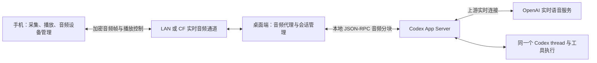
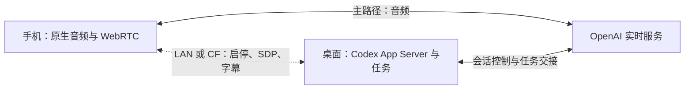

# 桌面端托管的 Codex 移动语音方案

日期：2026-09-12。初始方案边界是手机只负责音频输入输出和操作界面，桌面端管理全部 Codex/OpenAI 连接、会话、音频代理与任务执行。后续讨论将“手机直接建立 OpenAI WebRTC 媒体连接、桌面继续管理 Codex”纳入比较；最新建议见第 9 节。未来可把相同宿主能力放到 CLI 节点。

状态：源码、依赖和协议调研完成。未实现音频代理、未发起实际 OpenAI 通话、未对线上 CF Relay 压测。以下容量数据是明确假设下的计算，不是实测结果。

## 1. 结论

以下第 1–8 节评估桌面代理路径。将手机直连纳入可选范围后，建议先实现媒体直连、桌面控制，保留代理作为网络兼容路径；这不表示用户已经选择实施或两条路径已经通过真机验证。

可以继续采用 Cloudflare Workers + Durable Objects 承载手机与桌面端之间的音频。预计单个桌面房间的一路双向语音负载可控，但当前 Relay 不能原样承接：需要增加实时音频通道，去掉音频路径的持久化、ACK 重放及无限排队。

若首版时间优先，可以保留现有 CF 基础设施，为音频增加独立 WebSocket/房间对象。长期媒体方案优先验证手机与桌面的 WebRTC 直连 + CF TURN 兜底，具体费用见成本报告。手机和桌面端在同一局域网且直连成功时优先 LAN；仅连接 Wi-Fi 不代表实际走 LAN。公网经 CF 的主要不确定性是路径延迟、抖动和 TCP 丢包等待，而不是能否搬运音频字节。

## 2. 架构与职责



- 手机：录音、分帧、播放、静音、设备权限、扬声器/耳机/蓝牙路由、回声消除及有界播放缓冲。设备侧音频处理属于输入输出，仍应由原生音频栈处理。
- 桌面端：Codex 账号、thread、上下文、上游连接、格式适配、音频转发、转写处理、任务交接、权限、持久化和重连策略。
- CF：按通话和目标设备转发加密音频，不解码、不识别、不混音、不存储音频。
- OpenAI：模型推理和语音生成仍在云端；“桌面端托管”表示桌面端统一对接，不表示模型在桌面硬件本地推理。

手机无需持有 OpenAI 凭据、Codex thread 协议或到 OpenAI 的直接连接。

## 3. Codex 音频代理接口

本次使用仓库安装的 `@openai/codex 0.154.0` 成功生成并读取实验协议：

```sh
node_modules/@openai/codex-darwin-arm64/vendor/aarch64-apple-darwin/bin/codex app-server generate-ts --experimental --out /private/tmp/superone-codex-realtime-0154
```

| 接口 | 已核实契约 |
| --- | --- |
| `thread/realtime/start` | transport 可选 `websocket`、`webrtc { sdp }`、`existingCall { callId }`；响应为空对象 |
| `thread/realtime/started` | 异步通知，含 threadId、可空 realtimeSessionId、version |
| `thread/realtime/appendAudio` | 请求含 threadId 和 audio chunk |
| `thread/realtime/outputAudio/delta` | 通知含 threadId 和 audio chunk |
| `thread/realtime/itemAdded` | 非音频原始 item，类型为 JsonValue，不能仅根据 schema 推断完整中断协议 |
| `thread/realtime/stop` | 结束 thread 上的语音连接 |
| `thread/timeline/list` | 读取同一 thread 的时间线 |

`ThreadRealtimeAudioChunk` 包含 data、sampleRate、numChannels、samplesPerChannel、itemId。schema 没有充分证明编码、节拍、v3 与账号组合的实际可用性。

因此先验证主机侧 WebSocket 音频原型：输入已知音频，确认输出可播放、转写和工具任务能继续、用户插话能清理旧播放。不能把字段存在等同于这条路径已通。

当前 [桌面端实现](../../apps/desktop/src/main/codex/codex-realtime.ts) 固定 WebRTC transport，并没有映射 outputAudio/delta 或暴露 appendAudio。需要新增 transport 分支和独立音频收发接口；高频音频不要塞入普通 AgentEvent/chat reducer。

现有 v3、audio output、bemTags、自动 handoff、startup context 可作为验证起点。`flushTranscriptTailOnSessionEnd: true` 可能在挂断后产生最后一次 delegation，关闭媒体和结束后台任务必须分别处理。

[官方 App Server 文档](https://developers.openai.com/codex/app-server) 支持按安装版本生成 schema，但未详细覆盖这些 realtime 实验接口。[官方 WebSocket 指南](https://developers.openai.com/api/docs/guides/voice-websockets) 说明服务器代理音频的通用形态；其直接 API 配置不能直接替代 Codex 实验接口。

## 4. 音频负载估算

假设每个方向都持续发送 24 kHz、16-bit、单声道 PCM，不做压缩、静音抑制；单位使用十进制，均不含 TCP/TLS 开销。该格式只用于估算，Codex 实际格式需原型确认。

| 传输形态 | 双向合计码率 | 每分钟手机收发总量 |
| --- | --- | --- |
| 原始 PCM | 0.768 Mbps | 5.76 MB |
| 音频 Base64，再套现有 JSON/AES/Base64 风格 | 约 1.45–1.54 Mbps | 约 10.9–11.6 MB |

第二行使用 20/40 ms 分块、36 字符 callId、epoch、seq、采样率及声道元数据的示例封包计算。实际字段、音频输出节拍和静音时的行为会改变结果。这里算的是手机上下行合计；若统计 Relay 接收与转发的字节之和，同一数据经过入口和出口会再计算一次。

未压缩数据量通常不足以单独否决语音代理，但持续使用会消耗手机流量。若之后引入原生语音编码，手机仍只承担音频输入输出；是否值得加入，应由真机 CPU、带宽和延迟测试决定。

20 ms 分块意味着每个方向 50 帧/秒，双向共 100 个入站消息/秒、36 万个消息/小时。40 ms 分块约 50 个/秒、18 万个/小时；分块变大减少消息开销，却增加采集等待，不能只追求低消息数。

CF 文档给出单 Durable Object 约 1,000 requests/s 的软限制，并强调单线程处理与具体工作负载相关。源码按 room 分配对象，不是全部用户共享一个对象。因此一路通话的消息规模相对温和，但不能据此直接推算可承诺的并发通话数。[官方限制](https://developers.cloudflare.com/durable-objects/platform/limits/)

## 5. 当前 Relay 的具体问题

检查对象是仓库源码，不代表线上部署已经包含当前工作区全部修改。

1. **音频尚无入口。** [RelaySession](../../apps/relay/src/relay-session.ts) 只接收字符串并解析 JSON；ArrayBuffer 直接返回，类型联合没有 audio。新增二进制协议要同时改 CF、Desktop 和 relay-client。
2. **每条消息都触发存储操作。** `webSocketMessage()` 每次调用 `touchIdleTimer()`，后者执行 `storage.setAlarm()`。如果直接承载 20 ms 双向音频，仅音频就会触发约 36 万次/小时的 alarm 设置调用，还不含 ACK 等其他消息。
3. **普通 event 路径不适合音频。** `enqueue()` 为每个事件写 seq、加入最多 500 条的缓存并等待设备 ACK，断线后 replay。每秒 50 条输出音频时，500 条只代表约 10 秒的积压；旧音频应该作废，不能挤掉聊天历史或重连后补播。
4. **存储可能延迟转发。** CF 文档说明默认持久化写入会通过 output gate 阻止后续网络消息提前发出。即使代码不 await `put()`，也不等于这次发送完全绕过存储等待。不要为了音频全局放松聊天持久化保证，应隔离音频路径。[存储行为](https://developers.cloudflare.com/durable-objects/api/sqlite-storage-api/#supported-options)
5. **同一 WebSocket 会互相排队。** 现有控制、聊天、终端、大响应共享连接。只加一个 audio 类型仍共享底层 TCP 队列；大响应或丢包可能让语音等待。CF 自身的 send 缓冲也不应假定可无限使用或随意丢弃已经入队的字节。
6. **已有可参考的非重放转发。** terminal 下行不进 event 缓存，但仍共享连接且每条消息 touch alarm。可以借用它的定向转发思想，不能直接冒充 terminal 帧承载音频。

当前工作区 [手机原生加密接入](../../apps/mobile/src/native-crypto.ts) 已用 quick-crypto 和 quick-base64，并在入口安装。旧文档中纯 JS AES 约 1 MB/s 的说明不能直接当作当前默认实现的测量；已有手机安装包是否包含新原生模块及实际开销仍需验证。

## 6. CF 成本判断

2026-09-12 补充：[三个规模的具体成本、公式与 TURN / LiveKit / 自建方案比较](voice-relay-costs.md)。同一 Wi-Fi 下仅手机与桌面的本地媒体不经过 CF，桌面到 OpenAI 仍走公网。

CF 对入站 WebSocket 消息按 20:1 折算请求计费，出站 WebSocket 消息不另计消息请求费。20 ms 连续双向通话约对应每小时 18,000 个计费请求单位；40 ms 约 9,000 个。还要计算对象活跃时长、存储、其他 Worker 请求、套餐额度和取整，不能只看消息费。[官方定价](https://developers.cloudflare.com/durable-objects/platform/pricing/)

当前配置使用 SQLite-backed DO，官方把每次 setAlarm 计为一行写入。因此每音频包刷新 alarm 是明确应该去掉的成本来源。高频消息也不能简单按“用了 Hibernation，所以通话期间 duration 为零”预算；应依据实际 handler 活跃时长和是否符合休眠条件测量。

不查询账户、不读取线上账单时，不能给出当前部署每月实际费用。建议看每通话分钟的入站消息数、存储写入数和 GB-s，再按账户总量核算。

## 7. 推荐改造边界

- 保留现有 CF 服务，在同一项目增加专用 voice WebSocket 和独立房间对象，隔离聊天的大消息、持久化输出门和发送队列。当前一个 room 的第二个 desktop socket 会替换第一个，不能直接拿相同身份再开一条连接而不改路由。
- 音频直接转发加密二进制帧；只有启停、格式协商、字幕和状态走普通控制协议。CF 不读音频内容，主机负责转码和上游协议。
- 帧带 callId、连接 epoch、序号/采样位置和音频格式信息；只发给通话设备。重新建连作废上一代媒体帧。
- 不缓存、不 ACK 重放、不逐帧写存储；活跃时间在内存合并，必要的清理/心跳低频更新。
- 端点维护有界发送/播放队列，发送前限制积压，过期音频失效。严重 TCP 积压无法靠事后丢队列消除时，重建媒体连接。播放已发生的位置应能反馈主机，供插话与取消处理使用。
- 20–40 ms 为第一轮测试的候选分块，播放缓冲初值由实测调整。CF handler 限制帧尺寸和速率，防止异常流占满同一房间。
- 首版手机前台通话；麦克风权限、回声消除、音频中断和播放仍由原生模块处理。引入新原生模块需要重新构建客户端。

## 8. 实施与验收顺序

1. 主机侧验证 App Server WebSocket 音频输入输出、转写、插话和同一 thread 的 delegation。
2. 手机 ↔ Desktop LAN 音频原型，确认基础回声消除与双向播放。
3. CF 专用音频通道，对比 LAN/Relay；并行传图片、滚动聊天、输出终端内容，观察隔离是否有效。
4. 补齐主机通话所有权、超时清理、快速启停、断网重连、后台任务收尾和 timeline 恢复。
5. 未来支持 CLI 时，复用 `packages/codex` 的协议/事件逻辑，补持续 dispatcher、runtime busy 保持和节点连接适配。

验收要记录真实设备录音到播放的 p50/p95 延迟、帧间抖动、最大排队时长、播放欠载次数、每秒消息/存储操作、手机 CPU/JS 卡顿及耗电。跨设备绝对时间需校准，不能直接相减未同步时钟。

先做一次 30 分钟真机通话和受限网络测试，再决定是否增加音频压缩或改用手机 ↔ 主机的 WebRTC 媒体通道。即使换媒体传输，桌面端统一管理 Codex 的职责也不变。

## 9. 手机直连与桌面代理的综合选择

### 先区分媒体处理与 Agent 工作

手机运行原生 WebRTC，主要执行麦克风采集、回声消除、音频编解码、加密传输和播放，不在本机运行语音模型、Codex 或工具。采用手机与桌面 WebRTC 的代理路径时，这些手机端工作同样存在，因此不能推断代理显著节省手机 CPU 或电量。与之相比，把 PCM 经 JS/Base64 高频转发也可能引入额外复制、桥接和带宽成本；性能优劣需要真机测量。

[OpenAI 官方 WebRTC 文档](https://developers.openai.com/api/docs/guides/voice-webrtc?api=realtime)推荐移动客户端采用 WebRTC，并允许服务端代为交换 SDP；[服务端控制文档](https://developers.openai.com/api/docs/guides/voice-server-controls?api=realtime)支持媒体在客户端、会话控制与工具在后端。这是通用 API 的架构依据，不能把直接 API 的密钥、计费或事件契约套到 Codex App Server。

仓库现有实现也已分开职责：[桌面媒体端](../../apps/desktop/src/renderer/src/stores/realtime-call.ts)建立 PeerConnection，将 SDP offer 交给主进程，并应用 `realtime_sdp` answer；[Codex 接入](../../apps/desktop/src/main/codex/codex-realtime.ts)把 offer 传入 `thread/realtime/start` 的 WebRTC transport。移植时可让手机生成 offer，桌面继续使用当前 App Server、账号和 thread。手机无需获得长期 OpenAI 凭据，也不必重新创建一个脱离 Codex 的 API 会话。

这只是源码支持的集成判断。目前手机依赖中尚无 `react-native-webrtc`，本次未完成移动原生媒体、远程 SDP 路由或移动端实测。

### 对比

| 维度 | 手机直接连 OpenAI 媒体端 | 手机经桌面代理媒体 |
| --- | --- | --- |
| 手机网络 | 必须实际建立到 OpenAI 的 WebRTC 媒体连接 | 必须连上桌面或其 TURN/Relay；由桌面连接 OpenAI |
| 手机计算 | 原生音频与 WebRTC，Agent 仍在桌面 | 同样需要原生音频；若手机到桌面用 WebRTC，编解码负担相近 |
| 桌面计算 | Codex、上下文、工具、控制连接 | 前者加媒体收发、桥接及必要的转码 |
| 延迟 | 通常少一段媒体转发；最终取决于手机公网路径 | 多一段传输/处理；桌面的网络路径更好时可能胜出 |
| 我们承担的媒体中继费 | 无自营媒体中继费；仍有模型/账号及少量控制流量 | LAN/P2P 无中继费；公网 TURN 或专用 DO 按用量 |
| 桌面在线要求 | 当前 Codex 集成仍需要桌面在线 | 需要桌面在线，且桌面承担连续媒体服务 |
| 当前项目接入量 | 较小：移动音频端、远程启停/SDP、字幕和生命周期 | 较大：还需桌面音频桥接与媒体转发，WebSocket 音频模式尚待验证 |
| 网络覆盖 | 受手机到 OpenAI 路径限制 | 可统一使用桌面网络，适合手机无法访问 OpenAI 的环境 |

“手机能打开 OpenAI 网页”不足以判断直连可用。SDP 交换成功后仍需 ICE 连通、DTLS 建链及实际媒体流；仅 HTTP 请求成功、或桌面的代理网络可用，都不证明手机原生 WebRTC 可达。[WebRTC 连接流程](https://webrtc.org/getting-started/peer-connections)

麦克风授权、听筒/扬声器/蓝牙切换、来电中断、Wi-Fi/蜂窝切换、锁屏与后台策略是两种方案都要处理的移动能力，不是直连方案独有的成本。首版以前台通话为范围。

### 推荐方案与顺序

推荐目标架构：**桌面统一控制 Codex，手机媒体直连优先，桌面代理作为备用路径。** 优先实现直连的依据是较少的现有代码改动、没有自营媒体流量、通常更短的媒体路径；不能以未经测量的“WebRTC 对手机很重”为由排除它。



1. **第一阶段实现直连。** 手机生成 offer，经现有受认证控制连接送达桌面；桌面调用当前 App Server 并将 answer 定向回传该手机。媒体直接连接 OpenAI，字幕和任务状态由桌面统一分发。使用原生 WebRTC，不经普通聊天事件逐帧传音频；新增原生模块需要重建客户端。
2. **验证真实连接再判定就绪。** 不把收到 SDP 或 `realtime_started` 当作已经可说话；确认媒体连接与播放。重点测 Wi-Fi/蜂窝、受限网络、蓝牙、插话、断线以及桌面任务执行。记录候选连接、RTT、丢包、抖动、音频欠载与耗电。
3. **第二阶段补桌面代理。** 复用手机音频端，连接对象切换到桌面；手机到桌面优先 LAN/P2P，不能直连再经 CF TURN。桌面负责接入 Codex 音频，先验证协议桥接，再决定使用 WebRTC 媒体还是专用 DO WebSocket。禁止把高频音频塞入原聊天 event 路径。
4. **默认自动路由，保留强制桌面代理。** 直连媒体建链失败后关闭失败会话，再尝试代理。切换时沿用同一 Codex thread，但按可能需要重建实时语音会话设计，允许短暂中断；不承诺无缝迁移。每次通话绑定唯一设备和连接代次，避免两条路径重复采音或重复执行工具。

如果产品的硬性要求是“手机不需要任何 OpenAI 网络可达性”，应把桌面代理提升为第一阶段主路径。两种方案的主要选择依据是用户网络覆盖和开发成本，而不是手机运行模型的负担。
