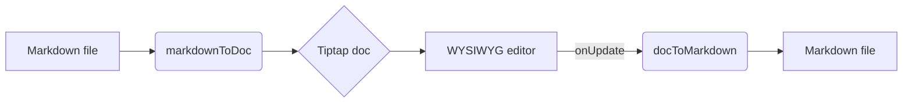
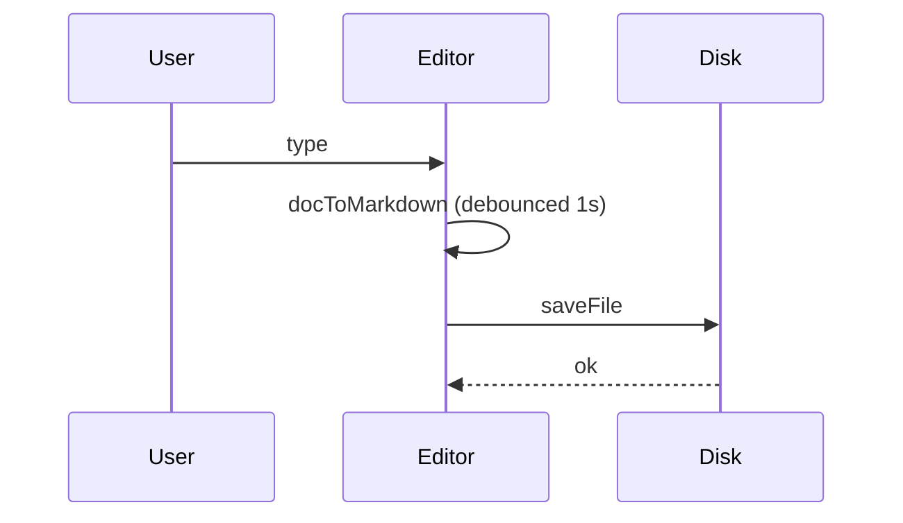

# H1 — Markdown Editor Coverage Fixture

This file exercises every Markdown construct the WYSIWYG editor is expected to handle. Open it in the file preview to verify rendering, then make a small edit to verify round‑trip serialization back to disk.

## H2 — Section heading

### H3 — Subsection

#### H4 — Sub-sub heading

##### H5 — small heading

###### H6 — smallest heading

## Paragraphs and line breaks

A normal paragraph wraps across lines without forcing a break — the editor should collapse the source newlines into a single flow.

This sentence has a soft line break next: line two of the same paragraph (two trailing spaces before the newline).

A second paragraph follows, separated by a blank line. Mixed languages should render correctly: 你好,世界。日本語のテスト。한국어 시험. ✅ 🚀 — em‑dash and en–dash too.

## Inline marks

- **Bold text** and **also bold**
- *Italic text* and *also italic*
- ***Bold + italic*** combined
- ~~Strikethrough~~ for deleted text
- `inline code` for short snippets
- A [normal link](https://anthropic.com) to anthropic.com
- An [https://example.com](https://example.com) auto-link
- A footnote-style reference link: [docs](https://docs.claude.com)

Escapes: `\*literal asterisks\*`, `\_literal underscores\_`, ```literal backtick```.

## Lists

### Unordered list

- First item
- Second item with **bold** word and `code`
- Third item
  - Nested level 2
  - Another nested
    - Nested level 3
- Back to top level

### Ordered list

1. Step one
2. Step two
3. Sub-step a
4. Sub-step b
5. Step three

### Task list (GFM)

- Open task
- Completed task
- Nested task list
  - Sub-task done
  - Sub-task pending

### List item with multiple paragraphs

1. First step. This is the headline of the step. A follow-up paragraph for the same list item, separated by a blank line. It should stay visually grouped with step 1.
2. Second step.

## Blockquotes

> Single-line blockquote.

> Multi-line blockquote that wraps over several source lines. The editor should treat this as a single block.

> Nested:
>
> > Inner quote — second level.
> >
> > > Inner inner quote — third level.

> **Blockquote can contain inline marks**, lists, and code:
>
> - item A
> - item B
>
> ```ts
> const inside = "code inside quote"
>
>
> ```

## Code blocks

A code block with no language:

```plaintext
plain text without highlighting
multiple lines preserved verbatim
  indentation kept


```

TypeScript:

```ts
type Codec = {
  encode(md: string): Promise<JSON>
  decode(json: JSON): string
}

export function roundTrip(md: string): Promise<string> {
  return encode(md).then(decode)
}


```

Python:

```python
def fibonacci(n: int) -> list[int]:
    a, b, out = 0, 1, []
    for _ in range(n):
        out.append(a)
        a, b = b, a + b
    return out


```

Shell:

```sh
#!/usr/bin/env bash
set -euo pipefail
echo "hello, $(whoami)"


```

JSON:

```json
{
  "name": "@superone/desktop",
  "version": "0.0.0",
  "private": true,
  "tags": ["electron", "wysiwyg"]
}


```

YAML:

```yaml
service: super-one
replicas: 3
env:
  - NAME=desktop
  - REGION=us-west


```

Diff:

```diff
- old line
+ new line


```

## Horizontal rule

Above the rule.

---

Below the rule.

## Tables (GFM)

| Feature | Supported | Notes\| |
| --- | --- | --- |
| Headings | ✅ | h1–h6 |
| Lists | ✅ | bullet / ordered / task |
| Tables | ✅ | GFM pipe table |
| Math | ✅ | KaTeX inline `$x$` and block `$$…$$` |
| Mermaid | ✅ | rendered via mermaid + fullscreen UI |

Alignment row reference:

| left | center | right |
| --- | --- | --- |
| a | b | c |
| 1 | 2 | 3 |

A table with inline marks inside cells:

| Cell with **bold** | Cell with `code` |
| --- | --- |
| *italic* here | [link](https://anthropic.com) |

## Links and images

- Absolute: [Claude](https://www.anthropic.com/claude)
- Relative repo file: [CLAUDE.md](../../CLAUDE.md)
- Anchor inside doc: [#tables](#tables-gfm)
- Bare URL with title: [tooltip](https://example.com)
- Empty alt image (decorative): 
- Image with alt + title: 

## HTML passthrough

Some inline raw HTML the editor should tolerate without breaking:

Key caps and badge pills round-trip as `<kbd>`, including one wrapping an icon
and its label: press <kbd>Cmd</kbd> then <kbd>K</kbd>, or click
<a href="https://example.com"><kbd> Example</kbd></a>.

<h3 align="center">A centred heading</h3>

<p align="center"><strong>A centred paragraph</strong><br />with a hard break inside it.</p>

subscript, superscript, and an HTML abbreviation.

Inline tags with no markdown spelling: <sub>subscript</sub>, <sup>superscript</sup>,
<ins>inserted</ins>, <u>underlined</u>, <mark>highlighted</mark>, <small>small</small>,
and an <abbr title="HyperText Markup Language">HTML</abbr> abbreviation.

An <a name="anchor-target"></a> anchor target, and a comment that other tools read:

<!-- prettier-ignore -->

A `<details>` block (collapsed by default):

<details>
<summary>Click to expand</summary>

Hidden content paragraph inside `<details>`. Includes a list:

- one
- two

</details>

A task list, with a plain item in the same list:

- [ ] unchecked
- [x] checked
- plain item

A footnote reference[^fixture] and its definition.

[^fixture]: The definition body, which must not be rewritten into an anchor.

A `<picture>` with an animated source and a static fallback:

<picture><source srcset="assets/demo.gif" type="image/gif"></picture>

A layout table whose cells hold block content:

<table>
<tr>
<td width="50%" valign="middle">

### Cell heading

Cell body paragraph.

</td>
<td width="50%">


</td>
</tr>
</table>

## Edge cases

Trailing whitespace at end of this paragraph (should not produce a hardBreak unless two spaces precede the newline).

Multiple blank lines below this paragraph (the editor may normalize to a single blank line, which is acceptable):

Special characters: `< > & " '` and emoji ✨🧪🪄.

Long inline code that wraps: `this_is_a_very_long_identifier_used_to_test_inline_code_wrapping_behavior_inside_paragraphs`.

A paragraph immediately followed by a heading (no blank line in source):

## Adjacent heading

A heading immediately followed by a paragraph with no blank line in source.

## LaTeX math (KaTeX)

Inline math flows with text: $E = mc^2$ and a slightly longer one $a^2 + b^2 = c^2$should render mid-paragraph.

Block / display math:

$$
\int_0^\infty e^{-x^2}\,dx = \frac{\sqrt{\pi}}{2}
$$

A matrix:

$$
\begin{pmatrix} a & b \\ c & d \end{pmatrix}
$$

Double-click any rendered formula to edit the LaTeX source. Press Esc to commit, ⌘/Ctrl-Enter also commits.

## Mermaid diagram

A flowchart:



A sequence diagram:



Double-click a diagram to edit its Mermaid syntax; hover and click the maximize button (or press Space when selected) for fullscreen with pan + zoom.

## Media

`` renders live in the editor: the src is resolved against the project root
for display only (the file keeps the relative path), and the extension picks the
element — image, `<video>`, or `<audio>`.


Broken paths degrade to their alt text rather than disappearing.

Raw `<video>` / `<audio>` tags are preserved verbatim — attributes and `<source>`
children included — and play in the preview:

<video src="media/demo.mp4" controls></video>

<audio src="media/take.mp3" controls loop></audio>

<video controls><source src="media/demo.webm" type="video/webm"><source src="media/demo.mp4" type="video/mp4"></video>

---

## Footer

End of fixture. If everything above renders cleanly and a no-op edit produces a `git diff` limited to whitespace / mark normalization (`*italic*` ↔ `_italic_` is acceptable), the WYSIWYG editor is healthy.
